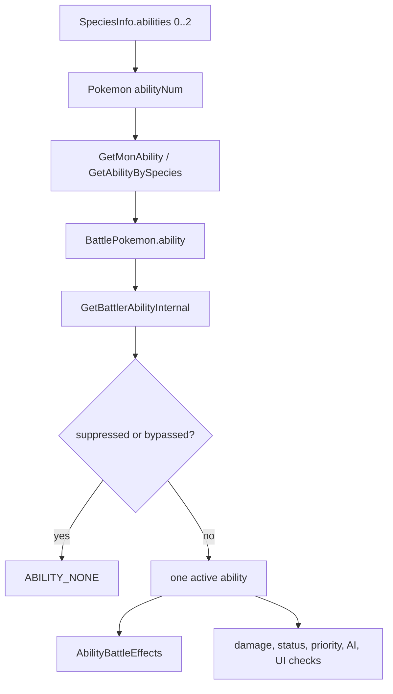
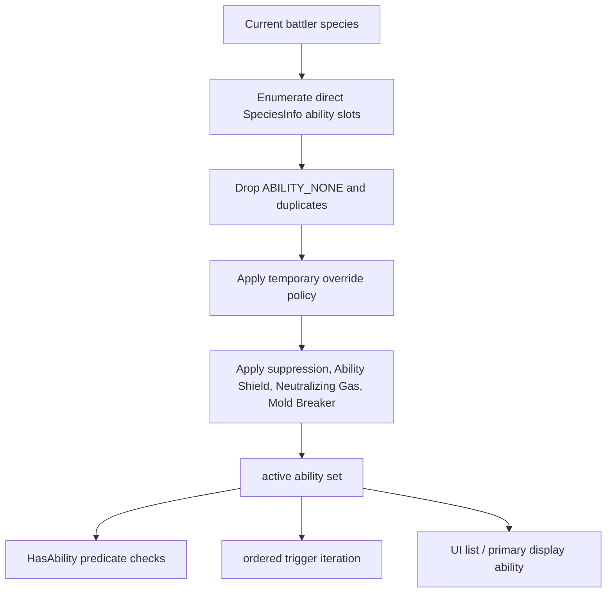

# All Ability Slots Runtime Investigation

## Document Metadata

| Field | Value |
|---|---|
| Last reviewed | 2026-05-23 |
| Baseline | `master` `de310ef9eb`; upstream `expansion/1.15.2-96-gde310ef9eb` |
| Code status | Docs-only investigation / source read only |
| Provenance | Local project overlay |

## Existing Files

| File | Symbols | Notes |
|---|---|---|
| `include/constants/pokemon.h` | `NUM_ABILITY_SLOTS`, `NUM_NORMAL_ABILITY_SLOTS`, `NUM_HIDDEN_ABILITY_SLOTS`, `NUM_ABILITY_PERSONALITY` | The engine already has three slots: two normal slots and one hidden slot. |
| `include/pokemon.h` | `struct SpeciesInfo.abilities`, `PokemonSubstruct3::abilityNum`, `struct BattlePokemon.abilityNum`, `struct BattlePokemon.ability` | Species data has three ability entries. Stored Pokemon and battle Pokemon keep a 2-bit ability slot plus one active `enum Ability`. |
| `src/pokemon.c` | `GetAbilityBySpecies`, `GetMonAbility`, `GetSpeciesAbility`, `PokemonToBattleMon` | `GetAbilityBySpecies()` returns one ability and falls back from empty hidden / normal slots. `PokemonToBattleMon()` materializes one active ability into `BattlePokemon.ability`. |
| `src/battle_util.c` | `GetBattlerAbilityInternal`, `GetBattlerAbility`, `AbilityBattleEffects`, `CanBreakThroughAbility`, `IsAbilityOnField`, `CopyMonAbilityAndTypesToBattleMon`, `TryBattleFormChange`, `GetBattleFormChangeTargetSpecies` | The battle engine centers on one active ability per battler. Suppression, Mold Breaker, Ability Shield, switch-in triggers, form-change checks, and field-presence checks are all single ability APIs. |
| `src/battle_switch_in.c` | `DoSwitchInEvents`, `FirstEventBlockEvents` | Switch-in order snapshots `calcValues.abilities[battler] = GetBattlerAbility(battler)` and then triggers one ability per event block. |
| `src/battle_move_resolution.c` | move-end ability hooks, status / contact checks | Move resolution uses one attacker and defender ability for priority, PP Pressure, contact effects, Magic Guard, Liquid Ooze, Sticky Hold, Dancer, Pickpocket, and form changes. |
| `src/battle_script_commands.c` | `Cmd_jumpifability`, `Cmd_trycopyability`, `Cmd_tryswapabilities`, `Cmd_tryoverwriteability`, `BS_SetTracedAbility`, `BS_HandleFormChange` | Battle script commands compare, copy, swap, overwrite, and display one ability. Scripts contain many `jumpifability` branches. |
| `data/battle_scripts_1.s` | `jumpifability`, `trycopyability`, `tryentrainment`, `showabilitypopup`, `handleformchange` | Script bytecode assumes one ability predicate or one ability popup at a time. |
| `src/party_menu.c` / `src/item_use.c` | `ItemUseCB_AbilityCapsule`, `ItemUseCB_AbilityPatch`, `Task_AbilityCapsule`, `Task_AbilityPatch` | Capsule flips slot 0/1 with `^ 1`; Patch toggles hidden slot 2 vs slot 0. Both set `MON_DATA_ABILITY_NUM`. |
| `src/pokemon_summary_screen.c` | `ExtractMonDataToSummaryStruct`, `PrintMonAbilityName`, `PrintMonAbilityDescription` | Summary stores one `abilityNum` and prints one ability name / description. |
| `src/battle_ai_main.c`, `src/battle_ai_util.c`, `src/battle_ai_switch.c` | `struct AiLogicData.abilities`, `AI_DecideKnownAbilityForTurn`, `SetBattlerAiData` | AI stores one known ability per battler and uses direct equality checks across damage, switch, item, weather, status, and prediction logic. |
| `include/battle.h` / `include/battle_message.h` / `include/battle_util.h` | `BattleHistory.abilities`, `AiLogicData.abilities`, `BattleCalcValues.abilities` | Cached battle, message, AI, and calculation structs all store one ability per battler. |
| `src/wild_encounter.c`, `src/fishing.c`, `src/fldeff_cut.c`, `src/event_object_movement.c`, `src/match_call.c` | `GetMonAbility` callers | Field and encounter helpers also use one lead Pokemon ability. All-active behavior is not only a battle issue. |

## Existing Ability Flow

Confirmed source-wide search on `master` `de310ef9eb`:

| Search | Result |
|---|---|
| `GetBattlerAbility` occurrences | 290 occurrences across 18 files. |
| `GetMonAbility` occurrences | 31 occurrences. |
| Cached single-ability state families | `BattlePokemon.ability`, `BattleCalcValues.abilities`, `AiLogicData.abilities`, `BattleHistory.abilities`, battle text `lastAbility`. |

## Required New Flow

The key design change is that most call sites should stop asking for one
ability. They should ask one of these questions instead:

| New helper category | Intended use |
|---|---|
| `BattlerHasAbility(battler, ability)` | Equality checks, status immunity, field presence, "jump if ability" behavior. |
| `BattlerHasAnyAbility(battler, abilities, count)` | Multi-ability predicates such as Plus / Minus, anti-phasing abilities, or status guards. |
| `ForEachBattlerAbility(battler, flags, callback)` | Switch-in, move-end, end-turn, weather, terrain, form-change triggers. |
| `GetBattlerPrimaryAbility(battler)` | Legacy display, fallback text, current `GetBattlerAbility()` compatibility. |
| `GetMonAbilitySet(mon, outSet)` | Summary, field lead ability checks, party / PC UI. |

## Ability Slot Enumeration Detail

Use `GetSpeciesAbility(species, slot)` for set construction. Do not build the
set by calling `GetAbilityBySpecies(species, slot)` for slots 0, 1, and 2,
because `GetAbilityBySpecies()` has fallback behavior:

- if a requested hidden slot is empty, it searches other hidden slots;
- if no ability was found, it returns the first non-empty ability;
- repeated calls can therefore duplicate slot 0 when slot 2 is `ABILITY_NONE`.

The set builder should:

1. read direct slots 0..`NUM_ABILITY_SLOTS - 1`;
2. skip `ABILITY_NONE`;
3. dedupe identical abilities;
4. preserve slot order for deterministic trigger order.

This dedupe is part of the requested battle contract. A table such as
`Intimidate / Intimidate / Defiant` should behave as one Intimidate activation
plus Defiant, not two Intimidate activations.

## Ability Capsule / Patch Impact

Current behavior:

| Item | Current source behavior |
|---|---|
| Ability Capsule | `ItemUseCB_AbilityCapsule()` sets `tAbilityNum = current ^ 1` and rejects hidden slot / missing ability cases. |
| Ability Patch | `ItemUseCB_AbilityPatch()` toggles between hidden slot 2 and slot 0. |

In all-active mode, changing `MON_DATA_ABILITY_NUM` does not change the active
battle set if the active set is "all legal species slots". The least confusing
MVP policy is to make both items fail with the usual "won't have any effect"
message while all-active mode is enabled. Later revisions can repurpose them as:

- primary display slot selectors;
- hidden-slot unlock items if hidden abilities are not always active;
- product / facility balance items outside normal battle ability behavior.

## Mega, Form, and Ring Impact

The Mega Ring check itself is mostly independent of ability slots:
`CanMegaEvolve()` checks player item ownership, used gimmick state, active
gimmick state, Sky Drop, Z-Crystal, and form-change table availability.

Ability impact enters through form-change helpers:

| Source | Current single-ability assumption |
|---|---|
| `CanMegaEvolve()` / `ActivateMegaEvolution()` | Reads `enum Ability ability = GetBattlerAbility(battler)` and passes one ability to form-change logic. |
| `CanUltraBurst()` / `ActivateUltraBurst()` | Same one-ability form-change argument. |
| `TryBattleFormChange()` | Receives one ability, calls `GetBattleFormChangeTargetSpecies()`, and changes species / stats. |
| `GetFormChangeTargetSpecies_Internal()` | Some form-change methods compare `ctx.ability` with table parameters. |
| `BS_HandleFormChange()` | Updates species and healthbox display, not a multi-ability cache. |

All-active mode should treat Mega Evolution as an overlay, not a replacement:

- before Mega Evolution, the active set is the base species direct slots;
- after Mega Evolution, the active set is base species direct slots plus Mega
  target species direct slots;
- the maximum is six active ability entries before duplicate removal;
- duplicate abilities across base and Mega species still count once.

This is deliberately stronger than normal form species replacement. It keeps the
mode's "all specs unlocked" fantasy intact, but it is a major balance risk. For
Primal Reversion, Ultra Burst, and non-Mega form changes, the runtime branch must
choose whether to use the same overlay rule or the safer current-species-only
rule before implementation.

Ability-gated form-change checks still need explicit handling. A form change
that requires an ability should pass when any effective active ability matches
the requirement, unless that ability is suppressed for that check.

## Battle-Only MVP Boundary

The requested first implementation is battle-focused. Field lead ability checks
should keep current single-ability behavior unless a later feature explicitly
extends all-slot rules outside battle.

Confirmed field callers include:

| File | Example impact |
|---|---|
| `src/wild_encounter.c` | Lead ability encounter modifiers. |
| `src/fishing.c` | Fishing lead ability behavior. |
| `src/fldeff_cut.c` | Cut user ability handling. |
| `src/event_object_movement.c` | Overworld poison / special sprite movement checks. |
| `src/match_call.c` | Match Call Lightning Rod check. |

Keeping these single-ability for MVP avoids surprising overworld behavior and
keeps the first branch focused on trainer / facility / battle systems.

## Balance Separation

All-active mode will deliberately create a new battle environment, similar in
scope to an alternate ruleset. Strong combinations such as Neutralizing Gas plus
additional defensive or offensive abilities can reshape the format. This is
expected and should not block the mechanical prototype.

Balance work should be a separate feature or revision:

- species-slot table edits;
- direct buffs to weak abilities such as Leaf Guard-style effects;
- bans / allowlists for extreme combinations;
- trainer, gym leader, and facility team retuning;
- mode-specific item / Ability Capsule / Patch policy.

## Battle Categories

| Category | Examples | Conversion shape |
|---|---|---|
| Predicate checks | Magic Guard, Soundproof, Sticky Hold, Shadow Tag, Comatose | Replace equality with `BattlerHasAbility`. |
| Field presence | Neutralizing Gas, weather auras, Ruin abilities, Unnerve | Replace field scans with `FindBattlerWithAbility` over active sets. |
| Trigger dispatch | Intimidate, Drizzle, Download, Dancer, Opportunist | Iterate active abilities in stable slot order and run existing `AbilityBattleEffects` cases per ability. |
| Modifier helpers | speed, priority, accuracy, type effectiveness, contact | Split helpers that take one `enum Ability` into either predicate helpers or a compact ability set parameter. |
| Ability-changing effects | Trace, Role Play, Doodle, Skill Swap, Entrainment, Simple Beam, Worry Seed, Receiver | Needs explicit temporary override policy before implementation. |
| Suppression / bypass | Gastro Acid, Neutralizing Gas, Mold Breaker, Ability Shield, Core Enforcer | Must suppress or bypass per active ability instead of returning one global ability. |

## Source-Wide Impact Check

| Check | Result / notes |
|---|---|
| Constants / IDs | No new ability IDs required. A config flag such as `B_ALL_ABILITY_SLOTS_ACTIVE` or a runtime rule flag is likely needed. |
| Primary data table | `SpeciesInfo.abilities[3]` already exists. No data migration needed for the base goal. |
| Runtime entry point | `GetBattlerAbilityInternal()` cannot simply change return semantics. Add a helper layer and migrate call-site families. |
| Script command / special | `jumpifability`, `trycopyability`, `tryentrainment`, `tryoverwriteability`, `trytoclearprimalweather`, and ability popup scripts need review. |
| Callback / task | Ability Capsule / Patch item tasks and Summary / party UI tasks need behavior changes. |
| Save / runtime state | Save layout can remain compatible if `abilityNum` stays as representative slot. Runtime temporary override state may need expansion if singular `overwrittenAbility` is not enough. |
| UI / window / sprite / text | Summary prints one ability; battle popups display one ability; party / PC / team viewer surfaces need compact multi-ability display policy. Summary is the first required full-list surface. |
| Battle / AI | Very high impact. AI and battle calc structs cache one ability per battler. |
| Build tools / generated files | No generated data requirement for the MVP. Future balance audits may use generated species ability reports. |
| Tests | Needs broad battle tests: predicate abilities, trigger abilities, suppression, copy/swap/overwrite, AI, Mega/form changes, and item UI. |
| Upstream migration | High conflict risk around battle util, battle script commands, battle AI, Summary, and party item-use paths. |

## Related Existing Docs

- [Move / Item / Ability Map v15](../../overview/move_item_ability_map_v15.md)
- [Battle Effect Resolution Flow v15](../../flows/battle_effect_resolution_flow_v15.md)
- [Battle AI Decision Flow v15](../../flows/battle_ai_decision_flow_v15.md)
- [Summary Screen Flow v15](../../flows/summary_screen_flow_v15.md)
- [Party / Status UI Overhaul](../party_status_ui_overhaul/README.md)
- [Pokemon State Editor](../pokemon_state_editor/README.md)
- [Pre-Battle / In-Battle Team Viewer](../prebattle_team_viewer/README.md)

## Open Questions

- Should a temporary overwritten ability replace all natural abilities, or should
  it be added on top of the natural set?
- If a target has three traceable abilities, which one should Trace copy:
  primary slot, first active slot, random active slot, or all active slots?
- Should Gastro Acid suppress all suppressible active abilities while leaving
  unsuppressable abilities active?
- How much ability popup spam is acceptable when a Pokemon has multiple
  switch-in abilities?
- Should Primal Reversion, Ultra Burst, and non-Mega form changes use the same
  base-plus-form overlay rule as Mega Evolution, or only the current species set?
