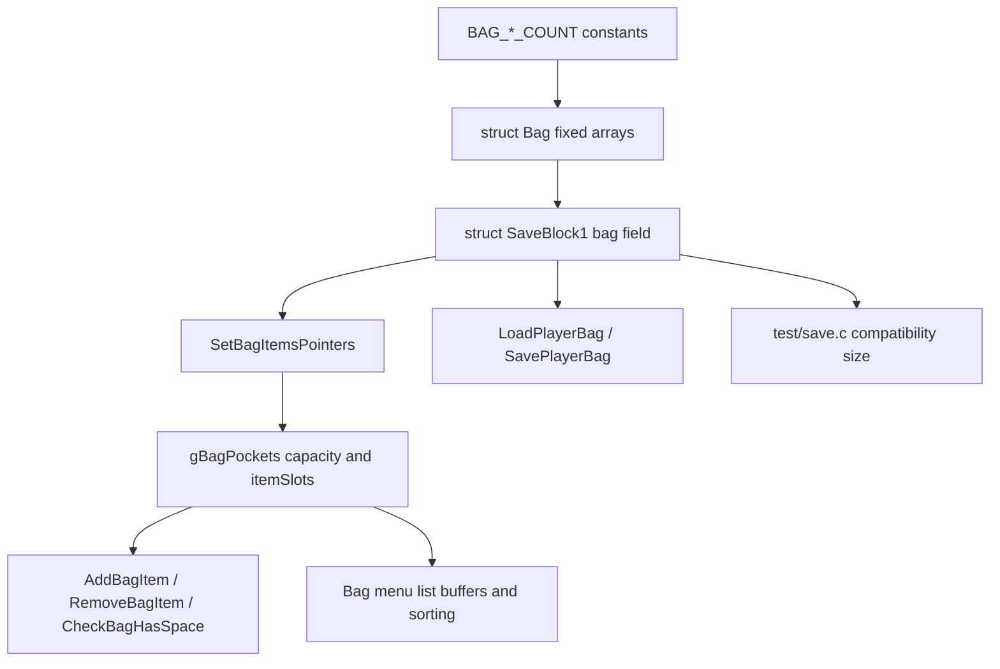

# Bag Expansion Investigation

## Document Metadata

| Field | Value |
|---|---|
| Last reviewed | 2026-05-09 |
| Baseline | `master` `835520e444`; `git describe` = `expansion/1.15.2-32-g835520e444` |
| Code status | Docs-only investigation |
| Provenance | Local project feature docs |

## Existing Files

| File | Symbols | Notes |
|---|---|---|
| `include/constants/global.h` | `BAG_ITEMS_COUNT`, `BAG_KEYITEMS_COUNT`, `BAG_POKEBALLS_COUNT`, `BAG_TMHM_COUNT`, `BAG_BERRIES_COUNT` | Current counts are 30 / 30 / 16 / 64 / 46. |
| `include/global.h` | `struct ItemSlot`, `struct Bag`, `struct SaveBlock1` | Normal bag storage is fixed arrays inside `SaveBlock1` at the `bag` field. |
| `src/item.c` | `gBagPockets`, `SetBagItemsPointers`, `ApplyNewEncryptionKeyToBagItems`, `AddBagItem`, `CheckBagHasSpace` | Runtime operations use `gBagPockets[pocket].capacity`, which is set from the `BAG_*_COUNT` constants. |
| `src/item_menu.c` | `MAX_POCKET_ITEMS`, `ListBuffer1`, `ListBuffer2`, `TempWallyBag`, `UpdatePocketItemList`, `MergeSort` | UI buffers scale from the largest pocket size. Wally tutorial snapshots only Items and Poke Balls. |
| `src/load_save.c` | `gLoadedSaveData`, `LoadPlayerBag`, `SavePlayerBag` | Bag backup / restore copies `sizeof(struct Bag)` plus mail. |
| `src/rom_header_gf.c` | `bagCountItems`, `bagCountKeyItems`, `bagCountPokeballs`, `bagCountTMHMs`, `bagCountBerries` | ROM header exposes bag counts as `u8` fields. Counts above 255 need a separate decision. |
| `src/debug.c` | `DebugAction_PCBag_Fill_Pocket*` | Debug fill uses `CheckBagHasSpace` / `AddBagItem`; larger pockets affect fill runtime and validation. |
| `test/save.c` | `T_SAVEBLOCK1_SIZE`, `T_SAVEBLOCK2_SIZE`, `T_SAVEBLOCK3_SIZE` | Current compatibility expected sizes are SaveBlock1 `15568`, SaveBlock2 `3884`, SaveBlock3 `4`. |
| `docs/features/field_move_modernization/*` | Bag / Key Item Capacity notes | Field Kit docs explicitly split bag expansion out as a separate feature. |
| `docs/overview/tm_hm_expansion_250_v15.md` | Bag capacity / save layout | TM/HM pocket `64` is a blocker if all 250 TMs are stored as item slots. |
| `docs/features/champions_challenge/*` | Bag snapshot / restore | Normal bag snapshot uses `struct Bag`; saved challenge state competes for SaveBlock1 capacity. |

## Existing Flow

## Current Capacity

| Pocket | Constant | Slots |
|---|---|---:|
| Items | `BAG_ITEMS_COUNT` | 30 |
| Key Items | `BAG_KEYITEMS_COUNT` | 30 |
| Poke Balls | `BAG_POKEBALLS_COUNT` | 16 |
| TM/HM | `BAG_TMHM_COUNT` | 64 |
| Berries | `BAG_BERRIES_COUNT` | 46 |
| Total normal bag slots | all normal pockets | 186 |

`struct ItemSlot` contains `enum Item itemId` and `u16 quantity`; current docs and offsets
place `struct Bag` at `0x2E8` bytes, which matches 186 slots x 4 bytes.

`test/save.c` fixes the current save sizes:

| Block | Max | Current | Remaining |
|---|---:|---:|---:|
| SaveBlock1 | 15872 | 15568 | 304 |
| SaveBlock2 | 3968 | 3884 | 84 |
| SaveBlock3 | 1624 | 4 | 1620 |

Bag expansion consumes SaveBlock1. SaveBlock3 free space is not a normal-bag solution.

## Sizing Examples

| Change | Extra slots | Approx SaveBlock1 growth | Fits current 304 B spare? | Notes |
|---|---:|---:|---|---|
| Key Items 30 -> 64 | 34 | 136 B | Yes, but save-breaking | Useful if Field Kit grows into multiple key items. |
| TM/HM 64 -> 128 | 64 | 256 B | Yes, but leaves little spare | Still not enough for 250 TMs. |
| TM/HM 64 -> 250 | 186 | 744 B | No | Needs FREE_* capacity, migration, or virtual TM ownership. |
| Add 100 slots across pockets | 100 | 400 B | No | Requires capacity recovery or a save-breaking layout plan. |

These numbers are layout estimates. Any implementation must rebuild and update `test/save.c`
intentionally if the save-breaking change is accepted.

## Source-Wide Impact Check

| Check | Result / notes |
|---|---|
| Constants / IDs | Direct impact: `include/constants/global.h` bag counts. Item IDs are separate and should not be moved just to expand pockets. |
| Primary data table | Indirect impact: `src/data/items.h` pocket assignment determines which expanded pocket receives new items. |
| Runtime entry point | Direct impact: `AddBagItem`, `RemoveBagItem`, `CheckBagHasSpace`, `GetFreeSpaceForItemInBag`. |
| Script command / special | Indirect impact: item gift scripts and `giveitem` paths use bag space checks. |
| Callback / task | Direct UI impact: `src/item_menu.c` list buffers, sorting, Wally tutorial bag setup, registered item return paths. |
| Save / runtime state | High impact: `struct Bag` changes `struct SaveBlock1`; `LoadPlayerBag` / `SavePlayerBag` copy size changes. |
| UI / window / sprite / text | Medium impact: larger pockets stress list buffers and scrolling; no immediate text change expected. |
| Battle / AI | Indirect impact: battle bag item availability and held item give/switch paths use the same bag helpers. |
| Build tools / generated files | No generated data identified for normal bag counts. `rom_header_gf.c` exposes counts to external tooling. |
| Tests | Direct impact: `test/save.c` compatibility sizes and focused item/bag tests. |
| Upstream migration | High impact: upstream save layout / bag refactor changes must be rechecked. |

## Cross-Doc Findings

- `docs/features/field_move_modernization/` now treats bag expansion as a separate large feature because `BAG_KEYITEMS_COUNT` is fixed at 30.
- `docs/overview/tm_hm_expansion_250_v15.md` already records that increasing `BAG_TMHM_COUNT` changes `struct Bag` inside `SaveBlock1`.
- `docs/flows/save_data_flow_v15.md` now records bag expansion as a SaveBlock1 `struct Bag` decision and corrects the Champions Challenge snapshot estimate to roughly 600 B total for `struct Pokemon[PARTY_SIZE]` plus the current `0x2E8` B bag.

## Open Questions

- Which exact pocket count should be the first implementation target?
- Should the project accept a save-breaking change, or require migration for existing `.sav` files?
- Should high TM counts be represented as item slots, a bitset / registry, or a shop/relearner rule that does not require every TM in the bag?
- Do external tools that read the GF ROM header tolerate larger bag counts, especially near or above 255?
