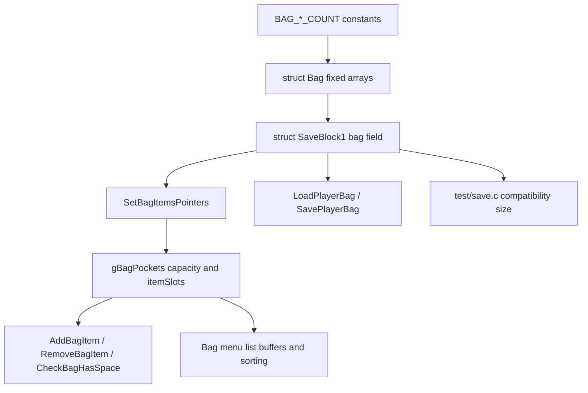

# Bag Expansion Investigation

## Document Metadata

| Field | Value |
|---|---|
| Last reviewed | 2026-05-09 |
| Baseline | `master` `835520e444`; `git describe` = `expansion/1.15.2-32-g835520e444` |
| Code status | Docs-only investigation |
| Provenance | Local project feature docs |

## Existing Files

| File | Symbols | Notes |
|---|---|---|
| `include/constants/global.h` | `BAG_ITEMS_COUNT`, `BAG_KEYITEMS_COUNT`, `BAG_POKEBALLS_COUNT`, `BAG_TMHM_COUNT`, `BAG_BERRIES_COUNT` | Current counts are 30 / 30 / 16 / 64 / 46. |
| `include/global.h` | `struct ItemSlot`, `struct Bag`, `struct SaveBlock1` | Normal bag storage is fixed arrays inside `SaveBlock1` at the `bag` field. |
| `src/item.c` | `gBagPockets`, `SetBagItemsPointers`, `ApplyNewEncryptionKeyToBagItems`, `AddBagItem`, `CheckBagHasSpace` | Runtime operations use `gBagPockets[pocket].capacity`, which is set from the `BAG_*_COUNT` constants. |
| `src/item_menu.c` | `MAX_POCKET_ITEMS`, `ListBuffer1`, `ListBuffer2`, `TempWallyBag`, `UpdatePocketItemList`, `MergeSort` | UI buffers scale from the largest pocket size. Wally tutorial snapshots only Items and Poke Balls. |
| `src/load_save.c` | `gLoadedSaveData`, `LoadPlayerBag`, `SavePlayerBag` | Bag backup / restore copies `sizeof(struct Bag)` plus mail. |
| `src/rom_header_gf.c` | `bagCountItems`, `bagCountKeyItems`, `bagCountPokeballs`, `bagCountTMHMs`, `bagCountBerries` | ROM header exposes bag counts as `u8` fields. Counts above 255 need a separate decision. |
| `src/debug.c` | `DebugAction_PCBag_Fill_Pocket*` | Debug fill uses `CheckBagHasSpace` / `AddBagItem`; larger pockets affect fill runtime and validation. |
| `test/save.c` | `T_SAVEBLOCK1_SIZE`, `T_SAVEBLOCK2_SIZE`, `T_SAVEBLOCK3_SIZE` | Current compatibility expected sizes are SaveBlock1 `15568`, SaveBlock2 `3884`, SaveBlock3 `4`. |
| `docs/features/field_move_modernization/*` | Bag / Key Item Capacity notes | Field Kit docs explicitly split bag expansion out as a separate feature. |
| `docs/overview/tm_hm_expansion_250_v15.md` | Bag capacity / save layout | TM/HM pocket `64` is a blocker for the older 250-TM sketch and for the current 350-TM target if stored as item slots. |
| `docs/features/champions_challenge/*` | Bag snapshot / restore | Normal bag snapshot uses `struct Bag`; saved challenge state competes for SaveBlock1 capacity. |

## Existing Flow

## Current Capacity

| Pocket | Constant | Slots |
|---|---|---:|
| Items | `BAG_ITEMS_COUNT` | 30 |
| Key Items | `BAG_KEYITEMS_COUNT` | 30 |
| Poke Balls | `BAG_POKEBALLS_COUNT` | 16 |
| TM/HM | `BAG_TMHM_COUNT` | 64 |
| Berries | `BAG_BERRIES_COUNT` | 46 |
| Total normal bag slots | all normal pockets | 186 |

`struct ItemSlot` contains `enum Item itemId` and `u16 quantity`; current docs and offsets
place `struct Bag` at `0x2E8` bytes, which matches 186 slots x 4 bytes.

`test/save.c` fixes the current save sizes:

| Block | Max | Current | Remaining |
|---|---:|---:|---:|
| SaveBlock1 | 15872 | 15568 | 304 |
| SaveBlock2 | 3968 | 3884 | 84 |
| SaveBlock3 | 1624 | 4 | 1620 |

Bag expansion consumes SaveBlock1. SaveBlock3 free space is not a normal-bag solution.

## Current Item Catalog Pressure

The canonical item count comes from `include/constants/items.h`, not from a loose
scan of the item data table. On the 2026-05-09 baseline:

- `ITEM_NONE = 0`
- `ITEM_GLIMMORANITE = 873`
- `ITEMS_COUNT = 874`
- `ITEM_FIELD_ARROW = ITEMS_COUNT`

That means the current real item ID catalog is 873 items, excluding `ITEM_NONE`.
The data table classification still matters for pocket pressure, because
`src/data/items.h` controls each item's `.pocket`.

| Pocket | Current slots | Current item definitions | Extra slots to hold every defined item | Approx SaveBlock1 growth |
|---|---:|---:|---:|---:|
| Items | 30 | 595 | 565 | 2260 B |
| Key Items | 30 | 74 | 44 | 176 B |
| Poke Balls | 16 | 28 | 12 | 48 B |
| TM/HM | 64 | 108 | 44 | 176 B |
| Berries | 46 | 68 | 22 | 88 B |
| Total | 186 | 873 | 687 | 2748 B |

Raw "one slot for every current item definition" storage would grow SaveBlock1 from
`15568` to roughly `18316` bytes, which is about `2444` bytes over the current
`15872` byte SaveBlock1 sector budget. The Items pocket alone would need about
`2260` bytes, so "all normal tools/items fit at once" is not viable as a small
constant-only change.

## 1000-Slot Target

The working target is roughly 1000 total normal bag slots across Items, Key Items,
Poke Balls, TM/HM, and Berries, with TM/HM around 350 slots.

| Target | Slots | Extra slots over current 186 | Approx SaveBlock1 growth |
|---|---:|---:|---:|
| Total normal bag | 1000 | 814 | 3256 B |
| TM/HM only | 350 | 286 over current 64 | 1144 B |
| Non-TM pockets after TM/HM 350 | 650 total | 528 over current 122 | 2112 B |

Capacity sources:

| Source | Available bytes for SaveBlock1 growth | Max total slots from current 186 | Result for 1000-slot target |
|---|---:|---:|---|
| Current spare only | 304 B | 262 | Not enough |
| Current spare + all SaveBlock1 `FREE_*` toggles | 2820 B | 891 | Short by 436 B |
| Current spare + all SaveBlock1 `FREE_*` + reclaim SaveBlock3 chunk bytes | 3284 B | 1007 | Fits by about 28 B |

The last row is the only current path that makes 1000 raw slots fit without finding
new SaveBlock1 savings elsewhere. It is a save-format decision, not just a bag
constant change: `include/save.h` currently reserves `SAVE_BLOCK_3_CHUNK_SIZE 116`
bytes per sector. Reclaiming those bytes would require removing or relocating the
current `struct SaveBlock3` data, updating `SECTOR_DATA_SIZE`, and validating the
save/load format. Current `test/save.c` records `sizeof(struct SaveBlock3) == 4`.

This option conflicts with larger SaveBlock3 features. `USE_DEXNAV_SEARCH_LEVELS`
stores `NUM_SPECIES` bytes; the current `NUM_SPECIES` is `1573`, so DexNav search
levels plus `dexNavChain` need about `1574` bytes of the `1624` byte SaveBlock3
budget. Enabling first-time item description flags would add about `110` more bytes
at the current `ITEMS_COUNT`, which would overflow SaveBlock3 unless another field
is removed or relocated. If DexNav search levels are part of the target build,
do not plan on reclaiming SaveBlock3 chunk bytes for bag storage.

## Can The SaveBlock1 Frame Grow?

Yes, but not by changing an `u8` to `u16`. The normal save area is constrained by
the 32 physical 4 KiB flash sectors and the current two-slot layout:

| Area | Physical sectors | Current role |
|---|---:|---|
| Save slot 1 | 0-13 | 14 rotating normal-save sectors |
| Save slot 2 | 14-27 | 14 rotating normal-save sectors |
| Hall of Fame | 28-29 | Special sectors |
| Trainer Hill | 30 | Special sector |
| Recorded Battle | 31 | Special sector |

Within each 14-sector normal save slot, the current allocation is:

| Data | Sectors | Current max |
|---|---:|---:|
| SaveBlock2 | 1 | 3968 B |
| SaveBlock1 | 4 | 15872 B |
| PokemonStorage | 9 | 35712 B |

The practical options are:

| Option | What it gives | Cost / risk |
|---|---:|---|
| Widen `u8` counters only | Fixes UI/list counts above 255 | Does not add any save capacity. |
| Reclaim SaveBlock3 chunk bytes | +464 B to SaveBlock1 across its 4 sectors | Removes the 1624 B SaveBlock3 feature area; conflicts with DexNav search levels. |
| Increase normal save slot 14 -> 15 sectors | Adds one full normal sector per save slot; SaveBlock1 could grow by +3968 B while keeping SaveBlock3 chunks | Consumes the two Hall of Fame sectors and changes the save slot layout; save-breaking and needs HOF policy. |
| Increase normal save slot 14 -> 16 sectors | Adds two normal sectors per save slot | Consumes Hall of Fame, Trainer Hill, and Recorded Battle sectors; largest save-format rewrite while keeping two-slot redundancy. |
| Take a sector from PokemonStorage | Gives SaveBlock1 one more sector inside the current 14-sector slot | Requires shrinking PokemonStorage. Reducing from 14 to 13 PC boxes is roughly one-sector savings, but this is a major gameplay/UI change. |
| Use special sectors as custom bag-extension storage | Up to several KiB outside SaveBlock1 | Not part of normal rotating save slots; needs custom mirroring/checksum/load/save and gives up the special feature using that sector. |

The current code uses `u8` for some sector IDs and loops, but sector IDs are only
0-31. Widening those types is not the blocker. The blocker is allocating physical
sectors while preserving two save slots, checksums, rotation, special-sector policy,
and old save migration.

mGBA-only support does not make SaveBlock1 growth automatic. The current ROM advertises
and implements the standard `FLASH1M_V103` / 1 Mbit flash path: `FLASH_ROM_SIZE_1M`
is 131072 bytes, `SECTORS_COUNT` is 32, and the save code maps those sectors into
the two normal slots plus special sectors listed above. A larger emulator-only save
chip would therefore require a nonstandard flash type / emulator configuration plus
save driver and layout changes, not just a bag constant change. For an mGBA-only fork,
the lower-risk route is still to stay inside the 128 KiB save and repurpose sectors:
a 15-sector normal save layout can keep SaveBlock3 available for DexNav while giving
SaveBlock1 one full extra sector, at the cost of Hall of Fame storage and save
compatibility.

The TM/HM data has a second split to account for:

- `src/data/items.h` defines `POCKET_TM_HM` entries through `ITEM_TM100` plus
  `ITEM_HM01` to `ITEM_HM08`, for 108 item definitions.
- `include/constants/tms_hms.h` currently maps only 50 TMs and 8 HMs through
  `FOREACH_TM/HM`, so `NUM_ALL_MACHINES` is 58. Expanding TM/HM ownership must
  align the item table and TM/HM registry, not only `BAG_TMHM_COUNT`.

## Sizing Examples

| Change | Extra slots | Approx SaveBlock1 growth | Fits current 304 B spare? | Notes |
|---|---:|---:|---|---|
| Key Items 30 -> 64 | 34 | 136 B | Yes, but save-breaking | Useful if Field Kit grows into multiple key items. |
| TM/HM 64 -> 128 | 64 | 256 B | Yes, but leaves little spare | Still not enough for 250 TMs. |
| TM/HM 64 -> 250 | 186 | 744 B | No | Needs FREE_* capacity, migration, or virtual TM ownership. |
| TM/HM 64 -> 300 | 236 | 944 B | No | Also exceeds the current GF ROM header `u8` count field. |
| TM/HM 64 -> 350 | 286 | 1144 B | No | Within `BagPocket.capacity:10`, but requires UI count and ROM header fixes. |
| TM/HM 64 -> 2300 | 2236 | 8944 B | No | Also exceeds `BagPocket.capacity:10`; not viable without structural redesign. |
| Add 100 slots across pockets | 100 | 400 B | No | Requires capacity recovery or a save-breaking layout plan. |
| Fit every currently defined catalog item | 687 | 2748 B | No | SaveBlock1 would exceed the sector budget by about 2444 B. |

These numbers are layout estimates. Any implementation must rebuild and update `test/save.c`
intentionally if the save-breaking change is accepted.

## Item Classification Notes

Held-item, battle-item, Mega Stone, Z-Crystal, and similar groupings are not separate
save-backed pockets in the current bag. They are `enum ItemSortType` values on
`struct ItemInfo`, usually inside `POCKET_ITEMS`.

Current `POCKET_ITEMS` sort-type pressure includes:

| `sortType` | Count in `POCKET_ITEMS` |
|---|---:|
| `ITEM_TYPE_HELD_ITEM` | 86 |
| `ITEM_TYPE_SPECIAL_HELD_ITEM` | 11 |
| `ITEM_TYPE_TYPE_BOOST_HELD_ITEM` | 18 |
| `ITEM_TYPE_CONTEST_HELD_ITEM` | 5 |
| `ITEM_TYPE_EV_BOOST_HELD_ITEM` | 7 |
| `ITEM_TYPE_BATTLE_ITEM` | 4 |
| `ITEM_TYPE_X_ITEM` | 8 |
| `ITEM_TYPE_MEGA_STONE` | 92 |
| `ITEM_TYPE_Z_CRYSTAL` | 35 |
| `ITEM_TYPE_TERA_SHARD` | 19 |
| `ITEM_TYPE_GEM` | 18 |
| `ITEM_TYPE_PLATE` | 17 |
| `ITEM_TYPE_MEMORY` | 17 |
| `ITEM_TYPE_DRIVE` | 4 |

Adding a visual filter or sort tab inside Items can reuse the existing save layout.
Adding true pockets for these groups is possible, but it is a larger feature: it
requires new `enum Pocket` entries, `POCKETS_COUNT`-sized state arrays, `struct Bag`
storage, `gBagPockets` setup, pocket names/icons/navigation, debug fill routes, and
save migration policy.

There is also an item ID ceiling outside the bag itself. Pokemon held items use
`heldItem:10` in `include/pokemon.h`, and `src/pokemon.c` asserts
`ITEMS_COUNT < (1 << 10)`. The current last real item is `ITEM_GLIMMORANITE = 873`,
so only about 149 additional item IDs can be added before the Pokemon save layout
must change. A design with hundreds or thousands of additional item IDs must solve
that separately from bag capacity.

## Debug Fill / UI Memory Notes

Debug fill loops in `src/debug.c` use `CheckBagHasSpace` before `AddBagItem`, so the
current code should stop at the configured pocket capacity instead of writing past
the pocket. The risk is scale: large capacities make the debug command add many
more entries and then stress the bag menu buffers.

`src/item_menu.c` allocates list and name buffers from `MAX_POCKET_ITEMS`, and sorting
allocates `sizeof(struct ItemSlot) * pocket->capacity`. Approximate allocations while
sorting a largest pocket are:

| Largest pocket capacity | List buffer | Name buffer | Sort temp | Approx combined |
|---:|---:|---:|---:|---:|
| 64 | 520 B | 2275 B | 256 B | 3051 B |
| 300 | 2408 B | 10535 B | 1200 B | 14143 B |
| 595 | 4768 B | 20860 B | 2380 B | 28008 B |
| 1023 | 8192 B | 35840 B | 4092 B | 48124 B |
| 2300 | 18408 B | 80535 B | 9200 B | 108143 B |

The heap is `HEAP_SIZE 0x1C500` (115968 B). A 2300-slot pocket would consume almost
the whole heap during bag sorting, in addition to already exceeding save and bitfield
limits.

Counts above 255 also expose UI integer limits. `struct BagMenu` stores
`numItemStacks[POCKETS_COUNT]` and `numShownItems[POCKETS_COUNT]` as `u8`, and
`SetItemListPerPageCount()` takes `u8 slotsCount` / `u8 *totalItems`. A 350-slot
TM/HM pocket therefore needs those bag/list count paths widened to `u16` or another
safe type before runtime validation.

## Source-Wide Impact Check

| Check | Result / notes |
|---|---|
| Constants / IDs | Direct impact: `include/constants/global.h` bag counts. Item IDs are separate and should not be moved just to expand pockets. |
| Primary data table | Indirect impact: `src/data/items.h` pocket assignment determines which expanded pocket receives new items. |
| Runtime entry point | Direct impact: `AddBagItem`, `RemoveBagItem`, `CheckBagHasSpace`, `GetFreeSpaceForItemInBag`. |
| Script command / special | Indirect impact: item gift scripts and `giveitem` paths use bag space checks. |
| Callback / task | Direct UI impact: `src/item_menu.c` list buffers, sorting, Wally tutorial bag setup, registered item return paths. |
| Save / runtime state | High impact: `struct Bag` changes `struct SaveBlock1`; `LoadPlayerBag` / `SavePlayerBag` copy size changes. |
| UI / window / sprite / text | Medium impact: larger pockets stress list buffers and scrolling; no immediate text change expected. |
| UI count widths | Direct impact for any pocket above 255: `BagMenu.numItemStacks`, `numShownItems`, and list helper signatures use `u8`. |
| Battle / AI | Indirect impact: battle bag item availability and held item give/switch paths use the same bag helpers. |
| Pokemon held-item save bits | High impact for new item IDs: `heldItem:10` and `ITEMS_COUNT < 1024` cap all item IDs, not only holdable ones. |
| Build tools / generated files | No generated data identified for normal bag counts. `rom_header_gf.c` exposes counts to external tooling. |
| Tests | Direct impact: `test/save.c` compatibility sizes and focused item/bag tests. |
| Upstream migration | High impact: upstream save layout / bag refactor changes must be rechecked. |

## Cross-Doc Findings

- `docs/features/field_move_modernization/` now treats bag expansion as a separate large feature because `BAG_KEYITEMS_COUNT` is fixed at 30.
- `docs/overview/tm_hm_expansion_250_v15.md` already records that increasing `BAG_TMHM_COUNT` changes `struct Bag` inside `SaveBlock1`.
- `docs/flows/save_data_flow_v15.md` now records bag expansion as a SaveBlock1 `struct Bag` decision and corrects the Champions Challenge snapshot estimate to roughly 600 B total for `struct Pokemon[PARTY_SIZE]` plus the current `0x2E8` B bag.

## Open Questions

- Which exact pocket count should be the first implementation target?
- Should the project accept a save-breaking change, or require migration for existing `.sav` files?
- Should high TM counts be represented as item slots, a bitset / registry, or a shop/relearner rule that does not require every TM in the bag?
- Should Items use `sortType` filters for held items / Mega Stones, or should those become true pockets with separate save arrays?
- Do external tools that read the GF ROM header tolerate larger bag counts, especially near or above 255?
