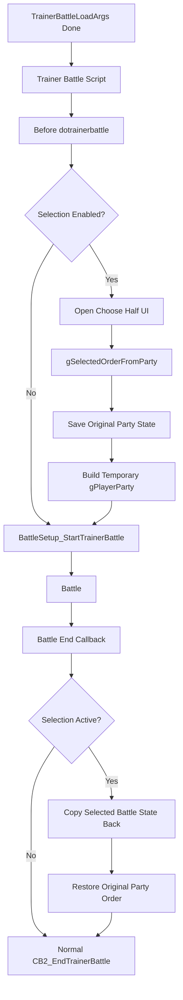

# Trainer Battle Party Selection MVP Plan

## Status

Draft. 実装はまだ行わない。

この plan は、将来実装する場合の最小構成案を整理するもの。

## MVP Scope

対象:

- 通常 trainer battle single。
- 通常 trainer battle double。
- player party 6 匹から single は 3 匹、double は 4 匹を選出。
- battle 中だけ一時的な `gPlayerParty` を使う。
- battle 終了後、選出 Pokémon の状態を元 slot へ戻し、元 party 順を復元する。

対象外:

- Battle Frontier / cable club / Union Room。
- link battle。
- follower partner / multi battle / two trainers。
- 相手 party preview。
- 専用選出 UI。
- battle 開始後の healthbox / party status summary / action menu layout 変更。
- runtime option 追加。

## Proposed Phases

### Phase 1: State Design

専用の一時 state を用意する。

候補 data:

| Field | Purpose |
|---|---|
| `active` | 復元処理が必要か |
| `originalParty[PARTY_SIZE]` | 元 party 全体 |
| `originalPartyCount` | 元 party count |
| `selectedSlots[PARTY_SIZE]` | 元 slot indexes |
| `selectedCount` | 3 or 4 |
| `isDouble` | 選出数や validation 用 |

既存の `SavePlayerParty` / `LoadPlayerParty` は参考になるが、通常 trainer battle 用には専用 buffer の方が事故が少ない可能性が高い。

### Phase 2: Selection Count Decision

`gTrainerBattleParameter` と trainer data から、battle が single か double かを決める helper を検討する。

確認済みの関係 symbol:

- `TRAINER_BATTLE_PARAM.mode`
- `TRAINER_BATTLE_PARAM.isDoubleBattle`
- `GetTrainerBattleType(TRAINER_BATTLE_PARAM.opponentA)`
- `TRAINER_BATTLE_TYPE_DOUBLES`
- `BATTLE_TYPE_DOUBLE`

注意: `gBattleTypeFlags` は通常 `BattleSetup_StartTrainerBattle` 内で確定するため、UI 起動時点ではまだ使えない可能性がある。

### Phase 3: Reuse Existing Choose Half UI

最初は `party_menu` の choose half UI を流用する。

必要になりそうな調整:

- 通常 trainer battle 用の選出数 3/4 を渡す方法。
- duplicate species/item validation を無効または分離する方法。
- fainted / egg の扱いを仕様化する。
- cancel を許すか、confirm 必須にするか決める。

既存流用候補:

- `InitChooseHalfPartyForBattle`
- `PARTY_MENU_TYPE_CHOOSE_HALF`
- `gSelectedOrderFromParty`
- `Task_ValidateChosenHalfParty`

### Phase 4: Temporary Party Build

選出後:

1. 元 `gPlayerParty` を state に copy。
2. `gSelectedOrderFromParty` から元 slot を保存。
3. 選出順に `gPlayerParty[0..selectedCount-1]` へ copy。
4. 残り slot を zero。
5. `CalculatePlayerPartyCount()`
6. 既存 trainer battle start へ進める。

`ReducePlayerPartyToSelectedMons` は参考になるが、`MAX_FRONTIER_PARTY_SIZE` と復元 state の制約があるため、直接利用するかは要検証。

### Phase 5: Restore After Battle

battle 終了後、field へ戻る前に:

1. 一時 `gPlayerParty[0..selectedCount-1]` を selected original slot へ反映。
2. 非選出 slot は original copy から戻す。
3. `gPlayerParty` を元 6 匹順に再構築。
4. `CalculatePlayerPartyCount()`
5. state を clear。
6. 既存 `CB2_EndTrainerBattle` flow へ進める。

placement 候補:

| Placement | Notes |
|---|---|
| `CB2_EndTrainerBattle` の先頭 | battle outcome 全体で確実に走りやすいが、既存関数を触る |
| `gMain.savedCallback` wrapper | 既存 callback を包めるが、callback chain の管理が複雑 |
| battle controller end 付近 | battle 種別が広く影響するため危険 |

MVP では trainer battle 専用 wrapper または `CB2_EndTrainerBattle` 直前/先頭が候補。

## Mermaid Draft

## Implementation Order When Approved

1. Add docs-backed feature flag/config decision.
2. Add dedicated selection state and helper prototypes.
3. Add helper to determine required selection count.
4. Add trainer-battle-only choose half entrypoint.
5. Add temporary party build and restore helpers.
6. Wire into trainer battle flow for normal single/double only.
7. Add manual tests and automated tests where possible.
8. Only after MVP is stable, design custom UI / opponent preview.

## Deferred Follow-Up Phases

| Phase | Description | Blocking research |
|---|---|---|
| Opponent party preview | Trainer Party Pools / randomize / override 反映済みの相手 party を選出 UI に表示する。 | `opponent_party_and_randomizer.md` の Open Questions。 |
| Custom selection UI | Pokémon Champions 風の選出 UI を作る。 | battle 前 menu framework と sprite/window budget の追加調査。 |
| Battle UI adjustment | battle 開始後の party status summary を選出数に合わせる。 | `battle_ui_flow_v15.md` の party status summary 調査。 |
| Runtime options | 選出 UI / preview / status 表示を option 化する。 | `options_status_flow_v15.md` と save migration 方針。 |

## Open Questions

- どの symbol/file に state を置くべきか未決定。
- `party_menu.c` へ通常 trainer battle 用 branch を足すか、新 wrapper で existing globals を設定するか未決定。
- battle 終了後復元の最適 placement は未検証。
- whiteout 時にも選出状態を元 slot へ戻してから whiteout 処理へ進むべきか、具体的な ordering は要検証。
