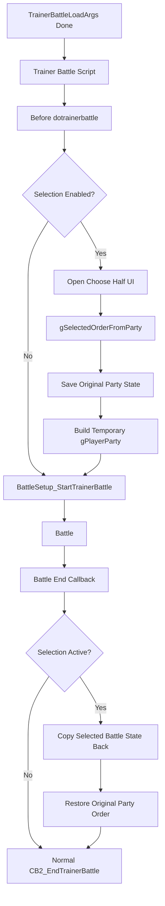

# Trainer Battle Party Selection MVP Plan

## Status

Implemented on `feature/battle-selection-mvp`.

この plan は、MVP 実装の設計根拠として残す。実装結果と validation は
`implementation.md` と `test_plan.md` を参照する。

## MVP Scope

対象:

- 通常 trainer battle single。
- 通常 trainer battle double。
- player party 6 匹から single は 3 匹、double は 4 匹を選出。
- battle 中だけ一時的な `gPlayerParty` を使う。
- battle 終了後、選出 Pokémon の状態を元 slot へ戻し、元 party 順を復元する。

対象外:

- Battle Frontier / cable club / Union Room。
- link battle。
- follower partner / multi battle / two trainers。
- 相手 party preview。
- 専用選出 UI。
- battle 開始後の healthbox / party status summary / action menu layout 変更。
- runtime option 追加。

## Implemented Phases

### Phase 1: State Design

専用の一時 state を用意する。

候補 data:

| Field | Purpose |
|---|---|
| `active` | 復元処理が必要か |
| `originalParty[PARTY_SIZE]` | 元 party 全体 |
| `originalPartyCount` | 元 party count |
| `selectedSlots[PARTY_SIZE]` | 元 slot indexes |
| `selectedCount` | 3 or 4 |
| `isDouble` | 選出数や validation 用 |

実装では `src/trainer_battle_selection.c` に専用 EWRAM state を置いた。
`SavePlayerParty` / `LoadPlayerParty` は使わず、`originalParty[PARTY_SIZE]` に
元 party を保存する。

### Phase 2: Selection Count Decision

`BattleSetup_StartTrainerBattle()` が `gBattleTypeFlags` を確定した後に selection gate
を評価するため、実装では `BATTLE_TYPE_DOUBLE` から required count を決める。

確認済みの関係 symbol:

- `TRAINER_BATTLE_PARAM.mode`
- `TRAINER_BATTLE_PARAM.isDoubleBattle`
- `GetTrainerBattleType(TRAINER_BATTLE_PARAM.opponentA)`
- `TRAINER_BATTLE_TYPE_DOUBLES`
- `BATTLE_TYPE_DOUBLE`

注意: `gBattleTypeFlags` は通常 `BattleSetup_StartTrainerBattle` 内で確定するため、UI 起動時点ではまだ使えない可能性がある。

### Phase 3: Reuse Existing Choose Half UI

最初の MVP は `party_menu` の choose half UI を流用する。

必要になりそうな調整:

- 通常 trainer battle 用の選出数 3/4 を渡す方法。
- duplicate species/item validation を無効または分離する方法。
- fainted / egg の扱いを仕様化する。
- cancel を許すか、confirm 必須にするか決める。

実装では trainer battle selection mode を追加し、通常 trainer battle では
egg / fainted / empty slot を選出不可、duplicate species / duplicate item rule は
適用しない。

既存流用候補:

- `InitChooseHalfPartyForBattle`
- `PARTY_MENU_TYPE_CHOOSE_HALF`
- `gSelectedOrderFromParty`
- `Task_ValidateChosenHalfParty`

### Phase 4: Temporary Party Build

選出後:

1. 元 `gPlayerParty` を state に copy。
2. `gSelectedOrderFromParty` から元 slot を保存。
3. 選出順に `gPlayerParty[0..selectedCount-1]` へ copy。
4. 残り slot を zero。
5. `CalculatePlayerPartyCount()`
6. 既存 trainer battle start へ進める。

実装では `ReducePlayerPartyToSelectedMons` は直接使わず、
`TrainerBattleSelection_StartBattleFromSelection()` が選出順の一時 party を構築する。

### Phase 5: Restore After Battle

battle 終了後、field へ戻る前に:

1. 一時 `gPlayerParty[0..selectedCount-1]` を selected original slot へ反映。
2. 非選出 slot は original copy から戻す。
3. `gPlayerParty` を元 6 匹順に再構築。
4. `CalculatePlayerPartyCount()`
5. state を clear。
6. 既存 `CB2_EndTrainerBattle` flow へ進める。

placement 候補:

| Placement | Notes |
|---|---|
| `CB2_EndTrainerBattle` の先頭 | battle outcome 全体で確実に走りやすいが、既存関数を触る |
| `gMain.savedCallback` wrapper | 既存 callback を包めるが、callback chain の管理が複雑 |
| battle controller end 付近 | battle 種別が広く影響するため危険 |

実装では `CB2_EndTrainerBattle` の先頭で `HandleBattleVariantEndParty()` の直後に
`TrainerBattleSelection_RestoreIfActive()` を呼ぶ。

## Mermaid Draft



## Implementation Order Completed

1. Added `B_TRAINER_BATTLE_SELECTION`.
2. Added dedicated selection state and helper prototypes.
3. Added helper to determine required selection count.
4. Added trainer-battle-only choose half entrypoint.
5. Added temporary party build and restore helpers.
6. Wired into trainer battle flow for normal single/double only.
7. Recorded build / check / mGBA smoke validation.
8. Deferred custom UI / opponent preview.

`CB2_EndTrainerBattle` integration は aftercare hook と同じ順序 contract を使う。

1. Sky Battle / existing variant restore.
2. `TrainerBattleSelection_RestoreIfActive()`.
3. `TrainerBattleAftercare_ApplyIfEnabled()`.
4. existing whiteout / return / trainer flag flow.

この順序にしないと、一時 `gPlayerParty` に対する heal / release / item policy
が元 party 復元で消える可能性がある。

selection 側の入口も helper に集約する。

```c
static bool32 TrainerBattleSelection_ShouldOffer(void);
static u8 TrainerBattleSelection_GetRequiredCount(void);
```

初期 helper は Frontier / cable / Union Room / link / follower / multi /
special trainer を除外する。将来 `ChampionsChallenge_IsActive()` が true
なら通常 selection を bypass し、challenge 専用 menu に任せる。

## Deferred Follow-Up Phases

| Phase | Description | Blocking research |
|---|---|---|
| Opponent party preview | Trainer Party Pools / randomize / override 反映済みの相手 party を選出 UI に表示する。 | `opponent_party_and_randomizer.md` の Open Questions。 |
| Custom selection UI | Pokémon Champions 風の選出 UI を作る。 | battle 前 menu framework と sprite/window budget の追加調査。 |
| Battle UI adjustment | battle 開始後の party status summary を選出数に合わせる。 | `battle_ui_flow_v15.md` の party status summary 調査。 |
| Runtime options | 選出 UI / preview / status 表示を option 化する。 | `options_status_flow_v15.md` と save migration 方針。 |

## Open Questions

- direct selection-screen runtime validation は prepared save / savestate が必要。
- whiteout 時の復元 ordering は build 上は通っているが、manual runtime check は未実施。
- battle 中 evolution / move learn / move reorder が元 slot に期待通り戻るかは manual / focused test が必要。
- custom UI / opponent party preview は後続 phase。
