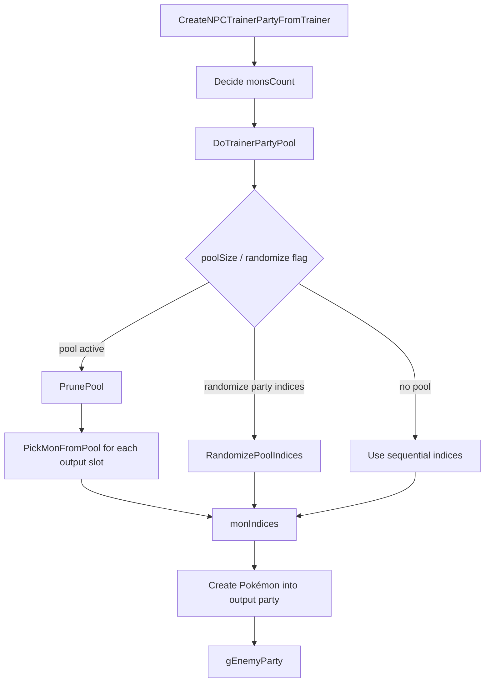

# Opponent Party Preview and Randomizer Investigation

調査日: 2026-05-01
追記: 2026-05-05

この文書は、相手 party 表示、trainer party 並び替え、randomizer 風 party 生成に関係する既存機能を整理する。

## Purpose

将来、battle 前選出画面で相手 party を表示したり、trainer party に独自性を持たせたりする場合に、既存の Trainer Party Pools と enemy party 生成 flow を把握する。

現時点では実装しない。

## Confirmed Existing Trainer Party Pool System

確認した files:

| File | Important symbols / notes |
|---|---|
| `docs/tutorials/how_to_trainer_party_pool.md` | Trainer Party Pools の既存説明。`Party Size` と `.poolSize > .partySize` の扱い。 |
| `include/trainer_pools.h` | pool rule / pick function / prune option / tag 定義。 |
| `src/trainer_pools.c` | `DoTrainerPartyPool`、pool 選出、shuffle、tag / clause 処理。 |
| `src/data/battle_pool_rules.h` | pool ruleset 定義。 |
| `include/data.h` | `struct Trainer`, `struct TrainerMon` に pool 関連 field。 |
| `src/battle_main.c` | `CreateNPCTrainerPartyFromTrainer`, `CreateNPCTrainerParty` で pool を使って `gEnemyParty` を生成。 |
| `include/constants/battle_ai.h` | `AI_FLAG_RANDOMIZE_PARTY_INDICES`。 |
| `include/config/battle.h` | pool RNG / rule config。 |
| `tools/trainerproc/main.c` | trainer data DSL から `.poolRuleIndex`, `.poolPickIndex`, `.poolPruneIndex`, `.poolSize` などを出力。 |

## Trainer Data Fields

`include/data.h` で確認した `struct Trainer` の関連 field:

| Field | Meaning |
|---|---|
| `party` | `struct TrainerMon` 配列への pointer。 |
| `partySize` | 実際に battle へ出す数。 |
| `poolSize` | pool として参照できる候補数。 |
| `poolRuleIndex` | `src/data/battle_pool_rules.h` の ruleset。 |
| `poolPickIndex` | pick function set。 |
| `poolPruneIndex` | prune mode。 |
| `overrideTrainer` | 別 trainer data を override source にする。 |
| `aiFlags` | `AI_FLAG_RANDOMIZE_PARTY_INDICES` など。 |

`struct TrainerMon` には `tags` field があり、pool rule の tag 判定に使われる。

## Pool Rules / Tags

`include/trainer_pools.h` で確認した主な定義:

| Symbol | Role |
|---|---|
| `POOL_RULESET_BASIC` | 基本 ruleset。 |
| `POOL_RULESET_DOUBLES` | doubles 用 ruleset。 |
| `POOL_RULESET_WEATHER_SINGLES` | weather singles。 |
| `POOL_RULESET_WEATHER_DOUBLES` | weather doubles。 |
| `POOL_RULESET_SUPPORT_DOUBLES` | support doubles。 |
| `POOL_PICK_DEFAULT` | default pick functions。 |
| `POOL_PICK_LOWEST` | lower index priority pick。 |
| `POOL_PRUNE_NONE` | prune なし。 |
| `POOL_PRUNE_TEST` | test prune。 |
| `POOL_PRUNE_RANDOM_TAG` | random tag prune。 |
| `MON_POOL_TAG_LEAD` | lead tag。 |
| `MON_POOL_TAG_ACE` | ace tag。 |
| `MON_POOL_TAG_WEATHER_SETTER` | weather setter tag。 |
| `MON_POOL_TAG_WEATHER_ABUSER` | weather abuser tag。 |
| `MON_POOL_TAG_SUPPORT` | support tag。 |

`struct PoolRules` で確認した field:

- `speciesClause`
- `excludeForms`
- `itemClause`
- `itemClauseExclusions`
- `megaStoneClause`
- `zCrystalClause`
- `tagMaxMembers`
- `tagRequired`

## Party Pool Flow

`src/trainer_pools.c` / `src/battle_main.c` で確認した flow:



`CreateNPCTrainerPartyFromTrainer` は `DoTrainerPartyPool(trainer, monIndices, monsCount, battleTypeFlags)` を呼んだ後、`partyData[monIndex]` から実際の Pokémon を作成する。

## Pick Function Behavior

`src/trainer_pools.c` で確認した default pick:

| Function | Observed behavior |
|---|---|
| `DefaultLeadPickFunction` | party index 0 を Lead として選び、double battle では index 1 も Lead 扱い。 |
| `DefaultAcePickFunction` | last slot を Ace として選び、double battle では second-last も Ace 扱い。 |
| `DefaultOtherPickFunction` | Lead / Ace tag を避けて通常 slot を選ぶ。 |
| `PickLowest` | 条件を満たす低い index を選びやすい。 |

`RandomizePoolIndices` は party index の shuffle を行う。`AI_FLAG_RANDOMIZE_PARTY_INDICES` がある場合、poolSize 0 でも partySize を temporary pool として扱う path があることを確認した。

## Config

`include/config/battle.h` で確認した pool 関連 config:

| Config | Current value observed |
|---|---:|
| `B_POOL_SETTING_CONSISTENT_RNG` | `FALSE` |
| `B_POOL_SETTING_USE_FIXED_SEED` | `FALSE` |
| `B_POOL_SETTING_FIXED_SEED` | `0x1D4127` |
| `B_POOL_RULE_SPECIES_CLAUSE` | `FALSE` |
| `B_POOL_RULE_EXCLUDE_FORMS` | `FALSE` |
| `B_POOL_RULE_ITEM_CLAUSE` | `FALSE` |
| `B_POOL_RULES_USE_ITEM_EXCLUSIONS` | `FALSE` |
| `B_POOL_RULE_MEGA_STONE_CLAUSE` | `FALSE` |
| `B_POOL_RULE_Z_CRYSTAL_CLAUSE` | `FALSE` |

## Trainer Data DSL / Build Tool

`tools/trainerproc/main.c` で trainer data の以下の key を処理することを確認した。

| DSL key / behavior | Output field / notes |
|---|---|
| `Party Size` | `.partySize`。pool より小さくすると候補から一部を出す。 |
| `Pool Rules` | `.poolRuleIndex`。 |
| `Pool Pick Functions` | `.poolPickIndex`。 |
| `Pool Prune` | `.poolPruneIndex`。 |
| `Copy Pool` | `.overrideTrainer` など。 |

Randomizer 風の trainer party 並び替えは、既存の Trainer Party Pools と `AI_FLAG_RANDOMIZE_PARTY_INDICES` でかなり近いことが確認できた。

注意: `trainerproc` は `Party Size` 行があると、`Party Size` が定義 Pokemon 数と同じでも `.poolSize = pokemon_n` を出力する。ここでいう「固定 party」は「source に書いた順番のまま pool を通さず出す party」の意味。`Party Size` と候補数が同じ場合でも、全員は出るが `DoTrainerPartyPool` / `RandomizePoolIndices` / Lead / Ace / custom pick の path に入るため、固定順とは限らない。

generator の扱い:

- pool / random order / Lead-Ace ordering を意図する trainer には、候補数と同数でも `Party Size` を出してよい。
- source 順の固定 party を意図する trainer には `Party Size` を出さない。
- validation では「`Party Size == pokemon_n` だから error」とはしない。代わりに、metadata で `mode: fixed-order` なのに `Party Size` が出ている場合だけ warning / error にする。

## 10 Candidates -> Pick 6

ユーザー要望の「trainer.party に 10 匹候補を書き、その中から 6 匹を選ぶ」は、現行 Trainer Party Pools でかなり近い。

`trainers.party` では、trainer に 10 匹定義し、header 側の `Party Size` を 6 にする。`trainerproc` は定義 Pokemon 数より `Party Size` が小さい場合に `.poolSize` を出力し、battle 生成時に `DoTrainerPartyPool()` が pool から実際の party を選ぶ。

```text
=== TRAINER_EXAMPLE_POOL ===
Name: Example
Class: Cooltrainer
Pic: TRAINER_PIC_COOLTRAINER_M
Gender: Male
Party Size: 6
Pool Rules: Basic
Pool Pick Functions: Default
Pool Prune: None
AI: Smart

Pokemon: SPECIES_...
Level: 50
Tags: Lead

Pokemon: SPECIES_...
Level: 50
Tags: Ace
```

既存 tutorial は [How to use Trainer Party Pools](../../tutorials/how_to_trainer_party_pool.md)。Lead / Ace / Weather Setter / Weather Abuser / Support などの tag を付けると、単純な完全 random ではなく「先発候補」「切り札候補」「天候役」のような役割を残せる。

## Runtime Pool vs External Generator

ユーザー案の「外部 service / exe で `trainers.party` を吐き出し、貼り付けて使う」は有力。アップストリーム更新時に C 側 randomizer を毎回追従するより、trainer data format に合わせて生成物を出す方が保守しやすい。

| Approach | Pros | Risks |
|---|---|---|
| In-engine Trainer Party Pools | 既存機能を使える。battle ごとの揺らぎを出せる。tag / rule / prune と連動できる。 | Preview UI と本番 party の RNG 同期、replay/debug 再現性、balance check が必要。 |
| External generator -> static `trainers.party` | C 側変更が少ない。差分 review しやすい。アップストリーム追従時も trainer data format だけ合わせればよい。 | 実行時 random ではない。再生成しない限り team は固定。 |
| External generator -> Trainer Party Pool blocks | 10 候補から 6 匹選ぶような pool を自動生成できる。engine は既存 TPP を使う。 | generator が `Party Size`、`Pool Rules`、`Tags`、constants を正しく出す必要がある。 |

現時点の推奨は **External generator -> Trainer Party Pool blocks**。engine 側の新規改造を抑えつつ、trainer ごとに 10 候補 / 6 選出 / tag 付き role を作れる。Pokemon Champions 風のルールや randomizer は外部で進化させ、ROM 側は `trainers.party` DSL と Trainer Party Pools の互換を保つ。

## External Generator Contract

外部生成に寄せる場合、最初に固定するべき contract:

| Contract | Reason |
|---|---|
| Input constants | `SPECIES_*`, `MOVE_*`, `ITEM_*`, `ABILITY_*`, `TRAINER_*` は repo の constants に合わせる。 |
| Output format | `tools/trainerproc/main.c` が読める `trainers.party` DSL をそのまま出す。 |
| Pool metadata | `Party Size`, `Pool Rules`, `Pool Pick Functions`, `Pool Prune`, `Tags` を出せるようにする。 |
| Validation | species / move / item constants の存在、重複 species / item clause、level、move count を生成時に検査する。 |
| Deterministic seed | 同じ seed と同じ input なら同じ output を吐く。差分 review と再現性のため。 |
| Version marker | 生成物 comment に generator version / ruleset / seed を残す。 |

この方式なら、将来 generator 側で「現世代動画や画像 frame から採用した人間味のある構成」「double battle 用 partner 評価」「tier / usage に応じた move weight」を増やしても、ROM 側の変更範囲を小さく保てる。

## Input Side Contract

入力側は `trainers.party` を直接 copy-paste して増やすのではなく、**人間が意図を編集する薄い input** と、**repo から読み取る canonical data** と、**外部 source から作る curated data** に分ける。

`src/data/trainers.party` は重要な入力だが、主に以下の用途に限定する。

- 既存 `TRAINER_*` block id と header metadata を読む。
- 現在の party / level / AI / battle type を baseline として読む。
- source file 上の出現順を `sourceOrder` として読む。
- generated block の diff / replace 対象として使う。

つまり、`Draena.party` のような既存 `.party` block を人間が丸ごと copy-paste して入力にする運用を primary にはしない。参考 block から preset / template を作ることはできるが、generator の primary input は catalog / overrides / weights にする。

### Input Layers

| Layer | File / Source | Edited by | Purpose |
|---|---|---|---|
| ROM canonical data | `include/constants/*.h`, `src/data/pokemon/**`, `src/data/items.h`, `src/data/moves_info.h`, existing `src/data/trainers.party` | ROM repo | legality、constants、既存 trainer header、既存順。 |
| Journey catalog | `tools/champions_partygen/catalog/journey.json` | human | trainer の stage、order、level band、role、party style。 |
| Ruleset config | `tools/champions_partygen/catalog/rulesets.toml` or `.json` | maintainer | difficulty、pool size、clause、ban、tag policy。 |
| Trainer group profiles | `tools/champions_partygen/catalog/groups/*.json` | human | NPC / Gym / Rival / Elite / High Class などの共通傾向、rank band、availability、pool bounds。 |
| Trainer overrides | `tools/champions_partygen/catalog/overrides/*.json` | human | 個別 trainer の must include、ban、ace、theme、手修正。 |
| Global set library | `tools/champions_partygen/catalog/sets/*.json` | human / generator | 300 体程度の構築済み候補。species、moves、item、ability、nature、EV / IV、role、archetype、制約を持つ。 |
| Trainer blueprints | `tools/champions_partygen/catalog/blueprints/*.json` or `journey.json` entries | human | trainer ごとの構築思想、slot 要件、identity anchor、ban / must、power budget。 |
| Curated usage weights | `tools/champions_partygen/weights/*.json` | human / importer | usage、move / item / nature tendency、archetype score。 |
| Species role notes | `tools/champions_partygen/notes/species_roles.*` | human | 個別 Pokemon の役割、差別化、マイナー採用理由。 |
| Source memo / URL list | `tools/champions_partygen/sources/*.json` or `.md` | human / importer | 参考 URL、source kind、信頼度、取り込み状態。 |
| Generated review | `/tmp/*.party`, `src/data/generated/*.party`, validation report, diff report | generator / reviewer | 最終 `.party` にする前の確認物。 |

### Hybrid Generator Model

現時点の方向性は、pure randomizer でも pure hand-authored pool でもなく、**global set library + trainer blueprint + materialized local Trainer Party Pool** の hybrid にする。

| Layer | Role | ROM impact |
|---|---|---|
| Global set library | 事前に作った 300 体前後の usable set を持つ。構築済み party、対戦記事、手作業 tuning から増やす。 | tool-side only。ROM には直接入れない。 |
| Trainer blueprint | Roxanne は rock-control、Wattson は electric-tempo のように、trainer ごとの意図と制約を持つ。 | tool-side only。既存 trainer header / id と対応する。 |
| Materialized local pool | blueprint に合う set を global library から trainer ごとの候補数へ絞り、必要なら pin / lock で候補を固定する。通常 trainer は 6-12 候補程度、6 体戦など明示した trainer は最大 20 候補程度まで許可する。 | `trainers.party` DSL の `Pokemon` blocks / `Party Size` / `Tags` として出る。 |
| Runtime Trainer Party Pool | 既存 `DoTrainerPartyPool` / `CreateNPCTrainerPartyFromTrainer` が local pool から実際の party を作る。 | 既存 engine path を使う。 |

この形なら、入力側は「一から 6 体全部を書く」負担を減らしつつ、最終出力は現行 Trainer Party Pool に落とし込める。global library の set id は ROM の永続 ID にしない。generator 内では `nosepass_early_rock_ace_v1` のような人間が読める stable slug、または content hash を使って trace するが、出力 `.party` では optional comment に留める。

運用 mode は分ける。

| Mode | Use case | Output |
|---|---|---|
| `global_materialized_pool` | default。既存 300 set から blueprint に合う候補を選び、local pool にする。通常は party size 3-4、pool 6-12 程度。party size 6 なら pool 20 程度も許可する。 | `Party Size` 付き Trainer Party Pool。 |
| `pinned_materialized_pool` | 重要 trainer、意図が強い boss、select box で候補を固定したい相手。 | global set から pin / lock した候補を local TPP へ出す。完全手書きはしない。 |
| `static_generated_party` | 固定順を見せたい trainer、pool path を使いたくない trainer。 | `Party Size` を出さない fixed-order party。 |
| `runtime_factory` | 将来案。run 中に global roster から動的生成する。 | ROM-side data / save / preview 設計が必要なので MVP 外。 |

### Rule Dictionary / Lint Rules

ここでいう `rule_dictionary.*` は、UI の tag 一覧そのものではなく、**partygen 用の ESLint config / schema / lint rule 定義** に近い。自由入力の文字列を許さず、「使ってよい role / archetype / constraint は何か」「同時に使えない組み合わせは何か」「不足していたら error にする条件は何か」を中央で定義する file。

目的は select box の候補を増やすことではなく、入力 JSON が増えても generator が strict に落とせるようにすること。

例:

```json
{
  "roles": {
    "lead": {"mapsToTppTags": ["Lead"]},
    "ace": {"mapsToTppTags": ["Ace"]},
    "speed-control": {},
    "weather-setter": {},
    "weather-abuser": {}
  },
  "archetypes": {
    "rain-offense": {
      "requiresAnyRole": ["weather-setter"],
      "prefersAnyRole": ["weather-abuser"],
      "conflictsWith": ["sun-offense"]
    },
    "trick-room-balance": {
      "requiresAnyRole": ["speed-control"],
      "requiresSpeedPlan": "slow-core"
    }
  },
  "lint": {
    "unknownRole": "error",
    "unknownArchetype": "error",
    "missingRequiredSlot": "error",
    "conceptConflict": "error",
    "weakCohesion": "warning"
  }
}
```

懸念点は、global library を増やすほど label が雑になり、trainer concept と逆向きの set が混ざること。ここは label を 1 種類にしない。

| Vocabulary | Purpose | Cardinality |
|---|---|---|
| `roles` | 個別 Pokemon の役割。`lead`, `ace`, `speed-control`, `defensive-glue`, `weather-setter`, `weather-abuser`, `pivot`, `setup`, `wallbreaker` など。 | 多めでよい。tool 側 vocabulary。 |
| `archetypes` | party / trainer concept。`rain-offense`, `rock-control`, `trick-room-balance`, `bulky-offense`, `stall`, `hazard-stack` など。 | 中程度。blueprint と set の相性判定に使う。 |
| `constraints` | 禁止・必須・相性制約。weather、terrain、speed order、type theme、duplicate clause、stage power など。 | rule として評価する。 |
| `tppTags` | engine の Trainer Party Pool に出す最終 tag。`Lead`, `Ace`, `Support` など少数に絞る。 | 少数。`.party` 出力直前だけで使う。 |

`roles` をそのまま `Tags:` に流し込まない。generator は role / archetype / constraint で候補を選び、最後に local pool 上の少数だけを `Tags:` へ map する。これにより、tool 側では細かく調整しつつ、engine 側の tag 空間を増やしすぎない。

rule dictionary は `tools/champions_partygen/catalog/rule_dictionary.*` のような単一 file に寄せる。各 set / blueprint が自由入力の label を増やす運用は避ける。

validation で拾うべき concept 破綻:

- unknown role / archetype / constraint。
- `rain-offense` blueprint に sun-only abuser が入るなど、archetype と逆向きの set。
- weather setter がいるのに abuser がいない、または abuser だけいる。
- `trick-room` blueprint なのに高速 attacker だけで構成される。
- `stall` と `hyper-offense` のような排他 archetype が同じ local pool の主軸になる。
- required slot (`lead`, `ace`, `speed-control`, `glue` など) が materialized pool で埋まらない。
- `Party Size` 分を pool simulation で安定して取れない。
- TPP に map する `Tags:` が多すぎる、または Lead / Ace のような一意性が崩れる。

判定は基本 strict。unknown label、必須 slot 不足、concept conflict、`.party` として build できないものは error にする。balance の弱さや「少し噛み合いが悪い」程度だけ warning に残す。

### Materialization Contract

materializer は trainer blueprint から local pool を作る。出力する前に、候補ごとに採用理由と落選理由を report する。

```json
{
  "trainer": "TRAINER_ROXANNE_1",
  "mode": "global_materialized_pool",
  "archetype": "rock-control",
  "partySize": 3,
  "localPoolSize": 8,
  "maxLocalPoolSize": 12,
  "requiredSlots": ["lead", "ace", "speed-control"],
  "identityAnchors": ["SPECIES_NOSEPASS"],
  "bannedArchetypes": ["rain-offense", "sun-offense"],
  "powerBudget": 35,
  "pinLocks": {
    "includeSetIds": ["nosepass_early_rock_ace_v1"],
    "excludeSetIds": []
  }
}
```

local pool は global library から一回 materialize して `.party` に出す。runtime は global library を知らない。これにより「global を持つ意味」と「Trainer Party Pool の既存機能を使う意味」を両立する。

local pool size は「多ければ多いほど良い」ではない。候補が多すぎる場合は、その trainer の blueprint が曖昧すぎる設計ミスとして扱う。たとえば通常 trainer は party size 3-4 が基本なので、pool が 20 体まで膨らむなら error にする。一方で、意図的に party size 6 の trainer を作り、20 候補から 6 体を抽出する設計は許可する。その場合は blueprint / ruleset に `partySize: 6` と `maxLocalPoolSize: 20` を明示する。

候補数だけでなく、**有効な組み合わせ数** も見る。pool が 10 体あっても、Lead / Ace / weather / item clause / duplicate species / required role を通すと実質 1-2 pattern しか作れない場合がある。これは候補数不足とは別の設計ミスなので、`minValidCombinationCount` を下回ったら lint error にする。

### Current Design Consistency Check

2026-05-05 時点の整合性チェック。

成立している点:

- 入力は `catalog/sets`、`catalog/blueprints`、`rulesets`、`overrides`、`weights`、`notes` に分け、`trainers.party` 丸ごと copy-paste を primary input にしない。
- 出力は最終的に `trainerproc` が読める `.party` DSL に寄せるため、ROM runtime 側の新規 data path を増やさない。
- global set id は tool-side trace 用で、ROM の `TRAINER_*` / `SPECIES_*` / flag 管理とは混ぜない。
- build-time generated party は SaveBlock を触らない。保存する必要があるのは runtime challenge state だけ。
- `Party Size` は「候補数より少ない時だけ」ではなく「pool path を使う時」に出す、という扱いで統一する。
- 旅順は MVP では `sourceOrder` を default にし、人間が確認した trainer だけ `catalog/journey.json` の `order` で上書きする。

まだ詰めるべき点:

| Topic | Concern | Recommended next decision |
|---|---|---|
| set file granularity | 1 file 巨大 JSON は review が重い。細かすぎると「どこにあるか」が分からなくなる。 | まず `sets_0001_0100.json` のように 100 set 単位で分け、generated index / CLI 検索を必須にする。 |
| pinned pool schema | 完全手書きは避けたいが、重要 trainer は候補を select / pin したい。 | `pinned_materialized_pool` にして、global set slug の include / exclude / lock だけを許可する。 |
| rule dictionary | role / archetype / constraint の vocabulary と lint rule が未固定。ここが固まらないと validation が実装できない。 | `rule_dictionary.*` に最初の vocabulary、alias、conflict、requires、severity を置く。 |
| strict lint | ミスは build/generate 時に一気に落としたい。 | `partygen lint` / `partygen validate --strict` を MVP 条件にし、error code、file:line、fix hint を必須にする。 |
| local pool size | 候補が少なすぎると required slot が埋まらない。多すぎると trainer concept が曖昧で select / review が破綻する。 | `minLocalPoolSize` / `maxLocalPoolSize` を ruleset に置き、範囲外は lint error にする。通常 trainer は party size 3-4、pool 6-12 程度。party size 6 だけ pool 20 程度まで許可。 |
| combo diversity | 候補数は足りていても、valid combination が少なすぎると毎回同じ party になり、pool にした意味が薄い。 | pool simulation で `minValidCombinationCount` / role coverage / pair diversity を見て、下回ったら lint error にする。 |
| deterministic scoring | seed が同じでも外部 weight / catalog order が変わると diff が読みにくい。 | materializer report に score、tie-break、採用理由、落選理由を出す。 |
| journey naming | `journey_catalog.json` と `catalog/journey.json` が混ざると tooling が割れる。 | canonical path は `tools/champions_partygen/catalog/journey.json` に統一する。 |

### High-Risk Lint Targets

重点的に lint したいのは、build error よりも「通るが意図と違う party」になるもの。

| Target | Failure mode | Lint policy |
|---|---|---|
| pool size bounds | 候補が少なすぎる / 多すぎる。 | `minLocalPoolSize` / `maxLocalPoolSize` 範囲外は error。 |
| valid combinations | 候補数はあるが、条件を通る組み合わせが少ない。 | `minValidCombinationCount` 未満は error。 |
| required role coverage | Lead / Ace / speed-control などが実際の pool で成立しない。 | required slot 不足は error。 |
| concept conflict | rain と sun、stall と hyper-offense などが同じ主軸に混ざる。 | rule dictionary の conflict は error。 |
| fixed-order vs pool | 固定順にしたいのに `Party Size` で pool path に入る。 | `static_generated_party` + `Party Size` は error。 |
| source constants | move / item / ability / ball の constant が存在しない、またはカテゴリ違い。 | error。fix hint で参照先 header を出す。 |
| gimmick conflict | Tera と Dynamax / Gmax の同時指定など、trainerproc が片方を落とす。 | error。 |
| generated drift | 同じ input / seed なのに output が変わる。 | generated index / report に generator version、ruleset hash、seed、input hash を出す。 |
| header ownership | partygen が trainer header を変えてしまう。 | header diff は error unless explicit override。 |
| searchability | set がどの shard にあるか分からない。 | `partygen sets index/find/show` を MVP command にする。 |

### Non-Lint Design Decisions

lint で止められる問題とは別に、先に決めないと後で実装が分岐する箇所。

| Decision | Why it matters | Current recommendation |
|---|---|---|
| set id naming | 後から rename すると blueprint / pin / report が全部ズレる。 | human-readable slug + optional content hash。ROM constant にはしない。 |
| set mutation policy | global set を直すと全 trainer に影響する。個別 trainer の都合で set を直接変えると事故る。 | global set は汎用性を保ち、trainer 固有調整は override / pin に逃がす。 |
| duplicate set variants | 同じ species の微差分 set が増えると検索と選択が崩れる。 | `variantOf` / `replaces` / `reason` を持たせ、lint で near-duplicate report を出す。 |
| source trust | usage data、記事、手作業メモの信頼度が混ざると scoring が説明できない。 | `sourceKind` / `trust` / `reviewed` を必須 metadata にする。 |
| scoring explainability | なぜその set が入ったか分からないと調整できない。 | materializer report に include / exclude reason、score breakdown、failed constraints を出す。 |
| apply ownership | generated `.party` を手で直すと次回生成で消える。 | generated output は編集禁止。直すなら catalog / rule / override に戻す。 |
| seed semantics | seed が build seed なのか trainer seed なのか曖昧だと再現できない。 | build seed + trainer id + ruleset hash から trainer-specific seed を派生する。 |
| migration path | 100 set 単位 shard や rule schema は後で変わる可能性がある。 | catalog schema version と migration command を最初から持つ。 |

現時点で特に先に決めたいのは、set id naming、set mutation policy、scoring explainability の 3 つ。ここが曖昧だと、lint は通っても「どこを直せば出力が変わるか」が追えなくなる。

### Group / Rank / Availability Layer

個別 override が増えすぎると、generator ではなく trainer ごとの手作業 DB になる。これを避けるため、個別 trainer の前に **group profile** と **rank band** を置く。

優先順位:

1. global ruleset
2. group profile
3. rank / stage band
4. trainer blueprint
5. pin / override

例:

```json
{
  "group": "gym-leaders",
  "inherits": ["boss-trainers"],
  "rankBand": "high-class",
  "defaultPartySize": 4,
  "poolBounds": {"min": 8, "max": 12},
  "preferredArchetypes": ["type-identity", "balanced-offense"],
  "diversityFloor": 3,
  "availability": {
    "minStage": "gym-1",
    "maxStage": "e4-prep"
  }
}
```

group profile は「この group らしさ」を作る場所。trainer 固有の pin / override は最後の例外にする。

| Layer | Example | Hard or soft |
|---|---|---|
| group | `npc-route`, `gym-leaders`, `rivals`, `elite-four`, `high-class`, `super-class` | Mostly soft weights + pool bounds |
| rank band | `early`, `mid`, `high`, `super`, `postgame` | Hard availability for obvious level mismatch, soft score for near ranges |
| availability | `minStage`, `maxStage`, `retireAfter`, `unlockAfter` | Hard only when story/rank mismatch is clearly invalid |
| trainer blueprint | identity anchor、required slots、ban / must | Mixed |
| pin / override | include / exclude set ids、lock move/item | Hard |

rank / availability は便利だが、絞りすぎると候補ゼロや combo 不足になる。そこで「候補を消す hard filter」と「点数を下げる soft weight」を分ける。

推奨:

- `retireAfter` は、明らかに序盤専用 set を後半に出したくない時だけ hard。
- `preferredRankBand` は soft。少しズレた set は減点で残す。
- group の `preferredArchetypes` は soft。`bannedArchetypes` だけ hard。
- Gym / Rival / Elite など identity が強い相手だけ hard anchor を増やす。
- Route NPC は hard 条件を少なくし、variance / diversity を優先する。

late game は VGC 的に似た構成へ収束しやすい。これは完全には悪ではないが、毎回同じに見えると弱い。`diversityFloor`、`archetypeCooldown`、`variantOf`、同一 core の連続禁止で「似ているが完全同一ではない」状態を保つ。

lint / report:

| Check | Policy |
|---|---|
| group profile を持たない trainer が多すぎる | report。journey catalog 整備漏れとして扱う。 |
| individual override ratio が高い group | warning / report。group profile へ昇格すべき可能性。 |
| hard filters 後の candidate count が 0 | error。 |
| hard filters 後の candidate count はあるが valid combination が少ない | error。 |
| `retireAfter` / `unlockAfter` で特定 rank の候補が薄い | report。set library 追加対象。 |

### Set Library File Layout

global set library は 1 set 1 file にはしない。検索性が悪くなり、UI が無い段階で「どこにあるか」が分からなくなる。

一方で、全 set を 1 file に詰めると review / merge / line-based error が重くなる。初期案は **100 set 単位の shard** にする。

```text
tools/champions_partygen/catalog/sets/
  sets_0001_0100.json
  sets_0101_0200.json
  sets_0201_0300.json
  index.json              # generated。set id -> file/line/archetype/species
```

理由:

- 1 file 100 set なら、手で開いてもまだ読める。
- file 数が増えすぎない。
- line number 付き lint error が出しやすい。
- merge conflict は起き得るが、1 巨大 file より conflict 範囲が小さい。
- `partygen index` で `index.json` / CSV を生成すれば、CLI / UI どちらでも検索できる。

検索は file tree ではなく command に寄せる。

```text
partygen sets find --species SPECIES_NOSEPASS
partygen sets find --role speed-control --stage early
partygen sets show nosepass_early_rock_ace_v1
partygen sets grep stealth-rock
```

Web UI を作る場合も、この index を読んで filter / select box を作る。select box は候補数が多すぎると破綻するため、species、role、archetype、stage、power band、source kind で絞った結果だけを選ばせる。

### Minimal Input Example

UI なし MVP で人間が最低限書く input は、完全な party ではなく intent にする。

```json
{
  "trainer": "TRAINER_ROXANNE_1",
  "sourceOrder": 120,
  "stage": "rustboro-gym",
  "levelBand": [14, 16],
  "partySize": 3,
  "poolSize": 6,
  "role": "gym-leader",
  "partyStyle": "rock-control",
  "difficulty": 35,
  "mustInclude": ["SPECIES_NOSEPASS"],
  "preferredTypes": ["TYPE_ROCK", "TYPE_GROUND", "TYPE_STEEL"],
  "preferredAxes": ["defensive-glue", "speed-denial", "status-pressure"],
  "notes": "Keep gym identity, but avoid a pure stat-check party."
}
```

個別調整は override に分ける。

```json
{
  "trainer": "TRAINER_ROXANNE_1",
  "lockSpecies": ["SPECIES_NOSEPASS"],
  "banSpecies": ["SPECIES_TYRANITAR"],
  "lockMoves": {
    "SPECIES_NOSEPASS": ["MOVE_STEALTH_ROCK"]
  },
  "lockItems": {},
  "ace": "SPECIES_NOSEPASS",
  "poolTags": {
    "SPECIES_NOSEPASS": ["Ace"],
    "SPECIES_GEODUDE": ["Lead"]
  }
}
```

この方式なら、UI が無くても JSON / TOML を少し編集して `render-one` / `diff` で確認できる。UI を作る場合も、この input schema を編集する frontend として作れる。

### URL / Article Intake

参考 URL は generator に直接 web scraping させる前に、source memo として保存する。

```json
{
  "id": "vr-worlds-2025-top-cut",
  "url": "https://...",
  "sourceKind": "vgc-event-report",
  "format": "article",
  "mode": "doubles",
  "trust": "primary",
  "status": "manual-reviewed",
  "extracts": {
    "archetypes": ["rain-offense", "balance"],
    "species": ["SPECIES_PELIPPER", "SPECIES_ARCHALUDON"],
    "items": ["ITEM_DAMP_ROCK"],
    "notes": "Use as trend weight, not as exact copy."
  }
}
```

MVP では URL から自動で party を組むのではなく、以下の順にする。

1. URL / 記事 / 動画を `sources/` に記録する。
2. 人間が必要な情報を `weights/` や `notes/` に抽出する。
3. generator は `weights/` / `notes/` だけを読む。
4. 自動 importer は後から追加する。追加しても出力先は `sources/cache` / `weights` / `notes` で、直接 `.party` にはしない。

### No-UI Workflow

UI が無い場合の基本 loop:

```text
partygen scan --rom-repo .
partygen index --rom-repo . --out tools/champions_partygen/generated/trainer_index.csv
partygen explain --rom-repo . --trainer TRAINER_ROXANNE_1
partygen render-one --rom-repo . --trainer TRAINER_ROXANNE_1 --seed 1234 --out /tmp/roxanne.party
partygen validate --rom-repo . --input /tmp/roxanne.party
partygen diff --rom-repo . --input /tmp/roxanne.party --against src/data/trainers.party
```

調整するときは `/tmp/roxanne.party` を直接直して終わりにしない。まず `/tmp` の結果を見て、原因になる `journey.json` / `rulesets` / `overrides` / `weights` を直す。個別固定が必要な場合は generated output ではなく、override に `lockMoves` / `lockItems` / `lockSpecies` / `includeSetIds` / `excludeSetIds` を追加する。

### Existing `.party` as Template

既存 `.party` block を参考にすることはできる。ただし primary input にはしない。

| Use | Policy |
|---|---|
| 既存 trainer の header preserve | 必須。`Name`, `Class`, `Pic`, `Music`, `Items` などは既存 block から読む。 |
| 既存 party を baseline として読む | 許可。level band、theme、signature species の推定に使う。 |
| 別 trainer の party を丸ごと template 化 | optional。`templates/*.party` や `templates/*.json` に明示して使う。 |
| `Draena.party` のような hand-authored sample を copy-paste 入力にする | primary にはしない。sample から species role / archetype / preset に変換する。 |
| generated output を手で直して次回 input にする | 避ける。差分が必要なら override に戻す。 |

この方針にすると、Web / UI が無くても入力は `catalog + overrides + weights + notes + sources` で管理できる。Web UI は必須 dependency ではなく、これらの file を編集・可視化する補助になる。

## Partygen Lint / Validation Candidate

validation は「強すぎて調整を邪魔する」より、「ミスった入力を build / apply 前に確実に止める」ことを優先する。運用イメージは ESLint / TypeScript の compile error に近い。生成した `.party` がそのまま `trainerproc` / build に通り、copy-paste しても破綻しないことを最低条件にする。

推奨は error / warning / report-only の 3 段階。MVP の `partygen validate --strict` は error が 1 件でもあれば非 0 exit にする。

| Level | Validation | Reason |
|---|---|---|
| Error | `.party` parser が読めない key / syntax | copy-paste 後に build が落ちるため。 |
| Error | unknown `TRAINER_*`, `SPECIES_*`, `MOVE_*`, `ITEM_*`, `ABILITY_*`, `TYPE_*`, `BALL_*` | C compile まで進めても失敗するため。 |
| Error | trainer block id が既存 `src/data/trainers.party` に存在しない | MVP は既存 trainer 置換のみで、新規 ID 追加はしないため。 |
| Error | duplicate generated block id | apply / paste 時にどちらが正か分からないため。 |
| Error | move count が 4 を超える | `struct TrainerMon.moves[MAX_MON_MOVES]` を超えるため。 |
| Error | `Party Size` が 1-6 外、または pool 候補数 255 超 | `gEnemyParty` / `POOL_SLOT_DISABLED` の前提を超えるため。 |
| Error | `Party Size` が候補数より大きい | pool fallback か不正 party になるため。 |
| Error | `localPoolSize` が trainer / ruleset の `minLocalPoolSize` 未満 | 候補不足で required slot や concept が成立しないため。 |
| Error | `localPoolSize` が trainer / ruleset の `maxLocalPoolSize` 超 | 候補が多すぎるのは blueprint が曖昧な設計ミスとして扱うため。 |
| Error | valid combination count が `minValidCombinationCount` 未満 | 候補数は足りても、条件を満たす組み合わせが少なすぎると pool の意味が薄いため。 |
| Error | role / pair diversity が ruleset minimum 未満 | 同じ role pair / same core ばかりになり、実質固定 party になるため。 |
| Error | `Dynamax Level` / `Gigantamax` と `Tera Type` を同じ mon に同時出力 | 現行 `trainerproc` は Dynamax/Gmax branch を優先し、`Tera Type` を C 出力しないため。 |
| Error | `Ball` に item constant を出す | `.ball` は `BALL_*` / human ball 名から `BALL_*` へ変換されるため。 |
| Error | unknown role / archetype / constraint | rule dictionary から外れると、後で label が増殖して pool rule が読めなくなるため。 |
| Error | trainer blueprint と逆向きの archetype / role が採用されている | 意図的な例外もまず止める。必要なら rule dictionary 側に明示 exception を追加する。 |
| Error | required slot が local pool で埋まらない | Lead / Ace / speed-control / glue などの不足は concept collapse に直結するため。 |
| Error | weather / terrain / Trick Room の setter と abuser が片欠け | 片方だけだと構築軸として弱く、randomizer 的な雑さが出やすいため。 |
| Error | `tppTags` mapping が多すぎる、または一意 tag が複数ある | engine 出力用 tag は少数に絞る。Lead / Ace の重複は意図確認が必要。 |
| Error | explicit ability が species の現行 ability list に見つからない | runtime assert に寄せて build 後に見つかるが、generator 側で先に拾いたい。 |
| Error | `mode: static_generated_party` 相当の trainer に `Party Size` がある | 候補数と同数でも pool path に入るため。fixed-order の指定と矛盾する。 |
| Error | pool rules / tags の simulation で fallback しそう | runtime は通常順へ fallback するので crash ではないが、生成意図とはズレる可能性が高い。 |
| Warning | duplicate species / duplicate held item | challenge rule 次第で許容するため、default は warning。 |
| Warning | generated header metadata が既存 trainer と違う | MVP では header preserve が基本。意図的変更なら明示 override にする。 |
| Report-only | tier / role / source weight の根拠 | balance review 用。build 可否とは分ける。 |
| Report-only | journey order / map usage の不足 | 最初は既存順を primary にするため、catalog 整備の補助情報に留める。 |

`partygen validate` は、最低限 `trainerproc` 相当の key whitelist と constants scan を通す。可能なら generated fragment を一時 `.party` として `trainerproc` に通す smoke を持つ。

error message は短い summary だけでは足りない。少なくとも error code、file path、line / column、対象 trainer / set id、なぜダメか、直し方を出す。

validation の出力例:

```text
partygen validate --rom-repo . --input /tmp/champions_trainers.party

E-PGEN-CONST-001 tools/champions_partygen/catalog/sets/sets_0001_0100.json:42:18
  set: starmie_mid_speed_control_v1
  Unknown move constant `MOVE_SCALD_PLUS`.
  Fix: use an existing `MOVE_*` from include/constants/moves.h, or add the move before referencing it.

E-PGEN-GIMMICK-002 tools/champions_partygen/catalog/sets/sets_0001_0100.json:88:5
  set: lycanroc_tera_dmax_v1
  `Tera Type` cannot be emitted together with `Dynamax Level` / `Gigantamax`.
  Fix: remove one gimmick from this set, or split it into two separate set ids.

E-PGEN-CONCEPT-010 tools/champions_partygen/catalog/blueprints/gyms.json:31:12
  trainer: TRAINER_ROXANNE_1
  Required slot `speed-control` was not filled by the materialized local pool.
  Fix: add a compatible set with role `speed-control`, pin an existing set, or relax the blueprint requirement.

E-PGEN-POOL-006 tools/champions_partygen/catalog/blueprints/routes.json:44:7
  trainer: TRAINER_ROUTE118_COOLTRAINER_1
  Materialized local pool has 19 candidates, but this trainer allows maxLocalPoolSize 12.
  Fix: narrow the blueprint with archetype/type/stage constraints, pin the intended candidates, or explicitly raise maxLocalPoolSize if this is a 6-party pool trainer.

E-PGEN-POOL-007 tools/champions_partygen/catalog/blueprints/routes.json:52:7
  trainer: TRAINER_ROUTE119_BIRD_KEEPER_1
  Local pool has 9 candidates, but only 2 valid party combinations satisfy partySize 4 and required slots [lead, ace, speed-control].
  Fix: add compatible sets, relax one required slot, or remove conflicting constraints that make most combinations invalid.

W-PGEN-POOL-004 tools/champions_partygen/catalog/blueprints/gyms.json:55:7
  trainer: TRAINER_BRAWLY_1
  `mode: static_generated_party` has `Party Size`; this will use the pool path.
  Fix: remove `Party Size`, or change mode to `global_materialized_pool`.
```

## Generator Concern Register

現行 docs から見た懸念は、generator そのものより **生成結果を runtime state と混ぜてしまうこと** に集中する。`trainers.party` の static 生成だけなら、出力は ROM data になり、通常は SaveBlock を増やさない。一方で、run seed、倒した NPC、player profile、adaptive difficulty、生成済み party cache を runtime で保存しようとすると SaveBlock 設計が必要になる。

| Concern | Impact | Resolution |
|---|---|---|
| `trainers.party` 生成物を丸ごと手編集 source に混ぜる | upstream merge / review が重い。どこが人間編集か分からなくなる。 | `src/data/generated/champions_trainers.party` のような generated fragment を分離し、header comment に seed / source revision / generator version を残す。 |
| generator output が `trainerproc` DSL と微妙にズレる | build 時に落ちるか、意図しない trainer data ができる。 | generator 側で `tools/trainerproc/main.c` が受ける key だけを出し、`partygen validate` と通常 `make` の両方を必須にする。 |
| repo constants と外部 data がズレる | 存在しない `SPECIES_*` / `MOVE_*` / `ITEM_*` を出す。 | constants は必ずこの repo から scan する。外部 trend data は score/weight だけに使う。 |
| pool RNG と preview が一致しない | 表示した相手 party と本戦 party が違う。 | MVP では opponent preview を対象外にする。preview を入れるなら non-mutating helper と deterministic seed/cache を先に設計する。 |
| TPP の fallback が隠れる | pool rule / prune の結果が足りず、通常順 party に戻る可能性がある。 | generator validation で `partySize <= valid pool members`、required tag 数、species/item clause 後の候補数を検査する。 |
| `trainerproc` key 名の drift | docs / catalog の表記が parser とズレると、生成物が build できない。 | generator は `Pool Pick Functions` など `tools/trainerproc/main.c` が読む正式 key だけを出す。サンプルも parser と同期する。 |
| human tuning の入口が JSON だけになる | Web / exe が無い状態だと、どの値を触ればよいか分からない。 | catalog は人間が読める小さい JSON に分け、`partygen explain` / `partygen render-one` / `.party` fragment 出力で確認できるようにする。 |
| new trainer ID を大量追加する | `TRAINER_FLAGS_START + trainerId` の defeated flag 領域を消費し、SaveBlock / flag namespace に影響する。 | MVP は既存 `TRAINER_*` block の party 差し替えに限定する。新規 ID 追加は別設計にする。 |
| generated fragment include の依存漏れ | `src/data/trainers.party` が generated `.party` を include しても、現行 `trainer_rules.mk` は include 先を dependency として追わない。 | build integration 時に `trainer_rules.mk` dependency / clean target / CI check を追加する。copy-paste MVP では include しない。 |
| `Party Size` の出しすぎ | `Party Size` 行があるだけで `trainerproc` は `.poolSize` も出す。候補数と同数でも pool / shuffle path に入る。 | source 順固定の trainer には出さない。候補数同数でも pool ordering を意図する trainer には出してよい。 |
| trainer header metadata の上書き | `Name` / `Class` / `Pic` / `Music` / `Items` / `Mugshot` / `Back Pic` / `Starting Status` を変えると party 以外の挙動も変わる。 | MVP は既存 header を preserve し、Pokemon block と明示した pool keys だけを置換する。 |
| Ball / gimmick field の DSL 差分 | v15 の `Ball` は `BALL_*` / human ball 名。`Dynamax Level` / `Gigantamax` と `Tera Type` を同時に出すと Tera が header 出力されない。 | `Ball` は `include/constants/pokeball.h` を正にし、1 mon で Dynamax/Gmax と Tera を同時出力しない validation を入れる。 |
| 生成器が毎回 ROM build の必須 dependency になる | local build が重くなり、環境差で壊れる。 | 初期は copy-paste / explicit command 運用。build integration は optional target にする。CI では「生成済み file が catalog と一致するか」だけを見る。 |
| generated party を runtime で保存したくなる | SaveBlock が大きくなり、save compatibility を壊す。 | full party は保存しない。保存するなら seed / run id / roster index / defeated bitfield など小さい識別子だけにする。 |

### SaveBlock Policy for Partygen

party generator の基本方針:

1. **Build-time generated `.party` は SaveBlock を触らない。**
   `src/data/trainers.party` / generated fragment は `trainerproc` 経由で ROM 上の `gTrainers` と party data になる。trainer party の中身、pool 候補、tags、AI flag は保存データではない。
2. **SaveBlock に入れるのは runtime で変わる最小 state だけ。**
   例: Champions / Rogue run の seed、現在の stage、選択中の difficulty/intensity、勝敗済み roster bitfield、unlock state。build-time party 出力そのものは入れない。
3. **生成済み party cache、player log、usage weight、catalog は SaveBlock に入れない。**
   これらは tool 側 file または ROM data として扱う。GBA save に入れると容量と migration の両方が厳しい。
4. **既存 flags/vars を大量消費しない。**
   NPC 1 人 = saved flag 1 個、trainer 1 人 = saved var 1 個のような設計は避ける。Rogue / Champions 専用 state を切るなら bitfield と enum id に圧縮する。
5. **SaveBlock 変更は feature flag + size test 更新 + migration 方針とセットにする。**
   現行 repo には `test/save.c` の `sizeof(struct SaveBlock*)` check がある。`include/gametypes.h` も save spare が小さいことを警告しているため、軽い気持ちで field を足さない。現在値は下の capacity table を正とする。

現時点の推奨は、partygen MVP では SaveBlock を変更しないこと。runtime で「今回の run は seed 1234 / intensity 50 の group を使う」程度を持ちたい場合も、最初は compile-time/generated group で表現し、保存が必要になってから `docs/flows/save_data_flow_v15.md` と `docs/overview/roguelike_npc_capacity_v15.md` に沿って `RogueSave` / `ChampionsSave` の所有先を決める。

現在の save capacity 確認点:

| Area | Max | Current test size | Approx free | Source |
|---|---:|---:|---:|---|
| SaveBlock1 | `SECTOR_DATA_SIZE * 4 = 15872` | `15568` | `304` | `include/save.h`, `test/save.c` |
| SaveBlock2 | `SECTOR_DATA_SIZE = 3968` | `3884` | `84` | `include/save.h`, `test/save.c` |
| SaveBlock3 | `SAVE_BLOCK_3_CHUNK_SIZE * 14 = 1624` | `4` | `1620` | `include/save.h`, `test/save.c` |

`make` の link output は `--print-memory-usage` により EWRAM / IWRAM / ROM の使用量を出す。一方、SaveBlock の余りは `src/debug.c` の `CheckSaveBlock1Size` / `CheckSaveBlock2Size` / `CheckSaveBlock3Size` と `test/save.c` の compatibility test で見る。SaveBlock を触る実装に進む場合は、実装後に `test/save.c` の期待値を意図的に更新するか、互換性維持ならサイズ不変を確認する。

保存が必要になった場合の候補:

| State | Store? | Suggested shape |
|---|---|---|
| generated party contents | No | ROM data / generated `.party`。SaveBlock には入れない。 |
| generator seed used for this build | No for build-time / maybe for runtime selection | generated comment と config に残す。runtime group selection がある場合だけ small field。 |
| current run seed | Yes if roguelike run exists | `u32 runSeed`。 |
| current stage / room / trainer roster index | Yes if runtime run exists | `u16` / `u8` の id。文字列や full party は保存しない。 |
| defeated / seen generated NPCs | Maybe | bitfield。300 体なら 38 byte、1000 体なら 125 byte。 |
| player battle logs / adaptive profile | No | emulator/tool 側の JSONL / profile file。SaveBlock には入れない。 |
| intensity / adaptation config | Prefer build-time | runtime option にするなら small enum / fixed-point field。option menu と migration が必要。 |

この切り分けなら、`trainers.party` 生成器は大きな data を扱えても、save compatibility の問題は runtime challenge state だけに閉じ込められる。

## Generator Ownership / Runtime Position

`trainers.party` の中身を必ず参照するなら、生成器は完全な別 project よりも **この repository 内の tool** として持つ方が扱いやすい。

推奨形:

| Layer | Responsibility |
|---|---|
| Source catalog | 旅順・trainer group・role・difficulty・地域など、人間が review する入力 data。 |
| Generator tool | repo 内 constants / existing `trainers.party` / catalog を読み、generated `.party` fragment を吐く。 |
| `trainerproc` | 既存どおり `.party` DSL から C header を生成する。 |
| Docker | 必要なら generator dependencies を固定する wrapper。game build の必須 runtime にはしない。 |

理由:

- generator は `SPECIES_*`, `MOVE_*`, `ITEM_*`, `ABILITY_*`, `TRAINER_*` と常に同期する必要がある。
- `tools/trainerproc/main.c` と `trainer_rules.mk` はすでに repo 内 tool として build flow に入っている。
- 別 repository にすると、pokeemerald-expansion の更新、constant rename、party DSL 変更を追いかける境界が増える。
- Docker は Python / Node / Rust などの generator dependency を固定する用途では有効だが、毎回の ROM build に container 起動を必須化すると編集 feedback が重くなる。

現時点の判断は、`tools/champions_partygen/` のような repo-local tool を作り、Docker は optional の `make partygen-docker` 相当に留めること。CI / review では「生成済み file が source catalog と一致するか」を検査する。

### Current Build Integration Boundary

現行 build では `trainer_rules.mk` が以下の `.party` を `trainerproc` へ渡して `.h` を生成する。

| Source | Generated header | Notes |
|---|---|---|
| `src/data/trainers.party` | `src/data/trainers.h` | 通常 trainer。partygen MVP の主対象。 |
| `src/data/trainers_frlg.party` | `src/data/trainers_frlg.h` | FRLG mode 用。MVP では対象外。 |
| `src/data/battle_partners.party` | `src/data/battle_partners.h` | partner trainer。通常 trainer ID とは別扱い。 |
| `test/battle/trainer_control.party` | `test/battle/trainer_control.h` | trainerproc / TPP tests。generator が触らない。 |
| `test/battle/partner_control.party` | `test/battle/partner_control.h` | partner tests。generator が触らない。 |
| `src/data/debug_trainers.party` | `src/data/debug_trainers.h` | debug trainers。generator が触らない。 |

`%.h: %.party $(TRAINERPROC)` の単純 rule なので、`.party` から別 file を include しても現状は dependency tracking されない。`src/data/generated/champions_trainers.party` を `trainers.party` から include する方式に進むなら、少なくとも以下が必要。

- `trainer_rules.mk` に generated fragment dependency を足す。
- `clean-generated` が生成済み fragment を消すか、消さない方針か決める。
- `partygen check-generated` で catalog と generated fragment の drift を CI で見る。
- `make generated` / `make` 後に `src/data/trainers.h` の差分も review する。

このため、初期は include 方式ではなく copy-paste / explicit apply 方式の方が安全。

### Trainer ID / Flag Impact

通常 trainer ID は `include/constants/opponents.h` の `TRAINER_*` と `TRAINERS_COUNT` に依存し、runtime では `GetTrainerStructFromId()` が `trainerId < TRAINERS_COUNT` を要求する。さらに通常 trainer の勝利済み状態は `TRAINER_FLAGS_START + trainerId` に保存される。

現行 Emerald 側は `TRAINERS_COUNT_EMERALD = 855`、`MAX_TRAINERS_COUNT_EMERALD = 864`。`include/constants/opponents.h` には、trainer flag 領域 overflow まで追加余地は 9 trainer しかないと明記されている。

partygen の方針:

| Operation | Save / flag impact | Policy |
|---|---|---|
| 既存 `TRAINER_*` block の party を置き換える | 既存 flag を使うだけ。SaveBlock 増加なし。 | MVP で許可。 |
| 同じ `TRAINER_*` の `Difficulty: Easy/Hard` block を追加する | trainer ID は増えないが、ROM data は増える。 | 生成対象にしてよいが、difficulty fallback を validate する。 |
| 新規 `TRAINER_*` を 1-9 件追加する | `TRAINERS_COUNT` / constants / scripts / generated header / trainer flags に影響。 | 明示的な implementation task に分ける。 |
| 新規 `TRAINER_*` を大量追加する | trainer flag 領域と SaveBlock 方針の再設計が必要。 | partygen MVP では禁止。virtual trainer / roster bitfield を検討する。 |

Champions / Rogue のように多数の相手を扱う場合、全員に通常 trainer ID を割り振るより、既存 trainer slot の差し替え、または専用 virtual trainer + roster index + SaveBlock bitfield の方が安全。

### Trainerproc Field Edge Cases

partygen は `.party` DSL の見た目だけでなく、`trainerproc` が実際に出す C initializer に合わせる必要がある。

| Field | Observed behavior | Generator policy |
|---|---|---|
| `Party Size` | 行があると `.partySize` と `.poolSize` が出る。`Party Size == pokemon_n` でも pool path に入る。 | source 順固定には出さない。pool ordering を意図する trainer には候補数同数でも出してよい。 |
| `Copy Pool` | party を自分で定義すると parser error。`Party Size` が無い場合は copied trainer の size を継承する。 | copy trainer は party block を出さない。override size が必要な時だけ `Party Size` を出す。 |
| `Macro` | `Pic` / `Name` required check を bypass できる特殊 escape hatch。 | MVP では macro trainer を生成対象から外す。 |
| `Ball` | `fprint_constant(f, "BALL", ...)` で `BALL_*` を出す。v15 changelog でも `.party` ball は item ではなく Pokeball enum。 | `include/constants/pokeball.h` と human ball 名を正にする。`ITEM_POKE_BALL` を出さない。 |
| `Dynamax Level` / `Gigantamax` / `Tera Type` | `Dynamax Level` or `Gigantamax` があると `shouldUseDynamax` が出て、`Tera Type` branch は `else if` なので出ない。 | 同じ mon に Dynamax/Gmax と Tera を同時指定しない。ruleset でどちらかを選ぶ。 |
| trainer header | `Name`, `Class`, `Pic`, `Gender`, `Music`, `Items`, `Mugshot`, `Starting Status`, `Back Pic` は battle presentation / intro / item use に影響する。 | 既存 trainer の header は preserve し、partygen は Pokemon block と pool keys だけを所有する。 |

このため、`partygen render-one` は最終 `.party` text だけでなく、可能なら `trainerproc` 後の relevant initializer summary も出せると review しやすい。

## Generator Language / UI Position

生成器は C で作る必要はない。`trainerproc` は既存 build tool として C のままでよいが、Champions 用の party generator は repo 内 data を読んで `.party` DSL を吐ければよい。

候補:

| Option | Fit | Notes |
|---|---|---|
| Rust CLI | High | constants parser、validation、一括変換、single binary 化に向く。将来 desktop exe にもしやすい。 |
| Python CLI | High for MVP | 早く作れる。JSON / CSV / web import / data analysis が軽い。配布時は環境差に注意。 |
| TypeScript / Web app | Medium to High | browser UI、ranking 表示、検索 UI に向く。file system / repo integration は別 layer が必要。 |
| Desktop app | Medium | drag-and-drop / exe 配布はしやすいが、最初から作ると UI 実装量が増える。 |
| C tool | Low for generator | repo との親和性はあるが、web import、ranking analysis、rich UI には向かない。 |

現時点の好みは **Rust CLI**。この ROM では constants / species / move / ability / item 定義を頻繁に改造するため、型付き parser、validation、single binary、後の desktop 化の相性がよい。Python は prototype / analysis script としては有力だが、最終的な置き換え tool は Rust に寄せる。

MVP は **CLI first + batch edit** がよい。Web / desktop UI はその CLI を呼ぶ frontend として後から足す。理由は、trainer 数が多く、button を 1 匹ずつ押して編集する UI では作業が終わらないため。

### Tool Invocation / Wrapper Policy

起動方法は CLI を正にする。`.bat` / `.cmd` / `.sh` / future UI は、同じ CLI を呼ぶ薄い wrapper に留める。

初期の file layout:

```text
tools/champions_partygen/
  README.md
  config.example.toml          # コメント付きの基準 config。commit 対象。
  config.local.toml            # 任意の local override。commit しない想定。
  partygen.sh                  # Linux / WSL 用 thin wrapper。
  partygen.cmd                 # Windows cmd 用 thin wrapper。
  src/                         # Rust CLI source or wrapper to binary。
  catalog/
  generated/
```

wrapper の責務:

- repo root を自動で解決する。
- `--rom-repo` の指定を省略できるようにする。
- `config.example.toml` / `config.local.toml` の読み込み順を固定する。
- exit code をそのまま返す。
- generator logic、lint rule、path 探索を wrapper に書かない。

想定 command:

```text
# Linux / WSL
tools/champions_partygen/partygen.sh doctor
tools/champions_partygen/partygen.sh lint --strict
tools/champions_partygen/partygen.sh render-one --trainer TRAINER_ROXANNE_1 --out /tmp/roxanne.party
tools/champions_partygen/partygen.sh generate --out /tmp/champions_trainers.party

# Windows cmd
tools\champions_partygen\partygen.cmd doctor
tools\champions_partygen\partygen.cmd lint --strict
tools\champions_partygen\partygen.cmd render-one --trainer TRAINER_ROXANNE_1 --out %TEMP%\roxanne.party
tools\champions_partygen\partygen.cmd generate --out %TEMP%\champions_trainers.party
```

`doctor` は最初に作る。最低限、以下を確認する。

| Check | Reason |
|---|---|
| repo root に `src/data/trainers.party` がある | 誤った directory で実行していないか。 |
| `tools/trainerproc` が build 済み、または build 可能 | generated `.party` を parser smoke できるか。 |
| `include/constants/*.h` が読める | constants scan の前提。 |
| output directory に書ける | `/tmp` / `%TEMP%` / `tools/champions_partygen/generated` の事故防止。 |
| config schema version が対応範囲 | 古い config を誤使用しない。 |

Makefile への接続は後回し。最初から `make` に入れると、Windows / WSL / local binary / generated file の条件が絡んで失敗点が増える。初期は wrapper で `generate -> validate -> diff` を明示的に走らせる。Makefile target は CLI が安定してから、単なる convenience target として追加する。

```text
make partygen-check     # later: partygen lint --strict + check-generated
make partygen-generate  # later: explicit generate only。通常 build の依存にはしない
```

`make` の通常 ROM build が通ることと、`partygen` が通ることは最初は分ける。自動 include / `TRAINERS_PARTY_SOURCE` 切替に進むのは、CLI、wrapper、config、generated drift check が安定してから。

### Config Baseline

設定は INI より TOML を推奨する。理由は、コメントを書きやすく、Rust CLI で schema validation しやすく、階層構造が必要になるため。

`config.example.toml` はコメントを多めにして、判断基準を残す。

```toml
# tools/champions_partygen/config.example.toml
# This file is the documented baseline. Copy to config.local.toml for local experiments.

[paths]
# ROM repository root. Wrappers normally fill this automatically.
rom_repo = "."

[generation]
# Stable build seed. Trainer-specific seeds are derived from this seed + trainer id + ruleset hash.
seed = 1234
target = "emerald-trainers"
output = "/tmp/champions_trainers.party"

[pool_defaults]
# Normal route/gym trainers are expected to have party size 3-4 and a small local pool.
default_party_size = 3
min_local_pool_size = 6
max_local_pool_size = 12

# Only explicitly marked partySize 6 trainers should use a larger pool.
max_local_pool_size_for_party6 = 20
min_valid_combination_count = 6

[lint]
strict = true
unknown_label = "error"
concept_conflict = "error"
pool_bounds = "error"
combo_diversity = "error"

[weights]
# Soft weights. These should not hard-filter candidates by themselves.
rank_band_weight = 0.35
group_profile_weight = 0.35
usage_weight = 0.20
variance = 0.45

[availability]
# Prefer soft scoring unless a set is clearly invalid for the story/rank range.
use_hard_retire_after = true
use_soft_rank_penalty = true
```

local override の扱い:

| File | Commit? | Purpose |
|---|---|---|
| `config.example.toml` | Yes | 基準、コメント、schema の見本。 |
| `config.default.toml` | Optional yes | team-wide default を固定したい場合。 |
| `config.local.toml` | No | 個人実験、seed、temporary output path。 |
| `profiles/*.toml` | Yes if shared | intensity / rank / challenge preset。 |

CLI は `--config` を受ける。wrapper は default で `config.example.toml` を読み、存在すれば `config.local.toml` を後勝ちで重ねる。CI / review では local override を読まない。

### Manual Tuning Without GUI

Web / exe が無い初期段階でも、手動調整できる入口は必要。JSON は machine-readable source として使うが、「JSON を読める人しか調整できない」状態にはしない。

推奨は **catalog JSON を薄くし、最終確認は `.party` text で行う** こと。

| Edit target | Who edits | Purpose |
|---|---|---|
| `tools/champions_partygen/catalog/journey.json` | designer / maintainer | 旅順、stage、trainer id、difficulty band、role。 |
| `tools/champions_partygen/catalog/rulesets.json` | maintainer | level curve、allowed tags、banned species/items、clause。 |
| `tools/champions_partygen/catalog/overrides/*.json` | designer / maintainer | 個別 trainer の固定採用、禁止、ace、theme。 |
| `/tmp/champions_trainers.party` | reviewer | generator が出した copy-paste 用 preview。 |
| `src/data/trainers.party` | maintainer | 最終的に build に入る source。 |

JSON は次のように、1 file に全 trainer の完全 party を詰め込まない。完全 party は generator output であり、手で持つ source ではない。

```json
{
  "trainer": "TRAINER_ROXANNE_1",
  "stage": "rustboro_gym",
  "difficulty": "normal",
  "role": "gym_leader",
  "party_size": 3,
  "pool_size": 8,
  "theme": ["rock", "early_game"],
  "ace": "SPECIES_NOSEPASS",
  "banned_species": ["SPECIES_SHEDINJA"],
  "notes": "Keep one obvious special attacker answer for first-time players."
}
```

手動調整の基本 loop:

```text
partygen explain --rom-repo . --trainer TRAINER_ROXANNE_1
partygen render-one --rom-repo . --trainer TRAINER_ROXANNE_1 --seed 1234 --out /tmp/roxanne.party
partygen validate --rom-repo . --input /tmp/roxanne.party
partygen diff --rom-repo . --input /tmp/roxanne.party --against src/data/trainers.party
```

これで「JSON で何を変えたら `.party` がどう変わるか」を command output で確認できる。必要なら `/tmp/roxanne.party` の block を見ながら、catalog 側の `party_size`、`pool_size`、`ace`、`banned_species`、`theme`、difficulty band を調整する。

調整の優先順位:

1. まず catalog JSON を直す。
2. 例外だけ `overrides/*.json` に逃がす。
3. それでも表現できない場合だけ generated `.party` fragment を手で直す。
4. 手直しが頻発する項目は generator の input schema に昇格する。

この順にすると、Web / desktop UI が後から来ても、UI は JSON を編集する frontend として作れる。逆に、最初から GUI 専用の hidden state を持たせると、CLI、CI、review、copy-paste 運用がばらける。

最低限ほしい CLI:

| Command | Reason |
|---|---|
| `partygen explain --trainer TRAINER_*` | その trainer がどの catalog / rule / override から作られるかを表示する。 |
| `partygen render-one --trainer TRAINER_*` | 1 trainer だけ `.party` block として確認する。 |
| `partygen list --stage rustboro_gym` | 旅順 / stage 単位で対象を探す。 |
| `partygen validate --input file.party` | constants、key 名、pool size、tag clause を貼る前に検査する。 |
| `partygen diff --input file.party --against src/data/trainers.party` | どの trainer block が変わるかを見る。 |

MVP の UI はこの command surface の上に後付けする。Rust CLI なら後で Tauri / egui / simple local web frontend から同じ validate / render / apply logic を呼べる。

推奨する command surface:

```text
partygen scan
partygen plan --catalog tools/champions_partygen/catalog/journey.json
partygen generate --seed 1234 --out src/data/generated/champions_trainers.party
partygen validate --input src/data/generated/champions_trainers.party
partygen diff --against src/data/trainers.party
```

UI を作る場合も、中心は button edit ではなく次の bulk 操作にする。

| UI Feature | Purpose |
|---|---|
| Trainer table | 旅順、stage、map、level band、party style を一覧で見る。 |
| Bulk apply | stage / trainer group 単位で level、AI、pool rule、difficulty を一括適用する。 |
| Ranking panel | usage / trend / role score の上位候補を species / move / item / ability / nature ごとに出す。 |
| Candidate-first select | select box では強い候補、よく使う候補、合法候補を先頭に出す。 |
| Batch replace | `trainers.party` fragment をまとめて生成・差し替えする。 |
| Validation panel | illegal constant、missing move、invalid ability、item clause などを先に潰す。 |

## Canonical Data Source Policy

generator は外部 site の species stats / move data / item data を正として使わない。ROM 側で種族値、技、特性、item 効果を変える可能性があるため、canonical source はこの repository 内に置く。

repo から読むべき data:

| Data | Canonical source |
|---|---|
| Species constants | `include/constants/species.h` |
| Move constants | `include/constants/moves.h` |
| Item constants | `include/constants/items.h` |
| Ability constants | `include/constants/abilities.h` |
| Trainer ids | `include/constants/opponents.h`, `include/constants/trainers.h` |
| Existing trainer parties | `src/data/trainers.party` |
| Generated trainer header check | `src/data/trainers.h` |
| Species stats / typing / abilities | repo の species data headers |
| Move power / type / flags | repo の move info data |
| Item behavior / hold item data | repo の item data / battle item code |

外部 source は「重み」や「傾向」の入力として扱う。

| External input | Allowed use |
|---|---|
| Usage ranking | 候補 species / item / move / nature の score を上げる。 |
| Tournament teams | archetype、core、よくある持ち物、性格、技構成の weight にする。 |
| Web search summary | 現行流行の候補リストを作る。 |
| Video / battle summary | AI 思考、選出方針、lead / ace / support 評価の weight にする。 |

外部 trend data はそのまま生成結果に直結させず、必ず repo-local legality / balance validation を通す。

## Usage Source Candidates

使用率 ranking / tournament trend はこちらでも web search で調査できる。ただし current metagame は変動が速く、公式 data は mobile app 内表示に寄っている可能性があるため、自動取得できる source と、手入力 / URL 指定で取り込む source を分ける。

VGC 用の primary source は Victory Road 系を優先する。Showdown / Smogon ladder は fan simulator / ladder data なので、公式大会環境の代替としては扱わない。

Singles は Pokemon Battle DataBase と日本語圏の構築記事を優先する。Doubles / VGC は Victory Road でおおむね足りるが、Pokemon Battle DataBase の double data も流行確認に使える。

候補:

| Source | Use | Notes |
|---|---|---|
| Victory Road event pages | primary VGC tournament trend | Worlds / Regionals / Internationals などの results、team icons、Export Team、Report、OTS / EVs column を見る。 |
| Victory Road / VR Pastes / team reports | primary curated team data | 英語記事や spreadsheet / paste がある場合は最優先で取り込む。 |
| Pokemon HOME Battle Data | official usage reference | smartphone 版で ranking、moves、abilities、items を確認できる。機械取得は未確定。 |
| Pokemon Battle DataBase | primary Singles / secondary Doubles usage | HOME 公開情報を元にした rank battle data。上位構築の CSV / JSON があるため generator input に向く。 |
| Pokemon徹底攻略 / 攻略大百科 / Game8 など | Singles article / build reference | 育成論、構築、環境記事、採用理由の説明を人間 review 用 source にする。 |
| Pokésol / Pokemon Soldier | Singles / battle trend commentary | YouTube / 記事の環境解説、構築紹介、対戦意図の理解に使う。 |
| 超ポケチャンネル | Singles / live commentary reference | live 配信や解説から、構築の狙い・選出・技選択の傾向を curated memo に落とす。 |
| PokemonWiki / 対戦考察まとめWiki / 育成考察Wiki | species history / role reference | 個別 Pokemon の世代別評価、型、立ち位置、不遇理由、役割を読む。構築単位 data ではない。 |
| Pikalytics | secondary usage reference | Web で species ごとの usage 傾向を確認しやすいが、source / format を確認して補助扱いにする。 |
| Tournament reports / team sheets | archetype / core trend | 手入力または URL memo から curated weight に落とす。 |
| Smogon / Showdown usage stats | low-priority reference only | official VGC tournament data ではないため、欠けた情報の補助か sanity check に留める。 |
| User-provided URLs | manual override | 自動検索で拾えない source は URL 指定で取り込む。 |

最初は scraper を前提にせず、`weights/usage.json` に手で curated score を置く。自動取得は source が安定してから追加する。

取り込み優先順位:

1. Victory Road の大会記事 / spreadsheet / paste / report
2. 公式 Pokemon HOME Battle Data
3. Pokemon Battle DataBase の rank battle 上位構築 CSV / JSON
4. 実大会の team sheet / rental / player report
5. Pokemon徹底攻略 / 攻略大百科 / Game8 / Pokésol / 超ポケチャンネルなどの構築・解説 source
6. Pikalytics などの補助統計
7. Smogon / Showdown ladder data

Showdown 系は simulator 上の流行を見たい場合だけ使う。Champions Challenge の opponent generator では、VGC 実大会の構築・持ち物・性格・技構成を primary weight にする。

## Singles / Doubles Source Policy

mode ごとの source priority:

| Mode | Primary | Secondary | Avoid / low priority |
|---|---|---|---|
| Singles | Pokemon Battle DataBase, Pokemon徹底攻略, 攻略大百科, Game8, Pokésol, 超ポケチャンネル | PokemonWiki / 対戦考察まとめWiki / 育成考察Wiki, Pokemon HOME Battle Data, user-provided URLs, curated articles / videos | Showdown / Smogon ladder を正扱いしない |
| Doubles / VGC | Victory Road, VR Pastes, event reports, official team sheets | Pokemon Battle DataBase double data, Pokemon HOME Battle Data, Pikalytics | Showdown / Smogon ladder を公式 VGC 代替にしない |

Pokemon Battle DataBase は上位構築 data を CSV / JSON で公開しており、season と single / double を URL で切り替えられる。このため generator では最初から direct import candidate に入れる。ただし不特定多数の client から直接叩く設計は避け、local cache / manual download / repo-local weights への変換を挟む。

構築記事・YouTube・配信は、数値 data ではなく rationale data として使う。つまり「なぜその持ち物か」「どの matchup を見ているか」「選出順・技選択の意図」を curated memo / archetype tag に変換し、generator の role weight に入れる。

PokemonWiki / 対戦考察まとめWiki / 育成考察Wiki は、個別 Pokemon の世代別評価を読む source として使う。特にマイナー Pokemon は「なぜ評価されにくいか」「どの世代で何が役割だったか」「どの型なら差別化できるか」が読みやすい。ただし party core / team synergy の実績 data ではないため、構築単位の primary source にはしない。

## Species Role Notes

個別 Pokemon の評価は、generator に直接 web text を読ませ続けるより、repo-local note に抽出して使う。

候補 file:

```text
tools/champions_partygen/notes/species_roles.md
tools/champions_partygen/notes/species_roles.csv
tools/champions_partygen/notes/species_roles.json
```

MVP は人間が review しやすい Markdown または CSV がよい。Rust generator は後で JSON / CSV を読む。

抽出したい項目:

| Field | Purpose |
|---|---|
| `species` | repo-local species constant に紐づける。 |
| `generationContext` | どの世代の評価か。 |
| `roles` | wall, pivot, cleaner, setup, weather, trapper, anti-meta など。 |
| `strengths` | 差別化点、強い matchup、採用理由。 |
| `weaknesses` | 火力不足、技不足、環境不利、競合、耐久不安など。 |
| `signaturePatterns` | よくある技 / 持ち物 / 特性 / 性格の傾向。 |
| `minorPickReason` | マイナー Pokemon を使うなら何を狙うか。 |
| `sourceUrls` | PokemonWiki / 考察 wiki / 記事への参照。 |

この note は trend weight ではなく、候補生成と role tag 付けの補助に使う。player の苦手 profile とは別 layer にする。

## Trend Weight Model

最終理想は、web search、usage ranking、動画要約、battle log 分析を weight として取り込める generator。MVP ではここを直接 AI 自動生成にせず、数値化された score file を読むだけにする。

候補 file:

```text
tools/champions_partygen/weights/usage.json
tools/champions_partygen/weights/archetypes.json
tools/champions_partygen/weights/item_synergy.json
tools/champions_partygen/weights/nature_move_preferences.json
```

weight の例:

| Weight | Example |
|---|---|
| species usage | よく使われる Pokemon を候補上位にする。 |
| item tendency | 特定 species / ability / role でよく使う item を上位にする。 |
| nature tendency | fast attacker は Speed nature、bulky support は bulk nature を上位にする。 |
| move tendency | STAB / coverage / setup / recovery / priority を role に応じて配点する。 |
| role fit | Lead / Ace / Support / Weather Setter / Cleaner などの tag 付けに使う。 |
| rule legality | 参加不可 Pokemon、ban item、level rule、duplicate clause を減点または除外する。 |

生成時の優先順位:

1. repo-local legality
2. challenge rule / ban list
3. trainer stage / level band / journey order
4. role fit
5. trend weight
6. random seed

この順序にしておけば、最新流行を参考にしつつ、改造 ROM 側の独自 stat / move / item 変更を壊さない。

## Practical Curated Randomizer Direction

この generator は「全部を雑に shuffle する randomizer」ではなく、実戦寄りの party generator / curated randomizer として扱う。

目標:

- trainer ごとの役割、旅順、強さ、テーマを保つ。
- 完全ランダムではなく、構築軸を持った候補から選ぶ。
- 人間が気に入らない候補を手で直せる。
- seed による再現性を保ちつつ、毎回同じ並びに見えすぎないようにする。
- `.party` text を成果物にし、最終的には人間が copy-paste / review / 微調整できる状態にする。

避けたいもの:

- species だけをランダム差し替えして、技 / 持ち物 / speed / role が噛み合わない party。
- 旅順や trainer role を無視した強弱のばらつき。
- type 統一だけに頼った party。type theme は使えるが、それだけだと speed control / support / win condition が足りない場合がある。
- trend data をそのまま丸写しして、ROM 側の custom data や level band を壊すこと。

参考にしたい感触:

- XD / Battle Revolution 風の、trainer ごとに意図が見える構築。
- Battle Factory / roguelike 的な候補選択と replayability。
- Emerald Rogue 風の type theme の分かりやすさ。ただし type 統一だけではなく、構築軸と役割の噛み合わせを重視する。

generator が見るべき構築軸:

| Axis | Examples |
|---|---|
| Speed control | Tailwind, Trick Room, Icy Wind, Thunder Wave, Choice Scarf, priority |
| Board control | Fake Out, Intimidate, redirection, pivot, phazing, Taunt |
| Field plan | weather, terrain, screens, hazards, Aurora Veil |
| Win condition | setup sweeper, bulky ace, weather sweeper, cleaner, stall breaker |
| Defensive glue | resist core, immunity pivot, recovery, status absorber |
| Offensive coverage | STAB, coverage move, priority, spread move, anti-wall move |
| Item plan | berries, Choice item, Focus Sash, Life Orb, type boost, utility item |
| Gimmick plan | Tera type, Stellar / special Tera policy if enabled, Dynamax / Gmax if enabled |

これにより、randomizer らしい変化は残しつつ、「何をしたい party なのか」が分かる生成結果にする。

## Manual Tuning / Candidate Workflow

最初から完全自動で正解を出そうとしない。generator は候補を出し、人間が微調整できる workflow にする。

推奨 flow:

1. `tools/champions_partygen/catalog/journey.json` で trainer の stage / role / partyStyle / levelBand を指定する。
2. generator が 3-10 個程度の candidate plan を作る。
3. 人間が良い candidate を選ぶ。
4. 必要なら species / move / item / ability / nature / EV / IV / Tera type を lock または override する。
5. `champions_trainers.party` を出力する。
6. validation / diff を見て、また catalog / override を直す。

候補 schema:

```json
{
  "trainer": "TRAINER_ROXANNE_1",
  "partyStyle": "rock-control",
  "archetype": "bulky-rock-with-speed-denial",
  "levelBand": [14, 16],
  "difficulty": 35,
  "mustInclude": ["SPECIES_NOSEPASS"],
  "allowedTypes": ["Rock", "Ground", "Steel"],
  "preferredAxes": ["defensive-glue", "speed-denial", "status-pressure"],
  "teraPolicy": {
    "enabled": true,
    "allowStellar": false,
    "preferDefensiveTera": true
  },
  "manualOverrides": {
    "lockSpecies": ["SPECIES_NOSEPASS"],
    "banSpecies": [],
    "lockMoves": {},
    "lockItems": {},
    "notes": "Keep gym-leader identity while improving practical battle plan."
  }
}
```

manual override は generator の逃げ道ではなく、中心機能として扱う。人間が「この候補は惜しいが、item だけ変えたい」「Tera type だけ変えたい」「speed control 役を足したい」と思った時に、全部を手書きし直さず調整できるようにする。

出力 `.party` には、人間 review 用の comment を残す候補もある。

```text
/* partygen:
 * style: rock-control
 * archetype: bulky-rock-with-speed-denial
 * seed: 1234
 * manual overrides: SPECIES_NOSEPASS locked
 */
```

ただし、最終的に `trainerproc` が安全に処理できる comment 形式にする必要がある。

## Player Log Adaptive Difficulty

mGBA / 通常 play log を使って「player が苦手な構築」を generator に反映する案は技術的には可能。最初から学習 AI にせず、battle log を集計して weight に変換する段階を挟む。

取りたい log:

| Log | Derived signal |
|---|---|
| badge / story progress | 旅順 catalog と現在の進行度を結びつける。 |
| player party snapshot | 使っている type、role、speed tier、耐性の偏りを見る。 |
| battle result | どの trainer / archetype に負けたか、苦戦したかを見る。 |
| turn actions | どの matchup でどの技を押しがちかを見る。 |
| damage / KO event | 被 KO type、倒せない耐久、苦手な speed control を抽出する。 |
| item / ability triggers | 苦手な ability、status、recovery、choice item などを見る。 |

出力は直接 trainer party ではなく、次のような adaptive weight にする。

```text
tools/champions_partygen/weights/player_profile.json
```

例:

| Signal | Generator effect |
|---|---|
| Water / Ground に弱い party を使いがち | 該当 coverage を持つ trainer を少し増やす。 |
| setup sweeper で勝ちすぎている | Taunt、phazing、priority、Unaware 系 role の score を上げる。 |
| fast offense に弱い | speed control、priority、scarf role を増やす。 |
| stall が苦手 | recovery / status / residual damage archetype の score を上げる。 |
| 同じ対策で詰まる | 同一 counter を連続で出しすぎないよう cooldown を入れる。 |

設計上は「プレイヤーを潰す generator」ではなく、intensity parameter で反映量を調整する。

## Adaptive Learning Guardrails

player log adaptation は小サンプルで過学習しやすい。1-5 回程度の run では「player が本当に苦手」なのか、「たまたま party / matchup / turn order が悪かった」のかを分けにくい。

そのため、MVP では次の guardrail を入れる。

| Guardrail | Purpose |
|---|---|
| minimum samples | 一定 battle 数 / run 数までは player weakness weight をほぼ使わない。 |
| uncertainty penalty | sample が少ない signal は score を弱める。 |
| decay | 古い log の影響を少しずつ落とす。 |
| cooldown | 同じ counter / archetype を連続で出しすぎない。 |
| diversity floor | 旅順 stage ごとに複数 archetype を必ず残す。 |
| exploration rate | intensity が高くても一定割合で別系統の party を混ぜる。 |
| manual profile | player が最初に自分の苦手 / 得意を手で指定できる。 |

最初の運用:

1. 初回 build は external trend + journey catalog + species role notes だけで生成する。
2. 1-5 run は log を集めるが、adaptation は弱くする。
3. ある程度 log が貯まったら `player_profile.json` に集計する。
4. `adaptationWeight` を手動で上げた時だけ、苦手対策を強く反映する。
5. 同じ counter が続く場合は cooldown で除外する。

順番通りに対策が出ると高速で攻略されるため、generator は deterministic seed を持ちつつも、stage 内の archetype order は shuffle する。review 用には seed を残すが、プレイ上は「次に何が来るか」が固定されすぎないようにする。

内部的には、完全な machine learning よりも rule-based scorer + uncertainty が現実的。

```text
final_score =
  legality_gate
  * stage_fit
  * role_fit
  * trend_weight
  * player_profile_weight
  * intensity_scale
  * diversity_adjustment
  * cooldown_adjustment
```

この方式なら、sample が少ない間は external trend と旅順設計が中心になり、log が増えてから少しずつ player adaptation を強められる。

## Intensity / Reward Parameter

Normal / Hard の固定 mode より、Smash の本気度のような連続値 parameter が合う。

候補:

| Parameter | Range | Effect |
|---|---:|---|
| `intensity` | 0.0-10.0 | 高いほど trend weight、player weakness weight、synergy、legal optimization を強める。 |
| `rewardMultiplier` | derived | intensity が高いほど報酬を増やす。 |
| `variance` | inverse / configurable | 低 intensity はゆるい構築も混ぜ、高 intensity は役割破綻を減らす。 |
| `adaptationWeight` | 0.0-1.0 | player log 由来の苦手対策をどれだけ反映するか。 |

初期実装では `intensity` を party generator の入力にするだけでよい。battle engine 側の難易度 UI / 報酬倍率は Champions Challenge 実装時に接続する。

## Build-Time Profile / Rebuild Loop

ROM 実行中に trainer party や evaluation weight を自由に差し替える設計は避ける。GBA ROM は data address / generated table / save compatibility の制約があり、exe で既存 ROM を後から patch する方式は address 変動に弱い。

推奨は **build-time generation**。

1. profile / intensity / notes / external weights を config file に書く。
2. `partygen generate` で `trainers.party` fragment を生成する。
3. 通常どおり ROM を rebuild する。
4. mGBA で遊ぶ。
5. log を抽出して `player_profile.json` や config を更新する。
6. 次回 build で反映する。

候補 config:

```text
tools/champions_partygen/config.toml
```

例:

```toml
[challenge]
intensity = 50
adaptation_weight = 0.35
variance = 0.45
minimum_adaptation_runs = 5
exploration_rate = 0.15
archetype_cooldown = 2

[player_profile]
prefer_counter_to_player_strengths = false
target_player_weaknesses = true
use_mgba_logs = true

[sources]
use_victory_road = true
use_pokedb = true
use_species_role_notes = true
```

`intensity` は 0-100 の手動値として扱えるようにする。ゲーム内に完全な動的調整 UI を作るより、build 前に `config.toml` を変更して再生成する方が安全で review しやすい。

ROM 内で intensity を変更できるようにする場合も、初期段階では「どの generated trainer group を使うか」を選ぶだけにする。例: intensity 25 / 50 / 75 / 100 の複数 group を build 時に生成し、runtime は group id を選ぶ。これなら runtime で party data 自体を書き換えない。

## Tool / UI Technical Choice

技術選定は段階を分ける。

| Phase | Choice | Reason |
|---|---|---|
| Core | Rust library crate | repo-local parser、validation、scoring、generation を UI から分離する。 |
| MVP interface | Rust CLI | build-time generation と CI / script 実行に向く。 |
| Config | TOML + JSON/CSV weights | 手編集しやすく、review しやすい。 |
| Analysis prototype | Python optional | notebook / one-off import / data cleanup に使う。core logic にはしない。 |
| UI prototype | local browser UI | table、ranking、bulk edit、validation report を見るには browser が楽。 |
| Packaged app | Tauri wrapper candidate | Rust core を使い回し、必要になったら desktop exe 化できる。 |
| Figma | design reference only | Figma MCP があれば frame / tokens / layout を読む。generator logic の必須 dependency にはしない。 |

この stack は generator 先行の標準構成として扱う。runtime 仕様が変わっても、Rust core / CLI / file contract / validation report を保てば、map や challenge state の変更に追従しやすい。

別 project として立ち上げる場合の推奨 stack:

```text
champions-partygen/
  crates/partygen_core/      # Rust parser / validator / scorer
  crates/partygen_cli/       # scan / plan / generate / validate / diff
  ui/                        # optional local browser UI
  config.toml
  catalog/
  weights/
  notes/
```

tool は pokeemerald-expansion を submodule / vendored copy として抱え込まない。ROM repo path を config / CLI arg で渡し、読み取り対象と出力先として扱う。

```text
partygen scan --rom-repo /path/to/pokeemerald-expansion
partygen generate --rom-repo /path/to/pokeemerald-expansion --out /path/to/pokeemerald-expansion/src/data/generated/champions_trainers.party
partygen validate --rom-repo /path/to/pokeemerald-expansion --input /path/to/pokeemerald-expansion/src/data/generated/champions_trainers.party
```

UI は最初から作り込まない。必要になったら local browser UI を作る。desktop exe が必要になったら Tauri で wrap する。Figma MCP は、UI の画面設計や design token が Figma にある場合は便利だが、MVP を進める条件ではない。

UI で欲しい画面:

| View | Purpose |
|---|---|
| Source dashboard | Victory Road / PokeDB / notes / player log の取り込み状態を見る。 |
| Journey table | stage、map、trainer、level band、archetype を一覧編集する。 |
| Weight inspector | species / item / move / ability / nature の score 根拠を見る。 |
| Bulk editor | stage や trainer group 単位で一括変更する。 |
| Validation report | illegal constant、ban、ability mismatch、move error を潰す。 |
| Diff preview | 生成前後の `trainers.party` fragment を確認する。 |

## Docs-First Parking Lot

generator はできることが多く、仕様を先に絞りすぎると後で取りこぼしが出やすい。未確定の案は実装 task にせず、まず docs に置く。

置き場所:

| Kind | Destination |
|---|---|
| generator contract / stack / output layout | `docs/features/battle_selection/opponent_party_and_randomizer.md` |
| Champions Challenge runtime rule | `docs/features/champions_challenge/README.md` |
| MVP implementation order | `docs/features/champions_challenge/mvp_plan.md` |
| risk / guardrail | `docs/features/champions_challenge/risks.md` |
| test idea | `docs/features/champions_challenge/test_plan.md` |
| scout / gift / battlefield status | `docs/overview/scout_selection_and_battlefield_status_v15.md` |

運用:

1. 思いつき、未検証 source、UI 案、scoring 案は docs に追記する。
2. 実装する前に、contract / MVP / risk / test のどれに属するかを分ける。
3. 確定した contract だけ CLI option / file schema / validation rule に落とす。
4. generated `.party` fragment は copy-paste できる形で先に出し、build integration は後段に回す。

## External Tool Boundary

別 project 化するなら、境界は file contract にする。

| Direction | Files / Data | Owner |
|---|---|---|
| ROM repo -> tool | constants, species data, move data, item data, ability data, existing `trainers.party` | pokeemerald-expansion |
| tool-local input | config, catalog, curated weights, species role notes, source cache, raw logs | champions-partygen |
| tool -> ROM repo | generated `.party` fragment, validation report, diff report | champions-partygen output |
| ROM build | `trainerproc`, C headers, final ROM | pokeemerald-expansion |

この境界なら、Figma / browser UI / desktop exe / web scraping を tool 側で自由に増やせる。ROM 側は generated data を受け取って build するだけに保てる。

ROM repo 側に置くのは最低限:

- generated fragment の include / build integration
- generator output の保存先 directory
- docs / contract
- 必要なら wrapper script

tool 側に置くもの:

- Rust core / CLI / UI
- source importer
- player log parser
- scoring / validation logic
- config / source cache / raw logs / aggregated profile

## Log Data Strategy

mGBA log は量が大きくなる前提で扱う。最初から学習用に丸めず、raw log を残し、後段で aggregate する。

推奨 directory:

```text
champions-partygen/
  logs/raw/                  # mGBA / emulator / script raw logs
  logs/normalized/           # JSONL events
  profiles/                  # aggregated player profiles
  weights/                   # curated / generated weights
```

段階:

1. raw text log を保存する。
2. parser で normalized JSONL に変換する。
3. profile builder で `player_profile.json` を作る。
4. generator は raw log を直接読まず、profile / weights だけ読む。

この分離により、log format が変わっても generator core を壊しにくい。AI / adaptive scoring は最後段に置き、最初は validation / generation / diff を安定させる。

raw log に含めたい event:

| Event | Purpose |
|---|---|
| battle_start / battle_end | matchup と勝敗を取る。 |
| party_snapshot | player の使用傾向を見る。 |
| turn_start | state context を切る。 |
| move_selected / move_used | 入力傾向と実際の行動を見る。 |
| damage / faint | 苦手 type、speed、火力、耐久を見る。 |
| switch / item / ability trigger | matchup handling と苦手 gimmick を見る。 |

learning data は最後段に置く。先に log adaptation を generator の中心にすると、AI / scoring を後で差し替えにくくなるため、MVP では raw log 保存と parser contract までを優先する。

## Generated File Layout Candidate

`src/data/trainers.party` を丸ごと generator 出力に置き換えるより、最初は source と generated を分ける。

候補:

| File | Role |
|---|---|
| `src/data/trainers.party` | vanilla / hand-authored trainer data。旅順に整理する primary file。 |
| `src/data/generated/champions_trainers.party` | generator 出力。手で編集しない。 |
| `tools/champions_partygen/catalog/*.json` | 旅順 catalog、trainer role、difficulty band、allowed pool。 |
| `tools/champions_partygen/README.md` | seed、入力、出力、review 手順。 |

`trainer_rules.mk` は `.party` を `trainerproc` に渡す前に C preprocessor を通すため、必要なら `trainers.party` 側から generated fragment を include する設計が取れる。ただし include path と rebuild dependency は実装時に確認する。

生成物には header comment を残す:

```text
/* Generated by tools/champions_partygen
 * seed: ...
 * catalog version: ...
 * source revision: ...
 * Do not edit by hand.
 */
```

## Generated Source Integration Options

現行 `trainer_rules.mk` は以下の pattern rule で、`src/data/trainers.h` を同 stem の `src/data/trainers.party` から生成する。

```make
%.h: %.party $(TRAINERPROC)
	$(CPP) $(CPPFLAGS) -traditional-cpp - < $< | $(TRAINERPROC) -o $@ -i $< -
```

つまり、別名の generated `.party` を使う場合は追加設計が必要。

候補:

| Option | Mechanics | Pros | Risks / Notes |
|---|---|---|---|
| A. Copy-paste / apply block replace | `/tmp` や `src/data/generated/*.party` を見て、対象 block だけ `src/data/trainers.party` に反映 | Makefile 変更なし。最初の検証が軽い。upstream と同じ source path を保てる。 | 手順を忘れると generated output と ROM source がズレる。大量更新では diff が重い。 |
| B. Canonical rename | original を `src/data/trainers.original.party` / `src/data/trainers.upstream.party` などに退避し、generated result を `src/data/trainers.party` として置く | 現行 build ルールにそのまま乗る。どの file が build に使われるか忘れにくい。 | upstream 更新時に original / generated / current の 3 者 merge が必要。退避 file の管理方針が必要。 |
| C. Explicit generated source rule | `TRAINERS_PARTY_SOURCE := ...` を Makefile / `trainer_rules.mk` に足し、`src/data/trainers.h` だけ別 source から生成 | `src/data/trainers.party` を untouched upstream source として残せる。generated file を commit しやすい。 | 現行 pattern rule を上書きする明示 rule が必要。存在判定を hidden にすると source-of-truth が見えにくい。 |
| D. If-exists fallback | `src/data/generated/trainers.party` があればそちら、なければ `src/data/trainers.party` を使う | generated file を置くだけで切替できる。ローカル検証は楽。 | 「あるだけで build source が変わる」ため事故が起きやすい。CI / docs / status 表示で現在の source を明示する必要がある。 |
| E. Preprocessor include | `src/data/trainers.party` から generated fragment を include | 一部 fragment だけ分けられる可能性がある。 | full trainer block の override には向かない。duplicate trainer block / dependency tracking / review 境界が難しい。 |

現時点の推奨:

1. Phase 0 は **A: copy-paste / apply block replace**。generator の出力品質と validation を先に見る。
2. generated output が安定したら **C: explicit generated source rule** を検討する。
3. 「忘れにくさ」を最優先する運用なら **B: canonical rename** もあり。ただし original 退避 file 名と upstream 更新手順を docs に固定する。
4. **D: if-exists fallback** は便利だが、hidden switch になるため default にはしない。採用するなら build log に `Using trainer source: ...` を出す。

### Source Integration vs Team Display Plans

partygen で `trainers.party` 相当を生成しても、それだけでは UI 表示系は変わらない。変わるのは build 後の trainer party data と battle 中の `gEnemyParty` 生成結果。randomizer 表示、相手 party preview、手持ち / team display は別機能として扱う。

そのため、source integration は team display を同時にやる前提 / やらない前提で分ける。

#### Plan A: Generator Only, No Team Display

目的は generated `.party` を build に入れて battle の中身だけ変えること。

| Item | Policy |
|---|---|
| Source path | Phase 0 は copy-paste / apply。安定後は `TRAINERS_PARTY_SOURCE` 明示切替か canonical rename。 |
| UI display | 変更しない。既存 party menu / randomizer 表示 / opponent preview は対象外。 |
| Preview correctness | 保証しない。preview を作らないので、本戦と表示の不一致問題は発生しない。 |
| Test focus | generated `.party` が `trainerproc` に通る、battle が開始する、pool simulation が lint と一致する。 |
| Risk | プレイヤーには battle まで変化が見えにくい。調整 review は `.party` diff / validation report 中心になる。 |

この plan は最初の実装向き。`trainers.party` を rename するかどうかは build source の管理問題だけで、UI 要件を増やさない。

#### Plan B: Generator + Team Display / Opponent Preview

目的は generated / pooled party を UI でも見せること。

| Item | Policy |
|---|---|
| Source path | generated source が何かを UI / debug report から追える必要がある。hidden fallback は避ける。 |
| UI display | raw trainer data ではなく、pool / difficulty / override / randomize 反映後の party を見せるか決める。 |
| Preview correctness | 本戦と同じ party を表示するなら RNG / seed / cache / non-mutating helper が必須。 |
| Test focus | preview と battle 本番の party が一致すること、RNG 二重消費がないこと、`gEnemyParty` を汚さないこと。 |
| Risk | battle init 前に `gEnemyParty` がまだ無い。preview 専用生成で本戦とズレる可能性が高い。 |

同時にやる場合は、source integration より UI timing の設計が重い。`CreateNPCTrainerPartyFromTrainer` / `DoTrainerPartyPool` を preview 用に安全に呼べる形へ refactor するか、generated selection result を cache して battle 本番でも同じ result を使う必要がある。

#### Rename Impact

`src/data/trainers.party` を generated result に rename / 置換できれば、現行 build には乗りやすい。ただし team display を同時にやる場合、UI がどの source を読んでいるかを明示しないと混乱する。

| Source ownership | Generator only | With team display |
|---|---|---|
| Copy-paste / apply | OK。diff review が中心。 | UI は build 済み `gTrainers` を見るなら OK。source file path は関係しにくい。 |
| Canonical rename | OK。`trainers.party` が常に build source。 | UI / debug report でも canonical source が分かりやすい。ただし original snapshot 管理が必要。 |
| `TRAINERS_PARTY_SOURCE` | OK。明示的で安全。 | UI / debug report に source path を必ず表示する。 |
| If-exists fallback | Generator only でも事故りやすい。 | 非推奨。UI と build source が hidden に切り替わると不一致調査が難しい。 |

現時点の結論:

- MVP は **Plan A: Generator Only**。
- team display / opponent preview は **Plan B** として別 phase。
- ただし generated source integration を設計する時点で、Plan B に進めるよう source path、seed、ruleset hash、generated report を残す。

C / D を実装する場合の Makefile sketch:

```make
TRAINERS_PARTY_SOURCE ?= src/data/trainers.party

src/data/trainers.h: $(TRAINERS_PARTY_SOURCE) $(TRAINERPROC)
	$(CPP) $(CPPFLAGS) -traditional-cpp - < $< | $(TRAINERPROC) -o $@ -i $< -
```

if-exists fallback にする場合の sketch:

```make
TRAINERS_PARTY_SOURCE := $(if $(wildcard src/data/generated/trainers.party),src/data/generated/trainers.party,src/data/trainers.party)
$(info Using trainer source: $(TRAINERS_PARTY_SOURCE))
```

ただし `$(wildcard ...)` は make 起動時に評価される。make 実行中に generator が file を作る設計とは相性が悪い。`make partygen` と通常 build を分けるか、`partygen` target が終わった後に再度 make を起動する設計にする。

### Recommended Source Ownership

MVP では `src/data/trainers.party` の既存定義順をそのまま primary order として扱う。旅順 catalog は後から別 file で整備し、最初から source file を旅順 sort しない。

source ownership:

| File | Owner | Notes |
|---|---|---|
| `src/data/trainers.party` | ROM repo / upstream-compatible source | MVP では既存 trainer block 置換先。 |
| `src/data/trainers.original.party` or `src/data/trainers.upstream.party` | optional upstream snapshot | canonical rename 方式を採る場合だけ必要。 |
| `src/data/generated/trainers.party` | generated source candidate | explicit rule / fallback 方式を採る場合の build source 候補。 |
| `src/data/generated/champions_trainers.party` | review fragment | copy-paste / apply 用の断片出力。 |
| `tools/champions_partygen/catalog/journey.json` | human-reviewed order override | 最初は existing order を default にし、必要になった trainer だけ order を上書きする。 |

旅順の扱い:

- 初期 scan は `src/data/trainers.party` の block 出現順をそのまま `sourceOrder` として持つ。
- 個別に並べたい trainer だけ catalog で `order` を付ける。
- generator は `order` があればそれを優先し、なければ `sourceOrder` を使う。
- source file 自体の大規模 sort は、generated party が安定してから別 task にする。

## Copy-Paste First Workflow

初期実装は、いきなり `make` に generator を自動接続しない。まずは「コマンドで fragment を生成し、diff を見て、必要なら `trainers.party` へ貼る」運用でよい。この方が generator の品質、DSL の妥当性、旅順 catalog のズレを人間が確認しやすい。

想定 workflow:

```text
partygen scan --rom-repo .
partygen plan --rom-repo . --catalog tools/champions_partygen/catalog/journey.json
partygen generate --rom-repo . --seed 1234 --out /tmp/champions_trainers.party
partygen validate --rom-repo . --input /tmp/champions_trainers.party
partygen diff --rom-repo . --input /tmp/champions_trainers.party --against src/data/trainers.party
```

問題なければ、最初は `/tmp/champions_trainers.party` の対象 trainer block だけを `src/data/trainers.party` に copy-paste する。貼り付け後に通常 build を走らせる。

```text
make -j$(nproc)
```

copy-paste 運用の guardrail:

| Guardrail | Reason |
|---|---|
| generated header comment を貼る | seed / ruleset / generator version を後で追える。 |
| trainer block 単位で貼る | `=== TRAINER_XXXX ===` の境界を壊さない。 |
| `TRAINER_*` id は変更しない | map script / constants の参照を壊さない。 |
| まず少数 trainer で試す | diff と battle 確認が追いつく単位にする。 |
| `/tmp` 出力を default にする | 誤って source file を上書きしない。 |
| validate -> diff -> paste -> build の順にする | DSL error と意図しない大量差分を先に潰す。 |

copy-paste で十分かどうかの判断:

| Situation | Recommended handling |
|---|---|
| 1-20 trainer 程度を試す | `/tmp` 生成から手貼りで十分。 |
| 同じ stage を何度も再生成する | `src/data/generated/champions_trainers.party` を導入し、generated file を commit 対象にする。 |
| 毎回 catalog から完全再生成する | `make partygen` / CI check を追加する。 |
| team member が GUI / exe で調整したい | CLI core を先に安定させ、後から UI を付ける。 |

つまり、MVP は「copy and paste できる `.party` text を出す tool」でよい。自動差し替えや build integration は、generated fragment の形式と validation が固まってから進める。

将来自動化する場合の command surface:

```text
partygen apply --rom-repo . --input /tmp/champions_trainers.party --mode replace-blocks
partygen check-generated --rom-repo .
make partygen
make -j$(nproc)
```

`apply` を作る場合も、直接 `src/data/trainers.party` を無条件上書きしない。対象 `TRAINER_*` block のみ replace し、変更前後の diff を必ず出す。

## Trainer ID / Journey Order Feasibility

`.party` は party だけの loose text ではなく、trainer definition の source でもある。各 block は `=== TRAINER_XXXX ===` で始まり、この `TRAINER_XXXX` が code / script で参照される trainer symbol になる。

確認済みの関係:

| Source | Role |
|---|---|
| `src/data/trainers.party` | `=== TRAINER_XXXX ===` block と party / trainer metadata の手書き source。 |
| `tools/trainerproc/main.c` | `.party` block の id を読み、generated header へ `[DIFFICULTY_*][TRAINER_XXXX] = { ... }` として出力する。 |
| `src/data/trainers.h` | generated result。`gTrainers[DIFFICULTY_COUNT][TRAINERS_COUNT]` の initializer。 |
| `include/constants/opponents.h` | `TRAINER_XXXX` の numeric id。 |
| `data/maps/*/scripts.inc` / `data/scripts/*.inc` | `trainerbattle_* TRAINER_XXXX, ...` で map / event から trainer を参照する。 |

つまり generator は trainer ID を持てる。最低限は:

1. `src/data/trainers.party` から existing trainer block id を読む。
2. `include/constants/opponents.h` から `TRAINER_XXXX -> number` を読む。
3. map scripts の `trainerbattle_* TRAINER_XXXX` を scan して、trainer がどの map / script に出るかを補助情報として拾う。

ただし、旅順を existing `.party` の定義順から自動推定するのは危険。現状の `trainers.party` は旅順に整っているとは限らず、Aqua / rematch / special battle / FRLG / event-only battle が混ざる。map script scan も完全な旅順にはならない。理由:

- rematch trainer は同じ map に複数段階で出る。
- rival / story battle は flag / starter / script 分岐で trainer id が変わる。
- Gabby & Ty や施設 battle のように、map と battle order が固定でないものがある。
- `data/scripts/*.inc` の shared script から呼ばれる trainer は、map path だけでは旅順を決められない。
- object event の配置順は player が遭遇する順番とは一致しない。

そのため、旅順は generator が勝手に確定しない。MVP では existing `.party` の block 出現順を `sourceOrder` としてそのまま使う。人間が確認した trainer だけ journey catalog の `order` で上書きし、catalog が十分に育った段階でそちらを primary source にする。

候補 schema:

```json
{
  "trainer": "TRAINER_CALVIN_1",
  "stage": "early",
  "order": 102020,
  "map": "MAP_ROUTE102",
  "script": "data/maps/Route102/scripts.inc",
  "encounter": "required-or-near-main-path",
  "levelBand": [4, 8],
  "role": "route-filler",
  "partyStyle": "early-basic"
}
```

`order` は numeric にしておくと、あとで Route / Gym / Hideout / Rival / E4 をまとめて sort しやすい。値は自動生成してもよいが、最終的には人間 review で固定する。

generator MVP では、以下を成果物にする:

| Output | Purpose |
|---|---|
| `tools/champions_partygen/generated/trainer_index.csv` | `.party` と `opponents.h` から trainer symbol / numeric id / current source line を一覧化する。 |
| `tools/champions_partygen/generated/script_usage.csv` | map scripts から trainer symbol / script path / line / battle macro を一覧化する。 |
| `tools/champions_partygen/catalog/journey.json` | 人間が review した旅順 override。MVP では `sourceOrder` の補正入力、安定後は primary input。 |
| `champions_trainers.party` | copy-paste 可能な generated `.party` fragment。 |

この順番なら、最初の成果物は text の `.party` fragment で終われる。一方で、trainer ID と旅順確認も横で進められるため、後から大量に増えても「どの trainer がどこにいて、旅のどの段階か」が崩れにくい。

## Journey Order Catalog

`trainers.party` の定義順を「旅の順番」に寄せる案は有効。毎回 trainer を調べる体験を前提にするなら、序盤 / 中盤 / 終盤 / postgame が source 上でも見える方が、balance review と generator 入力の両方が楽になる。

推奨する軸:

| Axis | Example |
|---|---|
| Stage | early, mid, late, victory-road, elite-four, postgame |
| Route / Map | Route 102, Rustboro Gym, Aqua Hideout など |
| Trainer role | tutorial, route filler, ace, boss, rival, rematch |
| Intended level band | 5-10, 20-25, 45-50 など |
| Party style | mono-type, weather, bulky, fast offense, doubles support |

並び替えは一気に全 file を機械的に動かすより、まず catalog を作って「この trainer は旅順でどこにいるか」を明示する方が安全。既存 script / rematch / VS Seeker / event 参照は `TRAINER_*` constant を使うため、定義順を変えるだけなら壊れにくいが、review diff が巨大になる。

MVP の順序:

1. `trainers.party` は現状維持で、旅順 catalog を別 file に作る。
2. generator は catalog の stage / level band を読んで Champions 用 party pool を生成する。
3. 旅順 catalog が安定したら、通常 `trainers.party` の並び替えを小分けに行う。
4. 並び替え後も `TRAINER_*` id と event script 参照が変わっていないことを検査する。

この順番なら、「旅順で調べやすい source」と「Champions 用に強い party を生成する仕組み」を同時に進められる。

## Opponent Party Preview Timing

重要な確認点:

- `gEnemyParty` は通常、battle init 中に `src/battle_main.c` の `CreateNPCTrainerPartyFromTrainer` / `CreateNPCTrainerParty` を通じて作られる。
- そのため、field script 上で battle 前選出 UI を開く時点では、pool / randomize / override 反映済みの `gEnemyParty` がまだ存在しない可能性が高い。
- 相手 party preview を正確に表示するには、battle init より前に同じ生成結果を得る仕組みが必要になる。

候補はあるが未実装:

| Candidate | Pros | Risks |
|---|---|---|
| Battle 前に preview 専用で `CreateNPCTrainerParty` 相当を呼ぶ | 実際の party を表示しやすい | RNG 消費、`gEnemyParty` 汚染、battle init との二重生成。 |
| Pool 生成だけを non-mutating helper 化する | preview と battle 本番の整合性を取りやすい | 既存 code refactor が必要。 |
| Battle init 後に選出 UI を出す | `gEnemyParty` が確定後に表示できる | battle intro / controller / callback flow へ深く入るため高リスク。 |
| 最初は trainer data の static party を表示する | 実装が軽い | pool / random order / override を正確に反映できない。 |

現時点の判断: MVP では相手 party preview は除外し、party selection の安全な保存/復元を優先するのが安全。

preview / team display を同時にやるなら、Plan B として別 phase にする。Generator-only の Plan A では、randomizer 表示や手持ち表示は変えない。Plan B では、source file の rename / `TRAINERS_PARTY_SOURCE` 切替よりも「UI が raw data と post-pool result のどちらを表示するか」が主要要件になる。

Plan B の最低条件:

- preview に表示する party が raw trainer data なのか、pool 選出後の party なのかを UI 上または docs で明示する。
- pool 選出後を見せる場合、preview と battle 本番で同じ seed / selection result を使う。
- preview 生成で `gEnemyParty` を汚さない。
- preview 生成で `Random32` を余分に消費しない。
- generated source path、ruleset hash、seed を debug report で確認できる。

## Party Order and Personality Note

`src/battle_main.c` の `CreateNPCTrainerPartyFromTrainer` では、pool で選ばれた `monIndex` を使って `partyData[monIndex]` から Pokémon を生成する。

一方、確認した範囲では personality hash 生成に `GeneratePartyHash(trainer, i)` のように output slot index `i` が使われている箇所がある。これは「pool 内の元 index」ではなく「実際に出力される slot」に依存する可能性がある。

この挙動が意図通りかは未確認。trainer party randomizer / preview の再現性に影響する可能性があるため、要追加調査。

## Relationship to Player Battle Selection

| Topic | Relationship |
|---|---|
| Player selection | `gPlayerParty` を一時的に 3/4 匹へ圧縮する話。 |
| Opponent pool | `gEnemyParty` を trainer data から生成・並び替える話。 |
| Preview UI | player selection UI に opponent generated party を表示する話。 |
| Randomizer-like originality | Trainer Party Pools / AI flag / trainerproc DSL で既に基礎がある。 |

これらは関係するが、同じ state に混ぜない方がよい。特に player party の復元と opponent party pool の RNG は分離して扱う必要がある。

## Open Questions

- Preview で表示する相手 party は、pool / randomize / override / difficulty / rematch を完全反映する必要があるか。
- Preview 専用生成で RNG を消費してよいか。`B_POOL_SETTING_CONSISTENT_RNG` が `FALSE` の場合の再現性をどう扱うか。
- `GeneratePartyHash(trainer, i)` が output slot 依存であることを仕様として扱ってよいか。
- Trainer Party Pools を通常 trainer 全体へ広げる場合、build tool `trainerproc` と data review の運用をどうするか。
- `AI_FLAG_RANDOMIZE_PARTY_INDICES` は battle AI flag に置かれているが、実質 trainer party generation flag として使われる。この命名を独自 docs でどう扱うか。
