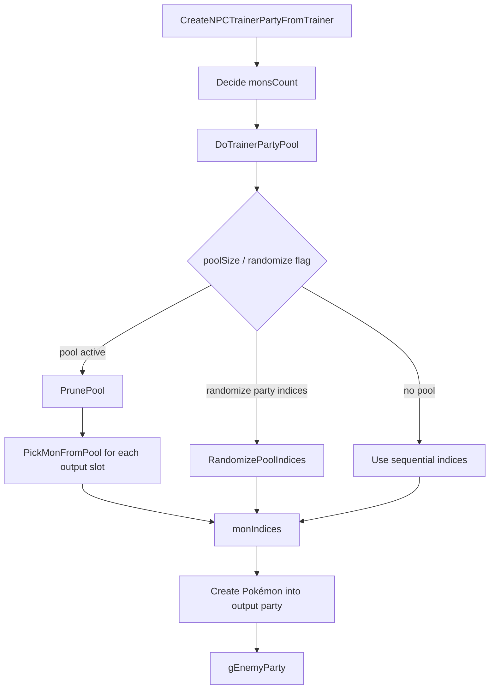

# Opponent Party Preview and Randomizer Investigation

調査日: 2026-05-01

この文書は、相手 party 表示、trainer party 並び替え、randomizer 風 party 生成に関係する既存機能を整理する。

## Purpose

将来、battle 前選出画面で相手 party を表示したり、trainer party に独自性を持たせたりする場合に、既存の Trainer Party Pools と enemy party 生成 flow を把握する。

現時点では実装しない。

## Confirmed Existing Trainer Party Pool System

確認した files:

| File | Important symbols / notes |
|---|---|
| `docs/tutorials/how_to_trainer_party_pool.md` | Trainer Party Pools の既存説明。`Party Size` と `.poolSize > .partySize` の扱い。 |
| `include/trainer_pools.h` | pool rule / pick function / prune option / tag 定義。 |
| `src/trainer_pools.c` | `DoTrainerPartyPool`、pool 選出、shuffle、tag / clause 処理。 |
| `src/data/battle_pool_rules.h` | pool ruleset 定義。 |
| `include/data.h` | `struct Trainer`, `struct TrainerMon` に pool 関連 field。 |
| `src/battle_main.c` | `CreateNPCTrainerPartyFromTrainer`, `CreateNPCTrainerParty` で pool を使って `gEnemyParty` を生成。 |
| `include/constants/battle_ai.h` | `AI_FLAG_RANDOMIZE_PARTY_INDICES`。 |
| `include/config/battle.h` | pool RNG / rule config。 |
| `tools/trainerproc/main.c` | trainer data DSL から `.poolRuleIndex`, `.poolPickIndex`, `.poolPruneIndex`, `.poolSize` などを出力。 |

## Trainer Data Fields

`include/data.h` で確認した `struct Trainer` の関連 field:

| Field | Meaning |
|---|---|
| `party` | `struct TrainerMon` 配列への pointer。 |
| `partySize` | 実際に battle へ出す数。 |
| `poolSize` | pool として参照できる候補数。 |
| `poolRuleIndex` | `src/data/battle_pool_rules.h` の ruleset。 |
| `poolPickIndex` | pick function set。 |
| `poolPruneIndex` | prune mode。 |
| `overrideTrainer` | 別 trainer data を override source にする。 |
| `aiFlags` | `AI_FLAG_RANDOMIZE_PARTY_INDICES` など。 |

`struct TrainerMon` には `tags` field があり、pool rule の tag 判定に使われる。

## Pool Rules / Tags

`include/trainer_pools.h` で確認した主な定義:

| Symbol | Role |
|---|---|
| `POOL_RULESET_BASIC` | 基本 ruleset。 |
| `POOL_RULESET_DOUBLES` | doubles 用 ruleset。 |
| `POOL_RULESET_WEATHER_SINGLES` | weather singles。 |
| `POOL_RULESET_WEATHER_DOUBLES` | weather doubles。 |
| `POOL_RULESET_SUPPORT_DOUBLES` | support doubles。 |
| `POOL_PICK_DEFAULT` | default pick functions。 |
| `POOL_PICK_LOWEST` | lower index priority pick。 |
| `POOL_PRUNE_NONE` | prune なし。 |
| `POOL_PRUNE_TEST` | test prune。 |
| `POOL_PRUNE_RANDOM_TAG` | random tag prune。 |
| `MON_POOL_TAG_LEAD` | lead tag。 |
| `MON_POOL_TAG_ACE` | ace tag。 |
| `MON_POOL_TAG_WEATHER_SETTER` | weather setter tag。 |
| `MON_POOL_TAG_WEATHER_ABUSER` | weather abuser tag。 |
| `MON_POOL_TAG_SUPPORT` | support tag。 |

`struct PoolRules` で確認した field:

- `speciesClause`
- `excludeForms`
- `itemClause`
- `itemClauseExclusions`
- `megaStoneClause`
- `zCrystalClause`
- `tagMaxMembers`
- `tagRequired`

## Party Pool Flow

`src/trainer_pools.c` / `src/battle_main.c` で確認した flow:



`CreateNPCTrainerPartyFromTrainer` は `DoTrainerPartyPool(trainer, monIndices, monsCount, battleTypeFlags)` を呼んだ後、`partyData[monIndex]` から実際の Pokémon を作成する。

## Pick Function Behavior

`src/trainer_pools.c` で確認した default pick:

| Function | Observed behavior |
|---|---|
| `DefaultLeadPickFunction` | party index 0 を Lead として選び、double battle では index 1 も Lead 扱い。 |
| `DefaultAcePickFunction` | last slot を Ace として選び、double battle では second-last も Ace 扱い。 |
| `DefaultOtherPickFunction` | Lead / Ace tag を避けて通常 slot を選ぶ。 |
| `PickLowest` | 条件を満たす低い index を選びやすい。 |

`RandomizePoolIndices` は party index の shuffle を行う。`AI_FLAG_RANDOMIZE_PARTY_INDICES` がある場合、poolSize 0 でも partySize を temporary pool として扱う path があることを確認した。

## Config

`include/config/battle.h` で確認した pool 関連 config:

| Config | Current value observed |
|---|---:|
| `B_POOL_SETTING_CONSISTENT_RNG` | `FALSE` |
| `B_POOL_SETTING_USE_FIXED_SEED` | `FALSE` |
| `B_POOL_SETTING_FIXED_SEED` | `0x1D4127` |
| `B_POOL_RULE_SPECIES_CLAUSE` | `FALSE` |
| `B_POOL_RULE_EXCLUDE_FORMS` | `FALSE` |
| `B_POOL_RULE_ITEM_CLAUSE` | `FALSE` |
| `B_POOL_RULES_USE_ITEM_EXCLUSIONS` | `FALSE` |
| `B_POOL_RULE_MEGA_STONE_CLAUSE` | `FALSE` |
| `B_POOL_RULE_Z_CRYSTAL_CLAUSE` | `FALSE` |

## Trainer Data DSL / Build Tool

`tools/trainerproc/main.c` で trainer data の以下の key を処理することを確認した。

| DSL key / behavior | Output field / notes |
|---|---|
| `Party Size` | `.partySize`。pool より小さくすると候補から一部を出す。 |
| `Pool Rules` | `.poolRuleIndex`。 |
| `Pool Pick Functions` | `.poolPickIndex`。 |
| `Pool Prune` | `.poolPruneIndex`。 |
| `Copy Pool` | `.overrideTrainer` など。 |

Randomizer 風の trainer party 並び替えは、既存の Trainer Party Pools と `AI_FLAG_RANDOMIZE_PARTY_INDICES` でかなり近いことが確認できた。

## 10 Candidates -> Pick 6

ユーザー要望の「trainer.party に 10 匹候補を書き、その中から 6 匹を選ぶ」は、現行 Trainer Party Pools でかなり近い。

`trainers.party` では、trainer に 10 匹定義し、header 側の `Party Size` を 6 にする。`trainerproc` は定義 Pokemon 数より `Party Size` が小さい場合に `.poolSize` を出力し、battle 生成時に `DoTrainerPartyPool()` が pool から実際の party を選ぶ。

```text
=== TRAINER_EXAMPLE_POOL ===
Name: Example
Class: Cooltrainer
Pic: TRAINER_PIC_COOLTRAINER_M
Gender: Male
Party Size: 6
Pool Rules: Basic
Pool Pick Functions: Default
Pool Prune: None
AI: Smart

Pokemon: SPECIES_...
Level: 50
Tags: Lead

Pokemon: SPECIES_...
Level: 50
Tags: Ace
```

既存 tutorial は [How to use Trainer Party Pools](../../tutorials/how_to_trainer_party_pool.md)。Lead / Ace / Weather Setter / Weather Abuser / Support などの tag を付けると、単純な完全 random ではなく「先発候補」「切り札候補」「天候役」のような役割を残せる。

## Runtime Pool vs External Generator

ユーザー案の「外部 service / exe で `trainers.party` を吐き出し、貼り付けて使う」は有力。アップストリーム更新時に C 側 randomizer を毎回追従するより、trainer data format に合わせて生成物を出す方が保守しやすい。

| Approach | Pros | Risks |
|---|---|---|
| In-engine Trainer Party Pools | 既存機能を使える。battle ごとの揺らぎを出せる。tag / rule / prune と連動できる。 | Preview UI と本番 party の RNG 同期、replay/debug 再現性、balance check が必要。 |
| External generator -> static `trainers.party` | C 側変更が少ない。差分 review しやすい。アップストリーム追従時も trainer data format だけ合わせればよい。 | 実行時 random ではない。再生成しない限り team は固定。 |
| External generator -> Trainer Party Pool blocks | 10 候補から 6 匹選ぶような pool を自動生成できる。engine は既存 TPP を使う。 | generator が `Party Size`、`Pool Rules`、`Tags`、constants を正しく出す必要がある。 |

現時点の推奨は **External generator -> Trainer Party Pool blocks**。engine 側の新規改造を抑えつつ、trainer ごとに 10 候補 / 6 選出 / tag 付き role を作れる。Pokemon Champions 風のルールや randomizer は外部で進化させ、ROM 側は `trainers.party` DSL と Trainer Party Pools の互換を保つ。

## External Generator Contract

外部生成に寄せる場合、最初に固定するべき contract:

| Contract | Reason |
|---|---|
| Input constants | `SPECIES_*`, `MOVE_*`, `ITEM_*`, `ABILITY_*`, `TRAINER_*` は repo の constants に合わせる。 |
| Output format | `tools/trainerproc/main.c` が読める `trainers.party` DSL をそのまま出す。 |
| Pool metadata | `Party Size`, `Pool Rules`, `Pool Pick Functions`, `Pool Prune`, `Tags` を出せるようにする。 |
| Validation | species / move / item constants の存在、重複 species / item clause、level、move count を生成時に検査する。 |
| Deterministic seed | 同じ seed と同じ input なら同じ output を吐く。差分 review と再現性のため。 |
| Version marker | 生成物 comment に generator version / ruleset / seed を残す。 |

この方式なら、将来 generator 側で「現世代動画や画像 frame から採用した人間味のある構成」「double battle 用 partner 評価」「tier / usage に応じた move weight」を増やしても、ROM 側の変更範囲を小さく保てる。

## Generator Ownership / Runtime Position

`trainers.party` の中身を必ず参照するなら、生成器は完全な別 project よりも **この repository 内の tool** として持つ方が扱いやすい。

推奨形:

| Layer | Responsibility |
|---|---|
| Source catalog | 旅順・trainer group・role・difficulty・地域など、人間が review する入力 data。 |
| Generator tool | repo 内 constants / existing `trainers.party` / catalog を読み、generated `.party` fragment を吐く。 |
| `trainerproc` | 既存どおり `.party` DSL から C header を生成する。 |
| Docker | 必要なら generator dependencies を固定する wrapper。game build の必須 runtime にはしない。 |

理由:

- generator は `SPECIES_*`, `MOVE_*`, `ITEM_*`, `ABILITY_*`, `TRAINER_*` と常に同期する必要がある。
- `tools/trainerproc/main.c` と `trainer_rules.mk` はすでに repo 内 tool として build flow に入っている。
- 別 repository にすると、pokeemerald-expansion の更新、constant rename、party DSL 変更を追いかける境界が増える。
- Docker は Python / Node / Rust などの generator dependency を固定する用途では有効だが、毎回の ROM build に container 起動を必須化すると編集 feedback が重くなる。

現時点の判断は、`tools/champions_partygen/` のような repo-local tool を作り、Docker は optional の `make partygen-docker` 相当に留めること。CI / review では「生成済み file が source catalog と一致するか」を検査する。

## Generator Language / UI Position

生成器は C で作る必要はない。`trainerproc` は既存 build tool として C のままでよいが、Champions 用の party generator は repo 内 data を読んで `.party` DSL を吐ければよい。

候補:

| Option | Fit | Notes |
|---|---|---|
| Rust CLI | High | constants parser、validation、一括変換、single binary 化に向く。将来 desktop exe にもしやすい。 |
| Python CLI | High for MVP | 早く作れる。JSON / CSV / web import / data analysis が軽い。配布時は環境差に注意。 |
| TypeScript / Web app | Medium to High | browser UI、ranking 表示、検索 UI に向く。file system / repo integration は別 layer が必要。 |
| Desktop app | Medium | drag-and-drop / exe 配布はしやすいが、最初から作ると UI 実装量が増える。 |
| C tool | Low for generator | repo との親和性はあるが、web import、ranking analysis、rich UI には向かない。 |

現時点の好みは **Rust CLI**。この ROM では constants / species / move / ability / item 定義を頻繁に改造するため、型付き parser、validation、single binary、後の desktop 化の相性がよい。Python は prototype / analysis script としては有力だが、最終的な置き換え tool は Rust に寄せる。

MVP は **CLI first + batch edit** がよい。Web / desktop UI はその CLI を呼ぶ frontend として後から足す。理由は、trainer 数が多く、button を 1 匹ずつ押して編集する UI では作業が終わらないため。

推奨する command surface:

```text
partygen scan
partygen plan --catalog tools/champions_partygen/catalog/journey.json
partygen generate --seed 1234 --out src/data/generated/champions_trainers.party
partygen validate --input src/data/generated/champions_trainers.party
partygen diff --against src/data/trainers.party
```

UI を作る場合も、中心は button edit ではなく次の bulk 操作にする。

| UI Feature | Purpose |
|---|---|
| Trainer table | 旅順、stage、map、level band、party style を一覧で見る。 |
| Bulk apply | stage / trainer group 単位で level、AI、pool rule、difficulty を一括適用する。 |
| Ranking panel | usage / trend / role score の上位候補を species / move / item / ability / nature ごとに出す。 |
| Candidate-first select | select box では強い候補、よく使う候補、合法候補を先頭に出す。 |
| Batch replace | `trainers.party` fragment をまとめて生成・差し替えする。 |
| Validation panel | illegal constant、missing move、invalid ability、item clause などを先に潰す。 |

## Canonical Data Source Policy

generator は外部 site の species stats / move data / item data を正として使わない。ROM 側で種族値、技、特性、item 効果を変える可能性があるため、canonical source はこの repository 内に置く。

repo から読むべき data:

| Data | Canonical source |
|---|---|
| Species constants | `include/constants/species.h` |
| Move constants | `include/constants/moves.h` |
| Item constants | `include/constants/items.h` |
| Ability constants | `include/constants/abilities.h` |
| Trainer ids | `include/constants/opponents.h`, `include/constants/trainers.h` |
| Existing trainer parties | `src/data/trainers.party` |
| Generated trainer header check | `src/data/trainers.h` |
| Species stats / typing / abilities | repo の species data headers |
| Move power / type / flags | repo の move info data |
| Item behavior / hold item data | repo の item data / battle item code |

外部 source は「重み」や「傾向」の入力として扱う。

| External input | Allowed use |
|---|---|
| Usage ranking | 候補 species / item / move / nature の score を上げる。 |
| Tournament teams | archetype、core、よくある持ち物、性格、技構成の weight にする。 |
| Web search summary | 現行流行の候補リストを作る。 |
| Video / battle summary | AI 思考、選出方針、lead / ace / support 評価の weight にする。 |

外部 trend data はそのまま生成結果に直結させず、必ず repo-local legality / balance validation を通す。

## Usage Source Candidates

使用率 ranking / tournament trend はこちらでも web search で調査できる。ただし current metagame は変動が速く、公式 data は mobile app 内表示に寄っている可能性があるため、自動取得できる source と、手入力 / URL 指定で取り込む source を分ける。

VGC 用の primary source は Victory Road 系を優先する。Showdown / Smogon ladder は fan simulator / ladder data なので、公式大会環境の代替としては扱わない。

Singles は Pokemon Battle DataBase と日本語圏の構築記事を優先する。Doubles / VGC は Victory Road でおおむね足りるが、Pokemon Battle DataBase の double data も流行確認に使える。

候補:

| Source | Use | Notes |
|---|---|---|
| Victory Road event pages | primary VGC tournament trend | Worlds / Regionals / Internationals などの results、team icons、Export Team、Report、OTS / EVs column を見る。 |
| Victory Road / VR Pastes / team reports | primary curated team data | 英語記事や spreadsheet / paste がある場合は最優先で取り込む。 |
| Pokemon HOME Battle Data | official usage reference | smartphone 版で ranking、moves、abilities、items を確認できる。機械取得は未確定。 |
| Pokemon Battle DataBase | primary Singles / secondary Doubles usage | HOME 公開情報を元にした rank battle data。上位構築の CSV / JSON があるため generator input に向く。 |
| Pokemon徹底攻略 / 攻略大百科 / Game8 など | Singles article / build reference | 育成論、構築、環境記事、採用理由の説明を人間 review 用 source にする。 |
| Pokésol / Pokemon Soldier | Singles / battle trend commentary | YouTube / 記事の環境解説、構築紹介、対戦意図の理解に使う。 |
| 超ポケチャンネル | Singles / live commentary reference | live 配信や解説から、構築の狙い・選出・技選択の傾向を curated memo に落とす。 |
| PokemonWiki / 対戦考察まとめWiki / 育成考察Wiki | species history / role reference | 個別 Pokemon の世代別評価、型、立ち位置、不遇理由、役割を読む。構築単位 data ではない。 |
| Pikalytics | secondary usage reference | Web で species ごとの usage 傾向を確認しやすいが、source / format を確認して補助扱いにする。 |
| Tournament reports / team sheets | archetype / core trend | 手入力または URL memo から curated weight に落とす。 |
| Smogon / Showdown usage stats | low-priority reference only | official VGC tournament data ではないため、欠けた情報の補助か sanity check に留める。 |
| User-provided URLs | manual override | 自動検索で拾えない source は URL 指定で取り込む。 |

最初は scraper を前提にせず、`weights/usage.json` に手で curated score を置く。自動取得は source が安定してから追加する。

取り込み優先順位:

1. Victory Road の大会記事 / spreadsheet / paste / report
2. 公式 Pokemon HOME Battle Data
3. Pokemon Battle DataBase の rank battle 上位構築 CSV / JSON
4. 実大会の team sheet / rental / player report
5. Pokemon徹底攻略 / 攻略大百科 / Game8 / Pokésol / 超ポケチャンネルなどの構築・解説 source
6. Pikalytics などの補助統計
7. Smogon / Showdown ladder data

Showdown 系は simulator 上の流行を見たい場合だけ使う。Champions Challenge の opponent generator では、VGC 実大会の構築・持ち物・性格・技構成を primary weight にする。

## Singles / Doubles Source Policy

mode ごとの source priority:

| Mode | Primary | Secondary | Avoid / low priority |
|---|---|---|---|
| Singles | Pokemon Battle DataBase, Pokemon徹底攻略, 攻略大百科, Game8, Pokésol, 超ポケチャンネル | PokemonWiki / 対戦考察まとめWiki / 育成考察Wiki, Pokemon HOME Battle Data, user-provided URLs, curated articles / videos | Showdown / Smogon ladder を正扱いしない |
| Doubles / VGC | Victory Road, VR Pastes, event reports, official team sheets | Pokemon Battle DataBase double data, Pokemon HOME Battle Data, Pikalytics | Showdown / Smogon ladder を公式 VGC 代替にしない |

Pokemon Battle DataBase は上位構築 data を CSV / JSON で公開しており、season と single / double を URL で切り替えられる。このため generator では最初から direct import candidate に入れる。ただし不特定多数の client から直接叩く設計は避け、local cache / manual download / repo-local weights への変換を挟む。

構築記事・YouTube・配信は、数値 data ではなく rationale data として使う。つまり「なぜその持ち物か」「どの matchup を見ているか」「選出順・技選択の意図」を curated memo / archetype tag に変換し、generator の role weight に入れる。

PokemonWiki / 対戦考察まとめWiki / 育成考察Wiki は、個別 Pokemon の世代別評価を読む source として使う。特にマイナー Pokemon は「なぜ評価されにくいか」「どの世代で何が役割だったか」「どの型なら差別化できるか」が読みやすい。ただし party core / team synergy の実績 data ではないため、構築単位の primary source にはしない。

## Species Role Notes

個別 Pokemon の評価は、generator に直接 web text を読ませ続けるより、repo-local note に抽出して使う。

候補 file:

```text
tools/champions_partygen/notes/species_roles.md
tools/champions_partygen/notes/species_roles.csv
tools/champions_partygen/notes/species_roles.json
```

MVP は人間が review しやすい Markdown または CSV がよい。Rust generator は後で JSON / CSV を読む。

抽出したい項目:

| Field | Purpose |
|---|---|
| `species` | repo-local species constant に紐づける。 |
| `generationContext` | どの世代の評価か。 |
| `roles` | wall, pivot, cleaner, setup, weather, trapper, anti-meta など。 |
| `strengths` | 差別化点、強い matchup、採用理由。 |
| `weaknesses` | 火力不足、技不足、環境不利、競合、耐久不安など。 |
| `signaturePatterns` | よくある技 / 持ち物 / 特性 / 性格の傾向。 |
| `minorPickReason` | マイナー Pokemon を使うなら何を狙うか。 |
| `sourceUrls` | PokemonWiki / 考察 wiki / 記事への参照。 |

この note は trend weight ではなく、候補生成と role tag 付けの補助に使う。player の苦手 profile とは別 layer にする。

## Trend Weight Model

最終理想は、web search、usage ranking、動画要約、battle log 分析を weight として取り込める generator。MVP ではここを直接 AI 自動生成にせず、数値化された score file を読むだけにする。

候補 file:

```text
tools/champions_partygen/weights/usage.json
tools/champions_partygen/weights/archetypes.json
tools/champions_partygen/weights/item_synergy.json
tools/champions_partygen/weights/nature_move_preferences.json
```

weight の例:

| Weight | Example |
|---|---|
| species usage | よく使われる Pokemon を候補上位にする。 |
| item tendency | 特定 species / ability / role でよく使う item を上位にする。 |
| nature tendency | fast attacker は Speed nature、bulky support は bulk nature を上位にする。 |
| move tendency | STAB / coverage / setup / recovery / priority を role に応じて配点する。 |
| role fit | Lead / Ace / Support / Weather Setter / Cleaner などの tag 付けに使う。 |
| rule legality | 参加不可 Pokemon、ban item、level rule、duplicate clause を減点または除外する。 |

生成時の優先順位:

1. repo-local legality
2. challenge rule / ban list
3. trainer stage / level band / journey order
4. role fit
5. trend weight
6. random seed

この順序にしておけば、最新流行を参考にしつつ、改造 ROM 側の独自 stat / move / item 変更を壊さない。

## Practical Curated Randomizer Direction

この generator は「全部を雑に shuffle する randomizer」ではなく、実戦寄りの party generator / curated randomizer として扱う。

目標:

- trainer ごとの役割、旅順、強さ、テーマを保つ。
- 完全ランダムではなく、構築軸を持った候補から選ぶ。
- 人間が気に入らない候補を手で直せる。
- seed による再現性を保ちつつ、毎回同じ並びに見えすぎないようにする。
- `.party` text を成果物にし、最終的には人間が copy-paste / review / 微調整できる状態にする。

避けたいもの:

- species だけをランダム差し替えして、技 / 持ち物 / speed / role が噛み合わない party。
- 旅順や trainer role を無視した強弱のばらつき。
- type 統一だけに頼った party。type theme は使えるが、それだけだと speed control / support / win condition が足りない場合がある。
- trend data をそのまま丸写しして、ROM 側の custom data や level band を壊すこと。

参考にしたい感触:

- XD / Battle Revolution 風の、trainer ごとに意図が見える構築。
- Battle Factory / roguelike 的な候補選択と replayability。
- Emerald Rogue 風の type theme の分かりやすさ。ただし type 統一だけではなく、構築軸と役割の噛み合わせを重視する。

generator が見るべき構築軸:

| Axis | Examples |
|---|---|
| Speed control | Tailwind, Trick Room, Icy Wind, Thunder Wave, Choice Scarf, priority |
| Board control | Fake Out, Intimidate, redirection, pivot, phazing, Taunt |
| Field plan | weather, terrain, screens, hazards, Aurora Veil |
| Win condition | setup sweeper, bulky ace, weather sweeper, cleaner, stall breaker |
| Defensive glue | resist core, immunity pivot, recovery, status absorber |
| Offensive coverage | STAB, coverage move, priority, spread move, anti-wall move |
| Item plan | berries, Choice item, Focus Sash, Life Orb, type boost, utility item |
| Gimmick plan | Tera type, Stellar / special Tera policy if enabled, Dynamax / Gmax if enabled |

これにより、randomizer らしい変化は残しつつ、「何をしたい party なのか」が分かる生成結果にする。

## Manual Tuning / Candidate Workflow

最初から完全自動で正解を出そうとしない。generator は候補を出し、人間が微調整できる workflow にする。

推奨 flow:

1. `journey_catalog.json` で trainer の stage / role / partyStyle / levelBand を指定する。
2. generator が 3-10 個程度の candidate plan を作る。
3. 人間が良い candidate を選ぶ。
4. 必要なら species / move / item / ability / nature / EV / IV / Tera type を lock または override する。
5. `champions_trainers.party` を出力する。
6. validation / diff を見て、また catalog / override を直す。

候補 schema:

```json
{
  "trainer": "TRAINER_ROXANNE_1",
  "partyStyle": "rock-control",
  "archetype": "bulky-rock-with-speed-denial",
  "levelBand": [14, 16],
  "difficulty": 35,
  "mustInclude": ["SPECIES_NOSEPASS"],
  "allowedTypes": ["Rock", "Ground", "Steel"],
  "preferredAxes": ["defensive-glue", "speed-denial", "status-pressure"],
  "teraPolicy": {
    "enabled": true,
    "allowStellar": false,
    "preferDefensiveTera": true
  },
  "manualOverrides": {
    "lockSpecies": ["SPECIES_NOSEPASS"],
    "banSpecies": [],
    "lockMoves": {},
    "lockItems": {},
    "notes": "Keep gym-leader identity while improving practical battle plan."
  }
}
```

manual override は generator の逃げ道ではなく、中心機能として扱う。人間が「この候補は惜しいが、item だけ変えたい」「Tera type だけ変えたい」「speed control 役を足したい」と思った時に、全部を手書きし直さず調整できるようにする。

出力 `.party` には、人間 review 用の comment を残す候補もある。

```text
/* partygen:
 * style: rock-control
 * archetype: bulky-rock-with-speed-denial
 * seed: 1234
 * manual overrides: SPECIES_NOSEPASS locked
 */
```

ただし、最終的に `trainerproc` が安全に処理できる comment 形式にする必要がある。

## Player Log Adaptive Difficulty

mGBA / 通常 play log を使って「player が苦手な構築」を generator に反映する案は技術的には可能。最初から学習 AI にせず、battle log を集計して weight に変換する段階を挟む。

取りたい log:

| Log | Derived signal |
|---|---|
| badge / story progress | 旅順 catalog と現在の進行度を結びつける。 |
| player party snapshot | 使っている type、role、speed tier、耐性の偏りを見る。 |
| battle result | どの trainer / archetype に負けたか、苦戦したかを見る。 |
| turn actions | どの matchup でどの技を押しがちかを見る。 |
| damage / KO event | 被 KO type、倒せない耐久、苦手な speed control を抽出する。 |
| item / ability triggers | 苦手な ability、status、recovery、choice item などを見る。 |

出力は直接 trainer party ではなく、次のような adaptive weight にする。

```text
tools/champions_partygen/weights/player_profile.json
```

例:

| Signal | Generator effect |
|---|---|
| Water / Ground に弱い party を使いがち | 該当 coverage を持つ trainer を少し増やす。 |
| setup sweeper で勝ちすぎている | Taunt、phazing、priority、Unaware 系 role の score を上げる。 |
| fast offense に弱い | speed control、priority、scarf role を増やす。 |
| stall が苦手 | recovery / status / residual damage archetype の score を上げる。 |
| 同じ対策で詰まる | 同一 counter を連続で出しすぎないよう cooldown を入れる。 |

設計上は「プレイヤーを潰す generator」ではなく、intensity parameter で反映量を調整する。

## Adaptive Learning Guardrails

player log adaptation は小サンプルで過学習しやすい。1-5 回程度の run では「player が本当に苦手」なのか、「たまたま party / matchup / turn order が悪かった」のかを分けにくい。

そのため、MVP では次の guardrail を入れる。

| Guardrail | Purpose |
|---|---|
| minimum samples | 一定 battle 数 / run 数までは player weakness weight をほぼ使わない。 |
| uncertainty penalty | sample が少ない signal は score を弱める。 |
| decay | 古い log の影響を少しずつ落とす。 |
| cooldown | 同じ counter / archetype を連続で出しすぎない。 |
| diversity floor | 旅順 stage ごとに複数 archetype を必ず残す。 |
| exploration rate | intensity が高くても一定割合で別系統の party を混ぜる。 |
| manual profile | player が最初に自分の苦手 / 得意を手で指定できる。 |

最初の運用:

1. 初回 build は external trend + journey catalog + species role notes だけで生成する。
2. 1-5 run は log を集めるが、adaptation は弱くする。
3. ある程度 log が貯まったら `player_profile.json` に集計する。
4. `adaptationWeight` を手動で上げた時だけ、苦手対策を強く反映する。
5. 同じ counter が続く場合は cooldown で除外する。

順番通りに対策が出ると高速で攻略されるため、generator は deterministic seed を持ちつつも、stage 内の archetype order は shuffle する。review 用には seed を残すが、プレイ上は「次に何が来るか」が固定されすぎないようにする。

内部的には、完全な machine learning よりも rule-based scorer + uncertainty が現実的。

```text
final_score =
  legality_gate
  * stage_fit
  * role_fit
  * trend_weight
  * player_profile_weight
  * intensity_scale
  * diversity_adjustment
  * cooldown_adjustment
```

この方式なら、sample が少ない間は external trend と旅順設計が中心になり、log が増えてから少しずつ player adaptation を強められる。

## Intensity / Reward Parameter

Normal / Hard の固定 mode より、Smash の本気度のような連続値 parameter が合う。

候補:

| Parameter | Range | Effect |
|---|---:|---|
| `intensity` | 0.0-10.0 | 高いほど trend weight、player weakness weight、synergy、legal optimization を強める。 |
| `rewardMultiplier` | derived | intensity が高いほど報酬を増やす。 |
| `variance` | inverse / configurable | 低 intensity はゆるい構築も混ぜ、高 intensity は役割破綻を減らす。 |
| `adaptationWeight` | 0.0-1.0 | player log 由来の苦手対策をどれだけ反映するか。 |

初期実装では `intensity` を party generator の入力にするだけでよい。battle engine 側の難易度 UI / 報酬倍率は Champions Challenge 実装時に接続する。

## Build-Time Profile / Rebuild Loop

ROM 実行中に trainer party や evaluation weight を自由に差し替える設計は避ける。GBA ROM は data address / generated table / save compatibility の制約があり、exe で既存 ROM を後から patch する方式は address 変動に弱い。

推奨は **build-time generation**。

1. profile / intensity / notes / external weights を config file に書く。
2. `partygen generate` で `trainers.party` fragment を生成する。
3. 通常どおり ROM を rebuild する。
4. mGBA で遊ぶ。
5. log を抽出して `player_profile.json` や config を更新する。
6. 次回 build で反映する。

候補 config:

```text
tools/champions_partygen/config.toml
```

例:

```toml
[challenge]
intensity = 50
adaptation_weight = 0.35
variance = 0.45
minimum_adaptation_runs = 5
exploration_rate = 0.15
archetype_cooldown = 2

[player_profile]
prefer_counter_to_player_strengths = false
target_player_weaknesses = true
use_mgba_logs = true

[sources]
use_victory_road = true
use_pokedb = true
use_species_role_notes = true
```

`intensity` は 0-100 の手動値として扱えるようにする。ゲーム内に完全な動的調整 UI を作るより、build 前に `config.toml` を変更して再生成する方が安全で review しやすい。

ROM 内で intensity を変更できるようにする場合も、初期段階では「どの generated trainer group を使うか」を選ぶだけにする。例: intensity 25 / 50 / 75 / 100 の複数 group を build 時に生成し、runtime は group id を選ぶ。これなら runtime で party data 自体を書き換えない。

## Tool / UI Technical Choice

技術選定は段階を分ける。

| Phase | Choice | Reason |
|---|---|---|
| Core | Rust library crate | repo-local parser、validation、scoring、generation を UI から分離する。 |
| MVP interface | Rust CLI | build-time generation と CI / script 実行に向く。 |
| Config | TOML + JSON/CSV weights | 手編集しやすく、review しやすい。 |
| Analysis prototype | Python optional | notebook / one-off import / data cleanup に使う。core logic にはしない。 |
| UI prototype | local browser UI | table、ranking、bulk edit、validation report を見るには browser が楽。 |
| Packaged app | Tauri wrapper candidate | Rust core を使い回し、必要になったら desktop exe 化できる。 |
| Figma | design reference only | Figma MCP があれば frame / tokens / layout を読む。generator logic の必須 dependency にはしない。 |

この stack は generator 先行の標準構成として扱う。runtime 仕様が変わっても、Rust core / CLI / file contract / validation report を保てば、map や challenge state の変更に追従しやすい。

別 project として立ち上げる場合の推奨 stack:

```text
champions-partygen/
  crates/partygen_core/      # Rust parser / validator / scorer
  crates/partygen_cli/       # scan / plan / generate / validate / diff
  ui/                        # optional local browser UI
  config.toml
  catalog/
  weights/
  notes/
```

tool は pokeemerald-expansion を submodule / vendored copy として抱え込まない。ROM repo path を config / CLI arg で渡し、読み取り対象と出力先として扱う。

```text
partygen scan --rom-repo /path/to/pokeemerald-expansion
partygen generate --rom-repo /path/to/pokeemerald-expansion --out /path/to/pokeemerald-expansion/src/data/generated/champions_trainers.party
partygen validate --rom-repo /path/to/pokeemerald-expansion --input /path/to/pokeemerald-expansion/src/data/generated/champions_trainers.party
```

UI は最初から作り込まない。必要になったら local browser UI を作る。desktop exe が必要になったら Tauri で wrap する。Figma MCP は、UI の画面設計や design token が Figma にある場合は便利だが、MVP を進める条件ではない。

UI で欲しい画面:

| View | Purpose |
|---|---|
| Source dashboard | Victory Road / PokeDB / notes / player log の取り込み状態を見る。 |
| Journey table | stage、map、trainer、level band、archetype を一覧編集する。 |
| Weight inspector | species / item / move / ability / nature の score 根拠を見る。 |
| Bulk editor | stage や trainer group 単位で一括変更する。 |
| Validation report | illegal constant、ban、ability mismatch、move error を潰す。 |
| Diff preview | 生成前後の `trainers.party` fragment を確認する。 |

## Docs-First Parking Lot

generator はできることが多く、仕様を先に絞りすぎると後で取りこぼしが出やすい。未確定の案は実装 task にせず、まず docs に置く。

置き場所:

| Kind | Destination |
|---|---|
| generator contract / stack / output layout | `docs/features/battle_selection/opponent_party_and_randomizer.md` |
| Champions Challenge runtime rule | `docs/features/champions_challenge/README.md` |
| MVP implementation order | `docs/features/champions_challenge/mvp_plan.md` |
| risk / guardrail | `docs/features/champions_challenge/risks.md` |
| test idea | `docs/features/champions_challenge/test_plan.md` |
| scout / gift / battlefield status | `docs/overview/scout_selection_and_battlefield_status_v15.md` |

運用:

1. 思いつき、未検証 source、UI 案、scoring 案は docs に追記する。
2. 実装する前に、contract / MVP / risk / test のどれに属するかを分ける。
3. 確定した contract だけ CLI option / file schema / validation rule に落とす。
4. generated `.party` fragment は copy-paste できる形で先に出し、build integration は後段に回す。

## External Tool Boundary

別 project 化するなら、境界は file contract にする。

| Direction | Files / Data | Owner |
|---|---|---|
| ROM repo -> tool | constants, species data, move data, item data, ability data, existing `trainers.party` | pokeemerald-expansion |
| tool-local input | config, catalog, curated weights, species role notes, source cache, raw logs | champions-partygen |
| tool -> ROM repo | generated `.party` fragment, validation report, diff report | champions-partygen output |
| ROM build | `trainerproc`, C headers, final ROM | pokeemerald-expansion |

この境界なら、Figma / browser UI / desktop exe / web scraping を tool 側で自由に増やせる。ROM 側は generated data を受け取って build するだけに保てる。

ROM repo 側に置くのは最低限:

- generated fragment の include / build integration
- generator output の保存先 directory
- docs / contract
- 必要なら wrapper script

tool 側に置くもの:

- Rust core / CLI / UI
- source importer
- player log parser
- scoring / validation logic
- config / source cache / raw logs / aggregated profile

## Log Data Strategy

mGBA log は量が大きくなる前提で扱う。最初から学習用に丸めず、raw log を残し、後段で aggregate する。

推奨 directory:

```text
champions-partygen/
  logs/raw/                  # mGBA / emulator / script raw logs
  logs/normalized/           # JSONL events
  profiles/                  # aggregated player profiles
  weights/                   # curated / generated weights
```

段階:

1. raw text log を保存する。
2. parser で normalized JSONL に変換する。
3. profile builder で `player_profile.json` を作る。
4. generator は raw log を直接読まず、profile / weights だけ読む。

この分離により、log format が変わっても generator core を壊しにくい。AI / adaptive scoring は最後段に置き、最初は validation / generation / diff を安定させる。

raw log に含めたい event:

| Event | Purpose |
|---|---|
| battle_start / battle_end | matchup と勝敗を取る。 |
| party_snapshot | player の使用傾向を見る。 |
| turn_start | state context を切る。 |
| move_selected / move_used | 入力傾向と実際の行動を見る。 |
| damage / faint | 苦手 type、speed、火力、耐久を見る。 |
| switch / item / ability trigger | matchup handling と苦手 gimmick を見る。 |

learning data は最後段に置く。先に log adaptation を generator の中心にすると、AI / scoring を後で差し替えにくくなるため、MVP では raw log 保存と parser contract までを優先する。

## Generated File Layout Candidate

`src/data/trainers.party` を丸ごと generator 出力に置き換えるより、最初は source と generated を分ける。

候補:

| File | Role |
|---|---|
| `src/data/trainers.party` | vanilla / hand-authored trainer data。旅順に整理する primary file。 |
| `src/data/generated/champions_trainers.party` | generator 出力。手で編集しない。 |
| `tools/champions_partygen/catalog/*.json` | 旅順 catalog、trainer role、difficulty band、allowed pool。 |
| `tools/champions_partygen/README.md` | seed、入力、出力、review 手順。 |

`trainer_rules.mk` は `.party` を `trainerproc` に渡す前に C preprocessor を通すため、必要なら `trainers.party` 側から generated fragment を include する設計が取れる。ただし include path と rebuild dependency は実装時に確認する。

生成物には header comment を残す:

```text
/* Generated by tools/champions_partygen
 * seed: ...
 * catalog version: ...
 * source revision: ...
 * Do not edit by hand.
 */
```

## Trainer ID / Journey Order Feasibility

`.party` は party だけの loose text ではなく、trainer definition の source でもある。各 block は `=== TRAINER_XXXX ===` で始まり、この `TRAINER_XXXX` が code / script で参照される trainer symbol になる。

確認済みの関係:

| Source | Role |
|---|---|
| `src/data/trainers.party` | `=== TRAINER_XXXX ===` block と party / trainer metadata の手書き source。 |
| `tools/trainerproc/main.c` | `.party` block の id を読み、generated header へ `[DIFFICULTY_*][TRAINER_XXXX] = { ... }` として出力する。 |
| `src/data/trainers.h` | generated result。`gTrainers[DIFFICULTY_COUNT][TRAINERS_COUNT]` の initializer。 |
| `include/constants/opponents.h` | `TRAINER_XXXX` の numeric id。 |
| `data/maps/*/scripts.inc` / `data/scripts/*.inc` | `trainerbattle_* TRAINER_XXXX, ...` で map / event から trainer を参照する。 |

つまり generator は trainer ID を持てる。最低限は:

1. `src/data/trainers.party` から existing trainer block id を読む。
2. `include/constants/opponents.h` から `TRAINER_XXXX -> number` を読む。
3. map scripts の `trainerbattle_* TRAINER_XXXX` を scan して、trainer がどの map / script に出るかを補助情報として拾う。

ただし、旅順を existing `.party` の定義順から自動推定するのは危険。現状の `trainers.party` は旅順に整っているとは限らず、Aqua / rematch / special battle / FRLG / event-only battle が混ざる。map script scan も完全な旅順にはならない。理由:

- rematch trainer は同じ map に複数段階で出る。
- rival / story battle は flag / starter / script 分岐で trainer id が変わる。
- Gabby & Ty や施設 battle のように、map と battle order が固定でないものがある。
- `data/scripts/*.inc` の shared script から呼ばれる trainer は、map path だけでは旅順を決められない。
- object event の配置順は player が遭遇する順番とは一致しない。

そのため、旅順は generator が勝手に確定しない。**journey catalog を primary source** にする。

候補 schema:

```json
{
  "trainer": "TRAINER_CALVIN_1",
  "stage": "early",
  "order": 102020,
  "map": "MAP_ROUTE102",
  "script": "data/maps/Route102/scripts.inc",
  "encounter": "required-or-near-main-path",
  "levelBand": [4, 8],
  "role": "route-filler",
  "partyStyle": "early-basic"
}
```

`order` は numeric にしておくと、あとで Route / Gym / Hideout / Rival / E4 をまとめて sort しやすい。値は自動生成してもよいが、最終的には人間 review で固定する。

generator MVP では、以下を成果物にする:

| Output | Purpose |
|---|---|
| `trainer_index.csv` | `.party` と `opponents.h` から trainer symbol / numeric id / current source line を一覧化する。 |
| `script_usage.csv` | map scripts から trainer symbol / script path / line / battle macro を一覧化する。 |
| `journey_catalog.json` | 人間が review した旅順。generator の primary input。 |
| `champions_trainers.party` | copy-paste 可能な generated `.party` fragment。 |

この順番なら、最初の成果物は text の `.party` fragment で終われる。一方で、trainer ID と旅順確認も横で進められるため、後から大量に増えても「どの trainer がどこにいて、旅のどの段階か」が崩れにくい。

## Journey Order Catalog

`trainers.party` の定義順を「旅の順番」に寄せる案は有効。毎回 trainer を調べる体験を前提にするなら、序盤 / 中盤 / 終盤 / postgame が source 上でも見える方が、balance review と generator 入力の両方が楽になる。

推奨する軸:

| Axis | Example |
|---|---|
| Stage | early, mid, late, victory-road, elite-four, postgame |
| Route / Map | Route 102, Rustboro Gym, Aqua Hideout など |
| Trainer role | tutorial, route filler, ace, boss, rival, rematch |
| Intended level band | 5-10, 20-25, 45-50 など |
| Party style | mono-type, weather, bulky, fast offense, doubles support |

並び替えは一気に全 file を機械的に動かすより、まず catalog を作って「この trainer は旅順でどこにいるか」を明示する方が安全。既存 script / rematch / VS Seeker / event 参照は `TRAINER_*` constant を使うため、定義順を変えるだけなら壊れにくいが、review diff が巨大になる。

MVP の順序:

1. `trainers.party` は現状維持で、旅順 catalog を別 file に作る。
2. generator は catalog の stage / level band を読んで Champions 用 party pool を生成する。
3. 旅順 catalog が安定したら、通常 `trainers.party` の並び替えを小分けに行う。
4. 並び替え後も `TRAINER_*` id と event script 参照が変わっていないことを検査する。

この順番なら、「旅順で調べやすい source」と「Champions 用に強い party を生成する仕組み」を同時に進められる。

## Opponent Party Preview Timing

重要な確認点:

- `gEnemyParty` は通常、battle init 中に `src/battle_main.c` の `CreateNPCTrainerPartyFromTrainer` / `CreateNPCTrainerParty` を通じて作られる。
- そのため、field script 上で battle 前選出 UI を開く時点では、pool / randomize / override 反映済みの `gEnemyParty` がまだ存在しない可能性が高い。
- 相手 party preview を正確に表示するには、battle init より前に同じ生成結果を得る仕組みが必要になる。

候補はあるが未実装:

| Candidate | Pros | Risks |
|---|---|---|
| Battle 前に preview 専用で `CreateNPCTrainerParty` 相当を呼ぶ | 実際の party を表示しやすい | RNG 消費、`gEnemyParty` 汚染、battle init との二重生成。 |
| Pool 生成だけを non-mutating helper 化する | preview と battle 本番の整合性を取りやすい | 既存 code refactor が必要。 |
| Battle init 後に選出 UI を出す | `gEnemyParty` が確定後に表示できる | battle intro / controller / callback flow へ深く入るため高リスク。 |
| 最初は trainer data の static party を表示する | 実装が軽い | pool / random order / override を正確に反映できない。 |

現時点の判断: MVP では相手 party preview は除外し、party selection の安全な保存/復元を優先するのが安全。

## Party Order and Personality Note

`src/battle_main.c` の `CreateNPCTrainerPartyFromTrainer` では、pool で選ばれた `monIndex` を使って `partyData[monIndex]` から Pokémon を生成する。

一方、確認した範囲では personality hash 生成に `GeneratePartyHash(trainer, i)` のように output slot index `i` が使われている箇所がある。これは「pool 内の元 index」ではなく「実際に出力される slot」に依存する可能性がある。

この挙動が意図通りかは未確認。trainer party randomizer / preview の再現性に影響する可能性があるため、要追加調査。

## Relationship to Player Battle Selection

| Topic | Relationship |
|---|---|
| Player selection | `gPlayerParty` を一時的に 3/4 匹へ圧縮する話。 |
| Opponent pool | `gEnemyParty` を trainer data から生成・並び替える話。 |
| Preview UI | player selection UI に opponent generated party を表示する話。 |
| Randomizer-like originality | Trainer Party Pools / AI flag / trainerproc DSL で既に基礎がある。 |

これらは関係するが、同じ state に混ぜない方がよい。特に player party の復元と opponent party pool の RNG は分離して扱う必要がある。

## Open Questions

- Preview で表示する相手 party は、pool / randomize / override / difficulty / rematch を完全反映する必要があるか。
- Preview 専用生成で RNG を消費してよいか。`B_POOL_SETTING_CONSISTENT_RNG` が `FALSE` の場合の再現性をどう扱うか。
- `GeneratePartyHash(trainer, i)` が output slot 依存であることを仕様として扱ってよいか。
- Trainer Party Pools を通常 trainer 全体へ広げる場合、build tool `trainerproc` と data review の運用をどうするか。
- `AI_FLAG_RANDOMIZE_PARTY_INDICES` は battle AI flag に置かれているが、実質 trainer party generation flag として使われる。この命名を独自 docs でどう扱うか。
