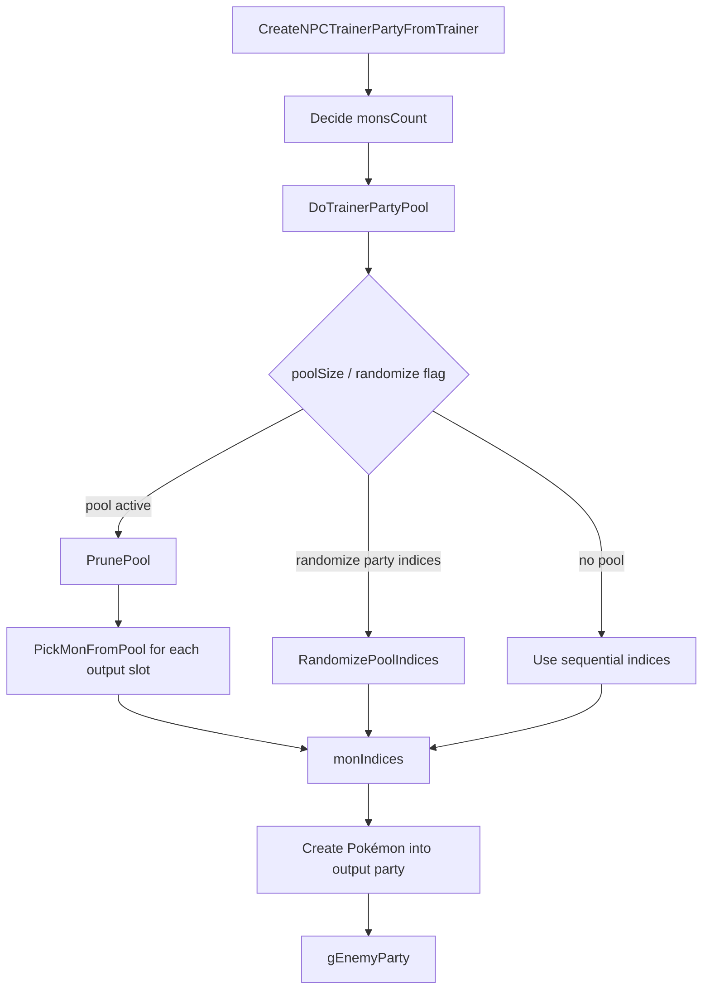

# Opponent Party Preview and Randomizer Investigation

調査日: 2026-05-01

この文書は、相手 party 表示、trainer party 並び替え、randomizer 風 party 生成に関係する既存機能を整理する。

## Purpose

将来、battle 前選出画面で相手 party を表示したり、trainer party に独自性を持たせたりする場合に、既存の Trainer Party Pools と enemy party 生成 flow を把握する。

現時点では実装しない。

## Confirmed Existing Trainer Party Pool System

確認した files:

| File | Important symbols / notes |
|---|---|
| `docs/tutorials/how_to_trainer_party_pool.md` | Trainer Party Pools の既存説明。`Party Size` と `.poolSize > .partySize` の扱い。 |
| `include/trainer_pools.h` | pool rule / pick function / prune option / tag 定義。 |
| `src/trainer_pools.c` | `DoTrainerPartyPool`、pool 選出、shuffle、tag / clause 処理。 |
| `src/data/battle_pool_rules.h` | pool ruleset 定義。 |
| `include/data.h` | `struct Trainer`, `struct TrainerMon` に pool 関連 field。 |
| `src/battle_main.c` | `CreateNPCTrainerPartyFromTrainer`, `CreateNPCTrainerParty` で pool を使って `gEnemyParty` を生成。 |
| `include/constants/battle_ai.h` | `AI_FLAG_RANDOMIZE_PARTY_INDICES`。 |
| `include/config/battle.h` | pool RNG / rule config。 |
| `tools/trainerproc/main.c` | trainer data DSL から `.poolRuleIndex`, `.poolPickIndex`, `.poolPruneIndex`, `.poolSize` などを出力。 |

## Trainer Data Fields

`include/data.h` で確認した `struct Trainer` の関連 field:

| Field | Meaning |
|---|---|
| `party` | `struct TrainerMon` 配列への pointer。 |
| `partySize` | 実際に battle へ出す数。 |
| `poolSize` | pool として参照できる候補数。 |
| `poolRuleIndex` | `src/data/battle_pool_rules.h` の ruleset。 |
| `poolPickIndex` | pick function set。 |
| `poolPruneIndex` | prune mode。 |
| `overrideTrainer` | 別 trainer data を override source にする。 |
| `aiFlags` | `AI_FLAG_RANDOMIZE_PARTY_INDICES` など。 |

`struct TrainerMon` には `tags` field があり、pool rule の tag 判定に使われる。

## Pool Rules / Tags

`include/trainer_pools.h` で確認した主な定義:

| Symbol | Role |
|---|---|
| `POOL_RULESET_BASIC` | 基本 ruleset。 |
| `POOL_RULESET_DOUBLES` | doubles 用 ruleset。 |
| `POOL_RULESET_WEATHER_SINGLES` | weather singles。 |
| `POOL_RULESET_WEATHER_DOUBLES` | weather doubles。 |
| `POOL_RULESET_SUPPORT_DOUBLES` | support doubles。 |
| `POOL_PICK_DEFAULT` | default pick functions。 |
| `POOL_PICK_LOWEST` | lower index priority pick。 |
| `POOL_PRUNE_NONE` | prune なし。 |
| `POOL_PRUNE_TEST` | test prune。 |
| `POOL_PRUNE_RANDOM_TAG` | random tag prune。 |
| `MON_POOL_TAG_LEAD` | lead tag。 |
| `MON_POOL_TAG_ACE` | ace tag。 |
| `MON_POOL_TAG_WEATHER_SETTER` | weather setter tag。 |
| `MON_POOL_TAG_WEATHER_ABUSER` | weather abuser tag。 |
| `MON_POOL_TAG_SUPPORT` | support tag。 |

`struct PoolRules` で確認した field:

- `speciesClause`
- `excludeForms`
- `itemClause`
- `itemClauseExclusions`
- `megaStoneClause`
- `zCrystalClause`
- `tagMaxMembers`
- `tagRequired`

## Party Pool Flow

`src/trainer_pools.c` / `src/battle_main.c` で確認した flow:

`CreateNPCTrainerPartyFromTrainer` は `DoTrainerPartyPool(trainer, monIndices, monsCount, battleTypeFlags)` を呼んだ後、`partyData[monIndex]` から実際の Pokémon を作成する。

## Pick Function Behavior

`src/trainer_pools.c` で確認した default pick:

| Function | Observed behavior |
|---|---|
| `DefaultLeadPickFunction` | party index 0 を Lead として選び、double battle では index 1 も Lead 扱い。 |
| `DefaultAcePickFunction` | last slot を Ace として選び、double battle では second-last も Ace 扱い。 |
| `DefaultOtherPickFunction` | Lead / Ace tag を避けて通常 slot を選ぶ。 |
| `PickLowest` | 条件を満たす低い index を選びやすい。 |

`RandomizePoolIndices` は party index の shuffle を行う。`AI_FLAG_RANDOMIZE_PARTY_INDICES` がある場合、poolSize 0 でも partySize を temporary pool として扱う path があることを確認した。

## Config

`include/config/battle.h` で確認した pool 関連 config:

| Config | Current value observed |
|---|---:|
| `B_POOL_SETTING_CONSISTENT_RNG` | `FALSE` |
| `B_POOL_SETTING_USE_FIXED_SEED` | `FALSE` |
| `B_POOL_SETTING_FIXED_SEED` | `0x1D4127` |
| `B_POOL_RULE_SPECIES_CLAUSE` | `FALSE` |
| `B_POOL_RULE_EXCLUDE_FORMS` | `FALSE` |
| `B_POOL_RULE_ITEM_CLAUSE` | `FALSE` |
| `B_POOL_RULES_USE_ITEM_EXCLUSIONS` | `FALSE` |
| `B_POOL_RULE_MEGA_STONE_CLAUSE` | `FALSE` |
| `B_POOL_RULE_Z_CRYSTAL_CLAUSE` | `FALSE` |

## Trainer Data DSL / Build Tool

`tools/trainerproc/main.c` で trainer data の以下の key を処理することを確認した。

| DSL key / behavior | Output field / notes |
|---|---|
| `Party Size` | `.partySize`。pool より小さくすると候補から一部を出す。 |
| `Pool Rules` | `.poolRuleIndex`。 |
| `Pool Pick Functions` | `.poolPickIndex`。 |
| `Pool Prune` | `.poolPruneIndex`。 |
| `Copy Pool` | `.overrideTrainer` など。 |

Randomizer 風の trainer party 並び替えは、既存の Trainer Party Pools と `AI_FLAG_RANDOMIZE_PARTY_INDICES` でかなり近いことが確認できた。

## Opponent Party Preview Timing

重要な確認点:

- `gEnemyParty` は通常、battle init 中に `src/battle_main.c` の `CreateNPCTrainerPartyFromTrainer` / `CreateNPCTrainerParty` を通じて作られる。
- そのため、field script 上で battle 前選出 UI を開く時点では、pool / randomize / override 反映済みの `gEnemyParty` がまだ存在しない可能性が高い。
- 相手 party preview を正確に表示するには、battle init より前に同じ生成結果を得る仕組みが必要になる。

候補はあるが未実装:

| Candidate | Pros | Risks |
|---|---|---|
| Battle 前に preview 専用で `CreateNPCTrainerParty` 相当を呼ぶ | 実際の party を表示しやすい | RNG 消費、`gEnemyParty` 汚染、battle init との二重生成。 |
| Pool 生成だけを non-mutating helper 化する | preview と battle 本番の整合性を取りやすい | 既存 code refactor が必要。 |
| Battle init 後に選出 UI を出す | `gEnemyParty` が確定後に表示できる | battle intro / controller / callback flow へ深く入るため高リスク。 |
| 最初は trainer data の static party を表示する | 実装が軽い | pool / random order / override を正確に反映できない。 |

現時点の判断: MVP では相手 party preview は除外し、party selection の安全な保存/復元を優先するのが安全。

## Party Order and Personality Note

`src/battle_main.c` の `CreateNPCTrainerPartyFromTrainer` では、pool で選ばれた `monIndex` を使って `partyData[monIndex]` から Pokémon を生成する。

一方、確認した範囲では personality hash 生成に `GeneratePartyHash(trainer, i)` のように output slot index `i` が使われている箇所がある。これは「pool 内の元 index」ではなく「実際に出力される slot」に依存する可能性がある。

この挙動が意図通りかは未確認。trainer party randomizer / preview の再現性に影響する可能性があるため、要追加調査。

## Relationship to Player Battle Selection

| Topic | Relationship |
|---|---|
| Player selection | `gPlayerParty` を一時的に 3/4 匹へ圧縮する話。 |
| Opponent pool | `gEnemyParty` を trainer data から生成・並び替える話。 |
| Preview UI | player selection UI に opponent generated party を表示する話。 |
| Randomizer-like originality | Trainer Party Pools / AI flag / trainerproc DSL で既に基礎がある。 |

これらは関係するが、同じ state に混ぜない方がよい。特に player party の復元と opponent party pool の RNG は分離して扱う必要がある。

## Open Questions

- Preview で表示する相手 party は、pool / randomize / override / difficulty / rematch を完全反映する必要があるか。
- Preview 専用生成で RNG を消費してよいか。`B_POOL_SETTING_CONSISTENT_RNG` が `FALSE` の場合の再現性をどう扱うか。
- `GeneratePartyHash(trainer, i)` が output slot 依存であることを仕様として扱ってよいか。
- Trainer Party Pools を通常 trainer 全体へ広げる場合、build tool `trainerproc` と data review の運用をどうするか。
- `AI_FLAG_RANDOMIZE_PARTY_INDICES` は battle AI flag に置かれているが、実質 trainer party generation flag として使われる。この命名を独自 docs でどう扱うか。
