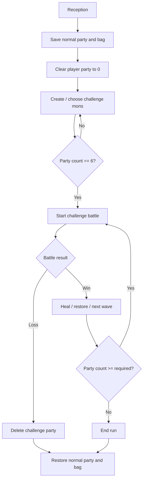

# Champions Challenge Investigation

調査日: 2026-05-04。現時点では実装なし。

## Source Investigation

| Area | Files / Symbols | Notes |
|---|---|---|
| Party snapshot | `src/load_save.c` `SavePlayerParty`, `LoadPlayerParty`; `include/load_save.h` | `gPlayerParty` と `gPlayerPartyCount` を save side buffer へ退避 / 復元する既存 pattern。 |
| Bag snapshot | `src/load_save.c` `SavePlayerBag`, `LoadPlayerBag`; `include/load_save.h` | `gLoadedSaveData.bag` / mail と `gSaveBlock1Ptr->bag` を入れ替える。通信や Pyramid に近い用途がある。 |
| Bag layout | `include/global.h` `struct Bag`; `include/constants/global.h` `BAG_*_COUNT` | 通常 bag は SaveBlock1 layout。専用 bag を増やすなら save compatibility を見る。 |
| Pyramid bag | `include/global.h` `struct PyramidBag`; `include/battle_pyramid_bag.h`; `src/battle_pyramid_bag.c` | `frontier.pyramidBag` は level mode 別の小型 bag。通常 bag 退避とは別の「施設内 inventory」として参考になる。 |
| Pyramid held items | `src/battle_pyramid_bag.c` `TryStoreHeldItemsInPyramidBag` | 選出 party の持ち物を Pyramid bag へ移し、持ち物を空にする。容量不足時は rollback する。 |
| Pyramid script | `data/maps/BattleFrontier_BattlePyramidLobby/scripts.inc` | 受付で bag を預かり、held item を Pyramid bag へ移す script flow がある。 |
| Entry eligibility | `src/party_menu.c` `GetBattleEntryEligibility`, `CheckBattleEntriesAndGetMessage` | egg、level cap、Pyramid held item、Frontier ban、duplicate species/item を見る。 |
| Frontier precheck | `src/frontier_util.c` `CheckPartyIneligibility`, `AppendIfValid` | `isFrontierBanned`、Lv.50 上限、species/item duplicate、Pyramid no-held-item を見る。 |
| Species ban data | `include/pokemon.h` `isFrontierBanned`; `src/data/pokemon/species_info/*` | 既存 ban は species data field。Champions 側は rule id で使う / 使わないを切り替えたい。 |
| Level 50 | `docs/flows/battle_frontier_level_scaling_flow_v15.md` | 現行 Frontier Lv.50 は player を Lv.50 に引き上げない。battle-only scaling が必要。 |
| EXP flow | `src/battle_util.c` fainted action -> `BattleScript_GiveExp`; `src/battle_script_commands.c` EXP commands | EXP 無効化は battle rule として、EXP 分配前に止める hook が必要。 |
| Release / compact | `src/pokemon_storage_system.c` `PurgeMonOrBoxMon`, `CompactPartySlots`; `src/pokemon.c` `ZeroMonData` | PC release UI helper は static が多い。挑戦終了時の削除は専用 helper が必要。 |
| Aftercare | `src/battle_setup.c` `CB2_EndTrainerBattle`; `docs/features/trainer_battle_aftercare/` | 勝敗後の party restore、release、heal、whiteout 制御の入口。 |
| Scout / create mon | `docs/overview/scout_selection_and_battlefield_status_v15.md`; `src/script_pokemon_util.c` `ScriptGiveMonParameterized` | 6 匹作成 flow は既存 gift mon path と専用 candidate UI の組み合わせが候補。 |

## Existing Bag Mechanics

通常 bag の退避 / 復元は `LoadPlayerBag` / `SavePlayerBag` が入口になる。

重要な点:

- `LoadPlayerBag` は `gSaveBlock1Ptr->bag` を `gLoadedSaveData.bag` へ退避する。
- `SavePlayerBag` は `gLoadedSaveData.bag` を `gSaveBlock1Ptr->bag` へ戻す。
- mail と encryption key も絡むため、単純な `memcpy` だけを新規箇所に散らさない。

Battle Pyramid には、通常 bag そのものとは別に `struct PyramidBag` がある。`TryStoreHeldItemsInPyramidBag` は party held item を Pyramid bag に入れ、成功時に party の held item を `ITEM_NONE` へする。失敗時は Pyramid bag 側を rollback する。

Champions Challenge で使いたい bag mode:

| Mode | Behavior |
|---|---|
| `CHALLENGE_BAG_NONE` | 通常 bag を使わせない。battle bag UI もなし。 |
| `CHALLENGE_BAG_EMPTY` | 通常 bag を退避し、空の challenge bag から開始。 |
| `CHALLENGE_BAG_PYRAMID_STYLE` | Pyramid bag のような小容量 inventory を持つ。 |

MVP は `CHALLENGE_BAG_EMPTY` が分かりやすい。既存 Pyramid bag は Frontier state と結びついているため、直接流用より専用 challenge bag を検討する。

## Entry Eligibility

既存 rule は用途ごとに混ざっている。

`src/party_menu.c` の choose-half eligibility:

- egg は不可。
- level cap 超過は不可。
- Battle Pyramid lobby では held item 持ちを不可。
- `FACILITY_MULTI_OR_EREADER` は HP 0 を不可。
- default Battle Frontier は `gSpeciesInfo[species].isFrontierBanned` を見る。
- validation では duplicate species / duplicate held item も見る。

`src/frontier_util.c` の precheck:

- `SPECIES_EGG` / `SPECIES_NONE` は不可。
- `isFrontierBanned` は不可。
- Lv.50 course では Lv.50 超過を不可。
- species duplicate / held item duplicate を不可。
- Pyramid では held item 持ちを不可。

Champions Challenge の基本 rule は、これより緩くする。

| Rule id | Meaning |
|---|---|
| `CHALLENGE_ELIGIBILITY_EGG_ONLY_BAN` | egg だけ不可。species ban、duplicate、held item duplicate は見ない。 |
| `CHALLENGE_ELIGIBILITY_FRONTIER_BAN` | egg + `isFrontierBanned` を不可。duplicate は別 flag。 |
| `CHALLENGE_ELIGIBILITY_CUSTOM_TABLE` | 独自 ban table / whitelist を見る。 |

## Party Lifecycle

通常 party と挑戦 party は分ける。

MVP では「挑戦 party は通常 save party へ戻さない」。勝利で残った Pokemon も施設外へ持ち出さない方針にする。持ち出し報酬を作る場合は別 rule として明示する。

## Level / EXP

`FRONTIER_LVL_50` は低レベルの player Pokemon を Lv.50 化しない。Champions Challenge では battle-only Lv.50 scaling を別途設計する。

推奨:

- actual `MON_DATA_LEVEL` / EXP は変更しない。
- battle mon 作成時、または battle 開始直前の challenge-only hook で effective level / stats を Lv.50 にする。
- battle 後に actual EXP / level は変化しない。
- EXP command は challenge rule `disableExp` で無効化する。

## Battle Menu / UI

Champions 風にする場合でも、MVP は通常 battle menu を維持する。先に game rule を固める。

後続候補:

- battle 前の challenge menu: 編成、スカウト、編集、次へ進む、リタイア。
- battle 中 menu skin: 通常 battle menu と別 palette / window template。
- party summary: 挑戦 party count / streak / held item lock を表示。
- bag entry: `bagMode` に応じて通常 bag、challenge bag、使用不可を切り替える。

## Separate Follow-up Investigations

以下は Champions Challenge MVP から切り出して、別件 docs / task として扱う。

| Topic | Why separate | Suggested doc target |
|---|---|---|
| Challenge state の保存先 | SaveBlock1/2 は余白が小さく、SaveBlock3 も config 依存。run seed / streak / roster index / bag state を保存するなら migration 方針込みで決める。 | `docs/flows/save_data_flow_v15.md` |
| Challenge bag の永続化 | no bag / empty bag / Pyramid-style bag で必要 state が変わる。通常 bag snapshot と mail / encryption key の扱いも絡む。 | `docs/features/champions_challenge/risks.md` |
| Battle-only Lv.50 scaling | Frontier Lv.50 は低レベルを引き上げないため、battle mon stats だけを Lv.50 化する専用 hook が必要。 | `docs/flows/battle_frontier_level_scaling_flow_v15.md` |
| EXP suppression | EXP command chain のどこで止めるかを battle rule として設計する必要がある。level / move learn / evolution aftercare と分けて確認する。 | `docs/features/trainer_battle_aftercare/` |
| Generated opponent roster / partygen | 通常 trainer ID を大量追加せず、既存 trainer slot / virtual trainer / roster index のどれを使うかを先に決める。 | `docs/features/battle_selection/opponent_party_and_randomizer.md` |
| Training / scout UI | 6 匹作成の core rule とは別に、candidate UI、summary、編集許可、held item lock の UX が必要。 | `docs/overview/scout_selection_and_battlefield_status_v15.md` |

## Open Questions

- challenge state は SaveBlock3 に置くか、Frontier state 近くに置くか。
- challenge bag を SaveBlock に永続化するか、run 中だけの EWRAM state にするか。
- random 6 匹と NPC 作成 6 匹を同じ candidate generator で扱うか。
- battle loss 以外のリタイア時に Pokemon / item をどう扱うか。
