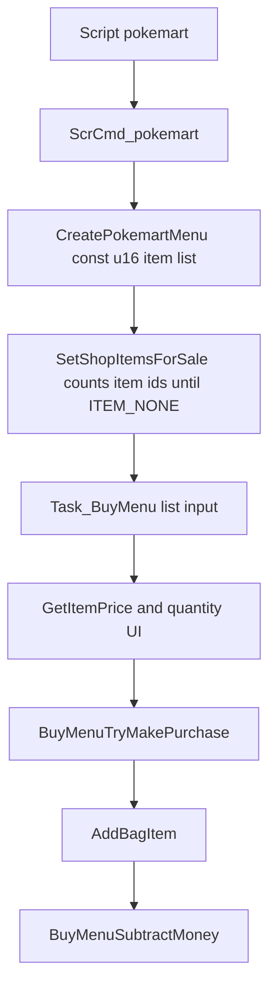
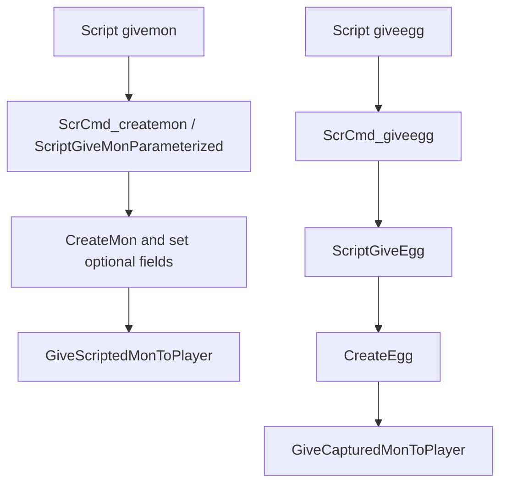

# Friendly Shop Pokemon Vendor Investigation

## Document Metadata

| Field | Value |
|---|---|
| Last reviewed | 2026-05-22 |
| Baseline | `master` `2bb16c85b311`; upstream `expansion/1.15.2-86-g2bb16c85b3` |
| Code status | Docs-only investigation |
| Provenance | Local project overlay |

## Existing Files

| File | Symbols | Notes |
|---|---|---|
| `include/shop.h` | `CreatePokemartMenu`, `CreateDecorationShop1Menu`, `CreateDecorationShop2Menu` | Public shop API accepts `const u16 *itemsForSale`; it has no product metadata type. |
| `src/shop.c` | `struct MartInfo`, `SetShopItemsForSale`, `BuyMenuBuildListMenuTemplate`, `Task_BuyMenu`, `BuyMenuTryMakePurchase`, `BuyMenuSubtractMoney`, `CreatePokemartMenu` | Normal mart products are item ids. Purchase success for normal marts calls `AddBagItem(tItemId, tItemCount)`. |
| `src/scrcmd.c` | `ScrCmd_pokemart`, `ScrCmd_giveegg` | `pokemart` reads a pointer and opens shop UI. `giveegg` delegates to `ScriptGiveEgg`. |
| `asm/macros/event.inc` | `pokemart`, `pokemartlistend`, `givemon`, `giveegg` | Script macros already cover item shops and direct gift Pokemon / Eggs, but not a shop-priced Pokemon product table. |
| `src/script_pokemon_util.c` | `ScriptGiveEgg`, `ScriptGiveMon`, `ScriptGiveMonParameterized` | Existing gift flow can create Pokemon with configurable species, level, item, ball, nature, ability, EVs, IVs, moves, shiny, Gmax, Tera, and Dmax through the parameterized path. |
| `include/daycare.h` / `src/daycare.c` | `CreateEgg` | Egg creation uses `EGG_HATCH_LEVEL`, sets `MON_DATA_IS_EGG`, stores species egg cycles in `MON_DATA_FRIENDSHIP`, and sets special egg met data. |
| `src/egg_hatch.c` | `AddHatchedMonToParty` | Hatch finalization clears egg state, sets nickname / dex flags / met data, restores PP, and recalculates stats. |
| `include/pokemon.h` | `struct PokemonSubstruct3`, `unused_0B`, `isShadow`, `modernFatefulEncounter` | `unused_0B` is a one-bit candidate for a persistent vendor sealed-origin marker. `isShadow` exists and matches the Shadow Pokemon inspiration, but should not be reused unless the implementation intentionally adopts a full Shadow/Purification ruleset. `modernFatefulEncounter` already has event / obedience semantics and should not be reused casually. |
| `src/egg_hatch.c` | `CreateHatchedMon` | Hatch creation copies `MON_DATA_MARKINGS`, `MON_DATA_MODERN_FATEFUL_ENCOUNTER`, Pokerus, ball, IVs, moves, and other data from the Egg into the hatched Pokemon. A new sealed-origin bit must be copied here too if literal Egg internals are used. |
| `src/pokemon_summary_screen.c` | `PrintMonTrainerMemo`, `PrintEggMemo`, summary cached met data | Summary already has separate memo paths for Eggs and hatched Pokemon. Vendor sealed-origin display should hook here or in a nearby badge/text renderer. |
| `src/battle_setup.c` | `CB2_EndTrainerBattle` | Trainer-win progress could hook here, but this function is shared by many battle variants and already coordinates Pyramid / Trainer Hill / follower / no-whiteout flows. |
| `src/field_specials.c` | `GiveFrontierBattlePoints`, `GetFrontierBattlePoints`, `TakeFrontierBattlePoints` | Existing BP is stored at `gSaveBlock2Ptr->frontier.battlePoints`. It is available, but not required by this feature. |
| `docs/flows/save_data_flow_v15.md` | SaveBlock / flag / var policy | Saved vars are scarce; new persistent product state should prefer a compact dedicated struct if it grows past a few flags. |
| `docs/features/unified_move_relearner/` | Unified move candidate flow | Candidate for move editing / relearn policy after purchase or hatch. Runtime branch exists, but not on `master`. |
| `docs/features/pokemon_state_editor/` | Summary-launched editor | Candidate UI for free move / item / stats edits after entitlement checks. Runtime branch exists, but not on `master`. |
| `docs/features/nonconsumable_held_items/` | Held item ownership policy | Relevant if purchased Pokemon can freely change held items from a unique-token catalog. |

## Existing Shop Flow



The current shop code is not just a generic price list. Product identity,
display name, description, icon, quantity, sold-out handling, and final delivery
all assume item ids. A Pokemon vendor should therefore either add a new mart type
with a different product table or implement a sibling menu that reuses the same
window style.

## Existing Gift Pokemon / Egg Flow



The parameterized `givemon` macro is the best existing model for product
payload. It can already specify level, held item, ball, nature, ability, EVs,
IVs, moves, and several modern mechanics. The plain `ScriptGiveMon()` helper is
simpler but creates a random Pokemon with a level and optional held item only.

Egg creation currently uses species egg cycles for step-based hatching. If this
feature adds non-step unlock progress, that state should not reuse
`MON_DATA_FRIENDSHIP`, because it already has hatch-cycle meaning while the
Pokemon is still an Egg.

Literal Egg flow is useful as an implementation reference, but the requested
gameplay is broader than breeding Eggs. A vendor sealed product may resolve into
final evolutions or legendary Pokemon. That means the player-facing UI should be
able to call the thing "LOCKED", "sealed", or another neutral term even if the
runtime borrows the existing Egg non-battle behavior.

## Product State Dependencies

| Requirement | Existing support | Gap |
|---|---|---|
| Repeat purchase | Existing shop item path supports repeated buys | Pokemon delivery path is missing. |
| One-time purchase | Event flags can guard one-time products | Product table needs a per-product flag id or a hide/sold-out policy. |
| Normal Pokemon purchase | `ScriptGiveMonParameterized` can create the Pokemon | Needs money check and product table integration. |
| Sealed purchase | `CreateEgg` / `ScriptGiveEgg` can create a literal Egg; custom locked-mon creation may fit better | Needs price, one-time state, optional product metadata, and progress state. |
| Party-slot risk | Eggs already cannot battle; a custom lock would need equivalent battle exclusion | Vendor should require party slot for locked products if the risk is core to balance. |
| Hatch / unlock reward | Existing egg hatching handles steps | Battle-win / clear-based unlock needs new state and hook. Custom unlock may avoid misleading Egg flavor for legendary / final species. |
| Move editing in selected areas | Existing relearner / editor branches can be reused later | Needs an entitlement check that distinguishes normal vendor Pokemon from sealed-origin Pokemon. |
| Sealed-origin always-editable policy | No direct persistent origin flag confirmed | Needs a per-mon origin strategy, product registry, or challenge-local entitlement. |
| Summary-visible sealed origin | Summary can print met / memo text and existing icons | Needs locked-state and unlocked-origin labels that do not look like ordinary daycare Egg text. |

## Literal Egg vs Sealed Recruit

| Model | Pros | Cons |
|---|---|---|
| Literal Egg backed by `MON_DATA_IS_EGG` | Reuses existing non-battle behavior, party slot pressure, Summary egg page, and hatch flow. | The UI implies biological breeding; final evolutions / legendaries hatching from Eggs may feel wrong unless text is overridden. Step cycles conflict with separate unlock progress. |
| Sealed recruit backed by a custom lock bit | Matches final evolutions, legendaries, and "still locked" UI better. Can unlock by battle wins / challenge clears without pretending to be daycare. | Requires custom party-menu, Summary, battle eligibility, and unlock handling. More source impact. |
| Hybrid: use Egg mechanics internally but override product / Summary language | Fastest path to party-slot risk and no-battle behavior. | Needs careful Summary text and marker handling so players understand it is a sealed recruit, not an ordinary daycare Egg. |

Current recommendation: design data and UI around "sealed recruit". The runtime
branch may still use `MON_DATA_IS_EGG` internally for the first proof if that is
the fastest safe route, but player-facing text should be lock/seal based.

## Shadow-Like Bond Progress

The requested feel is closer to Shadow Pokemon purification than ordinary Egg
hatching:

- the Pokemon is present in the party;
- it cannot be used normally while locked;
- keeping it with the player creates risk because one party slot is unavailable;
- battle wins / challenge clears / script events add bond or seal EXP;
- when the threshold is reached, the lock releases and the Pokemon becomes
  usable;
- after release, the Pokemon receives the sealed-origin Summary marker and
  always-available Status Editor entitlement.
- release does not enable evolution. In this game, all Pokemon are fixed
  species products.

Implementation should not use the existing `isShadow` bit as a shortcut in the
MVP. Shadow state can carry battle, ribbon, purification, move-lock, or future
compatibility meaning. Use new sealed-recruit helpers first, and treat Shadow
Pokemon as inspiration only.

Bond / seal EXP should also be separate from normal `MON_DATA_EXP` by default.
Reasons:

- locked recruits cannot battle, so normal EXP gain rules would need special
  casing anyway;
- normal EXP changes level and can accidentally reach vanilla evolution paths;
- challenge Lv.50 policy may want battle-only scaling rather than permanent
  level changes;
- product-specific thresholds are easier if the progress value is feature-owned.

A later runtime branch may choose to award bond EXP equal to the EXP a Pokemon
would have earned, but the stored value should remain a feature-owned progress
counter unless explicitly redesigned.

## Bond EXP Threshold Inputs

Usage rate is useful, but it should not be the primary threshold source. Some
Pokemon will have no usage signal because they are absent from trainer pools,
not yet generated by partygen, new to the product catalog, or intentionally rare.
Treating missing usage as "unknown and expensive" would make those Pokemon too
hard to release; treating it as zero would make them too cheap.

Recommended priority:

| Priority | Source | Use |
|---|---|---|
| 1 | Product override | Explicit `bondExpThreshold` wins for hand-tuned shop products. |
| 2 | Manual species tier | Base value from species strength / rarity / fixed form / restricted or legendary status. |
| 3 | Usage modifier | Optional multiplier from observed usage, only when data is available and reliable. |
| 4 | Missing usage fallback | Neutral multiplier from species tier or family prior; never a penalty by itself. |
| 5 | EXP table curve | Last resort only, as a small clamped multiplier when no better balancing signal exists. |

Suggested automatic shape:

```text
threshold = clamp(baseTierThreshold * usageMultiplier * productMultiplier,
                  minThreshold,
                  maxThreshold)
```

If species EXP tables are referenced, treat them as the last resort and use them
only for a small curve multiplier. Do not use cumulative EXP values directly.
Raw values in the hundreds of thousands, such as 600,000, are unfair as lock
thresholds and will make the feature feel like grinding rather than a
risk/reward recruit system.

Safer EXP-table reference:

```text
growthCurveMultiplier =
    clamp(expToReferenceLevel(species.growthRate)
          / expToReferenceLevel(MEDIUM_FAST),
          0.85,
          1.15)

threshold = clamp(baseTierThreshold
                  * growthCurveMultiplier
                  * usageMultiplier
                  * productMultiplier,
                  minThreshold,
                  maxThreshold)
```

The reference level should be a small design constant such as Lv.30 or Lv.50.
The result is still bond EXP, not normal Pokemon EXP.

Because sealed recruits will have many exceptions, the formula must be advisory.
Every product needs an absolute override path. A safer practical formula is
additive and banded, not a pure multiplier stack:

```text
if product.bondExpThresholdOverride exists:
    threshold = product.bondExpThresholdOverride
else:
    threshold = clamp(roundToStep(
        tierBase
      + usageDelta
      + curveDelta
      + productDelta,
      step = 25),
      minThreshold,
      maxThreshold)
```

Recommended default deltas:

| Input | Value | Notes |
|---|---|---|
| Missing usage | `0` | Missing data should not move the threshold. |
| Low confirmed usage | `-25` | Slightly easier, not free. |
| High usage | `+25` | Noticeably longer, still bounded. |
| Top usage | `+50` | Only with strong evidence. |
| EXP curve last resort | `-10` to `+10` | Tiny adjustment only. |
| Product exception | Any explicit value | Used for story rewards, special prizes, favorites, or known outliers. |

Recommended tier bases:

| Tier | Base |
|---|---|
| Low | `75` |
| Standard | `125` |
| Strong | `175` |
| Restricted | `250` |

These numbers are placeholders for playtesting, but the shape is intentional:
manual tier is the main input, usage can nudge, EXP curve barely moves the
result, and product override is always allowed.

The usage multiplier should be smoothed, not raw:

```text
smoothedUsage = (observedUses + priorWeight * tierPriorUsage)
              / (observedTotal + priorWeight)
```

Practical banding is safer than exact percentages:

| Usage band | Multiplier | Notes |
|---|---|---|
| Missing / insufficient data | `1.00` | Use species tier only. |
| Low confirmed usage | `0.85` | Can make underused Pokemon a little easier. |
| Normal usage | `1.00` | No change. |
| High usage | `1.20` | Popular / efficient Pokemon take longer to release. |
| Top / meta usage | `1.40` | Only for strong evidence, not for missing data. |

Species tier should cover the cases usage cannot:

| Tier | Example basis | Threshold direction |
|---|---|---|
| Low | low BST, niche utility, intentionally easy product | Low threshold. |
| Standard | ordinary product species | Medium threshold. |
| Strong | high BST final forms, strong abilities, broad movepool | High threshold. |
| Restricted | legendary, mythical, Frontier-banned, special product | Highest threshold or explicit override. |

MVP recommendation: store explicit thresholds in product data. Add automatic
threshold generation only after a small product set feels correct in play.

## Global No-Evolution Policy

The current game direction does not need Pokemon evolution. Treat every Pokemon
as a fixed species:

- no evolution while a recruit is locked;
- no evolution after release;
- no ordinary Pokemon evolution outside this vendor feature either;
- no forced evolution from level-up, Rare Candy, EXP Candy, item, trade,
  friendship, move knowledge, map condition, script trigger, overworld special,
  or battle-end special;
- evolution stones should reject or no-op with a clear fixed-species message;
- if both a base form and a final form should be obtainable, they are separate
  products with separate prices, thresholds, reveal policy, and edit policy.

Implementation should not rely on "this species has no evolution data" as the
guard. A global evolution-disabled runtime rule should short-circuit the
central evolution resolver so future products cannot accidentally evolve when
regular EXP / item / trade / script flows are used later.

## Vendor Sealed-Origin Marker Options

| Option | Fit | Notes |
|---|---|---|
| Promote `PokemonSubstruct3.unused_0B` to a named sealed-origin bit | Best candidate | Does not grow Pokemon or SaveBlock data. Must add `MON_DATA_VENDOR_SEALED_ORIGIN`, set it on purchased sealed products, preserve it through hatch / unlock resolution, and clear it for normal Pokemon creation. |
| `MON_DATA_MODERN_FATEFUL_ENCOUNTER` | Poor fit | Hatch code already preserves it, but it has event / obedience / trade semantics and is not vendor-specific. |
| `MON_DATA_MARKINGS` | Poor fit | Visible, but player-editable and already used for marking Pokemon. It would be easy to spoof or accidentally clear. |
| Met location / met level | Poor fit | Hatch path sets met level to 0 and overwrites met location with the current map section. Ordinary Eggs also use hatch memo behavior. |
| Ribbon bit | Poor fit | Consumes a visible achievement/event field and can collide with actual ribbon behavior. |
| SaveBlock side table | Possible but fragile | Can store product progress, but tying identity to a Pokemon across party/box/trade/release is harder than a per-mon bit. |

Current recommendation: use a per-mon bit for entitlement identity and a small
separate runtime/save table only for product progress or unlock counters.

## Locked Vendor UI

Vendor rows should support at least three states:

| State | Purchase behavior | Display behavior |
|---|---|---|
| Available | Can be bought if money and capacity checks pass. | Show species/product label, price, and repeat/one-time status. |
| Locked | Cannot be bought yet. | Show `LOCKED`, `Still locked`, or a short condition hint. Species may be hidden as `????` or shown as a preview depending on product policy. |
| Sold out | Cannot be bought again because one-time flag was consumed. | Hide row or show `SOLD OUT`; choose one policy per vendor. |

This lock state is separate from the carried sealed recruit. A product can be
locked in the shop before purchase, and a purchased sealed recruit can still be
locked in the party until its progress condition is satisfied.

## Carried Sealed Recruit UI

| State | Battle behavior | Summary behavior |
|---|---|---|
| Locked / sealed | Cannot be selected as a battler; occupies a party slot. | Show `LOCKED`, species or `????` according to reveal policy, and bond / seal EXP progress. |
| Ready to release | Still blocked until the unlock event is confirmed. | Show a clear ready state, e.g. `READY`, `Bond full`, or `The seal can be released`. |
| Released | Usable as a normal Pokemon. | Show sealed-origin marker and allow Status Editor anywhere. |

## Reward Currency Decision

BP is a usable reference, not a hard dependency. `gSaveBlock2Ptr->frontier.battlePoints`
already exists and has script specials, but tying sealed unlock to Frontier BP would
couple this feature to Battle Frontier economy and UI. The safer design is:

- define a feature-local `sealedProgress` / `bondExp` /
  `recruitUnlockPoints` concept;
- decide per product whether progress comes from trainer wins, challenge clears,
  script events, steps, or another source;
- optionally convert that progress into BP-like rewards in a later balancing
  pass.

## Source-Wide Impact Check

| Check | Result / notes |
|---|---|
| Constants / IDs | Likely needs a script command id or native call entry, product kind enum, and optional config constants. |
| Primary data table | Needs a Pokemon product table, not a `u16` item list. |
| Runtime entry point | Needs a new `CreatePokemonVendorMenu` style entry or a new shop mart type. |
| Script command / special | Needs `pokemartmon` / `pokemonvendor` macro or a `special` wrapper that receives product table pointer. |
| Callback / task | Needs shop-like task flow for list input, confirmation, purchase finalization, and script resume. |
| Save / runtime state | One-time flags can use event flags. Locked row state, bond / seal EXP progress, and per-mon entitlement likely need dedicated state if not purely script-local. |
| UI / window / sprite / text | Can reuse shop windows first. Product description should show species, level, product type, repeat/one-time/locked state, and price. Summary also needs locked, ready-to-release, bond progress, and sealed-origin labels for marked Pokemon. |
| Battle / AI | Sealed progress on battle wins touches battle-end flow. Avoid a global hook until the product policy is finalized. |
| Evolution | The runtime can globally disable all evolution triggers. |
| Build tools / generated files | Not required for MVP unless product pools are generated from partygen JSON later. |
| Tests | Needs shop purchase tests, party-full tests, one-time flag tests, and focused sealed / bond progress tests. |
| Upstream migration | Shop internals and script command table are high-conflict areas during upstream refreshes. |

## Current Spec Dependency Audit

This pass assumes the current design:

- Friendly Shop style vendor sells normal Pokemon and sealed recruits.
- Sealed recruits are not ordinary daycare Eggs in player-facing behavior.
- Sealed recruits may be final evolutions, legendaries, Clefairy, or any
  explicit product species.
- Locked recruits occupy a party slot and cannot battle.
- Unlock uses feature-owned bond / seal EXP, not raw `MON_DATA_EXP`.
- Evolution is globally unnecessary for this game; all Pokemon are fixed
  species products.
- After release, sealed-origin Pokemon can use the Status Editor anywhere and
  must be identifiable from Summary.

| Area | Files / symbols | Dependency | Recommended handling |
|---|---|---|---|
| Shop entry | `include/shop.h`, `src/shop.c`, `src/scrcmd.c`, `data/script_cmd_table.inc`, `asm/macros/event.inc` | Normal mart data is `const u16 *` item ids and normal purchase ends in `AddBagItem()`. | Add a sibling Pokemon vendor command / menu or a new mart type with product metadata. Do not overload normal `pokemart` item lists. |
| Product data | New product table, map `.inc` scripts | Needs species, price, repeat / one-time flags, lock state, reveal policy, product kind, level, fixed-species policy, bond threshold, and yield policy. | Keep tables compiled first. Generated partygen / JSON pools can feed these later, but MVP should be readable and hand-tuned. |
| Normal Pokemon delivery | `src/script_pokemon_util.c` `ScriptGiveMonParameterized` | Existing gift path already supports level, item, ball, nature, ability, EVs, IVs, moves, shiny, Gmax, Tera, and Dmax. | Reuse this payload shape for normal products. Subtract money only after delivery succeeds. |
| Sealed recruit delivery | `src/script_pokemon_util.c` `ScriptGiveEgg`, `src/daycare.c` `CreateEgg`, `src/egg_hatch.c` `CreateHatchedMon` | Literal Egg path gives non-battle behavior for free, but uses hatch cycles in friendship and daycare Egg UI semantics. | Prefer a custom sealed-recruit creator for the real feature. Literal Egg internals are acceptable only for a proof, with clear migration notes. |
| Per-mon origin | `include/pokemon.h` `PokemonSubstruct3.unused_0B`, `src/pokemon.c` `GetBoxMonData3` / `SetBoxMonData` | The always-editable entitlement needs to follow the individual Pokemon, not just the product flag. | Promote `unused_0B` to a named `MON_DATA_VENDOR_SEALED_ORIGIN` bit if still unused. Add getter / setter and preserve it through unlock / hatch conversion. |
| Lock and progress state | `docs/flows/save_data_flow_v15.md`, `include/global.h`, event flags / vars | A one-bit origin marker cannot store bond progress, threshold, product id, or ready state. Saved vars are too scarce for per-mon progress. | Use flags only for one-time products and simple row unlocks. Use a compact feature-owned state table for locked recruit progress if progress must survive save/load. |
| Party slot risk | `src/party_menu.c`, `src/pokemon_storage_system.c` `CountPartyNonEggMons`, battle choose flows | Existing "usable Pokemon" checks mostly test `MON_DATA_IS_EGG`; a custom lock bit will not be excluded automatically. | Add central helpers such as `IsVendorSealedRecruitLocked()` and use them in party and battle eligibility paths before widening the feature. |
| Battle exclusion | `src/battle_script_commands.c`, `src/battle_util.c`, `src/battle_ai_util.c`, `src/party_menu.c` | EXP, switch, forced send-out, choose-half, last-alive, and AI checks contain many egg-only conditions. | First runtime slice should validate normal battle, in-battle party menu, choose-half, and last-usable-mon behavior. Avoid scattered one-off checks. |
| Global evolution lock | `src/pokemon.c` `GetEvolutionTargetSpecies`, `IsMonPastEvolutionLevel`, script-trigger / overworld evolution helpers, `src/party_menu.c` Rare Candy / stone paths, `src/trade.c` trade evolution path | Evolution modes are centralized through `GetEvolutionTargetSpecies()`, but item UI, Rare Candy flow, trade, and script-trigger messages live outside that resolver. | Add an early runtime-rule guard in `GetEvolutionTargetSpecies()` that returns `SPECIES_NONE` for all Pokemon. Add party-menu messaging for stone / item attempts so fixed-species behavior is clear. |
| Item / form change | `src/party_menu.c` item callbacks, `src/pokemon.c` form helpers | Global no-evolution does not automatically answer whether form-change items are allowed. | Decide separately whether form changes are gameplay customization or evolution-like progression. If not allowed, route them through the same fixed-species rejection message. |
| Summary UX | `src/pokemon_summary_screen.c` cached summary data, Egg memo / page limit paths | Locked state, ready state, progress, and released origin marker all need Summary display. Literal Eggs would trigger Egg-specific memo limits. | Add sealed fields to Summary state and draw a dedicated `LOCKED` / `READY` / `Sealed Origin` label instead of relying on hatch memo text. |
| Status Editor entitlement | `docs/features/pokemon_state_editor/`, Summary / party entry points | Runtime editor branch is separate from `master`; entitlement must not be inferred from species or product flags. | Add policy helpers now; wire UI only when the editor branch is selected for integration. Locked recruits should reject editor entry. |
| Move relearn / item edits | `docs/features/unified_move_relearner/`, `src/party_menu.c` relearner menu entries | Sealed-origin Pokemon should eventually edit anywhere, normal purchased Pokemon remain area-gated. | Keep the vendor helper as the authority: `CanUseStateEditorAnywhere(mon)` / `IsVendorSealedOriginMon(mon)`. |
| Progress source | `src/battle_setup.c` `CB2_EndTrainerBattle`, `data/battle_scripts_1.s` `BattleScript_GiveExp`, script specials | Trainer-battle end is broad and includes Frontier / Trainer Hill / no-whiteout / forfeit behavior. EXP script is normal level EXP, not bond EXP. | MVP should prefer script-driven or challenge-clear progress. If trainer wins are used, add a narrow helper with battle-type guards and write only bond EXP. |
| PC / daycare / trade | `src/pokemon_storage_system.c`, `src/daycare.c`, `src/party_menu.c` daycare actions, `src/trade.c` `CanTradeSelectedMon` / `ComputePartyTradeableFlags` | If locked recruits can leave the party, progress identity and party-slot risk become more complex. Eggs are already special-cased in some flows; custom sealed locks are not. | MVP recommendation: block PC storage, daycare deposit, and trade for locked recruits. Allowing storage later requires identity-keyed progress state and cleanup rules. |
| Save compatibility | `include/global.h`, `src/save.c`, `src/load_save.c`, `docs/flows/save_data_flow_v15.md` | SaveBlock3 is small and may be pressured by DexNav species data; SaveBlock1 changes interact with Champions Challenge / bag work. | Do a capacity check before source work. A tiny party-only state can be smaller, but PC-persistent progress likely belongs in a dedicated SaveBlock1 feature struct. |

## Central Helper Contract

The implementation should introduce one small helper surface before touching
every menu:

| Helper | Purpose |
|---|---|
| `IsVendorSealedOriginMon(mon)` | True for any Pokemon created from a vendor sealed product after the origin marker is set. |
| `IsVendorSealedRecruitLocked(mon)` | True while the recruit is still locked and should not battle or edit. |
| `CanVendorSealedRecruitBattle(mon)` | False for locked recruits; true for released or non-vendor Pokemon. |
| `AreRuntimeEvolutionsDisabled()` / `CanPokemonEvolveInThisRuntime(mon)` | Global rule for the no-evolution game mode; expected to block every Pokemon, not only vendor recruits. |
| `GetVendorSealedBondProgress(mon, outCurrent, outRequired)` | Summary / party UI progress source. |
| `CanReleaseVendorSealedRecruit(mon)` | True when bond progress reaches the threshold. |
| `CanUseStateEditorAnywhere(mon)` | True only for released sealed-origin Pokemon. |

First adopters should be delivery, Summary, party selection, battle selection,
and `GetEvolutionTargetSpecies()`. Storage / daycare / trade can then block
locked recruits through the same helper instead of inventing local rules.

## Current Implementation Recommendation

For the next runtime branch, use this dependency order:

1. Add product data and vendor entry without changing normal item shops.
2. Add sealed-origin mon-data bit and helper header / C file.
3. Add progress state decision before allowing locked recruits into PC storage.
4. Deliver sealed recruits into party only, then block battle / editor entry.
5. Add Summary locked / ready / released labels and bond progress.
6. Add the global no-evolution guard through `GetEvolutionTargetSpecies()` and
   add item-use messaging for fixed-species failures.
7. Add the first progress source, preferably script / challenge-clear based.
8. Wire Status Editor / relearner entitlement after the editor branch is the
   active implementation target.

This keeps the first implementation small enough to validate while avoiding the
biggest dependency trap: a locked custom recruit that behaves like an Egg in
some menus but like a normal Pokemon in battle or storage paths, while vanilla
evolution remains reachable elsewhere.

## Open Questions

- Should normal Pokemon products use the full parameterized gift payload from
  `givemon`, or a smaller product struct for MVP?
- Should product lists be compiled C tables, script-side `.inc` tables, or
  generated from JSON later?
- What is the exact Lv.50 policy for sealed recruits in non-Champions areas?
- What is the smallest persistent marker that can reliably tag a sealed-origin
  Pokemon after unlock?
- Should the Summary marker appear only after hatch, or also while the purchased
  sealed recruit is still locked?
- Should bond / seal EXP be stored only while the recruit is in party, or follow
  the individual Pokemon through PC storage?
