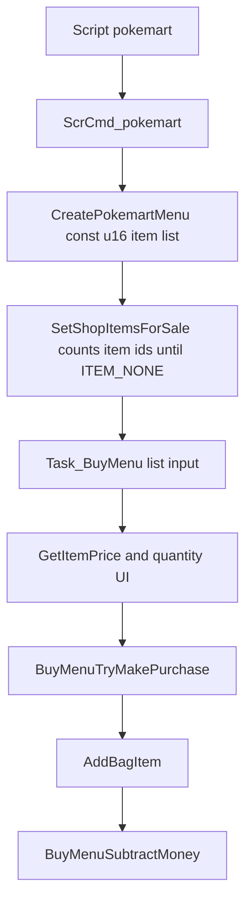
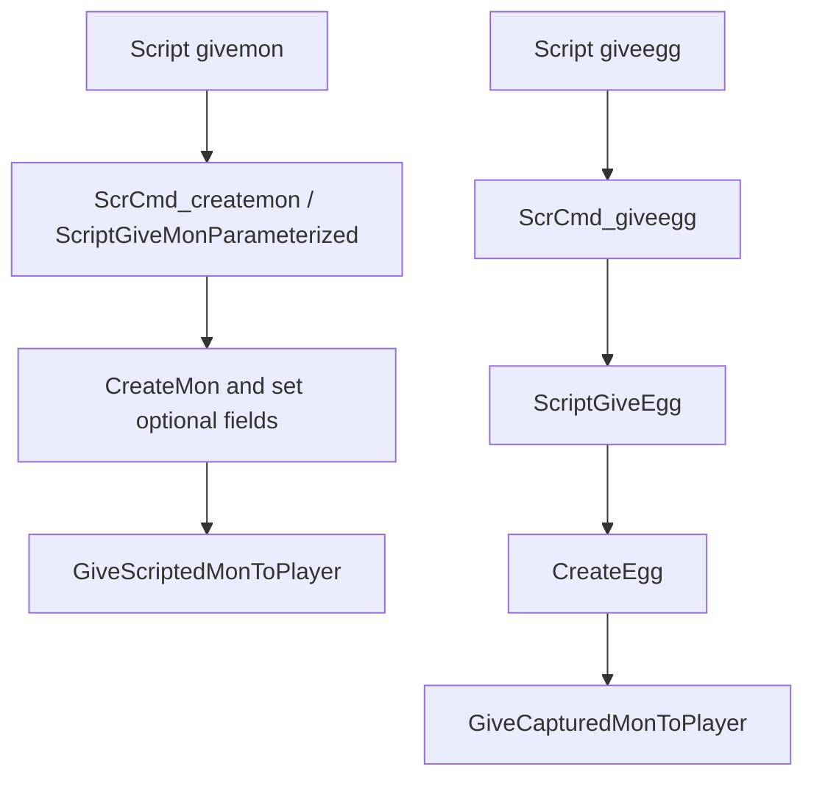

# Friendly Shop Pokemon Vendor Investigation

## Document Metadata

| Field | Value |
|---|---|
| Last reviewed | 2026-05-22 |
| Baseline | `master` `2bb16c85b311`; upstream `expansion/1.15.2-86-g2bb16c85b3` |
| Code status | Docs-only investigation |
| Provenance | Local project overlay |

## Existing Files

| File | Symbols | Notes |
|---|---|---|
| `include/shop.h` | `CreatePokemartMenu`, `CreateDecorationShop1Menu`, `CreateDecorationShop2Menu` | Public shop API accepts `const u16 *itemsForSale`; it has no product metadata type. |
| `src/shop.c` | `struct MartInfo`, `SetShopItemsForSale`, `BuyMenuBuildListMenuTemplate`, `Task_BuyMenu`, `BuyMenuTryMakePurchase`, `BuyMenuSubtractMoney`, `CreatePokemartMenu` | Normal mart products are item ids. Purchase success for normal marts calls `AddBagItem(tItemId, tItemCount)`. |
| `src/scrcmd.c` | `ScrCmd_pokemart`, `ScrCmd_giveegg` | `pokemart` reads a pointer and opens shop UI. `giveegg` delegates to `ScriptGiveEgg`. |
| `asm/macros/event.inc` | `pokemart`, `pokemartlistend`, `givemon`, `giveegg` | Script macros already cover item shops and direct gift Pokemon / Eggs, but not a shop-priced Pokemon product table. |
| `src/script_pokemon_util.c` | `ScriptGiveEgg`, `ScriptGiveMon`, `ScriptGiveMonParameterized` | Existing gift flow can create Pokemon with configurable species, level, item, ball, nature, ability, EVs, IVs, moves, shiny, Gmax, Tera, and Dmax through the parameterized path. |
| `include/daycare.h` / `src/daycare.c` | `CreateEgg` | Egg creation uses `EGG_HATCH_LEVEL`, sets `MON_DATA_IS_EGG`, stores species egg cycles in `MON_DATA_FRIENDSHIP`, and sets special egg met data. |
| `src/egg_hatch.c` | `AddHatchedMonToParty` | Hatch finalization clears egg state, sets nickname / dex flags / met data, restores PP, and recalculates stats. |
| `src/battle_setup.c` | `CB2_EndTrainerBattle` | Trainer-win progress could hook here, but this function is shared by many battle variants and already coordinates Pyramid / Trainer Hill / follower / no-whiteout flows. |
| `src/field_specials.c` | `GiveFrontierBattlePoints`, `GetFrontierBattlePoints`, `TakeFrontierBattlePoints` | Existing BP is stored at `gSaveBlock2Ptr->frontier.battlePoints`. It is available, but not required by this feature. |
| `docs/flows/save_data_flow_v15.md` | SaveBlock / flag / var policy | Saved vars are scarce; new persistent product state should prefer a compact dedicated struct if it grows past a few flags. |
| `docs/features/unified_move_relearner/` | Unified move candidate flow | Candidate for move editing / relearn policy after purchase or hatch. Runtime branch exists, but not on `master`. |
| `docs/features/pokemon_state_editor/` | Summary-launched editor | Candidate UI for free move / item / stats edits after entitlement checks. Runtime branch exists, but not on `master`. |
| `docs/features/nonconsumable_held_items/` | Held item ownership policy | Relevant if purchased Pokemon can freely change held items from a unique-token catalog. |

## Existing Shop Flow

The current shop code is not just a generic price list. Product identity,
display name, description, icon, quantity, sold-out handling, and final delivery
all assume item ids. A Pokemon vendor should therefore either add a new mart type
with a different product table or implement a sibling menu that reuses the same
window style.

## Existing Gift Pokemon / Egg Flow

The parameterized `givemon` macro is the best existing model for product
payload. It can already specify level, held item, ball, nature, ability, EVs,
IVs, moves, and several modern mechanics. The plain `ScriptGiveMon()` helper is
simpler but creates a random Pokemon with a level and optional held item only.

Egg creation currently uses species egg cycles for step-based hatching. If this
feature adds non-step unlock progress, that state should not reuse
`MON_DATA_FRIENDSHIP`, because it already has hatch-cycle meaning while the
Pokemon is still an Egg.

## Product State Dependencies

| Requirement | Existing support | Gap |
|---|---|---|
| Repeat purchase | Existing shop item path supports repeated buys | Pokemon delivery path is missing. |
| One-time purchase | Event flags can guard one-time products | Product table needs a per-product flag id or a hide/sold-out policy. |
| Normal Pokemon purchase | `ScriptGiveMonParameterized` can create the Pokemon | Needs money check and product table integration. |
| Egg purchase | `CreateEgg` / `ScriptGiveEgg` can create an Egg | Needs price, one-time state, optional product metadata, and progress state. |
| Party-slot risk | Eggs already cannot battle | Vendor must decide whether to require party slot or allow PC delivery. |
| Hatch / unlock reward | Existing egg hatching handles steps | Battle-win / clear-based unlock needs new state and hook. |
| Move editing in selected areas | Existing relearner / editor branches can be reused later | Needs an entitlement check that distinguishes normal vendor Pokemon from Egg-origin Pokemon. |
| Egg-origin always-editable policy | No direct persistent origin flag confirmed | Needs a per-mon origin strategy, product registry, or challenge-local entitlement. |

## Reward Currency Decision

BP is a usable reference, not a hard dependency. `gSaveBlock2Ptr->frontier.battlePoints`
already exists and has script specials, but tying Egg unlock to Frontier BP would
couple this feature to Battle Frontier economy and UI. The safer design is:

- define a feature-local `eggProgress` / `eggUnlockPoints` concept;
- decide per product whether progress comes from trainer wins, challenge clears,
  script events, steps, or another source;
- optionally convert that progress into BP-like rewards in a later balancing
  pass.

## Source-Wide Impact Check

| Check | Result / notes |
|---|---|
| Constants / IDs | Likely needs a script command id or native call entry, product kind enum, and optional config constants. |
| Primary data table | Needs a Pokemon product table, not a `u16` item list. |
| Runtime entry point | Needs a new `CreatePokemonVendorMenu` style entry or a new shop mart type. |
| Script command / special | Needs `pokemartmon` / `pokemonvendor` macro or a `special` wrapper that receives product table pointer. |
| Callback / task | Needs shop-like task flow for list input, confirmation, purchase finalization, and script resume. |
| Save / runtime state | One-time flags can use event flags. Egg progress and per-mon entitlement likely need dedicated state if not purely script-local. |
| UI / window / sprite / text | Can reuse shop windows first. Product description should show species, level, product type, repeat/one-time state, and price. |
| Battle / AI | Egg progress on battle wins touches battle-end flow. Avoid a global hook until the product policy is finalized. |
| Build tools / generated files | Not required for MVP unless product pools are generated from partygen JSON later. |
| Tests | Needs shop purchase tests, party-full tests, one-time flag tests, and focused egg progress tests. |
| Upstream migration | Shop internals and script command table are high-conflict areas during upstream refreshes. |

## Open Questions

- Should normal Pokemon products use the full parameterized gift payload from
  `givemon`, or a smaller product struct for MVP?
- Should product lists be compiled C tables, script-side `.inc` tables, or
  generated from JSON later?
- What is the exact Lv.50 policy for Eggs in non-Champions areas?
- What is the smallest persistent marker that can reliably tag an Egg-origin
  Pokemon after hatch?
