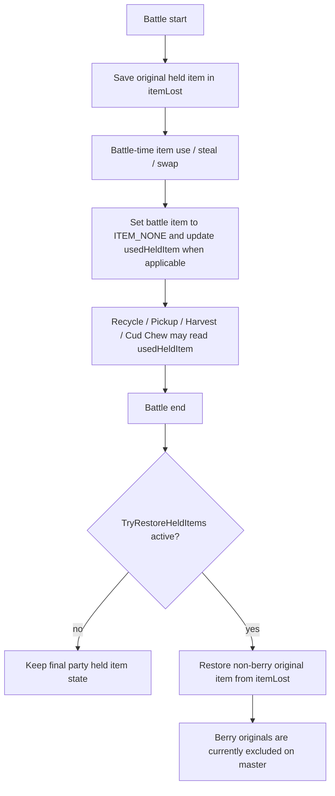

# Nonconsumable Held Items Investigation

## Document Metadata

| Field | Value |
|---|---|
| Last reviewed | 2026-05-17 |
| Baseline | `master` `ff4e825258`; `git describe` = `expansion/1.15.2-59-gff4e825258` |
| Code status | Docs-only investigation |
| Provenance | Local source read |

## Source Search Notes

Commands used during the docs-only investigation:

```sh
rtk rg -n "RemoveBattlerItem|DestroyHeldItem|ConsumeHeldItem|itemConsumed|consumed|originalItem|changedItems|TryRestoreHeld|restore.*held|held item|heldItem|MON_DATA_HELD_ITEM|ITEM_NONE|B_RESTORE_HELD|usedHeldItem" src include data test docs
rtk rg -n "ITEM_CLAUSE|Item Clause|item clause|duplicate.*item|same.*item|held item.*duplicate|Check.*Held.*Item|Cant.*hold|Can.*Give.*Item|SetMonData\(.*MON_DATA_HELD_ITEM|Give.*held|Take.*held" src include data docs
rtk rg -n "RemoveBagItem\(|AddBagItem\(|ReturnGiveItemToBagOrPC|GiveItemToMon\(|GiveHoldItem|TryGiveItem|SwitchItems" src/party_menu.c src/item_menu.c src/pokemon_storage_system.c include src
```

## Existing Files

| Area | File / symbol | Confirmed fact |
|---|---|---|
| Battle config | `include/config/battle.h` `B_RESTORE_HELD_BATTLE_ITEMS` | Current `master` uses `GEN_LATEST`; Gen9-style restore applies to non-berry held items. |
| Trainer item stealing | `include/config/battle.h` `B_TRAINERS_KNOCK_OFF_ITEMS`, `B_RETURN_STOLEN_NPC_ITEMS` | Trainer item steal / swap / return policy is already config-driven. |
| Trainer pool item clause | `include/config/battle.h` `B_POOL_RULE_ITEM_CLAUSE` | Current value is `FALSE`; trainer pool generation does not globally require unique held items by default. |
| Battle start snapshot | `src/battle_main.c` battle init loop | `itemLost[B_SIDE_PLAYER][i].originalItem` and opponent equivalent are filled from party held items at battle start. |
| Battle end restore call | `src/battle_main.c` battle end path | Calls `TryRestoreHeldItems()` when trainer knock-off restore or Gen9 held item restore policy is active. |
| Restore implementation | `src/battle_util.c` `TryRestoreHeldItems()` | Uses the battle-start original item snapshot, but explicitly excludes Berry pocket items from final restore. |
| Battle-time item removal | `src/battle_script_commands.c` remove item command | Saves consumed held items to `usedHeldItem`, except popped Air Balloon and Corrosive Gas. |
| Natural Gift | `src/battle_move_resolution.c` `EFFECT_NATURAL_GIFT` | Removes berry, marks `canPickupItem`, saves `usedHeldItem`, and triggers Unburden. |
| Recycle / Pickup state | `src/battle_script_commands.c` `Cmd_tryrecycleitem()` | Reads `usedHeldItem`; this confirms battle-time consumption state must remain intact. |
| Wild caught mon restore | `src/battle_script_commands.c` caught mon flow | Restores non-berry original held items to caught Pokemon under `B_RESTORE_HELD_BATTLE_ITEMS >= GEN_9`. |
| Party give / take | `src/party_menu.c` `GiveItemToMon()`, `TryTakeMonItem()` | Give sets `MON_DATA_HELD_ITEM`; Take adds the held item back to Bag before clearing the Pokemon. |
| Party menu Give from Bag | `src/party_menu.c` `CB2_GiveHoldItem()`, `Task_GiveHoldItem()` | Normal flow removes one Bag item when assigning a held item. |
| Bag Give to party | `src/party_menu.c` `TryGiveItemOrMailToSelectedMon()`, `GiveItemToSelectedMon()` | Bag-origin Give also removes one Bag item on commit. |
| Switch held item | `src/party_menu.c` `Task_HandleSwitchItemsYesNoInput()`, `Task_HandleSwitchItemsFromBagYesNoInput()` | Switch removes the incoming item from Bag and adds the old held item back to Bag. |
| Toss held item | `src/party_menu.c` `CursorCb_Toss()`, `Task_TossHeldItem()` | Toss clears the Pokemon held item without returning it to Bag. |
| PC Storage item mode | `src/pokemon_storage_system.c` `GiveItemToMon()`, `MoveItemFromMonToBag()` | Storage can move held items between Pokemon, cursor, and Bag outside the normal party menu. |
| Frontier entry checks | `src/frontier_util.c` `CheckPartyIneligibility()` | Frontier eligibility can reject duplicate held items. |
| Choose-half selection | `src/party_menu.c` `CheckBattleEntriesAndGetMessage()` | Selected party members with duplicate held items return `PARTY_MSG_NO_SAME_HOLD_ITEMS`, except excluded facilities. |
| Frontier generated parties | `src/battle_frontier.c`, `src/battle_tower.c`, `src/battle_tent.c` | Generated Frontier / Tent parties avoid duplicate held items. |
| Trainer party pools | `src/trainer_pools.c` | When `rules->itemClause` is enabled, pool selection prunes mons with duplicate held items. |

## Existing Flow



## Key Finding

"Do not consume held items" should not be implemented by skipping battle-time
item removal. Too many mechanics depend on temporary item loss. The safer model
is:

| Timing | Policy |
|---|---|
| During battle | Keep normal item loss, `usedHeldItem`, `canPickupItem`, `ateBerry`, `isKnockedOff`, and Unburden behavior. |
| Battle end | Restore the original player party held item from the battle-start snapshot when the feature policy allows it. |
| Team building / Bag | Treat infinite assignment as a separate catalog UI / ownership rule. |

## Quantity / Catalog Finding

Current Party / Bag / Storage UI models a held item as physical ownership:

- Bag `GIVE` removes one item from Bag.
- Party `TAKE` adds one item back to Bag.
- Switch paths remove the incoming item and return the previous held item.
- PC Storage item mode can move held items without going through the same party
  callbacks.

Therefore, battle-end restore alone does not let one owned item be assigned to
multiple Pokemon. A true Champions-style "one catalog entry, unlimited
assignment" mode must decide how to handle these UI paths.

## Source-Wide Impact Check

| Check | Result / notes |
|---|---|
| Constants / IDs | No new IDs are needed for battle-end restore. Catalog mode may need config names only. |
| Primary data table | No held item table changes are required for MVP. |
| Runtime entry point | Battle-end restore uses existing `TryRestoreHeldItems()` path. Catalog mode needs Party / Bag / Storage entry ownership. |
| Script command / special | Not needed for battle-end restore. A future debug / facility item assignment NPC may use scripts. |
| Callback / task | Catalog mode touches party menu tasks and storage item-mode callbacks. |
| Save / runtime state | Battle-end restore uses existing battle struct state. Catalog unlock tracking is TBD and should avoid SaveBlock changes in first slice. |
| UI / window / sprite / text | Catalog assignment needs clear text because Bag quantity may no longer decrease. |
| Battle / AI | Battle-end restore must preserve battle-time `usedHeldItem`; AI already reads that state. |
| Build tools / generated files | Not needed. |
| Tests | Future runtime needs focused battle tests and menu ownership tests. |
| Upstream migration | Re-check upstream held item restore changes before adopting, because `B_RESTORE_HELD_BATTLE_ITEMS` is an upstream generational config. |

## Open Questions

- Should battle-end restore include wild battles, trainer battles, and facility
  battles, or only selected local modes?
- Should caught wild Pokemon restore berries the same way player party Pokemon
  would, or keep current non-berry-only behavior?
- Should catalog mode be global, debug-only, or facility-only?
- Should storage item mode be disabled during catalog MVP to reduce duplication
  risk?
- Should duplicate held items be allowed in every local mode, or only outside
  explicit item-clause facilities?
