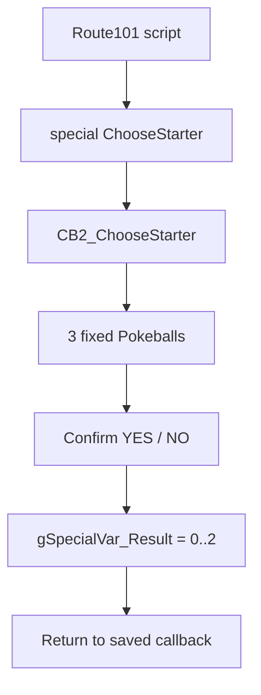
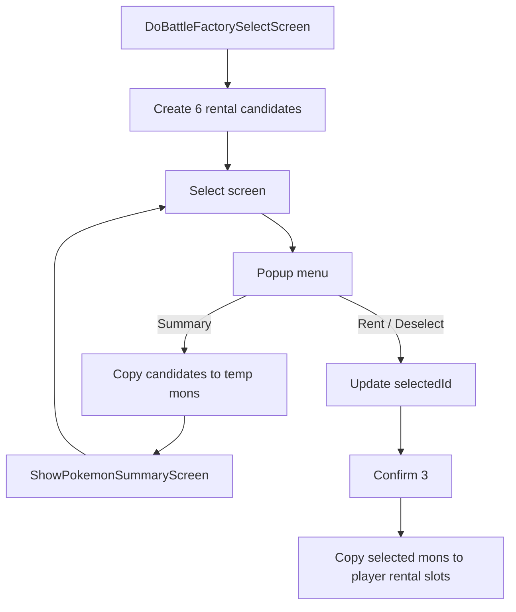
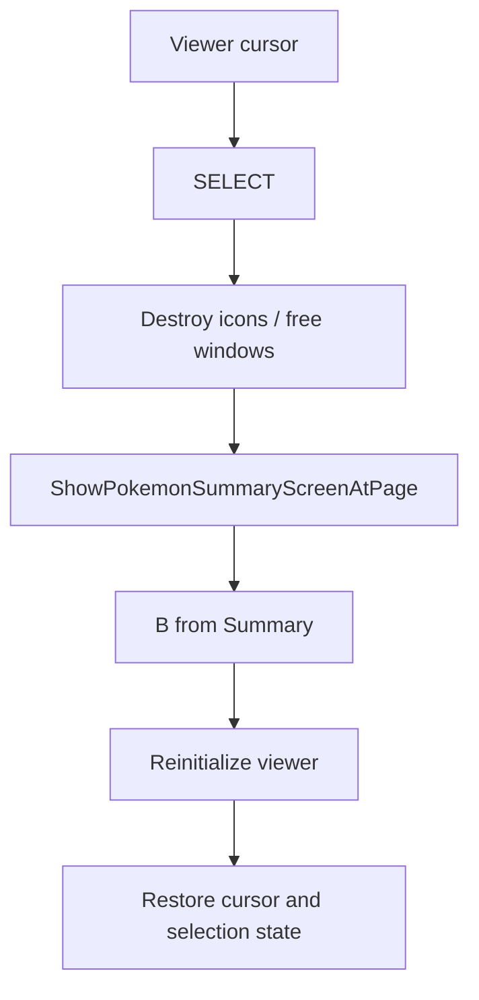

# Scout Selection Investigation

## Document Metadata

| Field | Value |
|---|---|
| Last reviewed | 2026-05-20 |
| Baseline | `master` `bc1464d905`; `feature/scout-selection-runtime-20260520` |
| Code status | Runtime MVP implemented on feature branch |
| Provenance | Local source inspection, current feature docs, partygen shelf audit, RHH contributor / PR pivots, public web / GitHub search |

## Summary

実装は可能。既存資産のうち、最も使うべきものは starter screen そのものではなく、
Team Viewer の compact icon UI / Summary return と Battle Factory の candidate
selection state。

2026-05-20 update: Scout candidate Pokemon should not be pulled from
`tools/learnset_helpers/porymoves_files/*.json`. Those files are learnset /
teachability input and do not contain held item, nature, ability, IV, EV, or
curated set identity. The correct local source for Scout-ready Pokemon candidates
is the previously implemented `champions_partygen` set catalog JSON, because it
already describes full curated Pokemon sets.

外部 search では、明確な「11 starter + Summary 対応」の public implementation は
この調査では特定できなかった。一般的な starter 変更記事は `src/starter_choose.c`
の 3 種差し替えに留まり、今回必要な Summary / N-of-M / script-driven pool には
届かない。local branch では `origin/feature/party-select-ui` が古い icon grid
prototype を持つが、battle party select 用で Summary entry は無く、現行
Team Viewer shelf が supersede している。

## External Reference Check

| Reference | Finding |
|---|---|
| Pokemon Champions official Japanese site: <https://www.pokemonchampions.jp/ja/pokemon/> | Champions は「スカウト」「セレクト」「22 時間に 1 回無料紹介」「trial / regular scout」を持つ。MVP は economy ではなく候補提示 / 選択 UI だけを持ち込む。 |
| Pokemon Champions official international page: <https://champions.pokemon.com/es-es/pokemon/> | Recruit/fichaje はランダム選択から Pokemon を招く system と説明されている。 |
| RHH contributor / PR pivot: [external reference workflow](../../manuals/external_reference_credit_workflow.md#upstream-developer-roster) | generic Emerald search より先に、`pokeemerald-expansion` の credits、contributors、recent merged PR から該当領域の実装者を辿る。Scout Selection では Summary / icon UI / object-event / gift flow に触るため、Team Viewer branch と RHH の `pokemon_summary_screen.c`, `pokemon_icon.c`, `data/maps/`, `script_pokemon_util.c` 周辺 PR を優先して見る。 |
| pret Battle Factory select screen: <https://github.com/pret/pokeemerald/blob/master/src/battle_factory_screen.c> | 6 候補、Summary、3 picks、rental copy の先例。Frontier state 前提なので直接流用は避ける。 |
| LOuroboros starter wiki: <https://github-wiki-see.page/m/LOuroboros/pokeemerald/wiki/Change-Starter-Pok%C3%A9mon> | starter baseline の低コスト確認には使えるが、一般的な starter change は `sStarterMon` の 3 種差し替えで、UI 構造は増やしていない。Scout の主参考にはしない。 |

## Existing Files

| File / branch | Symbols | Notes |
|---|---|---|
| `src/starter_choose.c` | `CB2_ChooseStarter`, `GetStarterPokemon`, `STARTER_MON_COUNT`, `sPokeballCoords` | 3 fixed slots, left/right cursor, full front sprite reveal, YES/NO confirm。Summary は無い。 |
| `data/maps/Route101/scripts.inc` | `special ChooseStarter`, `waitstate` | starter choice is opened from script and returns through `gSpecialVar_Result`. |
| `data/maps/LittlerootTown_ProfessorBirchsLab/scripts.inc` | Johto starter object events, `givemon` | Object event starter reward pattern。個別 object から `givemon` するので shared UI ではない。 |
| `include/pokemon_summary_screen.h` / `src/pokemon_summary_screen.c` | `ShowPokemonSummaryScreen`, `SUMMARY_MODE_LOCK_MOVES`, `PSS_PAGE_*` | Master has normal Summary entry only. Direct start page helper is branch-only today. |
| `origin/feature/prebattle-team-viewer-phase2` | `ShowPokemonSummaryScreenAtPage`, `OpenSelectedMonSummary`, `CreateTeamIcon`, selected marker constants | Player-side Summary return and icon grid are already solved on the shelf. This is the closest reusable pattern. |
| `src/battle_factory_screen.c` | `DoBattleFactorySelectScreen`, `SELECTABLE_MONS_COUNT`, `Select_Task_OpenSummaryScreen`, `Select_CopyMonsToPlayerParty` | 6 generated candidates and Summary temp buffer exist. Copy path overwrites rental party and should not be reused for scout. |
| `src/pokemon_icon.c`, `include/pokemon_icon.h` | `LoadMonIconPalettes`, `CreateMonIconIsEgg`, `FreeAndDestroyMonIconSprite` | MVP visual should use icons to avoid front-pic VRAM / OAM pressure. |
| `src/script_pokemon_util.c` | `ScrCmd_createmon`, `ScriptGiveMonParameterized`, `GiveScriptedMonToPlayer` | Full gift data path already supports item, ball, nature, ability, EV/IV, moves, shiny, Gmax, Tera, Dmax. |
| `asm/macros/event.inc` | `givemon`, `createmon`, `special`, `waitstate`, `callnative` | `.inc` contract can stay script-driven without a new script opcode. |
| `origin/feature/party-select-ui` | `src/battle_party_select.c` | Old prototype has two-sided icon grid and selection count. It is v14-era, battle-focused, no Summary, and should be reference-only. |
| `docs/features/prebattle_team_viewer/` | implementation / dependencies / test plan | Records Summary return, selected marker, icon lifetime, pool/randomizer cache. |
| `docs/overview/scout_selection_and_battlefield_status_v15.md` | previous scout design notes | Already identified Battle Factory, `givemon`, icon UI, Frontier save/recovery, and object-event considerations. |
| `tools/champions_partygen/catalog/sets/*.json` | `species`, `ability`, `moves`, `item`, `ivs`, `evs`, `nature`, `level`, role/group tags | Best current input for Scout candidate Pokemon. Runtime Scout generation uses set JSON directly and ignores trainer-specific party materialization. |
| `tools/learnset_helpers/porymoves_files/*.json` | `LevelMoves`, `EggMoves`, `TMMoves`, `TutorMoves` by species / game version | Useful for relearner / teachability features, but insufficient for Scout Pokemon candidates because it has no full set metadata. |

## Existing Flow: Starter

Starter choose is useful for field transition and Pokeball visual language, but it is
not the right base for scrollable N-of-M because slot count, coordinates, label windows,
and input handling are all fixed around 3 options.

## Existing Flow: Battle Factory Select

The temp mon buffer is valuable. `Select_CopyMonsToPlayerParty()` is not: it writes
Battle Frontier rental state and assumes exactly 3 selected Pokemon.

## Existing Flow: Team Viewer Summary Return

This is the path Scout Selection should reapply. The branch also fixed a Summary direct
skills-page layout issue by initializing Summary BG order/X like a completed page scroll.

## Source-Wide Impact Check

| Check | Result / notes |
|---|---|
| Constants / IDs | Likely new `include/scout_selection.h` and optional config defines. No new species/item constants required for MVP. |
| Primary data table | Add C-owned scout pool tables or `.inc`-included arrays. Avoid generated data until candidate schema settles. |
| Runtime entry point | New `special` entries such as `InitScoutSelection` / `OpenScoutSelection` / `GiveSelectedScoutMons`. |
| Script command / special | Use `special` + `waitstate`; no new script opcode needed. |
| Callback / task | New CB2 / task state, modeled after Team Viewer and Battle Factory. Must own BG/window/sprite cleanup. |
| Save / runtime state | MVP can avoid SaveBlock changes. NPC one-time claim uses existing flags/vars. Deterministic daily scout or 22-hour timer is future work. |
| UI / window / sprite / text | Main risk. Use icon grid / vertical scroll first; battle front sprite display is later. |
| Battle / AI | No direct battle hook in MVP. If used for Champions Challenge party setup, connect after party policy is stable. |
| Build tools / generated files | The demo pool now uses `tools/scout_selection/make_scout_pools.py` to generate ignored `src/data/scout_selection_pools.h` from partygen set JSON. The full partygen CLI remains build-adjacent and is not required for normal Scout builds. |
| Tests | Add focused C tests only if sampling / eligibility helpers are pure. UI requires mGBA validation. |
| Upstream migration | Watch `pokemon_summary_screen.c`, `pokemon_icon.c`, `battle_factory_screen.c`, and script macro changes. |

## Open Questions

- Exact `.inc` authoring format: raw C array include, macro table, or script vars only.
- Whether additional pools should be chosen by JSON file order, JSON group filter,
  or explicit map/NPC pool manifest.
- Whether cancel is allowed after selecting at least one Pokemon.
- Whether selected candidates should be removed from future scout pools or just flagged by NPC script.
