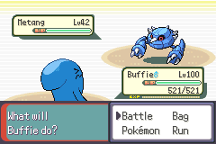
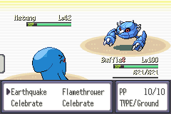
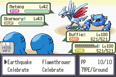
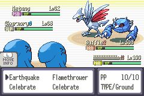
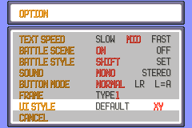

# Runtime UI style selection

Work branch: `feature/ui-style-switch-20260909`, extending the existing
`feature/xy-status-hud-20260908` implementation at `2c51798fe1`.

The OPTION screen offers UI STYLE: DEFAULT / XY. Left or right changes the
choice; B or CANCEL accepts it, following the existing option-menu behavior.
Save the game normally to keep the preference after restarting. The choice
applies when entering the next battle. The initial option value is DEFAULT; choosing XY in the title OPTION menu
is preserved when starting a new game, like the other options.

Both original Emerald and existing XY-inspired battle HUD graphics are included.
Default assets are restored byte-for-byte from the XY implementation's parent;
XY sheets live under separate `xy_` names. The loader chooses healthbox sheets
and HP palette, and the renderer chooses text colors, clearing color, tile table
and status/HP-prefix behavior. Both incremental loading and all-at-once reloads
use the selection. Party-ball indicators keep their original graphics/palette.

The option occupies the unused four bits after regionMapZoom in SaveBlock2.
No existing field moves and no extra save sector is needed. Unknown values
select DEFAULT. Existing saves with zeroed padding select DEFAULT; a padding
nibble already equal to 1 is indistinguishable from XY, and can be changed in
OPTION. No save version migration is performed.

The eight option rows use 14-pixel spacing within the existing 112-pixel window.
Frame selection remains independent of the battle HUD preference. Safari's
special player counter retains its original sheet and text treatment.

See [verification](test_plan.md). This implementation is on a separate worktree;
no master merge or remote publish has been performed.

## In-game comparison

| DEFAULT | XY |
|---|---|
|  |  |
|  |  |

## Background-aware XY text (2026-09-09)

XY names previously used cream text on every arena, making them difficult to
read on bright backgrounds. The palette now provides RGB555(3,4,6), displayed
approximately as **#182131**, and RGB555(31,31,31), **#FFFFFF**. Each healthbox
chooses the dark or light foreground from the brightness of its actual name and
level background region. The opposite color provides the shadow. Names also
receive a full 1px outline, including colored gender marks; the 57x13 clear area
removes the old outline when a long nickname becomes a short one.

The loader samples the decoded BG3 tilemap and RGB555 palette after environment
selection, including per-tile palette banks and horizontal/vertical flips. It
caches results for both single and double resting positions; transient move
animations do not make the text color oscillate. The same selection is used for
name, level and HP text. DEFAULT retains its original palette and rendering.

[All 23 implemented background comparisons](evidence/contrast/all-backgrounds.png)
show the production loader and HUD renderer in a controlled 2v2 probe. The extra
Nature Power environments without dedicated artwork are not counted as new
backgrounds. [Validation details](test_plan.md#background-contrast-and-outline).
