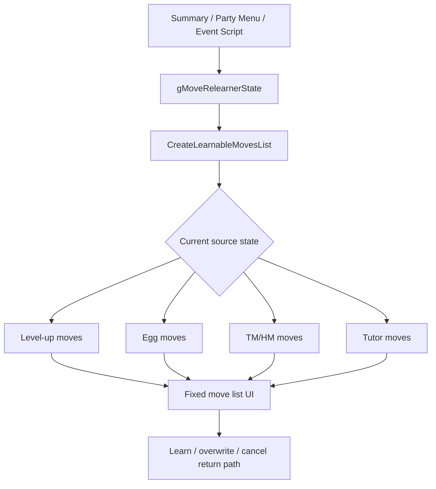

# Unified Move Relearner Investigation

## Document Metadata

| Field | Value |
|---|---|
| Last reviewed | 2026-05-16 |
| Baseline | `master` `459703c0aa`; `git describe` = `expansion/1.15.2-48-g459703c0aa` |
| Code status | Docs-only investigation |
| Provenance | User request and local code/docs review |

## Existing Files

| File | Symbols | Notes |
|---|---|---|
| `include/config/summary_screen.h` | `P_ENABLE_ALL_LEVEL_UP_MOVES`, `P_TM_MOVES_RELEARNER`, `P_ENABLE_ALL_TM_MOVES`, `P_PARTY_MOVE_RELEARNER` | Existing config can enable pieces, but not a unified all-source relearner. |
| `include/constants/move_relearner.h` | `MAX_RELEARNER_MOVES`, `MOVE_RELEARNER_*`, `RELEARN_MODE_*` | `MAX_RELEARNER_MOVES` is 60. Summary page modes 2 and 3 must stay tied to page ids. |
| `src/move_relearner.c` | `CreateLearnableMovesList`, `GetRelearnerLevelUpMoves`, `GetRelearnerEggMoves`, `GetRelearnerTMMoves`, `GetRelearnerTutorMoves` | Current candidate builders write into a fixed array without local cap checks. |
| `src/pokemon_summary_screen.c` | `ShouldShowMoveRelearner`, `TryUpdateRelearnType`, `ShowRelearnPrompt` | Summary UI cycles source states with L/R and launches with START. |
| `src/party_menu.c` | `SetPartyMonLearnMoveSelectionActions`, `CursorCb_Change*Moves`, `ChooseMonForMoveRelearner` | Party menu support exists behind `P_PARTY_MOVE_RELEARNER`, currently as a source submenu. |
| `data/scripts/move_relearner.inc` | `Common_EventScript_MoveRelearner`, `setmoverelearnerstate`, `TeachMoveRelearnerMove` | Generic NPC script already supports level / egg / TM / tutor category choice. |
| `data/maps/FallarborTown_MoveRelearnersHouse/scripts.inc` | Heart Scale relearner flow | Vanilla NPC charges Heart Scale only after `VAR_0x8004 != 0` successful learning. |
| `tools/learnset_helpers/` | `make_learnables.py`, `make_tutors.py`, `make_teachables.py` | Generated teachables are key for TM/tutor compatibility and historical data. |

## Existing Flow

## Current Data Facts

| Area | Current fact |
|---|---|
| Level-up learnsets | `P_LVL_UP_LEARNSETS` selects one generation, defaulting to `GEN_LATEST` / Gen 9. It does not combine Gen 1-9 level-up moves. |
| Potential teachables | `make_learnables.py` unions every `tools/learnset_helpers/porymoves_files/*.json` into `all_learnables.json`. Current files cover RGB/Y, GS/C, RSE/FRLG, Gen 4-9, XD, and ZA data files. |
| Teachable learnsets | `make_teachables.py` filters potential learnables by current TM/HM moves, script tutor moves, universal moves, and species teaching type. |
| Current TM/HM registry | `FOREACH_TM` has 50 moves and `FOREACH_HM` has 8 moves. This is not all Gen 1-9 TM/TR history. |
| Planned TM range | User expectation is 250-300 TM-like candidate moves, but not as physical TM items. This is primarily a Move Relearner candidate-storage/UI problem. |
| Current tutor registry | `src/data/tutor_moves.h` has 30 generated tutor moves from scripts. It includes `MOVE_MEGA_PUNCH`. |
| Mew | `SPECIES_MEW` has `.teachingType = ALL_TEACHABLES`, so it is the expected high-candidate stress case. |
| Source overlap | Some historical TM candidates can overlap tutor / Battle Tower candidates. The current requirement is to show source duplicates as separate entries so TM / tower availability stays visible. |

## Source-Wide Impact Check

| Check | Result / notes |
|---|---|
| Constants / IDs | Need `MOVE_RELEARNER_UNIFIED` or config-only path. Existing mode values tied to Summary must not shift. |
| Primary data table | Level / egg data can be read as-is. Historical TM/tutor generation filtering needs new generated data or new source tables. |
| Runtime entry point | Summary, party menu, and event script all already have relearner entry points. They need a common unified target. |
| Script command / special | Existing `setmoverelearnerstate`, `getmoverelearnerstate`, `istmrelearneractive`, and `TeachMoveRelearnerMove` are reusable. A unified script shortcut may be cleaner. |
| Callback / task | Return paths depend on `gRelearnMode`; script, party, Summary, and box Summary must be regression-tested separately. |
| Save / runtime state | No save layout change is required if the virtual TM pool is always available. If story rank / clear-flag unlocks are needed, a move/group bitset is much smaller than bag expansion but still a save-layout change. |
| UI / window / sprite / text | Existing list shows 6 at once and menu item id is currently the move id. Source-duplicate rows require source labels and likely a candidate index / metadata table instead of move-only ids. |
| Battle / AI | No direct battle effect expected. Learned moves affect downstream gameplay normally. |
| Build tools / generated files | Gen allow-list config for historical TM/tutor data requires `tools/learnset_helpers` changes. |
| Tests | Unit coverage is limited here. Need local make plus mGBA route for cancel / learn / overflow cases. |
| Upstream migration | Central files are active upstream areas. Keep implementation guarded and localized. |

## Confirmed Gaps

- Existing `P_ENABLE_ALL_LEVEL_UP_MOVES` covers level 50 / level 100 level-up moves only for the selected `P_LVL_UP_LEARNSETS` generation.
- Existing `P_ENABLE_ALL_TM_MOVES` means "all currently registered machines compatible with this species", not all historical / virtual machine candidates.
- 250-300 virtual TM candidates should be treated as a relearner data problem,
  not a bag item expansion. The Move Relearner should consume a safe generated
  candidate pool rather than assuming every relearner TM candidate is a bag item.
- Source entries make progression control easier: a rank / clear flag can unlock
  a specific virtual TM move or group without creating a physical TM item.
- This supports story rewards like "you can now relearn these TM-family moves"
  instead of handing out a TM item. The reward broadens Move Relearner
  availability directly.
- Existing `P_ENABLE_MOVE_RELEARNERS` unlocks category types, but does not merge them.
- Current candidate builders do not guard `MAX_RELEARNER_MOVES` before writing to `movesToLearn`.
- Existing generated teachables do not preserve which generation or method made a move legal after generation.
- Current list storage is move-only. Preserving duplicates such as TM + tower for
  the same move needs a candidate entry that stores both move and source.
- A larger `MAX_RELEARNER_MOVES` only solves storage. It does not solve the UX cost
  of scrolling through 250-300 mostly-TM candidates in the existing list UI.

## Open Questions

- Should historical Gen 1-9 source filtering be part of MVP, or should MVP use existing generated union compatibility and add generator metadata later?
- Should TM/HM historical moves be modeled as `Virtual TM` source entries or
  folded into the existing `TM` label when no physical item exists?
- What exact source labels should display when the same move appears as virtual
  TM and Battle Tower tutor?
- Should virtual TM candidates be always available, or gated by a compact story
  unlock bitset / generation allow-list?
- Should unlock metadata be per move, per rank group, per generation group, or
  a table that can combine all three?
- Should the broad candidate UI use source tabs, 50-move chunks, 60-move chunks,
  or another navigation surface?
- Should NPC scripts keep category prompts, go straight to unified list, or expose both variants?
- Should party menu show a single `MOVE RELEARNER` action, or keep `MOVES` submenu with source-specific options as fallback?
