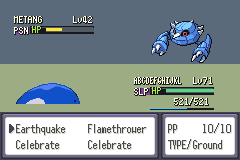
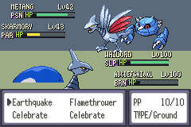
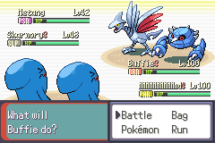

# XY status HUD implementation

The battle status area now uses floating light text with dark shadows, a lime HP
label, slim HP/EXP strips, and compact status capsules. The large Emerald panel
background is transparent. Opponent upper-left and player lower-right positions,
command/message areas, six-tile HP width and eight-tile EXP width are preserved.

Branch: `feature/xy-status-hud-20260908`, from fetched master
`036e535bfea3b89aa6c46bdf15bc007167da468a`. This branch contains implementation
assets and C changes; it is not eligible for a docs/Lua-only master merge.

See [design constraints and reference provenance](xy_status_hud_constraints.md)
and [test plan and results](xy_status_hud_test_plan.md).

## Design, inspection, adjustment

1. Viewed the user's local Pokemon X/Y battle reference images from Game UI
   Database. Created XY-first boards using actual game glyphs and Pokemon assets.
2. Preserved `graphics/battle_interface/xy_initial_*.png` before adjustment.
   The overlay exposed status/HP crowding and an incorrect embedded Pokemon
   palette in the initial design input.
3. Reduced status capsules to 16px and loaded species `normal.pal` for design
   sprites. The remaining status tile stays transparent, allowing HP and status
   to coexist without increasing OAM allocation or moving the side anchors.
4. Inspected the ROM in single and full 2v2 battles. Names, levels, HP numbers,
   state colors and command areas remain readable at native 240x160.





## Files and architecture

- `tools/xy_status_hud.lua`: real Aseprite generator for runtime sheets and five
  layered design boards. `tools/xy_hud_font.lua` reads game glyph pixels, charmap
  and advance tables, including small-font narrowing.
- `graphics/battle_interface/xy_single_1..4` and `xy_double`: editable Aseprite
  sources, native PNGs and exact nearest-neighbor 4x comparison PNGs. These are
  design boards, not framebuffer captures. `xy_context.png` preserves the
  existing command-area input used by the generator.
- `graphics/battle_interface/xy_*.aseprite`: editable runtime asset originals;
  corresponding unprefixed PNGs are the production sheets consumed by the ROM.
- `src/battle_interface.c`: transparent text clear regions and separate XY
  text colors for nickname/level/HP; status update restores the HP prefix even
  after the numbers/bar toggle. Safari and unrelated popup text retain their
  existing text colors; the Safari counter retains its original clear color.
- `src/graphics.c`, `src/battle_gfx_sfx_util.c`, `include/graphics.h`: dedicated
  HP palette loaded into the existing HP bank. The original party-ball palette
  is unchanged. Status entries 12..15 remain battler-specific dynamic colors.

HP color thresholds, HP/EXP calculation, save structure, sprite allocation and
tile ordering are unchanged. The status-label tiles change shape and explicitly
use the correct dynamic palette entry for each of the four battlers.

## Reproduction

Use an existing output directory. The following command reproduces the checked
assets in the local environment without relying on a `/tmp` script or screenshot:

```bash
rtk '/mnt/c/Program Files/Aseprite v1.3.18.2 (x64)/aseprite.exe' -b \
  --script-param 'root=\\wsl.localhost\Ubuntu\home\jastin\Documents\Codex\2026-09-08\kb-inbox-sol-astra-mediam\pokeemerald-expansion-aseprite' \
  --script-param 'out_dir=C:\Users\jastin\AppData\Local\Temp\battle_ui_xy_variant_20260908' \
  --script-param 'context=\\wsl.localhost\Ubuntu\home\jastin\Documents\Codex\2026-09-08\kb-inbox-sol-astra-mediam\pokeemerald-expansion-aseprite\graphics\battle_interface\xy_context.png' \
  --script '\\wsl.localhost\Ubuntu\home\jastin\Documents\Codex\2026-09-08\kb-inbox-sol-astra-mediam\pokeemerald-expansion-aseprite\tools\xy_status_hud.lua'
```

Generated runtime PNGs have the `xy_` prefix; install those under the corresponding
unprefixed production names, except `xy_healthbar_palette.png`, whose name is
consumed directly by `src/graphics.c`. Do not install the design boards as tiles.

The original XY screenshots are reference-only and not redistributed. Pokemon
images and font input are the repository's existing assets. No runtime source
or unique previous work was merged into master or discarded.
