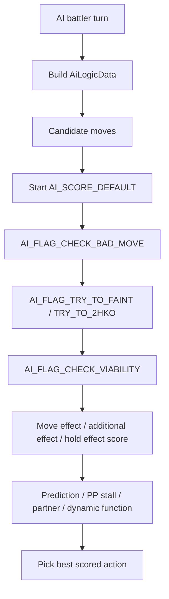
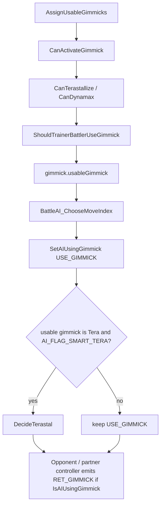

# Battle AI Decision Flow v15

調査日: 2026-05-04。現時点では実装なし。

## Purpose

NPC trainer AI が技選択、交代、double battle の味方連携をどう評価しているか整理する。今後「人間味のある引っ込め」「double battle の改善」「独自思考の差し込み」を行う時の入口にする。

## Key Files

| File | Role |
|---|---|
| `include/constants/battle_ai.h` | `AI_FLAG_*` と `AI_SCORE_DEFAULT`。 |
| `include/config/ai.h` | 交代確率、予測確率、double battle 調整値。 |
| `include/battle_ai_main.h` | scoring 関数型と score 定数。 |
| `include/battle_ai_switch.h` | `ShouldSwitchScenario`, `SwitchType`, `ShouldSwitch`, `GetMostSuitableMonToSwitchInto`。 |
| `src/battle_ai_main.c` | move scoring 本体。`AI_CheckViability`, `AI_PredictSwitch`, `AI_AttacksPartner`, dynamic AI。 |
| `src/battle_ai_switch.c` | mid-battle switch / switch-in candidate 評価。 |
| `src/battle_ai_util.c` | damage / ability / partner / prediction helper。 |
| `src/battle_ai_field_statuses.c` | weather / terrain scoring。 |
| `src/battle_ai_items.c` | item use AI。 |
| `src/battle_gimmick.c` | `AssignUsableGimmicks`、`ShouldTrainerBattlerUseGimmick`、gimmick activation state。 |
| `src/battle_terastal.c`, `src/battle_dynamax.c` | `CanTerastallize` / `CanDynamax` と item / flag / trainer intent checks。 |
| `docs/tutorials/ai_flags.md` | AI flags の既存解説。 |

## Current Flag Shape

`AI_FLAG_SMART_TRAINER` は現行の標準的な smart AI 入口。

```c
AI_FLAG_BASIC_TRAINER
| AI_FLAG_OMNISCIENT
| AI_FLAG_SMART_SWITCHING
| AI_FLAG_SMART_MON_CHOICES
| AI_FLAG_PP_STALL_PREVENTION
| AI_FLAG_SMART_TERA
| AI_FLAG_RANDOMIZE_SWITCHIN
```

重要な分離:

| Flag | Meaning |
|---|---|
| `AI_FLAG_SMART_SWITCHING` | いつ交代するか。自動で `AI_FLAG_SMART_MON_CHOICES` も使う。 |
| `AI_FLAG_SMART_MON_CHOICES` | 交代先 / KO 後の出す Pokemon を賢く選ぶ。 |
| `AI_FLAG_RANDOMIZE_SWITCHIN` | 同種の候補からランダムに選び、毎回最後の候補になる挙動を避ける。 |
| `AI_FLAG_PREDICT_SWITCH` | player が交代すると読むか。既定 config は `PREDICT_SWITCH_CHANCE 50`。 |
| `AI_FLAG_PREDICT_INCOMING_MON` | 交代読み時に交代先候補へ scoring 対象を移す。 |
| `AI_FLAG_PREDICT_MOVE` | player の技を予測する。 |
| `AI_FLAG_DOUBLE_BATTLE` | double 用 scoring。double battle で自動設定される。 |
| `AI_FLAG_ATTACKS_PARTNER` | ally を攻撃対象にできる特殊 double AI。 |

## Move Scoring Flow

技選択は、候補 move に `AI_SCORE_DEFAULT` を置き、AI flag に応じて score を加減する。



主な hook:

| Hook | Purpose |
|---|---|
| `AI_CheckViability` | move effect、追加効果、hold effect の評価をまとめる。 |
| `AI_CalcMoveEffectScore` | move effect ごとの加点・減点。 |
| `AI_CalcAdditionalEffectScore` | secondary effect の加点・減点。 |
| `CalcWeatherScore` | weather / terrain 系の評価。 |
| `AI_PredictSwitch` | player switch prediction。 |
| `AI_CheckPpStall` | absorbed move を繰り返す player への対策。 |
| `AI_DynamicFunc` | `AI_FLAG_DYNAMIC_FUNC` で特定 battle 向け custom scoring を呼ぶ。 |

## Switch Flow

交代判断は move scoring と別に `ShouldSwitch()` / `GetMostSuitableMonToSwitchInto()` を見る。

`include/battle_ai_switch.h` の `ShouldSwitchScenario` には以下がある。

| Scenario group | Examples |
|---|---|
| hard counter | `SHOULD_SWITCH_WONDER_GUARD`, `SHOULD_SWITCH_ABSORBS_MOVE`, `SHOULD_SWITCH_TRAPPER` |
| bad state | `PERISH_SONG`, `YAWN`, `BADLY_POISONED`, `CURSED`, `NIGHTMARE`, `SEEDED`, `INFATUATION` |
| bad move state | `ALL_MOVES_BAD`, `CHOICE_LOCKED`, `ALL_SCORES_BAD` |
| stats / odds | `ATTACKING_STAT_MINUS_TWO`, `HASBADODDS` |
| beneficial ability | `NATURAL_CURE_*`, `REGENERATOR_*` |
| custom | `SHOULD_SWITCH_DYN_FUNC` |

`include/config/ai.h` で scenario ごとの発動率が定義されている。人間味を出す場合、まずこの chance を使うのが安全。

例:

| Config | Current value | Meaning |
|---|---:|---|
| `SHOULD_SWITCH_HASBADODDS_PERCENTAGE` | `50` | bad odds で交代する確率。 |
| `SHOULD_SWITCH_FREE_TURN_PERCENTAGE` | `50` | free turn 交代の確率。 |
| `SHOULD_SWITCH_ALL_MOVES_BAD_PERCENTAGE` | `100` | 有効技がない場合の交代率。 |
| `STAY_IN_STATS_RAISED` | `2` | 能力上昇がある場合に居座るしきい値。 |

## Double Battle Notes

double battle は single より難しい。既存 code は partner を見る helper を持つが、全機能が double に完全対応しているわけではない。

確認済みの注意点:

- `AI_FLAG_DOUBLE_BATTLE` は double battle で自動設定される。
- `HasPartner()` は ally が生存していて、かつ `AI_FLAG_ATTACKS_PARTNER` ではない場合に partner として扱う。
- `HasPartnerIgnoreFlags()` は `AI_FLAG_ATTACKS_PARTNER` を無視して partner を見る。
- `AI_FLAG_ATTACKS_PARTNER` は ally 攻撃を許す特殊用途。ability absorption / Weakness Policy 起動などを作れるが、通常 trainer へ雑に付けると危険。
- `AI_FLAG_SMART_TERA` は既存 docs で double battle 未対応と明記されている。
- `include/config/ai.h` には friendly fire threshold、Trick Room / Tailwind の double 用 chance がある。

double で「人間味」を増やす候補:

| Candidate | Safer first step |
|---|---|
| friendly fire を減らす | `FRIENDLY_FIRE_*_THRESHOLD` と spread move scoring を調整。 |
| 交代を増やす | `SHOULD_SWITCH_HASBADODDS_PERCENTAGE` と switch-in 評価を調整。 |
| 毎回同じ交代先を避ける | `AI_FLAG_RANDOMIZE_SWITCHIN` を使う。 |
| player の交代読み | `AI_FLAG_PREDICT_SWITCH` / `AI_FLAG_PREDICT_INCOMING_MON` を trainer ごとに付与。 |
| 特定施設だけ賢くする | `AI_FLAG_DYNAMIC_FUNC` を使い、対象 battle だけ custom scoring。 |

## Gimmick Timing / Tera / Dynamax

現状の gimmick 判断は「使えるか」と「今使うべきか」が完全には分離されていない。

確認した flow:



重要な問題点:

| Area | Current behavior / risk |
|---|---|
| trainer intent | `ShouldTrainerBattlerUseGimmick` は `opponentMonCanTera` / `opponentMonCanDynamax` を見るだけで、発動タイミングの評価ではない。 |
| default AI state | `BattleAI_ChooseMoveIndex` は最初に `SetAIUsingGimmick(USE_GIMMICK)` する。smart 判定が走らない gimmick は「使えるなら使う」に寄りやすい。 |
| Terastal | `AI_FLAG_SMART_TERA` と `DecideTerastal` はあるが、現状 TODO 付きで single 1v1 前提。double battle では判断せず早期 return するため、初期 `USE_GIMMICK` が残りやすい。 |
| Dynamax | `CanDynamax` は item / flag / trainer intent / used state を見るが、`DecideDynamax` 相当の timing evaluation は確認できなかった。 |
| Reconsider | `ReconsiderGimmick` は Tera + Protect など一部だけを止める。温存、相手の切り返し、double partner 状態までは見ない。 |

要望としては、Tera / Dynamax を「許可されているから即使用」ではなく、局面を見て発動してほしい。今後の修正候補は、activation gate ではなく **AI timing decision** として分離する。

候補設計:

| Candidate | Role |
|---|---|
| `DecideBattleGimmick(battler, gimmick)` | Tera / Dynamax / Mega / Z を共通入口で判断する。 |
| `DecideDynamax` | Dynamax 専用。3 turn 制限、HP doubling、Max Move 追加効果、相手の残数、last mon を見る。 |
| expanded `DecideTerastal` | double battle、partner safety、相手 2 体の threat、Tera 後の耐性悪化、Tera Blast / Stellar などを評価する。 |
| trainer policy enum | Immediate / Smart / AceOnly / LastMon / Scripted のように trainer party data か dynamic AI で指定する。 |
| dynamic AI hook | facility / boss / rival だけ発動タイミングを上書きする。 |

評価項目候補:

| Signal | Why |
|---|---|
| Tera / Dynamax で KO が取れる | 攻撃的な即発動理由。 |
| 発動しないと KO されるが、発動すると耐える | 防御的な発動理由。 |
| 発動しても別技で KO される | 温存または交代候補。 |
| 相手が Protect / switch しそう | 無駄撃ち回避。prediction flags と接続。 |
| 残り Pokemon 数 / ace 状態 | ace や最後の 1 体まで温存。 |
| double partner の行動 | spread move、味方 support、集中攻撃を考慮。 |
| field / weather / terrain / screens | Max Move 追加効果や Tera defensive value に影響。 |

最初の修正としては、Dynamax にも smart flag / decide 関数を足し、Tera の double battle early return 時に初期 `USE_GIMMICK` が残らないようにする方針が安全。完全な現代対戦AIではなく、「明確な得がある時だけ使う」「明確な損がある時は使わない」「ace / last mon は温存しやすい」から始める。

## Dynamic AI Functions

特定 battle だけ独自判断を足したい場合は `AI_FLAG_DYNAMIC_FUNC` が既存の余白になる。

用途例:

- Battle Factory / rogue-like facility の特定 wave だけ交代を強める。
- double battle で片方を温存する。
- 「相手が明らかに不利なら 50% で引く」など、動画分析に基づく heuristics を追加する。

実装前に見るもの:

- `docs/tutorials/ai_dynamic_functions.md`
- `AI_DynamicFunc` in `src/battle_ai_main.c`
- dynamic AI function 登録 script / special の既存例

## Recommended Direction

最初から現代対戦AIを完全再現するのは重い。段階を分ける。

1. trainer data に `AI_FLAG_SMART_TRAINER | AI_FLAG_RANDOMIZE_SWITCHIN` を適用できる範囲を確認。
2. `include/config/ai.h` の switch chance を調整し、single で人間味を確認。
3. double は friendly fire / support move / spread move の破綻ケースをテスト化。
4. Tera / Dynamax の smart timing を足し、許可済み mon が即発動しすぎる挙動を抑える。
5. 施設専用に `AI_FLAG_DYNAMIC_FUNC` を使う。
6. 動画・画像フレーム由来の判断を使う場合は、feature-specific scoring helper として分離する。

## Open Questions

- どの trainer / facility だけ AI を強くするか。
- 「人間味」を勝率、交代頻度、ランダム性、温存行動のどれで測るか。
- double battle は friendly fire 回避を優先するか、combo 起動を許すか。
- Tera / Dynamax は Immediate / Smart / AceOnly / LastMon / Scripted のような trainer policy を持たせるか。
- 動画分析から得た判断を static table にするか、dynamic function にするか。
