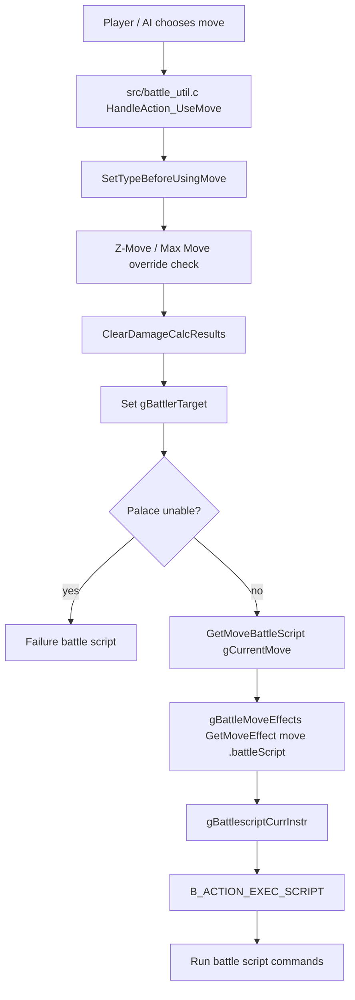
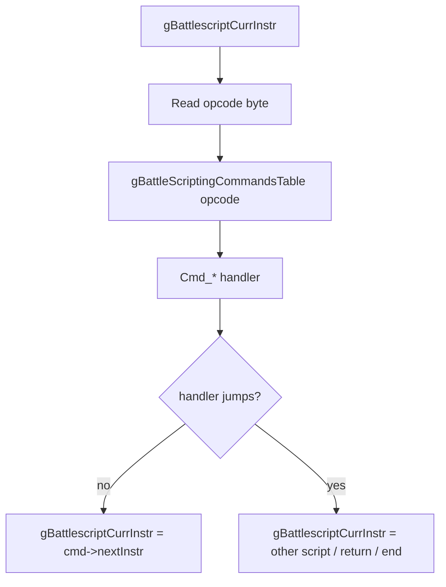
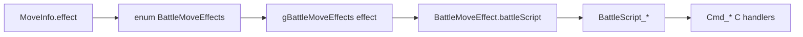
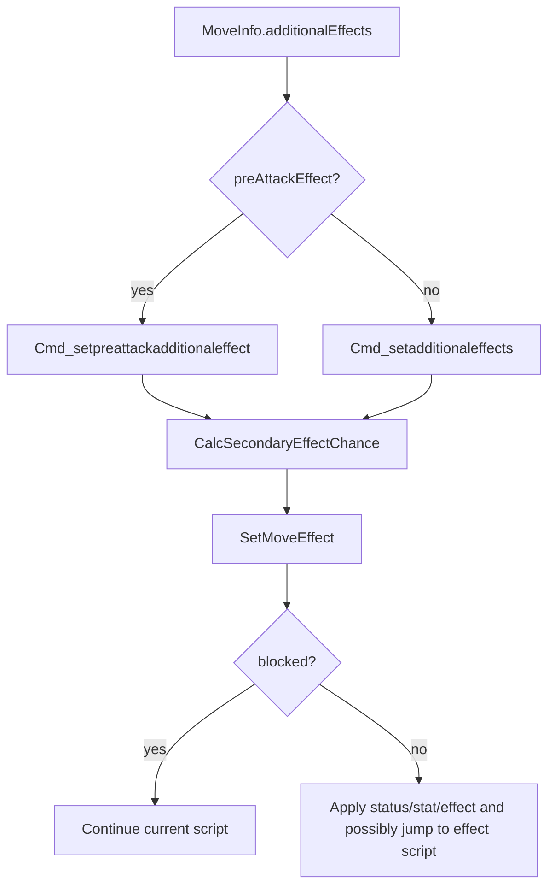
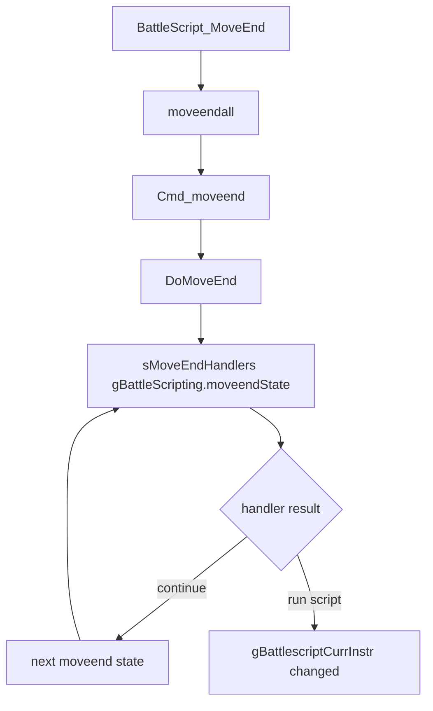
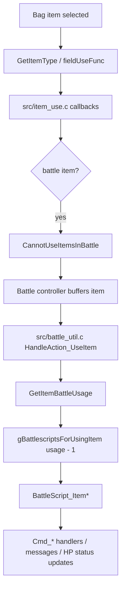
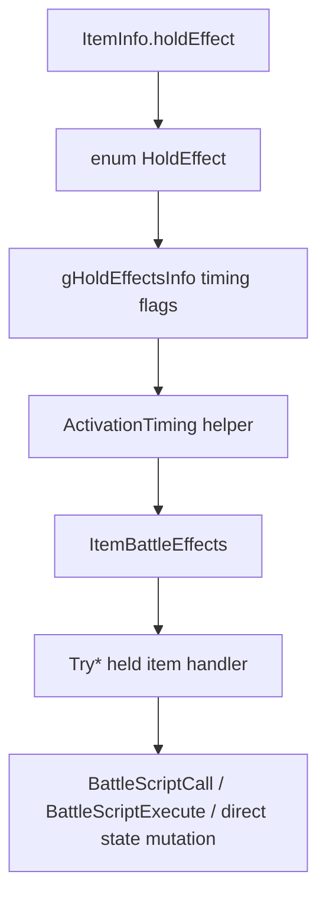
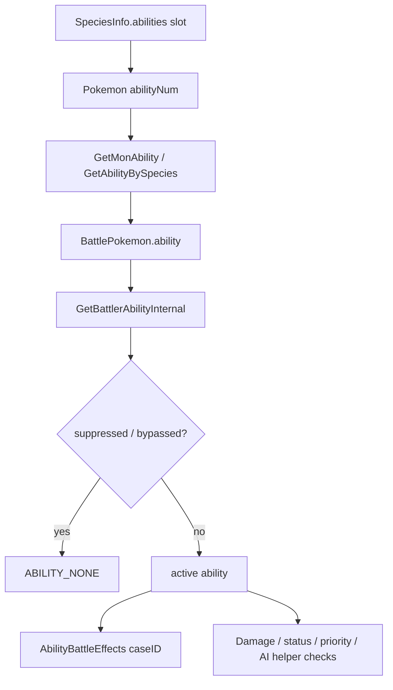
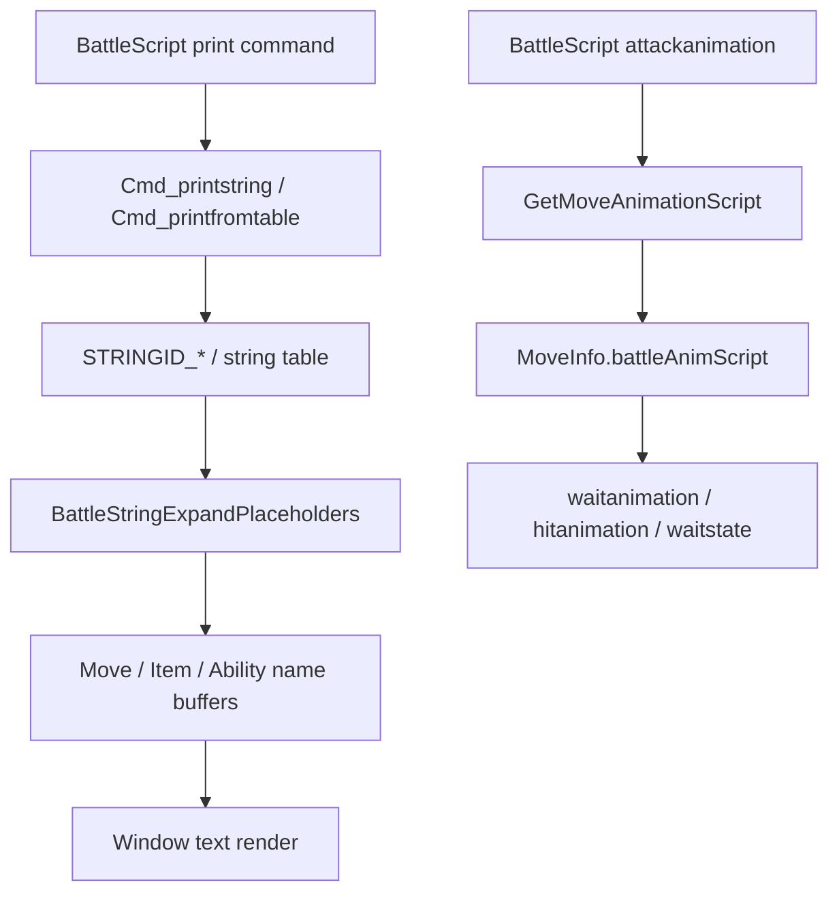

# Battle Effect Resolution Flow v15

## Purpose

MoveInfo、item header、ability header に書かれた定義が、実際の battle effect、battle script、C handler、message、animation、AI にどう流れるか整理する。

この文書は source 読解メモであり、現時点では実装変更はしない。

## Key Files

| File | Role |
|---|---|
| `include/move.h` | `MoveInfo`, `AdditionalEffect`, `BattleMoveEffect`, move getter functions. |
| `src/data/moves_info.h` | `gMovesInfo[MOVES_COUNT_ALL]` data. |
| `src/data/battle_move_effects.h` | `gBattleMoveEffects[NUM_BATTLE_MOVE_EFFECTS]`, effect -> battle script table. |
| `data/battle_scripts_1.s` | Main move battle scripts, including `BattleScript_EffectHit` and `BattleScript_MoveEnd`. |
| `data/battle_scripts_2.s` | Item battle script table and item scripts. |
| `include/constants/battle_script_commands.h` | `enum BattleScriptOpcode`, `enum SetMoveEffectFlags`. |
| `src/battle_script_commands.c` | `gBattleScriptingCommandsTable`, `Cmd_*` handlers, `SetMoveEffect`. |
| `src/battle_util.c` | `HandleAction_UseMove`, `HandleAction_UseItem`, `AbilityBattleEffects`, `GetBattlerAbilityInternal`, many battle helpers. |
| `src/battle_move_resolution.c` | `DoMoveEnd`, move-end handler table, item / ability hooks after moves. |
| `src/battle_hold_effects.c` | `ItemBattleEffects` and held-item effect handlers. |
| `include/item.h` | `ItemInfo`, item getters, TM/HM mapping helpers. |
| `src/item_use.c` | Item use validation and callback routing. |
| `include/pokemon.h` | `AbilityInfo`, species ability slots, Pokemon / BattlePokemon ability fields. |
| `src/data/abilities.h` | `gAbilitiesInfo[ABILITIES_COUNT]`. |
| `src/battle_message.c` | `BattleStringExpandPlaceholders`, battle message expansion. |

## Move Use Flow



Confirmed details:

- `HandleAction_UseMove` sets `gCurrentMove`, `gChosenMove`, dynamic type, gimmick overrides, target, and `gBattlescriptCurrInstr`.
- Normal path uses `gBattlescriptCurrInstr = GetMoveBattleScript(gCurrentMove)`.
- `GetMoveBattleScript` indexes `gBattleMoveEffects[GetMoveEffect(moveId)].battleScript`.
- Battle Palace can replace the move script with loafing / incapable scripts before normal move execution.

Risk:

- A custom move can enter a completely different script path if its `MoveInfo.effect` points to a different `BattleMoveEffects`.
- Z-Move / Max Move conversion occurs before battle script selection, so custom move behavior may differ under gimmicks.
- Dynamic type is set before using the move. Type-changing moves/items/abilities must be tested with `GetBattleMoveType`, not only `GetMoveType`.

## Battle Script Dispatch

`src/battle_script_commands.c` confirms:

- `gBattlescriptCurrInstr` points at the current bytecode instruction in a battle script.
- `CMD_ARGS(...)` overlays a packed command struct on `gBattlescriptCurrInstr`.
- `cmd->nextInstr` is the next script instruction.
- `gBattleScriptingCommandsTable[]` maps `B_SCR_OP_*` opcodes to `Cmd_*` C functions.
- `RunBattleScriptCommands` / battle action execution repeatedly calls `gBattleScriptingCommandsTable[*gBattlescriptCurrInstr]()`.

Simplified flow:



Risk:

- Battle scripts look declarative, but most commands mutate globals and may call C helpers with side effects.
- A new battle script command requires opcode, macro support, command table entry, handler, and tests. Existing docs `tutorials/how_to_battle_script_command_macro.md` should be consulted before implementation.

## Generic Hit Script

Confirmed in `data/battle_scripts_1.s`:

```text
BattleScript_EffectHit:
    attackcanceler
    accuracycheck
    copybyte gEffectBattler, gBattlerAttacker
    setpreattackadditionaleffect
    damagecalc
    call BattleScript_Hit_RetFromAtkAnimation
BattleScript_MoveEnd:
    moveendall
    end
```

`BattleScript_Hit_RetFromAtkAnimation` performs:

1. `attackanimation`
2. `waitanimation`
3. `effectivenesssound`
4. `hitanimation BS_TARGET`
5. `waitstate`
6. `healthbarupdate`
7. `datahpupdate`
8. `critmessage`
9. `resultmessage`
10. `setadditionaleffects`
11. `return`

Implications:

- Move effect, damage, animation, healthbar update, message, and secondary effect are interleaved.
- Animation mismatches can come from `MoveInfo.battleAnimScript`, `attackanimation`, `hitanimation`, field/battler state, or a script that jumps around the generic hit path.
- A custom move that reuses `BattleScript_EffectHit` still needs correct `MoveInfo` flags and `AdditionalEffect` data.

## Primary Move Effect Path

Primary effect path:



Examples:

| `BattleMoveEffects` | Script | Notes |
|---|---|---|
| `EFFECT_HIT` | `BattleScript_EffectHit` | Generic damage flow. |
| `EFFECT_ABSORB` | `BattleScript_EffectHit` | Generic damage flow plus absorb handling during move-end. |
| `EFFECT_NON_VOLATILE_STATUS` | `BattleScript_EffectNonVolatileStatus` | Status-focused path. |
| `EFFECT_DREAM_EATER` | `BattleScript_EffectDreamEater` | Dedicated script. |

Risk:

- Some effects share scripts but diverge in C helpers or move-end logic.
- `BattleMoveEffect` metadata affects systems outside direct battle effect, including Encore encouragement and two-turn/semi-invulnerable behavior.

## Additional Effect Path

Additional effects use `enum MoveEffect`, not `enum BattleMoveEffects`.



Confirmed checks:

| Layer | Checks / behavior |
|---|---|
| `Cmd_setpreattackadditionaleffect` | Runs before damage, iterates additional effects, respects `preAttackEffect`, `self`, chance, `EFFECT_PRIMARY`, `EFFECT_CERTAIN`. |
| `Cmd_setadditionaleffects` | Runs after hit, skips if target unaffected, calls `CanApplyAdditionalEffect`, handles Toxic Chain priority, chance, `self`. |
| `CanApplyAdditionalEffect` | Filters pre-attack effects, Toxic Chain priority, spread self effects, `onlyIfTargetRaisedStats`, `onChargeTurnOnly`. |
| `SetMoveEffect` | Blocks through target ability/item effects, Sheer Force, fainted targets, Substitute, Safeguard, status immunity, etc. |
| `CalcSecondaryEffectChance` | Doubles chance for Serene Grace and Rainbow side status where applicable. |

Risk:

- Adding a new secondary effect may require changes to both data and `SetMoveEffect`.
- A move's expected secondary effect can silently not happen because of target ability, held item, Sheer Force, Substitute, Safeguard, target fainting, or `CanApplyAdditionalEffect`.
- `chance = 0` means primary / certain effect semantics, not 0 percent chance.

## Move End Flow

`data/battle_scripts_1.s` generic path calls `moveendall`, which reaches `DoMoveEnd` through `Cmd_moveend`.

Confirmed `src/battle_move_resolution.c` flow:



Representative `sMoveEndHandlers` entries:

| Handler state | Why it matters |
|---|---|
| `MOVEEND_SET_VALUES` | Sets end-of-move state. |
| `MOVEEND_PROTECT_LIKE_EFFECT` | Protect-like side effects. |
| `MOVEEND_ABSORB` | Absorb / drain resolution. |
| `MOVEEND_ABILITIES` | Target ability effects. |
| `MOVEEND_FORM_CHANGE_ON_HIT` | Form change after hit. |
| `MOVEEND_ABILITIES_ATTACKER` | Attacker ability effects. |
| `MOVEEND_ITEM_EFFECTS_TARGET` | Target held item after-hit effects. |
| `MOVEEND_ITEM_EFFECTS_ATTACKER_1` / `MOVEEND_ITEM_EFFECTS_ATTACKER_2` | Attacker held item effects. |
| `MOVEEND_HP_THRESHOLD_ITEMS_TARGET` | Berries / threshold items. |
| `MOVEEND_ABILITY_EFFECT_FOES_FAINTED` | Moxie-like / Battle Bond / Magician style cases. |
| `MOVEEND_COLOR_CHANGE` | Color Change / Berserk / Anger Shell grouping. |
| `MOVEEND_LIFE_ORB_SHELL_BELL` | Life Orb / Shell Bell. |
| `MOVEEND_ITEMS_EFFECTS_ALL` | Items affecting all battlers. |
| `MOVEEND_WHITE_HERB` | White Herb. |
| `MOVEEND_OPPORTUNIST` | Opportunist. |
| `MOVEEND_MIRROR_HERB` | Mirror Herb. |
| `MOVEEND_DANCER` | Dancer. |
| `MOVEEND_PURSUIT_NEXT_ACTION` | Pursuit switch interaction. |

Risk:

- A custom move can appear correct up to damage and then break in move-end through item/ability/form-change hooks.
- Trainer battle selection that temporarily rebuilds `gPlayerParty` must preserve enough party/battler index state for move-end effects that refer back to party data.
- Double battles have more move-end side effects because spread moves and partner slots increase `gBattlerTarget` / side interactions.

## Item Use Flow



Confirmed validation in `CannotUseItemsInBattle`:

| Item usage | Checked conditions |
|---|---|
| `EFFECT_ITEM_INCREASE_STAT` | HP, party slot, max stat stage. |
| `EFFECT_ITEM_SET_FOCUS_ENERGY` | HP, slot, Dragon Cheer / Focus Energy volatile. |
| `EFFECT_ITEM_SET_MIST` | Side already has Mist. |
| `EFFECT_ITEM_ESCAPE` | Fails in trainer battles. |
| `EFFECT_ITEM_THROW_BALL` | Ball throwable state, double battle restrictions, box space, semi-invulnerable target, disabled flag. |
| `EFFECT_ITEM_RESTORE_HP` | Target fainted or full HP. |
| `EFFECT_ITEM_CURE_STATUS` | Status / volatile check. |
| `EFFECT_ITEM_REVIVE` | Target must be fainted. |
| `EFFECT_ITEM_RESTORE_PP` | PP already full checks. |

Risk:

- Item behavior is split between `ItemInfo.battleUsage`, item effect bytes, validation logic, battle script, and AI.
- Trainer battle item rules are hard-coded in validation for escape items and Poké Balls.
- Shop/mart additions that sell TMs/items do not automatically validate battle/field behavior.

## Held Item Flow



Confirmed activation timing helpers include:

- `IsOnSwitchInActivation`
- `IsMirrorHerbActivation`
- `IsWhiteHerbActivation`
- `IsWhiteHerbEndTurnActivation`
- `IsOnStatusChangeActivation`
- `IsOnHpThresholdActivation`
- `IsOnTargetHitActivation`
- `IsOnAttackerAfterHitActivation`
- `IsLifeOrbShellBellActivation`
- `IsLeftoversActivation`
- `IsOrbsActivation`
- `IsOnEffectActivation`
- `IsOnFlingActivation`
- `IsBoosterEnergyActivation`

Important behavior:

- Berry/Fling activation uses `gLastUsedItem`.
- Normal held-item activation uses `gBattleMons[itemBattler].item`.
- Unnerve can block activation.
- Most held-item effects do not run for fainted battlers, with explicit exceptions for Rowap Berry, Jaboca Berry, and Rocky Helmet.

Risk:

- Adding a new held item without timing flags will leave it inert.
- Adding a timing flag without implementation can route into `ItemBattleEffects` but do nothing.
- AI references `GetItemHoldEffect` and `GetItemHoldEffectParam`; battle behavior and AI behavior can diverge if AI is not updated.

## Ability Flow



Confirmed ability selection:

- `struct SpeciesInfo` has `abilities[NUM_ABILITY_SLOTS]`.
- `PokemonSubstruct3::abilityNum` and `BattlePokemon.abilityNum` are 2-bit fields.
- `GetAbilityBySpecies(species, abilityNum)` gets the requested slot, falls back to hidden/non-empty slots if needed, then returns the first non-empty ability.
- `GetMonAbility` reads `MON_DATA_SPECIES` and `MON_DATA_ABILITY_NUM`, then calls `GetAbilityBySpecies`.
- `CreateNPCTrainerPartyFromTrainer` sets trainer ability by finding its slot in the species ability list, then stores `MON_DATA_ABILITY_NUM`.

Confirmed active ability checks:

| Function | Role |
|---|---|
| `GetBattlerAbilityInternal` | Applies Ability Shield, `cantBeSuppressed`, Gastro Acid, Neutralizing Gas, Mold Breaker-style bypass. |
| `AbilityBattleEffects` | Central switch-in / move-end / end-turn / weather / terrain / status ability dispatcher. |
| `CanBreakThroughAbility` | Checks `gBattleStruct->moldBreakerActive` and `gAbilitiesInfo[ability].breakable`. |

Risk:

- `gAbilitiesInfo` flags influence whether an ability can be copied, suppressed, traced, overwritten, or bypassed, but do not implement most behavior.
- Custom abilities must be checked in both "active ability" helpers and case-specific behavior.
- Battle AI uses `gAbilitiesInfo[ability].aiRating` and direct ability checks. A new ability with missing AI handling may make trainer behavior poor or incorrect.

## Battle Messages and Animation



Confirmed files/symbols:

| Area | Files / symbols |
|---|---|
| String IDs | `include/constants/battle_string_ids.h`, `STRINGID_TABLE_START` |
| Placeholder buffers | `include/battle_message.h`, `PREPARE_MOVE_BUFFER`, `PREPARE_ITEM_BUFFER`, `PREPARE_ABILITY_BUFFER` |
| Expansion | `src/battle_message.c`, `BattleStringExpandPlaceholders` |
| Animation script pointer | `MoveInfo.battleAnimScript`, `GetMoveAnimationScript` |
| Generic animation commands | `data/battle_scripts_1.s`, `attackanimation`, `hitanimation`, `waitanimation`, `waitstate` |

Risk:

- New custom names can overflow or wrap badly even when logic compiles.
- Battle message IDs must be added below `STRINGID_TABLE_START` according to the local comment.
- Animation and hit state can desync if a custom battle script skips `waitanimation`, `hitanimation`, `waitstate`, `healthbarupdate`, or `datahpupdate`.
- Field HM action animations are separate from battle move animations and should be documented/tested separately before removing HM field usage.

## Trainer Battle Impact

Move/item/ability changes affect trainer battles through at least these paths:

| Path | Why it matters |
|---|---|
| `CreateNPCTrainerPartyFromTrainer` | Trainer `species`, `heldItem`, `ability`, `moves`, Tera, Dynamax, pool index are converted into `gEnemyParty`. |
| `CustomTrainerPartyAssignMoves` | If trainer move list is empty, it calls `GiveMonInitialMoveset`; otherwise it sets exact moves and PP through `GetMovePP`. |
| `DoTrainerPartyPool` | Pool/randomization can change which `TrainerMon` entries enter battle. |
| `src/battle_ai_*.c` | AI reads move effects, move power/type/category, held item effects, item battle usage, and ability AI ratings. |
| Battle item validation | Trainer battles reject some item behaviors such as escape items and trainer-ball rules. |
| UI / preview | Any future opponent party preview must decide whether it displays raw trainer data or post-pool generated `gEnemyParty`. |

Potential conflict with pre-battle selection:

- Battle selection wants temporary `gPlayerParty` modification.
- Battle effect resolution expects stable battler party indexes and party data for HP/status/PP/item/ability updates.
- Held item and ability effects may mutate state after damage, so post-battle restoration must copy back the selected mons after all move-end / battle-end effects have completed.

## Randomizer / Custom Data Notes

Trainer randomizer:

- Randomizing trainer moves must ensure `MOVE_NONE` sentinel behavior remains intentional. `CustomTrainerPartyAssignMoves` treats all `MOVE_NONE` as "generate initial moveset".
- Randomizing held items must respect held-item storage limit and battle behavior side effects.
- Randomizing abilities should use legal species ability slots unless explicitly implementing illegal/custom ability assignment. `CreateNPCTrainerPartyFromTrainer` currently asserts if an explicit trainer ability is not found in the species ability list.

Wild randomizer:

- Wild Pokemon do not use trainer party creation, but they still use `MoveInfo`, `ItemInfo` held item data, `AbilityInfo`, species data, and save storage limits.
- DexNav and Pokedex area display can diverge from runtime randomization if only wild encounter generation is changed.

TM/HM / shop customization:

- TM/HM item behavior is linked through `FOREACH_TM`, `FOREACH_HM`, `gTMHMItemMoveIds`, `ItemUseOutOfBattle_TMHM`, `ItemUseCB_TMHM`, bag capacity, move relearner, and map item scripts.
- Moving TMs to shops is a source-data/script issue first, but item UI, learnability, relearner, and flags must still be checked.

## Open Questions

- Which custom move effects can reuse `BattleScript_EffectHit` safely, and which need new battle scripts?
- Which custom ability designs can fit into existing `AbilityBattleEffects` case IDs, and which need new hook points?
- If trainer randomizer assigns illegal abilities, should it bypass species ability slots or extend trainer party creation intentionally?
- If item IDs exceed held-item storage, should the project ban high-ID items from being held or change save layout?
- For opponent party preview, should the preview be based on generated `gEnemyParty` after `DoTrainerPartyPool`, or on source `TrainerMon` data before generation?
- After 1.15.2 upgrade, re-run this investigation against changed battle files before implementing custom move/item/ability behavior.
