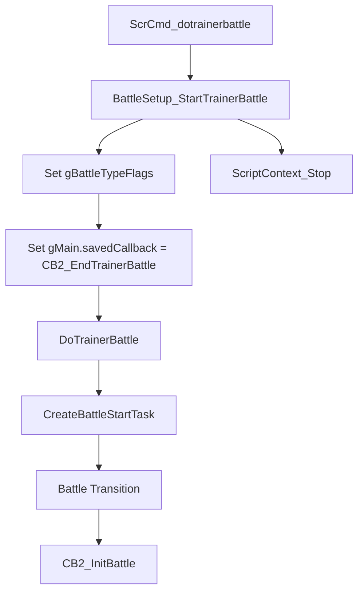
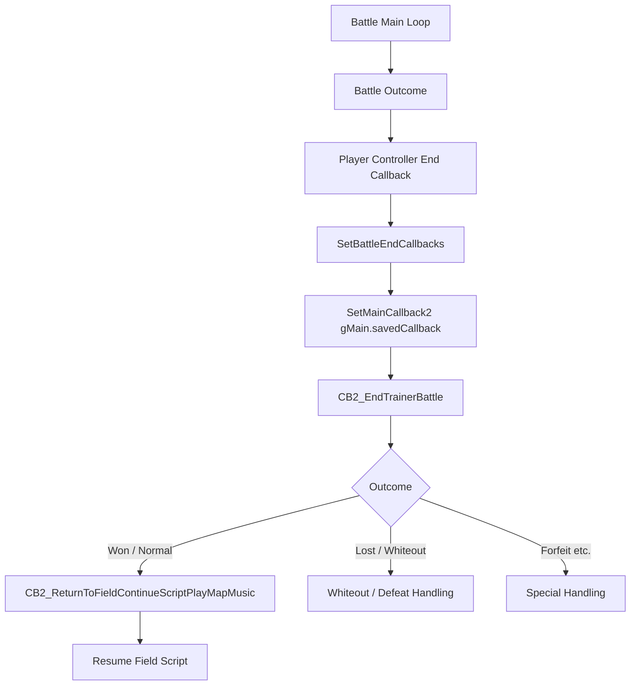

# Battle Start / End Flow v15

## Purpose

trainer battle が開始してから終了し field script へ戻るまでの C 側 flow と、`gPlayerParty` / `gEnemyParty` の扱いを整理する。

トレーナーバトル前選出では、battle 開始前に一時的な `gPlayerParty` を構築し、battle 終了後に選出個体の状態を元 slot へ戻してから元の 6 匹構成を復元する必要がある。

## Key Files

| File | Role |
|---|---|
| `src/battle_setup.c` | `BattleSetup_StartTrainerBattle`、`DoTrainerBattle`、`CB2_EndTrainerBattle` |
| `src/battle_main.c` | `CB2_InitBattle`、`CB2_InitBattleInternal`、battle callbacks、enemy party 作成 |
| `src/battle_controller_player.c` | player controller の battle 終了 callback |
| `include/constants/battle.h` | `BATTLE_TYPE_*`、battle outcome constants |
| `src/pokemon.c` | `gPlayerParty`、`gEnemyParty`、party count helpers |
| `src/load_save.c` | `SavePlayerParty`、`LoadPlayerParty` |
| `src/script_pokemon_util.c` | `ReducePlayerPartyToSelectedMons` |

## Battle Start Flow

`src/battle_setup.c` の `BattleSetup_StartTrainerBattle` が trainer battle 開始の中心。

確認済みの flow:

1. trainer count / follower partner / trainer type から `gBattleTypeFlags` を設定する。
2. trainer party type が doubles なら `BATTLE_TYPE_DOUBLE` を追加する。
3. approach trainer state を reset する。
4. `gMain.savedCallback = CB2_EndTrainerBattle`
5. `DoTrainerBattle()`
6. `ScriptContext_Stop()`

`DoTrainerBattle()` は `CreateBattleStartTask(GetTrainerBattleTransition(), 0)` を呼ぶ。

## Battle Init Flow

`src/battle_main.c`:

1. `CB2_InitBattle`
2. save blocks / heap / battle resources を初期化
3. multi / partner battle の pre-init 分岐
4. `CB2_InitBattleInternal`
5. graphics / windows / sprites / battle vars を初期化
6. trainer battle なら `CreateNPCTrainerParty` で `gEnemyParty` を作成
7. `CalculateEnemyPartyCount()`
8. `gMain.inBattle = TRUE`
9. `CB2_HandleStartBattle` 系 callback へ進む
10. `BattleMainCB1` / `BattleMainCB2` が battle main loop になる

`CB2_InitBattleInternal` では、通常 trainer battle の場合:

- `CreateNPCTrainerParty(&gEnemyParty[0], TRAINER_BATTLE_PARAM.opponentA, TRUE)`
- two opponents の場合は `&gEnemyParty[PARTY_SIZE / 2]` 側にも作成
- `CalculateEnemyPartyCount()`

`gEnemyParty` は battle init 時に構築され、`FreeRestoreBattleData` で `ZeroEnemyPartyMons()` される。

## Battle End Flow

battle 終了時、player controller 側で `SetBattleEndCallbacks` が `gMain.savedCallback` へ戻す。

確認済みの主な flow:

1. battle outcome が `gBattleOutcome` へ入る。
2. palette fade / controller 終了処理。
3. `gMain.inBattle = FALSE`
4. `gMain.callback1` を復元。
5. `SetMainCallback2(gMain.savedCallback)`
6. trainer battle では `gMain.savedCallback` が `CB2_EndTrainerBattle`。
7. `CB2_EndTrainerBattle` が field return、whiteout、trainer flags などを処理する。

## CB2_EndTrainerBattle

`src/battle_setup.c` の `CB2_EndTrainerBattle` で確認した処理:

- `HandleBattleVariantEndParty()` を呼ぶ。
- follower party restore が必要な場合は復元する。
- early rival tutorial の分岐。
- secret base battle の分岐。
- forfeit / lost / whiteout 系の分岐。
- 通常勝利時は `SetMainCallback2(CB2_ReturnToFieldContinueScriptPlayMapMusic)`。
- `DowngradeBadPoison()`。
- `RegisterTrainerInMatchCall()`。
- `SetBattledTrainersFlags()`。

トレーナーバトル前選出の復元処理は、`CB2_EndTrainerBattle` より前に行うか、`CB2_EndTrainerBattle` の先頭付近へ入れるか、専用 wrapper callback を挟むかを設計する必要がある。

## Player and Enemy Party Data

### gPlayerParty

`src/pokemon.c`:

- `struct Pokemon gPlayerParty[PARTY_SIZE]`
- `u8 gPlayerPartyCount`
- `CalculatePlayerPartyCount()`
- `ZeroPlayerPartyMons()`

`gPlayerParty` は field / menu / battle で共有される live party data。通常 trainer battle 前選出で一時的に書き換える場合、元 party を完全に保持し、battle 後の変化を正しい元 slot へ戻す必要がある。

### gEnemyParty

`src/pokemon.c`:

- `struct Pokemon gEnemyParty[PARTY_SIZE]`
- `u8 gEnemyPartyCount`
- `CalculateEnemyPartyCount()`
- `ZeroEnemyPartyMons()`

`src/battle_main.c` の `CB2_InitBattleInternal` が trainer data から `gEnemyParty` を作る。通常の選出機能では、最初は `gEnemyParty` を表示や相手 preview へ使う可能性はあるが、MVP では直接変更しない方が安全。

## Save / Restore Helpers

`src/load_save.c`:

| Function | Notes |
|---|---|
| `SavePlayerParty` | `gPlayerParty` を `gSaveBlock1Ptr->playerParty` 側へ保存 |
| `LoadPlayerParty` | 保存済み party を `gPlayerParty` へ復元 |

`src/pokemon.c`:

| Function | Notes |
|---|---|
| `SavePlayerPartyMon` | 指定 index の saved player party mon を更新 |
| `GetSavedPlayerPartyMon` | saved party mon pointer を返す |
| `GetSavedPlayerPartyCount` | saved party count を返す |

既存 `SavePlayerParty` / `LoadPlayerParty` は強力だが、通常 trainer battle 前選出で使う場合、セーブデータ用領域を一時 scratch のように使う設計になるため慎重に扱うべき。

## Existing Subset Battle Pattern

`src/battle_setup.c` の `HandleBattleVariantEndParty()` は Sky Battle 用の特殊復元処理を持つ。

確認済み:

- `FlagGet(B_FLAG_SKY_BATTLE)` の場合に動く。
- `SaveChangesToPlayerParty()` を呼ぶ。
- `LoadPlayerParty()` を呼ぶ。
- sky battle flag を clear する。

`SaveChangesToPlayerParty()` は `B_VAR_SKY_BATTLE` の bitfield を使い、battle に参加した `gPlayerParty` 側の mon を saved party の元 slot へ戻す。

これは「一時 subset party で battle し、終了後に元 party slot へ反映する」既存 pattern として参考になる。ただし Sky Battle 専用の flag/var に依存しており、そのまま流用するのは危険。

## Battle Selection Notes

必要になりそうな処理単位:

| Phase | Required Work |
|---|---|
| Before selection | 元 `gPlayerParty` と count を保存 |
| Selection UI | 元 slot index を `gSelectedOrderFromParty` などへ保存 |
| Before battle | 選出順で一時 `gPlayerParty` を構築、`CalculatePlayerPartyCount()` |
| Battle end before restore | battle 後の選出 mon 状態を元 slot へ反映 |
| Restore | 非選出 mon を含む元 6 匹順へ `gPlayerParty` を復元、count 再計算 |
| Continue field | 既存 `CB2_EndTrainerBattle` / script flow を継続 |

## High-Risk Areas

- `gMain.savedCallback` は battle end callback と party menu callback の両方で使われる。
- `gPlayerParty` を battle 前に詰めると、battle 中の level up、move learn、evolution、held item 消費、form change、status、HP を元 slot へ戻す必要がある。
- `LoadPlayerParty()` は saved party を丸ごと復元するため、battle 後の変化を消してしまう可能性がある。
- `gEnemyParty` は battle 終了後に zero されるため、相手 party preview を後から追加する場合は作成 timing が重要。
- battle outcome が負け/whiteout/forfeit の場合でも、復元は必ず走る必要がある。

## Open Questions

- battle 終了時に、選出 Pokémon の進化や move learn がどの timing で `gPlayerParty` へ反映済みになるかは追加調査が必要。
- `SavePlayerParty` / `LoadPlayerParty` を使うべきか、専用 EWRAM buffer を用意すべきか未決定。
- battle end callback wrapper を作る場合、`CB2_EndTrainerBattle` の前後どちらへ置くのが安全か未検証。
- Sky Battle の `B_VAR_SKY_BATTLE` pattern を汎用化できるかは未確認。
