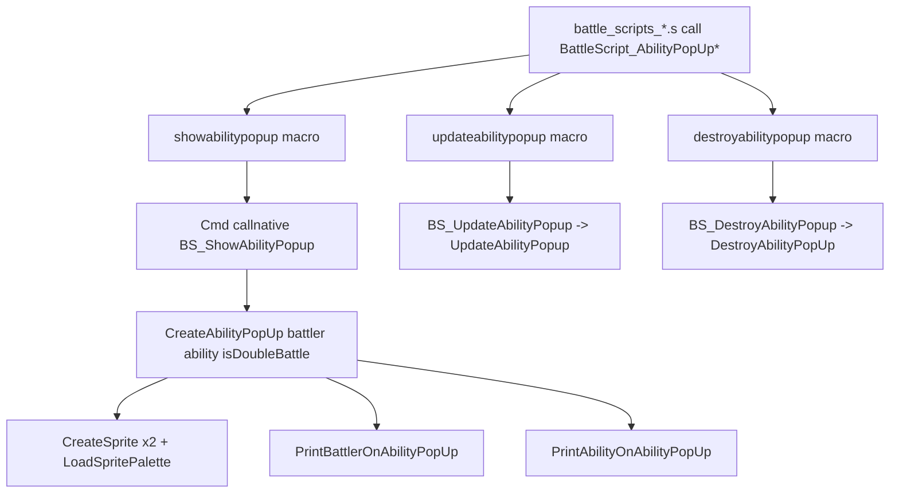
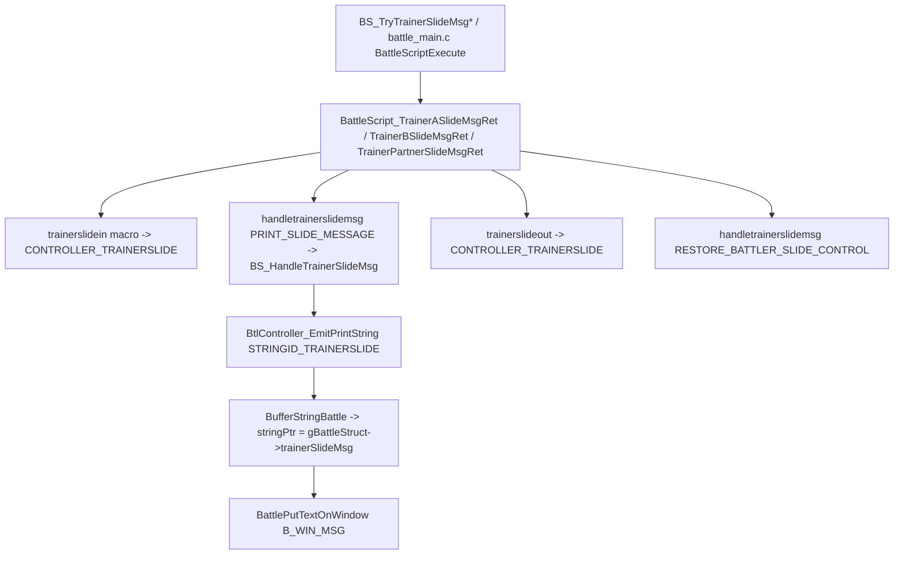
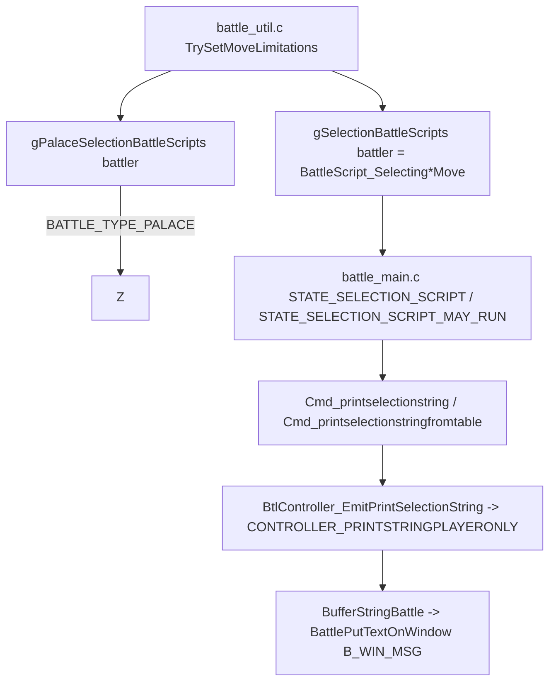
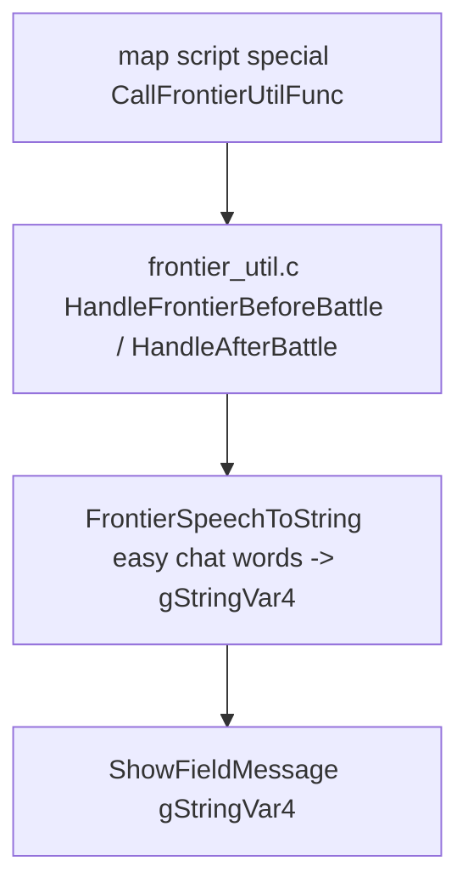

# Battle Text Routes v15

この doc は、battle 関連の「通常の `printstring` ではない」テキスト経路をまとめます。
[Message Text Manual](../manuals/message_text_manual.md) で battle / field の入口を分けたあと、
さらに細かく分岐する必要があるルートを 1 か所で確認するためのものです。

通常の battle message (move name、stat 上下、weather、status 等) は
`gBattleStringsTable[STRINGID_*]` を `printstring` / `printfromtable` で引き、
`controller -> BufferStringBattle -> BattlePutTextOnWindow(B_WIN_MSG)` の順で表示されます。
ここに記載するのは、その中央 path に乗らないものです。

## 経路の早見表

| 種類 | 入口 | 表示先 | 通常 `printstring` と違う点 |
| --- | --- | --- | --- |
| Ability popup | `showabilitypopup` macro / `CreateAbilityPopUp` | sprite + 専用 window | message box ではなく sprite。 待ち時間は固定 popup と非固定で異なる |
| Trainer slide message | `handletrainerslidemsg` macro + `STRINGID_TRAINERSLIDE` | `B_WIN_MSG` | 文字列ポインタを `gBattleStruct->trainerSlideMsg` 経由で動的に差し替える |
| Selection string | `printselectionstring` / `printselectionstringfromtable` macro | `B_WIN_MSG`、ただしプレイヤー側のみ表示 | `CONTROLLER_PRINTSTRINGPLAYERONLY` で flush。 行動確定前の interrupt |
| 直接 `BattlePutTextOnWindow` | C コードからの直接呼び | `B_WIN_*` または facility 専用 window | battle script を経由しないので `waitmessage` が効かない |
| Battle Arena judgment | `BattlePutTextOnWindow(..., ARENA_WIN_*)` | Arena 専用 window | text speed と down arrow が `B_WIN_MSG` と別ルール |
| Battle Tower / Pyramid / Pike / Trainer Hill speech | `FrontierSpeechToString` -> `gStringVar4` -> `ShowFieldMessage` | field message box | Easy Chat words からの動的生成。battle script は経由しない |

## Ability popup

呼び出し chain:

主なファイル / シンボル:

| File | Role |
| --- | --- |
| `data/battle_scripts_1.s` の末尾 (`BattleScript_AbilityPopUpTarget`, `BattleScript_AbilityPopUp`, `BattleScript_AbilityPopUpScripting`, `BattleScript_AbilityPopUpOverwriteThenNormal`) | 呼び出されるラッパー script。 各 script は呼び出し前に `gBattlerAbility` または `gBattleScripting.abilityPopupOverwrite` を別途 set してから `call` する前提。 |
| `asm/macros/battle_script.inc` (`showabilitypopup`, `updateabilitypopup`, `destroyabilitypopup`) | `callnative` 経由で C 側へ。 |
| `src/battle_script_commands.c` (`BS_ShowAbilityPopup`, `BS_UpdateAbilityPopup`, `BS_DestroyAbilityPopup`) | battle script からの entry。 `BS_ShowAbilityPopup` は `CreateAbilityPopUp(gBattlerAbility, gBattleMons[gBattlerAbility].ability, IsDoubleBattle())` を直接呼ぶだけ。 |
| `src/battle_interface.c` (`CreateAbilityPopUp`, `UpdateAbilityPopup`, `DestroyAbilityPopUp`, `Task_FreeAbilityPopUpGfx`, `SpriteCb_AbilityPopUp`) | sprite 2 枚を作って横スライドさせる。 |
| `gBattleScripting.abilityPopupOverwrite`, `gBattleScripting.fixedPopup`, `gBattleStruct->battlerState[battler].activeAbilityPopUps`, `gBattleStruct->abilityPopUpSpriteIds[battler]` | popup 1 つに対する状態。 |
| `TAG_ABILITY_POP_UP*`, `sSpriteSheet_AbilityPopUp`, `sSpritePalette_AbilityPopUp`, `ABILITY_POP_UP_POS_X_*`, `ABILITY_POP_UP_WAIT_FRAMES`, `APU_STATE_*` | sprite 側の定数。 同じ palette tag は Last Used Ball、 Move Info Window でも共有される (下記)。 |
| `IsAnyAbilityPopUpActive` | `gBattleStruct->battlerState[*].activeAbilityPopUps` を集約。 1 つでも残っていれば true。 `Task_FreeAbilityPopUpGfx` の destroy 判定と palette 解放制御に使う。 |

`Cmd` table 整理 (battle script command 一覧、参考):

- `BS_TryTrainerSlideMsgFirstOff` / `BS_TryTrainerSlideMsgLastOn` (TrainerSlide 用、 後述)
- `BS_TryTrainerSlideZMoveMsg` / `BS_TryTrainerSlideMegaEvolutionMsg` / `BS_TryTrainerSlideDynamaxMsg` (Z / Mega / Dynamax 用)
- `BS_HandleTrainerSlideMsg` (PRINT_SLIDE_MESSAGE / RESTORE_BATTLER_SLIDE_CONTROL の dispatcher)

ability popup 自体は上記のうち `BS_ShowAbilityPopup` / `BS_UpdateAbilityPopup` / `BS_DestroyAbilityPopup` の 3 native command だけ。

注意点:

- `BattleScript_AbilityPopUp` は `tryactivateabilityshield` -> `showabilitypopup` -> `pause B_WAIT_TIME_SHORT` -> `recordability` -> `sethword sABILITY_OVERWRITE, 0` -> `return` の固定列で、popup 表示と短い待ちまで含む。 通常 message との順序を変えたい場合はこの `pause` の長さに注意する。
- `BattleScript_AbilityPopUpOverwriteThenNormal` は `setbyte sFIXED_ABILITY_POPUP, TRUE` で popup を「固定表示」状態にして、`updateabilitypopup` で表示中の ability 名を差し替えてから `destroyabilitypopup` で閉じる。 Trace、Imposter のような「他 ability への上書き」用。
- `gBattleScripting.fixedPopup` が立っている間は `SpriteCb_AbilityPopUp` の `APU_STATE_IDLE` でタイマーが減らないため、`destroyabilitypopup` を呼ぶまで自動消滅しない。
- popup は battle message box (`B_WIN_MSG`) を上書きしない。 ただし `printstring` と同時に走らせると、popup の slide-in / slide-out アニメと message の出る・消えるタイミングが重なる。 既存 script では popup 後に短い `pause` を入れて message と被らないようにしている。
- `gTestRunnerEnabled` の場合は `TestRunner_Battle_RecordAbilityPopUp` に流したあと、headless なら sprite 自体を作らない。 テストでは popup を「呼んだか」だけが検査される。
- `IsAnyAbilityPopUpActive()` で初回作成時のみ palette / sheet を load する。 sprite を増やしたい / palette tag を変えたいときは `TAG_ABILITY_POP_UP*` を全部更新する。
- `BattleScript_AbilityPopUpOverwriteThenNormal` の表示順は実装上「上書き先 ability を最初に出す」: `setbyte sFIXED_ABILITY_POPUP, TRUE` -> `showabilitypopup` (このとき `gBattleScripting.abilityPopupOverwrite` が呼び出し前に set されており、 popup には overwrite 側 ability が表示される) -> `pause` -> `sethword sABILITY_OVERWRITE, 0` -> `updateabilitypopup` (overwrite が消えたので `gBattleMons[battler].ability` を表示) -> `pause` -> `recordability` -> `destroyabilitypopup` -> `setbyte sFIXED_ABILITY_POPUP, FALSE`。 つまり Trace / Imposter のように「元の ability を一瞬出してから真の ability に切り替える」演出に使う。

### 隣接の sprite-only popup (テキスト無し)

ability popup と同じ `TAG_ABILITY_POP_UP` palette を共有する sprite popup が `src/battle_interface.c` 後半にもある。 これらは `BattlePutTextOnWindow` を呼ばず、 文字列 buffer も持たない sprite だけの UI。

| 名前 | 主なシンボル | 用途 |
| --- | --- | --- |
| Last Used Ball | `TryAddLastUsedBallItemSprites`, `TryHideLastUsedBall`, `sSpriteTemplate_LastUsedBallWindow`, `sSpriteSheet_LastUsedBallWindow`, `TAG_LAST_BALL_WINDOW`, `B_LAST_USED_BALL`, `B_LAST_USED_BALL_BUTTON`, `B_LAST_USED_BALL_CYCLE`, `gBattleStruct->ballSpriteIds[]`, `gBallToDisplay` | 行動選択 menu の左下に最後に投げたボールアイコンを出す。 `CanThrowLastUsedBall` で trainer / frontier 戦は弾く。 |
| Move Info Window | `TryToAddMoveInfoWindow`, `TryToHideMoveInfoWindow`, `sSpriteTemplate_MoveInfoWindow`, `sSpriteSheet_MoveInfoWindow`, `MOVE_INFO_WINDOW_TAG`, `B_SHOW_MOVE_DESCRIPTION`, `B_MOVE_DESCRIPTION_BUTTON`, `gBattleStruct->moveInfoSpriteId` | 技選択時に L/R ボタンで move description を呼び出すための「ヒント窓」 sprite。 押した後に出す本体の説明文は `BattlePutTextOnWindow(..., B_WIN_MOVE_DESCRIPTION)` で表示 (text 経路) される。 |

palette は共通だが tile sheet (`TAG_LAST_BALL_WINDOW`, `MOVE_INFO_WINDOW_TAG`) は別。 destroy 関数で残っている popup を確認してから palette を解放する点も ability popup と同じ。

## Trainer Slide Message

呼び出し chain:

主なファイル / シンボル:

| File | Role |
| --- | --- |
| `src/trainer_slide.c` | `ShouldDoTrainerSlide`, `SetTrainerSlideMessage`, `DoesTrainerHaveSlideMessage`, `IsTrainerSlideInitialized`, `IsTrainerSlidePlayed`、ID -> 文字列の table (`sTrainerSlides`, `sFrontierTrainerSlides`, `sTestTrainerSlides`)。 |
| `include/battle.h` の `gBattleStruct->trainerSlideMsg` | `STRINGID_TRAINERSLIDE` の実体ポインタ。 |
| `data/battle_scripts_2.s` の `BattleScript_TrainerASlideMsgRet`, `BattleScript_TrainerASlideMsgEnd2`, `BattleScript_TrainerBSlideMsg*`, `BattleScript_TrainerPartnerSlideMsg*` | slide-in / message / slide-out のラッパー。 |
| `src/battle_script_commands.c` の `BS_HandleTrainerSlideMsg`, `BS_TryTrainerSlideMsgFirstOff` (= `TRAINER_SLIDE_PLAYER_LANDS_FIRST_DOWN`), `BS_TryTrainerSlideMsgLastOn` (= `TRAINER_SLIDE_LAST_SWITCHIN`), `BS_TryTrainerSlideZMoveMsg` (= `TRAINER_SLIDE_Z_MOVE`), `BS_TryTrainerSlideMegaEvolutionMsg` (= `TRAINER_SLIDE_MEGA_EVOLUTION`), `BS_TryTrainerSlideDynamaxMsg` (= `TRAINER_SLIDE_DYNAMAX`) | 各 trigger 判定と script への push。 5 つすべて「battler position に応じて A/B/Partner の `Ret` script のいずれかへ jump」する同じ pattern。 `gBattlerAttacker` / `gBattleScripting.battler` のどちらを見るかは関数で違う。 |
| `src/battle_main.c` line 3889-3908 で `BattleScriptExecute(BattleScript_TrainerASlideMsgEnd2)` 等を直接呼ぶ箇所 | `TRAINER_SLIDE_BEFORE_FIRST_TURN` の trigger。 これだけ battle script からではなく C 側の event loop から push される。 |
| `src/battle_end_turn.c` line 1378-1410 | `TRAINER_SLIDE_LAST_LOW_HP` / `TRAINER_SLIDE_LAST_HALF_HP` の trigger。 同じく C 側から `BattleScriptExecute(BattleScript_TrainerASlideMsgEnd2)`。 |
| `data/battle_scripts_1.s` line 4019 (`trytrainerslidemsgfirstoff BS_FAINTED`) と line 4095 / 4130 (`trytrainerslidemsglaston BS_FAINTED`) | mon faint hook 経由の trigger。 macro args は battler position。 |
| `include/constants/trainer_slide.h` の `TRAINER_SLIDE_*` (13 種類: NONE, BEFORE_FIRST_TURN, PLAYER_LANDS_FIRST_CRITICAL_HIT, ENEMY_LANDS_FIRST_CRITICAL_HIT, PLAYER_LANDS_FIRST_SUPER_EFFECTIVE_HIT, PLAYER_LANDS_FIRST_STAB_MOVE, PLAYER_LANDS_FIRST_DOWN, ENEMY_MON_UNAFFECTED, LAST_SWITCHIN, LAST_HALF_HP, LAST_LOW_HP, MEGA_EVOLUTION, Z_MOVE, DYNAMAX) と `TRAINER_SLIDE_TARGET_*` (NONE, TRAINER_A, TRAINER_B, TRAINER_PARTNER) | trigger 種別と target enum。 |
| `src/battle_controller_*.c` 全 11 ファイル (`battle_controller_player`, `opponent`, `link_opponent`, `link_partner`, `oak_old_man`, `wally`, `safari`, `player_partner`, `recorded_player`, `recorded_opponent`, `recorded_partner`) の `[CONTROLLER_TRAINERSLIDE]` / `[CONTROLLER_TRAINERSLIDEBACK]` 行 | trainer pic の slide-in / out。 link partner / recorded player / safari の `CONTROLLER_TRAINERSLIDE` は `BtlController_Empty` で no-op。 共通実装は `src/battle_controllers.c` の `BtlController_HandleTrainerSlide`, `BtlController_HandleTrainerSlideBack`。 |
| `STRINGID_TRAINERSLIDE` は `include/constants/battle_string_ids.h` で定義され、`src/battle_message.c` の `BufferStringBattle` の `switch` で table を経由せずに `gBattleStruct->trainerSlideMsg` を直接使う。 |

注意点:

- 文字列ポインタは `gBattleStruct->trainerSlideMsg` に持つ。 `printstring STRINGID_TRAINERSLIDE` が実行された時点の値が `B_WIN_MSG` に出る。 つまり同じ ID で複数 trigger を順番に出す場合でも、 `SetTrainerSlideMessage` を呼ばないと前の文字列が再表示される。
- `ShouldDoTrainerSlide` は `IsTrainerSlideInitialized` と `IsTrainerSlidePlayed` を見る。 同じ slide ID は 1 戦闘で 1 回しか出ない。
- `BS_TryTrainerSlideMsgFirstOff` / `BS_TryTrainerSlideMsgLastOn` は `BattleScriptPush(cmd->nextInstr)` のあと、`battler` の position に応じて `BattleScript_TrainerASlideMsgRet` / `BSlideMsgRet` / `PartnerSlideMsgRet` のいずれかへ jump する。 `B_POSITION_OPPONENT_LEFT` / `OPPONENT_RIGHT` / `PLAYER_RIGHT` だけが対象で、`PLAYER_LEFT` には飛ばない。
- `handletrainerslidemsg battler, RESTORE_BATTLER_SLIDE_CONTROL` は slide-out 後に `SetBattlerShadowSpriteCallback` と `BattleLoadMonSpriteGfx` を battler とその partner に対して呼び直し、battler の sprite を「対戦中の mon」へ戻す。 ここを抜くと slide-in した trainer pic が残る。
- text と cut-in 演出が交互するため、`BattleScript_TrainerASlideMsgEnd2` は内部で `call BattleScript_TrainerASlideMsgRet` -> `end2`。 `Ret` 版は battle script の途中から呼ぶための bare 版で、`End2` 版は単独で実行するための entry。

## Selection string (printselectionstring 系)

技選択時の「PP がない」「Torment で使えない」「Gravity で使えない」等は、行動が確定する前に
プレイヤー側だけに即時 message を出す経路です。

呼び出し chain:

主なファイル / シンボル:

| File | Role |
| --- | --- |
| `asm/macros/battle_script.inc` (`printselectionstring`, `printselectionstringfromtable`) | macro。 `B_SCR_OP_PRINTSELECTIONSTRING` / `B_SCR_OP_PRINTSELECTIONSTRINGFROMTABLE`。 |
| `src/battle_script_commands.c` (`Cmd_printselectionstring`, `Cmd_printselectionstringfromtable`) | `assertf(gSelectionBattleScripts[gBattlerAttacker] != NULL, ...)`。 つまり selection script として set されていない状態で呼ぶと assert。 |
| `src/battle_controllers.c` の `BtlController_EmitPrintSelectionString` | transfer buffer の opcode を `CONTROLLER_PRINTSTRINGPLAYERONLY` で詰める。 |
| `src/battle_main.c` の `STATE_SELECTION_SCRIPT` / `STATE_SELECTION_SCRIPT_MAY_RUN` | selection script を 1 命令ずつ進める loop。 終了条件は `gBattleStruct->battlerState[battler].selectionScriptFinished`。 |
| `src/battle_util.c` の `TrySetMoveLimitations` 周辺 (`gSelectionBattleScripts[battler] = BattleScript_*`) | encore / disabled / torment / taunt / throat chop / imprison / gravity / heal block / belch / stuff cheeks / sky drop / box full / forfeit など、選択不可の判定。 |
| `data/battle_scripts_1.s` の `BattleScript_Selecting*Move`、`BattleScript_NoPPForMove*`、`BattleScript_PrintFullBox`、`BattleScript_QuestionForfeit*` 等 | 行動確定前の prompt / エラー文言。 |

注意点:

- `CONTROLLER_PRINTSTRINGPLAYERONLY` は名前の通り「プレイヤー側だけに表示する」controller path。 link 対戦などでは相手側 controller には流れない。
- `gSelectionBattleScripts[battler]` に script を入れると、`battle_main.c` の選択 loop が `STATE_SELECTION_SCRIPT` に切り替わって 1 instr ずつ実行する。 同一 turn で複数の制限がある場合は `limitations++` で merge していく。
- Battle Palace は `gPalaceSelectionBattleScripts` を使う別 array で、`gProtectStructs[battler].palaceUnableToUseMove` を立てる。 通常 selection script は走らないので、Palace 用 `BattleScript_Selecting*MoveInPalace` を別途用意する。
- `printselectionstringfromtable` は `gBattleCommunication[MULTISTRING_CHOOSER]` で table から index で文字列 ID を選ぶ。 「逃げられない」「ボックスが満杯」など複数文言を出し分ける用途。
- `Cmd_printselectionstring` の中では `gBattlescriptCurrInstr = cmd->nextInstr` を最初に進める。 そのあと `gBattleCommunication[MSG_DISPLAY] = 1` を立てる。 通常 `printstring` のような `gBattleControllerExecFlags == 0` の guard はない。

## 直接 `BattlePutTextOnWindow` を呼ぶ箇所

battle script を経由せず C から直接 window へ書く場合、以下の制約に注意する。

| File / 箇所 | 用途 | 表示 window |
| --- | --- | --- |
| `src/battle_main.c` STATE_*RECORD* / STATE_*END* (`gText_LinkStandby3`, `gText_RecordBattleToPass`, `gText_BattleYesNoChoice`, `gText_EmptyString3`, `BattleFrontier_BattleTowerBattleRoom_Text_RecordCouldntBeSaved`) | 戦闘終了後の record battle prompt、link standby、結果文言。 | `B_WIN_MSG`, `B_WIN_YESNO` |
| `src/battle_bg.c` `InitLinkBattleVsScreen` | VS 画面のプレイヤー名 / 相手名。 | `B_WIN_VS_PLAYER`, `B_WIN_VS_OPPONENT`, `B_WIN_VS_MULTI_PLAYER_*` |
| `src/battle_controller_player.c` `MoveSelectionDisplayMoveNames` / `MoveSelectionDisplayPpString` / `MoveSelectionDisplayMoveType` / `MoveSelectionDisplayMoveDescription` / `HandleInputChooseAction` 周辺 | 通常戦闘の技選択 UI。 | `B_WIN_MOVE_NAME_*`, `B_WIN_PP`, `B_WIN_PP_REMAINING`, `B_WIN_MOVE_TYPE`, `B_WIN_MOVE_DESCRIPTION`, `B_WIN_ACTION_MENU`, `B_WIN_ACTION_PROMPT`, `B_WIN_YESNO`, `B_WIN_SWITCH_PROMPT` |
| `src/battle_controller_safari.c` `SafariHandleChooseAction` | Safari menu (Ball / Bait / Rock / Run)、`gText_SafariZoneMenu` / `gText_SafariZoneMenuFrlg`、`gText_LinkStandby`。 | `B_WIN_ACTION_MENU`, `B_WIN_ACTION_PROMPT`, `B_WIN_MSG` |
| `src/battle_controller_wally.c` `WallyHandleChooseAction` | Wally tutorial の forced action menu。 | `B_WIN_ACTION_MENU`, `B_WIN_ACTION_PROMPT` |
| `src/battle_controller_oak_old_man.c` `PrintOakTextWithMainBgDarkened`, `PrintOakText_*` | Oak / Old Man tutorial の voiceover frame。 `BtlCtrl_DrawVoiceoverMessageFrame` で別 frame を引いてから `B_WIN_OAK_OLD_MAN` に書く。 | `B_WIN_OAK_OLD_MAN`, `B_WIN_MSG` |
| `src/battle_z_move.c` `MoveSelectionDisplayZMove` / `ZMoveSelectionDisplayPower` / `ZMoveSelectionDisplayPpNumber` / `ZMoveSelectionDisplayMoveType` | Z-move 選択時の効果 / power / pp / type 表示。 `gBattleStruct->zmove.viewing = TRUE` の間。 | `B_WIN_MOVE_NAME_1`, `B_WIN_MOVE_NAME_3`, `B_WIN_PP_REMAINING`, `B_WIN_MOVE_TYPE` |
| `src/evolution_scene.c` 各 `EVOSTATE_*` / `MVSTATE_*` | 進化開始 / 完了 / キャンセル / 学習 / 置き換え prompt。 `STRINGID_PKMNLEARNEDMOVE` / `STRINGID_TRYTOLEARNMOVE*` を `BattleStringExpandPlaceholdersToDisplayedString` で展開してから書く。 | `B_WIN_MSG` |
| `src/battle_arena.c` `BattleArena_ShowJudgmentWindow` | Arena judgment 画面 (vs バー、Mind / Skill / Body アイコン、Judgment 結果)。 | `ARENA_WIN_PLAYER_NAME`, `ARENA_WIN_OPPONENT_NAME`, `ARENA_WIN_VS`, `ARENA_WIN_MIND/SKILL/BODY`, `ARENA_WIN_JUDGMENT_TITLE`, `ARENA_WIN_JUDGMENT_TEXT` |
| `src/battle_script_commands.c` 内の `BattlePutTextOnWindow(gText_BattleYesNoChoice, B_WIN_YESNO)` 数か所 / `ARENA_WIN_JUDGMENT_TEXT` 1 か所 | yes/no prompt と Arena judgment の本文。 | `B_WIN_YESNO`, `ARENA_WIN_JUDGMENT_TEXT` |
| `src/battle_controllers.c` `BtlController_HandlePrintString` | 通常 path の最終 sink。 ここを経由するのは `printstring` 系。 | `B_WIN_MSG` |

`BattlePutTextOnWindow` の挙動 (`src/battle_message.c`):

- `windowId & B_WIN_COPYTOVRAM` を立てると pixel buffer を fill せず、 vram コピーも保留。 同じ window へ複数回書きたいときに使う。
- `B_WIN_MOVE_NAME_1..4` は `GetFontIdToFit` で 8 タイル幅 (Z-move 中は `B_WIN_MOVE_NAME_1` のみ 16 タイル) に収まる font を選ぶ。 long move name 用の自動縮小はここだけ。
- `printerTemplate.x == 0xFF` のときは window 中央寄せ。 `sBattleTextOnWindowsInfo[gBattleScripting.windowsType]` がこの値を持つかで決まる。
- `windowId == B_WIN_MSG` / `ARENA_WIN_JUDGMENT_TEXT` / `B_WIN_OAK_OLD_MAN` のいずれかなら、down arrow を `useAlternateDownArrow = FALSE`、AB スピードアップを許可、text speed を player setting / link / recorded battle / pokedude で切り替え。 それ以外は固定 speed で AB スピードアップ無効。
- `BATTLE_TYPE_LINK | BATTLE_TYPE_RECORDED` か `gTestRunnerEnabled`、または `BATTLE_TYPE_POKEDUDE` で `B_WIN_OAK_OLD_MAN` 以外の window は `autoScroll = TRUE`。 待ちが効かなくなる点に注意。

## Battle Arena judgment

window 構成と書き込みは `src/battle_arena.c` `BattleArena_ShowJudgmentWindow(u8 *state)` (公開 API は `include/battle_arena.h`)。
`HandleBattleWindow(5, 0, 24, 13, 0)` で外枠を引き、player / opponent 名、`gText_Vs` / `gText_Mind` / `gText_Skill` / `gText_Body` / `gText_Judgment` を window に置く。
`ARENA_WIN_*` 定義は `include/constants/battle.h` (700 行台、`ARENA_WIN_PLAYER_NAME = 15`, `ARENA_WIN_VS = 16`, ..., `ARENA_WIN_JUDGMENT_TITLE = 21`, `ARENA_WIN_JUDGMENT_TEXT = 22`)。
`ARENA_WIN_JUDGMENT_TITLE` には `gText_Judgment` を、各 step で `BattlePutTextOnWindow` で再描画。
判定本文 (`ARENA_WIN_JUDGMENT_TEXT`) は `src/battle_script_commands.c` の `BS_ArenaJudgmentString` (`arenajudgmentwindow` macro) と `BS_ArenaWaitMessage` から書かれ、 文字列 table は `gRefereeStringsTable[id]` (Arena 専用)。 `BS_EraseArenaRefTextBox` で `EraseArenaRefereeTextBox` を呼んで box を消す。

加えて `src/battle_message.c` の `gBattleScripting.windowsType` 切り替え:

- `B_WIN_TYPE_NORMAL = 0` (通常戦闘) -> `sTextOnWindowsInfo_Normal`
- `B_WIN_TYPE_ARENA = 1` (Arena) -> `sTextOnWindowsInfo_Arena`
- `B_WIN_TYPE_KANTO_TUTORIAL = 2` (Pokedude / Old Man tutorial) -> `sTextOnWindowsInfo_KantoTutorial`

切り替えは `src/battle_bg.c` line 934-944 (`BATTLE_TYPE_ARENA` / `BATTLE_TYPE_POKEDUDE` を見て決める) と `src/battle_main.c` line 3045 (load 後の代入)。
従って同じ `B_WIN_*` window でも、 Arena か Pokedude かで font / x / y / color / speed が別 entry に切り替わる点に注意。

## Battle Frontier 施設の speech / 結果文言

中央 path:

`FrontierSpeechToString` は `ConvertEasyChatWordsToString(gStringVar4, words, 3, 2)` で 3 列 2 行の easy chat 文字列を作り、横幅が 204px を超えるときは 2 列 3 行 + `CHAR_PROMPT_SCROLL` で再構築する。
ここから先は通常の field message 経路 (`ShowFieldMessage` -> `Task_DrawFieldMessage` -> `B_WIN_MSG` の field 版) に乗る。

施設別の入口:

| File | 役割 |
| --- | --- |
| `src/battle_tower.c` | Greeting (`speechBefore`)、E-Reader greeting、Trainer Tower record holder の greeting。 `GetFrontierTrainerName` で名前を `gStringVar1/3` に詰めるのもここ。 |
| `src/battle_pyramid.c` | Pyramid trainer の speechBefore / Win / Lose。 |
| `src/battle_pike.c` | Pike NPC speech (`sNPCSpeeches[id]`)、対戦相手 A/B の speechBefore。 |
| `src/battle_palace.c` | Palace 対戦相手の speechBefore。 |
| `src/battle_special.c` | E-Reader trainer の greeting / farewell。 |
| `src/trainer_hill.c` | Trainer Hill の speechBefore / Win / Lose / After。 floor table から取る。 |
| `src/frontier_util.c` | Friend / apprentice / record-mixing trainer の speech 切り替え (`GetRecordedBattleEasyChatSpeech` 経由を含む)。 `FrontierSpeechToString` の本体もここ (line 3239)。 |
| `src/apprentice.c` | Apprentice 関連の speech。 |
| `src/battle_dome.c` | Tournament card / 結果 board。 `Contest_StartTextPrinter` 相当の独自 `AddTextPrinter(&textPrinter, 0, NULL)` を多用する独立 UI。 `sBattleDomeWinTexts[winStringId]` を `StringExpandPlaceholders` してから印字。 |
| `src/battle_factory_screen.c` / `src/battle_factory.c` | Battle Factory の party 選択 / rental UI。 これも独自 window で `AddTextPrinter` を直叩き。 |
| `src/frontier_pass.c` | Frontier pass の各 panel UI。 |
| `src/battle_pyramid_bag.c` | Pyramid bag の独自 UI。 |

注意点:

- 通常 `printstring` を期待する battle script からは経由しない。 message は field 側で出るため、battle 中に出したい場合は別経路 (`BattlePutTextOnWindow` か battle script) が要る。
- speech は easy chat の word 配列なので、文字列リテラルを書き換えるだけでは差し替えられない。 `gFacilityTrainers[id].speechBefore` などの table を更新する。
- Battle Dome / Factory / Pyramid bag / Frontier pass / Trainer card UI は独自 textbox。 `BattlePutTextOnWindow` も `field message` 経路も使わず、`AddTextPrinter` / `AddTextPrinterParameterized3` を直接呼んで `WIN_*` (各 file local 定義) に書く。 文言を変えるときは file 内の string と window template を両方確認する。

## 関連 docs

- [Message Text Manual](../manuals/message_text_manual.md) — 入口の判断と通常 battle / field message の構造。
- [Battle Effect Resolution Flow v15](battle_effect_resolution_flow_v15.md) — `printstring` を含む通常戦闘の流れ。
- [Battle UI Flow v15](battle_ui_flow_v15.md) — battle window template と layout。
- [Contest Message Flow v15](contest_message_flow_v15.md) — Contest 専用 textbox。
- [Field Message Peripherals v15](field_message_peripherals_v15.md) — field 側で `ShowFieldMessage` を経由しない / 通常 textbox を使わない経路。
