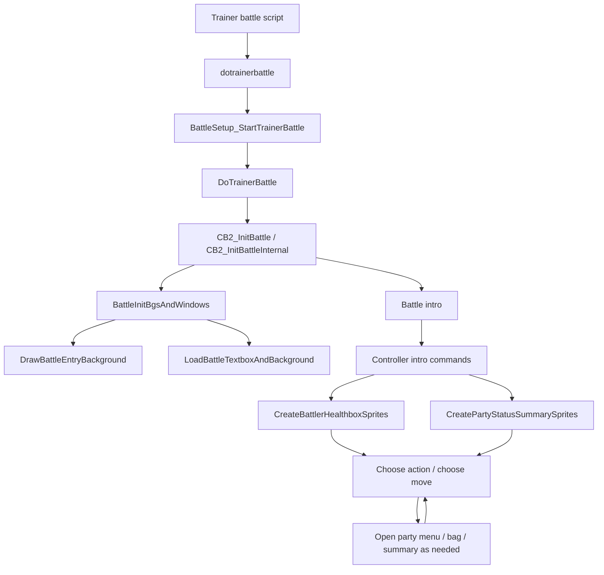
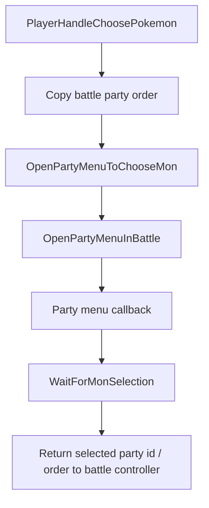

# Battle UI Flow v15

調査日: 2026-05-01

この文書は、battle 開始後の画面構成、trainer battle UI、healthbox、party status summary、battle menu の影響範囲を整理する。

## Purpose

将来、trainer battle 前選出 UI、相手 party 表示、battle 中 UI の再構成を行う場合に、既存の battle screen がどこで初期化・更新されるかを把握する。

この文書は調査メモであり、現時点では C コードの変更は行っていない。

## Key Files

| File | Important symbols / notes |
|---|---|
| `include/battle_interface.h` | healthbox / party status summary / ability popup / move info / last used ball 関連の public API。 |
| `src/battle_interface.c` | healthbox sprite 作成、HP/status 表示、party status summary、ability popup、last used ball、move info window。 |
| `src/battle_bg.c` | battle BG、window template、battle textbox、entry background、battle environment。 |
| `src/battle_intro.c` | battle intro slide、scanline effect、BG/window register 操作。 |
| `include/battle_controllers.h` | battle controller command、`struct HpAndStatus`、`struct ChooseMoveStruct`。 |
| `src/battle_controller_player.c` | player action menu、move menu、battle 中 party menu、bag、summary への入口。 |
| `src/battle_main.c` | `CB2_InitBattle`, `CB2_InitBattleInternal`, `gBattleTypeFlags`, `gBattlerPartyIndexes`。 |
| `include/config/battle.h` | battle UI / input / fast intro / move description / type effectiveness / last used ball の config。 |

## High-Level Flow

## Battle Background and Windows

`src/battle_bg.c` で確認した主な構造:

| Symbol | Role |
|---|---|
| `gBattleBgTemplates` | battle 用 BG0..BG3 template。 |
| `sStandardBattleWindowTemplates` | 通常 battle window layout。 |
| `sKantoTutorialBattleWindowTemplates` | FRLG tutorial 用 window layout。 |
| `sBattleArenaWindowTemplates` | Battle Arena 用 window layout。 |
| `gBattleWindowTemplates` | battle type から window template set を選ぶ table。 |
| `BattleInitBgsAndWindows` | battle type に応じて window template を選び `InitWindows` する。 |
| `DrawBattleEntryBackground` | link / Frontier / legendary / trainer class / map scene などから battle entry 背景を描く。 |
| `LoadBattleTextboxAndBackground` | battle textbox / menu window graphics を読む。 |
| `GetBattleEnvironmentOverride` | trainer class、Frontier、legendary、map scene などから battle environment を決める。 |

`sStandardBattleWindowTemplates` には、少なくとも以下の window id が含まれる。

| Window id | Use |
|---|---|
| `B_WIN_MSG` | battle message textbox。 |
| `B_WIN_ACTION_PROMPT` | “What will PKMN do?” などの prompt。 |
| `B_WIN_ACTION_MENU` | Fight / Bag / Pokémon / Run の action menu。 |
| `B_WIN_MOVE_NAME_1`..`B_WIN_MOVE_NAME_4` | move selection。 |
| `B_WIN_PP`, `B_WIN_PP_REMAINING`, `B_WIN_MOVE_TYPE` | move PP / type 表示。 |
| `B_WIN_SWITCH_PROMPT` | switch 確認。 |
| `B_WIN_YESNO` | Yes/No。 |
| `B_WIN_LEVEL_UP_BOX`, `B_WIN_LEVEL_UP_BANNER` | level up 表示。 |
| `B_WIN_VS_*` | VS intro 系 window。 |
| `B_WIN_MOVE_DESCRIPTION` | move description 表示。 |

### Risk

Battle UI を大きく変える場合、`src/battle_bg.c` の window template は基盤になる。window id の追加・移動は `src/battle_controller_player.c` の描画処理や battle script command の text 出力と連動するため、単独変更は危険。

## Battle Intro

`src/battle_intro.c` で確認した主な symbols:

| Symbol | Role |
|---|---|
| `HandleIntroSlide` | battle environment / battle type から intro slide function を選ぶ。 |
| `BattleIntroNoSlide` | `B_FAST_INTRO_NO_SLIDE` または headless 時の no-slide path。 |
| `BattleIntroSlide1`, `BattleIntroSlide2`, `BattleIntroSlide3` | 通常 intro slide。 |
| `BattleIntroSlideLink` | link battle 用 intro。 |
| `BattleIntroSlidePartner` | partner battle 用 intro。 |

Intro slide は GPU register、BG offset、window mask、scanline effect を直接扱う。trainer battle 開始前に新しい相手 party preview を表示する場合、battle intro より前に field/menu 側で表示する方が安全と思われる。ただし未実装・未検証。

## Healthbox

`include/battle_interface.h` / `src/battle_interface.c` で確認した主な symbols:

| Symbol | Role |
|---|---|
| `GetBattlerCoordsIndex` | single/double、party count、battle type から battler coordinate index を決める。 |
| `CreateBattlerHealthboxSprites` | battler ごとの healthbox / healthbar / indicator sprite を作る。 |
| `InitBattlerHealthboxCoords` | battler ごとの healthbox 初期座標を設定する。 |
| `GetBattlerHealthboxCoords` | healthbox 座標取得。 |
| `UpdateHealthboxAttribute` | level、HP、status、nickname、EXP bar などを更新。 |
| `UpdateHpTextInHealthbox` | HP text 更新。 |
| `SwapHpBarsWithHpText` | START input などで HP bar/text を切り替える。 |
| `CreateAbilityPopUp`, `DestroyAbilityPopUp`, `UpdateAbilityPopup` | ability popup 表示。 |

`GetBattlerCoordsIndex` は `gPlayerPartyCount`、`gEnemyPartyCount`、`gBattleTypeFlags`、`IsDoubleBattle()` を参照する。選出機能で `gPlayerParty` を 3/4 匹へ一時圧縮する場合、battle UI 側は圧縮後の party count を前提に動く。

確認した coordinate の例:

| Battle type | Side | Coords note |
|---|---|---|
| Single | player | player healthbox は右下寄り。 |
| Single | opponent | opponent healthbox は左上寄り。 |
| Double | player left/right | player side の 2 healthbox は上下にずれる。 |
| Double | opponent left/right | opponent side の 2 healthbox は上下にずれる。 |

### Risk

Healthbox 座標や表示条件は battle type と party count に依存する。選出機能が `gPlayerPartyCount` を意図せず 6 のままにすると、party status summary や double UI の表示がずれる可能性がある。

## Party Status Summary

`src/battle_interface.c` の `CreatePartyStatusSummarySprites` は、battle 開始時や switch 周辺で party の ball tray を表示する。

確認した点:

- 引数は `struct HpAndStatus partyInfo[PARTY_SIZE]` 相当。
- 内部で `PARTY_SIZE` 分の ball sprite を処理する。
- player side では `BATTLE_TYPE_MULTI` などの条件により empty slot の並びが変わる。
- player side の通常 battle では、empty slot を右へ寄せる処理がある。
- fainted/status/empty などの表示が partyInfo から決まる。

### Battle Selection Impact

選出後に `gPlayerParty[0..selectedCount-1]` だけを残し、残り slot を空にした場合、party status summary は空 slot を含む 6 個の ball tray を表示する可能性が高い。これを仕様として許容するか、選出済み party だけを見せるように変えるかは未決定。

`CreatePartyStatusSummarySprites` は battle 中 UI の見た目へ直接影響するため、Pokémon Champions 風 UI や相手 party 表示を作る場合は高リスク領域。

## Player Battle Menus

`src/battle_controller_player.c` で確認した主な flow:

| Symbol | Role |
|---|---|
| `sPlayerBufferCommands` | controller command から handler への table。 |
| `PlayerHandleChooseAction` | action menu 初期描画。 |
| `HandleInputChooseAction` | Fight / Bag / Pokémon / Run 入力。 |
| `PlayerHandleChooseMove` | move menu 初期化。 |
| `HandleInputChooseMove` | move 選択、cancel、cursor、move description、gimmick trigger。 |
| `MoveSelectionDisplayMoveNames` | move 名 window 描画。 |
| `MoveSelectionDisplayPpNumber` | PP 表示。 |
| `MoveSelectionDisplayMoveType` | move type 表示。 |
| `MoveSelectionDisplayMoveDescription` | move description window 表示。 |
| `OpenPartyMenuToChooseMon` | battle 中の Pokémon 選択画面へ遷移。 |
| `OpenPartyMenuInBattle` | battle 用 party menu 起動。 |
| `WaitForMonSelection` | party menu から battle controller へ戻る。 |
| `PlayerHandleChooseItem` | battle bag へ遷移。 |
| `SetBattleEndCallbacks` | bag / party menu などから battle callback へ戻す。 |

### Move Menu Config Dependencies

`include/config/battle.h` と player controller で確認した UI 関連 config:

| Config | Observed use |
|---|---|
| `B_SHOW_TARGETS` | target 選択 UI。 |
| `B_SHOW_CATEGORY_ICON` | move category icon 表示。 |
| `B_MOVE_DESCRIPTION_BUTTON` | move description の button。 |
| `B_SHOW_EFFECTIVENESS` | move effectiveness 表示。 |
| `B_MOVE_REARRANGEMENT_IN_BATTLE` | battle 中の move 並び替え。 |
| `B_LAST_USED_BALL`, `B_LAST_USED_BALL_BUTTON`, `B_LAST_USED_BALL_CYCLE` | last used ball UI。trainer/frontier battle では投げられない条件あり。 |
| `B_HIDE_HEALTHBOX_IN_ANIMS` | battle animation 中の healthbox 表示。 |

`B_MOVE_REARRANGEMENT_IN_BATTLE` が有効な場合、battle 中に move slot を入れ替える処理が `GetBattlerMon(battler)` 側にも反映される。選出機能で一時 `gPlayerParty` を使う場合、battle 後にこの変更も元 slot へ戻す必要がある。

## Battle Party Menu / Summary Interaction

Battle 中に Pokémon を選ぶ flow:

関係する state:

| Symbol | Role |
|---|---|
| `gBattlePartyCurrentOrder` | battle 中 party order。 |
| `gSelectedMonPartyId` | party menu で選ばれた slot。 |
| `gBattlerPartyIndexes` | battler と party slot の対応。 |
| `gPlayerParty` | battle 中 player party の実体。 |

選出機能では、元 party slot と battle 中 slot の mapping が二重になる。

1. 元 6 匹 party の slot。
2. 選出後の temporary `gPlayerParty` slot。
3. battle 中の `gBattlePartyCurrentOrder` / `gBattlerPartyIndexes`。

この mapping を混同すると、battle 後に別個体へ HP/status/PP/move changes を戻す危険がある。

## UI Change Impact Matrix

| Desired change | Main files | Risk | Notes |
|---|---|---|---|
| Battle 前に選出画面を挟む | `src/party_menu.c`, `src/script_pokemon_util.c`, `src/battle_setup.c`, `data/scripts/trainer_battle.inc` | Very High | field script waitstate と callback chain が絡む。 |
| 相手 party preview を battle 前に表示 | `src/battle_main.c`, `src/trainer_pools.c`, `include/data.h`, future UI file | High | `gEnemyParty` は battle init で生成されるため、表示 timing が難しい。 |
| Battle 開始後の ball tray を選出数に合わせる | `src/battle_interface.c`, `include/battle_interface.h` | High | `PARTY_SIZE` 前提の表示処理がある。 |
| Action menu layout 変更 | `src/battle_bg.c`, `src/battle_controller_player.c` | High | window template と描画処理の両方が必要。 |
| Move menu 情報量追加 | `src/battle_controller_player.c`, `src/battle_bg.c`, `include/config/battle.h` | Medium/High | description/effectiveness/category/gimmick UI と競合しやすい。 |
| Healthbox レイアウト変更 | `src/battle_interface.c`, `include/battle_interface.h` | High | single/double/multi/partner で座標が分岐する。 |
| Intro 演出変更 | `src/battle_intro.c`, `src/battle_bg.c` | High | GPU register / scanline effect へ直接触る。 |
| Option で UI 表示を切替 | `src/option_menu.c`, `include/global.h`, `include/config/battle.h` | Medium/High | save data 追加が必要になる可能性。 |

## Open Questions

- 選出後の battle 中 party status summary は 3/4 個だけ表示したいのか、既存通り 6 個枠で empty slot を見せるのか未決定。
- Pokémon Champions 風 UI を battle intro 前に出すのか、battle init 後に出すのか未決定。
- 相手 party preview は trainer party pool / random order 反映後の party を見せる必要があるか未決定。
- battle UI の option 化を行う場合、`struct SaveBlock2` に新規 option を足すか、compile-time config に留めるか未決定。
- `B_MOVE_REARRANGEMENT_IN_BATTLE` 有効時の move order 変更を、選出元 slot へ戻す正確な timing は追加検証が必要。
