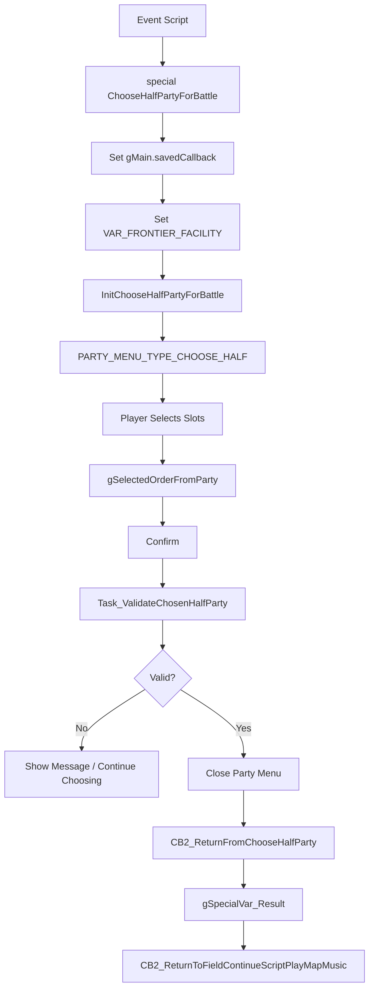

# Choose Half Party Flow v15

## Purpose

既存の “choose half party” 系処理を調査し、トレーナーバトル前選出に流用できる範囲と危険箇所を整理する。

この flow は、既に `gSelectedOrderFromParty` を使って party slot の選出順を管理し、Battle Frontier などで `gPlayerParty` を選出 party へ詰める機能を持つ。

## Key Files

| File | Role |
|---|---|
| `src/script_pokemon_util.c` | `ChooseHalfPartyForBattle`、`ChoosePartyForBattleFrontier`、`ReducePlayerPartyToSelectedMons` |
| `src/party_menu.c` | `InitChooseHalfPartyForBattle`、入力、eligibility、validation |
| `include/party_menu.h` | `gSelectedOrderFromParty`、`InitChooseHalfPartyForBattle` |
| `include/constants/party_menu.h` | choose half menu type / messages |
| `src/frontier_util.c` | Frontier 選出 order 保存、party order 反映 |
| `asm/macros/battle_frontier/frontier_util.inc` | `frontier_setpartyorder` macro |
| `include/constants/frontier_util.h` | Frontier util function constants |
| `src/load_save.c` | `SavePlayerParty`、`LoadPlayerParty` |
| `src/pokemon.c` | `gPlayerParty`、party count、zero/copy helpers |
| `data/scripts/cable_club*.inc` | `ChooseHalfPartyForBattle` 使用例 |
| `data/maps/MossdeepCity_SpaceCenter_2F/scripts.inc` | Steven multi battle の使用例 |

## Existing Entry Points

### ChooseHalfPartyForBattle

`src/script_pokemon_util.c`:

1. `gMain.savedCallback = CB2_ReturnFromChooseHalfParty`
2. `VarSet(VAR_FRONTIER_FACILITY, FACILITY_MULTI_OR_EREADER)`
3. `InitChooseHalfPartyForBattle(0)`

終了 callback の `CB2_ReturnFromChooseHalfParty`:

- `gSelectedOrderFromParty[0] == 0` なら `gSpecialVar_Result = FALSE`
- それ以外なら `gSpecialVar_Result = TRUE`
- `SetMainCallback2(CB2_ReturnToFieldContinueScriptPlayMapMusic)`

### ChoosePartyForBattleFrontier

`src/script_pokemon_util.c`:

1. `gMain.savedCallback = CB2_ReturnFromChooseBattleFrontierParty`
2. `InitChooseHalfPartyForBattle(gSpecialVar_0x8004 + 1)`

ただし `src/party_menu.c` の `InitChooseHalfPartyForBattle(u8 unused)` は、確認した範囲では引数を使用していない。

### ReducePlayerPartyToSelectedMons

`src/script_pokemon_util.c` の `ReducePlayerPartyToSelectedMons` は:

1. local `struct Pokemon party[MAX_FRONTIER_PARTY_SIZE]` を zero 初期化
2. `gSelectedOrderFromParty[i] - 1` を元 slot として `gPlayerParty` から local party へ copy
3. `gPlayerParty` を全消去
4. local party の先頭 `MAX_FRONTIER_PARTY_SIZE` を `gPlayerParty` へ copy
5. `CalculatePlayerPartyCount()`

この関数は元の 6 匹構成を自前では保持しない。通常 trainer battle 前選出で使う場合は、呼び出し前に安全な保存と、battle 後の元 slot への反映/復元が必須。

## Selection Order Data

`gSelectedOrderFromParty` は `src/party_menu.c` で定義され、`include/party_menu.h` で extern される。

確認済み:

- 配列長は `MAX_FRONTIER_PARTY_SIZE`。
- `CursorCb_Enter` は `gPartyMenu.slotId + 1` を保存する。
- つまり保存値は 1-based party slot。
- `0` は未選択 sentinel として扱われる。
- `CursorCb_NoEntry` は選出解除後に詰め直す。

| Example | Meaning |
|---|---|
| `gSelectedOrderFromParty[0] = 1` | 元 party slot 0 を 1 番目に選出 |
| `gSelectedOrderFromParty[1] = 4` | 元 party slot 3 を 2 番目に選出 |
| `gSelectedOrderFromParty[i] = 0` | 未選択 |

## Entry Count Rules

`src/party_menu.c`:

| Function | Rule |
|---|---|
| `GetMaxBattleEntries` | `FACILITY_MULTI_OR_EREADER` は `MULTI_PARTY_SIZE`、`FACILITY_UNION_ROOM` は `UNION_ROOM_PARTY_SIZE`、それ以外は `gSpecialVar_0x8005` |
| `GetMinBattleEntries` | `FACILITY_MULTI_OR_EREADER` は `1`、`FACILITY_UNION_ROOM` は `UNION_ROOM_PARTY_SIZE`、それ以外は `gSpecialVar_0x8005` |
| `GetBattleEntryLevelCap` | facility 種別により level cap を決定 |

通常 trainer battle の 6 匹から 3 匹 / 4 匹という仕様は、既存の `FACILITY_MULTI_OR_EREADER` のままでは表現しきれない可能性がある。Battle Frontier 風に `gSpecialVar_0x8005` を使う path を使えるか、または専用 facility/mode を追加するかは設計課題。

## Eligibility and Validation

`GetBattleEntryEligibility` で確認した条件:

- egg は不可。
- level cap 超過は不可。
- Battle Pyramid の held item 条件がある。
- `FACILITY_MULTI_OR_EREADER` は HP 0 の Pokémon を不可にする。
- `FACILITY_UNION_ROOM` は TRUE。
- default Battle Frontier 系は `gSpeciesInfo[species].isFrontierBanned` を見る。

`CheckBattleEntriesAndGetMessage` では:

- 最低選出数未満。
- Union/Multi 以外での同 species 重複。
- Union/Multi 以外での同 held item 重複。

通常 trainer battle 前選出で species/item duplicate 制限を入れたくない場合、既存 validation の流用には注意が必要。

## Existing Script Usage

### Steven Multi Battle

`data/maps/MossdeepCity_SpaceCenter_2F/scripts.inc` では、確認した範囲で以下の pattern がある。

1. `special SavePlayerParty`
2. `special ChooseHalfPartyForBattle`
3. `waitstate`
4. `compare VAR_RESULT, FALSE`
5. battle へ進む
6. 後続で `special LoadPlayerParty`

この pattern は「一時的な party 変更と復元」の参考になる。ただし、battle 後状態を選出元 slot へ反映する処理は別途確認が必要。

### Battle Frontier

Battle Frontier scripts では概ね以下のような pattern が使われる。

1. `special SavePlayerParty`
2. `setvar VAR_0x8005, FRONTIER_PARTY_SIZE`
3. `special ChoosePartyForBattleFrontier`
4. `frontier_set FRONTIER_DATA_SELECTED_MON_ORDER`
5. `frontier_setpartyorder FRONTIER_PARTY_SIZE`

`frontier_setpartyorder` は `FRONTIER_UTIL_FUNC_SET_PARTY_ORDER` を `CallFrontierUtilFunc` へ渡し、`src/frontier_util.c` の `SetSelectedPartyOrder` が:

1. saveblock の `frontier.selectedPartyMons` から `gSelectedOrderFromParty` を復元
2. `ReducePlayerPartyToSelectedMons()` を呼ぶ

## Existing Flowchart

## Applying to Trainer Battle Selection

既存 flow から流用しやすいもの:

- party menu UI 表示。
- party slot の選出順管理。
- confirm / cancel / summary の基本操作。
- `gSelectedOrderFromParty` の 1-based slot data。
- `ReducePlayerPartyToSelectedMons` の「選出順へ party を詰める」考え方。

そのまま流用すると危険なもの:

- `VAR_FRONTIER_FACILITY` を `FACILITY_MULTI_OR_EREADER` へ書き換えること。
- Battle Frontier 用の species/item duplicate validation。
- `MAX_FRONTIER_PARTY_SIZE` 前提。
- 元 party の保存/復元を `SavePlayerParty` / `LoadPlayerParty` に任せること。
- battle 後の selected mons の HP/status/経験値/held item 変化を元 slot へ戻す mapping。

## Open Questions

- 通常 trainer battle では fainted Pokémon を選出不可にするべきか未決定。
- egg、level cap、Frontier ban species、duplicate species/item の扱いは仕様未決定。
- `MAX_FRONTIER_PARTY_SIZE` が 3 である場合、double battle 4 匹選出に対応できない可能性があるため確認が必要。
- `SavePlayerParty` / `LoadPlayerParty` をそのまま使うと、battle 後状態をどの timing で保存 party へ反映するかが未解決。
- Steven multi battle の後続処理が選出個体の状態反映をどう扱っているかは、さらに script と callback を追う必要がある。
