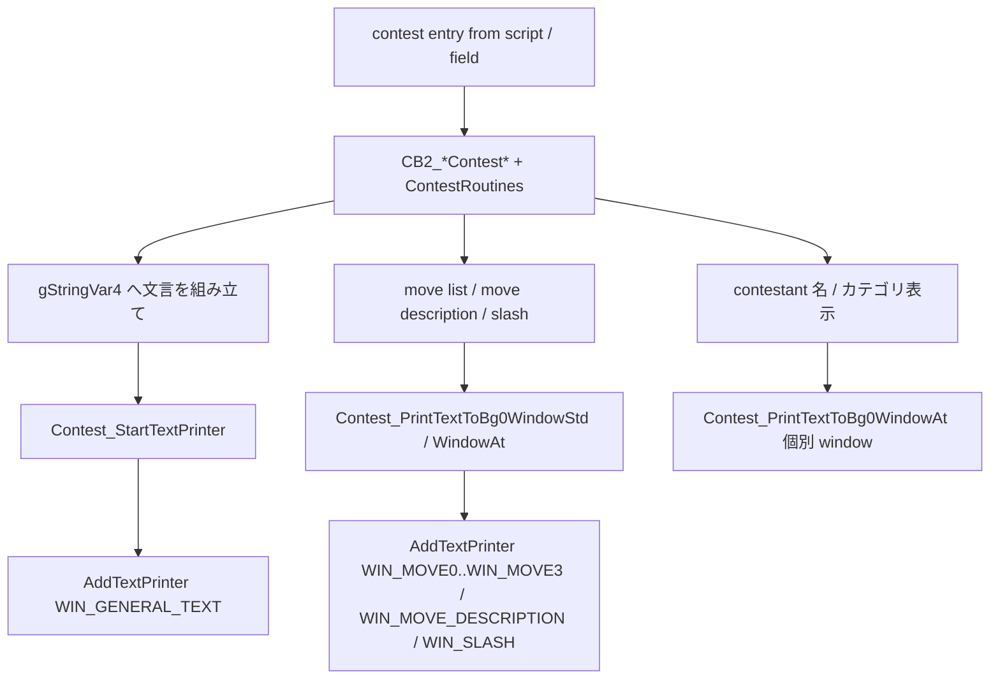

# Contest Message Flow v15

Contest 中の文字列は battle / field の通常 message 経路と完全に別系統です。
[Message Text Manual](../manuals/message_text_manual.md) の入口で「Contest 専用 textbox」と判定したらこの doc を見ます。

## 全体像

主なファイル:

| File | Role |
| --- | --- |
| `src/contest.c` | Contest 進行 state machine、window enum (`WIN_CONTESTANT0_NAME`..`WIN_CONTESTANT3_NAME`, `WIN_GENERAL_TEXT`, `WIN_MOVE0..WIN_MOVE3`, `WIN_SLASH`, `WIN_MOVE_DESCRIPTION`)、3 つの printer helper (`Contest_StartTextPrinter`, `Contest_PrintTextToBg0WindowStd`, `Contest_PrintTextToBg0WindowAt`)。 |
| `src/contest_effect.c` | `ContestEffect_*` 関数本体。 文字列は使わず effect / appeal / jam 計算が中心。 |
| `src/data/contest_moves.h` | `gContestEffects[CONTEST_EFFECT_*]` table。 各 effect が `description` (移動 description 用 string)、`effectType`、`appeal`、`jam`、`function` を持つ。 |
| `src/contest_util.c` | Contest 結果画面 / winner painting 周辺。 `gText_ContestantsMonWon` などを `StringExpandPlaceholders` してから `AddTextPrinter` / `AddTextPrinterParameterized3`。 |
| `src/contest_link.c`, `src/contest_link_util.c` | 通信 contest 用の同期 / message。 file 内には `AddTextPrinter*` を直接呼ぶ箇所はなく、 通信完了後に `src/contest.c` 側 helper や `src/contest_util.c` の `AddTextPrinterParameterized3` (`sContestLinkTextColors` 引き) で表示する。 |
| `src/contest_painting.c` | Winner painting 描画。 description は別 string table。 |
| `data/scripts/contest_hall.inc` 等 | Contest 開始時の field script。 通常 `msgbox` で導入を出してから contest CB2 に切り替える。 |

`Contest_StartTextPrinter` の特徴:

- `windowId = WIN_GENERAL_TEXT` 固定。 `printerTemplate.fontId = FONT_NORMAL`、color foreground=1 / shadow=8。
- `b == FALSE` のときは speed 0 で即時印字 (link contest の他人 turn 等)。
- `b == TRUE` のときは link contest なら speed 4、そうでなければ `GetPlayerTextSpeedDelay()`。
- 印字直後に `Contest_SetBgCopyFlags(0)` で BG0 に flush 予約。

`Contest_PrintTextToBg0WindowStd` (move description / slash) と `Contest_PrintTextToBg0WindowAt` (任意座標) は同じ template だが、speed 0 + `WINDOW_TEXT_PRINTER` で動作する別 helper。 Down arrow も `B_WIN_MSG` のような自動表示はしない。

## 文言の出どころ

| 表示内容 | 文言の source | 注意 |
| --- | --- | --- |
| 通常の進行アナウンス (`gText_*` を `StringExpandPlaceholders`) | `gStringVar4` | placeholder は `gStringVar1`..`gStringVar3` が基本。 battle 用の `{B_*}` は使えない。 |
| 「アピールがうまくいった」「コンボがいい感じ」 | `gText_AppealComboWentOver*`、`sCombo*Texts` | `Contest_StartTextPrinter` で順に出す。 |
| 技 description | `gContestEffects[GetMoveContestEffect(move)].description` | `COMPOUND_STRING(...)` で literal が table に直接埋め込まれる。 effect 単位なので「技ごと」ではなく「effect ごと」に共有。 |
| 結果画面 (winner banner) | `gText_ContestantsMonWon` を `StringExpandPlaceholders` -> `winnerTextBuffer` (`src/contest_util.c` line 854) | `src/contest_util.c` の `AddTextPrinter` (line 1927) と `AddTextPrinterParameterized3` (line 1160、 link contest 用) に渡す。 自前 window template / palette。 |
| Contest painting の caption | Contest Hall: `gContestHallPaintingCaption` を `StringExpandPlaceholders(gStringVar4, ...)`。 Museum: `sMuseumCaptions[category]`。 (`src/contest_painting.c` line 274 / 280) | 名前 / カテゴリは `gContestPaintingWinner` から `gStringVar1..3` に詰めてから expand。 印字は `AddTextPrinterParameterized(sWindowId, FONT_NORMAL, gStringVar4, x, 1, 0, 0)` (line 284)、 `GetStringCenterAlignXOffset` で 208 px に中央寄せ。 painting 表示専用 window で他の Contest UI とは独立。 |
| Link contest 用 standby 文言 | `gText_LinkStandby4` を `Contest_StartTextPrinter(..., FALSE)` (`src/contest.c` line 3692) | `b == FALSE` で speed 0 / 即時表示。 link contest 同期中の表示。 |

## 変更時の注意

- 文言を変えたい場合、まず `gContestEffects[X].description` か `gText_*` (Contest 専用) かを確認する。 effect description は table 1 行で全 move 共通。
- 表示位置を変えたい場合、 file 内の `WindowTemplate` (823 行付近 `[WIN_GENERAL_TEXT] = { ... }` など) を編集する。 battle 用の `B_WIN_*` template とは独立。
- `Contest_StartTextPrinter` を直接書き換えると速度や色 (`color.foreground=1, shadow=8`) が全 contest message に効く。 一部だけ変えたい場合は新しい helper を作る。
- Contest 中は battle script や field script の message 経路は走らないので、`waitmessage` / `msgbox` などは使えない。 終了 callback (`gMain.savedCallback`) で field に戻ったあと初めて通常の message へ戻る。
- `WIN_GENERAL_TEXT` は BG0 上に置かれ、 `Contest_SetBgCopyFlags(0)` 経由で flush される。 BG0 の他描画 (move list 等) と書き込み順を変えると消える / 上書きする。
- Contest 専用の placeholder buffer はない。 `Contest_*` helper は単に `currentChar` を渡すだけなので、 `StringExpandPlaceholders` を呼んでから渡す手順を守る。
- `gContestEffects[].description` は `C_UPDATED_MOVE_EFFECTS >= GEN_6` ガードで 2 通り定義されている。 旧文言と新文言を切り替えるには config を見直す。

## Painting (winner 飾り) 経路

Contest 結果から hall / museum に飾られる絵 (`src/contest_painting.c`) は contest 本体とは別 callback で動く独立 UI。

- caption 種別判定: `if (contestType < MUSEUM_CONTEST_WINNERS_START)` で hall / museum を切り替える。
- hall caption は `BufferContestName(gStringVar1, category)` -> `StringAppend(gStringVar1, gText_Space)` -> `StringAppend(gStringVar1, sContestRankNames[gContestPaintingWinner->contestRank])` -> trainer 名 / mon 名を `gStringVar2` / `gStringVar3` -> `StringExpandPlaceholders(gStringVar4, gContestHallPaintingCaption)`。
- museum caption は `StringCopy(gStringVar1, gContestPaintingWinner->monName)` -> `StringExpandPlaceholders(gStringVar4, sMuseumCaptions[category])`。
- 印字は `AddTextPrinterParameterized(sWindowId, FONT_NORMAL, gStringVar4, x, 1, 0, 0)`、 `x = GetStringCenterAlignXOffset(FONT_NORMAL, gStringVar4, 208)` で中央寄せ。
- artist 用 painting (`isForArtist == TRUE`) はキャプション無し。

通常の Contest progression (`Contest_StartTextPrinter` 等) は使わない。 painting 描画用 BG / window が独立してある。

## 関連 docs

- [Message Text Manual](../manuals/message_text_manual.md) — 入口の判断。
- [Battle Text Routes v15](battle_text_routes_v15.md) — battle 側の専用 textbox / popup / Frontier speech。
- [How to use config flags and vars](../tutorials/how_to_config_flags_vars.md) — `C_UPDATED_MOVE_EFFECTS` 等 config トグル。
