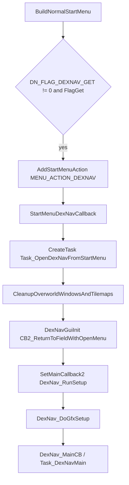
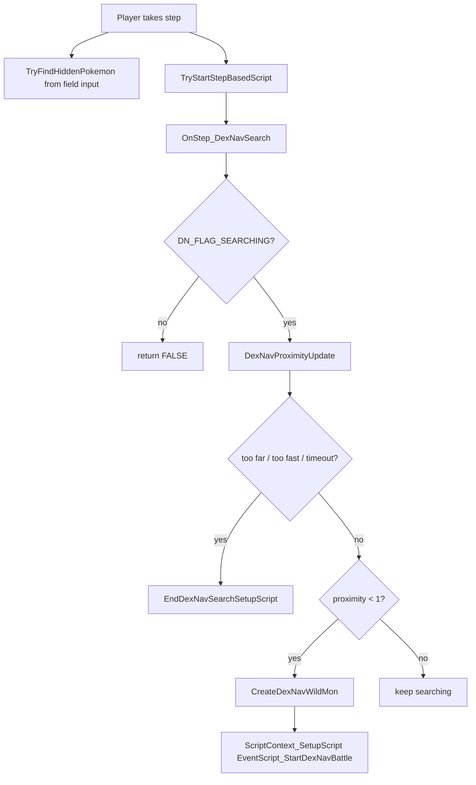

# DexNav Flow v15

調査日: 2026-05-02

この文書は DexNav の起動条件、画面遷移、野生ポケモン生成、SaveBlock3 への影響、12 枠制限を整理する。現時点では実装・改造は行っていない。

## Purpose

- Start menu から開く DexNav UI と、歩数で発生する hidden Pokemon 探索の違いを整理する。
- `DN_FLAG_*` / `DN_VAR_*` と `gSaveBlock3Ptr` の関係を確認する。
- UI 変更、野生ランダム化、遭遇枠拡張、独自 DexNav 画面を作る時の影響範囲を明示する。

## Key Files

| File | Important symbols / notes |
|---|---|
| `include/config/dexnav.h` | `DEXNAV_ENABLED`, `USE_DEXNAV_SEARCH_LEVELS`, `DN_FLAG_SEARCHING`, `DN_FLAG_DEXNAV_GET`, `DN_FLAG_DETECTOR_MODE`, `DN_VAR_SPECIES`, `DN_VAR_STEP_COUNTER`。 |
| `include/dexnav.h` | GUI row/column constants、`DEXNAV_MASK_SPECIES`, `DEXNAV_MASK_ENVIRONMENT`, public DexNav functions。 |
| `src/dexnav.c` | DexNav UI / search / hidden Pokemon 本体。`struct DexNavSearch`, `struct DexNavGUI`, `Task_OpenDexNavFromStartMenu`, `TryStartDexNavSearch`, `TryFindHiddenPokemon`, `OnStep_DexNavSearch`。 |
| `src/start_menu.c` | `BuildNormalStartMenu`, `StartMenuDexNavCallback`。Start menu へ DexNav entry を出す。 |
| `src/field_control_avatar.c` | `ProcessPlayerFieldInput` と step-based script から DexNav search を呼ぶ。 |
| `src/field_player_avatar.c` | DexNav search 中の creeping / slow walk。 |
| `src/battle_main.c` | battle 終了時の DexNav chain / search level 更新。 |
| `src/pokemon.c` | shiny 判定で `CalculateDexNavShinyRolls()` を参照。 |
| `data/scripts/dexnav.inc` | DexNav search 到達時の `EventScript_StartDexNavBattle`。 |
| `include/constants/wild_encounter.h` | `LAND_WILD_COUNT`, `WATER_WILD_COUNT`, `HIDDEN_WILD_COUNT`。 |
| `src/wild_encounter.c` | 通常野生遭遇の slot 数と抽選。DexNav と同じ wild encounter data を参照する。 |

## Config and Enable Gates

`include/config/dexnav.h` の現在値:

| Config / flag / var | Current value | Meaning |
|---|---:|---|
| `DEXNAV_ENABLED` | `FALSE` | DexNav 全体の compile-time 有効化。 |
| `USE_DEXNAV_SEARCH_LEVELS` | `FALSE` | 種族別 search level を SaveBlock3 に保存するか。comment に「1 byte per species」と警告あり。 |
| `DN_FLAG_SEARCHING` | `0` | DexNav search 中 flag。 |
| `DN_FLAG_DEXNAV_GET` | `0` | Start menu に DexNav を表示するための入手 flag。 |
| `DN_FLAG_DETECTOR_MODE` | `0` | hidden Pokemon 自動検出を許可する flag。 |
| `DN_VAR_SPECIES` | `0` | 登録中の DexNav species と environment を保存する var。 |
| `DN_VAR_STEP_COUNTER` | `0` | hidden Pokemon 検出用の歩数 counter var。 |

`src/dexnav.c` では `#if DEXNAV_ENABLED` の中で以下の static assert を確認した。

- `DN_FLAG_SEARCHING != 0`
- `DN_FLAG_DETECTOR_MODE != 0`
- `DN_VAR_SPECIES != 0`
- `DN_VAR_STEP_COUNTER != 0`

`DN_FLAG_DEXNAV_GET` は `src/start_menu.c` の `BuildNormalStartMenu()` が `DN_FLAG_DEXNAV_GET != 0 && FlagGet(DN_FLAG_DEXNAV_GET)` を見る。つまり Start menu entry を出すには、compile-time config だけでなく flag define と runtime flag set が必要。

## Two Enable Patterns

DexNav は少なくとも二系統の「有効化」がある。

| Pattern | Gate | Entry point | Effect |
|---|---|---|---|
| Start menu DexNav | `DEXNAV_ENABLED`、`DN_FLAG_DEXNAV_GET`、`FlagGet(DN_FLAG_DEXNAV_GET)` | `BuildNormalStartMenu()` -> `StartMenuDexNavCallback()` -> `Task_OpenDexNavFromStartMenu()` | DexNav GUI を開き、任意 species を選択・登録・検索する。 |
| Detector mode / hidden Pokemon | `DEXNAV_ENABLED`、`DN_FLAG_DETECTOR_MODE`、`DN_VAR_STEP_COUNTER` | `ProcessPlayerFieldInput()` の step check -> `TryFindHiddenPokemon()` | 歩数ごとに hidden Pokemon を検出し、簡易 search window を出す。 |

どちらも `DN_FLAG_SEARCHING` と `sDexNavSearchDataPtr` を使うため、同時起動・復帰・map 移動時 reset を一体で扱う必要がある。

## Start Menu UI Flow

`src/dexnav.c` の `DexNav_DoGfxSetup()` は `gMain.state` で段階的に UI を初期化する。

| State | Confirmed behavior |
|---:|---|
| 0-3 | callbacks / scanline / palettes / sprites / tasks を reset。 |
| 4 | `DexNav_InitBgs()`。 |
| 5 | `DexNav_LoadGraphics()`。 |
| 6 | `DexNav_InitWindows()`、cursor 初期値設定。 |
| 7 | `PrintSearchableSpecies(VarGet(DN_VAR_SPECIES) & DEXNAV_MASK_SPECIES)`、`DexNavLoadEncounterData()`。 |
| 8 | `CreateTask(Task_DexNavWaitFadeIn, 0)`。 |
| 9 | type icon sprite 作成。 |
| 10 | `LoadMonIconPalettes()`、`DrawSpeciesIcons()`、selection cursor、captured-all symbol。 |
| 11-12 | fade in。 |
| default | `SetVBlankCallback(DexNav_VBlankCB)`、`SetMainCallback2(DexNav_MainCB)`。 |

UI 改造では `ResetTasks()` / `ResetSpriteData()` / `FreeAllSpritePalettes()` を通るため、DexNav 画面へ遷移する前の field menu sprite/window は残らない前提。

## Search Flow

### Registered Species Search

`TryStartDexNavSearch()` は R button entry。`DN_VAR_SPECIES` から species と environment を読む。

| Step | Symbol / behavior |
|---|---|
| 1 | `val = VarGet(DN_VAR_SPECIES)`。 |
| 2 | hidden search 中なら `RevealHiddenSearch()`。 |
| 3 | `DN_FLAG_SEARCHING` が set、または species が `SPECIES_NONE` なら `FALSE`。 |
| 4 | `HideMapNamePopUpWindow()`、`ChangeBgY_ScreenOff()`、`PlaySE(SE_DEX_SEARCH)`。 |
| 5 | `InitDexNavSearch(val & DEXNAV_MASK_SPECIES, val >> 14)`。 |

`DN_VAR_SPECIES` は下位 14 bit が species、上位 2 bit が environment として扱われる。

| Mask | Meaning |
|---|---|
| `DEXNAV_MASK_SPECIES 0x3FFF` | species 部分。 |
| `DEXNAV_MASK_ENVIRONMENT 0xC000` | environment 部分。 |

### Hidden Pokemon Search

`TryFindHiddenPokemon()` は `ProcessPlayerFieldInput()` の step check で呼ばれる。現在確認した guard:

- `DEXNAV_ENABLED == 0`
- `!FlagGet(DN_FLAG_DETECTOR_MODE)`
- `FlagGet(DN_FLAG_SEARCHING)`
- `GetFlashLevel() > 0`

これらに該当する場合、`DN_VAR_STEP_COUNTER` が存在すれば 0 に戻し、`FALSE` を返す。

hidden search は `HIDDEN_MON_STEP_COUNT`、`HIDDEN_MON_SEARCH_RATE`、`HIDDEN_MON_PROBABILTY` を使う。成功時は `sDexNavSearchDataPtr` を確保し、`DN_FLAG_SEARCHING` を set し、field effect と search window を表示する。ただし script context を有効化しないため、最後は `FALSE` を返す。

### Step Update and Battle Entry

`TryStartStepBasedScript()` の末尾付近で `OnStep_DexNavSearch()` が呼ばれる。

`OnStep_DexNavSearch()` が battle entry に到達すると:

- `gDexNavSpecies = sDexNavSearchDataPtr->species`
- `CreateDexNavWildMon(...)`
- `ScriptContext_SetupScript(EventScript_StartDexNavBattle)`
- `DN_FLAG_SEARCHING` clear

`data/scripts/dexnav.inc` の `EventScript_StartDexNavBattle` は `dowildbattle` を実行する。trainer battle ではなく wild battle flow。

## Battle End and Save Effects

`src/battle_main.c` の battle 終了処理で以下を確認した。

| Condition | Behavior |
|---|---|
| `gDexNavSpecies` かつ `gBattleOutcome == B_OUTCOME_WON || B_OUTCOME_CAUGHT` | `IncrementDexNavChain()`、`TryIncrementSpeciesSearchLevel()`。 |
| `gDexNavSpecies` あり、勝利/捕獲以外 | chain reset。 |
| DexNav 処理後 | `gDexNavSpecies = SPECIES_NONE`。 |

`src/pokemon.c` の shiny 判定では `gDexNavSpecies` がある場合に `CalculateDexNavShinyRolls()` が加算される。

SaveBlock3 関連:

| Field | Defined in | When used |
|---|---|---|
| `gSaveBlock3Ptr->dexNavChain` | `include/global.h` の `struct SaveBlock3` | 常に存在。DexNav chain bonus / reset。 |
| `gSaveBlock3Ptr->dexNavSearchLevels[NUM_SPECIES]` | `USE_DEXNAV_SEARCH_LEVELS == TRUE` の時だけ存在 | `GetSearchLevel()`、`TryIncrementSpeciesSearchLevel()`。 |

`USE_DEXNAV_SEARCH_LEVELS` は species 数ぶん `u8` を消費する。現在 `include/constants/species.h` では `NUM_SPECIES` が `SPECIES_EGG` に定義されており、v15 系では 1500 以上の byte を使う可能性がある。SaveBlock3 の詳細は `docs/flows/save_data_flow_v15.md` を参照。

## Why 12 Land Slots

DexNav の陸上枠が 12 に見える理由は、単なる UI 都合だけではない。

| Owner | Symbol / behavior |
|---|---|
| Encounter constants | `include/constants/wild_encounter.h` の `LAND_WILD_COUNT 12`。 |
| DexNav GUI storage | `struct DexNavGUI` の `landSpecies[LAND_WILD_COUNT]`。 |
| DexNav GUI layout | `COL_LAND_COUNT 6`、`ROW_LAND_TOP` / `ROW_LAND_BOT` の 2 行。 |
| DexNav icon draw | `DrawSpeciesIcons()` が `for (i = 0; i < LAND_WILD_COUNT; i++)`、`x = ROW_LAND_ICON_X + 24 * (i % COL_LAND_COUNT)`、`y = ROW_LAND_TOP_ICON_Y + (i > COL_LAND_MAX ? 28 : 0)`。 |
| Wild encounter probability | `src/wild_encounter.c` の land encounter 抽選が 12 slot 前提。 |
| Generated encounter data | `src/data/wild_encounters.json` と generated `src/data/wild_encounters.h` が wild encounter table を持つ。 |

12 枠以上にできるかどうか:

- 技術的には `LAND_WILD_COUNT`、wild encounter data、抽選関数、DexNav GUI 配列、DexNav cursor、icon 描画座標、Pokedex area 表示などを一括で変えれば可能性はある。
- ただし現状の DexNav UI は 6 x 2 の 12 icon 表示を前提に固定座標を使うため、UI 的にはそのままでは無理が出る。
- `src/wild_encounter.c` の land slot 確率も 12 個に分岐しているため、枠数だけ増やすと抽選確率が未定義になる。
- wild encounter randomizer を作る場合、まず 12 slot を維持して中身を差し替える方が安全。12 を超える encounter pool は「抽選 pool」と「表示枠」を分ける設計が必要。

## UI and Icon Drawing

DexNav は `LoadMonIconPalettes()` と `CreateMonIcon()` を直接使う。

| Function | Role |
|---|---|
| `DrawSpeciesIcons()` | land / water / hidden の species icon を配置。 |
| `TryDrawIconInSlot()` | `SPECIES_NONE` なら no-data icon、未遭遇なら question mark、seen 済みなら species icon。 |
| `CreateNoDataIcon()` | slot に X 表示。 |
| `LoadMonIconPalettes()` | Pokemon icon palette を読み込む。 |
| `FreeMonIconPalettes()` | search bail / 終了時に palette を解放。 |

Pokemon icon 共通処理は `docs/flows/pokemon_icon_ui_flow_v15.md` を参照。

## Impact for Future Features

| Future feature | Impact |
|---|---|
| Wild randomizer | `StandardWildEncounter` だけでなく DexNav search / GUI / Pokedex area 表示との整合が必要。 |
| DexNav UI 拡張 | `DexNav_DoGfxSetup()`、BG/window/sprite 初期化、`Task_DexNavMain`、icon palette lifetime を確認。 |
| 12 枠以上の encounter | `LAND_WILD_COUNT`、wild encounter data generator、`ChooseWildMonIndex_Land()`、DexNav GUI layout を同時に変更する必要がある。 |
| Save data 追加 | `USE_DEXNAV_SEARCH_LEVELS` は SaveBlock3 空き容量を圧迫する。新規 save field と同時に使う場合は `sizeof(struct SaveBlock3)` を必ず確認する。 |
| Start menu / key item 風 UI | `DN_FLAG_DEXNAV_GET` と `StartMenuDexNavCallback()`、`Task_OpenDexNavFromStartMenu()` の復帰先を確認。 |

## Open Questions

- `DN_FLAG_DEXNAV_GET` に static assert がない理由は未確認。Start menu 表示だけなら 0 のままでも compile は通るが、entry は出ない。
- DexNav の cursor 移動、`Task_DexNavMain` の full input map は未整理。独自 UI 化の前に詳細追跡が必要。
- `src/pokedex_area_screen.c` 側の encounter 表示と DexNav 表示の完全な差分は未整理。
- `USE_DEXNAV_SEARCH_LEVELS` を有効化した時、現プロジェクト設定全体で SaveBlock3 が 1624 byte に収まるかは build-time assert 以外の手計算をまだしていない。
- 12 枠超過の実装可能性は確認したが、具体的な UI / data schema / probability 設計は未決定。
