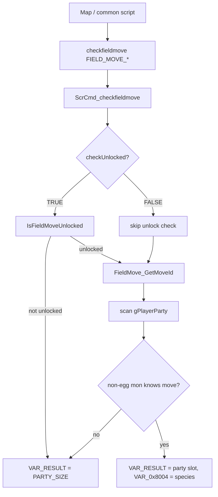
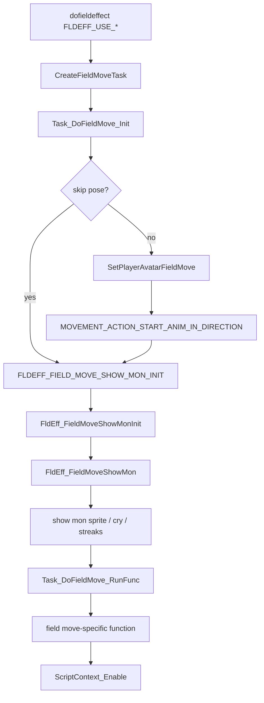

# Field Move / HM Flow v15

調査日: 2026-05-02

## Purpose

秘伝マシン由来の field move、フィールド障害物、field move animation、忘却制限、map script への影響範囲を整理する。

今回の確認は docs だけで行い、`src/`、`include/`、`data/` などの実装ファイルは変更していない。

## Key Files

| File | Confirmed symbols / role |
|---|---|
| `include/constants/tms_hms.h` | `FOREACH_TM`, `FOREACH_HM`, `FOREACH_TMHM`。HM は `CUT`, `FLY`, `SURF`, `STRENGTH`, `FLASH`, `ROCK_SMASH`, `WATERFALL`, `DIVE`。 |
| `include/constants/field_move.h` | `enum FieldMove`, `FIELD_MOVES_COUNT`。 |
| `include/field_move.h` | `struct FieldMoveInfo`, `SetUpFieldMove`, `IsFieldMoveUnlocked`, `FieldMove_GetMoveId`, `FieldMove_GetPartyMsgID`。 |
| `src/field_move.c` | `gFieldMoveInfo[FIELD_MOVES_COUNT]`。field move と move ID、unlock callback、party message を対応付ける。 |
| `asm/macros/event.inc` | `checkfieldmove fieldMove:req, checkUnlocked=FALSE` macro。 |
| `data/script_cmd_table.inc` | `SCR_OP_CHECKFIELDMOVE` -> `ScrCmd_checkfieldmove`。 |
| `src/scrcmd.c` | `ScrCmd_checkfieldmove`。party 内の技所持と optional unlock を確認し、`gSpecialVar_Result` / `gSpecialVar_0x8004` を設定。 |
| `data/scripts/field_move_scripts.inc` | Cut / Rock Smash / Strength / Waterfall / Dive / Rock Climb / Defog の script。 |
| `data/scripts/surf.inc` | Surf の script。 |
| `src/field_control_avatar.c` | A ボタン水面 interaction、Waterfall、Dive 下り/浮上 script 起動。 |
| `src/party_menu.c` | party menu の field move action、`CursorCb_FieldMove`、Move Deleter special。 |
| `src/fldeff_rocksmash.c` | `CreateFieldMoveTask` と共通 field move task。Rock Smash field effect。 |
| `src/fldeff_cut.c` | Cut tree / grass field effect。 |
| `src/fldeff_strength.c` | Strength field effect。 |
| `src/fldeff_flash.c` | Flash field effect。 |
| `src/field_effect.c` | `FldEff_FieldMoveShowMonInit`, `FldEff_FieldMoveShowMon`, Surf / Waterfall / Dive field effect。 |
| `src/field_player_avatar.c` | `SetPlayerAvatarFieldMove`, `PartyHasMonWithSurf`, `IsPlayerFacingSurfableFishableWater`。 |
| `src/pokemon.c` | `IsMoveHM`, `CannotForgetMove`。 |
| `src/pokemon_summary_screen.c` | summary screen の HM forget warning。 |
| `include/config/pokemon.h` | `P_CAN_FORGET_HIDDEN_MOVE`。 |
| `include/config/battle.h` | `B_CATCH_SWAP_CHECK_HMS`。捕獲入れ替え時の HM check。 |
| `include/config/overworld.h` | `OW_DEFOG_FIELD_MOVE`, `OW_ROCK_CLIMB_FIELD_MOVE`, `OW_FLAG_POKE_RIDER`。 |
| `src/pokemon_storage_system.c` | PC release 時の `sRestrictedReleaseMoves`。Surf / Dive / 一部 map の Strength / Rock Smash を softlock 防止対象にしている。 |

## Field Move Data Model

`src/field_move.c` の `gFieldMoveInfo` は field move の中心 table。

| Field move | Move ID | Unlock function | Party menu message |
|---|---|---|---|
| `FIELD_MOVE_CUT` | `MOVE_CUT` | `IsFieldMoveUnlocked_Cut` | `PARTY_MSG_NOTHING_TO_CUT` |
| `FIELD_MOVE_FLASH` | `MOVE_FLASH` | `IsFieldMoveUnlocked_Flash` | `PARTY_MSG_CANT_USE_HERE` |
| `FIELD_MOVE_ROCK_SMASH` | `MOVE_ROCK_SMASH` | `IsFieldMoveUnlocked_RockSmash` | `PARTY_MSG_CANT_USE_HERE` |
| `FIELD_MOVE_STRENGTH` | `MOVE_STRENGTH` | `IsFieldMoveUnlocked_Strength` | `PARTY_MSG_CANT_USE_HERE` |
| `FIELD_MOVE_SURF` | `MOVE_SURF` | `IsFieldMoveUnlocked_Surf` | `PARTY_MSG_CANT_SURF_HERE` |
| `FIELD_MOVE_FLY` | `MOVE_FLY` | `IsFieldMoveUnlocked_Fly` | `PARTY_MSG_CANT_USE_HERE` |
| `FIELD_MOVE_DIVE` | `MOVE_DIVE` | `IsFieldMoveUnlocked_Dive` | `PARTY_MSG_CANT_USE_HERE` |
| `FIELD_MOVE_WATERFALL` | `MOVE_WATERFALL` | `IsFieldMoveUnlocked_Waterfall` | `PARTY_MSG_CANT_USE_HERE` |

その他、技依存の field utility として `FIELD_MOVE_TELEPORT`, `FIELD_MOVE_DIG`, `FIELD_MOVE_SECRET_POWER`, `FIELD_MOVE_MILK_DRINK`, `FIELD_MOVE_SOFT_BOILED`, `FIELD_MOVE_SWEET_SCENT` が同じ table に入っている。`OW_ROCK_CLIMB_FIELD_MOVE` と `OW_DEFOG_FIELD_MOVE` が `TRUE` の場合は Rock Climb / Defog も追加される。

注意:

- 「HM をなくす」変更で `FIELD_MOVE_*` 自体を消すと、秘伝技ではない Dig / Teleport / Secret Power なども巻き込みやすい。
- Gen7/Gen8 風の「技を覚えていなくても使える」設計にするなら、`gFieldMoveInfo` の `moveID` と `ScrCmd_checkfieldmove` の `MonKnowsMove` 依存を分ける必要がある。

## Script Command Flow

`asm/macros/event.inc` の `checkfieldmove` は `SCR_OP_CHECKFIELDMOVE` を出力する。コメント上の仕様は以下。

- party に指定 field move を知っている非タマゴの Pokemon がいれば、`VAR_RESULT` に最初の zero-indexed party slot を入れる。
- 見つからなければ `VAR_RESULT = PARTY_SIZE`。
- 見つかった Pokemon の species は `VAR_0x8004` に入る。
- 第 2 引数 `checkUnlocked` が `TRUE` の時だけ `IsFieldMoveUnlocked(fieldMove)` を先に確認する。

`src/scrcmd.c` の `ScrCmd_checkfieldmove` は、実際に `FieldMove_GetMoveId(fieldMove)` と `MonKnowsMove(&gPlayerParty[i], move)` を使っている。



## Field Interaction Entry Points

### Cut / Rock Smash / Strength Objects

Object events in `data/maps/*/map.json` point to shared scripts:

| Object type | Script | Core behavior |
|---|---|---|
| Cut tree | `EventScript_CutTree` | `checkfieldmove FIELD_MOVE_CUT, TRUE`、confirm text、`FLDEFF_USE_CUT_ON_TREE`、`removeobject VAR_LAST_TALKED`。 |
| Smashable rock | `EventScript_RockSmash` | `checkfieldmove FIELD_MOVE_ROCK_SMASH, TRUE`、confirm text、`FLDEFF_USE_ROCK_SMASH`、`removeobject VAR_LAST_TALKED`、`TryUpdateRusturfTunnelState`、`RockSmashWildEncounter`。 |
| Strength boulder | `EventScript_StrengthBoulder` | `checkfieldmove FIELD_MOVE_STRENGTH, TRUE`、`FLDEFF_USE_STRENGTH`、`FLAG_SYS_USE_STRENGTH` を set。 |

`rg -l` で確認した map 配置の例:

| Shared script | Confirmed map examples |
|---|---|
| `EventScript_CutTree` | `data/maps/Route104/map.json`, `data/maps/PetalburgWoods/map.json`, `data/maps/Route110_TrickHousePuzzle1/map.json`, `data/maps/Route120/map.json`, `data/maps/CeruleanCity_Frlg/map.json`, `data/maps/ThreeIsland_BerryForest_Frlg/map.json` |
| `EventScript_RockSmash` | `data/maps/Route111/map.json`, `data/maps/Route114/map.json`, `data/maps/Route115/map.json`, `data/maps/RusturfTunnel/map.json`, `data/maps/SeafloorCavern_Room1/map.json`, `data/maps/VictoryRoad_B1F/map.json` |
| `EventScript_StrengthBoulder` | `data/maps/SeafloorCavern_Room1/map.json`, `data/maps/SeafloorCavern_Room8/map.json`, `data/maps/FieryPath/map.json`, `data/maps/VictoryRoad_B1F/map.json`, `data/maps/SeafoamIslands_1F_Frlg/map.json` |

Full inventory は再生成できるよう、実装前に以下で確認する。

```bash
rg -l "EventScript_CutTree" data/maps/*/map.json data/maps/*/scripts.inc
rg -l "EventScript_RockSmash" data/maps/*/map.json data/maps/*/scripts.inc
rg -l "EventScript_StrengthBoulder" data/maps/*/map.json data/maps/*/scripts.inc
```

### Surf / Waterfall / Dive

`src/field_control_avatar.c` が水面や dive metatile から script を起動する。

| Flow | Confirmed symbols |
|---|---|
| Surf | `GetInteractedWaterScript` -> `IsFieldMoveUnlocked(FIELD_MOVE_SURF)` -> `PartyHasMonWithSurf()` -> `IsPlayerFacingSurfableFishableWater()` -> `EventScript_UseSurf` |
| Waterfall | `GetInteractedWaterScript` -> `MetatileBehavior_IsWaterfall` -> `CheckFollowerNPCFlag(FOLLOWER_NPC_FLAG_CAN_WATERFALL)` -> `IsFieldMoveUnlocked(FIELD_MOVE_WATERFALL)` -> `IsPlayerSurfingNorth()` -> `EventScript_UseWaterfall` |
| Dive down | `TrySetupDiveDownScript` -> `CheckFollowerNPCFlag(FOLLOWER_NPC_FLAG_CAN_DIVE)` -> `IsFieldMoveUnlocked(FIELD_MOVE_DIVE)` -> `TrySetDiveWarp() == 2` -> `EventScript_UseDive` |
| Dive emerge | `TrySetupDiveEmergeScript` -> `gMapHeader.mapType == MAP_TYPE_UNDERWATER` -> `TrySetDiveWarp() == 1` -> `EventScript_UseDiveUnderwater` |

Surf script は `data/scripts/surf.inc` に分かれており、`EventScript_UseSurf` 内でも `checkfieldmove FIELD_MOVE_SURF` を実行する。

Waterfall / Dive は `data/scripts/field_move_scripts.inc` 側で `checkfieldmove FIELD_MOVE_WATERFALL` / `checkfieldmove FIELD_MOVE_DIVE` を実行する。これらの script は `checkUnlocked=TRUE` を渡していないが、C 側 entry point で unlock check 済み。

### Flash

`src/fldeff_flash.c` の `SetUpFieldMove_Flash` は以下を確認した。

- `ShouldDoBrailleRegisteelEffect()` の puzzle 分岐。
- `gMapHeader.cave == TRUE` かつ `!FlagGet(FLAG_SYS_USE_FLASH)` の場合、`FieldCallback_Flash` へ。
- `FldEff_UseFlash` は `PlaySE(SE_M_REFLECT)`、`FlagSet(FLAG_SYS_USE_FLASH)`、`ScriptContext_SetupScript(EventScript_UseFlash)` を実行する。

`requires_flash: true` を持つ map として以下を確認した。

- `data/maps/GraniteCave_B1F/map.json`
- `data/maps/GraniteCave_B2F/map.json`
- `data/maps/VictoryRoad_B1F/map.json`
- `data/maps/VictoryRoad_B2F/map.json`
- `data/maps/RockTunnel_1F_Frlg/map.json`
- `data/maps/RockTunnel_B1F_Frlg/map.json`
- `data/maps/CaveOfOrigin_UnusedRubySapphireMap1/map.json`
- `data/maps/CaveOfOrigin_UnusedRubySapphireMap2/map.json`
- `data/maps/CaveOfOrigin_UnusedRubySapphireMap3/map.json`

## Party Menu Entry Point

`src/party_menu.c` の `SetPartyMonFieldSelectionActions` は、選択中の Pokemon が `FieldMove_GetMoveId(j)` に一致する move を覚えている場合、action list に `j + MENU_FIELD_MOVES` を追加する。

`CursorCb_FieldMove` の主な流れ:

1. action から `fieldMove = action - MENU_FIELD_MOVES` を復元する。
2. `gFieldMoveInfo[fieldMove].fieldMoveFunc == NULL` なら終了。
3. link / Union Room では field move を拒否する。
4. `IsFieldMoveUnlocked(fieldMove)` を確認する。
5. `SetUpFieldMove(fieldMove)` を呼ぶ。
6. `FIELD_MOVE_MILK_DRINK` / `FIELD_MOVE_SOFT_BOILED` は回復対象選択へ。
7. `FIELD_MOVE_TELEPORT` / `FIELD_MOVE_DIG` は帰還確認 message へ。
8. `FIELD_MOVE_FLY` は `CB2_OpenFlyMap` へ。
9. その他は `CB2_ReturnToField` で field へ戻り、`gPostMenuFieldCallback` / `gFieldCallback2` が field effect を続ける。

危険点:

- party menu 側は「選択中の Pokemon が field move の move ID を覚えている」ことを action 表示条件にしている。
- script 側だけを modernize しても、party menu には技を覚えた Pokemon の action しか出ない。
- field move を key item / ride 化するなら、party menu action を消すか、別 UI 入口に分ける設計が必要。

## Animation / Field Effect Flow

### Common Show-Mon Flow

Cut / Rock Smash / Strength などは `src/fldeff_rocksmash.c` の `CreateFieldMoveTask` を共通利用する。



確認した symbols:

- `SetPlayerAvatarFieldMove` は `PLAYER_AVATAR_STATE_FIELD_MOVE` の graphics に切り替え、`ANIM_FIELD_MOVE` を開始する。
- `FldEff_FieldMoveShowMonInit` は `gFieldEffectArguments[0]` を party slot として扱い、`gPlayerParty[slot]` から species / shiny / personality を読み出す。
- `FldEff_FieldMoveShowMon` は屋外/屋内の streaks 表示と Pokemon sprite 表示を行う。
- streaks assets は `graphics/field_effects/pics/field_move_streaks.*` と `field_move_streaks_indoors.*`。
- player field move graphics は `OBJ_EVENT_GFX_BRENDAN_FIELD_MOVE`, `OBJ_EVENT_GFX_MAY_FIELD_MOVE`, `OBJ_EVENT_GFX_RED_FIELD_MOVE`, `OBJ_EVENT_GFX_GREEN_FIELD_MOVE` など。
- animation table は `src/data/object_events/object_event_anims.h` の `sAnim_FieldMove` / `sAnimTable_FieldMove`。

`CreateFieldMoveTask` の `gFieldEffectArguments[3]` は **player field move pose skip** として使われる。Cut / Rock Smash / Defog / grass cut などの scripts では follower が field move user の場合に arg3 を nonzero にしている。ただしこの branch は `FLDEFF_FIELD_MOVE_SHOW_MON_INIT` を起動するため、Pokemon の show-mon streak animation は残る。

つまり:

| Desired change | Existing support | Notes |
|---|---|---|
| player の field move pose を省略 | `gFieldEffectArguments[3]` で一部対応済み | underwater / follower user などで使われる。 |
| Pokemon が出る streak animation を省略 | Fly out の `gSkipShowMonAnim` 以外は未共通化 | Cut / Rock Smash / Strength / Surf / Waterfall / Dive / Rock Climb には個別対応が必要。 |
| party slot を要求しない field effect にする | 未対応 | `FldEff_FieldMoveShowMonInit` が `gPlayerParty[(u8)gFieldEffectArguments[0]]` を読むため、Pokemon 表示なし設計では別 path が必要。 |

### Surf / Waterfall / Dive Are Special

`src/field_effect.c` で Surf / Waterfall / Dive は独自 task を持つ。

| Effect | Confirmed flow |
|---|---|
| `FldEff_UseSurf` | `Task_SurfFieldEffect`。`SurfFieldEffect_Init` で controls lock / follower hide / surfing flag、`SurfFieldEffect_FieldMovePose` で `SetPlayerAvatarFieldMove`、`SurfFieldEffect_ShowMon` で `FLDEFF_FIELD_MOVE_SHOW_MON_INIT`、その後 surfing graphics / surf blob。 |
| `FldEff_UseWaterfall` | `Task_UseWaterfall`。show-mon 後に waterfall metatile を北方向へ移動。通常の `CreateFieldMoveTask` ではない。 |
| `FldEff_UseDive` | `Task_UseDive`。show-mon 後に `TryDoDiveWarp`。通常の `CreateFieldMoveTask` ではない。 |

Gen7/Gen8 風に field move を Pokemon 技から切り離す場合も、show-mon animation を残すなら `gFieldEffectArguments[0]` へ「どの Pokemon を表示するか」を渡す仕様が残る。Pokemon を表示しない ride/key item animation に変えるなら `FldEff_FieldMoveShowMonInit` の party slot 前提を避ける別 effect が必要。

### Show-Mon Skip Investigation

既存の skip hook:

| Symbol / path | Current scope |
|---|---|
| `gSkipShowMonAnim` | Fly out 側で `FLDEFF_FIELD_MOVE_SHOW_MON_INIT` を起動しないための global。`FldEff_FlyIn` で `FALSE` に戻す。 |
| `gFieldEffectArguments[3]` | `CreateFieldMoveTask` の player pose skip。show-mon skip ではない。 |
| `SHOW_MON_CRY_NO_DUCKING` | Surf / Rock Climb などが cry ducking を抑制するための high bit。show-mon skip ではない。 |

現時点の安全な実装候補:

1. `ShouldSkipFieldMoveShowMon()` のような小さい判定を追加し、`FieldEffectStart(FLDEFF_FIELD_MOVE_SHOW_MON_INIT)` の直前で見る。
2. Cut / Rock Smash / Strength 系の `CreateFieldMoveTask` は、skip 時に `Task_DoFieldMove_WaitForMon` 相当の後処理を直接満たす必要がある。具体的には facing direction と player graphics restore を崩さない。
3. Surf / Waterfall / Dive / Rock Climb は共通 task ではないため、それぞれの `*_ShowMon` / `*_WaitForShowMon` state を確認して bypass する。
4. Fly は既に `gSkipShowMonAnim` があるため、field move 全体へ流用するか、Fly 専用のまま残すかを設計で決める。
5. party menu から起動した場合と map object script から起動した場合で、`gFieldEffectArguments[0]` が party slot / species のどちらとして扱われているかを必ず確認する。

この変更は見た目だけでなく wait condition にも影響する。多くの state machine は `!FieldEffectActiveListContains(FLDEFF_FIELD_MOVE_SHOW_MON)` を待って次へ進むため、skip 時は field effect active list を中途半端に残さないこと。

## Object Removal / Map State Effects

| Feature | Map state mutation |
|---|---|
| Cut tree | `EventScript_CutTreeDown` が `removeobject VAR_LAST_TALKED`。object hide flag がある場合は再出現条件に影響。 |
| Rock Smash | `EventScript_SmashRock` が `removeobject VAR_LAST_TALKED`。その後 `TryUpdateRusturfTunnelState` と `RockSmashWildEncounter`。 |
| Strength | `EventScript_ActivateStrength` が `FLAG_SYS_USE_STRENGTH` を set。boulder movement は Strength 有効状態を前提に動く。 |
| Flash | `FldEff_UseFlash` が `FLAG_SYS_USE_FLASH` を set。cave lighting に影響。 |
| Surf / Waterfall / Dive | player avatar state、warp、follower sprite、水上移動に影響。 |

`Overworld_ResetStateAfterWhiteOut`, `Overworld_ResetStateAfterFly`, `Overworld_ResetStateAfterTeleport`, `Overworld_ResetStateAfterDigEscRope` は `FLAG_SYS_USE_STRENGTH` / `FLAG_SYS_USE_FLASH` を clear する。field move 廃止時もこの temporary state は残すか、別 state に置き換えるか決める必要がある。

## Move Forget / HM Restrictions

確認した既存制限:

| Area | File / symbols | Behavior |
|---|---|---|
| Core forget rule | `src/pokemon.c`, `CannotForgetMove`, `IsMoveHM` | `P_CAN_FORGET_HIDDEN_MOVE` が `FALSE` なら `FOREACH_HM` の move は忘却不可。 |
| Config | `include/config/pokemon.h`, `P_CAN_FORGET_HIDDEN_MOVE` | HM を忘れられるかの global config。 |
| Battle learn move | `src/battle_script_commands.c` | learn move 中に `CannotForgetMove(move)` なら `STRINGID_HMMOVESCANTBEFORGOTTEN`。 |
| Evolution learn move | `src/evolution_scene.c` | evolution / trade evolution learn move でも `CannotForgetMove(move)` を確認。 |
| Summary screen | `src/pokemon_summary_screen.c` | `CannotForgetMove` に基づく HM forget warning。 |
| Move Deleter | `data/maps/LilycoveCity_MoveDeletersHouse/scripts.inc`, `src/party_menu.c` | `MoveDeleterChooseMoveToForget`, `MoveDeleterForgetMove`, `IsLastMonThatKnowsSurf`。Emerald script は Surf 最後の 1 匹だけを明示確認。 |
| FRLG Move Deleter | `data/maps/FuchsiaCity_House3_Frlg/scripts.inc` | `MoveDeleterForgetMove` を使うが、Emerald 側の Surf-specific check は見当たらない。 |
| PC release softlock | `src/pokemon_storage_system.c`, `sRestrictedReleaseMoves` | Surf / Dive と一部 map の Strength / Rock Smash を持つ最後の Pokemon release を防ぐ。 |
| Catch swap | `include/config/battle.h`, `B_CATCH_SWAP_CHECK_HMS` | 捕獲入れ替え時、HM 持ちを box に送る制限に関係。 |

ユーザー要件の「技を追い出せる機能も NG」は解釈が 2 通りある。

1. HM move を従来通り忘れられないままにする。
2. field move を技から切り離した後も、対象 move には別の永続制限を残す。

現時点では未実装のため、どちらを採用するかは `docs/features/field_move_modernization/` の Open Questions に残す。

## External References Checked

外部実装は今回の設計の参考候補として確認したが、まだこの repo へ取り込む前提ではない。

| Reference | What was checked |
|---|---|
| `https://github.com/PokemonSanFran/pokeemerald/wiki/No-Whiteout-After-Player-Loss` | No Whiteout 系改造の考え方。battle loss 後は party が倒れたままなので `special HealPlayerParty` などが必要という注意点がある。 |
| `https://github.com/Pokabbie/pokeemerald-rogue/` | Pokemon Emerald Rogue の公開 repo が存在することを確認。強制 release 実装の具体 source path は未確認。 |
| `https://github.com/DepressoMocha/emerogue` | Emerald Rogue 系 fork。README 上に run / route / ride control などの QoL 設定があることを確認。強制 release 実装の具体 source path は未確認。 |

## Modernization Insertion Candidates

実装はまだ行わない。候補だけ整理する。

| Candidate | Pros | Risks |
|---|---|---|
| `ScrCmd_checkfieldmove` の判定を拡張 | map object script の入口をまとめて modernize しやすい。 | party menu、animation、`VAR_RESULT` の party slot 前提とずれる。 |
| `gFieldMoveInfo` に unlock policy を追加 | move ID と解禁条件を一元化しやすい。 | `struct FieldMoveInfo` を変えると全 field move に影響。upstream 追従も重い。 |
| 新 special / 新 script command を追加 | 既存 `checkfieldmove` を壊さず key item / ride 判定を足せる。 | script 側の置換量が増える。map object を全検索する必要がある。 |
| party menu field move action を消す | Gen7/Gen8 風に「技から使う」導線を廃止できる。 | Fly / Dig / Teleport / Soft-Boiled など非 HM utility を巻き込まない分離が必要。 |
| field effect に party slot 不要の mode を追加 | Pokemon 表示なし、ride/key item 演出へ移行しやすい。 | `FldEff_FieldMoveShowMonInit` の前提を変えると animation 崩れのリスクが高い。 |
| obstacle map object を撤去 | softlock と field move 依存を根本的に減らせる。 | map design、NPC movement、item route、story gating を全 map で確認する必要がある。 |

## Open Questions

- Gen7/Gen8 風にする時、Cut / Rock Smash / Strength の障害物を「完全撤去」するか「A ボタンで badge/key item 判定して自動処理」するか未決定。
- show-mon animation を残すか、ride/key item animation に置き換えるか未決定。
- Badge unlock は `src/field_move.c` の `IsFieldMoveUnlocked_*` に分離済みだが、`ScrCmd_checkfieldmove`、party menu action、Surf の `PartyHasMonWithSurf()`、field effect argument 0 はまだ技所持 / party slot 前提。key item / story flag unlock にする場合はこの coupling を先に設計する。
- `P_CAN_FORGET_HIDDEN_MOVE` を維持するか、field move 廃止後に HM move 自体を通常 move として扱うか未決定。
- `B_CATCH_SWAP_CHECK_HMS` と `sRestrictedReleaseMoves` をどう扱うか未決定。HM が不要になれば softlock 防止理由は弱くなるが、Dive / Surf の地形依存が残るなら別制限が必要。
- Secret Power / secret base は `FIELD_MOVE_SECRET_POWER` を使うが HM ではない。今回の HM 廃止に含めるか未決定。
- Emerald Rogue の強制 release 実装 source path は未確認。必要なら外部 repo を clone/compare して追加調査する。
