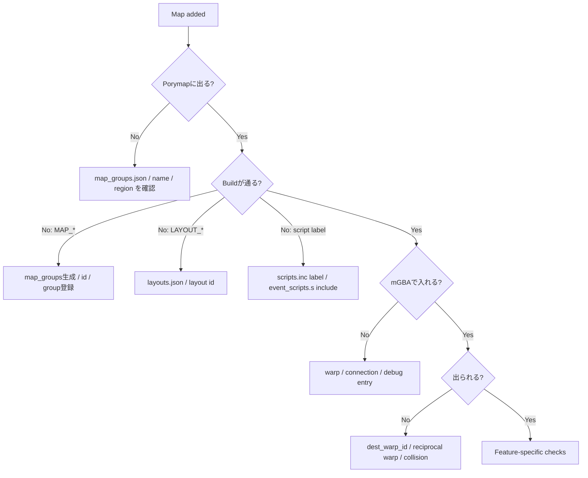

# Map Creation Flow v15

## Document Metadata

| Field | Value |
|---|---|
| Last reviewed | 2026-05-17 |
| Baseline | `master` `36fa0b2dc4`; `git describe` = `expansion/1.15.2-61-g36fa0b2dc4` |
| Code status | Docs-only flow |
| Provenance | Local source read and existing map docs |

## Purpose

新規 map を追加する時の依存関係を、build pipeline の順番で整理する。対象は `data/maps/<MapName>/map.json`、`scripts.inc`、`map_groups.json`、`layouts.json`、Region Map / Fly 連携まで。

この flow は「map を作る前に何を決めるか」と「build が何を生成するか」を確認するためのもの。個別の NPC movement や flag / var の詳細は既存 flow docs に分ける。

## Read With

| Doc | Focus |
|---|---|
| [新規マップ作成マニュアル](../manuals/map_creation_manual.md) | 作業手順と命名規則。 |
| [Map Script Flow v15](map_script_flow_v15.md) | `MAP_SCRIPT_*` の runtime dispatch。 |
| [Map Script / Flag / Var Flow v15](map_script_flag_var_flow_v15.md) | flag / var / coord / hidden item。 |
| [NPC / Object Event Flow v15](npc_object_event_flow_v15.md) | object event / movement / visibility。 |
| [Map Registration / Region Map / Fly Flow v15](map_registration_fly_region_flow_v15.md) | `MAPSEC_*` / Fly / world map flag。 |

## Build Pipeline

```mermaid
flowchart TD
    A[data/maps/<MapName>/map.json] --> B[tools/mapjson map]
    C[data/layouts/layouts.json] --> B
    B --> D[data/maps/<MapName>/header.inc]
    B --> E[data/maps/<MapName>/events.inc]
    B --> F[data/maps/<MapName>/connections.inc]

    G[data/maps/map_groups.json] --> H[tools/mapjson groups]
    A --> H
    H --> I[include/constants/map_groups.h]
    H --> J[data/maps/groups.inc]
    H --> K[data/maps/headers.inc]
    H --> L[data/maps/events.inc]
    H --> M[data/maps/connections.inc]
    H --> N[src/data/map_group_count.h]

    C --> O[tools/mapjson layouts]
    O --> P[include/constants/layouts.h]
    O --> Q[data/layouts/layouts.inc]
    O --> R[data/layouts/layouts_table.inc]

    A --> S[tools/mapjson event_constants]
    S --> T[include/constants/map_event_ids.h]

    U[data/maps/<MapName>/scripts.inc] --> V[data/event_scripts.s]
    V --> W[event_scripts.o]
```



重要点:

- `header.inc` / `events.inc` / `connections.inc` は `map.json` から生成される。
- `scripts.inc` は生成されない。人間が書く。
- `scripts.inc` を作っても、`data/event_scripts.s` に include しなければ ROM に入らない。
- `include/constants/map_groups.h` と `include/constants/layouts.h` は生成物なので直接編集しない。

## Registration Layers

| Layer | Source file | Generated / runtime output | Notes |
|---|---|---|---|
| Map identity | `data/maps/<MapName>/map.json` `id` / `name` | `MAP_*`, map header label | `name` は directory と合わせる。 |
| Map group | `data/maps/map_groups.json` | `gMapGroups`, `MAP_GROUP`, `MAP_NUM`, `MAP_GROUPS_COUNT` | group の順序は map number に影響する。 |
| Layout | `data/layouts/layouts.json` | `LAYOUT_*`, `gMapLayouts` | `layout` id は `map.json` から参照される。 |
| Event placement | `map.json` `object_events`, `warp_events`, `coord_events`, `bg_events` | `events.inc`, `map_event_ids.h` | `local_id` と `warp_id` は constants へ自動生成。 |
| Script body | `data/maps/<MapName>/scripts.inc` | event script bytecode | `MapName_MapScripts::` と各 label を定義する。 |
| Script include | `data/event_scripts.s` | `event_scripts.o` | include 追加忘れは undefined symbol か script 未収録の原因。 |
| Region name | `region_map_section` in `map.json` | `gMapHeader.regionMapSectionId` | map name popup と現在地判定に使う。 |
| Region map entry | `src/data/region_map/region_map_sections.json` | `MAPSEC_*`, name, x/y/size | 直接 header を編集しない。 |
| Fly | `src/region_map.c` + map scripts | icon, selectable state, warp destination | map header だけでは Fly 可能にならない。 |

## Phase 0: 設計を決める

先に決める項目:

| Question | Decision |
|---|---|
| map type | town / route / indoor / cave / dungeon / facility |
| build target | Emerald only, FRLG only, both |
| source template | 近い既存 map 1 つ |
| mapsec | 既存 `MAPSEC_*` を共有するか、新規追加するか |
| entry | warp / connection / debug warp / special script |
| exit | warp / connection / one-way |
| player-facing feature | map name popup, Fly, Town Map, wild encounter, NPC, trainer, item ball |
| validation | mGBA で何を確認するか |

この段階で Fly / Region Map が不要なら、後続 phase に送る。最初の PR では「map に入れる・出られる」までに切る方が安全。

## Phase 1: Layout

1. `data/layouts/<LayoutName>/` を作る。
2. `border.bin` と `map.bin` を用意する。
3. `data/layouts/layouts.json` に entry を足す。

Entry の主な field:

| Field | Notes |
|---|---|
| `id` | `LAYOUT_<UPPER_SNAKE>`。 |
| `name` | `<MapName>_Layout` のような label。 |
| `width` / `height` | map dimensions。 |
| `primary_tileset` | 通常は `gTileset_General` など既存例に合わせる。 |
| `secondary_tileset` | town / route / cave / indoor で既存例に合わせる。 |
| `border_filepath` | `data/layouts/<LayoutName>/border.bin`。 |
| `blockdata_filepath` | `data/layouts/<LayoutName>/map.bin`。 |
| `layout_version` | Emerald map なら `emerald`。FRLG は既存 FRLG entry に合わせる。 |

## Phase 2: Map JSON

`data/maps/<MapName>/map.json` を作る。既存 map を template にする。

最低限見る field:

| Field | Notes |
|---|---|
| `id` | `MAP_<UPPER_SNAKE>`。 |
| `name` | directory 名と一致。 |
| `layout` | `layouts.json` の `id` と一致。 |
| `music` | `MUS_*`。 |
| `region` | FRLG map なら `REGION_KANTO`。省略時は `REGION_HOENN`。 |
| `region_map_section` | map name popup / current location 用。 |
| `weather` | indoor は `WEATHER_NONE` が多い。 |
| `map_type` | `MAP_TYPE_TOWN`, `MAP_TYPE_ROUTE`, `MAP_TYPE_INDOOR` など。 |
| `allow_cycling` / `allow_escaping` / `allow_running` | 既存同型 map に合わせる。 |
| `show_map_name` | 屋外は true、屋内は false が多い。 |
| `battle_scene` | 通常は `MAP_BATTLE_SCENE_NORMAL`。 |
| `connections` | 屋外隣接 map。屋内は `null` が多い。 |
| `object_events` | NPC / item ball / static object。 |
| `warp_events` | 出入口。 |
| `coord_events` | 踏んだ時の event。 |
| `bg_events` | sign / hidden item / secret base。 |

## Phase 3: Map Group

`data/maps/map_groups.json` に `<MapName>` を追加する。

選び方:

| Map | Group example |
|---|---|
| Hoenn town / route | `gMapGroup_TownsAndRoutes` |
| Hoenn town indoor | `gMapGroup_Indoor<ParentTown>` |
| Hoenn route indoor | `gMapGroup_IndoorRoute###` |
| Hoenn dungeon | `gMapGroup_Dungeons` |
| Battle Frontier / special | `gMapGroup_SpecialArea` |
| FRLG outdoor | `gMapGroup_TownsAndRoutes_Frlg` |
| FRLG indoor | `gMapGroup_Indoor<Parent>_Frlg` |
| FRLG dungeon | `gMapGroup_Dungeons_Frlg` |

注意:

- group 内の順序は `MAP_NUM` に影響する。
- 既存 map の順序を不用意に変えると、保存済み warp / scripts / generated constants の比較が読みにくくなる。
- 新規 map は、同じ親 town / route の末尾に足す方が review しやすい。

## Phase 4: Scripts

`data/maps/<MapName>/scripts.inc` を作り、`data/event_scripts.s` に include する。

最小:

```asm
MapName_MapScripts::
	.byte 0
```

map script がある場合:

```asm
MapName_MapScripts::
	map_script MAP_SCRIPT_ON_TRANSITION, MapName_OnTransition
	.byte 0

MapName_OnTransition:
	setflag FLAG_VISITED_EXAMPLE_PLACE
	end
```

object event が script を参照する場合:

```asm
MapName_EventScript_Npc::
	msgbox MapName_Text_Npc, MSGBOX_NPC
	end

MapName_Text_Npc:
	.string "Text goes here.$"
```

`map.json` で `script` に `MapName_EventScript_Npc` を書いたら、同じ label を `scripts.inc` に必ず定義する。

## Phase 5: Events

### Object Events

`map.json` の `object_events` は `events.inc` の `object_event` に生成される。

| Field | Notes |
|---|---|
| `local_id` | 必要な object には明示する。`LOCALID_*` が自動生成される。 |
| `graphics_id` | `OBJ_EVENT_GFX_*`。 |
| `x` / `y` / `elevation` | 初期座標。 |
| `movement_type` | `MOVEMENT_TYPE_*`。 |
| `movement_range_x/y` | range 対応 movement のみ意味が大きい。 |
| `script` | 会話 / trainer / item script label。 |
| `flag` | set されていると spawn しない。常時表示は `0`。 |

### Warp Events

`dest_warp_id` は相手 map の `warp_events` の index。`warp_id` を書いた場合は `include/constants/map_event_ids.h` に自動生成される。

確認すること:

- 入口と出口の両方に warp があるか。
- `dest_map` が `MAP_*` として生成される map か。
- `dest_warp_id` が相手 map の正しい warp index か。
- warp tile の elevation が map collision と合っているか。

### Coord Events

`coord_events` は踏んだ時に script を起動する。`var` は名前上 var だが、runtime では flag id を使う場合もある。新規では saved var を明示的に使う方が読みやすい。

### Bg Events

sign / hidden item / secret base を扱う。hidden item の flag は hidden item 用 range を使う。通常 item ball の flag と混ぜない。

## Phase 6: Region Map / Fly

最初の map PR では無理に入れない。必要な場合だけ、別 slice として以下を揃える。

| Requirement | Source |
|---|---|
| map name / mapsec | `src/data/region_map/region_map_sections.json` |
| cursor tile | `src/data/region_map/region_map_layout*.h` |
| fly icon | `src/region_map.c` `sFlyLocations` |
| selectable state | `src/region_map.c` `GetMapsecType` |
| destination | `src/region_map.c` `sMapHealLocations` / `FilterFlyDestination` |
| unlock flag | Hoenn: `setflag FLAG_VISITED_*`; FRLG: `setworldmapflag FLAG_WORLD_MAP_*` |

屋内 map は親 town / route の `MAPSEC_*` を共有し、`show_map_name: false` にすることが多い。

## Phase 7: Build / Validation

最小 build:

```sh
rtk make -j16 -O all
```

Debug warp / debug menu を使う場合:

```sh
rtk make -j16 -O debug
```

script logic / save / battle / item を触る場合:

```sh
rtk make -j16 -O check
```

docs:

```sh
rtk mdbook build docs
```

mapjson が古い generated output を掴んでいる疑いがある場合:

```sh
rtk make clean-generated
rtk make -j16 -O all
```

## mGBA Manual Check

| Check | Expected |
|---|---|
| ROM boot | 起動できる。 |
| map entry | debug warp / normal warp / connection で入れる。 |
| map exit | 戻れる。詰まない。 |
| collision | 壁、出口、段差、水、草むらが想定通り。 |
| map name popup | 屋外なら出る、屋内なら出ない。 |
| NPC | 表示、会話、向き、movement が正常。 |
| hide flag | 消した NPC が再入場で戻らない / 戻る仕様が正しい。 |
| item ball / hidden item | 取得、flag、再入場後の状態が正しい。 |
| warp pair | 出入口が対応している。 |
| connection | map 境界を跨いでも座標がズレない。 |
| save/load | map 上で save して再開できる。 |
| Fly / Region Map | 対応した場合のみ、icon、cursor、destination、unlock が一致。 |

## Porymap Check

| Check | Expected |
|---|---|
| map list | `<MapName>` が表示される。 |
| layout | `map.bin` / `border.bin` が表示される。 |
| tileset | primary / secondary tileset が想定通り。 |
| events | object / warp / coord / bg event が見える。 |
| local ids | 必要な object に `LOCALID_*` が付いている。 |
| custom region | FRLG map は `REGION_KANTO`。 |

## Common Failure Flow



## Open Questions

- 新規 map 用に `data/event_scripts.s` include 追加忘れを検出する lint を作るか。
- Porymap で作成した map の `region` / group / script label をまとめて検査する local doctor が必要か。
- 独自 region を作る場合、Hoenn / Kanto / Sevii の既存 mapsec 範囲とどう分離するか。
