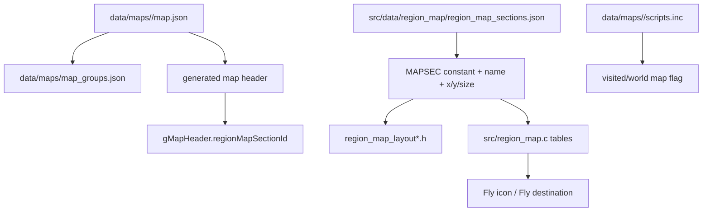
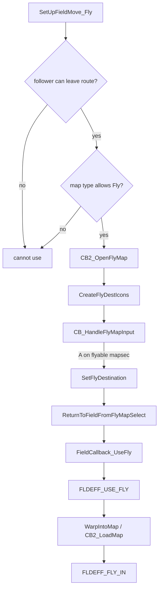
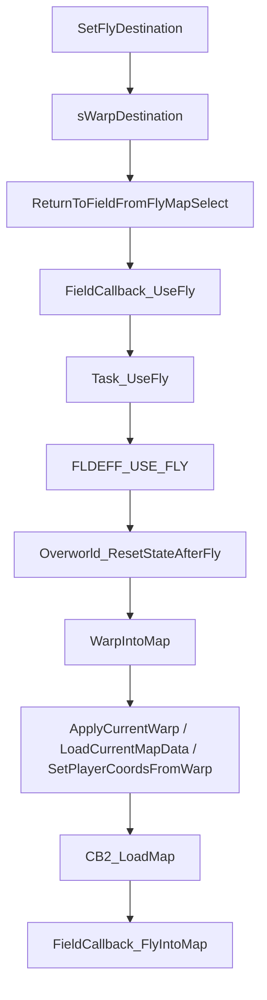

# Map Registration / Region Map / Fly Flow v15

調査日: 2026-05-03。source / data / include / tools は読み取りのみ。実装はまだ行わず、`docs/` への調査メモだけを追加する。

## Purpose

新規 map を追加するときに混ざりやすい以下を分離して整理する。

- `map.json` / map group への登録
- 実際の map name / `region_map_section`
- Town Map / Region Map 上の座標
- Fly destination と unlock flag
- FRLG 系の map preview / world map flag
- warp 実行と callback

結論: 新規 map の Fly 対応は、**map header だけでは完結しない**。`MAPSEC_*`、region map layout、Fly icon table、unlock flag、destination table、map script の flag set が揃って初めて安定する。

## Registration Layers

| Layer | Main files | Role |
|---|---|---|
| Map identity | [data/maps/map_groups.json](../../data/maps/map_groups.json), `data/maps/<Map>/map.json` | `MAP_*` 定数、map group、map header 生成元。 |
| Map header field | `region_map_section` in `map.json` | `gMapHeader.regionMapSectionId` になる。map name popup / region判定 / player icon の現在地計算で使う。 |
| Map section definition | [src/data/region_map/region_map_sections.json](../../src/data/region_map/region_map_sections.json) | `MAPSEC_*` の id/name/x/y/width/height の source。 |
| Generated constants | [include/constants/region_map_sections.h](../../include/constants/region_map_sections.h) | auto-generated。直接編集禁止。 |
| Region map tiles | [src/data/region_map/region_map_layout.h](../../src/data/region_map/region_map_layout.h), `region_map_layout_kanto.h`, Sevii layout files | cursor でどの tile がどの `MAPSEC_*` かを返す。 |
| Fly unlock/type | [src/region_map.c](../../src/region_map.c) `GetMapsecType`, `sFlyLocations` | visited/world map flag により flyable icon / selectable state を決める。 |
| Fly destination | [src/region_map.c](../../src/region_map.c) `sMapHealLocations`, `FilterFlyDestination`, `SetFlyDestination` | selected mapsec を heal location or map warp に変換する。 |
| FRLG preview | [src/map_preview_screen.c](../../src/map_preview_screen.c), [include/map_preview_screen.h](../../include/map_preview_screen.h) | `setworldmapflag` 経由で world map flag と preview duration state を更新。 |

## Normal Map Add Flow

## Region Map Section

`region_map_sections.json` は source of truth。`include/constants/region_map_sections.h` は自動生成なので直接編集しない。

`GetRegionForSectionId()` は `KANTO_MAPSEC_START <= sectionId < MAPSEC_SPECIAL_AREA` を Kanto とみなす。したがって、Kanto / Sevii と Hoenn の境界に新規 `MAPSEC_*` を入れる場合、順序が region 判定に影響する。

Kanto subregion は [src/regions.c](../../src/regions.c) の `sKantoSubregionMapsecs` で分類される。Sevii 1-3 / 4-5 / 6-7 のどの map graphic を開くかはここに依存する。

## Fly Unlock and Icon State

Fly map の入口は party menu:

Key functions:

| Function | Role |
|---|---|
| `SetUpFieldMove_Fly` | current map type and follower permission check。 |
| `CB2_OpenFlyMap` | Fly map UI 初期化。 |
| `CreateFlyDestIcons` | `sFlyLocations` から region 一致分の icon を作る。flag set 済みなら flicker callback を付ける。 |
| `GetMapsecType` | cursor 上の `MAPSEC_*` が selectable かを flag で判定。 |
| `FilterFlyDestination` | special destination / heal location / map warp を選ぶ。 |
| `SetFlyDestination` | `SetWarpDestinationToHealLocation` or `SetWarpDestinationToMapWarp`。 |
| `ReturnToFieldFromFlyMapSelect` | field callback を `FieldCallback_UseFly` に設定。 |

## Fly Destination Requirements

Fly 可能にする mapsec には最低限これが必要。

| Requirement | Where |
|---|---|
| region map 上の座標/サイズ | `src/data/region_map/region_map_sections.json` |
| cursor が拾える layout entry | `src/data/region_map/region_map_layout*.h` |
| fly icon entry | `src/region_map.c` `sFlyLocations` |
| unlock flag check | `src/region_map.c` `GetMapsecType` |
| destination | `src/region_map.c` `sMapHealLocations` or `FilterFlyDestination` |
| unlock script | Hoenn は `setflag FLAG_VISITED_*`、FRLG は `setworldmapflag FLAG_WORLD_MAP_*` が多い |
| actual map header | destination map の `map.json` に正しい `region_map_section` / `map_type` |

`sMapHealLocations[mapsec]` は fly destination の fallback にも使われる。heal location がある city は heal location へ、なければ `SetWarpDestinationToMapWarp(mapGroup, mapNum, WARP_ID_NONE)` に落ちる。

## FRLG-specific World Map Flags

FRLG 側は `FLAG_WORLD_MAP_*` が本体。Emerald 側の [include/constants/flags.h](../../include/constants/flags.h) では多くが `0`、FRLG 側の [include/constants/flags_frlg.h](../../include/constants/flags_frlg.h) で実値が定義される。

`setworldmapflag` script command は [src/scrcmd.c](../../src/scrcmd.c) の `ScrCmd_setworldmapflag` から `MapPreview_SetFlag(flag)` を呼ぶ。`MapPreview_SetFlag` は:

- flag 未設定なら `sHasVisitedMapBefore = TRUE`
- flag 設定済みなら `sHasVisitedMapBefore = FALSE`
- 最後に `FlagSet(flagId)`

これにより、FRLG の map preview duration は「初訪問かどうか」と連動する。`setflag` と `setworldmapflag` は同じではない。

## Flicker / Blinking Risk

Fly map の icon 点滅自体は仕様として存在する。`SpriteCB_FlyDestIcon` は cursor が同じ mapsec 上にある時、16 frame ごとに `sprite->invisible` を反転する。

問題になりやすいのは次のケース。

| Risk | Why |
|---|---|
| `sFlyLocations` にあるが `GetMapsecType` 側に対応 flag がない | icon は出るが selectable 判定が一致しない。 |
| `GetMapsecType` は flyable だが `sFlyLocations` にない | cursor text / selection と icon 表示がズレる。 |
| `region_map_sections.json` と `region_map_layout*.h` の座標/サイズ不一致 | cursor の mapsec と icon の座標がズレる。 |
| 同じ `MAPSEC_*` を複数 tile / 複数 map に流用し、destination が 1 つしかない | 表示名・posWithinMapSec・Fly destination が想定外になる。 |
| `setworldmapflag` ではなく `setflag` で FRLG world map flag を扱う | map preview state と world map unlock flow が噛み合わない。 |
| Emerald build で `FLAG_WORLD_MAP_* == 0` のまま参照する | `FlagGet(0)` 相当になり、判定が無意味化する可能性。FRLG conditional を確認する。 |
| Fly map cancel / return callback の後に preview / region map BG state を残す | palette/BG/window の復帰漏れでちらつきに見える可能性。 |
| Town Map / wall region map から R Fly する path の cleanup 差分 | A/B close path と R Fly path で window / icon / buffer 解放順序が違うと、Fly 後の map name popup に BG/window state が残る可能性。設計候補だが未実装。 |

ユーザー報告の「町のアップデート / icon を開いた後に Fly すると点滅」は、現時点では **Fly icon の仕様点滅**と、**world map flag / preview state / region map icon state の不一致**のどちらかを切り分ける必要がある。

## Warp Callback Flow

Fly selection 後の warp は script の `warp` opcode ではなく、C callback で進む。

通常 script の `warp`, `warpsilent`, `setwarp`, `setdynamicwarp` は [src/scrcmd.c](../../src/scrcmd.c) から `SetWarpDestination` 系を呼ぶ。Fly は region map UI から `SetWarpDestinationToHealLocation` / `SetWarpDestinationToMapWarp` を呼んでから field effect に渡す。

## Red / Blue Version Notes

この repo では FRLG map / flags / scripts が多数あり、`flags.h` と `flags_frlg.h` の同名 flag が別値になる。ジム戦や badge 判定は map script 側で `FLAG_BADGE*_GET`, `set_gym_trainers_frlg`, `trainerbattle_*` に分散している。

「赤 / 青バージョン差分」を扱う場合は、少なくとも以下を同時に見る。

| Area | Examples |
|---|---|
| city / route unlock | `setworldmapflag FLAG_WORLD_MAP_*` |
| gym victory | `setflag FLAG_BADGE*_GET`, `set_gym_trainers_frlg` |
| gym statue text | `goto_if_set FLAG_BADGE*_GET` |
| map-specific story state | `VAR_MAP_SCENE_*`, hide flags |

Fly 可否そのものは badge unlock (`IsFieldMoveUnlocked_Fly`) と destination unlock flag の二段階。ジム差分は前者、town/world map 差分は後者に効く。

## New Map Checklist

1. `data/maps/<Map>/map.json` に正しい `id`, `name`, `region`, `region_map_section`, `map_type`, `show_map_name` を入れる。
2. `data/maps/map_groups.json` に map を登録する。
3. 新規 `MAPSEC_*` が必要なら `src/data/region_map/region_map_sections.json` に追加する。
4. 該当 region layout (`region_map_layout*.h`) に mapsec を配置する。
5. Kanto / Sevii なら `src/regions.c` の subregion table に追加する。
6. Fly 対応するなら `src/region_map.c` の `sFlyLocations`, `GetMapsecType`, `sMapHealLocations` / `FilterFlyDestination` を揃える。
7. unlock flag を `include/constants/flags*.h` に定義する。FRLG は `flags_frlg.h` 側の実値を確認する。
8. map transition script で Hoenn は `setflag FLAG_VISITED_*`、FRLG は `setworldmapflag FLAG_WORLD_MAP_*` を設定する。
9. town / dungeon preview が必要なら `src/map_preview_screen.c` と `include/map_preview_screen.h` へ preview entry を追加する。
10. Fly 後に `CB2_LoadMap`、map name popup、player icon position、follower state を実機 / mGBA で確認する。

## Open Questions

- 報告された点滅は Fly icon の通常 flicker か、BG/palette/window 復帰漏れか。
- Town Map / wall region map の R Fly path は、通常 close path と同じ cleanup を通してから `ReturnToFieldFromFlyMapSelect` へ進めるべきか。候補はあるが、現時点では docs のみでコード未変更。
- 新規 map は Hoenn / Kanto / Sevii / 独自 region のどれに所属させるか。
- `MAPSEC_*` を既存 city と共有するか、新規 mapsec を切るか。
- Fly destination は heal location にするか、map warp id にするか、特別 case を `FilterFlyDestination` に足すか。
- Red / Blue 差分を compile-time flag、runtime flag、別 map script のどれで表現するか。
