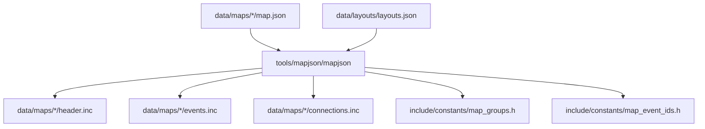
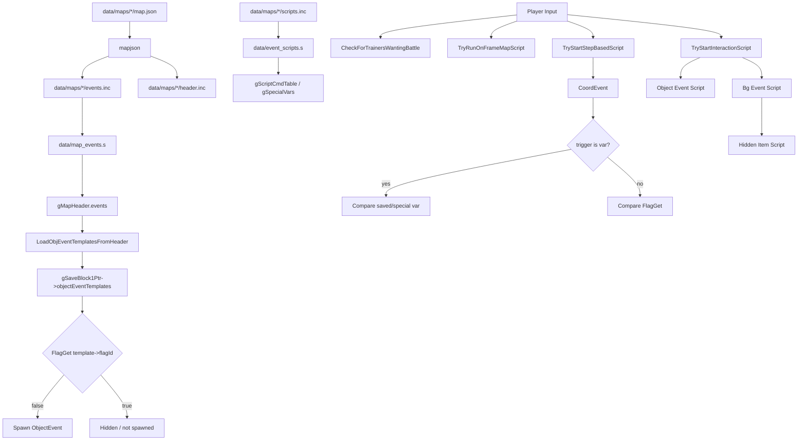

# Map Script / Flag / Var Flow v15

調査日: 2026-05-02

この文書は、`.inc` script、map JSON、flag / var、NPC の表示・移動・消滅、item ball / hidden item の関係を整理する。現時点では実装・改造は行っていない。

## Purpose

- 今後 `data/maps/*/scripts.inc` を編集する前に、生成物と手書きファイルの境界を明確にする。
- `setflag`、`clearflag`、`checkflag`、`setvar`、`compare`、`map_script_2`、`coord_event` が runtime でどう解釈されるかを確認する。
- TM をマート販売へ寄せる時、取得済み flag、item ball flag、hidden item flag、NPC hide flag を混同しないようにする。

## Key Files

| File | Role |
|---|---|
| `data/event_scripts.s` | event script data の集約。`asm/macros/event.inc`、`data/script_cmd_table.inc`、`data/maps/*/scripts.inc`、`data/scripts/*.inc` を含む。 |
| `data/map_events.s` | generated map event data の集約。`data/maps/events.inc` を含む。 |
| `map_data_rules.mk` | `tools/mapjson/mapjson` で `map.json` から `header.inc`、`events.inc`、`connections.inc` などを生成する rule。 |
| `asm/macros/map.inc` | `map_script`、`map_script_2`、`object_event`、`coord_event`、`bg_hidden_item_event`、`map_events` の macro 定義。 |
| `asm/macros/event.inc` | `setvar`、`setflag`、`checkflag`、`applymovement`、`removeobject`、`addobject`、`giveitem`、`finditem` などの script macro 定義。 |
| `include/constants/map_scripts.h` | `MAP_SCRIPT_ON_LOAD`、`MAP_SCRIPT_ON_FRAME_TABLE`、`MAP_SCRIPT_ON_TRANSITION` などの実行タイミング定義。 |
| `include/constants/flags.h` | Emerald flag 定義。temp flag、hidden item flag、received TM flag、item ball flag を含む。 |
| `include/constants/vars.h` | saved var、temp var、special var 定義。 |
| `src/event_data.c` | `gSpecialVar_*`、`GetVarPointer`、`VarGet`、`VarSet`、`FlagSet`、`FlagClear`、`FlagGet`。 |
| `src/script.c` | map script 実行、`MapHeaderCheckScriptTable`、`RunOnTransitionMapScript`、`TryRunOnFrameMapScript`。 |
| `src/field_control_avatar.c` | player input、trainer check、coord event、object/bg interaction、hidden item detection。 |
| `src/overworld.c` | map load、object template load、map script 実行順。 |
| `src/event_object_movement.c` | object spawn / remove / visibility / template lookup。 |
| `src/scrcmd.c` | script command handler。flag / var / object command と `pokemart` の C 側入口。 |

## File Ownership

| Path | Generated? | Edit policy for future work |
|---|---:|---|
| `data/maps/*/map.json` | Source data | map event 配置、object flag、coord event、bg event を変える時の主な編集元。今回は未編集。 |
| `data/maps/*/events.inc` | Generated | `mapjson` 生成物。`DO NOT MODIFY` comment があるため直接編集しない。 |
| `data/maps/*/header.inc` | Generated | map header 生成物。直接編集しない。 |
| `data/maps/*/connections.inc` | Generated | map connection 生成物。直接編集しない。 |
| `data/maps/*/scripts.inc` | Hand-written | event script 本体。NPC 会話、map script、flag / var 分岐、movement を置く。今回は未編集。 |
| `data/scripts/*.inc` | Hand-written shared scripts | 共通 item、field move、trainer battle、mart など。今回は未編集。 |

`map_data_rules.mk` で確認した生成経路:

## Script Include Structure

`data/event_scripts.s` では以下を確認した。

- `#include "constants/flags.h"`、`#include "constants/vars.h"` などを読み込む。
- `.include "asm/macros.inc"`、`.include "asm/macros/event.inc"`、`.include "constants/constants.inc"` を読み込む。
- `ALLOCATE_SCRIPT_CMD_TABLE` を有効にして `data/script_cmd_table.inc` を include し、`gScriptCmdTable` を確保する。
- `gSpecialVars::` で `VAR_0x8000` から `VAR_RESULT`、`VAR_LAST_TALKED`、`VAR_TRAINER_BATTLE_OPPONENT_A` などを C 側グローバルへ対応させる。

`data/map_events.s` では generated map event data を読み込む。

- `.include "asm/macros.inc"`
- `.include "constants/constants.inc"`
- `.include "data/maps/events.inc"`

## Map Event Macros

`asm/macros/map.inc` で確認した重要 macro:

| Macro | Output / meaning | Runtime owner |
|---|---|---|
| `map_script type, script` | map script table entry。`type` は `MAP_SCRIPT_*`。 | `src/script.c` |
| `map_script_2 var, compare, script` | `ON_FRAME_TABLE` / `ON_WARP_INTO_MAP_TABLE` 用の条件付き entry。 | `MapHeaderCheckScriptTable` |
| `object_event ... script, event_flag` | `struct ObjectEventTemplate` に対応。`event_flag` が set なら出現しない。 | `src/event_object_movement.c` |
| `coord_event x, y, elevation, var, varValue, script` | `struct CoordEvent` に対応。`var` は saved var だけでなく flag としても扱われる場合がある。 | `src/field_control_avatar.c` |
| `bg_hidden_item_event x, y, elevation, item, flag, quantity, underfoot` | hidden item bg event。`flag` は `FLAG_HIDDEN_ITEMS_START` 以上であることを macro が検査する。 | `src/field_control_avatar.c` / `data/scripts/obtain_item.inc` |

`object_event` の 10 番目引数 `sight_radius_tree_etc` は `struct ObjectEventTemplate.trainerRange_berryTreeId` に入り、trainer sight、berry tree id、item ball の item id など複数用途で使われる。

## Flag / Var Runtime

### Definitions and Storage

| Symbol / File | Confirmed behavior |
|---|---|
| `VARS_START` in `include/constants/vars.h` | `0x4000`。saved var の開始。 |
| `VAR_TEMP_0`..`VAR_TEMP_F` | temp vars。`ClearTempFieldEventData()` で map load 時に clear される。 |
| `VAR_OBJ_GFX_ID_0`..`VAR_OBJ_GFX_ID_F` | dynamic object graphics 用。`VarGetObjectEventGraphicsId()` 経由で object graphics に使われる。 |
| `FLAG_TEMP_1`..`FLAG_TEMP_1F` | temp flags。`ClearTempFieldEventData()` で clear される。 |
| `FLAG_HIDDEN_ITEMS_START` | hidden item flag の開始。`bg_hidden_item_event` はここからの offset を保存する。 |
| `struct SaveBlock1.flags` | `include/global.h` の `struct SaveBlock1` 内。saved flags。 |
| `struct SaveBlock1.vars` | `include/global.h` の `struct SaveBlock1` 内。saved vars。 |
| `gSpecialVar_0x8000`..`gSpecialVar_Result` | `src/event_data.c` の global。script の一時引数や戻り値。 |

`src/event_data.c` の `GetVarPointer(id)` は以下の分岐を持つ。

- `id < VARS_START` は `NULL`。
- `VARS_START <= id < SPECIAL_VARS_START` は `gSaveBlock1Ptr->vars[id - VARS_START]`。
- special var は `gSpecialVars[id - SPECIAL_VARS_START]`。

`VarGet(id)` は var pointer がない場合、`id` 自体を literal value として返す。そのため `map_script_2 VAR_ROUTE101_STATE, 1, ...` の compare 値 `1` は `VarGet(1) == 1` として扱われる。

### Script Command Macros and Handlers

| Macro | Handler | Notes |
|---|---|---|
| `setvar` | `ScrCmd_setvar` | `VarSet` 経由で saved/special var を更新。 |
| `copyvar` | `ScrCmd_copyvar` | var 間 copy。 |
| `compare` / `comparevars` | `ScrCmd_compare_*` | script condition の比較元。 |
| `setflag` | `ScrCmd_setflag` | `FlagSet`。 |
| `clearflag` | `ScrCmd_clearflag` | `FlagClear`。 |
| `checkflag` | `ScrCmd_checkflag` | 結果を `gSpecialVar_Result` へ入れる。 |
| `giveitem` | `STD_OBTAIN_ITEM` | `VAR_0x8000` = item、`VAR_0x8001` = quantity。 |
| `finditem` | `STD_FIND_ITEM` | item ball pickup 用。成功時に last-talked object を remove する。 |

## Field Runtime Flow

`src/overworld.c` の map load では、確認範囲で以下の順序が重要。

1. current map data を読み込む。
2. `LoadObjEventTemplatesFromHeader()` が `gMapHeader.events->objectEvents` を `gSaveBlock1Ptr->objectEventTemplates` へコピーする。
3. `ClearTempFieldEventData()` が temp flags / temp vars を clear する。
4. `RunOnTransitionMapScript()` を実行する。
5. `InitMap()` で object spawn や field state 初期化へ進む。

player input 側は `src/field_control_avatar.c` の `ProcessPlayerFieldInput()` が入口。確認範囲の優先順位:

1. `CheckForTrainersWantingBattle()`
2. `TryRunOnFrameMapScript()`
3. step-based script (`TryStartStepBasedScript()`)
4. standard wild encounter
5. warp / door / arrow warp
6. A button interaction (`TryStartInteractionScript()`)
7. start/select/R button 系

この順序のため、`MAP_SCRIPT_ON_FRAME_TABLE` は通常の A button interaction より前に走る。

## Coord Event Conditions

`src/field_control_avatar.c` の `ShouldTriggerScriptRun()` は `coordEvent->trigger` を var として解決できるかで挙動が変わる。

| Case | Behavior |
|---|---|
| `GetVarPointer(coordEvent->trigger) != NULL` | `*varPtr == coordEvent->index` なら script 実行。 |
| `GetVarPointer(coordEvent->trigger) == NULL` | `FlagGet(coordEvent->trigger) == coordEvent->index` なら script 実行。 |

つまり generated `coord_event` の `var` field は名前上は var だが、runtime では flag id も入り得る。今後 map script を追加する時は、`coord_event` の trigger に saved var を置くのか flag を置くのかを明示する。

## NPC Visibility / Movement / Removal

### Spawn and Hide Flag

`src/event_object_movement.c` の `TrySpawnObjectEvents()` は `!FlagGet(template->flagId)` の object だけを spawn する。

| Operation | Script command / C function | Flag persistence |
|---|---|---|
| object を map load 時から隠す | `object_event ... event_flag` + `setflag event_flag` | saved flag が set なら spawn しない。 |
| object を再表示可能にする | `clearflag event_flag` 後に map reload または `addobject` | flag を clear する必要がある。 |
| live object を消す | `removeobject` -> `RemoveObjectEventByLocalIdAndMap` | `GetObjectEventFlagIdByObjectEventId()` の flag を `FlagSet` してから remove。永続化する。 |
| live object を spawn する | `addobject` -> `TrySpawnObjectEvent` | flag は clear しない。hide flag が set のままだと根本解決にならない。 |
| live object を一時的に隠す | `hideobjectat` -> `SetObjectInvisibility(..., TRUE)` | flag は変えない。 |
| live object を一時的に見せる | `showobjectat` -> `SetObjectInvisibility(..., FALSE)` | flag は変えない。 |
| 座標を一時移動 | `setobjectxy` | live object の移動。template 永続化ではない。 |
| 座標を template に保存 | `setobjectxyperm` / `copyobjectxytoperm` | `gSaveBlock1Ptr->objectEventTemplates` 側を更新。 |

### Representative Patterns

| File | Pattern |
|---|---|
| `data/maps/Route101/scripts.inc` | `VAR_ROUTE101_STATE` で coord event と on-frame script を制御。`setobjectxy`、`applymovement`、`setvar` を組み合わせる。 |
| `data/maps/Route101/events.inc` | `object_event` の hide flag と `coord_event` が generated data として出力される例。 |
| `data/maps/MossdeepCity_House2/scripts.inc` | Wingull delivery。`setflag` / `clearflag` で別 map の NPC 表示を切り替え、`removeobject` で現在 map の NPC を消す。 |
| `data/maps/Route16_Frlg/scripts.inc` | Snorlax event。battle 後に hide flag と object remove を絡める特殊例。 |
| `data/scripts/gabby_and_ty.inc` | 複数 map の `FLAG_HIDE_ROUTE_*_GABBY_AND_TY_*` を切り替えて NPC ペアの出現場所を移す例。 |
| `data/maps/MossdeepCity_StevensHouse/scripts.inc` | `MAP_SCRIPT_ON_FRAME_TABLE` と `map_script_2 VAR_STEVENS_HOUSE_STATE, ...` の state-driven 例。 |

## Item Ball / Hidden Item Flow

### Visible Item Ball

visible item ball は多くの場合 `data/maps/*/map.json` の `object_events` から generated `events.inc` へ出る。

確認した runtime:

- `object_event` の `trainer_sight_or_berry_tree_id` が item id として使われる。
- `object_event` の `flag` は item ball pickup 後の非表示 flag になる。
- `Common_EventScript_FindItem` は `callnative GetItemBallIdAndAmountFromTemplate` 後に `finditem VAR_RESULT VAR_0x8009` を実行する。
- `src/item_ball.c` の `GetItemBallIdAndAmountFromTemplate()` は `gSpecialVar_LastTalked - 1` で current map の `objectEvents[itemBallId]` を読み、item id と quantity を `gSpecialVar_Result` / `gSpecialVar_0x8009` へ入れる。
- `finditem` は `STD_FIND_ITEM` を呼び、成功時に last-talked object を remove する。`removeobject` は object の hide flag を set する。

### Hidden Item

hidden item は `bg_hidden_item_event` から生成される。

確認した runtime:

- `src/field_control_avatar.c` の `GetInteractedBackgroundEventScript()` が `BG_EVENT_HIDDEN_ITEM` を検出する。
- `gSpecialVar_0x8004 = hiddenItemId + FLAG_HIDDEN_ITEMS_START`。
- `gSpecialVar_0x8005 = item`。
- `gSpecialVar_0x8009 = quantity`。
- flag が既に set なら script は返さない。
- `EventScript_HiddenItemScript` は item を add し、成功後に `SetHiddenItemFlag()` を呼ぶ。
- `src/field_specials.c` の `SetHiddenItemFlag()` は `FlagSet(gSpecialVar_0x8004)`。

## Flowchart

## Risks for Future Edits

| Risk | Why |
|---|---|
| Editing generated `.inc` directly | `mapjson` regeneration will overwrite `events.inc` / `header.inc` / `connections.inc`。 |
| Removing flag constants instead of removing acquisition source | saved flag indexes and upstream diffs become harder to track。 |
| Treating `addobject` as persistent unhide | `addobject` does not clear the hide flag。 |
| Using `VAR_RESULT` across long scripts without guarding | many standard scripts and specials overwrite `gSpecialVar_Result`。 |
| Reusing temp vars for persistent map state | `VAR_TEMP_*` is cleared on map load。 |
| Confusing item ball flag and received TM flag | item ball flag hides object; received flag gates NPC/gym gift script。 |

## Open Questions

- `data/maps/*/scripts.inc` は 887 files を確認したが、全行 line-by-line review は未実施。今後は map group 単位で進める。
- `coord_event` で flag trigger を使っている実例の全件リストは未作成。
- “Medley Shop” という文字列は現時点の `src/`、`include/`、`data/` では未検出。独自 shop 名として今後追加予定なら、既存 `pokemart` flow と別 feature として設計する。
- `removeobject` が hide flag を set する仕様を利用してよい場面と、明示 `setflag` を先に置くべき場面の project rule は未定。
