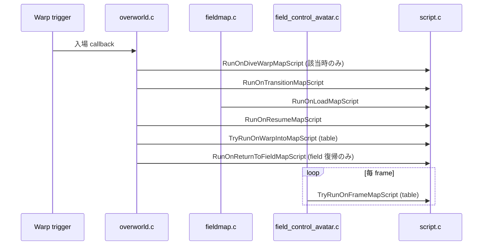

# Map Script Flow v15

## Purpose

Map header に登録される `MAP_SCRIPT_*` script 群が、いつ・どこから・どの runtime 関数経由で起動されるかを追う。本書の対象は **map-level の trigger script** であり、object event との会話 / coord event 踏み出し / bg event 調査などの「event-script 全般」とは区別する。

特に重要なのは、これらの script が Porymap (`map.json`) では一切表現できない条件分岐 (flag/var) を抱えており、`scripts.inc` への hand-authored bytecode が正解になる、という境界線である。

調査日: 2026-05-03。source 改造はしておらず、`docs/` への記録のみ。前提となる bytecode pipeline は [inc_script_pipeline_v15.md](../overview/inc_script_pipeline_v15.md) 参照。

## Related Docs

| Doc | Focus | Reading order |
|---|---|---|
| [overview/inc_script_pipeline_v15.md](../overview/inc_script_pipeline_v15.md) | Build pipeline, bytecode runtime, opcode table の機構 | 先に読む (本書の前提)。 |
| [flows/map_script_flag_var_flow_v15.md](map_script_flag_var_flow_v15.md) | Flag/var/object-visibility/item-ball/coord-event の編集者向け runtime チェックリスト | 本書と相補的。本書が `MAP_SCRIPT_*` の **dispatch mechanism** を扱うのに対し、こちらは map を実際に編集するときの flag/var/visibility/item-ball の **行動規範**。 |
| [flows/map_registration_fly_region_flow_v15.md](map_registration_fly_region_flow_v15.md) | 新規 map の `MAPSEC_*` / Town Map / Region Map / Fly destination / warp callback | map を Fly 対応や FRLG world map 対応にするときはこちらも読む。 |
| [flows/npc_object_event_flow_v15.md](npc_object_event_flow_v15.md) | `object_event`、NPC movement、`applymovement`、条件付き `setmetatile` / `setmaplayoutindex` | map script の dispatch ではなく、実際の NPC と tile 変更を読むときはこちらも読む。 |
| [flows/event_script_flow_v15.md](event_script_flow_v15.md) | `special` / `trainerbattle` / `dotrainerbattle` / `waitstate` の battle 入口 flow | 本書が map-level trigger script、こちらは個別 event script から battle 起動までの flow。 |
| [flows/script_inc_audit_v15.md](script_inc_audit_v15.md) | `data/scripts/*.inc` の symbol inventory と各 facility battle scripts の利用箇所 | 本書を読んだ上で「具体的にどの map / どの script が使っているか」を見るときの index。 |

## Key Files

| File | Role |
|---|---|
| [include/constants/map_scripts.h](../../include/constants/map_scripts.h) | `MAP_SCRIPT_ON_LOAD` … `MAP_SCRIPT_ON_RETURN_TO_FIELD` の 7 種類定数定義と、各 type の意味 / 呼ばれる順序の コメント。 |
| [src/script.c](../../src/script.c) | Map-script dispatch entry points: `RunOnLoadMapScript`, `RunOnTransitionMapScript`, `RunOnResumeMapScript`, `RunOnReturnToFieldMapScript`, `RunOnDiveWarpMapScript`, `TryRunOnFrameMapScript`, `TryRunOnWarpIntoMapScript`。Table 走査関数 `MapHeaderGetScriptTable` / `MapHeaderCheckScriptTable`。 |
| [src/overworld.c](../../src/overworld.c) | Warp / fade-in / 戻り context での map-script trigger。最も多くの caller を持つ。 |
| [src/fieldmap.c](../../src/fieldmap.c) | Map load 時の `RunOnLoadMapScript`。 |
| [src/field_control_avatar.c](../../src/field_control_avatar.c) | 1 frame ごとの `TryRunOnFrameMapScript`。 |
| [src/battle_pyramid.c](../../src/battle_pyramid.c), [src/trainer_hill.c](../../src/trainer_hill.c) | Frontier 系 map で個別に `RunOnLoadMapScript` を call。 |
| [asm/macros/map.inc](../../asm/macros/map.inc) | `map_script type:req, script:req` (5 byte entry) と `map_script_2 var:req, compare:req, script:req` (8 byte entry) の data declaration macro。 |
| [data/maps/MapName/scripts.inc](../../data/maps/) | `MapName_MapScripts::` table と各 `MapName_OnXxx:` script body 本体 (hand-authored)。 |
| [data/maps/MapName/header.inc](../../data/maps/) | `mapScripts:` field に `MapName_MapScripts` を貼り付ける。`mapjson` 生成。 |
| [include/global.fieldmap.h](../../include/global.fieldmap.h) | `struct MapHeader` の定義 (`mapScripts` field を含む)。 |

## MAP_SCRIPT_* Type Inventory

[include/constants/map_scripts.h](../../include/constants/map_scripts.h) より verbatim で抜粋:

| ID | Constant | Numeric order in load | Purpose (canonical comment) |
|---|---|---|---|
| 1 | `MAP_SCRIPT_ON_LOAD` | 3rd | Run after the layout is loaded (but not drawn yet). 主に metatile を初描画前に書き換える。 |
| 2 | `MAP_SCRIPT_ON_FRAME_TABLE` | 6th (毎 frame) | Map fade-in 後、毎 frame、player input 前に走る **table**。条件を満たした最初の script だけ実行。 |
| 3 | `MAP_SCRIPT_ON_TRANSITION` | 2nd | Map transition 中に走る。Map 固有 flag/var の set、object 位置 / movement type の更新、weather 設定など。 |
| 4 | `MAP_SCRIPT_ON_WARP_INTO_MAP_TABLE` | 5th | Map object load 後に走る **table**。Object 追加や、warp してきた瞬間の player の facing dir / visibility 変更。 |
| 5 | `MAP_SCRIPT_ON_RESUME` | 4th | Map load 終端、および field に戻るたび (Bag を閉じた / battle 終了後など)。撃破済み静止 Pokemon の hide、Trainer Hill timer 維持など。 |
| 6 | `MAP_SCRIPT_ON_DIVE_WARP` | 1st | Player が dive / emerge を選んだ後。Sealed Chamber 用に 1 箇所のみ。 |
| 7 | `MAP_SCRIPT_ON_RETURN_TO_FIELD` | (返却時) | Field に戻ったときだけ走る。Map 入場初回には走らない。Faraway Island の Mew の上書き等で稀に使用。 |

数値 ID と「呼ばれる順序」が一致していない点に注意。順序は実 caller 側 (overworld.c) で決まる。

## Map Script Table の Data Layout

`MapName_MapScripts::` の中身は **type-tagged のフラットな byte stream**。Terminator は `.byte 0`。

```
[type:1][script_ptr:4]    ← map_script  (5 bytes)
[type:1][script_ptr:4]    ← map_script
...
[type:1][table_ptr:4]     ← map_script  (table 形式 type 用)
[0]                       ← terminator
```

walker は [src/script.c:314-332](../../src/script.c#L314-L332):

```c
const u8 *MapHeaderGetScriptTable(u8 tag)
{
    const u8 *mapScripts = gMapHeader.mapScripts;
    if (!mapScripts) return NULL;
    while (1)
    {
        if (!*mapScripts) return NULL;       // 0 で終了
        if (*mapScripts == tag)
        {
            mapScripts++;
            return T2_READ_PTR(mapScripts);  // 続く 4 byte が script ポインタ
        }
        mapScripts += 5;                     // type 1B + ptr 4B = 5B
    }
}
```

すなわち 1 つの map に同じ `type` を 2 回登録しても、最初に出てきたものしか拾わない。

`MAP_SCRIPT_ON_FRAME_TABLE` と `MAP_SCRIPT_ON_WARP_INTO_MAP_TABLE` の **2 つだけ** は、ptr の指す先がさらに entry table である:

```
[var1:2][var2:2][script_ptr:4]   ← map_script_2  (8 bytes per entry)
[var1:2][var2:2][script_ptr:4]
...
[0:2]                            ← terminator (2 byte zero)
```

walker は [src/script.c:341-373](../../src/script.c#L341-L373):

```c
while (1)
{
    u16 varIndex1 = T1_READ_16(ptr);
    if (!varIndex1) return NULL;
    ptr += 2;
    u16 varIndex2 = T1_READ_16(ptr);
    ptr += 2;
    if (VarGet(varIndex1) == VarGet(varIndex2))   // 両方 VarGet を通る
    {
        const u8 *mapScript = T2_READ_PTR(ptr);
        if (!Script_HasNoEffect(mapScript))
            return mapScript;
    }
    ptr += 4;
}
```

注意点:

- 比較は `VarGet(var1) == VarGet(var2)`。**第 2 引数も `VarGet` を通る**。Var 範囲外の数値定数を渡すと、`VarGet` が単に「定数として返す」branch を取るため、見た目は `map_script_2 VAR_LITTLEROOT_INTRO_STATE, 1, ...` で動く。これは vanilla の慣用パターン (LittlerootTown_OnFrame で確認: [data/maps/LittlerootTown/scripts.inc:104-108](../../data/maps/LittlerootTown/scripts.inc#L104-L108))。
- 1 つでも条件一致した entry が見つかった時点で残りを skip。複数候補がある map では宣言順が優先順位になる。
- `Script_HasNoEffect` で no-effect script (恐らく empty script の最適化判定) は飛ばす。

## Engine Dispatch Sites

`grep -nE "RunOn(Load|Transition|Resume|ReturnToField|DiveWarp)MapScript|TryRunOn(Frame|WarpIntoMap)MapScript" src/*.c` で確定した 14 箇所:

| Caller | Line | Function called | When |
|---|---:|---|---|
| `src/fieldmap.c` | 138, 147 | `RunOnLoadMapScript()` | Map load 完了直後 (layout build 後)。 |
| `src/overworld.c` | 857 | `RunOnDiveWarpMapScript()` | Dive / emerge を選んだあと。 |
| `src/overworld.c` | 903, 972 | `RunOnTransitionMapScript()` | Map transition 中 (warp / fade-in 等の入場系 2 経路)。 |
| `src/overworld.c` | 915, 2544, 3943 | `RunOnResumeMapScript()` | Map load 末尾 + field 復帰のたび。 |
| `src/overworld.c` | 2554, 2573 | `TryRunOnWarpIntoMapScript()` | Warp 完了後、object load 後。 |
| `src/overworld.c` | 2580 | `RunOnReturnToFieldMapScript()` | Field 復帰でのみ (`RunOnResumeMapScript` の直後)。 |
| `src/field_control_avatar.c` | 177 | `TryRunOnFrameMapScript()` | 毎 frame、player input 処理前。 |
| `src/battle_pyramid.c` | 1799 | `RunOnLoadMapScript()` | Battle Pyramid floor 生成後。 |
| `src/trainer_hill.c` | 770 | `RunOnLoadMapScript()` | Trainer Hill floor 生成後。 |

順序関係 (典型的な warp 入場時):



`RunOn*MapScript` 系は内部で `RunScriptImmediately` (busy loop) を call するため、その frame 内に script が完了する。`TryRunOnFrameMapScript` だけは `ScriptContext_SetupScript(ptr); return TRUE;` で **async** に切り替えて返す ([src/script.c:400-409](../../src/script.c#L400-L409)) — 呼び出し元 `field_control_avatar.c` 側で player control を lock するため。`TryRunOnWarpIntoMapScript` は `RunScriptImmediately` (sync) を使う。

## Why scripts.inc Cannot Be Generated From map.json

Porymap が編集するのは [data/maps/MapName/map.json](../../data/maps/) のみで、その中に表現できるのは:

- Layout 参照 (`layout` field)
- Music / weather / region 等の header field
- Object event の **placement** (座標、初期 facing、graphic、movement type)
- Warp event の placement
- Coord event の placement (踏むと走る trigger 座標)
- BG event の placement (調べると走る座標 / hidden item / secret base)
- Connection (上下左右 + dive/emerge)

各 event は `script` field に **既に存在する label name (例: `LittlerootTown_EventScript_Mom`)** を文字列で持つだけで、その script の中身は持たない。`mapjson` はこれらを `events.inc` の `coord_event x, y, ...` macro 引数に並べるところまで担当して終わり。

逆に **必ず手書き必要** なものは:

| Item | 書く場所 | 理由 |
|---|---|---|
| `MapName_MapScripts::` table | `scripts.inc` | `mapjson` は `map_script` macro を出力しない。Table の存在自体が hand-authored。 |
| `MapName_OnTransition:` 等の script body | `scripts.inc` | Bytecode (`setflag`/`setvar`/`call_if_eq`/...) は map.json に表現語彙が無い。 |
| `MapName_OnFrame:` table と各 entry script | `scripts.inc` | `map_script_2 VAR_x, value, ScriptLabel` の宣言と、その script body の両方。 |
| Object event / coord event / signpost script body | `scripts.inc` (or `data/scripts/*.inc`) | map.json の `script` field は label を指すだけで、label 先の bytecode は手書き。 |
| Movement command sequence | `scripts.inc` (typically `<Map>_Movement_*`) | `applymovement OBJ, MovementLabel` の MovementLabel 先。 |

`header.inc` 側で `mapscripts` field が `0x0` (NULL) の map では map-script 機構自体が走らない。`mapjson` は `scripts.inc` に `MapName_MapScripts::` label が定義されていれば自動でリンクするが、これも `scripts.inc` 側に table が **存在すること** が前提なので、map-script が必要な map は最低でも空 table + `.byte 0` を hand-authored で持つ。

## Worked Example: LittlerootTown

[data/maps/LittlerootTown/scripts.inc](../../data/maps/LittlerootTown/scripts.inc) の `LittlerootTown_OnTransition` (line 37-49):

```asm
LittlerootTown_OnTransition:
    setflag FLAG_VISITED_LITTLEROOT_TOWN
    call Common_EventScript_SetupRivalGfxId
    call_if_eq VAR_LITTLEROOT_INTRO_STATE, 2, LittlerootTown_EventScript_MoveMomToMaysDoor
    call_if_unset FLAG_RESCUED_BIRCH, LittlerootTown_EventScript_SetTwinPos
    call_if_eq VAR_LITTLEROOT_TOWN_STATE, 3, LittlerootTown_EventScript_SetMomStandingInFrontOfDoorPos
    call_if_eq VAR_LITTLEROOT_HOUSES_STATE_MAY, 4, LittlerootTown_EventScript_SetExitedHouseAfterLatiSSTicketEvent
    call_if_eq VAR_LITTLEROOT_HOUSES_STATE_BRENDAN, 4, LittlerootTown_EventScript_SetExitedHouseAfterLatiSSTicketEvent
    call_if_eq VAR_OLDALE_RIVAL_STATE, 1, LittlerootTown_EventScript_MoveRivalFromOldale
    call_if_eq VAR_LITTLEROOT_RIVAL_STATE, 3, LittlerootTown_EventScript_SetRivalLeftForRoute103
    call_if_eq VAR_DEX_UPGRADE_JOHTO_STARTER_STATE, 1, LittlerootTown_EventScript_HideMapNamePopup
    call_if_eq VAR_DEX_UPGRADE_JOHTO_STARTER_STATE, 2, LittlerootTown_EventScript_LeftLabAfterDexUpgrade
    end
```

ここで起きていること:

- 入場時に **無条件で** `FLAG_VISITED_LITTLEROOT_TOWN` を立て、ライバル graphic を準備する。
- 8 個の `call_if_eq` / `call_if_unset` がそれぞれ独立した「state machine 段階での object 配置補正」を担当する。一致した分岐だけ `call` され、`return` で戻ってくる。
- 例えば `VAR_LITTLEROOT_INTRO_STATE == 2` (女主人公 truck シーン) のときだけ、Mom の固定座標を May の家ドア前に移す。
- `call_if_*` の内部展開は `compare → call_if condition, label` の 2 byte sequence (詳細は [inc_script_pipeline_v15.md#bytecode-runtime-srcscriptc](../overview/inc_script_pipeline_v15.md#bytecode-runtime-srcscriptc) と `asm/macros/event.inc:1987-2015`)。

そして `LittlerootTown_OnFrame` (line 104-108):

```asm
LittlerootTown_OnFrame:
    map_script_2 VAR_LITTLEROOT_INTRO_STATE, 1, LittlerootTown_EventScript_StepOffTruckMale
    map_script_2 VAR_LITTLEROOT_INTRO_STATE, 2, LittlerootTown_EventScript_StepOffTruckFemale
    map_script_2 VAR_DEX_UPGRADE_JOHTO_STARTER_STATE, 1, LittlerootTown_EventScript_BeginDexUpgradeScene
    .2byte 0
```

これが「intro state 1 → male truck cutscene、2 → female truck cutscene、Pokedex upgrade trigger」の三択を毎 frame 監視する table。一致した瞬間に `lockall` してカットシーンに突入する (line 110-130 の `EventScript_StepOffTruckMale` は `lockall / setvar / call / setflag / warpsilent / waitstate / releaseall / end`)。

これらは Porymap では編集不能 — map.json に「var が x なら script y を fire」を書く語彙が無いから。

`data/maps/LittlerootTown/scripts.inc` 全体は 1016 行あり、上に挙げた map script の他に、各 NPC script、movement table、text label を抱える。

## Cross-Cutting Concerns

### Flag / Var の供給源

`scripts.inc` の中で頻出する `FLAG_*` / `VAR_*` 定数は以下から来る:

- [include/constants/flags.h](../../include/constants/flags.h) (Emerald)
- [include/constants/flags_frlg.h](../../include/constants/flags_frlg.h) (FireRed/LeafGreen)
- [include/constants/vars.h](../../include/constants/vars.h)
- [include/constants/event_objects.h](../../include/constants/event_objects.h) (object event id 等)

これらは [data/event_scripts.s](../../data/event_scripts.s) 1 行目以降の `#include` で取り込まれているため、`scripts.inc` 内では `cpp` 段階で展開される。詳細 pipeline は [inc_script_pipeline_v15.md#build-pipeline](../overview/inc_script_pipeline_v15.md#build-pipeline)。

### Save 互換性への影響

map script は `gMapHeader.mapScripts` を辿るだけで、**Save block には何も書かない**。書き込まれる side-effect は通常の `setflag` / `setvar` 経由の永続 flag/var 変更で、これは既存の `gSaveBlock1Ptr->flags` / `vars` レイアウトに従う。

ただし、**新規 `FLAG_*` / `VAR_*` を追加して既存 map script から参照すると save 互換性が破れる**。`include/constants/flags.h` / `vars.h` の id 範囲は SaveBlock のビット位置に直結している。本 fork で新 map script を入れる場合は、既存の `FLAG_TEMP_*` / `VAR_TEMP_*` 等の reusable 範囲か、明示的に save migration を伴う追加のどちらかを選ぶ必要がある。詳細は [STYLEGUIDE.md#save-philosophy](../STYLEGUIDE.md#save-philosophy)。

### Lock の責務分担

| Trigger | Lock 状態 | Caller の処理 |
|---|---|---|
| ON_LOAD/TRANSITION/RESUME/RETURN_TO_FIELD/DIVE_WARP/WARP_INTO_MAP | `RunScriptImmediately` 内で同期実行。Player input は元々 lock されている (warp / transition 中)。 | Caller は復帰せず script 完了まで待つ。 |
| ON_FRAME_TABLE | `ScriptContext_SetupScript` で async 実行。Caller (`field_control_avatar.c`) が直前に `LockPlayerFieldControls` を call する想定。 | Script 内で明示的に `lockall` / `releaseall` を呼ぶ慣行 (LittlerootTown 例参照)。 |

`OnFrame` の table から fire される script は cutscene を意図することが多く、**頭で `lockall`、末尾で `releaseall`** を必ず付ける。これを忘れると player が cutscene 中に動けてしまう。

## Confirmed

- `MAP_SCRIPT_*` 定数は 7 種類、定義は [include/constants/map_scripts.h](../../include/constants/map_scripts.h)。
- Dispatch entry point は [src/script.c:375-416](../../src/script.c#L375-L416) の 7 関数。
- 7 関数の caller は src/ 内 14 箇所、主に `overworld.c` と `fieldmap.c`、毎 frame 系のみ `field_control_avatar.c`。
- `MAP_SCRIPT_ON_FRAME_TABLE` / `MAP_SCRIPT_ON_WARP_INTO_MAP_TABLE` だけが `map_script_2 var, compare, script` の 8 byte entry table を持つ。それ以外は `map_script type, script` の 5 byte entry。
- Table walker の比較は `VarGet(var1) == VarGet(var2)`。第 2 引数も `VarGet` 経由。
- LittlerootTown が flag / var conditional の vanilla 慣用例。
- `mapjson` (Porymap 連携) は `scripts.inc` を **生成しない**。`scripts.inc` は完全に hand-authored。

## Risk

- `MapHeaderGetScriptTable` は同一 type が複数あっても最初の 1 件しか返さない。`scripts.inc` を merge / 自動生成するときに重複を入れると **後者が黙って無視される**。
- `map_script_2` の 2 引数を「定数」として渡すと `VarGet` の constant fall-through に依存する。Var 範囲が将来変わると挙動が変わるリスク有。
- `OnFrame` table から fire される script は `lockall` を忘れると cutscene 中に player が歩ける。
- `RunOnReturnToFieldMapScript` は **field 復帰でのみ走り、map 入場初回には走らない** (`RunOnResumeMapScript` との対比)。混同すると初回 only な処理を取りこぼす。
- 新 `FLAG_*` / `VAR_*` 追加は SaveBlock layout を破る可能性がある — config gate + default off が styleguide の必須要件。

## Open Questions

- `Script_HasNoEffect` の判定基準を未確認。`MapHeaderCheckScriptTable` の table 走査で「ヒットしたが skip」する条件を厳密に把握していない。
- `RunOnLoadMapScript` が `fieldmap.c` で 138 / 147 の 2 箇所に重複している理由 (異なる load path?) を未確認。
- `overworld.c` 内の `RunOnTransitionMapScript` 2 箇所 (903 / 972) の使い分け、`RunOnResumeMapScript` 3 箇所 (915 / 2544 / 3943) の使い分けを完全には特定していない。各 caller の preceding context (warp 種別、cancel 経路) を辿る必要あり。
- Battle Pyramid / Trainer Hill での `RunOnLoadMapScript` の追加 call が「通常 path との二重実行」を意図しているのか、「通常 path を bypass する代替経路」なのかは未確認。
