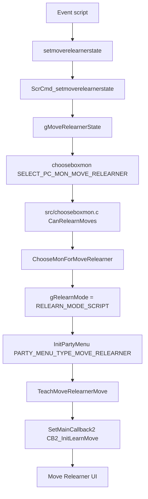

# Move Relearner Flow v15

調査日: 2026-05-02

この文書は「思い出し技」メニュー、summary screen からの技思い出し、party menu からの技思い出し、script からの技思い出しを整理する。現時点では実装・改造は行っていない。

## Purpose

- 技思い出し UI がどの callback / task / window / summary mode で動くかを整理する。
- TM 追加、技追加、party menu 強化、summary screen 強化時に壊れやすい箇所を明示する。
- `MAX_RELEARNER_MOVES` と TM 数増加の関係を確認する。

## Key Files

| File | Important symbols / notes |
|---|---|
| `include/config/summary_screen.h` | `P_SUMMARY_SCREEN_MOVE_RELEARNER`, `P_PARTY_MOVE_RELEARNER`, `P_TM_MOVES_RELEARNER`, `P_ENABLE_MOVE_RELEARNERS`, `P_ENABLE_ALL_TM_MOVES`, flags。 |
| `include/constants/move_relearner.h` | `MAX_RELEARNER_MOVES`, `enum MoveRelearnerStates`, `enum RelearnMode`。 |
| `include/move_relearner.h` | `TeachMoveRelearnerMove`, `CB2_InitLearnMove`, `CanBoxMonRelearnMoves`, `gMoveRelearnerState`, `gRelearnMode`。 |
| `src/move_relearner.c` | 技思い出し画面本体。`TeachMoveRelearnerMove`, `CB2_InitLearnMove`, `CreateLearnableMovesList`。 |
| `src/menu_specialized.c` | move relearner の list menu / move description window。 |
| `src/pokemon_summary_screen.c` | summary screen からの relearner 起動。`ShouldShowMoveRelearner`, `ShowRelearnPrompt`。 |
| `src/party_menu.c` | script / party menu からの relearner 起動。`ChooseMonForMoveRelearner`。 |
| `src/chooseboxmon.c` | `SELECT_PC_MON_MOVE_RELEARNER`, `CanRelearnMoves`。 |
| `src/scrcmd.c` | `ScrCmd_setmoverelearnerstate`, `ScrCmd_getmoverelearnerstate`, `ScrCmd_istmrelearneractive`。 |
| `asm/macros/event.inc` | `setmoverelearnerstate`, `getmoverelearnerstate`, `istmrelearneractive`, `chooseboxmon` macro。 |
| `data/scripts/move_relearner.inc` | 共通 move relearner script。 |
| `data/maps/FallarborTown_MoveRelearnersHouse/scripts.inc` | vanilla Heart Scale relearner 例。 |

## 1.15.2 Notes

upstream `expansion/1.15.2` では `src/move_relearner.c`、`src/menu_specialized.c`、`src/pokemon_summary_screen.c` が変更されているが、確認した範囲では callback / state flow の大改造ではなく、主に graphics declarations の `INCGFX_*` 移行だった。

| Topic | 1.15.2 change | Impact |
|---|---|---|
| Move relearner assets | `graphics/interface/ui_learn_move` 周辺の declarations が `INCGFX_U8` / `INCGFX_U16` 形式へ移行。 | custom relearner UI / summary UI asset を追加する場合は 1.15.2 の build pipeline を基準にする。 |
| Summary assets | `src/pokemon_summary_screen.c` の status / summary graphics declarations も INCGFX 化。 | summary screen 強化では asset path と generated data の扱いを再確認する。 |
| Flow | `MAX_RELEARNER_MOVES`、`gMoveRelearnerState`、`gRelearnMode` の基本設計変更は未確認。 | TM 大量追加リスクは 1.15.1 docs のまま継続。 |

## Config

`include/config/summary_screen.h` の確認値:

| Config | Current value | Meaning |
|---|---:|---|
| `P_ENABLE_MOVE_RELEARNERS` | `FALSE` | egg / TM / tutor relearners をまとめて有効化。 |
| `P_SORT_MOVES` | `FALSE` | relearner list を alphabetic sort。 |
| `P_PRE_EVO_MOVES` | `FALSE` | pre-evolution level-up moves を含める。 |
| `P_ENABLE_ALL_LEVEL_UP_MOVES` | `FALSE` | level に関係なく level-up move を候補にする。 |
| `P_TM_MOVES_RELEARNER` | `FALSE` | machine move relearner を有効化。 |
| `P_ENABLE_ALL_TM_MOVES` | `FALSE` | bag 所持に関係なく compatible TM を候補にする。 |
| `P_FLAG_EGG_MOVES` | `0` | flag set で egg move relearner 解禁。 |
| `P_FLAG_TUTOR_MOVES` | `0` | flag set で tutor move relearner 解禁。 |
| `P_SUMMARY_SCREEN_MOVE_RELEARNER` | `TRUE` | summary screen moves page に relearn prompt を出す。 |
| `P_SUMMARY_MOVE_RELEARNER_FULL_PP` | `TRUE` | summary 経由で思い出した move の PP を full にする。 |
| `P_PARTY_MOVE_RELEARNER` | `FALSE` | party menu moves submenu に relearner を出す。 |

## Relearner States and Modes

`include/constants/move_relearner.h`:

| Symbol | Meaning |
|---|---|
| `MAX_RELEARNER_MOVES 60` | relearner list の最大候補数。comment では Mew が全 TM/HM を表示できるよう 25 から 60 に増加済み。TM を増やす場合はこの数も増やす必要がある。 |
| `MOVE_RELEARNER_LEVEL_UP_MOVES` | level-up move list。 |
| `MOVE_RELEARNER_EGG_MOVES` | egg move list。 |
| `MOVE_RELEARNER_TM_MOVES` | TM move list。 |
| `MOVE_RELEARNER_TUTOR_MOVES` | tutor move list。 |
| `RELEARN_MODE_SCRIPT` | event script から起動。 |
| `RELEARN_MODE_PSS_PAGE_BATTLE_MOVES` | summary battle moves page から起動。値 2 は page と結びつく。 |
| `RELEARN_MODE_PSS_PAGE_CONTEST_MOVES` | summary contest moves page から起動。値 3 は page と結びつく。 |
| `RELEARN_MODE_PARTY_MENU` | party menu moves submenu から起動。 |
| `RELEARN_MODE_BOX_PSS_PAGE_BATTLE_MOVES` | box summary battle moves page から起動。 |
| `RELEARN_MODE_BOX_PSS_PAGE_CONTEST_MOVES` | box summary contest moves page から起動。 |

`gMoveRelearnerState` と `gRelearnMode` は `src/move_relearner.c` の EWRAM global。

## Script Flow

### Common Script

`data/scripts/move_relearner.inc` は `dynmultipush` と config / flag を使い、対象 relearner state を積んでから mon 選択へ進む。

確認した主な script command:

- `setmoverelearnerstate`
- `istmrelearneractive`
- `chooseboxmon SELECT_PC_MON_MOVE_RELEARNER`
- `special IsSelectedMonEgg`
- `special HasMovesToRelearn`
- `special TeachMoveRelearnerMove`
- `waitstate`

### Fallarbor Example

`data/maps/FallarborTown_MoveRelearnersHouse/scripts.inc` は vanilla Heart Scale flow:

1. Heart Scale 所持確認。
2. `setmoverelearnerstate MOVE_RELEARNER_LEVEL_UP_MOVES`。
3. `chooseboxmon SELECT_PC_MON_MOVE_RELEARNER`。
4. `HasMovesToRelearn`。
5. `TeachMoveRelearnerMove`。
6. 成功時は `VAR_0x8004 != 0` を見て Heart Scale を remove。

## C Entry Flow

`src/party_menu.c` の `ChooseMonForMoveRelearner()` は script 経由選択で `gRelearnMode = RELEARN_MODE_SCRIPT` にし、party menu を開く。選択後は `gSpecialVar_0x8004` に選択 slot が入る。

`src/chooseboxmon.c` の `SELECT_PC_MON_MOVE_RELEARNER` は `CanRelearnMoves()` を使い、egg を除外しつつ `CanBoxMonRelearnMoves(boxmon, gMoveRelearnerState)` を見る。

## Summary Screen Flow

`src/pokemon_summary_screen.c` の `ShouldShowMoveRelearner()` は以下を満たす時だけ prompt を出す。

- `P_SUMMARY_SCREEN_MOVE_RELEARNER`
- `!sMonSummaryScreen->lockMovesFlag`
- `sMonSummaryScreen->mode != SUMMARY_MODE_BOX_CURSOR`
- `sMonSummaryScreen->hasRelearnableMoves`
- `!InBattleFactory()`
- `!InSlateportBattleTent()`
- `!NoMovesAvailableToRelearn()`

Moves page で `START_BUTTON` を押すと:

- `sMonSummaryScreen->callback = CB2_InitLearnMove`
- `gRelearnMode = sMonSummaryScreen->currPageIndex`
- party mon なら `gSpecialVar_0x8004 = sMonSummaryScreen->curMonIndex`
- box mon なら `gSpecialVar_0x8004 = PC_MON_CHOSEN`、`gSpecialVar_MonBoxPos = curMonIndex`
- summary close 後に `CB2_InitLearnMove` へ進む。

`ShowRelearnPrompt()` は `gMoveRelearnerState` に応じて `RELEARN`、`RELEARN EGG`、`RELEARN TM`、`RELEARN TUTOR` などを出す。L/R による state 切り替えは `TryUpdateRelearnType()` 系で行われるため、summary UI を変える場合は prompt だけでなく state cycling も確認する。

## Move Relearner UI Setup

`src/move_relearner.c` の `TeachMoveRelearnerMove()`:

- field control を lock。
- fade task を作成。
- `SetMainCallback2(CB2_InitLearnMove)`。
- `gFieldCallback = FieldCB_ContinueScriptHandleMusic`。

`CB2_InitLearnMove()`:

- BG / windows / sprites / tasks を reset。
- `sMoveRelearnerStruct` を確保。
- `partyMon = gSpecialVar_0x8004`。
- `InitMoveRelearnerBackgroundLayers()`。
- `InitMoveRelearnerWindows()`。
- `CreateLearnableMovesList()`。
- list menu と move description を初期化。
- `SetMainCallback2(CB2_MoveRelearnerMain)`。

`src/menu_specialized.c` 側では move list / description window を扱う。

| UI part | Confirmed behavior |
|---|---|
| Move list | `LoadMoveRelearnerMovesList()`。表示数は候補が 6 未満なら候補数、そうでなければ 6。 |
| Battle description | type、PP、power、accuracy、description、category icon。 |
| Contest description | contest category、appeal / jam hearts。 |
| Cursor callback | 選択中 move に応じて battle / contest description を更新。 |

## Candidate Move List

`CreateLearnableMovesList()` は `gMoveRelearnerState` に応じて候補生成関数を切り替える。

| State | Function |
|---|---|
| `MOVE_RELEARNER_LEVEL_UP_MOVES` | `GetRelearnerLevelUpMoves()` |
| `MOVE_RELEARNER_EGG_MOVES` | `GetRelearnerEggMoves()` |
| `MOVE_RELEARNER_TM_MOVES` | `GetRelearnerTMMoves()` |
| `MOVE_RELEARNER_TUTOR_MOVES` | `GetRelearnerTutorMoves()` |

TM moves は `P_TM_MOVES_RELEARNER || P_ENABLE_MOVE_RELEARNERS` が必要。`P_ENABLE_ALL_TM_MOVES` が false の場合、bag の TM/HM pocket にある item だけが候補になる。

`sMoveRelearnerStruct` は `movesToLearn[MAX_RELEARNER_MOVES]` と `menuItems[MAX_RELEARNER_MOVES + 1]` を持つ。TM / tutor / level-up move を大量追加する場合、`MAX_RELEARNER_MOVES` を超えないか確認が必要。確認範囲では、候補生成 loop 側に明示的な上限 guard が十分あるかは未整理。

## Return Paths

技習得後・cancel 後の戻り先は `gRelearnMode` に依存する。

| Mode | Return idea |
|---|---|
| `RELEARN_MODE_SCRIPT` | field script に戻る。 |
| `RELEARN_MODE_PARTY_MENU` | party menu 経由の戻り。 |
| `RELEARN_MODE_PSS_PAGE_BATTLE_MOVES` / `CONTEST_MOVES` | summary screen へ戻る。 |
| `RELEARN_MODE_BOX_PSS_PAGE_*` | box summary へ戻る。 |

move slot を上書きする場合は `ShowSelectMovePokemonSummaryScreen()` を使い、戻り callback は `CB2_InitLearnMoveReturnFromSelectMove()`。

## Impact for Future Features

| Future feature | Impact |
|---|---|
| TM 追加 | `MAX_RELEARNER_MOVES`、TM/HM item count、bag pocket、TM relearner candidate generation、description window を確認。 |
| 技追加 | level-up / egg / tutor / TM のどの経路で候補に入るかを分ける。 |
| Summary UI 強化 | `ShouldShowMoveRelearner()`、`ShowRelearnPrompt()`、START / L/R input、page id と `RelearnMode` の対応を崩さない。 |
| Party menu 強化 | `P_PARTY_MOVE_RELEARNER`、moves submenu action、`gRelearnMode = RELEARN_MODE_PARTY_MENU` の戻りを確認。 |
| Trainer battle 前選出 UI | 選出前 party から summary / relearner を開く場合、`gSpecialVar_0x8004` が元 party slot なのか一時 party slot なのかを固定する必要がある。 |

## Risks

| Risk | Why |
|---|---|
| `MAX_RELEARNER_MOVES` overflow | TM / tutor 追加で候補数が 60 を超える可能性がある。 |
| Summary page id と `RelearnMode` の結合 | `RELEARN_MODE_PSS_PAGE_BATTLE_MOVES = 2`、`CONTEST = 3` は summary page と結びつく。値変更は危険。 |
| `gSpecialVar_0x8004` の再利用 | script / party / summary の選択 slot に使うため、長い script で上書きされると対象が変わる。 |
| Bag 所持 TM と all TM mode の差 | `P_ENABLE_ALL_TM_MOVES` の設定で候補 list が大きく変わる。 |
| field / summary / party の戻り先混在 | `gRelearnMode` の設定漏れで戻り callback が崩れる可能性がある。 |

## Open Questions

- `CreateLearnableMovesList()` から各 `GetRelearner*Moves()` まで、`MAX_RELEARNER_MOVES` 超過時の完全な安全性は未確認。
- Party menu moves submenu の UI action 挿入位置と text 表示はまだ詳細未整理。
- Box summary からの relearner return path は確認途中。PC storage UI と合わせた追加調査が必要。
- TM を大量追加する場合、relearner list window だけでなく item menu / bag / text tests への影響を別途整理する必要がある。
