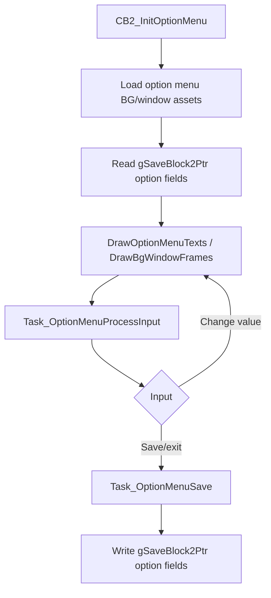

# Options and Status UI Flow v15

調査日: 2026-05-01

この文書は、将来 UI や status 表示を変える可能性に備え、option menu、battle UI config、party / summary の status 表示を整理する。

## Purpose

trainer battle 前選出、相手 party preview、battle UI 変更、status / option 追加が既存処理へ与える影響を把握する。

## Key Files

| File | Important symbols / notes |
|---|---|
| `src/option_menu.c` | option menu 本体。task data に option 値を読み書きする。 |
| `include/constants/global.h` | text speed、sound、button mode、battle style などの option constants。 |
| `include/global.h` | `struct SaveBlock2` に option 値を保持。 |
| `src/new_game.c` | `SetDefaultOptions` で初期 option を設定。 |
| `include/config/battle.h` | battle UI / input / display の compile-time config。 |
| `include/config/summary_screen.h` | summary screen の表示 config。 |
| `include/pokemon_summary_screen.h` | summary mode / page 定義。 |
| `src/pokemon_summary_screen.c` | summary screen 本体。 |
| `src/party_menu.c` | party menu の HP / status / held item / icon 表示。 |
| `src/battle_controller_player.c` | battle 中の button mode、move info、effectiveness、move reorder。 |

## Option Menu

`src/option_menu.c` で確認した task data:

| Task field | SaveBlock field | Meaning |
|---|---|---|
| `tTextSpeed` | `gSaveBlock2Ptr->optionsTextSpeed` | Text speed。 |
| `tBattleSceneOff` | `gSaveBlock2Ptr->optionsBattleSceneOff` | Battle scene on/off。 |
| `tBattleStyle` | `gSaveBlock2Ptr->optionsBattleStyle` | Shift / Set。 |
| `tSound` | `gSaveBlock2Ptr->optionsSound` | Mono / Stereo。 |
| `tButtonMode` | `gSaveBlock2Ptr->optionsButtonMode` | Normal / LR / L=A。 |
| `tWindowFrameType` | `gSaveBlock2Ptr->optionsWindowFrameType` | Text window frame。 |

Flow:

`src/new_game.c` の `SetDefaultOptions` で確認した初期値:

| Field | Default |
|---|---|
| `optionsTextSpeed` | `OPTIONS_TEXT_SPEED_MID` |
| `optionsWindowFrameType` | `0` |
| `optionsSound` | `OPTIONS_SOUND_MONO` |
| `optionsBattleStyle` | `OPTIONS_BATTLE_STYLE_SHIFT` |
| `optionsBattleSceneOff` | `FALSE` |
| `regionMapZoom` | `FALSE` |

`optionsButtonMode` は `SetDefaultOptions` 内では明示的に設定されていないことを確認した。初期化元は追加調査対象。

## Battle UI Config

`include/config/battle.h` で確認した、battle UI / input へ影響する config:

| Config | Current value observed | Notes |
|---|---:|---|
| `B_FAST_INTRO_PKMN_TEXT` | `TRUE` | battle intro text の高速化。 |
| `B_FAST_INTRO_NO_SLIDE` | `FALSE` | `src/battle_intro.c` の no-slide path と関係。 |
| `B_FAST_HP_DRAIN` | `TRUE` | HP bar drain speed。 |
| `B_FAST_EXP_GROW` | `TRUE` | EXP bar speed。 |
| `B_SHOW_TARGETS` | `TRUE` | target 選択表示。 |
| `B_SHOW_CATEGORY_ICON` | `TRUE` | move category icon。 |
| `B_HIDE_HEALTHBOX_IN_ANIMS` | `TRUE` | animation 中の healthbox 表示。 |
| `B_QUICK_MOVE_CURSOR_TO_RUN` | `FALSE` | action menu cursor。 |
| `B_RUN_TRAINER_BATTLE` | `TRUE` | trainer battle run handling。 |
| `B_MOVE_DESCRIPTION_BUTTON` | `L_BUTTON` | move description input。 |
| `B_LAST_USED_BALL` | `TRUE` | last used ball UI。trainer/frontier battle では投げられない。 |
| `B_LAST_USED_BALL_BUTTON` | `R_BUTTON` | last used ball input。 |
| `B_LAST_USED_BALL_CYCLE` | `TRUE` | last used ball cycle。 |
| `B_SHOW_TYPES` | `SHOW_TYPES_NEVER` | type 表示。 |
| `B_SHOW_EFFECTIVENESS` | `SHOW_EFFECTIVENESS_SEEN` | effectiveness 表示。 |
| `B_MOVE_REARRANGEMENT_IN_BATTLE` | `GEN_LATEST` | battle 中 move reorder。 |

### Notes

これらは compile-time config であり、option menu の save data とは別系統。ユーザーがゲーム内 option で切り替えられる UI にする場合は、`src/option_menu.c` と `struct SaveBlock2` 追加が必要になる可能性がある。

## Button Mode Interaction

`src/battle_controller_player.c` で確認した button mode 依存:

- `gSaveBlock2Ptr->optionsButtonMode == OPTIONS_BUTTON_MODE_L_EQUALS_A` のとき、L=A による入力扱いがある。
- move description button が `L_BUTTON` の場合、L=A と競合しないように `TryToAddMoveInfoWindow` 側で条件分岐している。
- action menu input では、button mode と cursor/hold 入力の扱いが絡む。

選出 UI や custom battle UI で新しい shortcut を使う場合、L=A / LR button mode と競合する可能性がある。

## Summary Screen

`include/config/summary_screen.h` で確認した config:

| Config | Current value observed | Notes |
|---|---:|---|
| `P_SUMMARY_SCREEN_NATURE_COLORS` | `TRUE` | nature color display。 |
| `P_SUMMARY_SCREEN_RENAME` | `TRUE` | summary から rename。 |
| `P_SUMMARY_SCREEN_IV_EV_INFO` | `FALSE` | IV/EV info page base。 |
| `P_SUMMARY_SCREEN_IV_EV_BOX_ONLY` | `FALSE` | box only。 |
| `P_SUMMARY_SCREEN_IV_HYPERTRAIN` | `TRUE` | hyper trained IV 表示。 |
| `P_SUMMARY_SCREEN_IV_EV_TILESET` | `FALSE` | IV/EV tileset。 |
| `P_SUMMARY_SCREEN_IV_EV_VALUES` | `FALSE` | values display。 |
| `P_SUMMARY_SCREEN_MOVE_RELEARNER` | `TRUE` | move relearner integration。 |

`include/pokemon_summary_screen.h` で確認した mode / page:

| Symbol | Role |
|---|---|
| `SUMMARY_MODE_NORMAL` | 通常 summary。 |
| `SUMMARY_MODE_LOCK_MOVES` | move 変更禁止系。 |
| `SUMMARY_MODE_BOX` | box summary。 |
| `SUMMARY_MODE_BOX_CURSOR` | box cursor あり。 |
| `SUMMARY_MODE_SELECT_MOVE` | move 選択。 |
| `SUMMARY_MODE_RELEARNER_BATTLE` | battle move relearner。 |
| `SUMMARY_MODE_RELEARNER_CONTEST` | contest move relearner。 |
| `PSS_PAGE_INFO`, `PSS_PAGE_SKILLS`, `PSS_PAGE_BATTLE_MOVES`, `PSS_PAGE_CONTEST_MOVES` | summary pages。 |

`src/pokemon_summary_screen.c` で確認した主な symbols:

- `ShowPokemonSummaryScreen`
- `ShowSelectMovePokemonSummaryScreen`
- `CB2_ReturnToSummaryScreenFromNamingScreen`
- `SetMoveTypeIcons`
- `SetNewMoveTypeIcon`
- `CreateSetStatusSprite`
- `ShouldShowMoveRelearner`
- `ShouldShowRename`
- `ShouldShowIVsOrEVs`

Battle 前選出 UI から summary を開く場合、`gPlayerParty` が元 6 匹なのか、選出後の一時 party なのかで表示対象が変わる。MVP では、選出 UI は battle 前に元 party を対象に開く想定が安全。

## Party Menu Status Display

`src/party_menu.c` で確認した status / HP 関連 symbols:

| Symbol | Role |
|---|---|
| `DisplayPartyPokemonHPCheck` | party menu HP 表示。 |
| `DisplayPartyPokemonMaxHPCheck` | max HP 表示。 |
| `DisplayPartyPokemonHPBarCheck` | HP bar 表示。 |
| `CreatePartyMonHeldItemSprite` | held item sprite。 |
| `CreatePartyMonStatusSprite` | status sprite。 |
| `GetAilmentFromStatus` | status condition から party menu ailment を決める。 |
| `PartyMenuModifyHP` | party menu 内 HP 変更演出。 |

選出 UI を既存 party menu で流用する場合、status 表示と fainted / egg / selected / no-entry の状態は既存処理に従う。

## Battle Selection Impact

| Area | Impact |
|---|---|
| Option menu | 新しい UI 設定を runtime option にするなら save data / option menu 変更が必要。 |
| Battle config | compile-time で UI を増減するなら `include/config/battle.h` だけで済む場合がある。 |
| Summary screen | 選出 UI から summary を開く場合、元 party slot と一時 party slot の区別が必要。 |
| Party menu status | 既存 choose half 流用時は fainted/egg/status/held item 表示の仕様を継承する。 |
| Button shortcuts | L=A、move description、last used ball、gimmick trigger と競合しない input 設計が必要。 |

## Open Questions

- 新しい battle selection / opponent preview 表示を compile-time config にするか、in-game option にするか未決定。
- `optionsButtonMode` の初期化箇所は `SetDefaultOptions` だけでは確認できなかったため、追加調査対象。
- Summary screen を選出 UI から開く場合、選出順を維持したまま戻る挙動の詳細は未確認。
- Status 表示の新規カテゴリや custom icon を足す場合、party menu / summary / battle healthbox の 3 系統をすべて追う必要がある。
