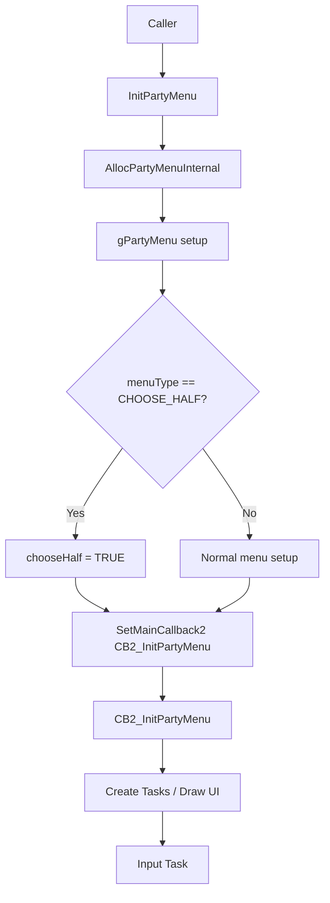
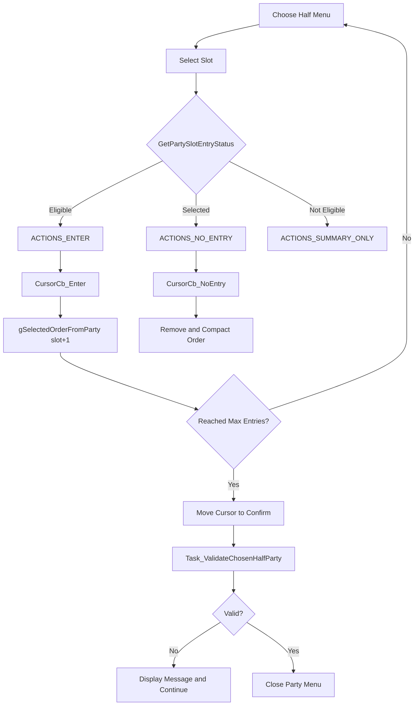

# Party Menu Flow v15

## Purpose

party menu の初期化、入力処理、終了 callback、および battle / choose half 用の分岐を整理する。

トレーナーバトル前選出では、まず既存の `PARTY_MENU_TYPE_CHOOSE_HALF` と `InitChooseHalfPartyForBattle` を流用できるかを判断する必要がある。

## Key Files

| File | Role |
|---|---|
| `include/party_menu.h` | `struct PartyMenu`、party menu globals、API prototypes |
| `include/constants/party_menu.h` | menu type、action、message constants |
| `src/party_menu.c` | party menu 本体、choose half 処理 |
| `src/script_pokemon_util.c` | `ChooseHalfPartyForBattle`、`ChoosePartyForBattleFrontier` |
| `src/battle_controller_player.c` | battle 中 party menu 終了 callback 関連 |
| `src/pokemon_icon.c` | party icon 表示関連 |
| `src/window.c` / `src/text.c` / `src/sprite.c` | UI 基盤 |

## Core State

| Symbol | Location | Notes |
|---|---|---|
| `gPartyMenu` | `src/party_menu.c` | menu type、layout、action、callback など |
| `gPartyMenuUseExitCallback` | `src/party_menu.c` | party menu 終了 callback の扱い |
| `gSelectedMonPartyId` | `include/party_menu.h` extern | 選択中 party slot |
| `gSelectedOrderFromParty` | `src/party_menu.c` | choose half の選出順。1-based slot を保存 |
| `gBattlePartyCurrentOrder` | `include/party_menu.h` extern | battle 中 party order |
| `sPartyMenuInternal` | `src/party_menu.c` static | cursor、chooseHalf flag、window/sprite 内部状態 |

`struct PartyMenu` には `exitCallback`、`task`、`menuType`、`layout`、`slotId`、`slotId2`、`action`、`bagItem`、`data1`、`learnMoveState` がある。

## Menu Types

`include/constants/party_menu.h` で確認した関連 menu type:

| Constant | Value | Notes |
|---|---:|---|
| `PARTY_MENU_TYPE_FIELD` | `0` | field menu |
| `PARTY_MENU_TYPE_IN_BATTLE` | `1` | battle 中 |
| `PARTY_MENU_TYPE_CONTEST` | `2` | contest |
| `PARTY_MENU_TYPE_CHOOSE_MON` | `3` | 1 匹選択 |
| `PARTY_MENU_TYPE_CHOOSE_HALF` | `4` | multi battle / eReader / facilities 用選出 |
| `PARTY_MENU_TYPE_MULTI_SHOWCASE` | `5` | multi showcase |

`PARTY_MENU_TYPE_CHOOSE_HALF` の comment は “multi battles, eReader battles, and some battle facilities” であり、通常 trainer battle 用とは明記されていない。

## Init and Main Loop

`src/party_menu.c` の `InitPartyMenu` が party menu の入口。

確認済みの流れ:

1. `InitPartyMenu(menuType, layout, partyAction, keepCursorPos, messageId, task, callback)`
2. `AllocPartyMenuInternal()`
3. `gPartyMenu` と `sPartyMenuInternal` を初期化
4. `menuType == PARTY_MENU_TYPE_CHOOSE_HALF` なら `sPartyMenuInternal->chooseHalf = TRUE`
5. player party count などを計算
6. `SetMainCallback2(CB2_InitPartyMenu)`
7. `CB2_InitPartyMenu` で graphics / windows / sprites を初期化
8. task 経由で入力処理へ入る

## Choose Mon Input

`Task_HandleChooseMonInput` は `PartyMenuButtonHandler` の結果で分岐する。

| Input | Behavior |
|---|---|
| A | `HandleChooseMonSelection` |
| B | `HandleChooseMonCancel` |
| START with `chooseHalf` | `MoveCursorToConfirm` |

`HandleChooseMonSelection` は、cursor が confirm button (`*slotPtr == PARTY_SIZE`) なら `gPartyMenu.task(taskId)` を呼ぶ。通常 slot の場合は `gPartyMenu.action` に応じて selection window や action へ進む。

## Closing Flow

`Task_ClosePartyMenu` は palette fade を開始し、`Task_ClosePartyMenuAndSetCB2` へ進む。

`Task_ClosePartyMenuAndSetCB2` では:

- battle 中なら party order を field order へ反映する処理がある。
- `gPartyMenuUseExitCallback` に応じて、内部 callback または `gPartyMenu.exitCallback` を `SetMainCallback2` する。
- party menu 用 pointers を free する。
- task を破棄する。

トレーナーバトル前選出で party menu を起動する場合、`gMain.savedCallback` / `gPartyMenu.exitCallback` / field script 再開 callback の整合性が重要になる。

## Battle Party Menu

`OpenPartyMenuInBattle` は battle 中の party menu を開く入口。battle 中の party menu は `PARTY_MENU_TYPE_IN_BATTLE` を使う。

関連する確認済み symbol:

| Symbol | Notes |
|---|---|
| `OpenPartyMenuInBattle` | battle controller から party menu を開く |
| `GetPartyLayoutFromBattleType` | battle type から layout を決定 |
| `CB2_SetUpReshowBattleScreenAfterMenu` | party menu 後に battle screen へ戻す |
| `gBattlePartyCurrentOrder` | battle 中の party order |

今回の選出は battle 前に行う想定のため、battle 中 party menu の flow とは別扱いが安全。

## Choose Half Related Behavior

`PARTY_MENU_TYPE_CHOOSE_HALF` のとき:

- `sPartyMenuInternal->chooseHalf = TRUE`
- START で confirm button へ移動できる。
- slot action は `GetPartyMenuActionsType` 経由で `ACTIONS_ENTER` / `ACTIONS_NO_ENTRY` / `ACTIONS_SUMMARY_ONLY` へ分岐する。
- `CursorCb_Enter` が `gSelectedOrderFromParty` へ 1-based slot を保存する。
- `CursorCb_NoEntry` が選出解除と compaction を行う。
- confirm button で `Task_ValidateChosenHalfParty` が呼ばれる。

## Notes for Battle Selection

- 既存 choose half UI は「選出順を保存する」用途としてかなり近い。
- `gSelectedOrderFromParty` が 1-based slot を保存する点は、元スロットへの反映処理に使いやすい。
- 現行の `InitChooseHalfPartyForBattle(u8 unused)` は引数を使っていない。選出数は `GetMaxBattleEntries` / `GetMinBattleEntries` が `VAR_FRONTIER_FACILITY` と `gSpecialVar_0x8005` などから決める。
- 通常 trainer battle 用に 3 匹 / 4 匹選出へ流用するには、Frontier / Union Room / Multi / eReader 向けの分岐をそのまま使うべきか慎重に確認する必要がある。

## Open Questions

- `sPartyMenuInternal` の全 field と draw/update task の詳細は未整理。
- `PARTY_MENU_TYPE_CHOOSE_HALF` を通常 trainer battle へそのまま使う場合、表示文言や eligibility が適切か未確認。
- `gPartyMenuUseExitCallback` が各 menu 起動元でどう使われるかは、さらに追う必要がある。
- battle 中 party menu と battle 前選出 menu の callback chain が混ざるケースは未検証。
