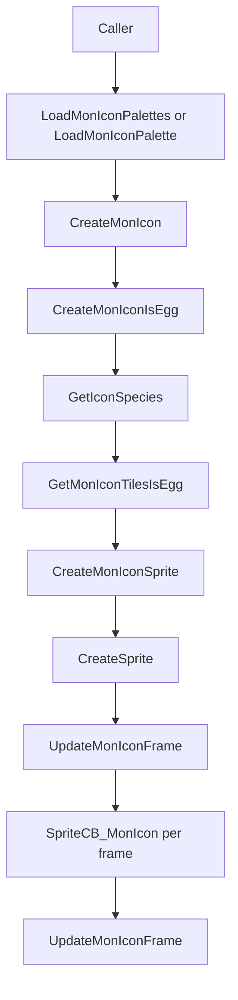

# Pokemon Icon UI Flow v15

調査日: 2026-05-02

この文書は Pokemon icon の描画、palette、sprite lifetime、DexNav / party / custom UI への影響を整理する。現時点では実装・改造は行っていない。

## Purpose

- DexNav や将来の選出 UI / 相手 party preview / custom menu で Pokemon icon を安全に使うため、既存 API と前提を確認する。
- icon palette の読み込み・解放と sprite VRAM copy の流れを整理する。
- UI 画面遷移で `ResetSpriteData()`、`FreeAllSpritePalettes()`、`LoadMonIconPalettes()` が絡む箇所を見落とさないようにする。

## Key Files

| File | Important symbols / notes |
|---|---|
| `include/pokemon_icon.h` | icon API。`CreateMonIcon`, `CreateMonIconNoPersonality`, `LoadMonIconPalettes`, `FreeMonIconPalettes`, `SpriteCB_MonIcon`。 |
| `src/pokemon_icon.c` | icon sprite 作成、palette table、tile selection、frame update。 |
| `src/graphics.c` | `gMonIconPalettes[][16]`。 |
| `src/data/graphics/pokemon.h` | species icon graphics の extern / INCBIN source。 |
| `src/data/pokemon/species_info.h` | `gSpeciesInfo[].iconSprite`, `.iconSpriteFemale`, `.iconPalIndex`。 |
| `src/dexnav.c` | DexNav GUI で `LoadMonIconPalettes()` と `CreateMonIcon()` を使用。 |
| `src/party_menu.c` | party menu icon 表示。 |
| `src/pokemon_storage_system.c` | PC storage icon 表示。 |
| `src/pokemon_summary_screen.c` | summary screen sprite / icon 近辺。 |

## Public API

`include/pokemon_icon.h` で確認した主な API:

| Function | Role |
|---|---|
| `LoadMonIconPalettes()` | icon 用 6 palette をまとめて読み込む。 |
| `FreeMonIconPalettes()` | icon palette をまとめて解放する。 |
| `LoadMonIconPalette(species)` | species に対応する icon palette を必要なら読み込む。 |
| `FreeMonIconPalette(species)` | species の icon palette を解放する。 |
| `CreateMonIcon(species, callback, x, y, subpriority, personality)` | personality を使って icon sprite を作る。 |
| `CreateMonIconNoPersonality(species, callback, x, y, subpriority)` | personality なしで icon sprite を作る。 |
| `CreateMonIconIsEgg(...)` | egg 判定を明示できる variant。 |
| `FreeAndDestroyMonIconSprite(sprite)` | icon sprite を安全に破棄。 |
| `SpriteCB_MonIcon(sprite)` | icon animation frame 更新 callback。 |
| `UpdateMonIconFrame(sprite)` | 現在 frame を OBJ VRAM へ copy。 |

## Palette and Graphics Data

`src/pokemon_icon.c` の `gMonIconPaletteTable` は 6 palette を持つ。

| Tag | Source |
|---|---|
| `POKE_ICON_BASE_PAL_TAG + 0` | `gMonIconPalettes[0]` |
| `POKE_ICON_BASE_PAL_TAG + 1` | `gMonIconPalettes[1]` |
| `POKE_ICON_BASE_PAL_TAG + 2` | `gMonIconPalettes[2]` |
| `POKE_ICON_BASE_PAL_TAG + 3` | `gMonIconPalettes[3]` |
| `POKE_ICON_BASE_PAL_TAG + 4` | `gMonIconPalettes[4]` |
| `POKE_ICON_BASE_PAL_TAG + 5` | `gMonIconPalettes[5]` |

`src/graphics.c` の `gMonIconPalettes[][16]` は `graphics/pokemon/icon_palettes/pal0.gbapal` から `pal5.gbapal` を読み込む。

species ごとの icon は `src/data/pokemon/species_info.h` の `gSpeciesInfo` が持つ。

| Field | Meaning |
|---|---|
| `.iconSprite` | 通常 icon graphics。 |
| `.iconSpriteFemale` | gender difference がある場合の female icon。 |
| `.iconPalIndex` | 0-5 の icon palette index。 |

`SPECIES_NONE` は question mark icon、`SPECIES_EGG` は egg icon を持つ。

## Icon Creation Flow

`CreateMonIconIsEgg()` は `GetMonIconTilesIsEgg()` で icon graphics pointer を決める。egg の場合は egg icon、gender difference が有効で female icon が存在する場合は female icon、それ以外は `gSpeciesInfo[species].iconSprite`。

`CreateMonIconSprite()` は tile tag `TAG_NONE` の sprite を作り、`sprite->images` に icon frame pointer を設定する。`SpriteCB_MonIcon()` は毎 frame `UpdateMonIconFrame()` を呼び、sprite frame graphics を OBJ VRAM へ copy する。

## DexNav Icon Usage

`src/dexnav.c` で確認した主な icon path:

| Function | Role |
|---|---|
| `DexNav_DoGfxSetup()` | state 10 で `LoadMonIconPalettes()`、`DrawSpeciesIcons()`。 |
| `DrawSpeciesIcons()` | land / water / hidden slots へ icon を描く。 |
| `TryDrawIconInSlot()` | no-data、question mark、actual species icon を振り分ける。 |
| `CreateNoDataIcon()` | no data slot の X icon。 |
| `DrawDexNavSearchMonIcon()` | search window の species icon。 |

`TryDrawIconInSlot()` の分岐:

| Condition | Draw |
|---|---|
| `species == SPECIES_NONE || species > NUM_SPECIES` | no-data X icon。 |
| Pokedex seen flag が false | `SPECIES_NONE` icon、つまり question mark。 |
| seen 済み | actual species icon。 |

hidden row は `DN_FLAG_DETECTOR_MODE` が set されていない場合、species が存在しても question mark 表示になる。

## Common UI Lifetime Rules

| Operation | Risk |
|---|---|
| `ResetSpriteData()` | 既存 sprite は消える。画面遷移時に icon sprite id を持ち越せない。 |
| `FreeAllSpritePalettes()` | palette tag が解放される。icon を再描画するなら `LoadMonIconPalettes()` が必要。 |
| `FreeMonIconPalettes()` | 他の icon sprite が同じ palette を使っている画面では注意。 |
| `DestroySprite()` only | icon sprite 用の VRAM/palette lifetime は caller 側の設計に依存。 |
| `FreeAndDestroyMonIconSprite()` | icon sprite の image pointer を dummy に戻してから破棄する。 |

DexNav のように専用 CB2 へ遷移して `ResetSpriteData()` / `FreeAllSpritePalettes()` を行う画面では、画面単位で icon palette を所有しやすい。一方、party menu 内の一部だけを custom UI にする場合は、既存 party menu が持つ sprite / palette と衝突しないように確認する必要がある。

## Impact for Future UI

| Future UI | Impact |
|---|---|
| Trainer battle selection UI | 元 party 6 匹と選出済み 3/4 匹を同時表示するなら、icon sprite 数、palette lifetime、slot layout を設計する。 |
| Opponent party preview | `gEnemyParty` 生成前に表示する場合は trainer data から species を読むか、pool/randomizer 反映後の party を先に作るかを決める。icon 描画自体は `CreateMonIcon` を使える。 |
| DexNav 12 枠超過 | icon 座標は固定 24 px spacing。枠増加時は `DrawSpeciesIcons()` と cursor layout を変える必要がある。 |
| Custom start menu / key item menu | `ResetSpriteData()` を使う独立画面か、field menu 上に重ねる画面かで icon palette ownership が変わる。 |
| Pokemon Champions 風 UI | 相手 party、タイプ、持ち物、選出状態を同時表示する場合、Pokemon icon だけでなく text/window/sprite budget を確認する。 |

## Open Questions

- icon sprite の最大同時数と custom UI での sprite budget は未計測。
- party menu / storage / DexNav が同時に active になる場面は通常ないが、modal 的に重ねる UI を作る場合の palette conflict は未確認。
- species icon graphics の追加手順、female icon、form icon、egg icon の build tool flow は未整理。
- icon animation frame count と timing は `src/pokemon_icon.c` の `GetMonIconTiles*` 以外も読む必要がある。
