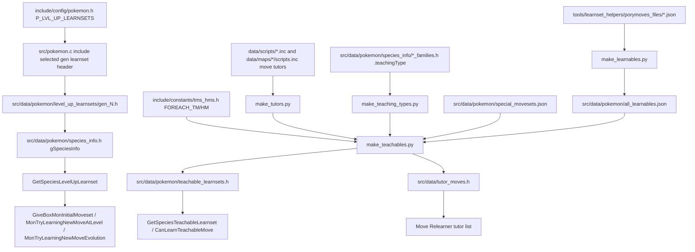
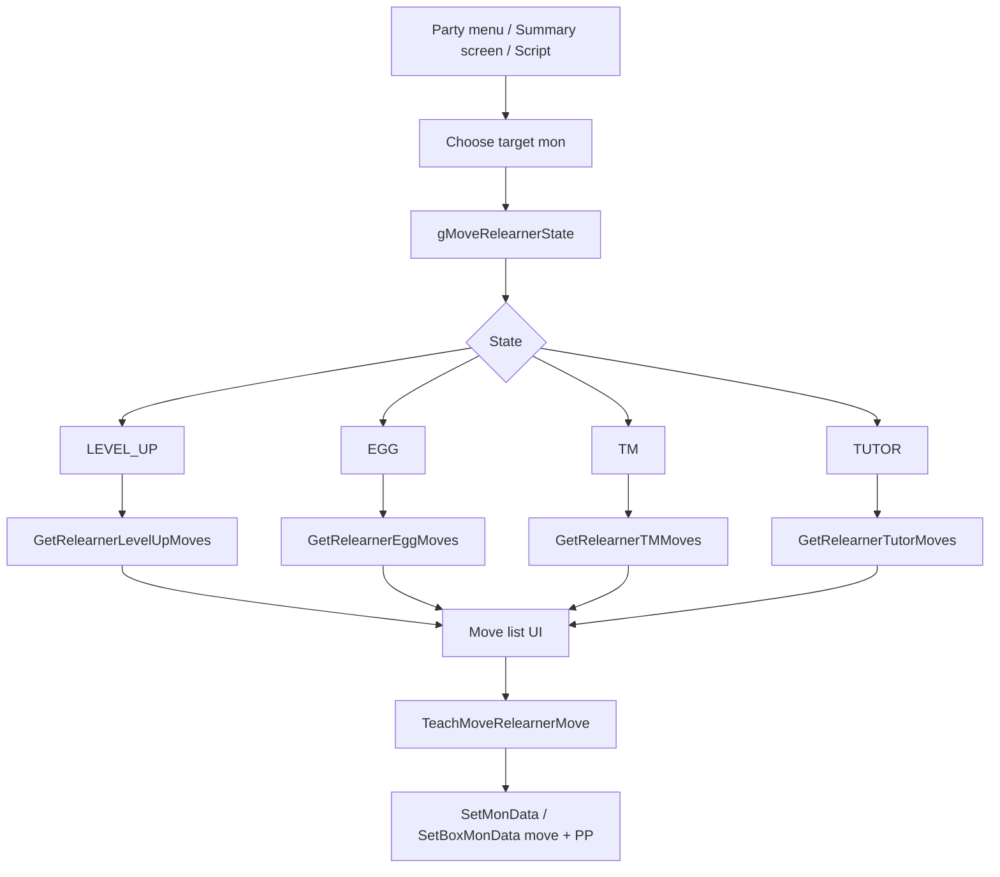

# Pokemon Learnset Flow v15

## Purpose

level-up learnset、teachable learnset、TM/HM、move tutor、move relearner の生成・参照フローを整理する。

## High-Level Flow



## Level-Up Learnsets

`src/pokemon.c` selects one generation header based on `P_LVL_UP_LEARNSETS`:

| Config condition | Included file |
|---|---|
| `P_LVL_UP_LEARNSETS >= GEN_9` | `src/data/pokemon/level_up_learnsets/gen_9.h` |
| `>= GEN_8` | `src/data/pokemon/level_up_learnsets/gen_8.h` |
| `>= GEN_7` | `src/data/pokemon/level_up_learnsets/gen_7.h` |
| `>= GEN_6` | `src/data/pokemon/level_up_learnsets/gen_6.h` |
| `>= GEN_5` | `src/data/pokemon/level_up_learnsets/gen_5.h` |
| `>= GEN_4` | `src/data/pokemon/level_up_learnsets/gen_4.h` |
| `>= GEN_3` | `src/data/pokemon/level_up_learnsets/gen_3.h` |
| `>= GEN_2` | `src/data/pokemon/level_up_learnsets/gen_2.h` |
| `>= GEN_1` | `src/data/pokemon/level_up_learnsets/gen_1.h` |

`include/config/pokemon.h` comment による確認事項:

- `GEN_1/2/3/4/5/6/7` は Yellow / Crystal / RSE / HGSS / B2W2 / ORAS / USUM の learnset。
- `GEN_8` は BDSP、LA、SwSh、fallback Gen 7 の優先順。
- `GEN_9` は SV 対応 species を使い、それ以外は Gen 8。
- 現在 `P_LVL_UP_LEARNSETS` は `GEN_LATEST`。

level-up learnset header は `struct LevelUpMove` の配列を持つ。

```c
struct LevelUpMove
{
    enum Move move;
    u16 level;
};
```

確認した macro:

- `LEVEL_UP_MOVE(lvl, moveLearned)`
- `LEVEL_UP_END`
- sentinel は `LEVEL_UP_MOVE_END`

## Runtime Level-Up Consumers

| Function | File | Flow |
|---|---|---|
| `GetSpeciesLevelUpLearnset(u16 species)` | `src/pokemon.c` | `gSpeciesInfo[SanitizeSpeciesId(species)].levelUpLearnset` を返す。NULL なら `SPECIES_NONE` fallback。 |
| `GiveBoxMonInitialMoveset(struct BoxPokemon *boxMon)` | `src/pokemon.c` | 現在 level 以下の learnset を先頭から走査し、重複を避けつつ最大 4 moves に詰める。5 個目以降は古い move を左 shift して最後に追加。level 0 move は skip。 |
| `MonTryLearningNewMoveAtLevel(struct Pokemon *mon, bool32 firstMove, u32 level)` | `src/pokemon.c` | 指定 level の move を `gMoveToLearn` に入れ、`GiveMoveToMon` で習得を試す。複数 move 用に `sLearningMoveTableID` を使う。 |
| `MonTryLearningNewMove(struct Pokemon *mon, bool8 firstMove)` | `src/pokemon.c` | 現在 level で `MonTryLearningNewMoveAtLevel` を呼ぶ wrapper。 |
| `MonTryLearningNewMoveEvolution(struct Pokemon *mon, bool8 firstMove)` | `src/pokemon.c` | evolution 後の level 0 / current level move を処理。`P_EVOLUTION_LEVEL_1_LEARN >= GEN_8` の条件あり。 |

## Teachable Learnsets Generation

`P_LEARNSET_HELPER_TEACHABLE` が `TRUE` の場合、`teachable_learnsets.h` は生成対象になる。

Makefile で確認した生成 rule:

| Output | Generator | Inputs |
|---|---|---|
| `src/data/pokemon/all_learnables.json` | `tools/learnset_helpers/make_learnables.py` | `tools/learnset_helpers/porymoves_files/*.json` |
| `tools/learnset_helpers/build/all_tutors.json` | `tools/learnset_helpers/make_tutors.py` | `data/scripts/*.inc`, `data/maps/*/scripts.inc` |
| `tools/learnset_helpers/build/all_teaching_types.json` | `tools/learnset_helpers/make_teaching_types.py` | `src/data/pokemon/species_info/*_families.h` |
| `src/data/pokemon/teachable_learnsets.h` | `tools/learnset_helpers/make_teachables.py` | `all_learnables.json`, `include/constants/tms_hms.h`, `include/config/pokemon.h`, `src/data/pokemon/special_movesets.json`, `include/config/pokedex_plus_hgss.h`, generated tutor/teaching-type JSON |
| `src/data/tutor_moves.h` | `tools/learnset_helpers/make_teachables.py --tutors` | `src/data/pokemon/special_movesets.json`, generated tutor JSON |

`make_teachables.py` comment による teachable 判定:

- overworld Move Tutor が教える move。
- `include/constants/tms_hms.h` の `FOREACH_TM` / `FOREACH_HM` に割り当てられている move。
- `src/data/pokemon/special_movesets.json` の `universalMoves`。
- species が Expansion 対応 game のどれかでその move を覚えられること。
- species info の `.teachingType` rule を満たすこと。

## Move Tutor Script Detection

`tools/learnset_helpers/make_tutors.py` は `.inc` を text scan する。

検出 pattern:

| Pattern | Meaning |
|---|---|
| `special ChooseMonForMoveTutor` | script based move tutor の入口候補。 |
| `chooseboxmon SELECT_PC_MON_MOVE_TUTOR` | PC box mon 対応 move tutor の入口候補。 |
| `setvar VAR_0x8005, MOVE_*` | tutor move ID 候補。 |
| `move_tutor MOVE_*` | macro-based tutor move 候補。 |

実際に確認した tutor script:

- `data/scripts/move_tutors.inc`
- `data/scripts/move_tutors_frlg.inc`
- `data/maps/BattleFrontier_Lounge7/scripts.inc`

この仕組みは、今後 `.inc` を変更しただけで teachable generation に影響する可能性がある。Move Tutor を追加・削除する時は、script と生成物の両方を見る必要がある。

## TM/HM Mapping

TM/HM は複数箇所が絡む。

250 TM 前提の local 調査は [tm_hm_expansion_250_v15.md](../overview/tm_hm_expansion_250_v15.md) に分離した。

| Layer | File / symbol | Notes |
|---|---|---|
| Configured move list | `include/constants/tms_hms.h`, `FOREACH_TM`, `FOREACH_HM` | 現在 `FOREACH_TM` は 50 moves、`FOREACH_HM` は 8 moves。 |
| Item constants | `include/constants/items.h` | `ITEM_TM01` - `ITEM_TM100`、`ITEM_HM01` - `ITEM_HM08` の枠がある。 |
| Item/move mapping | `include/item.h`, `src/item.c`, `gTMHMItemMoveIds[]` | `FOREACH_TMHM` から index -> item/move を生成。 |
| Learnability | `src/data/pokemon/teachable_learnsets.h`, `CanLearnTeachableMove` | TM/HM move が species に教えられるか。 |
| Relearner | `src/move_relearner.c` | `GetRelearnerTMMoves` / `HasRelearnerTMMoves` が `NUM_ALL_MACHINES` を走査する。 |

注意:

- item ID の `ITEM_TM51` - `ITEM_TM100` 枠は存在するが、現在の `FOREACH_TM` に含まれる TM move は 50 個。
- 250 TM まで増やす場合、現 checkout では `ITEMS_COUNT` / held item 10-bit 上限に具体的に当たる。`ITEM_TM51` - `ITEM_TM100` の既存枠を使っても、残り 150 個をそのまま足すと `ITEMS_COUNT == 1024` になり `src/pokemon.c` の static assert に失敗する。
- TM を増やすだけなら、少なくとも `include/constants/tms_hms.h`、`src/data/items.h`、learnset helper 生成、shop/script placement、UI/relearner 上限を一緒に確認する。
- TM shop 化で map 上の TM flag を削除したい場合、`data/maps/**/scripts.inc` の `giveitem ITEM_TM_*`、`setflag FLAG_RECEIVED_TM_*`、`goto_if_set/unset FLAG_RECEIVED_TM_*` を追う必要がある。

## Move Relearner Flow



Important files:

- `include/constants/move_relearner.h`
- `include/config/summary_screen.h`
- `src/move_relearner.c`
- `src/pokemon_summary_screen.c`
- `src/party_menu.c`
- `src/chooseboxmon.c`
- `src/scrcmd.c`

Important limits / config:

| Symbol | Value / role |
|---|---|
| `MAX_RELEARNER_MOVES` | 60。comment では Mew の TMs/HMs 表示のため 25 から 60 に増加済み。TM をさらに増やすなら増加検討と UI 検証が必要。 |
| `P_ENABLE_MOVE_RELEARNERS` | egg / TM / tutor relearner 全体有効化。現在 `FALSE`。 |
| `P_TM_MOVES_RELEARNER` | TM move relearner 有効化。現在 `FALSE`。 |
| `P_ENABLE_ALL_TM_MOVES` | bag 所持に関係なく compatible TM を表示。現在 `FALSE`。 |
| `P_FLAG_EGG_MOVES` | egg move relearner 用 flag。現在 `0`。 |
| `P_FLAG_TUTOR_MOVES` | tutor move relearner 用 flag。現在 `0`。 |
| `P_PRE_EVO_MOVES` | pre-evolution moves の relearner 対応。現在 `FALSE`。 |
| `P_ENABLE_ALL_LEVEL_UP_MOVES` | level に関係なく level-up moves を表示。現在 `FALSE`。 |
| `P_SORT_MOVES` | relearner list sort。現在 `FALSE`。 |

## HM / Cannot Forget Flow

`src/pokemon.c` で確認した流れ:

- `IsMoveHM(enum Move move)` は `FOREACH_HM` から HM move 判定を生成する。
- `CannotForgetMove(enum Move move)` は `P_CAN_FORGET_HIDDEN_MOVE` が `TRUE` なら常に forget 可能、`FALSE` なら HM move を forget 不可にする。
- `include/config/pokemon.h` では `P_CAN_FORGET_HIDDEN_MOVE` は現在 `FALSE`。
- `src/party_menu.c` では move deletion 前に `IsMoveHM` / `P_CAN_FORGET_HIDDEN_MOVE` 周辺の判定が使われている。

Gen 7/8 風に field HM を key item / fixed action 化する場合、`FOREACH_HM` から HM 判定を消すだけでは不十分。field move action、party menu move deletion、item TM/HM mapping、map scripts、field effect animation を合わせて確認する必要がある。

## Tooling Notes

今後の調査では次の組み合わせが有効。

| Need | Recommended tools |
|---|---|
| species/move/item 定義の場所探し | `rg`, Serena symbol overview |
| C function の型・宣言確認 | agent-lsp hover / definition |
| `gPlayerParty` / `SetMonData` / `CanLearnTeachableMove` の大量参照洗い出し | `rg`, Semgrep custom rule |
| `.inc` tutor / TM / flag 探索 | `rg` first。Semgrep は C 向きなので script macro は `rg` が主力。 |
| move relearner UI 表示上限検証 | mGBA Live MCP screenshot + input |

## Open Questions

- 250 TM へ拡張する場合、物理 item ID を 250 個持つか、HM item ID / unused item を repurpose するか、virtual unlock 方式にするか方針が必要。
- TM relearner を有効化する場合、`MAX_RELEARNER_MOVES` を増やすだけでなく、`GetRelearnerTMMoves()` などの candidate 生成 loop に上限 guard / pagination policy が必要。
- `P_LEARNSET_HELPER_TEACHABLE` を維持したまま独自 move/species を入れる場合、`porymoves_files/*.json` に独自 data を追加するのか、generated `all_learnables.json` を管理するのか方針が必要。
- `move_tutor` macro と `special ChooseMonForMoveTutor` の script 側の最終 dispatch は、script command / special flow docs と連結して追加確認する。
- summary screen relearner は `P_SUMMARY_SCREEN_MOVE_RELEARNER TRUE` だが、egg/TM/tutor の unlock config/flag は別。実際の UI 表示条件を mGBA で確認する必要がある。
- field HM modernization と TM shop migration を同時に進める場合、HM を item として残すか、key item / badge / story flag に置き換えるか設計が必要。
