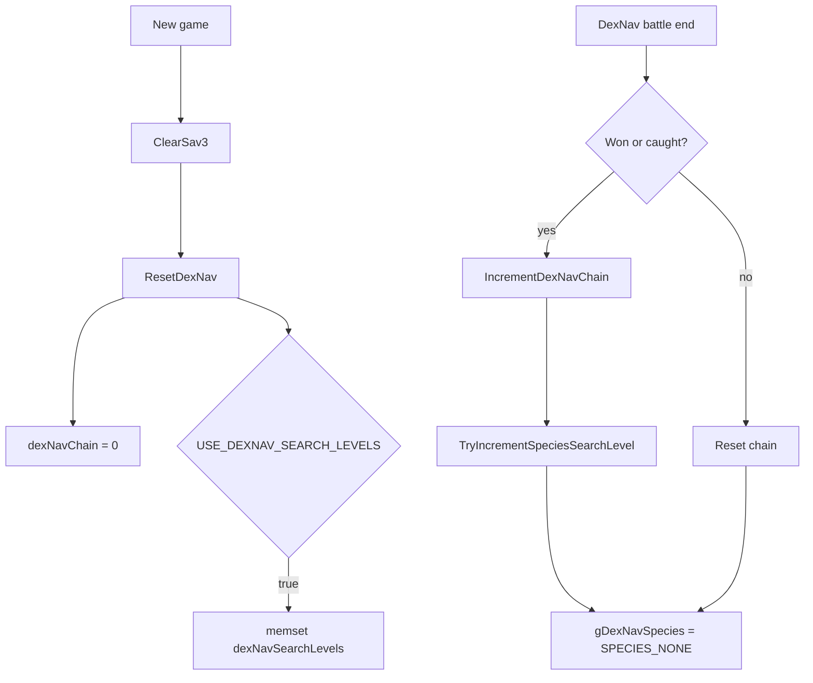

# Save Data Flow v15

Status: Planned (SaveBlock allocation policy)
Code status: No code changes
最終更新: 2026-05-05

この文書は SaveBlock1 / SaveBlock2 / SaveBlock3、flag / var、DexNav save field、option save field を整理する。現時点では実装・改造は行っていない。

後続 feature が SaveBlock を触るときの **割り当て先候補と policy** を併記し、Planned 状態として固定する。
no_random_encounters / champions_challenge / runtime_rule_options / partygen seed の 4 件を念頭に置いている。

## Purpose

- UI や DexNav、randomizer、独自 option、flag / var を追加する前に、どの save block に何が入るかを確認する。
- `USE_DEXNAV_SEARCH_LEVELS` のように config で save layout が変わる項目を追跡する。
- map script の `setflag` / `setvar` と C 側の save data の関係を明確にする。

## Key Files

| File | Important symbols / notes |
|---|---|
| `include/global.h` | `struct SaveBlock1`, `struct SaveBlock2`, `struct SaveBlock3`, `gSaveBlock1Ptr`, `gSaveBlock2Ptr`, `gSaveBlock3Ptr`。 |
| `include/save.h` | save sector constants。`SECTOR_DATA_SIZE`, `SAVE_BLOCK_3_CHUNK_SIZE`, `NUM_SECTORS_PER_SLOT`。 |
| `src/save.c` | save read/write、`STATIC_ASSERT(sizeof(struct SaveBlock3) <= ...)`, `SaveBlock3Size`, `CopyToSaveBlock3`, `CopyFromSaveBlock3`。 |
| `src/load_save.c` | `gSaveblock3`, `gSaveBlock3Ptr`, `ClearSav3`。 |
| `src/new_game.c` | new game 初期化。`ClearSav3`, `ResetDexNav`, `SetDefaultOptions`。 |
| `src/event_data.c` | `gSpecialVar_*`, `GetVarPointer`, `VarGet`, `VarSet`, `FlagSet`, `FlagClear`, `FlagGet`。 |
| `include/constants/flags.h` | saved flags / temp flags。 |
| `include/constants/vars.h` | saved vars / temp vars / special vars。 |
| `include/config/dexnav.h` | DexNav save / flag / var config。 |
| `include/config/summary_screen.h` | summary / move relearner flag config。 |

## Save Blocks

| Save block | Confirmed owner / examples |
|---|---|
| `struct SaveBlock1` | map state、flags、vars、object event templates、bag、player party など。詳細は `include/global.h`。 |
| `struct SaveBlock2` | player profile、options、Pokedex など。option menu はここへ保存する。 |
| `struct SaveBlock3` | expansion 用の小さい追加領域。fake RTC、NPC follower、item description flags、DexNav search levels、DexNav chain、apricorn tree など config で変わる。 |
| Pokemon storage | sector 5-13。PC box data。 |

`src/load_save.c` では `EWRAM_DATA struct SaveBlock3 gSaveblock3 = {};` と `IWRAM_INIT struct SaveBlock3 *gSaveBlock3Ptr = &gSaveblock3;` を確認した。SaveBlock3 は ASLR wrapper ではなく固定 pointer として扱われている。

## Save Sector Layout

`include/save.h`:

| Constant | Value | Meaning |
|---|---:|---|
| `SECTOR_DATA_SIZE` | `3968` | 通常 save data 部分。 |
| `SAVE_BLOCK_3_CHUNK_SIZE` | `116` | 各 sector に入る SaveBlock3 chunk。 |
| `SECTOR_FOOTER_SIZE` | `12` | footer。 |
| `NUM_SECTORS_PER_SLOT` | `14` | 通常 save slot の sector 数。 |

SaveBlock3 の最大容量は `116 * 14 = 1624` bytes。`include/global.h` にも `struct SaveBlock3` の comment として `max size 1624 bytes` がある。

`src/save.c` では以下を確認した。

- `STATIC_ASSERT(sizeof(struct SaveBlock3) <= SAVE_BLOCK_3_CHUNK_SIZE * NUM_SECTORS_PER_SLOT, SaveBlock3FreeSpace)`
- `SaveBlock3Size(sectorId)`
- `CopyToSaveBlock3(sectorId, sector)`
- `CopyFromSaveBlock3(sectorId, sector)`

`SaveBlock3Size()` は sector id ごとの 116 byte slice を計算し、`sizeof(gSaveblock3)` を超えないぶんだけ copy する。

## SaveBlock3 Fields

`include/global.h` の `struct SaveBlock3` は config により field が増減する。

| Field | Condition | Notes |
|---|---|---|
| `fakeRTC` | `OW_USE_FAKE_RTC` | fake RTC data。 |
| `NPCfollower` | `FNPC_ENABLE_NPC_FOLLOWERS` | follower state。 |
| `itemFlags[ITEM_FLAGS_COUNT]` | `OW_SHOW_ITEM_DESCRIPTIONS == OW_ITEM_DESCRIPTIONS_FIRST_TIME` | item description first-time 表示用。 |
| `dexNavSearchLevels[NUM_SPECIES]` | `USE_DEXNAV_SEARCH_LEVELS == TRUE` | DexNav species search level。1 species 1 byte。 |
| `dexNavChain` | always | DexNav chain。 |
| `apricornTrees[NUM_APRICORN_TREE_BYTES]` | `APRICORN_TREE_COUNT > 0` | apricorn tree state。 |

DexNav search levels は `NUM_SPECIES` byte を消費する。v15 系の species 数が増えるほど SaveBlock3 を圧迫するため、randomizer seed、独自 option、独自 unlock state を SaveBlock3 に追加する前に容量確認が必須。

## DexNav Save Flow



確認した symbols:

| Symbol | File | Role |
|---|---|---|
| `ResetDexNav` | `src/new_game.c` | new game 時の DexNav state 初期化。 |
| `gSaveBlock3Ptr->dexNavChain` | `include/global.h`, `src/dexnav.c` | chain bonus と reset。 |
| `gSaveBlock3Ptr->dexNavSearchLevels` | `include/global.h`, `src/dexnav.c` | `USE_DEXNAV_SEARCH_LEVELS == TRUE` のみ。 |
| `TryIncrementSpeciesSearchLevel` | `src/dexnav.c` | Battle Frontier 以外で search level を 255 まで増加。 |
| `CalculateDexNavShinyRolls` | `src/dexnav.c`, `src/pokemon.c` | shiny rolls に chain bonus を追加。 |

## Flags and Vars

script の flag / var は主に SaveBlock1 に保存される。

| Kind | Storage / behavior |
|---|---|
| Saved flags | `struct SaveBlock1.flags`。`FlagSet` / `FlagClear` / `FlagGet`。 |
| Saved vars | `struct SaveBlock1.vars`。`VarSet` / `VarGet`。 |
| Temp flags | `FLAG_TEMP_*`。`ClearTempFieldEventData()` で clear。 |
| Temp vars | `VAR_TEMP_*`。`ClearTempFieldEventData()` で clear。 |
| Special vars | `gSpecialVar_0x8000` から `gSpecialVar_Result`。C global で、永続 save ではない。 |

`src/event_data.c` の `GetVarPointer(id)`:

- `id < VARS_START` は var pointer なし。
- `VARS_START <= id < SPECIAL_VARS_START` は SaveBlock1 vars。
- special var は `gSpecialVars`。

`VarGet(id)` は pointer がない場合、`id` を literal として返す。この仕様は `map_script_2` や script compare の読み方に影響する。

DexNav config では `DN_VAR_SPECIES` と `DN_VAR_STEP_COUNTER` を saved var として割り当てる必要がある。0 のままでは `GetVarPointer(DN_VAR_STEP_COUNTER)` が NULL になり得るため、DexNav 有効化前に var id を決める。

## Option Save Fields

`src/option_menu.c` と `src/new_game.c` で確認した option save fields:

| SaveBlock2 field | Meaning |
|---|---|
| `optionsTextSpeed` | text speed。 |
| `optionsBattleSceneOff` | battle scene。 |
| `optionsBattleStyle` | shift / set。 |
| `optionsSound` | mono / stereo。 |
| `optionsButtonMode` | normal / LR / L=A。 |
| `optionsWindowFrameType` | frame。 |
| `regionMapZoom` | region map zoom。 |

`SetDefaultOptions()` では `optionsTextSpeed`、`optionsWindowFrameType`、`optionsSound`、`optionsBattleStyle`、`optionsBattleSceneOff`、`regionMapZoom` を確認した。`optionsButtonMode` の初期化箇所は追加調査対象。

独自 UI option を runtime で切り替える場合は、`include/global.h` の `struct SaveBlock2`、`src/option_menu.c`、`src/new_game.c`、save compatibility をまとめて扱う必要がある。

## Capacity Audit

`include/save.h` と `src/save.c` の `STATIC_ASSERT(...)` 群から、最大容量が確定している。

| Block | Max size | 計算 |
|---|---:|---|
| `SaveBlock2` | 3968 B | `SECTOR_DATA_SIZE` × 1 sector |
| `SaveBlock1` | 15872 B | `SECTOR_DATA_SIZE` × (`SECTOR_ID_SAVEBLOCK1_END` − `SECTOR_ID_SAVEBLOCK1_START` + 1) = 3968 × 4 |
| `SaveBlock3` | 1624 B | `SAVE_BLOCK_3_CHUNK_SIZE` × `NUM_SECTORS_PER_SLOT` = 116 × 14 |

実際の使用量は build assert (`SaveBlock1FreeSpace` / `SaveBlock2FreeSpace` / `SaveBlock3FreeSpace`) で fail するまで free space が残っている、という曖昧な状態。
精密に取る場合は `make` 後に `pokeemerald.map` を `arm-none-eabi-nm pokeemerald.elf | grep gSave` で確認するか、`STATIC_ASSERT` を一時的に厳しくして diff を見る (要 source 編集)。

`include/config/save.h` には FREE_* toggle 群が並ぶ。default は **すべて FALSE**。

| Toggle | 解放量 | Block |
|---|---:|---|
| `FREE_EXTRA_SEEN_FLAGS_SAVEBLOCK1` | 52 B | SaveBlock1 |
| `FREE_TRAINER_HILL` | 28 B | SaveBlock1 |
| `FREE_TRAINER_TOWER` | 約 52 B (FRLG のみ) | SaveBlock1 |
| `FREE_MYSTERY_EVENT_BUFFERS` | 1104 B | SaveBlock1 |
| `FREE_MATCH_CALL` | 104 B | SaveBlock1 |
| `FREE_UNION_ROOM_CHAT` | 212 B | SaveBlock1 |
| `FREE_ENIGMA_BERRY` | 52 B | SaveBlock1 |
| `FREE_LINK_BATTLE_RECORDS` | 88 B | SaveBlock1 |
| `FREE_MYSTERY_GIFT` | 876 B | SaveBlock1 |
| SaveBlock1 合計 | **2516 B** | |
| `FREE_BATTLE_TOWER_E_READER` | 188 B | SaveBlock2 |
| `FREE_POKEMON_JUMP` | 16 B | SaveBlock2 |
| `FREE_RECORD_MIXING_HALL_RECORDS` | 1032 B | SaveBlock2 |
| `FREE_EXTRA_SEEN_FLAGS_SAVEBLOCK2` | 108 B | SaveBlock2 |
| SaveBlock2 合計 | **1274 B** | |
| Grand Total | **3790 B** | コメント記載 |

**Policy**:

- 新規 field を追加する前に、まず **既存 unused field の置換 / rename** を検討する。
- それでも足りない場合は、影響の小さい FREE_* を有効化して capacity を空ける。Save migration 必須。
- FREE_MYSTERY_EVENT_BUFFERS と FREE_MYSTERY_GIFT は単独で kB 単位を確保できるが、Mystery Gift / Mystery Event を使う ROM では切れない。本 fork では現状未使用想定なので、両方無効化済み。
- save layout を変える PR は upstream 追従 (`expansion/X.Y.Z`) で必ず conflict する。`docs/upgrades/upstream_diff_checklist.md` に追加する。

## Saved Flag / Var Capacity

`include/constants/flags.h` / `include/constants/vars.h` を確認した。

| Resource | 既存 unused 件数 | Region |
|---|---:|---|
| Saved flag | 約 372 件 | TEMP / TRAINER / SYSTEM / DAILY |
| Saved var | 約 29 件 | SAVED region |

flag は SYSTEM 領域 (`0x8E5`–`0x91F`) と DAILY 領域 (`0x920`–`0x95F`) に大量に並ぶ。SYSTEM 領域は save persistent で daily reset されないため、状態 flag に推奨。
DAILY 領域は daily reset 系処理で意図せず clear される可能性があるため、リアルタイム選択肢から外す。

var は数が少ないので、新規 feature が複数 var を要求する場合は、**SaveBlock の専用 field** を作る方が安全。

## Design Notes for Future Save Additions

| Candidate | Suggested owner | Decision basis |
|---|---|---|
| DexNav species search levels | 既存 `SaveBlock3.dexNavSearchLevels` | 既存 config (`USE_DEXNAV_SEARCH_LEVELS`)。`NUM_SPECIES` × 1 byte = 約 1.5 KB なので SaveBlock3 をほぼ使い切る。 |
| DexNav grant / detector unlock | saved flag (SYSTEM region) | `DN_FLAG_DEXNAV_GET` / `DN_FLAG_DETECTOR_MODE` として扱える。 |
| `OW_FLAG_NO_ENCOUNTER` 用 flag | saved flag (SYSTEM region) | 1 bit で足り、map 跨ぎで保持する。`FLAG_UNUSED_0x8E5` 推奨。 |
| Champions Challenge state (active/status/saved-flags) | **SaveBlock1 dedicated struct** | 6 匹分の `struct Pokemon` snapshot (約 600 B × 6 = 3.6 KB) と bag snapshot を含む可能性が高い。SaveBlock3 (1624 B 上限) には収まらない。SaveBlock1 で `FREE_MYSTERY_GIFT` などを切って空き容量を確保する。 |
| Champions Challenge runtime flags (battleLevel / disableExp / releaseOnLoss など 1 bit) | saved flag (SYSTEM region 連続帯) | `0x8E6`–`0x8EE` 付近をまとめて `FLAG_CHALLENGE_*` に rename。 |
| Champions Challenge eligibility / bag mode (enum) | saved var | `VAR_UNUSED_0x40DB`–`0x40FD` から確保。状態が複数値を取るため var が向く。 |
| partygen deterministic seed | **SaveBlock3** (32-bit) | 4 byte で済む。partygen は generator 側で deterministic にしておけば、save 側は seed 1 値だけ。SaveBlock3 末尾に追加可能。 |
| Wild encounter randomizer mode | compile-time config first | runtime にする場合は SaveBlock2 の option field を 1 byte 追加する。option UI 化は runtime rule option policy 確定後。 |
| Runtime rule option set (Nuzlocke / Hardcore / EXP scaling 等) | **SaveBlock2 dedicated struct** | option menu で切り替えるなら SaveBlock2 が自然。1 ruleset = 1 byte enum + 数 bit flags 程度。option page 増設で MVP は SaveBlock2 へ 4-8 byte 確保。 |
| Custom menu option | SaveBlock2 | option menu と連動するなら SaveBlock2 が自然。ただし layout change risk あり。 |
| One-off map state | saved flag / var | map script で使うなら SaveBlock1 flags / vars。 |

## Champions Challenge Field Sketch

`docs/features/champions_challenge/mvp_plan.md` Phase 1 で定義した state を SaveBlock1 に置く場合の概要 (実装ではない)。

```c
// 追加候補 (実装前メモ。行わない)
struct ChampionsChallengeState
{
    /*0x000*/ u8 active : 1;
    /*0x000*/ u8 status : 3;            // none / preparing / battling / won / lost / paused
    /*0x000*/ u8 normalPartySaved : 1;
    /*0x000*/ u8 normalBagSaved : 1;
    /*0x000*/ u8 disableExp : 1;
    /*0x000*/ u8 releaseOnLoss : 1;
    /*0x001*/ u8 partyCountRequired;    // MVP: 6
    /*0x002*/ u8 eligibilityRuleId;     // egg-only-ban / frontier-ban
    /*0x003*/ u8 bagMode;               // empty / locked / etc
    /*0x004*/ u8 battleLevel;           // MVP: 50
    /*0x005*/ //u8 padding[3];
    /*0x008*/ struct Pokemon savedParty[PARTY_SIZE];   // ≈ 600 B
    /*0x???*/ struct Bag savedBag;                     // ≈ 0x2E8 B
    /*0x???*/ u32 streak;
};
```

サイズは 4-5 KB 級。SaveBlock1 の `FREE_MYSTERY_GIFT` (876 B) + `FREE_MYSTERY_EVENT_BUFFERS` (1104 B) = 1980 B を空ければ収まる。

**注意**: in-place swap で `gPlayerParty` ↔ `SaveBlock1.playerParty` を入れ替える案は **不可**。
理由: `SavePlayerParty()` は live `gPlayerParty` を `SaveBlock1.playerParty[]` へコピーするだけで、別 backup buffer ではない。challenge 中に save game が走ると challenge 6 匹が persistent slot に書き込まれ、通常 party snapshot が消える。
詳細は `docs/features/battle_selection/investigation.md#savePlayerParty--LoadPlayerParty-の中身` と `docs/features/champions_challenge/risks.md#SaveBlock1.playerParty Conflict`。
専用 `savedNormalParty[PARTY_SIZE]` field を必ず持つ。

## Runtime Rule Option Field Sketch

`docs/overview/runtime_rule_options_feasibility_v15.md` の 7 系統 (Nuzlocke / release / difficulty / EXP-catch-shiny multiplier / mega-Z-dynamax-tera / trade / randomizer) を SaveBlock2 に追加する場合の概要 (実装ではない)。

```c
// 追加候補 (実装前メモ。行わない)
struct RuntimeRuleOptions
{
    /*0x00*/ u8 nuzlockeMode : 2;
    /*0x00*/ u8 releaseOnFaint : 1;
    /*0x00*/ u8 difficulty : 2;
    /*0x00*/ u8 randomizerMode : 3;
    /*0x01*/ u8 expScale;     // 0 / 1 / 2 / 4
    /*0x02*/ u8 catchScale;
    /*0x03*/ u8 shinyScale;
    /*0x04*/ u8 megaAllowed : 1;
    /*0x04*/ u8 zMoveAllowed : 1;
    /*0x04*/ u8 dynamaxAllowed : 1;
    /*0x04*/ u8 teraAllowed : 1;
    /*0x04*/ u8 tradeAllowed : 1;
    /*0x05*/ //u8 padding[3];
};
```

実体は約 8 byte。SaveBlock2 (3968 B 上限) には十分余裕がある。option menu 拡張と一緒に考える。

## Risks

| Risk | Why |
|---|---|
| SaveBlock3 overflow | `USE_DEXNAV_SEARCH_LEVELS` だけで species 数分の byte を使う。追加 field と競合する。 |
| Save layout migration | `struct SaveBlock1/2/3` を変えると既存 save との互換性に影響する。 |
| Config-dependent struct layout | compile-time config の切り替えで `struct SaveBlock3` の field offset が変わる。 |
| Special var を save state と誤認 | `gSpecialVar_0x8004` などは一時 global であり、永続化されない。 |
| Temp var / temp flag の永続利用 | map load で clear されるため、story progress には不向き。 |

## Allocation Decision Summary

| Feature | Block | Field shape | 理由 |
|---|---|---|---|
| no_random_encounters | flag (SYSTEM) | `FLAG_UNUSED_0x8E5` rename → `FLAG_NO_ENCOUNTER` | 1 bit で足り、map persistent。 |
| champions_challenge runtime flags | flag (SYSTEM) 連続帯 | `0x8E6`–`0x8EE` rename | bit 単位の状態。 |
| champions_challenge eligibility / bag mode | saved var | `VAR_UNUSED_0x40DB` 付近 | enum で複数値。 |
| champions_challenge struct (party/bag snapshot 含む) | SaveBlock1 dedicated | 新規 struct + FREE_* 切り替え | 4-5 KB 必要。SaveBlock3 では収まらない。 |
| partygen seed | SaveBlock3 | `u32` 1 個 | 4 byte。SaveBlock3 末尾に追加可能。 |
| runtime_rule_options | SaveBlock2 dedicated | 新規 struct (約 8 B) | option menu と連動。 |

champions_challenge の SaveBlock1 拡張は最大の難所なので、着手前にこの doc を再確認し、必要なら snapshot を SaveBlock1 に直接置かず in-place swap で済ます方向で再設計する。

## Open Questions

- `optionsButtonMode` の初期値がどこで保証されるかは未確認。
- 既存 save migration のプロジェクト方針は未確認。SaveBlock 変更前に `migration_scripts/` と `docs/upgrades/` を確認する。
- partygen seed は new game 単位で 1 つか、challenge run 単位で複数か未決定。MVP は 1 seed 想定で SaveBlock3 32-bit。
- DexNav search level を有効化した場合の現 config 全体の SaveBlock3 使用量は build assert 以外の一覧化をまだしていない。
- `FREE_TRAINER_TOWER` の正確なサイズ (alignment 含めた compiler-emitted offset) は `pokefirered.elf` の symbol map で確認する。docs では `struct TrainerTower` × 4 + `towerChallengeId` から **約 52 B (FRLG のみ)** と推定。Emerald build には `IS_FRLG` gate で field が存在しないので影響なし。
