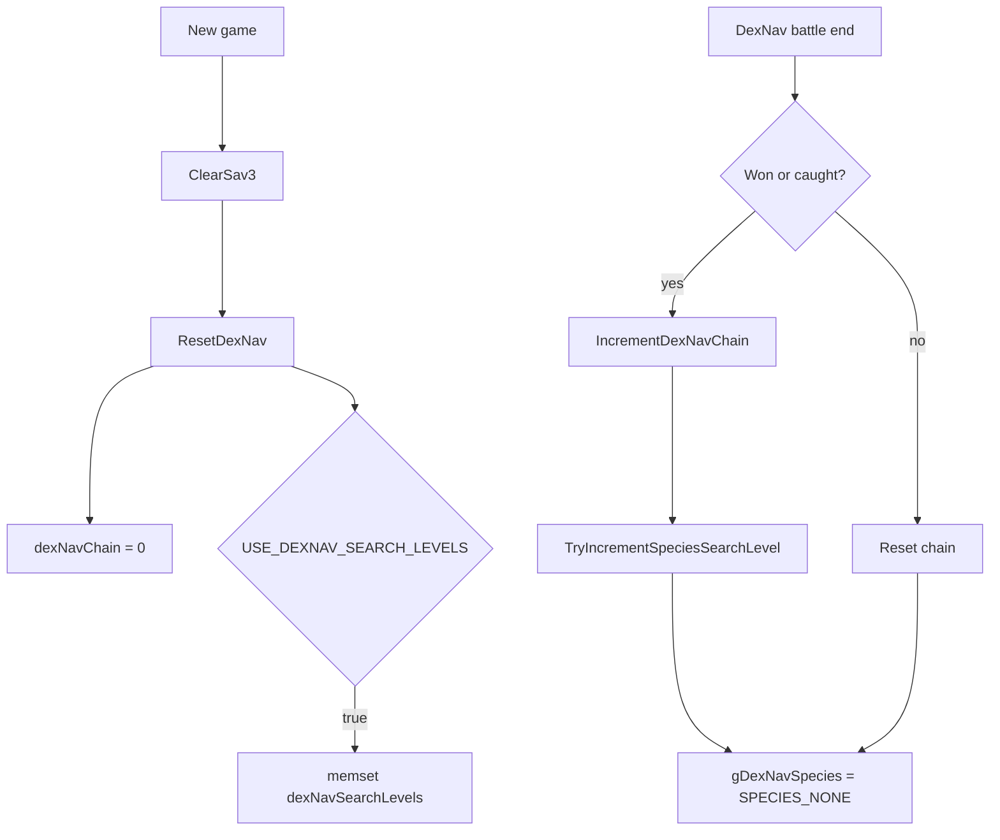

# Save Data Flow v15

調査日: 2026-05-02

この文書は SaveBlock1 / SaveBlock2 / SaveBlock3、flag / var、DexNav save field、option save field を整理する。現時点では実装・改造は行っていない。

## Purpose

- UI や DexNav、randomizer、独自 option、flag / var を追加する前に、どの save block に何が入るかを確認する。
- `USE_DEXNAV_SEARCH_LEVELS` のように config で save layout が変わる項目を追跡する。
- map script の `setflag` / `setvar` と C 側の save data の関係を明確にする。

## Key Files

| File | Important symbols / notes |
|---|---|
| `include/global.h` | `struct SaveBlock1`, `struct SaveBlock2`, `struct SaveBlock3`, `gSaveBlock1Ptr`, `gSaveBlock2Ptr`, `gSaveBlock3Ptr`。 |
| `include/save.h` | save sector constants。`SECTOR_DATA_SIZE`, `SAVE_BLOCK_3_CHUNK_SIZE`, `NUM_SECTORS_PER_SLOT`。 |
| `src/save.c` | save read/write、`STATIC_ASSERT(sizeof(struct SaveBlock3) <= ...)`, `SaveBlock3Size`, `CopyToSaveBlock3`, `CopyFromSaveBlock3`。 |
| `src/load_save.c` | `gSaveblock3`, `gSaveBlock3Ptr`, `ClearSav3`。 |
| `src/new_game.c` | new game 初期化。`ClearSav3`, `ResetDexNav`, `SetDefaultOptions`。 |
| `src/event_data.c` | `gSpecialVar_*`, `GetVarPointer`, `VarGet`, `VarSet`, `FlagSet`, `FlagClear`, `FlagGet`。 |
| `include/constants/flags.h` | saved flags / temp flags。 |
| `include/constants/vars.h` | saved vars / temp vars / special vars。 |
| `include/config/dexnav.h` | DexNav save / flag / var config。 |
| `include/config/summary_screen.h` | summary / move relearner flag config。 |

## Save Blocks

| Save block | Confirmed owner / examples |
|---|---|
| `struct SaveBlock1` | map state、flags、vars、object event templates、bag、player party など。詳細は `include/global.h`。 |
| `struct SaveBlock2` | player profile、options、Pokedex など。option menu はここへ保存する。 |
| `struct SaveBlock3` | expansion 用の小さい追加領域。fake RTC、NPC follower、item description flags、DexNav search levels、DexNav chain、apricorn tree など config で変わる。 |
| Pokemon storage | sector 5-13。PC box data。 |

`src/load_save.c` では `EWRAM_DATA struct SaveBlock3 gSaveblock3 = {};` と `IWRAM_INIT struct SaveBlock3 *gSaveBlock3Ptr = &gSaveblock3;` を確認した。SaveBlock3 は ASLR wrapper ではなく固定 pointer として扱われている。

## Save Sector Layout

`include/save.h`:

| Constant | Value | Meaning |
|---|---:|---|
| `SECTOR_DATA_SIZE` | `3968` | 通常 save data 部分。 |
| `SAVE_BLOCK_3_CHUNK_SIZE` | `116` | 各 sector に入る SaveBlock3 chunk。 |
| `SECTOR_FOOTER_SIZE` | `12` | footer。 |
| `NUM_SECTORS_PER_SLOT` | `14` | 通常 save slot の sector 数。 |

SaveBlock3 の最大容量は `116 * 14 = 1624` bytes。`include/global.h` にも `struct SaveBlock3` の comment として `max size 1624 bytes` がある。

`src/save.c` では以下を確認した。

- `STATIC_ASSERT(sizeof(struct SaveBlock3) <= SAVE_BLOCK_3_CHUNK_SIZE * NUM_SECTORS_PER_SLOT, SaveBlock3FreeSpace)`
- `SaveBlock3Size(sectorId)`
- `CopyToSaveBlock3(sectorId, sector)`
- `CopyFromSaveBlock3(sectorId, sector)`

`SaveBlock3Size()` は sector id ごとの 116 byte slice を計算し、`sizeof(gSaveblock3)` を超えないぶんだけ copy する。

## SaveBlock3 Fields

`include/global.h` の `struct SaveBlock3` は config により field が増減する。

| Field | Condition | Notes |
|---|---|---|
| `fakeRTC` | `OW_USE_FAKE_RTC` | fake RTC data。 |
| `NPCfollower` | `FNPC_ENABLE_NPC_FOLLOWERS` | follower state。 |
| `itemFlags[ITEM_FLAGS_COUNT]` | `OW_SHOW_ITEM_DESCRIPTIONS == OW_ITEM_DESCRIPTIONS_FIRST_TIME` | item description first-time 表示用。 |
| `dexNavSearchLevels[NUM_SPECIES]` | `USE_DEXNAV_SEARCH_LEVELS == TRUE` | DexNav species search level。1 species 1 byte。 |
| `dexNavChain` | always | DexNav chain。 |
| `apricornTrees[NUM_APRICORN_TREE_BYTES]` | `APRICORN_TREE_COUNT > 0` | apricorn tree state。 |

DexNav search levels は `NUM_SPECIES` byte を消費する。v15 系の species 数が増えるほど SaveBlock3 を圧迫するため、randomizer seed、独自 option、独自 unlock state を SaveBlock3 に追加する前に容量確認が必須。

## DexNav Save Flow

確認した symbols:

| Symbol | File | Role |
|---|---|---|
| `ResetDexNav` | `src/new_game.c` | new game 時の DexNav state 初期化。 |
| `gSaveBlock3Ptr->dexNavChain` | `include/global.h`, `src/dexnav.c` | chain bonus と reset。 |
| `gSaveBlock3Ptr->dexNavSearchLevels` | `include/global.h`, `src/dexnav.c` | `USE_DEXNAV_SEARCH_LEVELS == TRUE` のみ。 |
| `TryIncrementSpeciesSearchLevel` | `src/dexnav.c` | Battle Frontier 以外で search level を 255 まで増加。 |
| `CalculateDexNavShinyRolls` | `src/dexnav.c`, `src/pokemon.c` | shiny rolls に chain bonus を追加。 |

## Flags and Vars

script の flag / var は主に SaveBlock1 に保存される。

| Kind | Storage / behavior |
|---|---|
| Saved flags | `struct SaveBlock1.flags`。`FlagSet` / `FlagClear` / `FlagGet`。 |
| Saved vars | `struct SaveBlock1.vars`。`VarSet` / `VarGet`。 |
| Temp flags | `FLAG_TEMP_*`。`ClearTempFieldEventData()` で clear。 |
| Temp vars | `VAR_TEMP_*`。`ClearTempFieldEventData()` で clear。 |
| Special vars | `gSpecialVar_0x8000` から `gSpecialVar_Result`。C global で、永続 save ではない。 |

`src/event_data.c` の `GetVarPointer(id)`:

- `id < VARS_START` は var pointer なし。
- `VARS_START <= id < SPECIAL_VARS_START` は SaveBlock1 vars。
- special var は `gSpecialVars`。

`VarGet(id)` は pointer がない場合、`id` を literal として返す。この仕様は `map_script_2` や script compare の読み方に影響する。

DexNav config では `DN_VAR_SPECIES` と `DN_VAR_STEP_COUNTER` を saved var として割り当てる必要がある。0 のままでは `GetVarPointer(DN_VAR_STEP_COUNTER)` が NULL になり得るため、DexNav 有効化前に var id を決める。

## Option Save Fields

`src/option_menu.c` と `src/new_game.c` で確認した option save fields:

| SaveBlock2 field | Meaning |
|---|---|
| `optionsTextSpeed` | text speed。 |
| `optionsBattleSceneOff` | battle scene。 |
| `optionsBattleStyle` | shift / set。 |
| `optionsSound` | mono / stereo。 |
| `optionsButtonMode` | normal / LR / L=A。 |
| `optionsWindowFrameType` | frame。 |
| `regionMapZoom` | region map zoom。 |

`SetDefaultOptions()` では `optionsTextSpeed`、`optionsWindowFrameType`、`optionsSound`、`optionsBattleStyle`、`optionsBattleSceneOff`、`regionMapZoom` を確認した。`optionsButtonMode` の初期化箇所は追加調査対象。

独自 UI option を runtime で切り替える場合は、`include/global.h` の `struct SaveBlock2`、`src/option_menu.c`、`src/new_game.c`、save compatibility をまとめて扱う必要がある。

## Design Notes for Future Save Additions

| Candidate | Suggested first owner | Reason |
|---|---|---|
| DexNav species search levels | existing `SaveBlock3` field | 既存 config あり。ただし容量が大きい。 |
| DexNav grant / detector unlock | saved flags | `DN_FLAG_DEXNAV_GET` / `DN_FLAG_DETECTOR_MODE` として扱える。 |
| Randomizer seed | 未定 | SaveBlock3 か SaveBlock2 か、new game seed か runtime seed かを先に決める。 |
| Wild randomizer mode | 未定 | compile-time config か save option かで owner が変わる。 |
| Custom menu option | SaveBlock2 candidate | option menu と連動するなら SaveBlock2 が自然。ただし layout change risk あり。 |
| One-off map state | saved flag / var | map script で使うなら SaveBlock1 flags / vars。 |

## Risks

| Risk | Why |
|---|---|
| SaveBlock3 overflow | `USE_DEXNAV_SEARCH_LEVELS` だけで species 数分の byte を使う。追加 field と競合する。 |
| Save layout migration | `struct SaveBlock1/2/3` を変えると既存 save との互換性に影響する。 |
| Config-dependent struct layout | compile-time config の切り替えで `struct SaveBlock3` の field offset が変わる。 |
| Special var を save state と誤認 | `gSpecialVar_0x8004` などは一時 global であり、永続化されない。 |
| Temp var / temp flag の永続利用 | map load で clear されるため、story progress には不向き。 |

## Open Questions

- `optionsButtonMode` の初期値がどこで保証されるかは未確認。
- 既存 save migration のプロジェクト方針は未確認。SaveBlock 変更前に upstream docs / project rules を確認する。
- randomizer seed を SaveBlock3 に置くべきか SaveBlock2 に置くべきかは未決定。
- DexNav search level を有効化した場合の現 config 全体の SaveBlock3 使用量は build assert 以外の一覧化をまだしていない。
