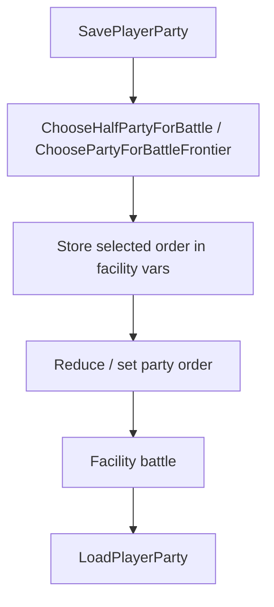

# Script `.inc` Audit v15

調査日: 2026-05-01

この文書は、battle selection、trainer battle、party save/restore、Battle Frontier / facility battle に関係する `.inc` script を整理する。

## Scope and Method

実施した確認:

- `data/scripts/*.inc` を全件列挙した。
- battle / trainer / party selection / save restore に関係する symbol を `data/scripts/**/*.inc` と `data/maps/**/*.inc` から検索した。
- 代表的な battle 関連 script は中身を読んだ。

注意:

- `data/maps/**/*.inc` は数が非常に多いため、今回の詳細確認は `trainerbattle_*`、`ChooseHalfPartyForBattle`、`ChoosePartyForBattleFrontier`、`SavePlayerParty`、`LoadPlayerParty`、facility battle command などの関連 symbol 起点で行った。
- 全 map script の全行レビューは未実施。必要であれば次回、map group 単位で line-by-line audit を行う。

## `data/scripts/*.inc` Inventory

確認した `data/scripts/*.inc`:

| File | Category / relevance |
|---|---|
| `data/scripts/trainer_battle.inc` | Core trainer battle flow。最重要。 |
| `data/scripts/trainer_script.inc` | Trainer post-battle script dispatch。最重要。 |
| `data/scripts/gabby_and_ty.inc` | Gabby & Ty double trainer battle sequence。 |
| `data/scripts/trainer_hill.inc` | Trainer Hill facility battle。 |
| `data/scripts/trainer_tower.inc` | Trainer Tower custom battle command。 |
| `data/scripts/battle_frontier.inc` | Battle Frontier support script。 |
| `data/scripts/cable_club.inc` | Link / cable club。`ChooseHalfPartyForBattle` 関連。 |
| `data/scripts/cable_club_frlg.inc` | FRLG cable club。 |
| `data/scripts/debug.inc` | Debug script。`SavePlayerParty` / `LoadPlayerParty` 使用を確認。 |
| `data/scripts/trainers_frlg.inc` | FRLG trainer scripts。多数の `trainerbattle_*`。 |
| `data/scripts/kecleon.inc` | `GetBattleOutcome` 使用。 |
| `data/scripts/battle_pike.inc` | Battle Pike support。 |
| `data/scripts/elite_four.inc` | Elite Four script。battle flow 関連の可能性。 |
| `data/scripts/pokemon_league.inc` | League / hall of fame 周辺。 |
| `data/scripts/static_pokemon.inc` | Static Pokémon battle。trainer battle ではない。 |
| `data/scripts/safari_zone.inc` | Safari。通常選出 feature では対象外候補。 |
| `data/scripts/field_move_scripts.inc` | Field move。 |
| `data/scripts/surf.inc` | Surf field script。 |
| `data/scripts/flash.inc` | Flash field script。 |
| `data/scripts/repel.inc` | Repel。 |
| `data/scripts/field_poison.inc` | Field poison。 |
| `data/scripts/pc.inc` | PC script。 |
| `data/scripts/pc_transfer.inc` | PC transfer。 |
| `data/scripts/pkmn_center_nurse.inc` | Pokémon Center nurse。 |
| `data/scripts/pkmn_center_nurse_frlg.inc` | FRLG nurse。 |
| `data/scripts/hall_of_fame.inc` | Hall of fame。 |
| `data/scripts/hall_of_fame_frlg.inc` | FRLG hall of fame。 |
| `data/scripts/contest_hall.inc` | Contest hall。 |
| `data/scripts/berry_blender.inc` | Berry blender。 |
| `data/scripts/roulette.inc` | Roulette。 |
| `data/scripts/day_care.inc` | Day care。 |
| `data/scripts/day_care_frlg.inc` | FRLG day care。 |
| `data/scripts/move_tutors.inc` | Move tutors。 |
| `data/scripts/move_tutors_frlg.inc` | FRLG move tutors。 |
| `data/scripts/move_relearner.inc` | Move relearner。 |
| `data/scripts/gift_trainer.inc` | Gift trainer。 |
| `data/scripts/gift_pichu.inc` | Gift Pichu。 |
| `data/scripts/gift_old_sea_map.inc` | Gift event。 |
| `data/scripts/gift_mystic_ticket.inc` | Gift event。 |
| `data/scripts/gift_aurora_ticket.inc` | Gift event。 |
| `data/scripts/gift_altering_cave.inc` | Gift event。 |
| `data/scripts/gift_battle_card.inc` | Gift event。 |
| `data/scripts/gift_stamp_card.inc` | Gift event。 |
| `data/scripts/item_ball_scripts.inc` | Item ball。 |
| `data/scripts/item_ball_scripts_frlg.inc` | FRLG item ball。 |
| `data/scripts/obtain_item.inc` | Item obtain。 |
| `data/scripts/movement.inc` | Shared movement scripts。 |
| `data/scripts/apricorn_tree.inc` | Apricorn tree。 |
| `data/scripts/berry_tree.inc` | Berry tree。 |
| `data/scripts/secret_base.inc` | Secret base。 |
| `data/scripts/shared_secret_base.inc` | Shared secret base。 |
| `data/scripts/secret_power_tm.inc` | Secret Power。 |
| `data/scripts/check_furniture.inc` | Furniture check。 |
| `data/scripts/mauville_man.inc` | Mauville man。 |
| `data/scripts/lilycove_lady.inc` | Lilycove lady。 |
| `data/scripts/interview.inc` | Interview。 |
| `data/scripts/tv.inc` | TV。 |
| `data/scripts/record_mix.inc` | Record mix。 |
| `data/scripts/profile_man.inc` | Profile man。 |
| `data/scripts/questionnaire.inc` | Questionnaire。 |
| `data/scripts/fame_checker_frlg.inc` | FRLG fame checker。 |
| `data/scripts/trainer_card_frlg.inc` | FRLG trainer card。 |
| `data/scripts/new_game.inc` | New game。 |
| `data/scripts/players_house.inc` | Player house。 |
| `data/scripts/abnormal_weather.inc` | Weather event。 |
| `data/scripts/cave_hole.inc` | Cave hole。 |
| `data/scripts/cave_of_origin.inc` | Cave of Origin。 |
| `data/scripts/pokemon_mansion.inc` | Pokémon Mansion。 |
| `data/scripts/route23.inc` | Route 23。 |
| `data/scripts/seagallop.inc` | Seagallop。 |
| `data/scripts/silphco_doors.inc` | Silph Co doors。 |
| `data/scripts/set_gym_trainers.inc` | Gym trainer flag/setup。 |
| `data/scripts/aide.inc` | Aide events。 |
| `data/scripts/prof_birch.inc` | Professor Birch events。 |
| `data/scripts/rival_graphics.inc` | Rival graphics。 |
| `data/scripts/follower.inc` | Follower support。 |
| `data/scripts/dexnav.inc` | DexNav support。 |
| `data/scripts/mystery_event_club.inc` | Mystery event club。 |
| `data/scripts/std_msgbox.inc` | Shared message box scripts。 |
| `data/scripts/test_signpost.inc` | Test signpost。 |
| `data/scripts/config.inc` | Script config. |
| `data/scripts/flavor_text.inc` | Flavor text. |
| `data/scripts/apprentice.inc` | Apprentice. |
| `data/scripts/pokedex_rating.inc` | Pokédex rating. |

## Battle-Related Symbol Count Scan

`trainerbattle`、`dotrainerbattle`、facility battle、party save/load、choose half、battle outcome 関連 symbol を検索した結果:

| File | Match count | Notes |
|---|---:|---|
| `data/scripts/trainers_frlg.inc` | 468 | FRLG trainer battle macro が集中。 |
| `data/scripts/gabby_and_ty.inc` | 12 | Gabby & Ty の `trainerbattle_double`。 |
| `data/scripts/cable_club.inc` | 5 | `SavePlayerParty` と `ChooseHalfPartyForBattle`。 |
| `data/scripts/cable_club_frlg.inc` | 5 | FRLG cable club の `SavePlayerParty` と `ChooseHalfPartyForBattle`。 |
| `data/scripts/debug.inc` | 2 | `SavePlayerParty` / `LoadPlayerParty`。 |
| `data/scripts/trainer_battle.inc` | 2 | `dotrainerbattle`。 |
| `data/scripts/trainer_hill.inc` | 1 | `facilitytrainerbattle`。 |
| `data/scripts/trainer_tower.inc` | 1 | `ttower_dobattle`。 |
| `data/scripts/kecleon.inc` | 1 | `GetBattleOutcome`。 |

`data/maps/**/*.inc` でも同じ symbol scan を行い、多数の trainerbattle / facility / party selection script を確認した。重要例は次の `Map Script Symbol Scan` に記録する。

## Future Expansion Script Scan

今回の追加調査で、マート設定、フィールド秘伝技廃止、TM/HM 関連変更に関係する `.inc` 入口も確認した。

### Pokemart Scripts

確認した入口:

| File | Confirmed symbols / behavior |
|---|---|
| `asm/macros/event.inc` | `pokemart products:req`, `pokemartlistend` macro。 |
| `data/script_cmd_table.inc` | `SCR_OP_POKEMART` が `ScrCmd_pokemart` へ dispatch される。 |
| `src/scrcmd.c` | `ScrCmd_pokemart` が `CreatePokemartMenu(ptr)` を呼び、`ScriptContext_Stop()` する。 |

代表的な map script:

| File | Confirmed symbols / notes |
|---|---|
| `data/maps/SlateportCity_Mart/scripts.inc` | `pokemart SlateportCity_Mart_Pokemart`, `pokemartlistend`。 |
| `data/maps/EverGrandeCity_PokemonLeague_1F/scripts.inc` | League shop。 |
| `data/maps/BattleFrontier_Mart/scripts.inc` | Battle Frontier mart。 |
| `data/maps/PetalburgCity_Mart/scripts.inc` | `PetalburgCity_Mart_Pokemart_Basic` と `PetalburgCity_Mart_Pokemart_Expanded`。 |
| `data/maps/OldaleTown_Mart/scripts.inc` | basic / expanded shop の例。 |
| `data/maps/RustboroCity_Mart/scripts.inc` | basic / expanded shop の例。 |
| `data/maps/LilycoveCity_DepartmentStore_2F/scripts.inc` | department store 複数 shop。 |
| `data/maps/LilycoveCity_DepartmentStore_3F/scripts.inc` | vitamins / stat boosters。 |
| `data/maps/LilycoveCity_DepartmentStore_4F/scripts.inc` | attack TMs / defense TMs。 |
| `data/maps/LilycoveCity_DepartmentStore_5F/scripts.inc` | 複数 shop list。 |
| `data/maps/SlateportCity/scripts.inc` | `SlateportCity_Pokemart_EnergyGuru`, `SlateportCity_Pokemart_PowerTMs`。 |
| `data/maps/TwoIsland_Frlg/scripts.inc` | expanded shop が段階的に存在。 |
| `data/maps/TrainerHill_Entrance/scripts.inc` | basic / expanded shop の例。 |

拡張時の注意:

- 品揃え固定変更は map script の item list が中心。
- 条件付き shop やランダム shop は、script list、`ScrCmd_pokemart`、`src/shop.c` の `SetShopItemsForSale` / `CreatePokemartMenu` / `Task_BuyMenu` を同時に見る。
- TM shop を増やす場合は `include/constants/tms_hms.h`、`include/item.h`、`src/item_menu.c`、`src/data/items.h` も影響範囲。

### Field Move / HM Scripts

確認した入口:

| File | Confirmed symbols / behavior |
|---|---|
| `asm/macros/event.inc` | `checkfieldmove fieldMove:req, checkUnlocked=FALSE` macro。 |
| `data/script_cmd_table.inc` | `SCR_OP_CHECKFIELDMOVE` が `ScrCmd_checkfieldmove` へ dispatch される。 |
| `src/scrcmd.c` | `ScrCmd_checkfieldmove` が `IsFieldMoveUnlocked` と party の move 所持を確認する。 |
| `data/scripts/field_move_scripts.inc` | Cut / Rock Smash / Strength / Waterfall / Dive / Defog / Rock Climb の共通 field move script。 |
| `data/scripts/surf.inc` | `EventScript_UseSurf` が `checkfieldmove FIELD_MOVE_SURF` を使用。 |
| `data/scripts/secret_base.inc` | `checkfieldmove FIELD_MOVE_SECRET_POWER` を使用。 |

重要 labels:

| Label | File | Notes |
|---|---|---|
| `EventScript_CutTree` | `data/scripts/field_move_scripts.inc` | `checkfieldmove FIELD_MOVE_CUT, TRUE`。 |
| `EventScript_RockSmash` | `data/scripts/field_move_scripts.inc` | `checkfieldmove FIELD_MOVE_ROCK_SMASH, TRUE`。 |
| `EventScript_StrengthBoulder` | `data/scripts/field_move_scripts.inc` | `checkfieldmove FIELD_MOVE_STRENGTH, TRUE`。 |
| `EventScript_UseWaterfall` | `data/scripts/field_move_scripts.inc` | `checkfieldmove FIELD_MOVE_WATERFALL`。 |
| `EventScript_UseDive` | `data/scripts/field_move_scripts.inc` | `checkfieldmove FIELD_MOVE_DIVE`。 |
| `EventScript_UseDiveUnderwater` | `data/scripts/field_move_scripts.inc` | `checkfieldmove FIELD_MOVE_DIVE`。 |
| `EventScript_UseDefog` | `data/scripts/field_move_scripts.inc` | script label は存在。config で有効化される field move と合わせて確認する。 |
| `EventScript_UseRockClimb` | `data/scripts/field_move_scripts.inc` | `checkfieldmove FIELD_MOVE_ROCK_CLIMB`。 |
| `EventScript_UseSurf` | `data/scripts/surf.inc` | `checkfieldmove FIELD_MOVE_SURF`。 |

拡張時の注意:

- 多くの map object は `data/maps/*/map.json` から `EventScript_CutTree`、`EventScript_RockSmash`、`EventScript_StrengthBoulder` などを参照する。`.inc` だけでなく map JSON も検索対象。
- フィールド秘伝技を不要にする場合、script の `checkfieldmove`、C 側の `ScrCmd_checkfieldmove`、party menu の `CursorCb_FieldMove`、`src/field_move.c` の `gFieldMoveInfo`、`src/pokemon.c` の `CannotForgetMove` を同時に見る。
- `checkUnlocked=TRUE` を使う script と使わない script があるため、badge / flag unlock と move 所持のどちらを外すかを分けて設計する。

## Core Trainer Battle Scripts

### `data/scripts/trainer_battle.inc`

重要 labels:

| Label | Role |
|---|---|
| `EventScript_StartTrainerApproach` | 視線検知後の接近開始。 |
| `EventScript_TryDoNormalTrainerBattle` | 通常 single trainer battle の入口。 |
| `EventScript_TryDoDoubleTrainerBattle` | double trainer battle の入口。 |
| `EventScript_ShowTrainerIntroMsg` | trainer intro speech 表示。 |
| `EventScript_DoTrainerBattle` | `dotrainerbattle` 実行と beaten script への遷移。 |
| `EventScript_DoNoIntroTrainerBattle` | no-intro trainer battle。 |
| `EventScript_TryDoRematchBattle` | rematch battle。 |

選出 UI を script 側で挟むなら、`EventScript_DoTrainerBattle` の `dotrainerbattle` 前が最も分かりやすい候補。ただし全 trainer battle に影響するため、facility / rematch / double / special mode の除外条件が必要になる。

### `data/scripts/trainer_script.inc`

重要 labels:

| Label | Role |
|---|---|
| `EventScript_TryGetTrainerScript` | beaten/post-battle trainer script を取る。 |
| `EventScript_GotoTrainerScript` | trainer script へ `goto`。 |
| `EventScript_ObjectApproachPlayer` | trainer object approach。 |

選出機能の直接差し込み箇所ではないが、battle 後 script へ戻る flow の確認対象。

## Special Trainer / Facility Scripts

| File | Confirmed symbols / behavior | Battle selection relevance |
|---|---|---|
| `data/scripts/gabby_and_ty.inc` | 複数の `trainerbattle_double`。Gabby / Ty の battle 後 interview flow。 | double trainer battle の特殊会話例。 |
| `data/scripts/trainer_hill.inc` | `facilitytrainerbattle FACILITY_BATTLE_TRAINER_HILL`。 | MVP では対象外候補。 |
| `data/scripts/trainer_tower.inc` | `ttower_dobattle`, `waitstate`, `VAR_RESULT` 分岐。single/double/knockout challenge flow。 | 通常 trainerbattle と別入口。MVP では対象外候補。 |
| `data/scripts/battle_frontier.inc` | Battle Frontier support。直接の battle start より補助処理中心。 | 既存選出 flow と競合するため対象外候補。 |
| `data/scripts/cable_club.inc` | `SavePlayerParty`, `ChooseHalfPartyForBattle` を使用。 | 既存 choose half 利用例。通常 battle feature では除外候補。 |
| `data/scripts/cable_club_frlg.inc` | FRLG cable club。 | Link 系のため除外候補。 |
| `data/scripts/debug.inc` | `SavePlayerParty`, `LoadPlayerParty` 使用。 | Debug 用。通常 feature とは分離。 |
| `data/scripts/kecleon.inc` | `specialvar VAR_RESULT, GetBattleOutcome`。 | battle outcome 参照例。 |
| `data/scripts/trainers_frlg.inc` | 多数の `trainerbattle_single`, `trainerbattle_double`, `trainerbattle_rematch`, `ShouldTryRematchBattle`。 | FRLG trainer script 集約。通常戦を広く変える場合は要注意。 |

## Map Script Symbol Scan

`data/maps/**/*.inc` で、battle selection に関係する symbol を検索した結果、以下の領域が重要。

| Area / Example file | Confirmed symbols | Notes |
|---|---|---|
| `data/maps/MossdeepCity_SpaceCenter_2F/scripts.inc` | `SavePlayerParty`, `ChooseHalfPartyForBattle`, `LoadPlayerParty`, `trainerbattle_no_intro` | Steven double battle 周辺。既存 choose half + party save/load 例。 |
| `data/maps/BattleFrontier_BattleDomeLobby/scripts.inc` | `SavePlayerParty`, `ChoosePartyForBattleFrontier`, `frontier_set FRONTIER_DATA_SELECTED_MON_ORDER`, `LoadPlayerParty` | Frontier 選出 flow。 |
| `data/maps/BattleFrontier_BattleDomePreBattleRoom/scripts.inc` | `ChoosePartyForBattleFrontier`, `dome_set DOME_DATA_SELECTED_MONS`, `dome_reduceparty`, `dome_setopponent` | Dome の party reduction / opponent setup。 |
| `data/maps/BattleFrontier_BattleArenaLobby/scripts.inc` | `ChoosePartyForBattleFrontier`, `SavePlayerParty`, `LoadPlayerParty` | Frontier facility。 |
| `data/maps/BattleFrontier_BattlePalaceLobby/scripts.inc` | `ChoosePartyForBattleFrontier`, `SavePlayerParty`, `LoadPlayerParty` | Frontier facility。 |
| `data/maps/BattleFrontier_BattlePikeLobby/scripts.inc` | `ChoosePartyForBattleFrontier`, `SavePlayerParty`, `LoadPlayerParty` | Frontier facility。 |
| `data/maps/BattleFrontier_BattlePyramidLobby/scripts.inc` | `ChoosePartyForBattleFrontier`, `SavePlayerParty`, `LoadPlayerParty` | Frontier facility。 |
| `data/maps/BattleFrontier_BattleTowerLobby/scripts.inc` | `ChoosePartyForBattleFrontier`, `frontier_setpartyorder`, `SavePlayerParty`, `LoadPlayerParty` | Frontier facility。 |
| `data/maps/FallarborTown_BattleTentLobby/scripts.inc` | `ChoosePartyForBattleFrontier`, `SavePlayerParty`, `LoadPlayerParty` | Battle Tent。 |
| `data/maps/VerdanturfTown_BattleTentLobby/scripts.inc` | `ChoosePartyForBattleFrontier`, `SavePlayerParty`, `LoadPlayerParty` | Battle Tent。 |
| `data/maps/SevenIsland_House_Room1_Frlg/scripts.inc` | `SavePlayerParty`, `ChooseHalfPartyForBattle`, `LoadPlayerParty` | FRLG special battle/selection 例。 |
| `data/maps/SevenIsland_House_Room2_Frlg/scripts.inc` | `SavePlayerParty`, `ChooseHalfPartyForBattle`, `LoadPlayerParty` | FRLG special battle/selection 例。 |
| `data/maps/SootopolisCity_MysteryEventsHouse_1F/scripts.inc` | `SavePlayerParty`, `ChooseHalfPartyForBattle`, `LoadPlayerParty` | Mystery event house。 |
| `data/maps/SootopolisCity_MysteryEventsHouse_B1F/scripts.inc` | `SavePlayerParty`, `ChooseHalfPartyForBattle`, `LoadPlayerParty` | Mystery event house。 |
| `data/maps/PetalburgCity/scripts.inc` | `SavePlayerParty`, `LoadPlayerParty` | Party temporary save/restore 例。 |

Facility battle command examples:

| Command / symbol | Seen in | Notes |
|---|---|---|
| `dofacilitytrainerbattle` | Battle Frontier / Battle Tent battle rooms | 通常 `dotrainerbattle` と別入口。 |
| `facilitytrainerbattle` | `data/scripts/trainer_hill.inc` | Trainer Hill。 |
| `ttower_dobattle` | `data/scripts/trainer_tower.inc` | Trainer Tower。 |
| `frontier_setpartyorder` | Battle Frontier scripts | Frontier selected party order 反映。 |
| `dome_reduceparty` | Battle Dome scripts | Dome-specific party reduction。 |

## Existing Save / Choose / Load Pattern

代表的な pattern:

この pattern は Frontier / link / special battle では有用だが、通常 trainer battle 前選出でそのまま使うと、battle 後の HP/status/PP/EXP/move order 反映を失う可能性がある。

## Battle Selection Impact

| Topic | Notes |
|---|---|
| Normal trainer battles | `data/scripts/trainer_battle.inc` が共通入口。script 側差し込みは強力だが影響範囲が広い。 |
| FRLG trainers | `data/scripts/trainers_frlg.inc` に大量の trainerbattle macro がある。global flow を変える方が局所修正より追従しやすい可能性。 |
| Facility battles | Frontier / Hill / Tower は通常 trainer battle と入口が違うため MVP では除外候補。 |
| Existing choose half users | Cable club、Battle Frontier、special map scripts が既に使っているため、`ChooseHalfPartyForBattle` の仕様変更は危険。 |
| Script vars | `VAR_RESULT`, `VAR_0x8004`, `VAR_0x8005` は既存 scripts で多用される。選出 feature の独自 state は special vars だけに依存しない方が安全。 |

## Open Questions

- `data/maps/**/*.inc` の全行レビューを行う場合、どの map group から優先するか未決定。
- FRLG trainer scripts を通常選出 feature の対象に含めるか未決定。
- Battle Frontier / Battle Tent / Trainer Hill / Trainer Tower は最初から明示除外するか、将来個別対応するか未決定。
- 既存 `SavePlayerParty` / `LoadPlayerParty` 使用箇所と同じ save buffer を通常選出 feature が使ってよいか未決定。現時点では専用 buffer が安全と思われるが未実装。
