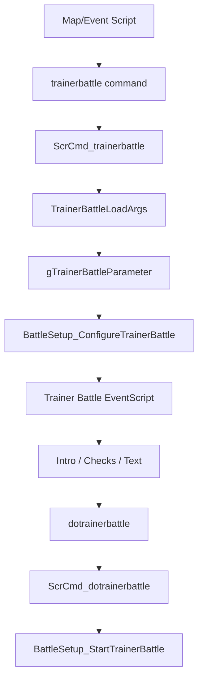
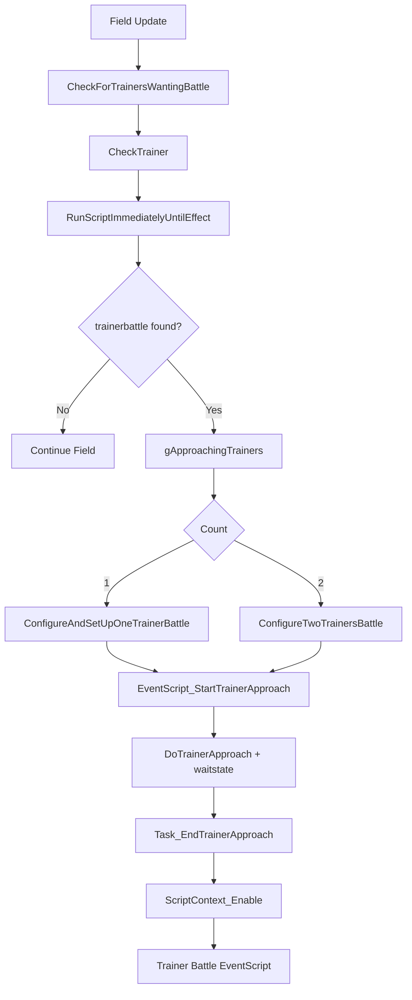

# Trainer Battle Flow v15

## Purpose

通常 trainer battle が、event script / trainer 視線検知 / battle setup / battle start へどのように接続されているかを整理する。

将来の「トレーナーバトル前選出」は、この flow のうち `gTrainerBattleParameter` が確定した後、実際に battle が始まる前へ差し込む想定になる。

## Key Files

| File | Role |
|---|---|
| `asm/macros/event.inc` | `trainerbattle` macro と関連 macro |
| `include/battle_setup.h` | `TrainerBattleParameter`、`TRAINER_BATTLE_PARAM` |
| `include/constants/battle_setup.h` | trainer battle mode constants |
| `src/scrcmd.c` | `ScrCmd_trainerbattle`、`ScrCmd_dotrainerbattle` |
| `src/battle_setup.c` | trainer battle args load、設定、開始、終了 callback |
| `src/trainer_see.c` | field 上の trainer 検知、接近処理 |
| `include/trainer_see.h` | `struct ApproachingTrainer`、approaching trainer globals |
| `data/scripts/trainer_battle.inc` | trainer battle 用 event script |
| `data/scripts/trainer_script.inc` | trainer beaten script 取得 |
| `include/constants/battle.h` | `BATTLE_TYPE_*` flags |
| `src/battle_main.c` | battle 初期化、enemy party 作成 |

## Script Macro to Battle Setup

`asm/macros/event.inc` の `trainerbattle` macro は、`SCR_OP_TRAINERBATTLE` と `TrainerBattleParameter` 相当の byte列を script へ出力する。

確認済みの convenience macro:

| Macro | Intended Mode |
|---|---|
| `trainerbattle_single` | 通常 single |
| `trainerbattle_double` | double |
| `trainerbattle_rematch` | rematch single |
| `trainerbattle_rematch_double` | rematch double |
| `trainerbattle_no_intro` | intro なし |
| `trainerbattle_two_trainers` | 2 人 trainer |
| `trainerbattle_earlyrival` | early rival |
| `dotrainerbattle` | battle 開始 command |
| `gotopostbattlescript` | post battle script へ移動 |
| `gotobeatenscript` | beaten script へ移動 |

`ScrCmd_trainerbattle` は `TrainerBattleLoadArgs` でこの data を `gTrainerBattleParameter` へ読み込み、`BattleSetup_ConfigureTrainerBattle` で script pointer を trainer battle 用 script へ差し替える。

## TrainerBattleParameter

`include/battle_setup.h` の `TrainerBattleParameter` は `union PACKED` で、先頭 byte に bitfield、続いて trainer script 用 parameter が並ぶ。

| Field | Notes |
|---|---|
| `isDoubleBattle` | macro flags の bit 0 |
| `isRematch` | macro flags の bit 1 |
| `playMusicA` | trainer A encounter music |
| `playMusicB` | trainer B encounter music |
| `mode` | `TRAINER_BATTLE_*` mode |
| `objEventLocalIdA` | trainer A local object id |
| `opponentA` | trainer A id |
| `introTextA` | trainer A intro text |
| `defeatTextA` | trainer A defeat text |
| `battleScriptRetAddrA` | trainer A beaten/post battle script addr |
| `objEventLocalIdB` | trainer B local object id |
| `opponentB` | trainer B id |
| `introTextB` | trainer B intro text |
| `defeatTextB` | trainer B defeat text |
| `battleScriptRetAddrB` | trainer B beaten/post battle script addr |
| `victoryText` | victory text |
| `cannotBattleText` | double battle 不可時などの text |
| `rivalBattleFlags` | early rival 用 flags |

`data/event_scripts.s` では `VAR_TRAINER_BATTLE_OPPONENT_A` が `gTrainerBattleParameter.params.opponentA` へ alias されている。

## Trainer Battle Modes

`include/constants/battle_setup.h` で確認した mode:

| Constant | Value | Notes |
|---|---:|---|
| `TRAINER_BATTLE_SINGLE` | `0` | 通常 single |
| `TRAINER_BATTLE_CONTINUE_SCRIPT_NO_MUSIC` | `1` | script continue、music なし |
| `TRAINER_BATTLE_CONTINUE_SCRIPT` | `2` | script continue |
| `TRAINER_BATTLE_SINGLE_NO_INTRO_TEXT` | `3` | intro text なし |
| `TRAINER_BATTLE_DOUBLE` | `4` | double |
| `TRAINER_BATTLE_REMATCH` | `5` | rematch |
| `TRAINER_BATTLE_CONTINUE_SCRIPT_DOUBLE` | `6` | double continue |
| `TRAINER_BATTLE_REMATCH_DOUBLE` | `7` | rematch double |
| `TRAINER_BATTLE_CONTINUE_SCRIPT_DOUBLE_NO_MUSIC` | `8` | double continue、music なし |
| `TRAINER_BATTLE_TWO_TRAINERS_NO_INTRO` | `13` | 2 人 trainer |
| `TRAINER_BATTLE_EARLY_RIVAL` | `14` | early rival |

## Manual Script Flow

map script などから直接 `trainerbattle` command が実行される場合:

`BattleSetup_ConfigureTrainerBattle` は mode に応じて以下のような script へ進める。

| Mode | Example Target Script |
|---|---|
| `TRAINER_BATTLE_SINGLE` | `EventScript_TryDoNormalTrainerBattle` |
| `TRAINER_BATTLE_DOUBLE` | `EventScript_TryDoDoubleTrainerBattle` |
| `TRAINER_BATTLE_SINGLE_NO_INTRO_TEXT` | `EventScript_DoNoIntroTrainerBattle` |
| continue script 系 | continue 用 normal/double script |
| two trainers | no intro 系 script、`gNoOfApproachingTrainers = 2` |

## Trainer See Flow

field 上で trainer が player を見つける場合、`src/trainer_see.c` が先に動く。

確認済みの流れ:

1. `CheckForTrainersWantingBattle` が visible object events を走査する。
2. `CheckTrainer` が trainer script を取得し、`RunScriptImmediatelyUntilEffect(... SCREFF_TRAINERBATTLE, trainerBattlePtr, &ctx)` で trainer battle command を検出する。
3. 対象 trainer を `gApproachingTrainers[gNoOfApproachingTrainers]` へ登録する。
4. 1 人なら `ConfigureAndSetUpOneTrainerBattle` を呼ぶ。
5. 2 人なら `ConfigureTwoTrainersBattle` と `SetUpTwoTrainersBattle` を使う。
6. `ScriptContext_SetupScript(EventScript_StartTrainerApproach)` で接近 script を開始する。
7. `EventScript_StartTrainerApproach` から `special DoTrainerApproach`、`waitstate` へ進む。
8. trainer 接近 task 完了時に `ScriptContext_Enable()` で再開する。

## EventScript Trainer Battle Flow

`data/scripts/trainer_battle.inc` の通常 flow:

| Script | Key Commands / Specials |
|---|---|
| `EventScript_StartTrainerApproach` | `selectapproachingtrainer`、`lockfortrainer`、`special PlayTrainerEncounterMusic`、`special DoTrainerApproach`、`waitstate` |
| `EventScript_TryDoNormalTrainerBattle` | `specialvar VAR_RESULT, GetTrainerFlag`、既戦闘なら `gotopostbattlescript` |
| `EventScript_TryDoDoubleTrainerBattle` | `special HasEnoughMonsForDoubleBattle`、不足時は cannot battle text |
| `EventScript_ShowTrainerIntroMsg` | `special ShowTrainerIntroSpeech`、`special TryPrepareSecondApproachingTrainer` |
| `EventScript_DoTrainerBattle` | `dotrainerbattle`、`specialvar VAR_RESULT, GetTrainerBattleMode`、`gotobeatenscript` |
| `EventScript_DoNoIntroTrainerBattle` | `dotrainerbattle`、`gotopostbattlescript` |

## BattleSetup_StartTrainerBattle

`src/battle_setup.c` の `BattleSetup_StartTrainerBattle` は `gBattleTypeFlags` を設定してから `DoTrainerBattle()` へ進める。

確認済みの主な分岐:

| Condition | Battle Flags |
|---|---|
| two trainers + follower partner | `BATTLE_TYPE_MULTI \| BATTLE_TYPE_DOUBLE \| BATTLE_TYPE_INGAME_PARTNER \| BATTLE_TYPE_TWO_OPPONENTS \| BATTLE_TYPE_TRAINER` |
| two trainers only | `BATTLE_TYPE_DOUBLE \| BATTLE_TYPE_TWO_OPPONENTS \| BATTLE_TYPE_TRAINER` |
| follower partner + one trainer | `BATTLE_TYPE_MULTI \| BATTLE_TYPE_INGAME_PARTNER \| BATTLE_TYPE_DOUBLE \| BATTLE_TYPE_TRAINER` |
| normal | `BATTLE_TYPE_TRAINER` |
| early rival tutorial | adds `BATTLE_TYPE_FIRST_BATTLE` |
| trainer party type doubles | adds `BATTLE_TYPE_DOUBLE` |

その後:

- `gMain.savedCallback = CB2_EndTrainerBattle`
- `DoTrainerBattle()`
- `ScriptContext_Stop()`

`DoTrainerBattle()` は `CreateBattleStartTask(GetTrainerBattleTransition(), 0)` を呼ぶ。

## Post-Battle Script Selection

| Function | Role |
|---|---|
| `BattleSetup_GetScriptAddrAfterBattle` | `sTrainerBattleEndScript` を返す |
| `BattleSetup_GetTrainerPostBattleScript` | `battleScriptRetAddrA/B` または `EventScript_TryGetTrainerScript` を返す |
| `ScrCmd_gotopostbattlescript` | script pointer を post battle script へ移す |
| `ScrCmd_gotobeatenscript` | script pointer を beaten script へ移す |

`CB2_EndTrainerBattle` は battle outcome に応じて whiteout / return to field / trainer flags / Match Call 登録などを行う。

## Insertion Candidates for Battle Selection

実装候補として考えられる差し込み位置:

| Candidate | Pros | Risks |
|---|---|---|
| `EventScript_DoTrainerBattle` の `dotrainerbattle` 前 | script の async UI と相性が良い | global trainer battle scripts 変更になる。すべての trainer mode への影響が大きい |
| `ScrCmd_dotrainerbattle` 内で選出状態を確認 | C 側で共通化しやすい | `waitstate` / callback chain を新規に設計する必要がある |
| `BattleSetup_StartTrainerBattle` 直前 | `gBattleTypeFlags` 判定直前で trainer 情報が揃う | 既に script command handler 内なので UI 遷移を挟むには工夫が必要 |
| trainer battle 専用の新 special を script に挿入 | 既存 `ChooseHalfPartyForBattle` pattern を流用しやすい | trainer battle mode ごとに script 変更が必要 |

現時点では実装しない。まずは通常 single/double のみを MVP 対象にし、two trainers、follower partner、Frontier、link/cable club は明示的に除外または別調査にするのが安全。

## Open Questions

- `BattleSetup_ConfigureTrainerBattle` の全 mode について、選出 UI を挟んでよいか未確認。
- `GetTrainerBattleType(TRAINER_BATTLE_PARAM.opponentA) == TRAINER_BATTLE_TYPE_DOUBLES` が double 判定へ関与するため、選出数 3/4 の決定タイミングは追加設計が必要。
- two trainers / multi / follower partner と独自選出を同時に扱うかは未決定。
- trainer rematch、continue script、no intro mode の post-battle script 挙動に選出 callback を挟んだ場合の影響は未検証。
