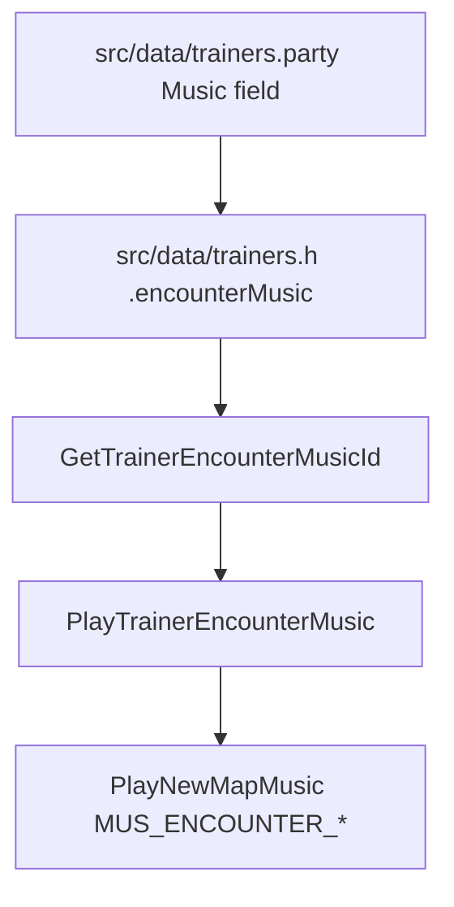
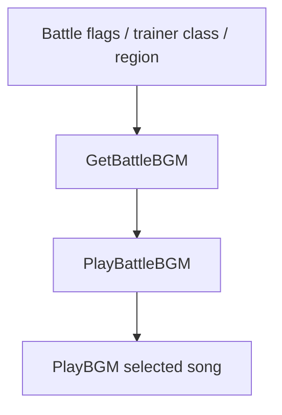

# Trainer Battle Reward And Audio Flow v15

## Document Metadata

| Field | Value |
|---|---|
| Last reviewed | 2026-05-17 |
| Baseline | `master` `b724a58874`; `git describe` = `expansion/1.15.2-58-gb724a58874` |
| Code status | Docs-only investigation |
| Provenance | Read-only source search on `master` |

## Purpose

This note answers where normal trainer battle reward money, encounter music,
battle BGM, victory BGM, mugshot transition, and related trainer presentation
metadata are decided.

It is not a runtime implementation plan. Use it as an entry point before editing
trainer data, battle reward logic, or trainer battle audio rules.

## Quick Answer

| Question | Primary owner | Notes |
|---|---|---|
| Which trainer class/name/pic/music does a trainer use? | `src/data/trainers.party` | Canonical source for normal trainer entries. `src/data/trainers.h` is generated from this file. |
| Where is trainer class payout set? | `src/battle_main.c`, `gTrainerClasses` | The second initializer field is the class money factor. Missing values fall back to 5 in reward calculation. |
| Where is win reward calculated? | `src/battle_script_commands.c`, `GetTrainerMoneyToGive` / `Cmd_getmoneyreward` | Called by `getmoneyreward` in `data/battle_scripts_1.s`. |
| Where is encounter music decided before the intro text? | `src/battle_setup.c`, `PlayTrainerEncounterMusic` | Reads each trainer's `Music:` / `.encounterMusic` field and maps it to `MUS_ENCOUNTER_*`. |
| Where is the actual battle BGM decided? | `src/pokemon.c`, `GetBattleBGM` | Uses battle flags, region, legendary species, and trainer class. |
| Where is victory BGM decided? | `src/battle_main.c`, `HandleEndTurn_BattleWon` | Trainer class decides League / Aqua-Magma / Gym Leader / normal victory music. |
| Where are mugshot transitions decided? | `src/battle_setup.c`, `GetTrainerBattleTransition`; `src/data/trainers.party`, `Mugshot:` | Any nonzero mugshot color makes the transition `B_TRANSITION_MUGSHOT`. |
| Where are Leader / Champion battle backgrounds decided? | `src/battle_bg.c` | `TRAINER_CLASS_LEADER` and `TRAINER_CLASS_CHAMPION` use battle environment overrides. |

## Canonical Trainer Data

Normal trainer records are authored in `src/data/trainers.party`.

`src/data/trainers.h` has a header comment saying it is auto-generated from
`src/data/trainers.party`; do not hand-edit the generated file for normal
trainer changes.

Useful `trainers.party` header fields:

| Field | Runtime output / use |
|---|---|
| `Name:` | `.trainerName`, shown in battle text and trainer identity paths. |
| `Class:` | `.trainerClass`, used for reward money factor lookup, battle BGM class switch, victory BGM class switch, some battle backgrounds, friendship league battle checks, and text class names. |
| `Pic:` | `.trainerPic`, used by trainer slide / battle intro presentation. |
| `Gender:` | `.gender`, used by trainer metadata and presentation paths. |
| `Music:` | `.encounterMusic`, used by `PlayTrainerEncounterMusic` before the trainer intro text. |
| `Items:` | `.items`, trainer item list for battle. |
| `Double Battle:` | `.battleType`, affects battle setup and money formula. |
| `Mugshot:` | `.mugshotColor`, enables the mugshot transition and selects mugshot palette color. |
| Pokemon order / levels | The last materialized party mon level affects normal trainer prize money. |

Example from `src/data/trainers.party`:

```text
=== TRAINER_DRAKE ===
Name: DRAKE
Class: Elite Four
Pic: Elite Four Drake
Gender: Male
Music: Elite Four
Items: Full Restore / Full Restore
Double Battle: No
AI: Basic Trainer
Mugshot: Blue
```

This becomes a generated `src/data/trainers.h` record with
`TRAINER_CLASS_ELITE_FOUR`, `TRAINER_ENCOUNTER_MUSIC_ELITE_FOUR`, and
`MUGSHOT_COLOR_BLUE`.

## Trainer Class Data

Trainer class constants live in `include/constants/trainers.h`.

Class display name, money factor, and Gen 7+ trainer-class Poke Ball defaults
live in `src/battle_main.c`:

```c
// [TRAINER_CLASS_XYZ] = { _("name"), <money=5>, <ball=BALL_POKE> }
const struct TrainerClass gTrainerClasses[TRAINER_CLASS_COUNT] =
```

`include/data.h` defines the relevant structure:

```c
struct TrainerClass
{
    u8 name[13];
    u8 money;
    u16 ball;
};
```

Changing `gTrainerClasses[TRAINER_CLASS_*].money` changes prize money for every
trainer using that class. It does not directly change the trainer's party,
intro text, encounter music, battle BGM, or victory BGM.

## Prize Money Flow

The battle scripts call `getmoneyreward` after a local trainer win and on
whiteout / loss paths:

| File | Role |
|---|---|
| `data/battle_scripts_1.s` | Calls `getmoneyreward` before `STRINGID_PLAYERGOTMONEY` and whiteout money text. |
| `asm/macros/battle_script.inc` | Maps `getmoneyreward` to `BS_GETMONEYREWARD`. |
| `src/battle_script_commands.c` | Implements `GetTrainerMoneyToGive` and `Cmd_getmoneyreward`. |
| `src/battle_main.c` | Initializes `gBattleStruct->moneyMultiplier = 1`. |
| `src/battle_hold_effects.c` | Doubles reward once for prize-money held item effects. |
| `src/battle_script_commands.c` | Doubles reward once for Happy Hour / equivalent move multiplier and gives Pay Day money. |

Current win reward formula:

```text
secret base:
    20 * firstSecretBaseMonLevel * moneyMultiplier

normal trainer:
    4 * lastTrainerMonLevel * moneyMultiplier * trainerClassMoney

single trainer double battle:
    4 * lastTrainerMonLevel * moneyMultiplier * 2 * trainerClassMoney

two separate opponents:
    reward(opponentA) + reward(opponentB)
```

Important details:

- `lastTrainerMonLevel` comes from the last materialized party entry:
  `party[GetTrainerPartySizeFromId(trainerId) - 1].lvl`.
- `trainerClassMoney` is `gTrainerClasses[GetTrainerClassFromId(trainerId)].money`.
- If the trainer class money field is zero / missing, the reward code falls
  back to `5`.
- `moneyMultiplier` starts at `1`, then can be multiplied by item or move
  effects before the reward is paid.
- Pay Day / Make It Rain style money is handled separately by
  `Cmd_givepaydaymoney`, then multiplied by the same `moneyMultiplier`.

## Encounter Music Flow

Encounter music is the short pre-battle cue used before or during the trainer
intro. It is not the battle BGM.

Flow:



Key files:

| File | Role |
|---|---|
| `include/constants/trainers.h` | Defines `TRAINER_ENCOUNTER_MUSIC_*` IDs. |
| `src/pokemon.c` | `GetTrainerEncounterMusicId`; uses normal trainer data, Battle Pyramid, or Trainer Hill lookups. |
| `src/battle_setup.c` | `PlayTrainerEncounterMusic`; maps encounter music IDs to `MUS_ENCOUNTER_*`. |
| `data/scripts/trainer_battle.inc` | Calls `special PlayTrainerEncounterMusic` before trainer intro / approach flows. |
| `asm/macros/event.inc` | `trainerbattle_*` macros can use no-music continue modes. |

Current encounter music ID to song mapping in `PlayTrainerEncounterMusic`:

| Encounter ID | Song |
|---|---|
| `TRAINER_ENCOUNTER_MUSIC_MALE` | `MUS_ENCOUNTER_MALE` |
| `TRAINER_ENCOUNTER_MUSIC_FEMALE` | `MUS_ENCOUNTER_FEMALE` |
| `TRAINER_ENCOUNTER_MUSIC_GIRL` | `MUS_ENCOUNTER_GIRL` |
| `TRAINER_ENCOUNTER_MUSIC_INTENSE` | `MUS_ENCOUNTER_INTENSE` |
| `TRAINER_ENCOUNTER_MUSIC_COOL` | `MUS_ENCOUNTER_COOL` |
| `TRAINER_ENCOUNTER_MUSIC_AQUA` | `MUS_ENCOUNTER_AQUA` |
| `TRAINER_ENCOUNTER_MUSIC_MAGMA` | `MUS_ENCOUNTER_MAGMA` |
| `TRAINER_ENCOUNTER_MUSIC_SWIMMER` | `MUS_ENCOUNTER_SWIMMER` |
| `TRAINER_ENCOUNTER_MUSIC_TWINS` | `MUS_ENCOUNTER_TWINS` |
| `TRAINER_ENCOUNTER_MUSIC_ELITE_FOUR` | `MUS_ENCOUNTER_ELITE_FOUR` |
| `TRAINER_ENCOUNTER_MUSIC_HIKER` | `MUS_ENCOUNTER_HIKER` |
| `TRAINER_ENCOUNTER_MUSIC_INTERVIEWER` | `MUS_ENCOUNTER_INTERVIEWER` |
| `TRAINER_ENCOUNTER_MUSIC_RICH` | `MUS_ENCOUNTER_RICH` |
| default | `MUS_ENCOUNTER_SUSPICIOUS` |

No-music trainer battle modes:

| Mode | Use |
|---|---|
| `TRAINER_BATTLE_CONTINUE_SCRIPT_NO_MUSIC` | Continue-script single battle with encounter music suppressed. |
| `TRAINER_BATTLE_CONTINUE_SCRIPT_DOUBLE_NO_MUSIC` | Continue-script double battle with encounter music suppressed. |

Source note: `asm/macros/event.inc` has separate `playMusicA` / `playMusicB`
flags in `TrainerBattleParameter`. A read-only search found a suspicious
spelling mismatch around the `playMusicB` macro flag assignment. Do not rely on
custom second-trainer encounter music behavior until this is verified in a
runtime branch.

## Battle BGM Flow

Battle BGM is selected when battle music starts:



`src/pokemon.c`, `GetBattleBGM`, has the main switch:

| Condition | Song |
|---|---|
| Legendary Rayquaza | `MUS_VS_RAYQUAZA` |
| Legendary Kyogre / Groudon | `MUS_VS_KYOGRE_GROUDON` |
| Regi family | `MUS_VS_REGI` |
| Other legendary | `MUS_RG_VS_LEGEND` |
| Link / recorded link | `MUS_VS_TRAINER` |
| Aqua / Magma leaders | `MUS_VS_AQUA_MAGMA_LEADER` |
| Aqua / Magma grunts and admins | `MUS_VS_AQUA_MAGMA` |
| Hoenn Gym Leader | `MUS_VS_GYM_LEADER` |
| Hoenn Champion | `MUS_VS_CHAMPION` |
| Rival | `MUS_VS_RIVAL`, except Wally routes to normal trainer |
| Hoenn Elite Four | `MUS_VS_ELITE_FOUR` |
| FRLG Champion | `MUS_RG_VS_CHAMPION` |
| FRLG Leader / Elite Four | `MUS_RG_VS_GYM_LEADER` |
| Frontier Brain classes | `MUS_VS_FRONTIER_BRAIN` |
| Other Kanto trainer | `MUS_RG_VS_TRAINER` |
| Other Hoenn trainer | `MUS_VS_TRAINER` |
| Kanto wild | `MUS_RG_VS_WILD` |
| Hoenn wild | `MUS_VS_WILD` |

Changing a trainer's `Music:` field will not change this battle BGM. To change
the battle BGM category, either change the trainer class or edit the class
switch in `GetBattleBGM` in a runtime branch.

## Victory BGM Flow

Trainer victory music is selected in `src/battle_main.c`,
`HandleEndTurn_BattleWon`.

| Condition | Song |
|---|---|
| Frontier / Trainer Hill / e-Reader trainer, Frontier Brain | `MUS_VICTORY_GYM_LEADER` |
| Frontier / Trainer Hill / e-Reader trainer, normal | `MUS_VICTORY_TRAINER` |
| Hoenn Elite Four / Champion | `MUS_VICTORY_LEAGUE` |
| Aqua / Magma classes | `MUS_VICTORY_AQUA_MAGMA` |
| Hoenn Gym Leader | `MUS_VICTORY_GYM_LEADER` |
| Other local trainer | `MUS_VICTORY_TRAINER` |

There is also a battle script command `playtrainerdefeatedmusic` that calls
`BS_PlayTrainerDefeatedMusic`, currently playing `MUS_VICTORY_TRAINER`. The
observed normal local trainer win path uses `HandleEndTurn_BattleWon` for the
class-specific victory music and then proceeds through `BattleScript_LocalTrainerBattleWon`.

## Transition And Battle Background Presentation

Trainer class and per-trainer mugshot data also affect presentation:

| Presentation | Source |
|---|---|
| Mugshot transition | `GetTrainerBattleTransition` returns `B_TRANSITION_MUGSHOT` if `DoesTrainerHaveMugshot(trainerId)` is true. |
| Mugshot color | `src/data/trainers.party` `Mugshot:` -> `.mugshotColor`; palette loaded in `src/battle_transition.c`. |
| Magma / Aqua transitions | `GetTrainerBattleTransition` returns `B_TRANSITION_MAGMA` or `B_TRANSITION_AQUA` for matching classes. |
| Other trainer transitions | `GetBattleTransitionTypeByMap`, enemy level sum, and player level sum select normal trainer transition variants. |
| Leader / Champion battle environment | `src/battle_bg.c` returns `BATTLE_ENVIRONMENT_LEADER` or `BATTLE_ENVIRONMENT_CHAMPION` for Hoenn `TRAINER_CLASS_LEADER` / `TRAINER_CLASS_CHAMPION`. |

## Map And Script Music

Map background music is separate from trainer battle music.

| Source | Role |
|---|---|
| `data/maps/*/map.json`, `music` field | Default map music, e.g. Pokemon League rooms using `MUS_VICTORY_ROAD`. |
| `data/script_cmd_table.inc` | Defines script commands such as `playbgm`, `savebgm`, `fadedefaultbgm`, `fadenewbgm`, `fadeoutbgm`, and `fadeinbgm`. |
| `data/maps/*/scripts.inc` | Can embed script-level BGM changes or text tokens such as `{PLAY_BGM}`. |

These map/script music controls are not prize money controls and do not change
the trainer battle BGM selected by `GetBattleBGM`.

## Editing Guidance

| Desired change | Safer first edit target | Notes |
|---|---|---|
| Change one trainer's pre-battle encounter cue | `src/data/trainers.party`, `Music:` | Rebuild so trainerproc regenerates `src/data/trainers.h`. |
| Change one trainer's class, name, sprite, mugshot, items, or party | `src/data/trainers.party` | Treat party order / level changes as reward-affecting. |
| Change payout for an entire class | `src/battle_main.c`, `gTrainerClasses` money field | Affects every trainer using that class. |
| Change payout for only one trainer | Needs new design | Existing formula has no explicit per-trainer payout override. Options include new class, party-level policy, or a runtime reward override table. |
| Change battle BGM for all Elite Four / Leaders / Champions | `src/pokemon.c`, `GetBattleBGM` | Runtime source change. Validate regular, Gym, Elite Four, Champion, FRLG, Frontier, link exclusions. |
| Change victory BGM by trainer category | `src/battle_main.c`, `HandleEndTurn_BattleWon` | Runtime source change. |
| Change mugshot color for one trainer | `src/data/trainers.party`, `Mugshot:` | Nonzero color enables mugshot transition. |
| Change the mugshot transition behavior itself | `src/battle_setup.c` / `src/battle_transition.c` | Runtime source change. |

## Future Feature Candidate

A future "Trainer Battle Metadata Editor" or trainer data tool could expose:

- trainer class;
- encounter music;
- mugshot color;
- expected prize money based on current party order;
- expected battle BGM;
- expected victory BGM;
- warnings when partygen changes last-mon level and therefore prize money;
- warnings when a class changes battle background / BGM categories.

This should be a tooling / docs / generated-data feature first. Do not add a
runtime SaveBlock field just to remember trainer metadata edits.

## Validation Checklist For Future Runtime Changes

Docs-only validation for this note:

- `rtk mdbook build docs`

Future runtime validation when source/data changes are made:

- `rtk make -j16 -O all`
- `rtk make -j16 -O debug`
- `rtk make -j16 -O check`
- mGBA route:
  - normal trainer win: expected encounter cue, battle BGM, victory BGM, reward text;
  - Gym Leader win: Gym battle BGM and victory BGM;
  - Elite Four battle: Elite Four encounter cue, Elite Four battle BGM, League victory BGM, mugshot if configured;
  - Champion battle: Champion battle BGM and League victory BGM;
  - two-opponent battle: reward is sum of both opponents;
  - double battle with one trainer: reward has the single-trainer double multiplier;
  - no-music continue-script battle: encounter cue is suppressed.
