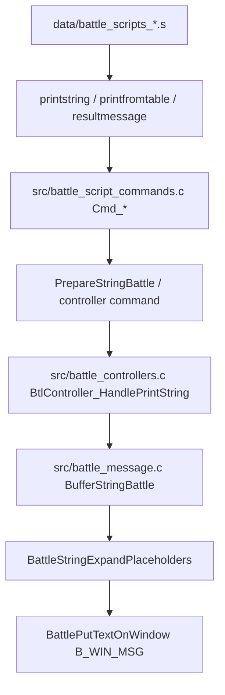
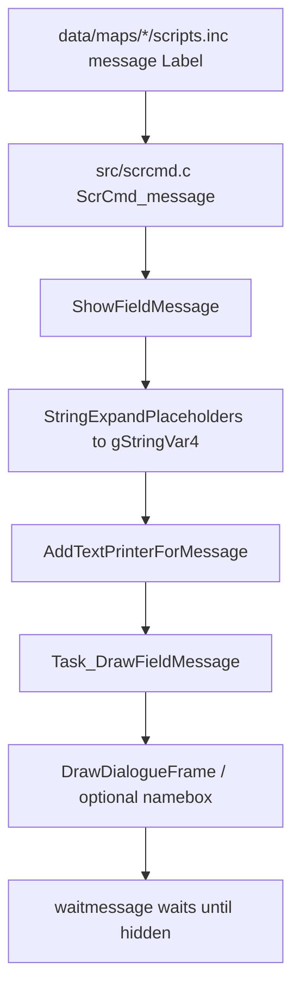

# Message Text Manual

この manual は、メッセージ文言を変更するときに「どのルートの text か」を先に切り分けるための入口です。
特に battle message は、battle script、battle animation、HP bar update、ability/item hook と同じ実行列に入るため、通常の map script message と同じ感覚で触ると表示順や待ち時間が崩れます。

## 最初に見る分岐

| 種類 | 主な編集元 | 表示入口 | 注意点 |
| --- | --- | --- | --- |
| Battle message (中央 path) | `include/constants/battle_string_ids.h`, `src/battle_message.c`, `data/battle_scripts_1.s`, `data/battle_scripts_2.s` | `printstring`, `printfromtable`, `resultmessage`, `critmessage` | animation、HP bar、move-end hook と順番が絡む |
| Battle 外周 (popup / slide / selection / 直接 UI / facility) | `src/battle_interface.c`, `src/trainer_slide.c`, `src/battle_util.c`, `src/battle_arena.c`, `src/frontier_util.c`, 施設別 file | `showabilitypopup`, `handletrainerslidemsg`, `printselectionstring`, 直接 `BattlePutTextOnWindow`, `FrontierSpeechToString` | 中央 path と並行に走るので、`waitmessage` / `printstring` の前後関係に乗らない。 詳細は [Battle Text Routes v15](../flows/battle_text_routes_v15.md) |
| Battle menu / prompt | `src/battle_message.c`, `src/battle_controller_player.c`, `src/battle_bg.c` | `BattlePutTextOnWindow(..., B_WIN_*)` | window id と width が固定 |
| Field / map message (中央 path) | `data/maps/*/scripts.inc`, `src/data/text/*.h`, `src/strings.c`, feature-local C files | field script `message`, C `ShowFieldMessage` | `waitmessage` / `closemessage` は field script の待ち |
| Field 外周 (msgbox type、namebox、signpost、Pokenav、Braille、link error、minigame、TV) | `asm/macros/event.inc`, `data/scripts/std_msgbox.inc`, `src/scrcmd.c`, `src/field_name_box.c`, `src/field_message_box.c`, `src/link.c`, `src/tv.c`, 各 minigame file | `msgbox <text>, MSGBOX_*`, `setspeaker`, `pokenavcall`, `braillemessage`, `CB2_LinkError`, minigame 専用 window | 通常 dialogue frame と異なる frame / window / palette を使う。 詳細は [Field Message Peripherals v15](../flows/field_message_peripherals_v15.md) |
| Contest 文言 | `src/contest.c`, `src/contest_util.c`, `src/data/contest_moves.h` | `Contest_StartTextPrinter`, `Contest_PrintTextToBg0Window*` | 中央 path とは別の textbox。 詳細は [Contest Message Flow v15](../flows/contest_message_flow_v15.md) |
| UI-local text | 各 UI の C file | `AddTextPrinter*`, `DisplayMessageAndContinueTask` | battle/field 共通 placeholder が使えない場合がある |

迷ったら、まず表示したい文言を `rg "文言またはSTRINGID" src data include` で探します。
見つからない場合は、battle message なら `STRINGID_*`、field message なら `gText_*` / `*_Text_*` / map-local label を探します。

## Battle Message の構造

主なファイル:

| File | Role |
| --- | --- |
| `include/constants/battle_string_ids.h` | `enum StringID`。battle message の ID 定義。新規 table message は `STRINGID_TABLE_START` より下へ追加する。 |
| `src/battle_message.c` | 実際の文言、`gBattleStringsTable[STRINGID_COUNT]`、placeholder 展開、battle window への描画。 |
| `include/battle_message.h` | `{B_BUFF1}` 系 buffer、`PREPARE_*_BUFFER` macro、`BATTLE_MSG_MAX_WIDTH` / `BATTLE_MSG_MAX_LINES`。 |
| `data/battle_scripts_1.s` | move、ability、switch、turn-end、battle end などの battle script。 |
| `data/battle_scripts_2.s` | battle item、ball、Safari action などの battle script。 |
| `asm/macros/battle_script.inc` | `printstring`, `waitmessage`, `printfromtable`, `flushtextbox` などの script macro。 |
| `src/battle_script_commands.c` | battle script command の C 実装。 |
| `src/battle_controllers.c` | controller 側で `BufferStringBattle` して `B_WIN_MSG` に描画する。 |
| `src/battle_bg.c` | battle window template。`B_WIN_MSG` の位置とサイズを持つ。 |

基本 flow:



`printstring STRINGID_X` は `Cmd_printstring` で `PrepareStringBattle(id, gBattlerAttacker)` を呼び、`gBattleCommunication[MSG_DISPLAY] = 1` にします。
その後の `waitmessage B_WAIT_TIME_LONG` は、表示中フラグが立っている間だけ `gPauseCounterBattle` を進め、指定時間後に次の命令へ進みます。

`printfromtable table` は `gBattleCommunication[MULTISTRING_CHOOSER]` を index にして table 内の `STRINGID_*` を選びます。
stat 変化、miss、hazard、ball escape など、条件ごとの短い文言はこの方式が多いです。

## Battle Message を変えるときの判断

| やりたいこと | 触る場所 | 追加確認 |
| --- | --- | --- |
| 既存文言だけ変える | `src/battle_message.c` の該当 `COMPOUND_STRING` / `sText_*` | 2 行・幅に収まるか |
| 既存 script の表示 ID を差し替える | `data/battle_scripts_1.s` / `data/battle_scripts_2.s` | animation / HP update / effect 処理の前後関係 |
| 新しい `STRINGID_*` を追加する | `include/constants/battle_string_ids.h`, `src/battle_message.c` | `STRINGID_COUNT` と table index が一致するか |
| 条件で複数文言を出し分ける | `printfromtable` table、または `src/battle_script_commands.c` / helper | `MULTISTRING_CHOOSER` を誰がセットするか |
| `{B_BUFF1}` などに値を入れたい | C 側で `PREPARE_*_BUFFER`、または既存 command/helper | buffer lifetime と battler を確認 |
| move の「効果は抜群」など result 文言を変える | `Cmd_resultmessage` と関連 `STRINGID_*` | double spread / multihit / Sturdy / held item 分岐 |
| animation 中の message timing を変える | battle script の `attackanimation`, `waitanimation`, `healthbarupdate`, `resultmessage`, `waitmessage` 周辺 | 見た目だけでなく move-end hook の再入に注意 |

`STRINGID_INTROMSG`、`STRINGID_INTROSENDOUT`、`STRINGID_RETURNMON`、`STRINGID_SWITCHINMON`、`STRINGID_USEDMOVE`、`STRINGID_BATTLEEND`、`STRINGID_TRAINERSLIDE` は `gBattleStringsTable` を単純に引くのではなく、`BufferStringBattle` の `switch` で battle type や battler に応じて文言を選びます。
これらを変更するときは `src/battle_message.c` の `switch (stringID)` を読む必要があります。

## 表示位置と Window

通常の battle message は `B_WIN_MSG` に描画されます。
`src/battle_bg.c` の standard / Kanto tutorial / Battle Arena window template では `B_WIN_MSG` は下側 textbox として定義されています。
描画設定は `src/battle_message.c` の `sTextOnWindowsInfo_*` と `BattlePutTextOnWindow` にあります。

重要な制約:

- `BATTLE_MSG_MAX_WIDTH` は 208、`BATTLE_MSG_MAX_LINES` は 2 として扱われる。
- `BattlePutTextOnWindow` は `B_WIN_MSG`、Arena judgment、Oak/Old Man などで text speed と down arrow の扱いを変える。
- link / recorded / test runner では auto scroll になりうる。
- move name window は `GetFontIdToFit` で縮小されるが、battle message 全体が自動で綺麗に収まるわけではない。
- window id や window template を動かす場合は `src/battle_controller_player.c` の action / move menu と干渉しやすい。

## Battle Effect / Animation との関係

generic hit path では、message は animation と HP 更新の間に挟まります。
代表的な順番:

```text
attackanimation
waitanimation
effectivenesssound
hitanimation
waitstate
healthbarupdate
datahpupdate
critmessage
resultmessage
setadditionaleffects
```

この順番の意味:

- `attackanimation` の前に出す message は「技を使う前」の演出になる。
- `waitanimation` の後に出す message は animation 完了後に読まれる。
- `healthbarupdate` / `datahpupdate` の前後を変えると、HP が減る前に文言が出るか、減った後に出るかが変わる。
- `critmessage` と `resultmessage` は `PrepareStringBattle` だけを行い、続く `waitmessage` で実際の待ちを取る。
- spread move、multi-hit、Sturdy、Focus Sash、Disguise、Substitute、weakness berry などは通常 path に別 script を差し込む。

特に `BattleScript_FlushMessageBox` は `flushtextbox` を呼びます。
これは `printstring STRINGID_EMPTYSTRING3` と `waitmessage 1` で message box を空にしてから、spread move の次 target や multi-hit の再実行へ戻る用途で使われます。
「表示が一瞬消える」「次の target の前に空白が出る」ような挙動は、この flush を疑います。

## Field / Map Message の構造

通常 field script の message は battle message とは別系統です。

主なファイル:

| File | Role |
| --- | --- |
| `data/script_cmd_table.inc` | `SCR_OP_MESSAGE`, `SCR_OP_WAITMESSAGE`, `SCR_OP_CLOSEMESSAGE` などの opcode table。 |
| `src/scrcmd.c` | `ScrCmd_message`, `ScrCmd_waitmessage`, `ScrCmd_closemessage`, `ScrCmd_braillemessage`。 |
| `src/field_message_box.c` | `ShowFieldMessage`, `ShowFieldAutoScrollMessage`, `ShowFieldMessageFromBuffer`, hide / mode 管理。 |
| `include/field_message_box.h` | field message API と mode enum。 |
| `src/menu.c` | dialogue frame、message box graphics、field message erase。 |
| `data/maps/*/scripts.inc` | map-local script と text label。 |
| `src/data/text/*.h`, `src/strings.c` | shared text data。 |

field script flow:



`waitmessage` は `SetupNativeScript(ctx, IsFieldMessageBoxHidden)` で、field message box が hidden になるまで script を止めます。
`closemessage` は `HideFieldMessageBox` です。

## Placeholder の違い

Battle message:

- `{B_ATK_NAME_WITH_PREFIX}`、`{B_DEF_NAME_WITH_PREFIX}`、`{B_CURRENT_MOVE}`、`{B_LAST_ITEM}` など、battle 専用 placeholder を使う。
- C 側で `gBattleTextBuff1` / `gBattleTextBuff2` / `gBattleTextBuff3` に値を詰める。
- `PREPARE_MOVE_BUFFER`、`PREPARE_ITEM_BUFFER`、`PREPARE_SPECIES_BUFFER`、`PREPARE_ABILITY_BUFFER` などを使う。

Field message:

- `StringExpandPlaceholders(gStringVar4, str)` が基本。
- `gStringVar1`、`gStringVar2`、`gStringVar3` など通常 placeholder を使う。
- map script の `bufferitemname`、`buffermovename`、`bufferspeciesname` などで先に値を詰めることが多い。

この 2 系統の placeholder は同じ文言ファイル内に見えても互換ではありません。
field message に `{B_ATK_NAME_WITH_PREFIX}` を置いても battle battler 名には展開されません。

## 変更前チェックリスト

- 表示場所が battle 内か field / UI 内かを確認した。
- battle 内なら、対象 `STRINGID_*` が table 参照か `BufferStringBattle` の special case かを確認した。
- battle script の `printstring` 前後に `attackanimation`、`waitanimation`、`healthbarupdate`、`datahpupdate`、`resultmessage`、`moveendall` があるか確認した。
- `waitmessage` を追加・削除する場合、`MSG_DISPLAY` が立つ command の直後か確認した。
- `printfromtable` の場合、`gBattleCommunication[MULTISTRING_CHOOSER]` をセットする command / helper を確認した。
- 文言が 2 行・battle textbox 幅に収まるか確認した。
- double battle、spread move、multi-hit、Substitute、Disguise、held item、ability popup に影響しないか確認した。
- field message の場合、`message` の後に `waitmessage` または適切な wait / close があるか確認した。

## 関連 docs

- [Battle Text Routes v15](../flows/battle_text_routes_v15.md) — ability popup、trainer slide、`printselectionstring`、直接 `BattlePutTextOnWindow`、Frontier 施設 speech。
- [Field Message Peripherals v15](../flows/field_message_peripherals_v15.md) — `msgbox` の type 別、namebox、signpost、Pokenav、Braille、link error、minigame、TV。
- [Contest Message Flow v15](../flows/contest_message_flow_v15.md) — Contest 専用 textbox。
- [Battle Effect Resolution Flow v15](../flows/battle_effect_resolution_flow_v15.md)
- [Battle UI Flow v15](../flows/battle_ui_flow_v15.md)
- [How to add new battle script commands/macros](../tutorials/how_to_battle_script_command_macro.md)
- [How to add or change battle messages](../tutorials/how_to_battle_messages.md)
- [How to Namebox](../tutorials/how_to_namebox.md)
