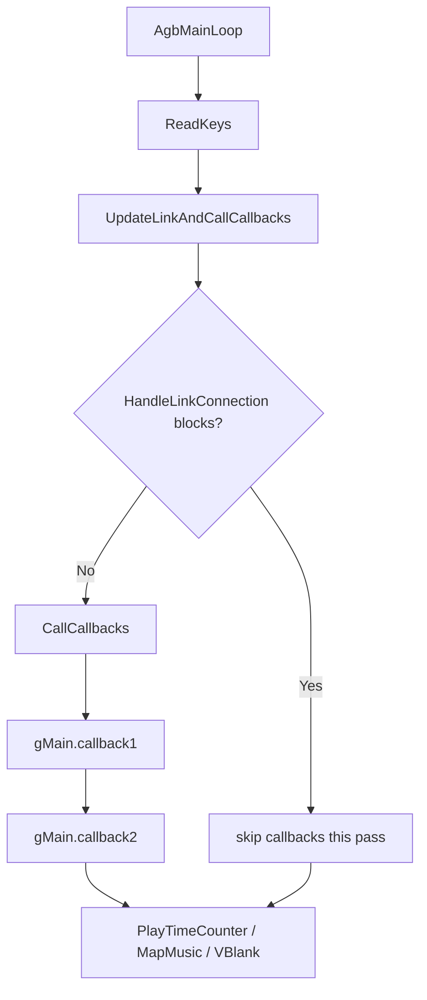
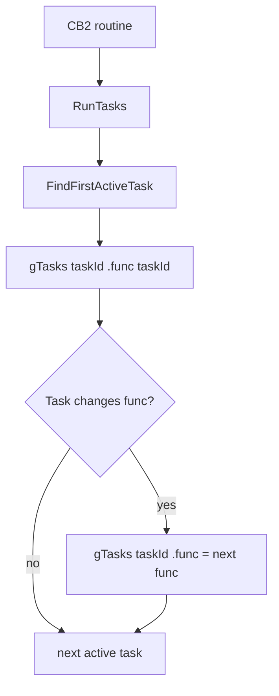
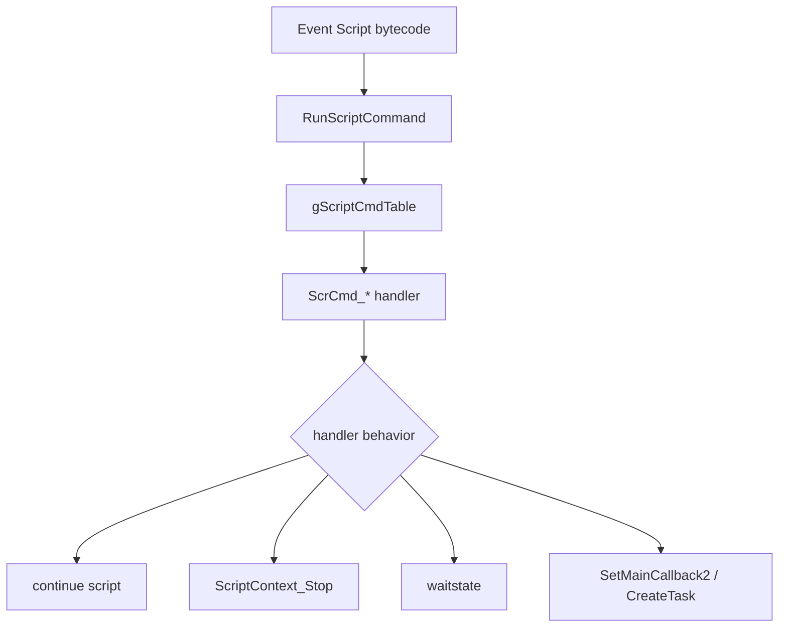
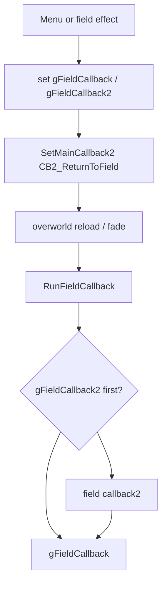
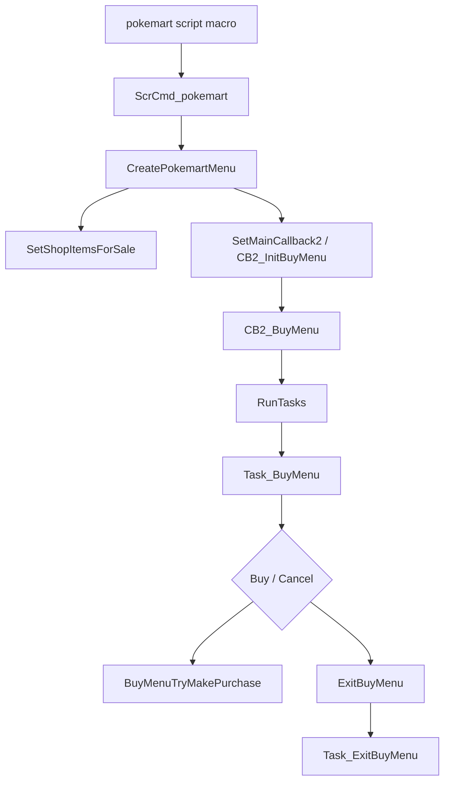

# Callback and Dispatch Map v15

調査日: 2026-05-01

この文書は、pokeemerald-expansion v15 系で見落としやすい間接呼び出しの入口を整理するための地図です。CB2、Task、event script command、special、field callback、item use callback は、関数名だけを追っても全体の遷移が見えにくいため、今後の改造前に必ず確認します。

## Purpose

- `SetMainCallback2` / `CB2_*` による画面単位の遷移を整理する。
- `CreateTask` / `gTasks[taskId].func` による非同期処理を整理する。
- `ScrCmd_*`、`special`、field callback、item use callback の呼び出し境界を整理する。
- マート、party menu、battle、field HM、option、summary など UI 変更の影響範囲確認に使う。

## Main Callback Loop

確認したファイル:

| File | Symbols / facts |
|---|---|
| `include/main.h` | `typedef void (*MainCallback)(void)`, `struct Main`, `gMain`, `SetMainCallback2`。 |
| `src/main.c` | `AgbMainLoop`, `UpdateLinkAndCallCallbacks`, `CallCallbacks`, `SetMainCallback2`。 |

確認した流れ:

- `AgbMainLoop()` は毎フレーム `ReadKeys()`、link 処理、`UpdateLinkAndCallCallbacks()`、`PlayTimeCounter_Update()`、`MapMusicMain()`、`WaitForVBlank()` を行う。
- `UpdateLinkAndCallCallbacks()` は `HandleLinkConnection()` が block しない場合に `CallCallbacks()` を呼ぶ。
- `CallCallbacks()` は `gMain.callback1`、`gMain.callback2` の順に呼ぶ。
- `SetMainCallback2(MainCallback callback)` は `gMain.callback2 = callback` とし、`gMain.state = 0` に戻す。
- `struct Main` には `callback1`、`callback2`、`savedCallback`、VBlank/HBlank callbacks、input state、`state`、`inBattle` がある。

## CB2 Screen Scope

`CB2_*` は `gMain.callback2` に設定される画面 routine の命名規約として広く使われている。

確認した代表例:

| Area | Files / symbols |
|---|---|
| Field return | `include/overworld.h`, `src/overworld.c`, `CB2_ReturnToField`, `CB2_ReturnToFieldContinueScript`, `CB2_ReturnToFieldContinueScriptPlayMapMusic`。 |
| Battle setup / battle | `src/battle_setup.c`, `src/battle_main.c`, `CB2_InitBattle`, `CB2_EndTrainerBattle`。 |
| Party menu | `src/party_menu.c`, `CB2_InitPartyMenu`, `CB2_UpdatePartyMenu`, `CB2_ReloadPartyMenu`, `CB2_ShowPartyMenuForItemUse`。 |
| Bag / item | `src/item_menu.c`, `CB2_Bag`, `CB2_BagMenuRun`。 |
| Shop | `src/shop.c`, `CB2_InitBuyMenu`, `CB2_BuyMenu`。 |
| Options | `src/option_menu.c`, `CB2_InitOptionMenu`。 |
| Summary | `src/pokemon_summary_screen.c`, `ShowPokemonSummaryScreen`, `ShowSelectMovePokemonSummaryScreen` 周辺。 |

改造時の注意:

- `SetMainCallback2` は `gMain.state` を 0 に戻すため、callback 内の state machine に影響する。
- return 先は `gMain.savedCallback`、画面固有の `exitCallback`、`newScreenCallback`、`gPartyMenu.exitCallback` などに保存されることがある。
- UI を挟む機能は「現在の CB2 を保存する場所」と「戻る先」を最初に決める必要がある。

## Task Scope

確認したファイル:

| File | Symbols / facts |
|---|---|
| `include/task.h` | `typedef void (*TaskFunc)(u8 taskId)`, `NUM_TASKS 16`, `NUM_TASK_DATA 16`, `struct Task`, `gTasks[]`。 |
| `src/task.c` | `ResetTasks`, `CreateTask`, `DestroyTask`, `RunTasks`, `TaskDummy`, `SetTaskFuncWithFollowupFunc`, `SwitchTaskToFollowupFunc`, `FuncIsActiveTask`, `FindTaskIdByFunc`。 |

確認した流れ:

- `CreateTask(func, priority)` は空き task slot を探し、`gTasks[i].func = func`、priority、data 初期化を行う。
- `RunTasks()` は active task list を順にたどり、`gTasks[taskId].func(taskId)` を呼ぶ。
- `SetTaskFuncWithFollowupFunc()` は followup 関数 pointer を `gTasks[taskId].data[NUM_TASK_DATA - 2]` とその次に分割保存し、現在 task function を差し替える。
- `SwitchTaskToFollowupFunc()` は保存された followup 関数 pointer を復元し、`gTasks[taskId].func` に設定する。

改造時の注意:

- Task は UI input、fade wait、field effect、battle animation、shop、party menu などに多用される。
- `gTasks[taskId].data[]` は各 task が独自に意味を持つ。新機能で既存 task data を流用する場合は、該当 task の macro / accessor を読む。
- `CreateTask` が失敗すると 0 を返す設計のため、task slot 圧迫は画面追加時のリスクになる。

## Script Command Dispatch

確認したファイル:

| File | Symbols / facts |
|---|---|
| `src/script.c` | `RunScriptCommand`, `ScriptContext_SetupScript`, `ScriptContext_Stop`, `ScriptContext_Enable`。 |
| `src/scrcmd.c` | `ScrCmd_special`, `ScrCmd_specialvar`, `ScrCmd_waitstate`, `ScrCmd_trainerbattle`, `ScrCmd_dotrainerbattle`, `ScrCmd_pokemart`, `ScrCmd_checkfieldmove`。 |
| `data/script_cmd_table.inc` | `gScriptCmdTable`。`SCR_OP_SPECIAL`, `SCR_OP_SPECIALVAR`, `SCR_OP_TRAINERBATTLE`, `SCR_OP_DOTRAINERBATTLE`, `SCR_OP_POKEMART`, `SCR_OP_CHECKFIELDMOVE`。 |
| `asm/macros/event.inc` | `special`, `specialvar`, `trainerbattle`, `dotrainerbattle`, `pokemart`, `checkfieldmove` macro。 |

代表 flow:

改造時の注意:

- script command は binary layout と macro 定義に依存する。`src/scrcmd.c` だけでなく `asm/macros/event.inc` も確認する。
- `ScriptContext_Stop()` する command は C 側 callback / task 完了後に script context を再開する必要がある。
- `gSpecialVar_Result` / `VAR_RESULT` は script への戻り値として広く使われる。

## Special Dispatch

確認したファイル:

| File | Symbols / facts |
|---|---|
| `data/event_scripts.s` | `gSpecials` と `gSpecialVars` を include。 |
| `data/specials.inc` | special table。 |
| `src/scrcmd.c` | `ScrCmd_special`, `ScrCmd_specialvar`。 |
| `src/script_pokemon_util.c` | `ChooseHalfPartyForBattle`, `ReducePlayerPartyToSelectedMons` など party selection 関連 special 実体。 |

改造時の注意:

- special は script から C 関数を呼ぶ橋渡し。waitstate を使う special は script の停止・再開条件が重要。
- `specialvar` は戻り値を variable に入れるため、戻り先の variable が既存 script と衝突しないか確認する。

## Field Callback Scope

確認したファイル:

| File | Symbols / facts |
|---|---|
| `include/overworld.h` | `extern void (*gFieldCallback)(void)`, `extern bool8 (*gFieldCallback2)(void)`。 |
| `src/overworld.c` | `gFieldCallback`, `gFieldCallback2`, `RunFieldCallback`。 |
| `include/field_effect.h` | `gPostMenuFieldCallback`, `gFieldCallback2` extern。 |
| `src/party_menu.c` | `EWRAM_DATA MainCallback gPostMenuFieldCallback`, field move setup。 |
| `src/field_screen_effect.c` | field return / warp callback examples。 |
| `src/item_use.c` | item use 後の field callback examples。 |

代表 flow:

改造時の注意:

- field HM / field item / menu からの復帰は `gFieldCallback` と `gFieldCallback2` を経由する。
- `gPostMenuFieldCallback` は party menu から field move 実行へ戻すための追加 callback として使われる。
- `CB2_ReturnToField*` の違いは script context 再開や map music に影響する。

## Item Use Callback Scope

確認したファイル:

| File | Symbols / facts |
|---|---|
| `include/item.h` | `struct ItemInfo.fieldUseFunc`, `ItemUseFunc`。 |
| `src/data/items.h` | item ごとの `fieldUseFunc`。TM/HM は `ItemUseOutOfBattle_TMHM`。 |
| `src/item_use.c` | field item use、`ItemUseOutOfBattle_TMHM`, `UseTMHM`, `gItemUseCB`。 |
| `src/party_menu.c` | `CB2_ShowPartyMenuForItemUse`, `ItemUseCB_TMHM`, move teach flow。 |
| `src/item_menu.c` | bag menu、registered item、new screen callback。 |

改造時の注意:

- field item は bag UI から直接処理されるものと、party menu を開いて対象ポケモンを選ぶものがある。
- 新 item を作る時は `fieldUseFunc`、battle usage、bag pocket、shop、text、callback 復帰先を分けて確認する。

## Shop Callback Scope

確認した flow:

確認したファイル:

- `src/scrcmd.c`: `ScrCmd_pokemart`
- `src/shop.c`: `SetShopItemsForSale`, `CreatePokemartMenu`, `CB2_InitBuyMenu`, `CB2_BuyMenu`, `Task_BuyMenu`, `BuyMenuTryMakePurchase`, `ExitBuyMenu`, `Task_ExitBuyMenu`
- `include/shop.h`: `CreatePokemartMenu`

## Battle Callback Scope

確認した代表ファイル:

| File | Symbols / facts |
|---|---|
| `src/battle_setup.c` | `BattleSetup_StartTrainerBattle`, `CreateBattleStartTask`, `Task_BattleStart`, `CB2_EndTrainerBattle`, `gMain.savedCallback`。 |
| `src/battle_main.c` | `CB2_InitBattle`, `CB2_InitBattleInternal`, `BattleMainCB1`, `BattleMainCB2`, `CreateNPCTrainerPartyFromTrainer`。 |
| `src/battle_controller_player.c` | `PlayerHandleChooseAction`, `PlayerHandleChooseMove`, `OpenPartyMenuToChooseMon`, `SetBattleEndCallbacks`。 |
| `src/battle_interface.c` | healthbox、party status summary、ability popup。 |
| `src/battle_bg.c` | battle window / background setup。 |

改造時の注意:

- battle start は field/script から task と CB2 を経由して入る。
- battle end は outcome ごとの return path が複数ある。選出 party 復元のような処理は全 outcome path を確認する。
- battle 中の party menu は通常 field party menu と同じファイルにあるが、callback と state は battle 用に分岐している。

## Review Checklist for New Features

新機能の調査時は最低限これを確認する。

- `rg -n "SetMainCallback2\\(" src include`
- `rg -n "CB2_TARGET_NAME|CB2_" src include`
- `rg -n "CreateTask\\(|gTasks\\[[^]]+\\]\\.func" src include`
- `rg -n "ScriptContext_Stop|ScriptContext_Enable|waitstate" src include data asm`
- `rg -n "ScrCmd_FEATURE|SCR_OP_|feature_macro" src include data asm`
- `rg -n "special|specialvar|gSpecialVar_Result" src include data asm`
- `rg -n "gFieldCallback|gFieldCallback2|gPostMenuFieldCallback" src include`
- `rg -n "exitCallback|savedCallback|newScreenCallback" src include`

## Open Questions

- `CB2_*` naming convention は広範囲に使われているが、すべての callback2 が `CB2_` prefix とは限らない。個別 feature では `SetMainCallback2` 参照を優先して確認する。
- Task data の意味は task ごとに異なるため、横断的には整理しきれていない。実装対象ごとに該当 task の data macro / enum を追加調査する。
- battle controller command の詳細 dispatch は今回の横断文書では未整理。battle UI を大きく変える段階で `include/battle_controllers.h` と controller command tables を追加調査する。
