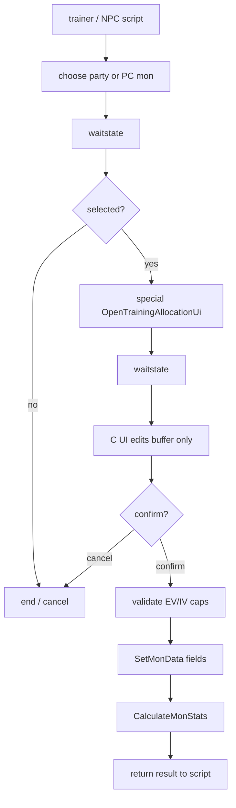

# Champions-style EV/IV Training UI Feasibility v15

調査日: 2026-05-03。source / data / include / tools は読み取りのみ。実装はまだ行わず、`docs/` への調査メモだけを追加する。

## Purpose

Pokemon Champions 風に、Pokemon の努力値 (EV) と個体値 (IV) を画面上で配分・確認できる training UI を作れるか確認する。

結論: **実装可能**。ただし、event script だけで完結する UI ではなく、C 側に新規画面 / task state machine を作り、script から `special` + `waitstate` で起動する形が現実的。

## Existing Data Model

| Field | Storage / API | Notes |
|---|---|---|
| EV | `MON_DATA_HP_EV` ... `MON_DATA_SPDEF_EV` | `PokemonSubstruct2` の `u8`。setter 自体は範囲検証しない。 |
| IV | `MON_DATA_HP_IV` ... `MON_DATA_SPDEF_IV` | `PokemonSubstruct3` の 5-bit field。`MAX_PER_STAT_IVS` は 31。setter 自体は範囲検証しない。 |
| packed IVs | `MON_DATA_IVS` | 6 stat を 5-bit ずつ pack。 |
| Hyper Training | `MON_DATA_HYPER_TRAINED_HP` ... `MON_DATA_HYPER_TRAINED_SPDEF` | raw IV は変えず、stat 計算時に `MAX_PER_STAT_IVS` 扱いにする。 |

確認した主なファイル:

| File | Role |
|---|---|
| [include/pokemon.h](../../include/pokemon.h) | `MON_DATA_*_EV`, `MON_DATA_*_IV`, `MON_DATA_HYPER_TRAINED_*`。 |
| [include/constants/pokemon.h](../../include/constants/pokemon.h) | `MAX_PER_STAT_IVS`, `MAX_PER_STAT_EVS`, `MAX_TOTAL_EVS`。 |
| [src/pokemon.c](../../src/pokemon.c) | `GetMonData`, `SetMonData`, `CalculateMonStats`, item EV handling。 |
| [src/caps.c](../../src/caps.c) | `GetCurrentEVCap()`。badge / flag / var による EV cap。 |
| [src/script_pokemon_util.c](../../src/script_pokemon_util.c) | script command の `CanHyperTrain`, `HyperTrain`, scripted mon generation EV/IV validation。 |
| [test/pokemon.c](../../test/pokemon.c) | Hyper Training と IV/EV 周辺 test。 |

## Existing UI Support

Summary screen には IV/EV の **表示**機能がある。

| File | Important symbols |
|---|---|
| [include/config/summary_screen.h](../../include/config/summary_screen.h) | `P_SUMMARY_SCREEN_IV_EV_INFO`, `P_SUMMARY_SCREEN_IV_EV_VALUES`, `P_SUMMARY_SCREEN_IV_ONLY`, `P_SUMMARY_SCREEN_EV_ONLY`, `P_SUMMARY_SCREEN_IV_HYPERTRAIN`。 |
| [src/pokemon_summary_screen.c](../../src/pokemon_summary_screen.c) | `ShouldShowIvEvPrompt`, `IncrementSkillsStatsMode`, `ShowMonSkillsInfo`, `GetAdjustedIvData`。 |

現状の summary は `STATS -> IVs -> EVs` の表示切替が主で、編集 UI ではない。Champions 風の配分画面を作るなら、summary screen の表示ロジックや assets を参考にしつつ、新規 UI として分ける方が安全。

## Script Launch Feasibility

既存の非同期 UI 起動パターンは move relearner が近い。

| Flow | Existing example |
|---|---|
| script で対象 mon を選ぶ | `chooseboxmon ...` + `waitstate` in [data/scripts/move_relearner.inc](../../data/scripts/move_relearner.inc) |
| C 側 UI を開く | `ChooseMonForMoveRelearner`, `TeachMoveRelearnerMove` in [src/party_menu.c](../../src/party_menu.c) |
| callback で field へ戻る | `ShowPokemonSummaryScreen(..., CB2_ReturnToField)` |
| script command 登録 | `data/specials.inc` の `def_special` |

推奨 flow:

## Validation Rules UI Must Own

`SetMonData` は低レベル setter なので、training UI 側で必ず検証する。

| Area | Rule |
|---|---|
| IV | 0..`MAX_PER_STAT_IVS` (=31)。raw IV を直接変えるか、Hyper Training flag にするかは設計で選ぶ。 |
| EV per stat | 0..`MAX_PER_STAT_EVS`。Gen 6+ config なら 252、古い cap なら 255。 |
| EV total | 通常は `MAX_TOTAL_EVS` (=510)。badge/flag cap を尊重するなら `GetCurrentEVCap()` も適用。 |
| HP update | `CalculateMonStats` は max HP 増加分を current HP に足し、低下時は current HP を new max に clamp する。fainted mon は current HP 0 を維持する。 |
| Eggs / fainted / PC box | egg を編集対象にするか、box mon を直接編集するかは仕様化が必要。 |
| Battle / link / contest | field script からのみ起動し、battle / link 中は不可にするのが無難。 |

## Raw IV Editing vs Hyper Training

| Option | Pros | Risks |
|---|---|---|
| Raw IV を 0..31 で編集 | Champions 風の自由配分に近い。確認もしやすい。 | breeding / Hidden Power / personality 由来の期待と衝突する可能性。 |
| Hyper Training flag を使う | 既存 engine が対応済み。raw IV を壊さず、stat だけ 31 扱いにできる。 | 0..31 の細かい IV 配分 UI とは違う。表示時に `GetAdjustedIvData` と raw IV のどちらを見せるか決める必要。 |
| 両方対応 | 後から仕様変更しやすい。 | UI と説明が複雑になる。初回 MVP には重い。 |

MVP は **EV は直接配分、IV は raw edit か Hyper Training のどちらか一方**に絞るのがよい。競技用調整なら Hyper Training 優先、sandbox / Champions 風の自由度なら raw IV editing 優先。

## Recommended C-side Architecture

| Component | Responsibility |
|---|---|
| `OpenTrainingAllocationUi` special | script 入口。対象 mon index / box position を読む。 |
| `CB2_InitTrainingAllocation` | BG/window/sprite 初期化。 |
| `Task_TrainingAllocationInput` | cursor, stat selection, increment/decrement, reset, confirm/cancel。 |
| edit buffer | original EV/IV と pending EV/IV を分けて保持。cancel 時は破棄。 |
| validation helper | `CanApplyTrainingAllocation`, `ClampTrainingAllocation`, `GetTrainingEvBudget`。 |
| commit helper | `SetMonData` -> `CalculateMonStats` -> result var。 |

Script から個別に「HP EV +1」「Atk IV 31」などを何度も呼ぶ方式は避ける。画面操作途中で未確定値が save data に入り、キャンセルや cap rollback が複雑になる。

## Open Questions

- IV は raw edit、Hyper Training、または両方のどれにするか。
- EV cap は常に 510 か、`GetCurrentEVCap()` に合わせて進行度制限するか。
- 対象は party only か、PC box mon も対象にするか。
- 費用、アイテム消費、解禁 flag を使うか。
- 画像 assets のサイズ / palette / tile budget をどう切るか。

## Next Implementation Checklist

1. 仕様を EV-only MVP / EV+raw IV / EV+Hyper Training のどれかに決める。
2. `data/specials.inc` に新規 special を登録する設計を作る。
3. party / PC 選択 flow を move relearner と同じ callback 形式で作る。
4. UI buffer と validation helper の unit test を追加する。
5. `CalculateMonStats` 後の HP 挙動、egg、fainted、box mon を手動検証する。
