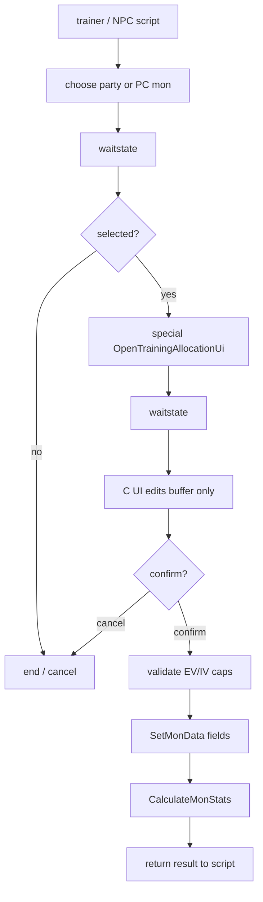
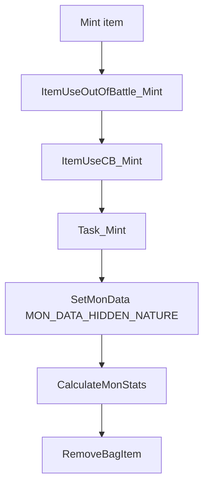

# Champions-style EV/IV Training UI Feasibility v15

調査日: 2026-05-03。source / data / include / tools は読み取りのみ。実装はまだ行わず、`docs/` への調査メモだけを追加する。

## Purpose

Pokemon Champions 風に、Pokemon の努力値 (EV) と個体値 (IV) を画面上で配分・確認できる training UI を作れるか確認する。

結論: **実装可能**。ただし、event script だけで完結する UI ではなく、C 側に新規画面 / task state machine を作り、script から `special` + `waitstate` で起動する形が現実的。

## Existing Data Model

| Field | Storage / API | Notes |
|---|---|---|
| EV | `MON_DATA_HP_EV` ... `MON_DATA_SPDEF_EV` | `PokemonSubstruct2` の `u8`。setter 自体は範囲検証しない。 |
| IV | `MON_DATA_HP_IV` ... `MON_DATA_SPDEF_IV` | `PokemonSubstruct3` の 5-bit field。`MAX_PER_STAT_IVS` は 31。setter 自体は範囲検証しない。 |
| packed IVs | `MON_DATA_IVS` | 6 stat を 5-bit ずつ pack。 |
| Hyper Training | `MON_DATA_HYPER_TRAINED_HP` ... `MON_DATA_HYPER_TRAINED_SPDEF` | raw IV は変えず、stat 計算時に `MAX_PER_STAT_IVS` 扱いにする。 |
| Nature | `MON_DATA_HIDDEN_NATURE` | mints と同じ hidden nature を使える。personality 由来の original nature は残せる。 |
| Moves | `MON_DATA_MOVE1` ... `MON_DATA_MOVE4`, PP fields | move relearner / TM / tutor UI と同じ上書き flow を流用候補にできる。 |

確認した主なファイル:

| File | Role |
|---|---|
| [include/pokemon.h](../../include/pokemon.h) | `MON_DATA_*_EV`, `MON_DATA_*_IV`, `MON_DATA_HYPER_TRAINED_*`。 |
| [include/constants/pokemon.h](../../include/constants/pokemon.h) | `MAX_PER_STAT_IVS`, `MAX_PER_STAT_EVS`, `MAX_TOTAL_EVS`。 |
| [src/pokemon.c](../../src/pokemon.c) | `GetMonData`, `SetMonData`, `CalculateMonStats`, item EV handling。 |
| [src/caps.c](../../src/caps.c) | `GetCurrentEVCap()`。badge / flag / var による EV cap。 |
| [src/script_pokemon_util.c](../../src/script_pokemon_util.c) | script command の `CanHyperTrain`, `HyperTrain`, scripted mon generation EV/IV validation。 |
| [src/party_menu.c](../../src/party_menu.c) | mint callback、item EV use、TM/HM use、move relearner 起動。 |
| [src/move_relearner.c](../../src/move_relearner.c) | move list UI と move 上書き flow。 |
| [src/wild_encounter.c](../../src/wild_encounter.c) | wild mon 生成。`CreateWildMon` は `CreateMonWithIVs(..., USE_RANDOM_IVS)` を使う。 |
| [test/pokemon.c](../../test/pokemon.c) | Hyper Training と IV/EV 周辺 test。 |

## Existing UI Support

Summary screen には IV/EV の **表示**機能がある。

| File | Important symbols |
|---|---|
| [include/config/summary_screen.h](../../include/config/summary_screen.h) | `P_SUMMARY_SCREEN_IV_EV_INFO`, `P_SUMMARY_SCREEN_IV_EV_VALUES`, `P_SUMMARY_SCREEN_IV_ONLY`, `P_SUMMARY_SCREEN_EV_ONLY`, `P_SUMMARY_SCREEN_IV_HYPERTRAIN`。 |
| [src/pokemon_summary_screen.c](../../src/pokemon_summary_screen.c) | `ShouldShowIvEvPrompt`, `IncrementSkillsStatsMode`, `ShowMonSkillsInfo`, `GetAdjustedIvData`。 |

現状の summary は `STATS -> IVs -> EVs` の表示切替が主で、編集 UI ではない。Champions 風の配分画面を作るなら、summary screen の表示ロジックや assets を参考にしつつ、新規 UI として分ける方が安全。

## Script Launch Feasibility

既存の非同期 UI 起動パターンは move relearner が近い。

| Flow | Existing example |
|---|---|
| script で対象 mon を選ぶ | `chooseboxmon ...` + `waitstate` in [data/scripts/move_relearner.inc](../../data/scripts/move_relearner.inc) |
| C 側 UI を開く | `ChooseMonForMoveRelearner`, `TeachMoveRelearnerMove` in [src/party_menu.c](../../src/party_menu.c) |
| callback で field へ戻る | `ShowPokemonSummaryScreen(..., CB2_ReturnToField)` |
| script command 登録 | `data/specials.inc` の `def_special` |

推奨 flow:



## Validation Rules UI Must Own

`SetMonData` は低レベル setter なので、training UI 側で必ず検証する。

| Area | Rule |
|---|---|
| IV | 0..`MAX_PER_STAT_IVS` (=31)。raw IV を直接変えるか、Hyper Training flag にするかは設計で選ぶ。 |
| EV per stat | 0..`MAX_PER_STAT_EVS`。Gen 6+ config なら 252、古い cap なら 255。 |
| EV total | 通常は `MAX_TOTAL_EVS` (=510)。badge/flag cap を尊重するなら `GetCurrentEVCap()` も適用。 |
| HP update | `CalculateMonStats` は max HP 増加分を current HP に足し、低下時は current HP を new max に clamp する。fainted mon は current HP 0 を維持する。 |
| Eggs / fainted / PC box | egg を編集対象にするか、box mon を直接編集するかは仕様化が必要。 |
| Battle / link / contest | field script からのみ起動し、battle / link 中は不可にするのが無難。 |

## Nature Editing

性格変更は実装余地が大きい。既存の mint は `ItemUseCB_Mint` から `MON_DATA_HIDDEN_NATURE` を更新し、`CalculateMonStats()` を呼ぶ。

確認した既存 flow:



Champions-style menu で性格を自由変更するなら、item 消費を挟まず `MON_DATA_HIDDEN_NATURE` を編集する専用 UI にできる。raw personality を変える必要はない。Hidden nature は `BoxPokemon.hiddenNatureModifier:5` に保存され、`NUM_NATURES <= 32` の static assert があるため、通常の 25 nature の範囲では保存幅に問題はない。

## EV 32-point Feasibility

結論: **可能だが、意味を明確に分ける必要がある**。

現行の stat 計算は `ev / 4` を使う。つまり、保存値としての EV を単純に 0..32 に落とすと、能力補正は最大 8 相当になり、現在の 252 EV 最大補正とは大きく違う。

| Option | Meaning | Feasibility | Notes |
|---|---|---|---|
| 保存 EV を 0..32 にする | `MAX_PER_STAT_EVS` 相当を 32 にする | Easy but not recommended | `ev / 4` のため能力が低くなる。既存 item / EV gain も全部小さくなる。 |
| UI point 0..32 を内部 EV へ変換 | UI 上は 32、保存は 0..252 | Recommended | 例: `point * 8` を 252 clamp、または 32 段階 table。既存 stat formula を壊さない。 |
| stat formula 自体を 32 point 前提に変更 | `ev / 4` を独自式に変える | Possible, high risk | battle calc、summary 表示、item、tests、AI の期待値まで変わる。 |

Champions 風の「簡単に調整できる」UI が目的なら、**内部 EV は現行のまま、UI だけ 0..32 point 表示**が安全。保存時に point を EV へ変換し、表示時は EV を point に戻す。

変換方式の候補:

| Mapping | Pros | Risks |
|---|---|---|
| `internalEV = min(point * 8, 252)` | 32 point が 252 近辺に届く。実装が単純。 | 31 point = 248、32 point = 252 で最後だけ 4 差になる。 |
| 32 entry lookup table | 端数をきれいに分配できる。 | table と説明が必要。 |
| point 1 = stat 1 相当として `internalEV = point * 4` | stat 変化が直感的。 | 最大 128 EV 相当で、競技用 252 調整とは別物。 |

## Total EV Cap 510 / 518

現行定数は `MAX_TOTAL_EVS 510`。`GetCurrentEVCap()` の default も `MAX_TOTAL_EVS` を返す。

`510` から `518` へ増やすこと自体は、保存幅だけ見れば問題になりにくい。各 EV は `u8` なので 0..255、合計は runtime で計算している。ただし、cap を参照する場所は複数ある。

影響箇所:

| Area | Current dependency |
|---|---|
| EV gain | `MonGainEVs()` が `GetCurrentEVCap()` と `MAX_PER_STAT_EVS` を見る。 |
| EV items | `PokemonUseItemEffects()` が `MAX_TOTAL_EVS` / `GetCurrentEVCap()` / `MAX_PER_STAT_EVS` を見る。 |
| badge/flag EV cap | `src/caps.c` の `sEvCapFlagMap` が `MAX_TOTAL_EVS * n / 17` を使う。 |
| UI validation | training UI 側で total budget をどう表示するか決める必要がある。 |

注意点: 公式式では EV は 4 ごとに stat へ反映される。`252 + 252 + 6 = 510` は 3 番目の stat に 1 point 相当だけ入る。`252 + 252 + 14 = 518` にすると 3 番目に 3 point 相当を入れられるが、公式の 510 cap とは異なる独自ルールになる。

32 point UI と組み合わせる場合は、さらに意味を分ける必要がある。`internalEV = min(point * 8, 252)` なら per-stat UI は 8 刻みに近いが、`518` は total budget 側の独自値であり、全体を常に 8 の倍数だけで消費する設計とは一致しない。UI で 8 刻みだけ許すのか、最後の余りだけ 2/6/14 のような端数を許すのかを仕様化する。

推奨:

- 競技用互換を優先するなら `MAX_TOTAL_EVS 510` のまま。
- Champions 風に見た目を整えたいだけなら、total cap は 510 のまま UI point 表示で吸収する。
- 518 は「余り 14 を許す独自ルール」として明示し、EV gain / item / cap map / UI tests をまとめて見る。

## Wild 6V Option

野生 Pokemon を全 6V にする option は実装可能。現行 `CreateWildMon()` は:

1. `PickWildMonNature()` で nature を決める。
2. `GetMonPersonality()` で personality を作る。
3. `CreateMonWithIVs(&gEnemyParty[0], species, level, personality, OTID_STRUCT_PLAYER_ID, USE_RANDOM_IVS)` を呼ぶ。
4. `GiveMonInitialMoveset()` を呼ぶ。

`USE_RANDOM_IVS` を `MAX_PER_STAT_IVS` に差し替えると 6V 固定になる。実装するなら、直書きではなく `include/config/pokemon.h` に compile-time config、または flag/var config を用意する方がよい。

候補:

```c
#define WILD_IV_MODE_RANDOM 0
#define WILD_IV_MODE_6V 1
#define WILD_IV_MODE_FLAG 2
#define WILD_IV_MODE_VAR 3

#define P_WILD_IV_MODE WILD_IV_MODE_RANDOM
#define P_FLAG_FORCE_WILD_6V 0
#define P_VAR_WILD_IV_MODE 0
```

docs-only の設計上は、単なる `TRUE` / `FALSE` よりも mode 化を推奨する。`WILD_IV_MODE_RANDOM` は現行通り `USE_RANDOM_IVS`、`WILD_IV_MODE_6V` は常時 `MAX_PER_STAT_IVS`、`WILD_IV_MODE_FLAG` は指定 flag が立っている間だけ 6V、`WILD_IV_MODE_VAR` は event var の値で random / 6V / 将来の固定 IV 段階を切り替える想定。

設計上の注意:

- wild だけか、gift / fossil / roamer / scripted encounter も対象にするか分ける。
- legendary の `perfectIVCount` とは別ルールになる。
- DexNav や釣り、Sweet Scent、Rock Smash は最終的に `CreateWildMon()` を通るが、special encounter は別 function を使う可能性があるため `CreateMonWithIVs` 参照を再確認する。
- 捕獲後の player party / PC にその IV が保存されるため、難易度と育成 UI の価値に影響する。

## Move Editing / Level 100 Move at Level 50

「Lv50 でも Lv100 技を選べる」方向は、既存の move relearner が近い。

既存 config:

| Config | Meaning |
|---|---|
| `P_ENABLE_MOVE_RELEARNERS` | egg / TM / tutor relearner をまとめて有効化。 |
| `P_ENABLE_ALL_LEVEL_UP_MOVES` | level に関係なく level-up move を候補にする。 |
| `P_PRE_EVO_MOVES` | pre-evolution の level-up move も候補にする。 |
| `P_ENABLE_ALL_TM_MOVES` | bag 所持に関係なく compatible TM を候補にする。 |
| `P_TM_MOVES_RELEARNER` | TM move relearner を有効化。 |

Champions-style moveset editor は、move relearner をそのまま解禁する案と、新規 editor を作る案に分ける。

| Option | Pros | Risks |
|---|---|---|
| `P_ENABLE_ALL_LEVEL_UP_MOVES` を使う | 既存 UI と candidate 生成を流用できる。 | move relearner 全体の UI/解禁条件が変わる。 |
| 新規 moveset editor | EV/IV/nature UI と統合しやすい。 | move list、description、PP、forget制限、TM/tutor/egg候補を再設計する必要。 |
| Debug menu を参考にする | `SetMonMoveSlot` の使い方が分かる。 | debug 専用 flow なので本番 UI にはそのまま使わない。 |

MVP は `P_ENABLE_ALL_LEVEL_UP_MOVES` を調査用に使い、最終的には training UI に「level-up / TM / tutor / egg / all compatible」の source tab を持たせる設計が扱いやすい。

## Raw IV Editing vs Hyper Training

| Option | Pros | Risks |
|---|---|---|
| Raw IV を 0..31 で編集 | Champions 風の自由配分に近い。確認もしやすい。 | breeding / Hidden Power / personality 由来の期待と衝突する可能性。 |
| Hyper Training flag を使う | 既存 engine が対応済み。raw IV を壊さず、stat だけ 31 扱いにできる。 | 0..31 の細かい IV 配分 UI とは違う。表示時に `GetAdjustedIvData` と raw IV のどちらを見せるか決める必要。 |
| 両方対応 | 後から仕様変更しやすい。 | UI と説明が複雑になる。初回 MVP には重い。 |

MVP は **EV は直接配分、IV は raw edit か Hyper Training のどちらか一方**に絞るのがよい。競技用調整なら Hyper Training 優先、sandbox / Champions 風の自由度なら raw IV editing 優先。

## Recommended C-side Architecture

| Component | Responsibility |
|---|---|
| `OpenTrainingAllocationUi` special | script 入口。対象 mon index / box position を読む。 |
| `CB2_InitTrainingAllocation` | BG/window/sprite 初期化。 |
| `Task_TrainingAllocationInput` | cursor, stat selection, increment/decrement, reset, confirm/cancel。 |
| edit buffer | original EV/IV と pending EV/IV を分けて保持。cancel 時は破棄。 |
| validation helper | `CanApplyTrainingAllocation`, `ClampTrainingAllocation`, `GetTrainingEvBudget`。 |
| commit helper | `SetMonData` -> `CalculateMonStats` -> result var。 |

Script から個別に「HP EV +1」「Atk IV 31」などを何度も呼ぶ方式は避ける。画面操作途中で未確定値が save data に入り、キャンセルや cap rollback が複雑になる。

## Open Questions

- IV は raw edit、Hyper Training、または両方のどれにするか。
- EV cap は常に 510 か、`GetCurrentEVCap()` に合わせて進行度制限するか。
- UI point を 32 にする場合、内部 EV への mapping を `*8 clamp`、lookup table、`*4` のどれにするか。
- `MAX_TOTAL_EVS` は 510 維持か、518 へ拡張するか。
- 対象は party only か、PC box mon も対象にするか。
- 費用、アイテム消費、解禁 flag を使うか。
- wild 6V は wild encounter のみか、gift / fossil / static / roamer まで含めるか。
- moveset editor は existing move relearner を拡張するか、新規 UI にするか。
- 画像 assets のサイズ / palette / tile budget をどう切るか。

## Next Implementation Checklist

1. 仕様を EV-only MVP / EV+raw IV / EV+Hyper Training のどれかに決める。
2. `data/specials.inc` に新規 special を登録する設計を作る。
3. party / PC 選択 flow を move relearner と同じ callback 形式で作る。
4. UI buffer と validation helper の unit test を追加する。
5. `CalculateMonStats` 後の HP 挙動、egg、fainted、box mon を手動検証する。
