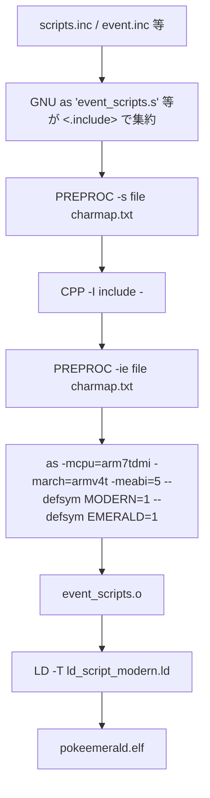
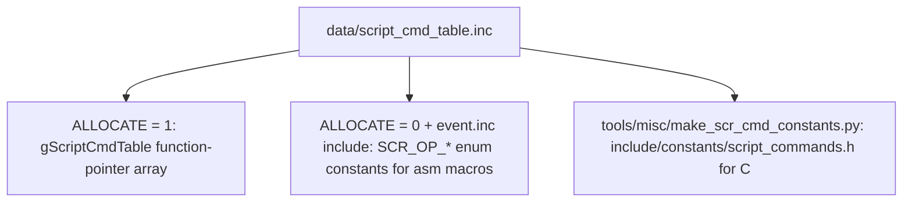

# Inc Script Pipeline v15

## Purpose

`pokeemerald-expansion` の event script は ARM assembler の `.s` / `.inc` ファイル群で構築されているが、それらは生 ARM 命令ではなく、**event-script bytecode** を `.byte` / `.2byte` / `.4byte` で並べた data block である。本書は、`.inc` source が build 時にどのように bytecode object へと組み上がるか、生成 `.inc` と hand-authored `.inc` の境界線、bytecode opcode 表の single-source 構造を整理する。

調査日: 2026-05-03。source 改造はしておらず、`docs/` への記録のみ。

## Related Docs

| Doc | Focus | Why separate |
|---|---|---|
| [flows/map_script_flow_v15.md](../flows/map_script_flow_v15.md) | `MAP_SCRIPT_*` table dispatch の深掘り (本書の続編) | 本書は build pipeline と bytecode runtime 全般、map_script_flow は dispatch mechanism に特化。 |
| [flows/map_script_flag_var_flow_v15.md](../flows/map_script_flag_var_flow_v15.md) | Flag/var/visibility/item-ball/coord-event の編集者向け runtime チェックリスト | 本書が build / runtime mechanism、それが「map を編集するときの注意」というワークフロー観点。 |
| [flows/event_script_flow_v15.md](../flows/event_script_flow_v15.md) | `special` / `trainerbattle` / `waitstate` の battle 入口 flow | 本書の bytecode runtime 概観の上に、battle selection feature 特化の応用例。 |
| [flows/script_inc_audit_v15.md](../flows/script_inc_audit_v15.md) | `data/scripts/*.inc` の symbol inventory | 本書が「pipeline の機構」、audit が「現存ファイルの中身カタログ」。 |
| [tools/poryscript_integration_status.md](../tools/poryscript_integration_status.md) | 外部 transpiler の採用評価 | 本書の `.inc` pipeline を変えずに「`.inc` の書きやすさ」を改善する将来オプション。 |

## Key Files

| File | Role |
|---|---|
| [data/event_scripts.s](../../data/event_scripts.s) | 全 event script `.inc` を集約する master include hub。`gScriptCmdTable::` の唯一の allocator でもある。1739 行。 |
| [asm/macros/event.inc](../../asm/macros/event.inc) | Event-script 用 macro 群。385 個の `.macro` を定義し、各 macro は `SCR_OP_*` opcode + operand を `.byte`/`.2byte`/`.4byte` で出力する。 |
| [asm/macros/map.inc](../../asm/macros/map.inc) | Map データ専用 macro (`map_script`, `map_script_2`, `object_event`, `warp_def`, `coord_event`, `bg_event`, `connection`, `map_header_flags`, …)。`mapjson` が生成する `.inc` がこの macro 群に依存する。 |
| [asm/macros/movement.inc](../../asm/macros/movement.inc) | Object event の movement command 用 macro。 |
| [data/script_cmd_table.inc](../../data/script_cmd_table.inc) | Bytecode opcode の single source of truth。260 行、231 個の `script_cmd_table_entry`。 |
| [include/constants/script_commands.h](../../include/constants/script_commands.h) | `data/script_cmd_table.inc` から auto-gen される `SCR_OP_*` 定数 header (C 側)。 |
| [tools/misc/make_scr_cmd_constants.py](../../tools/misc/make_scr_cmd_constants.py) | 上記 header を生成する Python script。`Makefile` の `AUTO_GEN_TARGETS` に登録済。 |
| [tools/preproc/](../../tools/preproc/) | `string`/`charmap` の前処理を担う preprocessor。`PREPROC` macro 経由で呼ばれる。 |
| [charmap.txt](../../charmap.txt) | GBA 文字 ⇄ byte 値のマッピング。`.string` directive のエンコードに使われる。 |
| [tools/scaninc/](../../tools/scaninc/) | `.s` / `.inc` の `.include` を辿って `.d` dependency file を生成する。 |
| [src/script.c](../../src/script.c) | Bytecode runtime。`InitScriptContext`、`RunScriptCommand`、`gScriptCmdTable[]` dispatch を持つ。 |

## Source-Tree Split: hand-authored vs generated

`data/` 配下の `.inc` は性質が大きく 2 種類に分かれる。

| Category | Path | Authored by | Build dependency |
|---|---|---|---|
| **Generated map data** | `data/maps/<MapName>/header.inc`, `events.inc`, `connections.inc`, `data/maps/headers.inc`, `groups.inc`, `connections.inc`, `data/layouts/layouts.inc`, `layouts_table.inc` | `tools/mapjson` from `map.json` / `map_groups.json` / `layouts.json` | `map_data_rules.mk` |
| **Hand-authored map scripts** | `data/maps/<MapName>/scripts.inc`, `text.inc` | 人間 (event script bytecode を `event.inc` macro 経由で記述) | static |
| **Hand-authored shared scripts** | `data/scripts/*.inc`, `data/text/*.inc` | 人間 | static |
| **Battle / contest scripts** | `data/battle_scripts_1.s`, `battle_scripts_2.s`, `contest_ai_scripts.s` | 人間 (別 macro 体系: `asm/macros/battle_script.inc` / `contest_ai_script.inc`) | static |
| **Field-effect scripts** | `data/field_effect_scripts.s` | 人間 | static |
| **Generated learnset / encounter / trainer / cmd-constants headers** | `src/data/...`, `data/wild_encounters.h`, `include/constants/script_commands.h` | Python tools (`tools/learnset_helpers/`, `tools/wild_encounters/`, `tools/misc/`) / `tools/trainerproc` | `Makefile` の `AUTO_GEN_TARGETS` |

ポイント:

- **`scripts.inc` は generated **ではない**。** `map.json` / Porymap が表現できるのは event 配置 (warp/object/coord/bg) と layout のみで、event の中身 (= 実際に走る bytecode) は `scripts.inc` に手書きする必要がある。
- 945 個の map directory ([data/maps/](../../data/maps/)) すべてが各々 `scripts.inc` を持ちうる (空 stub のことも多いが、map script や signpost text は人間の管轄)。
- `events.inc`/`connections.inc`/`header.inc` は `make clean-assets` で消され、次回 build で `mapjson` が再生成する。**手で編集してはいけない**。これは `.gitignore` 対象 (Makefile の `clean-assets` rule から推察できる)。

## Build Pipeline

`.inc` file は最終的に ELF 内の data セクションへ並ぶ。経路は以下:



該当 rule は `Makefile` の `$(C_BUILDDIR)/%.o: $(C_SUBDIR)/%.s` (C 隣の `.s`) と `$(DATA_ASM_BUILDDIR)/%.o: $(DATA_ASM_SUBDIR)/%.s` (data 配下の `.s`) で同形:

```make
$(PREPROC) -s $< charmap.txt | $(CPP) $(CPPFLAGS) $(INCLUDE_SCANINC_ARGS) - | $(PREPROC) -ie $< charmap.txt | $(AS) $(ASFLAGS) -o $@
```

各段の役割:

| Stage | Tool | Responsibility |
|---|---|---|
| 1 | `tools/preproc/preproc -s` | `.string "..."` を `charmap.txt` に従って GBA 文字 byte 列に変換。`-s` は string mode。 |
| 2 | `arm-none-eabi-cpp -I include -` | `.include`, `#define`, `#if`, `#include`, comment 除去を行う C preprocessor 段階。`include/` 以下の constant header と `config/*.h` がここで展開される。 |
| 3 | `tools/preproc/preproc -ie` | inline encoded string の二次変換 (macro 展開後に再走査が必要なため)。 |
| 4 | `arm-none-eabi-as` | 残った `.byte` / `.2byte` / `.4byte` / `.macro` 展開を assemble して object へ。 |

`scaninc` は build 前に `.d` を生成して、`scripts.inc` の include 関係 (例: `data/event_scripts.s` が依存する全 `.inc`) を make に教える。Python 側の `AUTO_GEN_TARGETS` は最初に走り (`Makefile` 上部の `SETUP_PREREQS` ブロック)、`scaninc` がそれら generated header / `.inc` も先に存在する状態で dependency を解決できる。

## event_scripts.s の役割

`data/event_scripts.s` は **3 つの責務** を 1 ファイルに集約している:

1. **Constants header の取り込み** (1 行目以降): `include/config/general.h`, `include/constants/flags.h`, `vars.h`, `species.h`, `items.h`, `script_commands.h` 等を `#include` して、以降の `.include` で展開される `.inc` 内で `FLAG_*` / `VAR_*` / `SPECIES_*` 定数が解決されるようにする。
2. **`gScriptCmdTable::` の allocation** (line 81-82):

   ```asm
   .set ALLOCATE_SCRIPT_CMD_TABLE, 1
   .include "data/script_cmd_table.inc"
   ```

   ここでだけ `ALLOCATE_SCRIPT_CMD_TABLE = 1` が立つので、`data/script_cmd_table.inc` 内の `.if ALLOCATE_SCRIPT_CMD_TABLE / .4byte \value / .else / enum \constant / .endif` 分岐が「`.4byte` 出力 = 関数ポインタ table 本体」を取る。`gScriptCmdTable::` label と末尾の `gScriptCmdTableEnd::` がここで定義される。
3. **全 `.inc` の集約** (line 128-): 945 map 全部の `scripts.inc` と `data/scripts/*.inc` / `data/text/*.inc` を `.include` で取り込み、object code 化する。1002 個の `.include` directive がある (確認: `grep -c '\.include' data/event_scripts.s == 1002`)。

`event.inc` macro が呼ばれた瞬間 (= 普通の `scripts.inc` で `setflag` 等を書いた瞬間) は `ALLOCATE_SCRIPT_CMD_TABLE = 0` のまま include されているため、同じ `script_cmd_table.inc` は **enum 値 (= `SCR_OP_*` 定数)** を出すモードになる。「同じファイルが allocator にも opcode 定数源にもなる」のがこの設計の肝。

## Bytecode Opcode の Single Source

`data/script_cmd_table.inc` 1 ファイルが、以下 **3 つ** の生成物を駆動する:



- `gScriptCmdTable` (B) は `data/event_scripts.s` から 1 度だけ allocate される。
- `SCR_OP_*` 定数 (C) は `asm/macros/event.inc` の line 2 が `.include "data/script_cmd_table.inc"` するたびに `enum` directive で連番付与され、それを使って `setflag` macro 等が `.byte SCR_OP_SETFLAG` を出す。
- C 側 (D) は `Makefile` の `$(INCLUDE_DIRS)/constants/script_commands.h: $(MISC_TOOL_DIR)/make_scr_cmd_constants.py $(DATA_ASM_SUBDIR)/script_cmd_table.inc` rule で auto-gen される。`AUTO_GEN_TARGETS` に登録されているので clean / 編集後に自動で再生成される。`src/script.c` などが `enum ScriptOpcode` 的に使う。

`script_cmd_table_entry` macro には `requests_effects=0|1` の第3引数があり、`1` のとき `\value + ROM_SIZE` を bookmark として加算する。これは `RunScriptImmediatelyUntilEffect` がその command が `Script_RequestEffects` を call しうる (= scene 解析対象) と判別するためのフラグ。Test runner / scene checker 側の機構で battle script の動作を frame 単位で観測するときに使う。

## Macro Categories

主要 macro file の規模と分類:

| File | Macro count | Examples | Purpose |
|---|---:|---|---|
| [asm/macros/event.inc](../../asm/macros/event.inc) | 385 | `setflag`, `clearflag`, `checkflag`, `setvar`, `addvar`, `compare`, `goto_if_eq`, `call_if_unset`, `msgbox`, `applymovement`, `playse`, `lock`, `release`, `special`, `specialvar`, `callnative`, `gotonative`, `waitstate`, `setweather`, `dowildbattle`, `trainerbattle_*` | 主要 event-script command。事実上「scripts.inc で書ける全コマンド」。 |
| [asm/macros/map.inc](../../asm/macros/map.inc) | ~12 | `map`, `map_script`, `map_script_2`, `object_event`, `clone_event`, `warp_def`, `coord_event`, `coord_weather_event`, `bg_event`, `bg_sign_event`, `bg_hidden_item_event`, `bg_secret_base_event`, `map_events`, `connection`, `map_header_flags` | Map header / event table 用の data declaration。`mapjson` 生成 `.inc` が依存。 |
| [asm/macros/movement.inc](../../asm/macros/movement.inc) | (大量) | `walk_left`, `walk_up_fast`, `face_player`, `delay_16`, `step_end` | `applymovement` で参照する movement command sequence の構築。 |
| [asm/macros/battle_script.inc](../../asm/macros/battle_script.inc) | (大量) | `attackcanceler`, `accuracycheck`, `damagecalc`, `setmoveeffect`, `seteffectwithchance`, `goto`, `end` | Battle 用の **別系統** bytecode。`gBattleScriptingCommandsTable[]` で dispatch、event-script bytecode とは opcode 空間が別。 |
| [asm/macros/contest_ai_script.inc](../../asm/macros/contest_ai_script.inc) | (中) | Contest AI の bytecode。 |
| [asm/macros/battle_anim_script.inc](../../asm/macros/battle_anim_script.inc) | (大) | Battle animation の bytecode。 |
| [asm/macros/field_effect_script.inc](../../asm/macros/field_effect_script.inc) | (小) | Field effect script。 |
| [asm/macros/function.inc](../../asm/macros/function.inc) | 数個 | C 側で `extern` する関数 / data label を asm 側で宣言する補助。 |
| [asm/macros/asm.inc](../../asm/macros/asm.inc) | 数個 | `.thumb_func` 等の thin wrapper。 |
| [asm/macros/m4a.inc](../../asm/macros/m4a.inc) | 数個 | M4A audio 関連。 |

注意:

- `event.inc` の opcode 空間 (`SCR_OP_*`) と `battle_script.inc` の opcode 空間 (`B_SCR_OP_*`) は完全に分離している。前者は `gScriptCmdTable` で dispatch、後者は `gBattleScriptingCommandsTable` で dispatch。本書の対象は前者のみ。
- `event.inc` の `goto_if_eq` / `call_if_unset` 系は thin wrapper macro で、内部で `compare` + `goto_if`/`call_if` を `.macro trycompare` 経由で展開する。これらが flag/var conditional のほとんどを担う。

## Bytecode Runtime (`src/script.c`)

事実関係 (line 番号は v15):

- `gScriptCmdTable[]` (`extern ScrCmdFunc[]` at [src/script.c:39](../../src/script.c#L39)) は `data/event_scripts.s` で allocate された function pointer array。
- `gNullScriptPtr` を踏むと `asm("svc 2"); // HALT` する (script.c:117)。Null script が dispatch されるのは bug。
- Script execution model は **2-mode**:
  - `SCRIPT_MODE_BYTECODE`: `*ctx->scriptPtr` の opcode で `gScriptCmdTable[opcode]()` を call し続ける。
  - `SCRIPT_MODE_NATIVE`: `ctx->nativePtr()` を毎 frame call し、`TRUE` を返したら bytecode mode に戻る。`callnative` / `gotonative` / `waitstate` 等が使う。
- `RunScriptImmediately(ptr)` (script.c:307) は busy loop で `RunScriptCommand` が `FALSE` を返すまで回す。Map header script (ON_LOAD/ON_TRANSITION/ON_RESUME/ON_RETURN_TO_FIELD/ON_DIVE_WARP) と warp-into-map で使われる「結果待ち不要」の同期実行口。
- `ScriptContext_RunScript()` (本書外) が global 1 個の `sGlobalScriptContext` を 1 frame に 1 回回す async 実行口。NPC との会話などに使う。

詳細な map-script flow は [map_script_flow_v15.md](../flows/map_script_flow_v15.md) 参照。

## Confirmed

- `data/event_scripts.s` は 1 ファイルで (a) constants header の取込、(b) `gScriptCmdTable` の allocation、(c) 945 map の `scripts.inc` を含む 1002 個の `.include` 集約、を担う (line 128-1739)。
- `data/script_cmd_table.inc` 1 ファイルが asm 側 `SCR_OP_*` 定数、asm 側 `gScriptCmdTable[]` 本体、C 側 `include/constants/script_commands.h` の 3 つを駆動する。
- `scripts.inc` は **hand-authored**。`mapjson` は `header.inc` / `events.inc` / `connections.inc` / `layouts.inc` / `groups.inc` / `headers.inc` / `include/constants/map_groups.h` / `layouts.h` / `map_event_ids.h` / `src/data/map_group_count.h` のみを生成する。
- `event.inc` macro 数 = 385、`script_cmd_table.inc` opcode 数 = 231。差分は wrapper macro (`goto_if_eq`, `call_if_unset` 等) と複数 opcode の合成 macro が占める。

## Risk

- `data/script_cmd_table.inc` を編集すると以下を同時に壊しうる:
  1. `data/event_scripts.s` 経由の `gScriptCmdTable[]` 順序 → bytecode opcode 番号が ROM-wide にずれる
  2. `event.inc` 内 macro の `.byte SCR_OP_*` 出力 → 既存 `scripts.inc` 全部の bytecode が壊れる
  3. `include/constants/script_commands.h` の C 側 enum → C handler 名と opcode の対応がずれる

  → 編集する場合は必ず `make clean-generated && make` で full rebuild、その上で `make check` を回す。
- `requests_effects=1` flag 付きの opcode は `\value + ROM_SIZE` という ROM 範囲外を一時的に指す bookmark を出す。`RunScriptImmediatelyUntilEffect` の前提なので、新しい command を追加するときに正しく flag を立てないと test runner の scene 解析で落ちる。
- `event_scripts.s` の `.include` 順序は (理論上は) opcode の実体に影響しないが、symbol 重複 / forward reference の都合で安全な順序がある。`scripts.pory` を将来導入する場合の挿入位置は [poryscript_integration_status.md](../tools/poryscript_integration_status.md) 参照。

## Open Questions

- `scaninc` が `.include "data/script_cmd_table.inc"` を 2 重に辿る (event.inc 経由 + event_scripts.s 直接) ときの dependency graph で、片方を更新したときの再 build trigger が確実に拾えているかは未検証。`make` の `.d` ファイルを覗いて確認したい。
- `requests_effects` flag の整合性 (新規 opcode 追加時にどう判断するか) を判定する自動 lint は無いように見える。Open issue。
