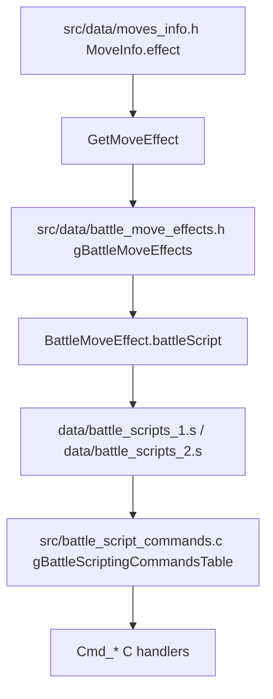
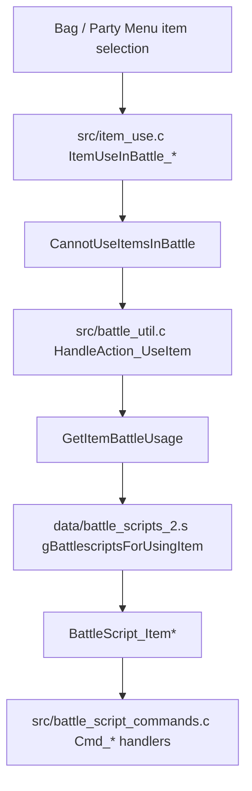

# Move / Item / Ability Map v15

## Purpose

今後の独自 move、item、ability、TM/HM、trainer party randomizer、battle selection で影響が大きい定義と実行処理の接続点を整理する。

この文書は source 読解メモであり、現時点では実装変更はしない。

## High-Level Ownership

| Area | Data owner | Runtime owner | UI / message owner | Risk |
|---|---|---|---|---|
| Move base data | `src/data/moves_info.h`, `include/move.h`, `include/constants/moves.h` | `src/battle_util.c`, `src/battle_script_commands.c`, `src/battle_move_resolution.c` | `src/battle_controller_player.c`, `src/item_menu.c`, `src/battle_message.c`, battle animation scripts | Very High |
| Battle move effect table | `src/data/battle_move_effects.h`, `include/constants/battle_move_effects.h` | `GetMoveBattleScript`, `gBattleScriptingCommandsTable` | `data/battle_scripts_1.s`, `data/battle_scripts_2.s` | Very High |
| Additional move effects | `struct AdditionalEffect`, `MoveInfo.additionalEffects` | `Cmd_setpreattackadditionaleffect`, `Cmd_setadditionaleffects`, `SetMoveEffect` | Battle strings / popup scripts | Very High |
| Item base data | `src/data/items.h`, `include/item.h`, `include/constants/items.h` | `src/item.c`, `src/item_use.c`, `src/battle_util.c` | `src/item_menu.c`, `src/party_menu.c`, item icons | High |
| Item effect byte data | `src/data/pokemon/item_effects.h`, `include/constants/item_effects.h` | `GetItemEffect`, medicine / X item / PP item code | Party menu, bag menu, battle item UI | High |
| Held item effects | `include/constants/hold_effects.h`, `src/data/hold_effects.h`, `include/battle_hold_effects.h` | `ItemBattleEffects`, move-end / switch-in / end-turn hooks | Battle scripts / messages | Very High |
| Ability base data | `src/data/abilities.h`, `include/pokemon.h`, `include/constants/abilities.h` | `AbilityBattleEffects`, `GetBattlerAbilityInternal`, many battle helpers | Battle popup, ability messages, summary/status UI | Very High |
| Trainer party data | `src/data/trainers.party`, generated `src/data/trainers.h`, `include/data.h` | `CreateNPCTrainerPartyFromTrainer`, `DoTrainerPartyPool` | Potential party preview / trainer UI | High |

## MoveInfo

Confirmed files:

| File | Important symbols |
|---|---|
| `include/move.h` | `struct BattleMoveEffect`, `struct AdditionalEffect`, `struct MoveInfo`, `gMovesInfo`, `gBattleMoveEffects`, `GetMoveEffect`, `GetMoveBattleScript`, many `GetMove*` helpers |
| `src/move.c` | Includes `src/data/moves_info.h` so `gMovesInfo` is compiled from data header |
| `src/data/moves_info.h` | `const struct MoveInfo gMovesInfo[MOVES_COUNT_ALL]` |
| `include/constants/moves.h` | `enum Move`, `MOVES_COUNT`, `MOVES_COUNT_ALL`, `MOVE_DEFAULT`, `MOVE_UNAVAILABLE` |
| `include/constants/battle_move_effects.h` | `enum BattleMoveEffects`, `NUM_BATTLE_MOVE_EFFECTS` |
| `src/data/battle_move_effects.h` | `const struct BattleMoveEffect gBattleMoveEffects[NUM_BATTLE_MOVE_EFFECTS]` |

`struct MoveInfo` is not just display data. It mixes:

| Field group | Fields / symbols | Notes |
|---|---|---|
| Display | `name`, `description` | Battle messages, move list, TM/HM info, summary/relearner UI read these through getters. |
| Core battle stats | `effect`, `type`, `category`, `power`, `accuracy`, `target`, `pp`, `priority` | `GetMoveEffect`, `GetMoveType`, `GetMovePower`, `GetMoveTarget`, `GetMovePP`, `GetBattleMovePriority` and AI code use these heavily. |
| Hit behavior | `strikeCount`, `multiHit`, `explosion`, `criticalHitStage`, `alwaysCriticalHit` | Multi-hit and special hit count logic enters battle resolution and AI. |
| Secondary effects | `additionalEffects`, `numAdditionalEffects` | `numAdditionalEffects` is a 3-bit field, so the local structure supports up to 7 additional effects. |
| Move flags | `makesContact`, `ignoresProtect`, `soundMove`, `punchingMove`, `bitingMove`, `powderMove`, `danceMove`, `healingMove`, etc. | Abilities, held items, protection, AI, and move restrictions inspect these flags. |
| Ability/protection bypass | `ignoresTargetAbility`, `ignoresTargetDefenseEvasionStages`, `ignoresSubstitute` | `ClearDamageCalcResults` and target effect blockers use these; custom moves can accidentally bypass large parts of battle logic. |
| Copy / ban flags | `gravityBanned`, `mirrorMoveBanned`, `metronomeBanned`, `sleepTalkBanned`, `sketchBanned`, etc. | Randomizer / generated moves / move copying features need these to avoid illegal behavior. |
| Effect arguments | `argument.*` union | Different `effect` values interpret the same storage differently. A move's data shape depends on its `BattleMoveEffects` value. |
| Contest / animation | `contestEffect`, `contestCategory`, `contestCombo*`, `battleAnimScript` | Battle animation and contest systems are separate from battle effect logic. |

Important confirmed getters:

| Getter | What it does |
|---|---|
| `SanitizeMoveId(enum Move moveId)` | Asserts `moveId < MOVES_COUNT_ALL`, fallback `MOVE_NONE`. |
| `GetMoveEffect(enum Move moveId)` | Returns `gMovesInfo[move].effect`. |
| `GetMoveAdditionalEffectById(enum Move moveId, u32 effect)` | Returns an entry from `MoveInfo.additionalEffects`. |
| `GetMoveAnimationScript(enum Move moveId)` | Returns `MoveInfo.battleAnimScript`, with assert/fallback. |
| `GetMoveBattleScript(enum Move moveId)` | Uses `gBattleMoveEffects[GetMoveEffect(moveId)].battleScript`; missing script falls back to `EFFECT_PLACEHOLDER`. |

### Move ID Limits

Confirmed storage limits:

| Location | Fact |
|---|---|
| `src/pokemon.c` | `STATIC_ASSERT(MOVES_COUNT_ALL < (1 << 11), PokemonSubstruct1_moves_TooSmall)` |
| `include/pokemon.h` | `BattlePokemon.moves[MAX_MON_MOVES]` stores `enum Move`, but boxed Pokemon substructs store moves in 11-bit fields. |
| `include/constants/moves.h` | `MOVES_COUNT_ALL = MOVES_COUNT_DYNAMAX`; `MOVE_UNAVAILABLE = 0xFFFF`. |

Risk:

- Custom normal moves should be added before the normal `MOVES_COUNT` boundary, not after Z / Max move ranges, unless the feature is explicitly a Z / Max move.
- Any large move addition must keep `MOVES_COUNT_ALL < 2048` unless save layout is deliberately changed.
- `MOVE_DEFAULT` comment says it must remain below `0x4000` because it is used with `VarGet`.

## BattleMoveEffects

`MoveInfo.effect` points to `enum BattleMoveEffects`, not directly to C code. The runtime path is:

Confirmed examples in `src/data/battle_move_effects.h`:

| Effect | Battle script | Notes |
|---|---|---|
| `EFFECT_PLACEHOLDER` | `BattleScript_EffectPlaceholder` | Fallback / not implemented behavior. |
| `EFFECT_HIT` | `BattleScript_EffectHit` | Generic damaging move path. |
| `EFFECT_NON_VOLATILE_STATUS` | `BattleScript_EffectNonVolatileStatus` | Also sets `encourageEncore = TRUE`. |
| `EFFECT_ABSORB` | `BattleScript_EffectHit` | Uses generic hit script, with effect-specific post-processing elsewhere. |
| `EFFECT_DREAM_EATER` | `BattleScript_EffectDreamEater` | Custom script path. |

The table also stores metadata used outside direct damage:

- `battleTvScore`
- `battleFactoryStyle`
- `encourageEncore`
- `twoTurnEffect`
- `semiInvulnerableEffect`
- `usesProtectCounter`

This means changing an effect can alter Battle TV, Battle Factory style, Encore AI, two-turn state, semi-invulnerable handling, and Protect counters.

## AdditionalEffect / MoveEffect

There are two effect enums that must not be confused:

| Enum | Defined in | Role |
|---|---|---|
| `enum BattleMoveEffects` | `include/constants/battle_move_effects.h` | Main move script/effect class used by `MoveInfo.effect`. |
| `enum MoveEffect` | `include/constants/battle.h` | Status/stat/secondary effect payload applied by `SetMoveEffect`. |

`struct AdditionalEffect` fields confirmed in `include/move.h`:

| Field | Notes |
|---|---|
| `moveEffect` | Uses `enum MoveEffect`, not `enum BattleMoveEffects`. |
| `self` | Applies to user instead of target. |
| `onlyIfTargetRaisedStats` | Used by conditional effects like Burning Jealousy style behavior. |
| `onChargeTurnOnly` | Connects to two-turn move charge behavior. |
| `sheerForceOverride` | Edge cases for Sheer Force. |
| `preAttackEffect` | Runs before damage through `Cmd_setpreattackadditionaleffect`. |
| `multistring` | Battle message selector. |
| `chance` | `0` means certain / primary effect; chance is modified by `CalcSecondaryEffectChance`. |

Important runtime functions:

| Function | File | Role |
|---|---|---|
| `Cmd_setpreattackadditionaleffect` | `src/battle_script_commands.c` | Iterates `GetMoveAdditionalEffectById` before damage. |
| `Cmd_setadditionaleffects` | `src/battle_script_commands.c` | Applies post-hit additional effects. |
| `SetMoveEffect` | `src/battle_script_commands.c` | Central status/stat/secondary effect application. Checks ability, Shield Dust / Covert Cloak style blockers, Sheer Force, substitute, fainted target, Safeguard, status immunity, and battle script continuation. |
| `CalcSecondaryEffectChance` | `src/battle_util.c` | Modifies chance for Serene Grace and Rainbow side status. |
| `MoveHasAdditionalEffect*` helpers | `src/battle_util.c` | AI and effect helper queries. |

Risk:

- A custom move with an existing `BattleMoveEffects` script but a new `AdditionalEffect` can still require battle message and AI updates.
- A custom `MoveEffect` generally requires `SetMoveEffect` support, string support, and tests.
- Secondary effects can be suppressed by abilities/items, so expected behavior must be tested against Shield Dust, Covert Cloak, Sheer Force, Substitute, Safeguard, and status immunity.

## ItemInfo

Confirmed files:

| File | Important symbols |
|---|---|
| `include/item.h` | `struct ItemInfo`, `struct BagPocket`, `struct TmHmIndexKey`, `gItemsInfo`, `gBagPockets`, `gTMHMItemMoveIds`, item getters |
| `include/constants/items.h` | `enum Item`, `enum ItemType`, `enum EffectItem`, `ITEMS_COUNT` |
| `src/item.c` | `gBagPockets`, `gTMHMItemMoveIds`, `GetItem*` functions, bag pocket operations |
| `src/data/items.h` | `const struct ItemInfo gItemsInfo[]` |
| `src/data/pokemon/item_effects.h` | Medicine / X item / PP item effect byte arrays |
| `include/constants/item_effects.h` | Item effect byte masks |
| `src/item_use.c` | Field / bag / battle item use callbacks |

`struct ItemInfo` fields confirmed in `include/item.h`:

| Field | Notes |
|---|---|
| `price`, `secondaryId` | Used by shop, balls, and item-specific behavior. |
| `fieldUseFunc` | Out-of-battle callback such as `ItemUseOutOfBattle_TMHM`. |
| `description`, `effect`, `name`, `pluralName` | UI text and effect byte pointer. |
| `holdEffect`, `holdEffectParam` | Held item runtime behavior. |
| `importance`, `notConsumed` | Key-item / reusable / consumption behavior. |
| `pocket`, `sortType`, `type` | Bag pocket, sort, and use callback routing. |
| `battleUsage` | Index into battle item script table. Must be non-zero for battle script usage. |
| `flingPower` | Fling and battle helpers. |
| `iconPic`, `iconPalette` | Bag/item UI graphics. |

Important getter/runtime facts:

- `SanitizeItemId` asserts `itemId < ITEMS_COUNT`.
- `GetItemEffect` returns `gItemsInfo[item].effect`, except `ITEM_ENIGMA_BERRY_E_READER` may read `gSaveBlock1Ptr->enigmaBerry.itemEffect`.
- `GetItemBattleUsage` maps Enigma Berry effect byte type to `EFFECT_ITEM_*`; otherwise it returns `gItemsInfo[item].battleUsage`.
- `SetBagItemsPointers` maps `gBagPockets[POCKET_*].itemSlots` into `gSaveBlock1Ptr->bag.*`, including `TMsHMs`.

### Item Battle Usage

`include/constants/items.h` defines `enum EffectItem`; `data/battle_scripts_2.s` maps these IDs to battle scripts in `gBattlescriptsForUsingItem`.

| `EffectItem` | Battle script |
|---|---|
| `EFFECT_ITEM_RESTORE_HP` | `BattleScript_ItemRestoreHP` |
| `EFFECT_ITEM_CURE_STATUS` | `BattleScript_ItemCureStatus` |
| `EFFECT_ITEM_HEAL_AND_CURE_STATUS` | `BattleScript_ItemHealAndCureStatus` |
| `EFFECT_ITEM_INCREASE_STAT` | `BattleScript_ItemIncreaseStat` |
| `EFFECT_ITEM_SET_MIST` | `BattleScript_ItemSetMist` |
| `EFFECT_ITEM_SET_FOCUS_ENERGY` | `BattleScript_ItemSetFocusEnergy` |
| `EFFECT_ITEM_ESCAPE` | `BattleScript_RunByUsingItem` |
| `EFFECT_ITEM_THROW_BALL` | `BattleScript_BallThrow` |
| `EFFECT_ITEM_REVIVE` | `BattleScript_ItemRestoreHP` |
| `EFFECT_ITEM_RESTORE_PP` | `BattleScript_ItemRestorePP` |
| `EFFECT_ITEM_INCREASE_ALL_STATS` | `BattleScript_ItemIncreaseAllStats` |
| `EFFECT_ITEM_USE_POKE_FLUTE` | `BattleScript_UsePokeFlute` |

Runtime path:

Risk:

- New battle item behavior usually needs `enum EffectItem`, `gBattlescriptsForUsingItem`, battle script commands or an existing script, item-use validation, AI item logic, and messages.
- `CannotUseItemsInBattle` rejects trainer-battle escape item use and Poké Ball throwing states; trainer battle rules are therefore affected by item changes.
- Item UI changes need `src/item_menu.c`, icon data, and text fit tests.

### Item ID / Save Limits

Confirmed storage limits:

| Location | Fact |
|---|---|
| `include/pokemon.h` | `PokemonSubstruct0::heldItem:10`, comment says 1023 items. |
| `src/pokemon.c` | `STATIC_ASSERT(ITEMS_COUNT < (1 << 10), PokemonSubstruct0_heldItem_TooSmall)` |
| `src/pokemon.c` | Comment says if `ITEMS_COUNT` grows too high, options include reducing item IDs, widening heldItem bits, or reusing unused IDs. |

Risk:

- Bag item IDs and held item IDs are not equally safe. Any item that can be held must fit the boxed Pokemon held-item storage.
- Widening held-item storage is save-layout risk and should not be mixed into unrelated feature work.

## Held Item Effects

Confirmed files:

| File | Important symbols |
|---|---|
| `include/constants/hold_effects.h` | `enum HoldEffect`, `HOLD_EFFECT_COUNT` |
| `include/battle_hold_effects.h` | `struct HoldEffectInfo`, `ActivationTiming`, `ItemBattleEffects`, `IsOn*Activation` helpers |
| `src/data/hold_effects.h` | `gHoldEffectsInfo[HOLD_EFFECT_COUNT]` |
| `src/battle_hold_effects.c` | Held item activation helpers and `ItemBattleEffects` |

`struct HoldEffectInfo` stores activation timing flags:

- `onSwitchIn`
- `mirrorHerb`
- `whiteHerb`
- `whiteHerbEndTurn`
- `onStatusChange`
- `onHpThreshold`
- `keeMarangaBerry`
- `MentalHerb`
- `onTargetAfterHit`
- `onAttackerAfterHit`
- `lifeOrbShellBell`
- `leftovers`
- `orbs`
- `onEffect`
- `onFling`
- `boosterEnergy`

`ItemBattleEffects(enum BattlerId itemBattler, enum BattlerId battler, enum HoldEffect holdEffect, ActivationTiming timing)`:

- Uses `gLastUsedItem` for berry activation / Fling activation.
- Otherwise uses `gBattleMons[itemBattler].item`.
- Exits early for `HOLD_EFFECT_NONE`, timing mismatch, Unnerve blocking, and most fainted battlers.
- Switches on `holdEffect` and calls per-item logic such as `TryDoublePrize`, `TryRoomService`, `TryTerrainSeeds`, `TryBoosterEnergy`, `RestoreWhiteHerbStats`, and others.

Major call-site families:

| Timing | Representative files |
|---|---|
| Switch-in | `src/battle_switch_in.c` |
| Move end / after hit / HP threshold | `src/battle_move_resolution.c` |
| End turn | `src/battle_end_turn.c` |
| Forced item activation / Fling / item scripts | `src/battle_script_commands.c` |
| AI assumptions | `src/battle_ai_main.c`, `src/battle_ai_switch.c`, `src/battle_ai_util.c` |

Risk:

- A new held item is not just `ItemInfo.holdEffect`. It also needs an activation timing entry in `gHoldEffectsInfo`, implementation in `ItemBattleEffects` or another hook, message scripts, AI, and tests.
- A custom trainer randomizer that changes held items can alter switch-in, move-end, and end-turn behavior even if moves are unchanged.

## AbilityInfo

Confirmed files:

| File | Important symbols |
|---|---|
| `include/constants/abilities.h` | `enum Ability`, `ABILITIES_COUNT` |
| `include/pokemon.h` | `struct AbilityInfo`, `struct SpeciesInfo.abilities[NUM_ABILITY_SLOTS]`, `PokemonSubstruct3::abilityNum:2`, `BattlePokemon.abilityNum:2` |
| `src/data/abilities.h` | `const struct AbilityInfo gAbilitiesInfo[ABILITIES_COUNT]` |
| `src/data/pokemon/species_info/*_families.h` | species ability slots |
| `src/pokemon.c` | `GetAbilityBySpecies`, `GetMonAbility`, `GetSpeciesAbility` |
| `include/battle_util.h` | `enum AbilityEffect`, `AbilityBattleEffects`, `GetBattlerAbilityInternal` |
| `src/battle_util.c` | `AbilityBattleEffects`, `GetBattlerAbilityInternal`, ability helper functions |

`struct AbilityInfo` is mostly metadata:

| Field | Notes |
|---|---|
| `name`, `description` | UI and battle messages. |
| `aiRating` | Used heavily by battle AI. Negative/positive values influence move/switch decisions. |
| `cantBeCopied` | Role Play / Doodle style restrictions. |
| `cantBeSwapped` | Skill Swap / Wandering Spirit style restrictions. |
| `cantBeTraced` | Trace restriction. |
| `cantBeSuppressed` | Gastro Acid / Neutralizing Gas style restriction. |
| `cantBeOverwritten` | Entrainment / Worry Seed / Simple Beam restrictions. |
| `breakable` | Mold Breaker and clones can bypass. |
| `failsOnImposter` | Special Imposter handling. |

Ability behavior is mostly not in `src/data/abilities.h`. It is spread across:

| Runtime area | Confirmed symbols |
|---|---|
| Ability selection from Pokemon | `GetAbilityBySpecies`, `GetMonAbility`, `GetSpeciesAbility` |
| Battle ability visibility / suppression | `GetBattlerAbilityInternal`, `CanBreakThroughAbility`, `GetBattlerAbility`, `GetBattlerAbilityIgnoreMoldBreaker` |
| Switch-in / end-turn / move-end behavior | `AbilityBattleEffects(enum AbilityEffect caseID, ...)` |
| Damage / accuracy / priority / type checks | Many helpers in `src/battle_util.c`, AI files, move resolution |
| AI | `gAbilitiesInfo[ability].aiRating`, `src/battle_ai_*.c` |

`enum AbilityEffect` currently groups major activation cases:

- `ABILITYEFFECT_ENDTURN`
- `ABILITYEFFECT_MOVE_END_ATTACKER`
- `ABILITYEFFECT_COLOR_CHANGE`
- `ABILITYEFFECT_MOVE_END`
- `ABILITYEFFECT_IMMUNITY`
- `ABILITYEFFECT_SYNCHRONIZE`
- `ABILITYEFFECT_ATK_SYNCHRONIZE`
- `ABILITYEFFECT_FORM_CHANGE_ON_HIT`
- `ABILITYEFFECT_MOVE_END_OTHER`
- `ABILITYEFFECT_MOVE_END_FOES_FAINTED`
- `ABILITYEFFECT_TERA_SHIFT`
- `ABILITYEFFECT_NEUTRALIZINGGAS`
- `ABILITYEFFECT_UNNERVE`
- `ABILITYEFFECT_ON_SWITCHIN`
- `ABILITYEFFECT_SWITCH_IN_FORM_CHANGE`
- `ABILITYEFFECT_COMMANDER`
- `ABILITYEFFECT_ON_WEATHER`
- `ABILITYEFFECT_ON_TERRAIN`
- `ABILITYEFFECT_OPPORTUNIST`

Risk:

- Adding an ability entry to `gAbilitiesInfo` only adds text/flags/AI rating. It does not implement the ability.
- New ability behavior may need changes in switch-in, move-end, damage calculation, status immunity, AI, messages, popup behavior, and tests.
- `abilityNum` is 2 bits, which matches current 3 ability slots. Expanding ability slots per species would be save-layout and UI risk.

## Trainer Battle Impact

Confirmed trainer data path:

| File | Important symbols |
|---|---|
| `include/data.h` | `struct TrainerMon`, `struct Trainer`, `TRAINER_PARTY` |
| `src/data/trainers.party` | Source trainer party data |
| `src/data/trainers.h` | Generated trainer data; header says do not modify directly |
| `src/trainer_pools.c` | `DoTrainerPartyPool`, `RandomizePoolIndices`, `PrunePool` |
| `src/battle_main.c` | `CreateNPCTrainerPartyFromTrainer`, `CustomTrainerPartyAssignMoves`, `CreateNPCTrainerParty` |
| `include/battle_main.h` | Declarations for trainer party creation helpers |

`struct TrainerMon` directly stores:

- `species`
- `heldItem`
- `ability`
- `moves[MAX_MON_MOVES]`
- `lvl`
- `nature`
- `teraType`
- `gigantamaxFactor`
- `shouldUseDynamax`
- `tags`

`CreateNPCTrainerPartyFromTrainer`:

- Handles normal trainer battles outside Frontier / e-Reader / Trainer Hill.
- Applies two-opponent party-size cap.
- Calls `DoTrainerPartyPool(trainer, monIndices, monsCount, battleTypeFlags)`.
- Creates each Pokemon with `CreateMon`.
- Sets held item with `SetMonData(MON_DATA_HELD_ITEM, ...)`.
- Assigns moves with `CustomTrainerPartyAssignMoves`.
- If explicit trainer ability is set, finds matching species ability slot and sets `MON_DATA_ABILITY_NUM`.
- If random trainer ability config is enabled, chooses an ability slot via `personalityHash`.
- Sets friendship, ball, nickname, shiny, Dynamax, Gigantamax, Tera type, and stats.

Implications:

- Trainer party reorder / randomizer can affect held item, ability, move, Tera, Dynamax, and pool rules at once.
- A pre-battle opponent party preview should use the post-pool generated order, or explicitly document that it shows raw trainer data.
- A custom item/ability/move that works in player battles must also be checked in `CreateNPCTrainerPartyFromTrainer` output and AI decisions.

## UI / Message Impact

Confirmed files:

| Area | Files / symbols |
|---|---|
| Battle string IDs | `include/constants/battle_string_ids.h`, `STRINGID_TABLE_START` |
| Battle message buffers | `include/battle_message.h`, `PREPARE_MOVE_BUFFER`, `PREPARE_ITEM_BUFFER`, `PREPARE_ABILITY_BUFFER`, `BATTLE_MSG_MAX_WIDTH`, `BATTLE_MSG_MAX_LINES` |
| Battle message expansion | `src/battle_message.c`, `BattleStringExpandPlaceholders` |
| Battle script printing | `src/battle_script_commands.c`, `Cmd_printstring`, `Cmd_printfromtable`, `Cmd_waitmessage` |
| Battle animations | `MoveInfo.battleAnimScript`, `GetMoveAnimationScript`, `data/battle_scripts_1.s` commands `attackanimation`, `hitanimation`, `waitanimation`, `waitstate` |
| Item menu TM/HM details | `src/item_menu.c`, `PrepareTMHMMoveWindow`, `PrintTMHMMoveData` |
| Party menu item/move use | `src/party_menu.c`, `ItemUseCB_TMHM`, move teaching / forgetting paths |

Important detail:

- `BattleStringExpandPlaceholders` resolves move names through `GetMoveName`, item names through item copy helpers, and ability names through `gAbilitiesInfo[ability].name`.
- New names can break text width even when the battle logic works.
- Battle messages are two-line constrained by `BATTLE_MSG_MAX_WIDTH` / `BATTLE_MSG_MAX_LINES`; long custom move/item/ability names need text tests and mGBA visual checks.

## Extension Checklist

Before changing moves:

1. Confirm `include/constants/moves.h` ID placement and `MOVES_COUNT_ALL` limit.
2. Add / inspect `src/data/moves_info.h`.
3. Decide whether an existing `BattleMoveEffects` script is sufficient.
4. If not sufficient, inspect `include/constants/battle_move_effects.h`, `src/data/battle_move_effects.h`, `data/battle_scripts_1.s`, `src/battle_script_commands.c`.
5. Inspect `AdditionalEffect` / `MoveEffect` needs.
6. Inspect AI references in `src/battle_ai_*.c`.
7. Inspect battle message and animation paths.
8. Test with trainer battle, double battle, ability blockers, held item blockers, and UI text.

Before changing items:

1. Confirm `include/constants/items.h` ID placement and held-item storage limit.
2. Add / inspect `src/data/items.h`.
3. Decide whether this is field-use, party-menu-use, battle-use, held item, or passive data only.
4. For battle use, inspect `enum EffectItem`, `gBattlescriptsForUsingItem`, `CannotUseItemsInBattle`, and AI item logic.
5. For held items, inspect `HOLD_EFFECT_*`, `gHoldEffectsInfo`, `ItemBattleEffects`, timing call sites, and messages.
6. For TM/HM, inspect `include/constants/tms_hms.h`, `gTMHMItemMoveIds`, bag capacity, `ItemUseOutOfBattle_TMHM`, `ItemUseCB_TMHM`, relearner, and shop scripts.
7. Test bag UI, party menu UI, battle UI, save/load, and trainer AI.

Before changing abilities:

1. Confirm `include/constants/abilities.h` ID placement.
2. Add / inspect `src/data/abilities.h`.
3. Add species slots in `src/data/pokemon/species_info/*_families.h` only after confirming species data ownership.
4. Implement / inspect behavior in `AbilityBattleEffects`, `GetBattlerAbilityInternal`, damage/status/move helpers, and AI.
5. Add message/popup behavior if the ability announces itself.
6. Test switch-in, move-end, end-turn, suppression, Mold Breaker, Trace/Skill Swap, and trainer battles.

## Open Questions

- 1.15.2 merge 後に `MoveInfo`, `ItemInfo`, `AbilityInfo`, `BattleMoveEffect`, `HoldEffectInfo` の構造が変わっていないか要再確認。
- Custom move ID をどこへ隔離するか未決定。upstream 追従を考えると、通常 move の末尾に直接追加すると merge conflict が起きやすい。
- Custom item が 1023 を超える可能性がある場合、持ち物可能 item と bag-only item を分ける設計が必要か要検討。
- Ability behavior の分散が大きい。新 ability ごとに `AbilityBattleEffects` だけで足りるか、damage calc / AI / status immunity 側も必要か個別調査が必要。
- Trainer party preview を実装する場合、raw trainer data 表示か `DoTrainerPartyPool` 後の生成済み party 表示か設計が必要。
