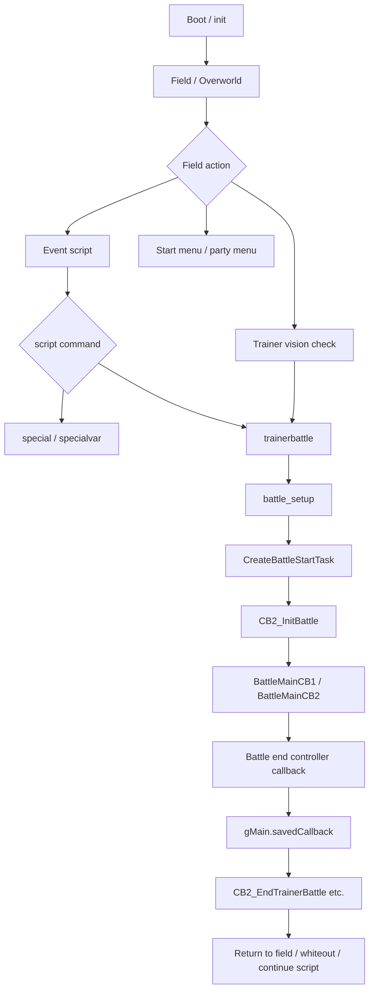

# Project Overview v15

調査日: 2026-05-01

この文書は pokeemerald-expansion 1.15.x 系の既存構造を、今後の大型改造に備えて俯瞰するための入口です。確認した内容に基づいて記述し、未確認の推測は断定しません。

## Purpose

- このリポジトリは `README.md` の記述どおり、pret の `pokeemerald` decompilation project をベースにした GBA ROM hack base。
- `README.md` では、単体で遊ぶゲームではなく、ROM hack 開発者向けの土台と説明されている。
- ローカルの `README.md` と `docs/changelogs/1.15.x/1.15.1.md` から、初回調査対象は pokeemerald-expansion 1.15.1 近辺として扱う。
- 2026-05-02 時点で upstream `RHH` には `expansion/1.15.2` tag も存在する。1.15.1 -> 1.15.2 の影響は `docs/upgrades/1_15_1_to_1_15_2_impact.md` に分離して記録する。
- `FEATURES.md` で確認できる主な拡張領域:
  - Gen IX までのポケモン、わざ、どうぐ、特性、バトルギミック。
  - ダブル野生戦、カスタムマルチ、2 vs 1 / 1 vs 2、Sky Battle などのバトル形式。
  - トレーナー個体の詳細カスタム、Trainer Pool、Trainer Slide、AI flag。
  - Party Menu、Storage、Summary、DexNav、Followers などの UI / overworld 拡張。
  - `include/config/*.h` による多数の機能トグル。
- 今後の独自拡張は、トレーナーバトル前選出だけでなく、マート設定、野生ポケモンの差し替え、TM/HM、アイテム、技、特性、フィールド秘伝技廃止、UI option / status 表示変更まで広がる前提で整理する。横断的な影響範囲は `docs/overview/extension_impact_map_v15.md`、間接呼び出しの確認は `docs/overview/callback_dispatch_map_v15.md` に分離した。

## Major Systems

| System | Main files/directories checked | Notes for future work |
|---|---|---|
| Field / Map | `src/field_control_avatar.c`, `src/overworld.c`, `data/maps/`, `data/map_events.s` | フィールド入力、マップイベント、トレーナー視線検知の入口。選出をフィールド上の通常戦に挟むなら影響範囲。 |
| Event Script | `src/script.c`, `src/scrcmd.c`, `data/script_cmd_table.inc`, `asm/macros/event.inc`, `data/scripts/` | `RunScriptCommand` が command table から `ScrCmd_*` を呼ぶ。`trainerbattle` と `special` はここが入口。 |
| Special | `data/specials.inc`, `src/scrcmd.c`, `src/script_pokemon_util.c`, `src/field_specials.c` | `special` / `specialvar` から `gSpecials[]` を呼ぶ。`ChooseHalfPartyForBattle` は special。 |
| Trainer Battle | `src/battle_setup.c`, `src/trainer_see.c`, `data/scripts/trainer_battle.inc`, `include/battle_setup.h` | `TrainerBattleParameter`、`BattleSetup_StartTrainerBattle`、接近トレーナー処理が中心。 |
| Battle Engine | `src/battle_main.c`, `src/battle_controller_player.c`, `src/battle_script_commands.c`, `src/battle_util.c` | `CB2_InitBattle` 以降が本体。`gBattleTypeFlags` と party 配列に強く依存。 |
| Battle UI | `src/battle_interface.c`, `src/battle_bg.c`, `src/battle_intro.c`, `src/battle_controller_player.c` | healthbox、party status summary、battle window、action/move menu。選出後の見え方に影響。 |
| Party Menu | `src/party_menu.c`, `include/party_menu.h`, `include/constants/party_menu.h`, `graphics/party_menu/` | 既存選出流用候補。`PARTY_MENU_TYPE_CHOOSE_HALF` と `gSelectedOrderFromParty` が重要。 |
| Summary / Move Relearner | `src/pokemon_summary_screen.c`, `src/move_relearner.c`, `include/config/summary_screen.h`, `data/scripts/move_relearner.inc` | 思い出し技、summary moves page、party menu action、script 起動。TM / 技追加時に `MAX_RELEARNER_MOVES` を確認。詳細は `docs/flows/move_relearner_flow_v15.md`。 |
| Pokemon Data | `src/pokemon.c`, `include/pokemon.h`, `src/data/pokemon/`, `include/constants/pokemon.h` | `gPlayerParty` / `gEnemyParty` 定義、`CalculatePlayerPartyCount`、`SavePlayerPartyMon`。 |
| Trainer Data | `src/data.c`, `include/data.h`, `src/data/trainers.h`, `src/data/trainers.party`, `src/data/trainer_parties.h`, `src/trainer_pools.c` | `struct Trainer`, `struct TrainerMon`, `gTrainers`, `GetTrainerStructFromId`、Trainer Party Pools。 |
| Pokemart / Shop | `src/shop.c`, `include/shop.h`, `src/scrcmd.c`, `data/maps/*Mart*/scripts.inc`, `data/maps/*DepartmentStore*/scripts.inc` | `ScrCmd_pokemart`、`CreatePokemartMenu`、`Task_BuyMenu`。品揃えや動的ショップを変える場合の入口。 |
| Wild Encounter | `src/wild_encounter.c`, `include/wild_encounter.h`, `src/data/wild_encounters.json`, `tools/wild_encounters/wild_encounters_to_header.py` | `StandardWildEncounter`、`TryGenerateWildMon`、`CreateWildMon`。野生ランダム化や出現テーブル変更の中心。 |
| DexNav | `include/config/dexnav.h`, `src/dexnav.c`, `src/start_menu.c`, `data/scripts/dexnav.inc` | Start menu DexNav、detector mode、hidden Pokemon、SaveBlock3 search level、12 land slots。詳細は `docs/flows/dexnav_flow_v15.md`。 |
| Item | `src/item.c`, `src/item_use.c`, `src/item_menu.c`, `src/data/items.h`, `include/item.h`, `include/constants/items.h` | item database、bag pocket、field use callback、shop、text test に波及。 |
| TM/HM / Field Move | `include/constants/tms_hms.h`, `src/field_move.c`, `include/field_move.h`, `data/scripts/field_move_scripts.inc`, `data/scripts/surf.inc`, `src/party_menu.c`, `src/field_effect.c` | `FOREACH_TM`、`FOREACH_HM`、`ScrCmd_checkfieldmove`、`gFieldMoveInfo`、`CreateFieldMoveTask`、`FldEff_FieldMoveShowMonInit`。field move 廃止 / modernize の中心。詳細は `docs/flows/field_move_hm_flow_v15.md`。 |
| Move | `include/constants/moves.h`, `include/move.h`, `src/data/moves_info.h`, `src/data/battle_move_effects.h`, `data/battle_scripts_1.s`, `data/battle_scripts_2.s` | 新技追加は data / effect / battle script / animation / AI / tests に波及。 |
| Ability | `include/constants/abilities.h`, `src/data/abilities.h`, `src/battle_util.c`, `src/battle_ai_main.c`, `src/battle_ai_util.c`, `src/battle_ai_switch.c` | 新特性追加は battle trigger、AI、copy/suppress flags、popup、species 割当へ波及。 |
| UI / Window | `src/window.c`, `src/text.c`, `src/menu.c`, `src/menu_helpers.c` | 専用 UI を作る段階で重要。MVP では party menu 流用が前提。 |
| Sprite / Graphics | `src/sprite.c`, `src/pokemon_icon.c`, `include/pokemon_icon.h`, `graphics/party_menu/`, `graphics/trainers/` | Party menu、DexNav、相手 party preview 候補の icon 描画。詳細は `docs/flows/pokemon_icon_ui_flow_v15.md`。 |
| Save Data | `src/load_save.c`, `src/save.c`, `include/save.h`, `include/load_save.h`, `include/global.h` | `SavePlayerParty` / `LoadPlayerParty` と SaveBlock1/2/3。DexNav search levels や独自 option 追加は `docs/flows/save_data_flow_v15.md` 参照。 |
| Config | `include/config/*.h` | 機能トグルが多い。大型更新では差分確認が必須。 |
| Build Tools | `Makefile`, `tools/`, `dev_scripts/`, `tools/trainerproc/` | trainer data 生成・変換系がある。1.15.2 では INCGFX migration により graphics build pipeline の差分が大きい。今回は読み取りのみ。 |
| Debug / Test | `src/debug.c`, `test/`, `include/test/` | Debug battle や battle tests がある。将来の検証に使える。 |
| Callback / Dispatch | `src/main.c`, `include/main.h`, `src/task.c`, `include/task.h`, `src/script.c`, `src/scrcmd.c`, `src/overworld.c` | `SetMainCallback2`、`CB2_*`、`CreateTask`、`ScrCmd_*`、`special`、`gFieldCallback`。改造前に必ず確認する間接実行経路。 |

## High-Level Runtime Flow

## Important Global Data

| Symbol | Definition checked | Main use | Relation to battle selection |
|---|---|---|---|
| `gPlayerPartyCount` | `src/pokemon.c`; extern in `include/pokemon.h` | 現在の手持ち数。`CalculatePlayerPartyCount` が更新。 | Very High. 一時選出 party を作るなら数も整合が必要。 |
| `gPlayerParty[PARTY_SIZE]` | `src/pokemon.c`; extern in `include/pokemon.h` | プレイヤー手持ち本体。battle, party menu, field move が参照。 | Very High. 選出個体だけを一時配置する中心データ。 |
| `gEnemyPartyCount` | `src/pokemon.c`; extern in `include/pokemon.h` | 敵 party 数。`CalculateEnemyPartyCount` が更新。 | Medium. 相手 party 表示を作るなら参照候補。 |
| `gEnemyParty[PARTY_SIZE]` | `src/pokemon.c`; extern in `include/pokemon.h` | 野生・トレーナー敵 party。`CB2_InitBattleInternal` が trainer party を作る。 | Medium. 相手表示 UI では利用候補。 |
| `gBattleTypeFlags` | `src/battle_main.c`; extern in `include/battle.h` | `BATTLE_TYPE_TRAINER`, `BATTLE_TYPE_DOUBLE`, `BATTLE_TYPE_MULTI` などの戦闘種別。 | Very High. 3匹/4匹選出条件、通常戦だけ対象にする判定に必要。 |
| `gTrainerBattleParameter` / `TRAINER_BATTLE_PARAM` | `src/battle_setup.c`, `include/battle_setup.h` | `trainerbattle` 引数を保持。`opponentA`, `opponentB`, `mode` など。 | Very High. 差し込み位置判定、相手情報表示、post battle script 復帰に関係。 |
| `gSpecialVar_Result` / `VAR_RESULT` | `src/event_data.c`, `include/constants/vars.h`, `data/event_scripts.s` | script / special の戻り値。`specialvar` や menu 結果に使用。 | High. 選出キャンセル・成功結果を script に戻すときに使える。 |
| `gSpecialVar_0x8000`..`gSpecialVar_0x800B` | `src/event_data.c`, `include/event_data.h`, `data/event_scripts.s` | script command / special の一時引数。 | Medium. 既存 choose half / frontier は `VAR_0x8004`, `VAR_0x8005`, `VAR_FRONTIER_FACILITY` に依存。 |
| `gSaveBlock1Ptr` | `src/load_save.c`, `include/load_save.h`, `include/global.h` | 保存データ 1。`vars`, `flags`, `playerParty`, `playerPartyCount` など。 | Very High. 元 party 退避・復元に使われる既存導線あり。 |
| `gSaveBlock2Ptr` | `src/load_save.c`, `include/load_save.h`, `include/global.h` | 保存データ 2。player name, options, frontier state など。 | High. `frontier.selectedPartyMons` は既存選出順の保存場所。通常戦に流用するかは要検討。 |
| `gSaveBlock3Ptr` | `src/load_save.c`, `include/global.h` | expansion 用 save state。`dexNavChain`、config 次第で `dexNavSearchLevels[NUM_SPECIES]`。 | High. DexNav search levels、randomizer seed、独自 unlock state 追加時の容量確認が必要。 |
| `gMain` | `src/main.c`, `include/main.h` | callback 管理、入力、`savedCallback`, `inBattle`。 | Very High. 選出 menu から battle setup に戻る callback 設計で重要。 |
| `gTasks[NUM_TASKS]` | `src/task.c`, `include/task.h` | 非同期 UI / animation / menu task。 | High. Party menu と battle transition は task で進む。 |
| `gSprites[MAX_SPRITES + 1]` | `src/sprite.c`, `include/sprite.h` | sprite 管理。 | Medium. 専用選出 UI を作る段階で重要。 |
| `gSelectedOrderFromParty[MAX_FRONTIER_PARTY_SIZE]` | `src/party_menu.c`, `include/party_menu.h` | choose half / frontier 選出順。値は 1-based party slot。 | Very High. 既存 UI 流用時の中核。 |
| `gBattleOutcome` | `src/battle_main.c`, `include/battle.h` | 戦闘結果。`gSpecialVar_Result` にコピーされる箇所あり。 | Medium. 終了後復元条件やテストで参照。 |
| `B_FLAG_NO_WHITEOUT` | `include/config/battle.h` | trainer battle loss 後の whiteout を防ぐための flag config。初期値は `0`。 | High. バトル後回復 / 強制 release の設計候補。ただし party は自動 heal されない。 |
| `FLAG_SYS_USE_STRENGTH` / `FLAG_SYS_USE_FLASH` | `include/constants/flags.h` から参照される system flags | Strength / Flash の field state。overworld reset 系で clear される。 | High. HM field action を消す場合も map state として残すか要判断。 |
| `gBattlerPartyIndexes[MAX_BATTLERS_COUNT]` | `src/battle_main.c`; extern in `include/battle.h` | battler と party slot の対応。 | Very High. 一時 party slot と元 party slot mapping を混同しないことが重要。 |
| `gBattleStruct` | `src/battle_main.c`; extern in `include/battle.h` | battle 中の大規模 state。partyState、itemLost、chosen move、intro state など。 | High. battle UI / party order / battle end 反映の調査対象。 |
| `gBattlePartyCurrentOrder[PARTY_SIZE / 2]` | `src/party_menu.c`; extern in `include/party_menu.h` | battle 中 party menu の order encoding。 | High. battle 中 switch menu と選出元 slot mapping が重なる。 |
| `gNoOfApproachingTrainers` / `gApproachingTrainers` | `src/trainer_see.c`, `include/trainer_see.h` | 視線検知した接近トレーナー数と script pointer。 | High. 接近トレーナー戦にも選出を入れるなら必須。 |
| `gDexNavSpecies` | `src/dexnav.c`, `include/dexnav.h` | DexNav battle 中の species marker。battle end と shiny rolls に使う。 | Medium. wild randomizer / DexNav 改造時に関係。trainer battle 選出とは別 flow。 |
| `gMoveRelearnerState` / `gRelearnMode` | `src/move_relearner.c`, `include/move_relearner.h` | 技思い出し候補種別と戻り先 mode。 | Medium. summary / party menu / script UI を変える時に関係。 |

## Notes

- 既存の `ChooseHalfPartyForBattle` は Battle Frontier / Link / e-Reader / Steven multi battle 系の用途で、通常トレーナー戦の前処理としては未接続。
- `ReducePlayerPartyToSelectedMons` は `gPlayerParty` を選出順に圧縮する既存関数だが、通常戦の終了後に元 slot へ battle 後状態を戻す仕組みはこの関数単体にはない。
- `SavePlayerParty` / `LoadPlayerParty` は `gSaveBlock1Ptr->playerParty` に退避・復元するため便利だが、通常フィールド中に save block 側を作業領域として使う設計はリスクがある。Battle Frontier では既存運用されているが、通常戦に流用するかは要設計。
- v15 以降で壊れやすそうな領域:
  - `src/battle_setup.c` の battle start/end callback。
  - `src/party_menu.c` の `PARTY_MENU_TYPE_CHOOSE_HALF` 周辺。
  - `src/script_pokemon_util.c` の party selection special。
  - `src/battle_interface.c` の healthbox / party status summary。
  - `src/trainer_pools.c` の trainer party pool / randomize。
  - `src/shop.c` の `CreatePokemartMenu` / `Task_BuyMenu` と `data/maps/*/scripts.inc` の mart lists。
  - `src/wild_encounter.c` と generated `src/data/wild_encounters.h` / source `src/data/wild_encounters.json` の関係。
  - `src/dexnav.c`、`include/config/dexnav.h`、`include/constants/wild_encounter.h` の DexNav enable / 12 slot / SaveBlock3 search levels。
  - `src/move_relearner.c`、`src/pokemon_summary_screen.c`、`include/constants/move_relearner.h` の思い出し技 UI と候補数。
  - `src/pokemon_icon.c`、`include/pokemon_icon.h` の icon palette / sprite lifetime。
  - `include/constants/tms_hms.h`、`src/field_move.c`、`data/scripts/field_move_scripts.inc`、`src/field_effect.c`、`src/fldeff_rocksmash.c` の TM/HM / field move policy と animation。
  - `src/battle_setup.c`、`include/config/battle.h`、`src/script_pokemon_util.c`、`src/pokemon_storage_system.c` の trainer battle aftercare / forced release。
  - `include/constants/items.h`、`src/data/items.h`、`src/item_use.c` の item ID / use callback。
  - `include/constants/moves.h`、`src/data/moves_info.h`、`src/data/battle_move_effects.h`、battle script source の move effect。
  - `include/constants/abilities.h`、`src/data/abilities.h`、`src/battle_util.c` の ability behavior。
  - `SetMainCallback2` / `CreateTask` / `ScrCmd_*` / `special` / field callback を使う画面遷移。
  - 1.15.2 以降では `INCGFX_*` asset declaration、`tools/preproc`、`tools/scaninc`、`Makefile` の generated asset handling。
  - `include/global.h` と `include/save.h` の save block 構造、特に `BattleFrontier.selectedPartyMons` と `struct SaveBlock3`。
  - `src/battle_main.c` の party 作成・battle init。

## Open Questions

- 通常トレーナー戦用の選出結果を `gSaveBlock2Ptr->frontier.selectedPartyMons` に置くべきか、専用 EWRAM / save 退避領域を新設すべきか。
- 通常戦で `SavePlayerParty` / `LoadPlayerParty` を使う場合、battle 中に進化・捕獲・フォルム変化・アイテム消費・状態異常をどこまで正しく元 slot へ戻せるか。
- `BATTLE_TYPE_DOUBLE` 判定だけで 4匹選出にしてよいか。`BATTLE_TYPE_MULTI`, `BATTLE_TYPE_TWO_OPPONENTS`, follower partner 戦を対象外にする必要がありそうだが未確定。
- 野生ランダム化、マート動的品揃え、TM/HM 追加、フィールド秘伝技廃止を build-time data 変更で行うか runtime hook で行うか。
- 新 option / status 表示を追加する場合、save data layout を変えるか、既存 config compile-time toggle に寄せるか。
- 全滅時の強制 release は、PC release UI の static task を流用せず専用 helper を作るべきか。現時点では未実装・未決定。
