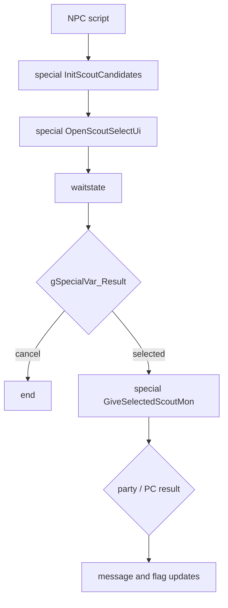

# Scout Selection and Battlefield Status Design v15

調査日: 2026-05-04。現時点では実装・改造は行わず、後続実装のための調査メモだけを追加する。

## Purpose

Battle Factory / Pokemon Champions 風に、NPC から複数候補 Pokemon をランダム提示し、専用スカウト画面で 1 匹だけ選んで獲得する flow を作る場合の入口を整理する。

あわせて、マップ / NPC / trainer ごとに「最初から場が変わっている battle」を作るため、既存の overworld weather、`setstartingstatus`、trainer `startingStatus`、Tera / Dynamax の制限状態を確認する。

結論:

- Scout UI は実装可能。Battle Factory select screen は参考になるが、Frontier save state と 3 体 rental 前提が強いため、直接流用より専用 CB2 / Task に分ける方が安全。
- Pokemon 付与は既存 `givemon` / `createmon` macro と `ScrCmd_createmon` / `ScriptGiveMonParameterized` の仕様に乗せられる。
- 初期場効果はすでに `setstartingstatus` と trainer `startingStatus` がある。Terrain、Trick Room、Tailwind、Rainbow、Sea of Fire、Swamp、hazards は既存入口あり。
- Reflect / Light Screen / Aurora Veil / Safeguard / Mist のような wall 系は現行 `STARTING_STATUS_DEFINITIONS` には未登録なので、同じ仕組みに追加する候補。
- Tera / Dynamax は mon data だけでなく activation gate がある。Frontier rental / facility mon では mon data はコピーされるが、AI が使うには `opponentMonCanTera` / `opponentMonCanDynamax` 相当の意図 flag も必要。
- Trainer battle 後の一時設定 cleanup は、通常の trainer defeated flag と混ぜない方が安全。`CB2_EndTrainerBattle` / `CB2_EndRematchBattle` の aftercare helper で、party restore 後かつ field return 前に処理する設計がよい。
- Battle Frontier の「レポートしてから挑戦」「途中で休む」「電源断後に lobby で状態判定する」仕組みは `frontier.challengeStatus` と lobby `MAP_SCRIPT_ON_FRAME_TABLE` が中心。Champions 風 challenge でもこの状態機械は参考にできる。
- 持ち物重複 NG は、挑戦開始時の選出 validation だけなら既存 Frontier に入口あり。party menu で「持たせる」操作自体を止めたい場合は、専用 flag / mode が立っている時だけ held item write path を guard する必要がある。
- Visible item ball の個数 3 は既存 `finditem` / `GetItemBallIdAndAmountFromTemplate` の範囲で対応可能。開封済み icon を残す場合は、標準 `Common_EventScript_FindItem` ではなく custom script / custom object 表示に分ける。

## Key Files

| Area | Files / Symbols |
|---|---|
| Script generation | `asm/macros/event.inc` `givemon`, `createmon`; `src/scrcmd.c` `ScrCmd_createmon`; `src/script_pokemon_util.c` `ScriptGiveMonParameterized` |
| Gift examples | `data/maps/*/scripts.inc` の `givemon`、`docs/tutorials/mon_generation.md` |
| CB2 / waitstate pattern | `data/specials.inc`, `special`, `waitstate`, `ScriptContext_Enable`, `CB2_ReturnToFieldContinueScript` |
| Battle Factory select UI | `src/battle_factory_screen.c`, `include/battle_factory_screen.h`, `DoBattleFactorySelectScreen`, `CB2_InitSelectScreen`, `Select_CopyMonsToPlayerParty` |
| Facility mon generation | `src/battle_frontier.c` `CreateFacilityMon`; `include/battle_frontier.h`; `src/data/battle_frontier/` via generated data |
| Frontier save / recovery | `src/battle_tower.c` `InitTowerChallenge`, `SaveTowerChallenge`; `src/frontier_util.c` `GetChallengeStatus`, `SaveGameFrontier`; `data/maps/BattleFrontier_*Lobby/scripts.inc`; `include/constants/battle_frontier.h` `CHALLENGE_STATUS_*` |
| Pokemon icon UI | `include/pokemon_icon.h`, `src/pokemon_icon.c`, `docs/flows/pokemon_icon_ui_flow_v15.md` |
| Battle start flow | `src/battle_main.c` `TryDoEventsBeforeFirstTurn`; `src/battle_setup.c`; `docs/flows/battle_start_end_flow_v15.md` |
| Battle aftercare | `src/battle_setup.c` `CB2_EndTrainerBattle`, `CB2_EndWildBattle`, `CB2_EndScriptedWildBattle`; `src/script_pokemon_util.c` `HealPlayerParty`; `src/pokemon.c` `HealPokemon`, `MonRestorePP` |
| Trainer flags / cleanup | `src/battle_setup.c` `SetTrainerFlag`, `ClearTrainerFlag`, `SetBattledTrainersFlags`; `src/scrcmd.c` `ScrCmd_settrainerflag`, `ScrCmd_cleartrainerflag`; `data/scripts/trainer_battle.inc` |
| Held item clause / give UI | `src/frontier_util.c` `CheckPartyIneligibility`; `src/party_menu.c` `CheckBattleEntriesAndGetMessage`, `CB2_GiveHoldItem`, `TryGiveItemOrMailToSelectedMon`, `CursorCb_MoveItemCallback`; `src/item_menu.c` `ItemMenu_Give`; `src/strings.c` held item messages |
| Held item restore | `src/battle_main.c` end path; `src/battle_util.c` `TryRestoreHeldItems`; `docs/features/battle_item_restore_policy/` |
| PP storage | `include/pokemon.h` `MON_DATA_PP1`, `MON_DATA_PP_BONUSES`; `src/pokemon.c` `CalculatePPWithBonus`, `MonRestorePP`; `src/battle_controllers.c` battle mon copy-back |
| Item ball pickup | `data/scripts/item_ball_scripts.inc` `Common_EventScript_FindItem`; `data/scripts/obtain_item.inc` `Std_FindItem`; `src/item_ball.c` `GetItemBallIdAndAmountFromTemplate`; `asm/macros/event.inc` `finditem`; `asm/macros/map.inc` `object_event` |
| Object event graphics | `include/constants/event_objects.h`; `src/data/object_events/object_event_graphics*.h`; `graphics/object_events/pics/misc/ball_*.png`; `include/config/overworld.h` `OW_FOLLOWERS_POKEBALLS` |
| Starting statuses | `include/constants/battle.h` `STARTING_STATUS_DEFINITIONS`; `include/data.h` `struct StartingStatuses`; `src/battle_util.c` `SetStartingStatus`, `TryFieldEffects` |
| Weather / terrain messages | `src/battle_message.c` `gWeatherStartsStringIds`, `gTerrainStartsStringIds`; `data/battle_scripts_1.s` `BattleScript_OverworldWeatherStarts`, `BattleScript_OverworldTerrain` |
| Gimmicks | `src/battle_gimmick.c`, `src/battle_dynamax.c`, `src/battle_terastal.c`, `src/data/gimmicks.h`, `include/config/battle.h` |

## Existing Pokemon Give Path

`givemon` is no longer a raw `ScrCmd_givepokemon` path in the script table. In `data/script_cmd_table.inc`, `SCR_OP_GIVEMON` points to `ScrCmd_nop1`, while `asm/macros/event.inc` defines `givemon` as a macro that calls native `ScrCmd_createmon` with side `0` and slot `PARTY_SIZE`.

Important facts:

| Symbol | Role |
|---|---|
| `givemon species, level, ...` | Script macro. Equivalent to creating a player-side mon and placing it in the first party / PC slot. |
| `createmon side, slot, species, level, ...` | Script macro. Can write to player side or enemy side. |
| `ScrCmd_createmon` | Parses optional item / ball / nature / ability / gender / EV / IV / moves / shiny / Gmax / Tera / Dmax args. |
| `ScriptGiveMonParameterized` | Creates `struct Pokemon`, sets custom fields, computes stats, and gives/copies it. |
| `GiveScriptedMonToPlayer` | Handles player party / PC placement and result code. |

This means a scout selection result can be applied in two ways:

1. Return selected candidate fields to script vars, then run `givemon` / `createmon`.
2. Let C own candidate data and call the same low-level generation path from a new helper.

The first option is easier to debug and script-friendly, but pushing a full moveset / EV / IV / Tera / Dmax result through many vars is awkward. The second option needs a small C API but keeps candidate data structured.

## Scout UI Proposal

Recommended MVP:



Suggested C ownership:

| State | Owner | Notes |
|---|---|---|
| Candidate pool id / rule id | script var or special argument | NPC can pick "route", "cave", "rare", "trainer reward", etc. |
| Generated candidates | EWRAM static buffer | Keep `struct Pokemon candidates[SCOUT_CANDIDATE_COUNT]` plus display metadata. |
| Selected index | `gSpecialVar_Result` or dedicated global | `SCOUT_RESULT_CANCEL` vs `0..count-1`. |
| Give result | `gSpecialVar_Result` from give helper | Preserve existing `MON_GIVEN_TO_PARTY` / PC / cant give behavior. |
| One-time NPC state | flag / var | Script should own whether a scout was claimed. |

### UI Entrypoint

Use a new file such as `src/scout_select_screen.c` with:

- `void DoScoutSelectScreen(void);`
- `static void CB2_InitScoutSelectScreen(void);`
- `static void CB2_ScoutSelectScreen(void);`
- one task for input, cursor, confirm/cancel, and summary launch.

Battle Factory's `DoBattleFactorySelectScreen` and `CB2_InitSelectScreen` show the needed pattern:

- allocate screen state;
- clear VRAM / BGs / windows;
- `ResetSpriteData`, `ResetTasks`, `FreeAllSpritePalettes`;
- create cursor and mon sprites;
- open summary with `ShowPokemonSummaryScreen(..., CB2_InitSelectScreen)`;
- on confirm, fade out and `SetMainCallback2(CB2_ReturnToFieldContinueScript)`.

Do not directly reuse `Select_CopyMonsToPlayerParty` for scout. It overwrites `gPlayerParty[0..2]`, writes `gSaveBlock2Ptr->frontier.rentalMons`, and assumes 3 selected mons. Scout should add one mon through the gift path instead.

### Candidate Display

Two display levels are possible:

| Option | Pros | Risks |
|---|---|---|
| Icon grid with text panel | Low sprite cost, can show 3-6 candidates. | Less dramatic than Factory full pics. |
| Battle Factory style full pic and balls | Existing visual precedent. | Uses custom assets, mon pic animation, and summary re-entry complexity. |

For MVP, use Pokemon icons:

- load icon palettes with `LoadMonIconPalettes()`;
- create candidate icons with `CreateMonIcon` / `CreateMonIconNoPersonality`;
- destroy icons and free palettes on exit;
- keep sprite count predictable.

The icon lifetime rules are already summarized in `docs/flows/pokemon_icon_ui_flow_v15.md`.

## NPC / Map Flow

NPC scripts should remain the owner of story state:

```asm
ScoutNpc_EventScript::
    lock
    faceplayer
    msgbox ScoutNpc_Text_Offer, MSGBOX_YESNO
    goto_if_eq VAR_RESULT, NO, ScoutNpc_EventScript_End
    setvar VAR_SCOUT_POOL_ID, SCOUT_POOL_ROUTE_01
    special InitScoutCandidates
    special OpenScoutSelectUi
    waitstate
    goto_if_eq VAR_RESULT, SCOUT_RESULT_CANCEL, ScoutNpc_EventScript_End
    special GiveSelectedScoutMon
    compare VAR_RESULT, MON_CANT_GIVE
    goto_if_eq ScoutNpc_EventScript_NoSpace
    setflag FLAG_SCOUT_ROUTE_01_CLAIMED
ScoutNpc_EventScript_End::
    release
    end
```

Implementation notes:

- Use normal object event scripts for NPC movement, hiding, and flags. See `docs/flows/npc_object_event_flow_v15.md`.
- If the UI can be opened from multiple maps, candidate generation must not depend on `gMapHeader` unless the pool explicitly wants map-local behavior.
- If candidates should be deterministic per run, store a seed or selected pool state. If random each interaction is acceptable, no save state is needed until a mon is claimed.

## Trainer Flag / Cleanup Design

Trainer defeated state already has dedicated helpers:

| Symbol | Role |
|---|---|
| `SetTrainerFlag(trainerId)` | Sets `TRAINER_FLAGS_START + trainerId`. |
| `ClearTrainerFlag(trainerId)` | Clears `TRAINER_FLAGS_START + trainerId`. |
| `SetBattledTrainersFlags()` | Normal win path sets trainer A and trainer B defeated flags. |
| `ScrCmd_settrainerflag` / `ScrCmd_cleartrainerflag` | Script commands behind `settrainerflag` / `cleartrainerflag`. |
| `GetTrainerFlag()` | Checks normal trainer, Battle Pyramid, or Trainer Hill defeated state depending on context. |

`BattleSetup_StartTrainerBattle()` sets `gMain.savedCallback = CB2_EndTrainerBattle`. On normal trainer win, `CB2_EndTrainerBattle()` eventually calls:

- `RegisterTrainerInMatchCall()`
- `SetBattledTrainersFlags()`
- `DowngradeBadPoison()`
- `SetMainCallback2(CB2_ReturnToFieldContinueScriptPlayMapMusic)`

This means the user assumption is mostly correct: battle end is the right zone for clearing challenge-only config / flags. The important caveat is that trainer defeated flags should remain owned by the normal battle flow unless the mode intentionally wants repeatable trainers.

Recommended design:

| State type | Owner | Cleanup timing |
|---|---|---|
| Permanent defeated trainer flag | Existing trainer battle flow | Do not clear in Champions aftercare unless repeatable trainer mode explicitly asks for it. |
| Challenge-mode enable flag | Script / config flag | Clear in a dedicated aftercare helper after party restore and before returning to field script. |
| Starting-status scratch data | C battle setup / `gStartingStatuses` | Clear after battle end or before next battle setup; do not rely on map script cleanup only. |
| Scout/rental temp party state | Scout / selection module | Restore original party first, then heal / item restore. |
| Post-battle heal / item restore policy | Aftercare helper | Run once per battle callback. |

Suggested helper shape:

```c
static void TryTrainerBattleAftercare(void)
{
    if (ShouldAfterBattleHeal(AFTER_BATTLE_TRAINER))
        HealPlayerParty();
    if (ShouldAfterBattleRestoreHeldItems(AFTER_BATTLE_TRAINER))
        RestoreConfiguredHeldItems();
    ClearScoutBattleScratchFlags();
}
```

Call order matters:

1. `HandleBattleVariantEndParty()`
2. follower / partner restore
3. scout / rental party restore, if added
4. after-battle heal and held-item policy
5. trainer flag updates and normal return callback

Do not clear `B_FLAG_NO_WHITEOUT` globally from this helper unless the flag was set by the scout/challenge module itself. It may be used by unrelated trainer battles.

Repeatable Champions trainers should be modeled separately:

| Option | Meaning | Risk |
|---|---|---|
| Do not call `SetBattledTrainersFlags()` | Trainer remains re-battlable. | Needs custom battle end branch or custom script; can break Match Call assumptions. |
| Call normal flow, then `cleartrainerflag` in script | Simple and visible. | There is a short period where trainer is defeated; rematch / object logic must tolerate it. |
| Dedicated `BATTLE_TYPE_CHAMPIONS` / mode flag | Cleanest long-term. | More code: trainer see checks, aftercare, UI, reward flow. |

For MVP, prefer script-visible `cleartrainerflag TRAINER_*` only on intentionally repeatable NPCs, and keep the global aftercare helper limited to heal / restore / scratch cleanup.

## Frontier Save / Report Recovery Pattern

Literal `WASOFRONTIER` symbols were not found in this checkout. The relevant existing system appears to be the Battle Frontier / Battle Tent challenge save flow.

The core state is `gSaveBlock2Ptr->frontier.challengeStatus`:

| Status | Meaning in existing Frontier scripts |
|---|---|
| `0` | No active challenge state. |
| `CHALLENGE_STATUS_SAVING` | Challenge is active, but the player did not use the allowed pause/save flow before quitting. Lobby scripts treat this as quit-without-saving / lost progress. |
| `CHALLENGE_STATUS_PAUSED` | Player selected the official rest/save option. On resume, lobby offers to continue and saves again before entering the facility. |
| `CHALLENGE_STATUS_WON` | Battle room marked the challenge as won; lobby script pays reward / ribbons / BP, then clears status. |
| `CHALLENGE_STATUS_LOST` | Battle room marked the challenge as lost; lobby script clears streak / thanks player, then clears status. |

Battle Tower start flow:

1. Receptionist script calls `special SavePlayerParty` before selection, so the full party is backed in save data.
2. `ChoosePartyForBattleFrontier` selects the challenge party.
3. `frontier_set FRONTIER_DATA_SELECTED_MON_ORDER` stores selected slots.
4. `tower_init` calls `InitTowerChallenge()`, which sets `challengeStatus = CHALLENGE_STATUS_SAVING`, resets battle number, clears paused state, and sets a dynamic warp.
5. The script calls `special LoadPlayerParty` to restore the full party before saving.
6. `Common_EventScript_SaveGame` performs the normal report flow. This is a full save, including Pokemon Storage.
7. The player enters the facility. If power is cut later without a valid pause save, loading back into the lobby sees `CHALLENGE_STATUS_SAVING`.

Mid-challenge pause flow:

| Step | Existing behavior |
|---|---|
| Player chooses rest/save | Battle room script calls `tower_save CHALLENGE_STATUS_PAUSED`. |
| `SaveTowerChallenge()` | Clears enemy party, writes `challengeStatus`, sets `challengePaused = TRUE`, then calls `SaveGameFrontier()`. |
| `SaveGameFrontier()` | Temporarily loads the saved full party, sets continue warp to the current dynamic warp, calls `TrySavingData(SAVE_LINK)`, then restores the in-memory challenge party. |
| `SAVE_LINK` | Writes SaveBlock1 / SaveBlock2 but skips Pokemon Storage. Existing script comments call out a PC clone/erase risk if combined incorrectly with optional full saves. |
| Soft reset | `frontier_reset` calls the Frontier soft reset helper. |
| Resume | Lobby `OnFrame` sees `CHALLENGE_STATUS_PAUSED`, asks to continue, calls `tower_save CHALLENGE_STATUS_SAVING`, clears `FRONTIER_DATA_PAUSED`, then re-enters the facility. |

The lobby reaction is script-driven. Battle Tower uses:

```asm
map_script_2 VAR_TEMP_CHALLENGE_STATUS, 0, BattleFrontier_BattleTowerLobby_EventScript_GetChallengeStatus
map_script_2 VAR_TEMP_CHALLENGE_STATUS, CHALLENGE_STATUS_SAVING, BattleFrontier_BattleTowerLobby_EventScript_QuitWithoutSaving
map_script_2 VAR_TEMP_CHALLENGE_STATUS, CHALLENGE_STATUS_PAUSED, BattleFrontier_BattleTowerLobby_EventScript_ResumeChallenge
map_script_2 VAR_TEMP_CHALLENGE_STATUS, CHALLENGE_STATUS_WON, BattleFrontier_BattleTowerLobby_EventScript_WonChallenge
map_script_2 VAR_TEMP_CHALLENGE_STATUS, CHALLENGE_STATUS_LOST, BattleFrontier_BattleTowerLobby_EventScript_LostChallenge
```

Design takeaways for Champions / scout challenge:

| Desired behavior | Suggested design |
|---|---|
| Save once before the challenge starts | Reuse the `SAVING` concept: set challenge state and seed / party snapshot first, then run the normal full `Common_EventScript_SaveGame`. |
| Power cut after start should reset / invalidate the run | Let the lobby / entry map see active non-paused state on boot, then run an explicit reset script: clear challenge scratch, restore party, heal, reset run seed, and return to pre-challenge state. |
| Official mid-run report should be allowed | Add a `PAUSED` state and a script-only rest point. Save via a Frontier-like helper after restoring the persisted full party view, then soft reset. |
| Avoid PC clone risk | For a new mode, prefer full save at initial entry. For mid-run save, either disallow PC access during the run or ensure the saved party / storage story is coherent before using `SAVE_LINK`-style partial saves. |
| Run can resume after official pause | Store enough run state in SaveBlock1/2/3: candidate seed, battle number, selected party/order, rental/scout mons, item clause flag, battlefield rule id, reward state. |
| Normal field saves should not accidentally persist challenge scratch | Disable normal save during active non-paused run, or make the save callback route through the challenge pause flow. |

For MVP, the safest custom policy is:

1. Enter challenge: set `CHAMPIONS_STATUS_ACTIVE_UNPAUSED`, save full game, then start the run.
2. Power cut / reset while active unpaused: entry map detects the status and runs "run aborted / reset" cleanup.
3. Official rest: set `CHAMPIONS_STATUS_PAUSED`, full heal / restore items if desired, save through a dedicated helper, then soft reset.
4. Resume from paused: set state back to active unpaused and save again before the next battle.

This matches the player-facing feel of Frontier while avoiding direct reliance on `frontier.challengeStatus`, which is already shared by all Frontier facilities.

## Held Item Duplicate Restriction

Frontier already has two useful item-clause checks:

| Location | Existing behavior |
|---|---|
| `src/frontier_util.c` `CheckPartyIneligibility()` | Counts eligible party mons while rejecting duplicate species and duplicate held items. This prevents entering if not enough legal mons exist. |
| `src/party_menu.c` `CheckBattleEntriesAndGetMessage()` | During battle-entry selection, duplicate held items return `PARTY_MSG_NO_SAME_HOLD_ITEMS`. |

Those checks validate challenge entry / selection, but they do not globally prevent a player from creating duplicates in the party menu. Normal gameplay can still give two Pokemon the same item unless a challenge-specific guard is added.

Recommended design:

| Rule | Design |
|---|---|
| Normal gameplay allows duplicates | Keep the new rule behind a flag / mode, e.g. `FLAG_CHAMPIONS_ITEM_CLAUSE_ACTIVE` or a runtime challenge status check. |
| Challenge/log/scout exchange screens enforce it | Set the flag before opening party / bag / exchange UI, and clear it only through challenge aftercare or mode exit. |
| Challenge entry catches pre-existing duplicates | Keep a validation step before "start challenge" that prints a dedicated duplicate-held-item message and refuses entry. |
| Party menu cannot create duplicates while active | Guard held-item write paths before `GiveItemToMon()` / item switch commit. |
| Stronger rule if needed | Hide or reject `GIVE` / `MOVE` while active and allow only `TAKE`, then revalidate before challenge battle. This is simpler but more restrictive. |

Candidate helper shape:

```c
static bool8 IsChampionsItemClauseActive(void)
{
    return FlagGet(FLAG_CHAMPIONS_ITEM_CLAUSE_ACTIVE);
}

static bool8 PartyHasDuplicateHeldItemExcludingSlot(enum Item item, u8 slot)
{
    u8 i;

    if (item == ITEM_NONE || ItemIsMail(item))
        return FALSE;
    for (i = 0; i < PARTY_SIZE; i++)
    {
        if (i == slot)
            continue;
        if (GetMonData(&gPlayerParty[i], MON_DATA_HELD_ITEM) == item)
            return TRUE;
    }
    return FALSE;
}
```

Likely hooks:

| Hook | Why |
|---|---|
| `CB2_GiveHoldItem()` | Party menu `ITEM -> GIVE` returns from Bag with `gSpecialVar_ItemId`; block before switch/give prompt. |
| `TryGiveItemOrMailToSelectedMon()` / `GiveItemToSelectedMon()` | Bag `GIVE` path chooses a mon then commits the held item. |
| `Task_HandleSwitchItemsYesNoInput()` | Switching an already held item with a bag item can create a duplicate of the new item. |
| `Task_HandleSwitchItemsFromBagYesNoInput()` | Same issue from the bag-origin path. |
| `CursorCb_MoveItemCallback()` | Pure swaps usually do not create a new duplicate, but if the stronger "no held-item edits while active" policy is chosen, block here too. |
| Challenge entry script / C special | Recheck final party before battle because Pokemon exchange, rental swap, or debug paths may bypass party menu. |

Message options:

| Option | Notes |
|---|---|
| Reuse `PARTY_MSG_NO_SAME_HOLD_ITEMS` | Good for selection validation. |
| Add a new party/bag message | Best for "this item cannot be held here because the same item is already held". |
| Reuse `gText_Var1CantBeHeld` / item-menu style text | Quick MVP, but less clear than a duplicate-specific message. |

Suggested wording:

```c
const u8 gText_DuplicateHeldItemNotAllowedHere[] =
    _("The same item can't be held\nfor this challenge.");
```

Important caution: do not make the flag global by config only. A compile-time default can enable the feature, but the actual restriction should be runtime-gated so normal maps, normal bag usage, trades, daycare, and non-Champions battles keep their existing behavior.

## Item Pickup / Opened Icon Design

### Quantity 3 Item Balls

Visible item ball quantity is already supported. `Common_EventScript_FindItem` calls `GetItemBallIdAndAmountFromTemplate()`, which reads:

- item id from `objectEvents[itemBallId].trainerRange_berryTreeId`
- quantity from `objectEvents[itemBallId].movementRangeX`

`finditem item, amount` also accepts an explicit amount. Therefore a normal visible item ball that gives 3 items can use the map object's `movement_range_x` / generated `x_radius` value as `3`, or a custom script can call `finditem ITEM_*, 3`.

Important limits:

- `asm/macros/map.inc` rejects `x_radius > 15` for object events because the field is a 4-bit bitfield.
- `src/item_ball.c` caps the amount to `MAX_BAG_ITEM_CAPACITY`.
- `Std_FindItem` checks bag space for the full amount and only removes the object if the item can be picked up.

### Keeping an Opened Object on the Map

The standard visible item ball flow always removes the object on success:

```asm
EventScript_PickUpItem::
    removeobject VAR_LAST_TALKED
    additem VAR_0x8004, VAR_0x8005
```

`removeobject` also sets the object's hide flag, so the object will stay gone after reload. That is correct for normal item balls, but it does not support "opened chest stays on the map" by itself.

For an opened / unopened chest style object, use one of these patterns:

| Pattern | Design |
|---|---|
| Two object events | Closed object is hidden by `FLAG_CHEST_OPENED`; opened object uses inverse visibility through a map script / object var if needed. |
| One persistent object + custom script | Do not call `finditem`; manually `checkitemspace`, `additem`, `setflag FLAG_CHEST_OPENED`, then on later talks show opened text. |
| Dynamic graphics var | Object uses `OBJ_EVENT_GFX_VAR_*`; map load script sets `VAR_OBJ_GFX_ID_*` to closed or opened graphics based on the flag. |
| Metatile swap | For tile-sized chests, use `setmetatile` / map script state instead of object graphics. |

The dynamic graphics route is good when the opened object still needs object-event behavior. The metatile route is better when the opened state is just scenery.

### Yellow / Rare Ball Graphics

The repo already contains many ball assets under `graphics/object_events/pics/misc/ball_*.png`, including Great / Ultra / Premier / Quick / Luxury and others. `OW_FOLLOWERS_POKEBALLS` is currently `TRUE`, so those assets are included for follower Pokeball graphics.

However, only `OBJ_EVENT_GFX_ITEM_BALL` is registered as a standard map object id. It points to `gObjectEventGraphicsInfo_PokeBall`. To use a yellow / rare ball as a map pickup object, add a real `OBJ_EVENT_GFX_*` id and graphics info pointer, or use a dynamic object graphics var that resolves to a newly registered graphics id.

Do not assume follower Pokeball assets automatically become map object ids. They are available source assets, but a map object still needs:

1. `OBJ_EVENT_GFX_*` constant in `include/constants/event_objects.h`.
2. `gObjectEventPic_*` / palette data if not already compiled in the desired config.
3. `sPicTable_*` frames in `src/data/object_events/object_event_pic_tables.h`.
4. `gObjectEventGraphicsInfo_*` in `src/data/object_events/object_event_graphics_info.h`.
5. pointer entry in `src/data/object_events/object_event_graphics_info_pointers.h`.
6. map `graphics_id` updated to the new constant.

### Object Sprite Size Cautions

The standard item ball is not an 8x8 sprite. Current data is:

| Asset / info | Current value |
|---|---|
| `graphics/object_events/pics/misc/ball_poke.png` | 80x32 indexed PNG, 5 frames of 16x32. |
| `gObjectEventGraphicsInfo_PokeBall` | width 16, height 32, size 256, `gObjectEventBaseOam_16x32`. |
| `sPicTable_PokeBall` | `overworld_frame(..., 2, 4, frame)` entries. |

The `2, 4` frame size means 2 tiles wide and 4 tiles high, so each frame is 16x32 pixels. If a new pickup sprite is 16x16, 32x16, or 32x32, the graphics info, base OAM, subsprite table, and pic table frame dimensions must match. A mismatched PNG size / frame count / OAM size is the kind of issue that causes corrupted overworld sprites.

Checklist for new object sprites:

| Check | Reason |
|---|---|
| Indexed 4bpp PNG and palette are valid | Object event assets are converted to 4bpp / `.gbapal`. |
| Width and height are multiples of 8 | GBA object tiles are 8x8. |
| Frame width / height match `overworld_frame` tile dimensions | Wrong tile dimensions read the next frame as part of the current frame. |
| `ObjectEventGraphicsInfo.size` matches one frame's tile bytes | Under/over-sized data corrupts later graphics. |
| OAM shape and subsprite table match dimensions | `16x32`, `16x16`, `32x32`, etc. must be consistent. |
| Palette slot / tag does not collide unexpectedly | Reusing NPC palette tags can recolor unrelated objects. |
| Shadow size is intentional | Small item balls and chests usually use inanimate objects with predictable shadow. |
| Movement type is static | Pickup objects should not use walking animation tables by accident. |

If the asset is meant to be a tile on the map rather than an interactable object, put it in the tileset/metatile path instead. Object events are better for interactable pickups, NPC-like objects, and stateful display.

## New UI Asset Cautions

Scout UI should use Pokemon icons for MVP because the repo already has icon loading and palette management. When adding new UI graphics, treat it as a separate asset pipeline from overworld object events.

UI checklist:

| Area | Check |
|---|---|
| BG allocation | Reserve charbase/screenbase and avoid colliding with text windows. |
| Windows | Add window templates, load border / font palettes, and remove windows on exit. |
| Sprite lifecycle | `ResetSpriteData`, `FreeAllSpritePalettes`, icon palette load, sprite destroy, palette free. |
| Callback return | Summary screen / confirm screen must return to the scout CB2 and then `CB2_ReturnToFieldContinueScript`. |
| VRAM pressure | Candidate icons, cursor, type icons, and summary launch should not exceed sprite tile/palette budget. |
| Text width | Candidate names, level, ability, item, Tera type, and move text need bounded windows. |
| Save state | UI should not mark the NPC claimed until the mon was actually given. |

Avoid mixing overworld object assets and UI assets unless the dimensions and palettes are intentionally built for both. Object event sprites are frame tables; UI graphics are usually BG tiles, compressed tilemaps, or regular sprites with their own templates.

## Starting Battlefield Effects

There are two existing sources for starting battle effects.

### Overworld Weather

`TryDoEventsBeforeFirstTurn` in `src/battle_main.c` runs:

1. `FIELD_EFFECT_OVERWORLD_WEATHER`
2. `FIELD_EFFECT_OVERWORLD_TERRAIN`
3. `FIELD_EFFECT_TRAINER_STATUSES`

`TryFieldEffects(FIELD_EFFECT_OVERWORLD_WEATHER)` maps current field weather to battle weather:

| Overworld weather | Battle result |
|---|---|
| rain / thunderstorm / downpour | `B_WEATHER_RAIN_NORMAL` |
| sandstorm | `B_WEATHER_SANDSTORM` |
| drought | `B_WEATHER_SUN_NORMAL` |
| snow | snow or hail depending on `B_OVERWORLD_SNOW` |
| fog | `B_WEATHER_FOG` when `B_OVERWORLD_FOG == GEN_4` |

`FIELD_EFFECT_OVERWORLD_TERRAIN` can also start:

| Condition | Battle result |
|---|---|
| `B_THUNDERSTORM_TERRAIN == TRUE` and `WEATHER_RAIN_THUNDERSTORM` | Electric Terrain, permanent timer `0` |
| `B_OVERWORLD_FOG >= GEN_8` and fog weather | Misty Terrain, permanent timer `0` |

This path is good for map-wide environmental rules. It is less precise for per-NPC battle rules.

### `setstartingstatus` / Trainer `startingStatus`

`asm/macros/event.inc` exposes:

```asm
setstartingstatus STARTING_STATUS_TRICK_ROOM
setstartingstatus STARTING_STATUS_ELECTRIC_TERRAIN_TEMPORARY
setstartingstatus STARTING_STATUS_RAINBOW_OPPONENT
```

The command calls `ScrCmd_setstartingstatus`, which calls `SetStartingStatus`. Trainer data also has `struct Trainer::startingStatus`, and `src/battle_main.c` merges trainer starting statuses into `gStartingStatuses` before first turn.

Supported statuses in `STARTING_STATUS_DEFINITIONS` include:

| Family | Supported examples |
|---|---|
| Terrain | Electric / Misty / Grassy / Psychic, permanent and temporary |
| Rooms | Trick Room / Magic Room / Wonder Room, permanent and temporary |
| Side effects | Tailwind player/opponent, Rainbow player/opponent, Sea of Fire player/opponent, Swamp player/opponent |
| Hazards | Spikes, Toxic Spikes, Sticky Web, Stealth Rock, Sharp Steel for player/opponent side |

Permanent forms use timer `0`; temporary forms use their normal duration. Existing tests in `test/battle/starting_status/terrain.c` and `test/battle/starting_status/hazards.c` confirm this behavior.

### Missing Wall-Like Starting Statuses

The current starting status list does not include these useful cases:

- Reflect
- Light Screen
- Aurora Veil
- Safeguard
- Mist

They live in `gSideStatuses` and are decremented in `src/battle_end_turn.c`, so they should be added by extending the same pattern:

1. Add enum entries to `STARTING_STATUS_DEFINITIONS`.
2. Add fields to `struct StartingStatuses` through the macro.
3. Add branches in `TryFieldEffects(FIELD_EFFECT_TRAINER_STATUSES)` using `SetStartingSideStatus`.
4. Pick string ids and battle anim ids, or add dedicated starting-status message ids if the normal move messages read awkwardly.
5. Add tests for permanent and temporary behavior.

For custom always-on solo field rules, prefer dedicated messages. Example: "A constant tailwind blows behind your team!" is clearer than reusing the normal Tailwind move text when the effect starts from the map.

## Boolean Logic Risk

The starting-status implementation uses a single `else if` chain and consumes one status per pass. `TryDoEventsBeforeFirstTurn` loops while `TryFieldEffects(FIELD_EFFECT_TRAINER_STATUSES)` returns true, so stacked statuses can still apply.

Two important constraints:

- Mutually exclusive terrain is enforced by `STATUS_FIELD_TERRAIN_ANY`; only one terrain remains active.
- Multiple side effects can stack if they are different flags and the loop gets another pass.

If adding more statuses, avoid trying to pack unrelated rules into one bitmask expression without tests. The safe pattern is one explicit branch per starting status, with a test that stacks at least two statuses.

## Tera / Dynamax and Frontier Notes

`givemon` / `createmon` can set:

- `gmaxFactor`
- `teraType`
- `dmaxLevel`

`CreateFacilityMon` also copies facility mon data into:

- `MON_DATA_DYNAMAX_LEVEL`
- `MON_DATA_GIGANTAMAX_FACTOR`
- `MON_DATA_TERA_TYPE`

However, activation has extra gates:

| Gimmick | Gate |
|---|---|
| Dynamax | `CanDynamax`, `ITEM_DYNAMAX_BAND` for player, configured `B_FLAG_DYNAMAX_BATTLE`, no previous Dynamax, no active other gimmick, no Mega Stone / Z-Crystal, trainer intent via `ShouldTrainerBattlerUseGimmick`. |
| Tera | `CanTerastallize`, `ITEM_TERA_ORB` for player, `B_FLAG_TERA_ORB_CHARGED` unless no-cost, no previous Tera, no active other gimmick, trainer intent via `ShouldTrainerBattlerUseGimmick`. |

For normal trainer parties, `CreateNPCTrainerPartyFromTrainer` sets `gBattleStruct->opponentMonCanDynamax` when `.shouldUseDynamax` is true, and `gBattleStruct->opponentMonCanTera` when `.teraType > 0`.

For Battle Factory / rental flows, `CreateFacilityMon` sets mon data but does not set those opponent intent bitfields. If facility enemies or rentals should actively use Tera / Dynamax, the facility party creation path needs a policy hook that marks intent after selecting the mon.

Scout reward mons can safely store Tera type / Dynamax level as data, but whether the player can activate those gimmicks still depends on item / flag state.

## Post-Battle Full Recovery Policy

Pokemon Champions / Battle Factory 風の連戦を作る場合、「大切な battle が終わったら毎回全回復する」処理は既存関数に乗せられる。

| Function | Current behavior |
|---|---|
| `HealPlayerParty()` | `gPlayerPartyCount` 分 `HealPokemon(&gPlayerParty[i])` を呼ぶ。`OW_PC_HEAL >= GEN_8` なら boxes も回復する。Tera Orb 所持時は `B_FLAG_TERA_ORB_CHARGED` も set する。 |
| `HealPokemon()` | HP を最大値へ戻し、primary status を消し、`MonRestorePP()` を呼ぶ。 |
| `MonRestorePP()` | 各 move の PP を `CalculatePPWithBonus(move, ppBonuses, slot)` で最大値へ戻す。 |
| `DoWhiteOut()` | whiteout script 後に `HealPlayerParty()` を呼んでから last heal location へ warp する。 |

既存 config / flag の近い例:

| Existing option | Usefulness | Limitation |
|---|---|---|
| `B_FLAG_NO_WHITEOUT` | Trainer loss 後に field script へ戻せる。 | comment 通り、party は自動回復しない。 |
| `FNPC_FLAG_HEAL_AFTER_FOLLOWER_BATTLE` | follower partner battle 後だけ heal する既存 flag pattern。 | follower battle 専用。 |
| `OW_PC_HEAL` | `HealPlayerParty` が boxes も対象にするか決める。 | Champions 風の post-battle heal policy ではない。 |

推奨は、`include/config/battle.h` などに新しい policy を足すこと。

```c
#define B_AFTER_BATTLE_HEAL_NONE       0
#define B_AFTER_BATTLE_HEAL_TRAINER    1
#define B_AFTER_BATTLE_HEAL_WILD       2
#define B_AFTER_BATTLE_HEAL_ALL        3
#define B_AFTER_BATTLE_HEAL_FLAG       4

#define B_AFTER_BATTLE_HEAL_MODE       B_AFTER_BATTLE_HEAL_NONE
#define B_FLAG_AFTER_BATTLE_HEAL       0
```

実装 hook 候補:

| Battle type | Hook | Notes |
|---|---|---|
| Trainer battle | `CB2_EndTrainerBattle` の party restore 後、return callback 決定前 | Battle selection / Sky Battle の一時 party 復元が先。loss/no-whiteout/forfeit を同じ helper で扱える。 |
| Rematch battle | `CB2_EndRematchBattle` | 通常 trainer と別 callback なので漏れに注意。 |
| Wild battle | `CB2_EndWildBattle` | 捕獲後や通常 wild も回復対象にするか policy で分ける。 |
| Scripted wild | `CB2_EndScriptedWildBattle` | NPC scripted encounter やイベント戦に必要。 |
| Frontier / facility | まず除外推奨 | 各施設に独自 `special HealPlayerParty` と held-item restore があるため、二重処理になりやすい。 |
| Link / recorded / Safari | 除外推奨 | 対戦結果保存、Safari 専用挙動、通信と衝突しやすい。 |

helper 案:

```c
static void TryAfterBattleHeal(enum AfterBattleKind kind)
{
    if (AfterBattleHealIsEnabled(kind))
        HealPlayerParty();
}
```

この helper は「party を元 slot へ戻した後」に呼ぶ。戦闘前選出やレンタル party を使う場合、先に一時 party の HP/status/PP を元 party へ copy-back しないと、回復対象が間違う。

## Item Reset / Revival Policy

戦闘後の道具リセットは、全回復とは別 policy にする方がよい。理由は、既存の held item restore が「回復」ではなく「戦闘中の消費・盗み・復元」の世代仕様として動いているため。

既存処理:

| Area | Current behavior |
|---|---|
| Normal battle end | `src/battle_main.c` が `B_TRAINERS_KNOCK_OFF_ITEMS == TRUE` または `B_RESTORE_HELD_BATTLE_ITEMS >= GEN_9` なら `TryRestoreHeldItems()` を呼ぶ。 |
| `TryRestoreHeldItems()` | player side の original item を参照して復元するが、Berry pocket の item は復元対象から外す。 |
| Battle Factory | `RestorePlayerPartyHeldItems()` が rental mon の元 held item を戻す。 |
| Frontier util / Dome / Pike / Pyramid | 施設ごとに selected party / saved party / backup から held item を戻す専用処理がある。 |

Champions 風ルールで必要になりそうな policy:

| Policy | Meaning | Suggested default |
|---|---|---|
| Full heal | HP/status/PP を毎戦後に戻す。 | flag / mode で有効化。 |
| Revive fainted mons | `HealPlayerParty()` に含める。 | Full heal と同一でよい。 |
| Restore non-berry held items | 既存 `B_RESTORE_HELD_BATTLE_ITEMS` に任せる。 | 現行維持。 |
| Restore berries / consumables | Champions / facility 風なら必要。 | 別 config。 |
| Reset battle-only rental items | Scout / rental で持たせた item を元 table に戻す。 | rental/scout 専用 state で管理。 |
| Reset bag item quantities | Battle item 使用を無消費にするか。 | MVP では除外。 |

追加するなら `B_AFTER_BATTLE_RESTORE_HELD_ITEMS_MODE` のように、既存 `B_RESTORE_HELD_BATTLE_ITEMS` を壊さない別名が読みやすい。`docs/features/battle_item_restore_policy/` の結論通り、battle 中は消費済み state を維持し、battle end aftercare で元 held item を戻す設計が安全。

## PP / EP Champions-Style Resource

現行 engine は PP 前提で広く接続されている。

| Area | PP dependency |
|---|---|
| Save data | `MON_DATA_PP1` ... `MON_DATA_PP4`, `MON_DATA_PP_BONUSES` |
| Battle mon | `struct BattlePokemon::pp`, `ppBonuses` |
| Battle controller | `src/battle_controllers.c` が party と battle mon の PP を相互 copy する。 |
| Move menu | `src/battle_controller_player.c`, `src/battle_main.c` が current PP / max PP を表示・選択に使う。 |
| AI | PP stall prevention、move availability、switch 判断が PP を読む。 |
| Items / abilities | Leppa Berry など `ItemRestorePp`、Spite、Grudge、Pressure 系が PP を直接扱う。 |
| Summary / move edit | Summary、move relearner、move order swap が PP と PP bonuses を維持する。 |

選択肢:

| Option | Feasibility | Notes |
|---|---|---|
| PP は現行のまま、戦闘後 heal で毎回全回復 | Easy / recommended MVP | Champions 風の「毎戦リセット」体験はほぼ満たせる。 |
| PP 表示だけ簡略化する | Medium | UI 表示だけなら影響は battle menu / summary 中心。ただし内部 PP は残す。 |
| EP を新リソースとして追加する | High risk | move selection、AI、save data、item/ability、battle script、text、tests へ広範囲に波及する。 |
| EP を battle-local resource にする | Medium-high | save data を触らずに済むが、PP消費技・PP回復技・AIとの整合性を別途作る必要がある。 |

MVP は **PP維持 + post-battle full heal** が最も現実的。EP 化は「Champions 風UIの見た目」なのか「技使用回数ルール自体を変える」のかを先に分ける。後者なら別 feature として `battle_controller_player.c`、`battle_controllers.c`、`battle_script_commands.c`、`battle_ai_*.c`、`pokemon_summary_screen.c`、`item_use.c`、`battle_hold_effects.c` をまとめて調査する。

## PB / Reward Currency Notes

`PB` は文脈上 Battle Points / 独自ポイント / Pokeblock のどれを指すか決める必要がある。repo には両方の既存資産がある。

| Candidate | Existing assets | Fit |
|---|---|---|
| Battle Points (`BP`) | `gSaveBlock2Ptr->frontier`、`gText_BP` / `gText_NumBP`、Frontier scripts の point reward | Battle Factory / facility 風の報酬に近い。 |
| Pokeblock (`PBLOCK`) | `src/pokeblock.c`, `include/pokeblock.h`, Safari pokeblock throw | 育成/コンディション系。battle reward currency には向かない。 |
| Custom point bank | new save field or var | Champions 風の独自運営には自由度が高いが save layout と UI が必要。 |

短期的には、報酬は script var / save var で小さく始め、Frontier BP と統合するかは後で決める方が安全。Frontier BP を流用すると既存施設・店・trainer card 表示と連動しやすい反面、独自モードの経済バランスが施設全体へ漏れる。

## Ability Upgrade / Fix Workbench

一部特性の強化・修正を進めるなら、`docs/overview/move_item_ability_map_v15.md` と `docs/flows/battle_effect_resolution_flow_v15.md` を主導線にする。

追加調査で見るべき checklist:

| Area | Files / symbols | Why |
|---|---|---|
| Ability ID / metadata | `include/constants/abilities.h`, `src/data/abilities.h` | name、description、flags、AI rating はここ。 |
| Ability slot | `src/data/pokemon/species_info/*_families.h`, `GetAbilityBySpecies` | species に合法 slot として持たせるか、trainer 専用の違法 ability を許すか。 |
| Runtime trigger | `src/battle_util.c` `AbilityBattleEffects`, `GetBattlerAbilityInternal` | switch-in、move-end、end-turn、weather/terrain、suppression を確認。 |
| Damage / status helper | `src/battle_move_resolution.c`, `src/battle_script_commands.c`, `src/battle_util.c` | damage calc や status immunity は `AbilityBattleEffects` だけで完結しないことがある。 |
| AI | `src/battle_ai_main.c`, `src/battle_ai_util.c`, `src/battle_ai_switch.c` | 強化した特性を trainer AI が理解しないと挙動が弱い。 |
| Text / popup | `data/battle_scripts_1.s`, `src/battle_interface.c`, `docs/flows/battle_text_routes_v15.md` | 発動演出、固定 popup、message 幅。 |
| Tests | `test/battle/ability/`, `test/text.c` | single/double、suppression、Mold Breaker、Ability Shield、Neutralizing Gas を含める。 |

Scout / Champions flow と組み合わせる場合、候補生成側も `ability` を固定するか、species slot から選ぶかを決める。`ScrCmd_createmon` は ability 引数を受け取れるので、固定 ability の scout mon は作れる。ただし trainer party generation では explicit ability が species の合法 slot に存在する前提が強いので、敵 trainer / randomizer 側で違法 ability を使うなら別 hook が必要。

## Recommended Implementation Order

1. Add docs-only pool schema for scout candidates.
2. Add C candidate buffer and generation helper without UI.
3. Add one debug special that generates candidates and gives selected index `0`.
4. Add icon-based scout UI with cancel / select / summary.
5. Wire one NPC script through `special + waitstate`.
6. Add tests for candidate generation and give result where possible.
7. Add trainer-battle aftercare helper that clears only scout/challenge scratch state, not normal trainer defeated flags.
8. Add after-battle heal policy helper, gated by config / flag, before changing PP / EP rules.
9. Add held-item restore policy only if Champions / rental rules need berries and consumables restored.
10. Add challenge save state machine after deciding whether power-cut behavior means "abort run" or "resume from official pause only".
11. Add runtime-gated held-item duplicate restriction and final pre-battle validation.
12. Add custom pickup object support only after deciding whether opened objects are object events or metatiles.
13. Register any new overworld pickup graphics with matching frame size / OAM / palette data.
14. Extend starting statuses only after MVP scout works.
15. Add wall-like starting statuses with one status family at a time.
16. Revisit Frontier / rental Tera and Dynamax intent separately.
17. Revisit EP as a separate feature only after PP-reset battle loop is playable.

## Test Plan Candidates

| Area | Test |
|---|---|
| Gift path | `givemon` / new give helper preserves species, item, ball, EV, IV, moves, Tera type, Dynamax level. |
| No space | Full party / PC full returns the correct no-space result and does not mark NPC claimed. |
| UI cancel | Cancel returns to field script and does not create a mon. |
| UI confirm | Selected candidate creates exactly one mon. |
| Summary re-entry | Opening summary from scout UI returns to the same candidate and keeps cursor state. |
| Trainer flag cleanup | Normal defeated trainer flags still set on win; challenge scratch flags clear only when the mode enabled them. |
| Repeatable trainer | A custom repeatable trainer can battle again without breaking normal one-time trainer behavior elsewhere. |
| After-battle heal | Trainer win / trainer loss with no-whiteout / scripted wild / normal wild run the configured heal policy exactly once. |
| Heal contents | Heal policy restores HP, status, fainted mons, and PP; Tera Orb recharge behavior is expected. |
| Heal exclusion | Link / Safari / Frontier excluded modes do not call the new aftercare helper. |
| Held item restore | Berry, non-berry consumable, Knock Off, Thief/Covet, Recycle/Harvest/Cud Chew paths preserve battle-time behavior and restore only after battle. |
| Challenge entry save | Start challenge sets active state, stores seed / selected party / rule id, performs full save, and enters the run. |
| Power cut active run | Loading while active-unpaused triggers the intended abort/reset path and does not leave scratch flags or rental party state behind. |
| Official pause save | Mid-run rest sets paused state, saves, soft resets, and resume continues from the expected battle number / rule state. |
| PC clone guard | If partial save is used, PC access and party/storage snapshots cannot duplicate or erase Pokemon / held items. |
| Item clause entry | Challenge start refuses duplicate held items with the dedicated message while normal gameplay with the flag off still allows duplicates. |
| Item clause give | `ITEM -> GIVE`, Bag `GIVE`, and held-item switch paths cannot create duplicate held items while the flag is active. |
| Item clause move/take | TAKE remains possible; MOVE either preserves legality or is blocked under the stronger no-edit policy. |
| Item ball amount | Visible item ball with quantity 3 gives exactly 3 and refuses pickup if bag lacks room. |
| Opened pickup object | Opened state persists across map reload and does not accidentally hide the opened object. |
| Pickup graphics | New ball/chest object renders with correct frame size, palette, shadow, and no corrupted adjacent frames. |
| UI assets | Scout screen allocates/frees BGs, windows, sprites, and palettes cleanly across cancel, confirm, and summary return. |
| PP reset | Move PP consumed in battle returns to max only when after-battle heal is enabled. |
| EP prototype | If EP is added, move menu, AI move selection, PP recovery items, and summary screen all agree on availability. |
| Starting status stack | `setstartingstatus STARTING_STATUS_TRICK_ROOM` plus Tailwind / terrain both apply before turn 1. |
| Permanent status | Timer `0` status does not expire. |
| Temporary status | Temporary status expires at expected turn count. |
| Wall status extension | Reflect / Light Screen / Aurora Veil expire and print the intended start/end messages. |
| Gimmick storage | Scout mon with Tera type / Dmax level stores data but activation respects flags / items. |
| Ability upgrades | New/changed abilities work under normal, double, suppressed, Mold Breaker-style, and AI-controlled trainer scenarios. |

## Open Questions

- Candidate pool source: hard-coded C table, trainer party pool table, JSON-generated table, or script vars?
- Should the same candidate be deterministic per NPC until claimed?
- Should scout UI allow viewing full summary, moves only, or no summary?
- Should selected scout mon be a gift Pokemon affected by Synchronize / Cute Charm defaults, or a fully fixed generated mon?
- Which exact flags are owned by the scout/challenge module and can be cleared automatically after battle?
- Should repeatable Champions trainers clear their defeated trainer flag in script, use a new trainer battle mode, or avoid setting it in the first place?
- Should after-battle heal apply to every battle, trainer battles only, important flagged battles only, or scout/facility battles only?
- Should after-battle heal include boxes through existing `OW_PC_HEAL`, or should Champions mode always heal party only?
- Should berries and other consumables be restored by a global config, only in scout/facility mode, or never?
- Should power cut during an active run abort/reset the run, count as loss, or restore to the initial pre-run save with no penalty text?
- Should official mid-run report use full save, `SAVE_LINK`-style partial save, or a new dedicated challenge save helper?
- During active item clause, should the UI only reject duplicate `GIVE`, or should it ban held-item edits except `TAKE`?
- Should map pickups disappear, remain as opened objects, or swap to metatiles after pickup?
- Which pickup object graphics are desired: existing alternate ball assets, new chest assets, or tileset/metatile graphics?
- Does `PB` mean Battle Points, a new point bank, or Pokeblock-related resources?
- Is Champions-style PP/EP only presentation, or a real move resource rule change?
- Which abilities are targeted for strengthening, and should illegal ability assignment be allowed for trainer/scout mons?
- Should wall-like starting statuses be permanent-capable, temporary only, or both?
- Do custom "solo map battle rules" need dedicated message tables instead of reusing normal move strings?
- Should Frontier rental Tera / Dynamax behavior be fixed now, or kept separate from the scout MVP?
