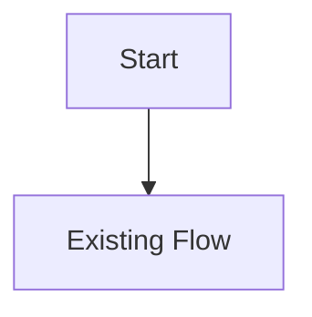
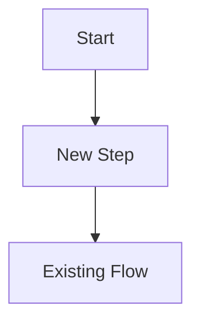

# Feature Design Template

## Feature Name

Short name.

## Status

One of:

- Investigating
- Planned
- Implementing
- Testing
- Shipped
- Paused

## Purpose

何を解決する feature かを書く。

## Scope

### In Scope

- Item 1
- Item 2

### Out of Scope

- Item 1
- Item 2

## Source Investigation

| File | Symbols | Notes |
|---|---|---|
| `path/to/file.c` | `FunctionName`, `gGlobal` | 確認した事実を書く |

## Source-Wide Impact Check

実装前に以下を確認する。対象外の場合も「対象外」と明記する。

| Check | Result / notes |
|---|---|
| Constants / IDs | `include/constants/*.h` の ID 追加・変更があるか |
| Primary data table | `src/data/*.h`、JSON、map script、generated data のどれが owner か |
| Runtime entry point | どの関数から実行されるか |
| Script command / special | `ScrCmd_*`、`data/script_cmd_table.inc`、`data/specials.inc`、`asm/macros/event.inc` の関係 |
| Callback / task | `SetMainCallback2`、`CB2_*`、`CreateTask`、`gTasks[taskId].func` の関係 |
| Field callback | `gFieldCallback`、`gFieldCallback2`、`gPostMenuFieldCallback` を使うか |
| Save / runtime state | `gSaveBlock1Ptr`、`gSaveBlock2Ptr`、`gPlayerParty`、`gEnemyParty` など |
| UI / window / sprite / text | 表示、入力、window、sprite、text fit への影響 |
| Battle / AI | battle controller、battle script、AI、battle UI への影響 |
| Build tools / generated files | `tools/` と generated file の関係 |
| Tests | `test/` に既存 coverage があるか、追加候補は何か |
| Upstream migration | `docs/upgrades/upstream_diff_checklist.md` に追加すべき file / symbol |

## Callback / Dispatch Map

該当する indirect call を記録する。

| Type | Files / symbols | Notes |
|---|---|---|
| Main callback | `SetMainCallback2`, `CB2_*`, `gMain.savedCallback` | 画面遷移と戻り先 |
| Task | `CreateTask`, `RunTasks`, `gTasks[taskId].func` | 非同期処理、fade、input |
| Script command | `ScrCmd_*`, `ScriptContext_Stop`, `waitstate` | script 停止・再開 |
| Special | `special`, `specialvar`, `gSpecialVar_Result` | C 関数呼び出しと戻り値 |
| Field callback | `gFieldCallback`, `gFieldCallback2`, `gPostMenuFieldCallback` | field return / field effect |
| Item / menu callback | `fieldUseFunc`, `exitCallback`, `newScreenCallback` | menu / item use の戻り先 |

## Current Flow

## Proposed Flow

## State and Data

| Data | Owner | Lifetime | Notes |
|---|---|---|---|
| `exampleState` | module | temporary | 目的を書く |

## Integration Points

| Point | File | Reason | Risk |
|---|---|---|---|
| Before/after function | `path/to/file.c` | 差し込み理由 | Low/Medium/High |

## Risks

| Risk | Severity | Mitigation |
|---|---|---|
| Example risk | Medium | 対策を書く |

## Test Plan

| Test | Expected |
|---|---|
| Example | Expected behavior |

## Upgrade Notes

- upstream 更新時に diff すべき file。
- rename / behavior change を確認すべき symbol。

## Open Questions

- 未確認事項を書く。
