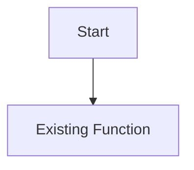

# Feature Folder Template

この template は、`docs/features/<feature>/` を作る時の最小構成。
必要な section だけを残してよいが、実装前に README / investigation / mvp_plan / risks / test_plan の役割は分ける。

## Folder Layout

```text
docs/features/<feature>/
  README.md
  investigation.md
  mvp_plan.md
  risks.md
  test_plan.md
```

## README.md

````markdown
# <Feature Name>

## Status

Status: Investigating / Planned / Implementing / Testing / Shipped / Paused
Code Status: No code changes / In progress / Implemented / Shipped

## Goal

- 何を解決する feature か。
- MVP で何を達成すればよいか。

## Current Decision

- 現時点で採用する方針。
- 採用しない方針があれば、理由と future work を書く。

## Scope

### In Scope

- MVP に含めること。

### Out of Scope

- 後続 phase に送ること。

## Docs

- [Investigation](investigation.md)
- [MVP Plan](mvp_plan.md)
- [Risks](risks.md)
- [Test Plan](test_plan.md)

## Open Questions

- 未確認事項。
````

## investigation.md

````markdown
# <Feature Name> Investigation

## Existing Files

| File | Symbols | Notes |
|---|---|---|
| `path/to/file.c` | `FunctionName`, `gGlobal` | 確認した事実を書く。 |

## Existing Flow



## Source-Wide Impact Check

| Check | Result / notes |
|---|---|
| Constants / IDs | 対象外 / 要変更 / 未確認 |
| Primary data table | 対象外 / 要変更 / 未確認 |
| Runtime entry point | 対象外 / 要変更 / 未確認 |
| Script command / special | 対象外 / 要変更 / 未確認 |
| Callback / task | 対象外 / 要変更 / 未確認 |
| Save / runtime state | 対象外 / 要変更 / 未確認 |
| UI / window / sprite / text | 対象外 / 要変更 / 未確認 |
| Battle / AI | 対象外 / 要変更 / 未確認 |
| Build tools / generated files | 対象外 / 要変更 / 未確認 |
| Tests | 対象外 / 要変更 / 未確認 |
| Upstream migration | 対象外 / 要変更 / 未確認 |

## Open Questions

- 未確認事項。
````

## mvp_plan.md

````markdown
# <Feature Name> MVP Plan

## MVP

- MVP で実装する最小仕様。

## Non-Goals

- 今回やらないこと。

## Implementation Steps

| Step | Files | Notes |
|---|---|---|
| 1 | `path/to/file.c` | 何を変更するか。 |

## Current Contract

- 入力。
- 出力。
- runtime behavior。
- fallback / disabled behavior。

## Future Work

- 後続 feature / revision に送ること。

## Open Questions

- 未決定事項。
````

## risks.md

````markdown
# <Feature Name> Risks

## Risks

| Risk | Severity | Impact | Mitigation |
|---|---|---|---|
| Example | Medium | 何が壊れるか。 | 対策。 |

## Impact Notes

- owning feature として他 feature へ与える影響。
- downstream docs を直接更新する必要があるか。

## Accepted Risks

- MVP では受け入れるリスク。

## Open Questions

- 未解決リスク。
````

## test_plan.md

````markdown
# <Feature Name> Test Plan

## Build / Lint

| Test | Command | Expected |
|---|---|---|
| Build | `make` | Build passes. |

## Focused Tests

| Test | Steps | Expected |
|---|---|---|
| Example | 手順を書く。 | 期待結果を書く。 |

## Manual Checks

| Check | Steps | Expected |
|---|---|---|
| Example | 手順を書く。 | 期待結果を書く。 |

## Results

| Date | Command / check | Result | Notes |
|---|---|---|---|
| YYYY-MM-DD | `make` | Not run | 理由を書く。 |

## Feature Complete Gate

- build / test が通った。
- 未実行 test が accepted risk / future work に分かれている。
- README の current decision と実装が一致している。

## Open Questions

- 未確認事項。
````
