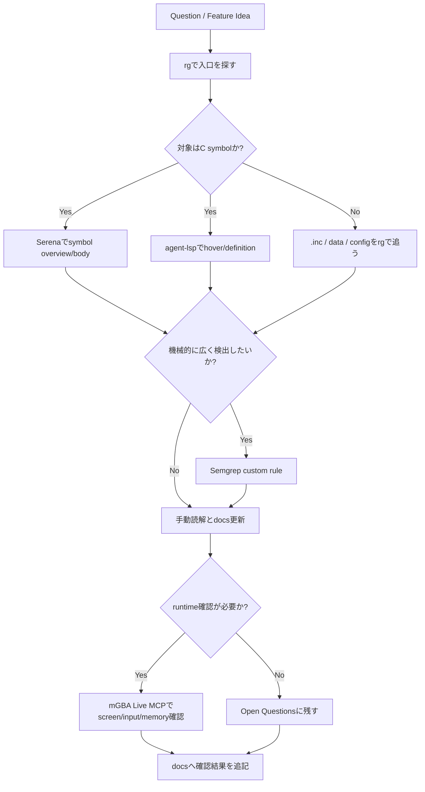

# Investigation Tooling Guide

## Purpose

この文書は、今後 pokeemerald-expansion を調査・改造設計するときに、`rg`、Serena、agent-lsp、Semgrep、mGBA Live MCP、Context7、Playwright をどう使い分けるかを整理する。

原則として、既存 source は読み取り専用で扱う。実装許可が出るまで、`src/`、`include/`、`data/`、`tools/`、`Makefile`、`config` などは編集しない。今回のような調査記録・復旧情報は `docs/` 配下だけに追加する。

## Related Inventory Files

| File | Purpose |
|---|---|
| `docs/tools/mcp_servers_inventory.json` | MCP server の sanitized inventory。API key や token は含めない。 |
| `docs/tools/tool_dependency_inventory.json` | apt packages、CLI tools、local artifacts、optional dependencies の復旧用 inventory。 |
| `docs/tools/mgba_live_mcp_rebuild_checklist.md` | mGBA Live MCP と Lua scripting 対応 mGBA build の詳細復旧手順。 |

## Tool Selection Matrix

| Tool | Use first when | Strength | Limitation / Caution |
|---|---|---|---|
| `rg` / shell read commands | ファイル、macro、`.inc`、flag/var、文字列参照を広く探す | 最速。script macro や generated data に強い | 構文理解はしない。大量 hit は絞り込みが必要。 |
| Serena | C symbol の overview、function body、symbol reference を見たい | 大きい C file を読む前の地図作りに強い | `.inc`、macro 展開、callback table は漏れることがある。 |
| agent-lsp / clangd | hover、definition、diagnostics、型情報を確認したい | C symbol の型や宣言位置をすぐ確認できる | 現状 `u8` 未解決などの diagnostics が残る。診断は参考扱い。 |
| Semgrep MCP | 危険 pattern や独自 rule を機械的に探したい | `SetMainCallback2($X)` など C pattern の検出に強い | direct path scan は今回 MCP/RPC error が出た。custom rule + relative in-memory path が安定。 |
| mGBA Live MCP | 実行時の画面遷移、OAM、memory、input、Lua を確認したい | UI/transition/field/battle runtime 検証に強い | source build の mGBA が必要。session を残さないよう stop が必要。 |
| Context7 | 外部 tool/library の最新 docs が必要 | current docs の取得に強い | API key を docs に書かない。project source の代替にはしない。 |
| Playwright MCP | mdBook や Web UI の表示確認が必要 | browser screenshot と DOM 操作に強い | GBA 画面確認には mGBA Live MCP を使う。 |

## Recommended Investigation Flow

## Current Verified Tool State

| Tool | Current result |
|---|---|
| Serena | `Serena 1.2.0`。active project は `pokeemerald-expansion`、backend は `LSP`。 |
| agent-lsp | `c:clangd` を検出。`BattleSetup_StartTrainerBattle` の hover は成功。 |
| clangd | `/usr/bin/clangd`、Ubuntu clangd `18.1.3`。 |
| Semgrep | `1.161.0`。supported languages に `c` / `cpp` / `generic` を含む。 |
| Semgrep custom rule | relative in-memory file `semgrep-mcp-smoke.c` で `SetMainCallback2($X)` の検出に成功。 |
| Semgrep learnset smoke | relative in-memory file `pokemon-learnset-smoke.c` で `CanLearnTeachableMove` style の `MOVE_UNAVAILABLE` sentinel loop 検出に成功。 |
| mGBA Live MCP | `mgba-live-mcp 0.5.0`。working mGBA は `.cache/mgba-script-build-master/qt/mgba-qt`。 |
| Node/npm | Node `v24.11.1`、npm `11.6.2`。Context7 / Playwright の `npx` runner に使用。 |

## Known Limitations

### agent-lsp / clangd

`src/battle_setup.c` を開いたとき、hover は成功したが diagnostics には `unknown type name 'u8'` と `fatal_too_many_errors` が出た。したがって現時点では、agent-lsp は以下の用途に限定する。

- function signature / declaration の確認
- `go_to_definition` / hover の補助
- LSP parse が通る範囲の diagnostics 参考確認

diagnostics を根拠に source 修正を判断する前に、`rg`、実際の include、build 結果で必ず裏取りする。

### Semgrep MCP

今回の確認では、`semgrep_scan` に absolute path を渡す形式は schema と実装の不一致があり、dictionary 形式に直しても MCP/RPC connection error が出た。一方、`semgrep_scan_with_custom_rule` は relative path + content で動作した。

今後はまず次の用途に使う。

- 小さな C snippet に対する rule smoke test
- `rg` で候補 file を絞った後、必要部分を custom rule で検査
- `SetMainCallback2($X)`、`gMain.savedCallback = $X`、`gPlayerParty[$I] = $MON` などの構文 pattern の検出

大規模 scan が必要な場合は、MCP ではなく CLI fallback を検討する。sandbox 内では `semgrep --version` が `~/.semgrep` へ書こうとして失敗したため、確認時は `HOME=/tmp semgrep --version` が安定した。

### mGBA Live MCP

system package の `/usr/games/mgba-qt` は通常 emulator として使えるが、今回確認した範囲では `--script` bridge に不十分だった。runtime 自動検証には `.cache/mgba-script-build-master/qt/mgba-qt` を使う。

session を開始したら、調査終了時に必ず stop する。UI screenshot や memory dump は必要に応じて `/tmp` か local-only artifact に出す。

## Feature Investigation Patterns

| Feature Area | First pass | Deep follow-up | Runtime check |
|---|---|---|---|
| Trainer battle pre-selection | `rg trainerbattle`, `BattleSetup_StartTrainerBattle`, `CB2_InitBattle`, `gPlayerParty` | Serena symbol body、agent-lsp hover、Semgrep callback/party write rules | mGBA Live MCPで battle start/end screen と party restore を確認 |
| `.inc` map scripts / flags / vars | `rg` over `data/maps/**/*.inc`, `data/scripts/**/*.inc`, `include/constants/flags.h`, `vars.h` | script command docs と macro 定義を照合 | field event/NPC disappear/movement を mGBA で確認 |
| TM shop migration | `rg FLAG_RECEIVED_TM`, `giveitem ITEM_TM`, mart data | flag/var usage table を docs に追記 | item pickup 削除後の map/NPC/event 表示を確認 |
| Field move modernization | `rg MonKnowsMove`, field effect files, HM item constants | callback / field effect / animation flow を読む | Cut/Surf/Strength 等の animation と object state を確認 |
| Battle aftercare / release | battle end callbacks、whiteout flow、healing functions | party mutation sites を Semgrep/rg で洗い出す | battle loss/win/field return を mGBA で確認 |
| DexNav / save UI | DexNav source、saveblock structs、menu callbacks | save data layout と UI draw functions を読む | menu open/close、icons、save persistence を確認 |
| Randomizer / trainer party reorder | trainer party data、party pool tutorial、encounter tables | generated data / constants / scripts の依存を洗う | encounter/battle party result を runtime 確認 |
| Pokemon data / learnsets | `include/pokemon.h`, `include/config/pokemon.h`, `src/data/pokemon/**`, `tools/learnset_helpers/**` | generated `teachable_learnsets.h` と `all_learnables.json` の生成経路を確認 | move relearner UI と learn result を mGBA で確認 |

## Pokemon Data Tooling Pack

Pokemon data / learnset を調べるときは、次の順に見る。

1. `rg` で constants と data owner を探す。
2. Serena で `include/pokemon.h` / `src/pokemon.c` の symbol overview を見る。
3. agent-lsp で関数 signature と declaration を確認する。
4. `tools/learnset_helpers/*.py` と `Makefile` の生成 rule を読む。
5. 必要なら Semgrep custom rule で `SetMonData`, `GetMonData`, `CanLearnTeachableMove`, `GetSpeciesLevelUpLearnset` の参照を機械的に抽出する。
6. UI/画面遷移の影響は mGBA Live MCP で screenshot / input / memory を確認する。

Related docs:

- `docs/overview/pokemon_data_map_v15.md`
- `docs/flows/pokemon_learnset_flow_v15.md`

## JSON / Recovery Policy

MCP と依存関係は、Markdown だけではなく JSON でも残す。理由は次の通り。

- PC 初期化や cache 削除後に必要 tool を機械的に見直せる。
- Codex / MCP / shell の設定を人間が読みやすく、かつ script でも処理しやすい。
- token や API key を placeholder にできる。
- 実際の local config と tracked docs を分離できる。

Tracked docs に書いてよいもの:

- package name
- version
- command path
- non-secret args
- local-only artifact path
- tool の用途
- confirmed limitation

Tracked docs に書かないもの:

- real API key
- OAuth token
- `SEMGREP_APP_TOKEN`
- GitHub token
- private repository credential
- login URL に含まれる one-time token

## Open Questions

- `agent-lsp` / `clangd` の `u8` 未解決を完全に消すには、`.clangd`、`compile_flags.txt`、`compile_commands.json` のどれを標準化するのが良いか。
- Semgrep MCP の direct path scan error は、この MCP version 固有か、workspace/sandbox 条件によるものか。
- Context7 / Playwright の npm package version は pin すべきか。それとも docs/latest 追従を優先して `latest` を維持するか。
- `.serena/project.yml` を将来 shared docs に昇格する価値があるか。現状は local-only が安全。
- mGBA Live MCP runtime artifacts の保管場所を、repo 外 backup、Git LFS、private release artifact のどれにするか。
